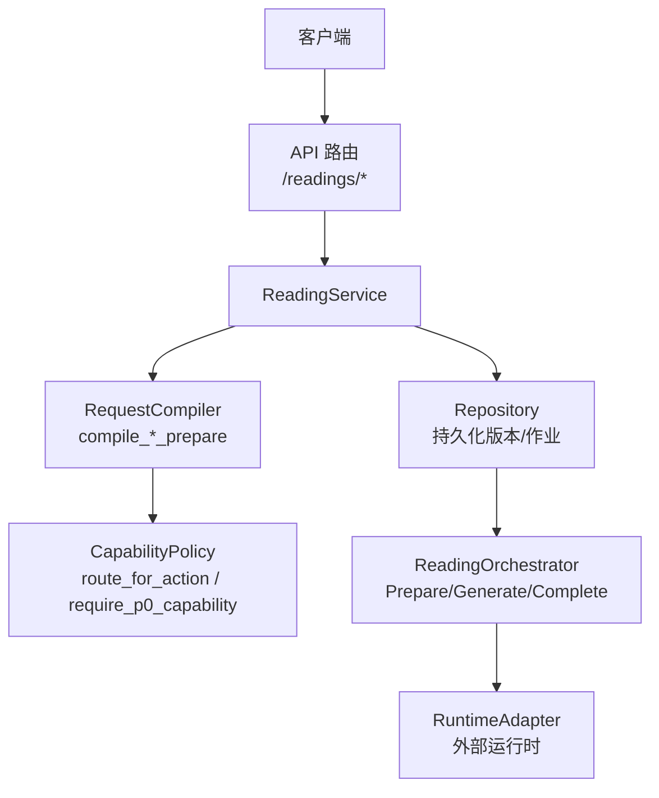
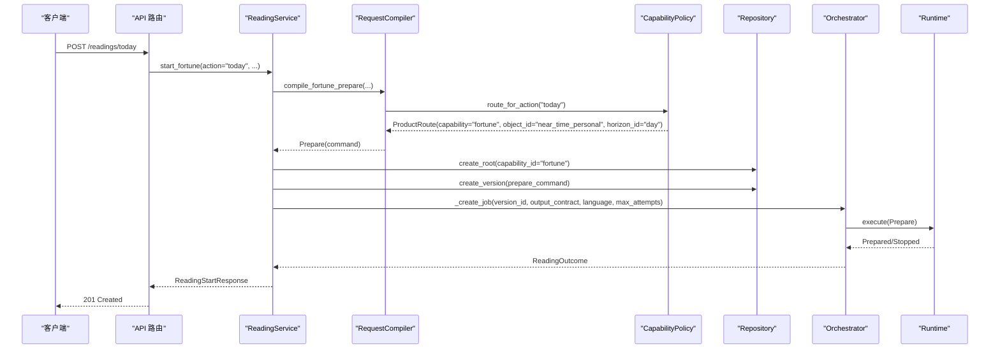
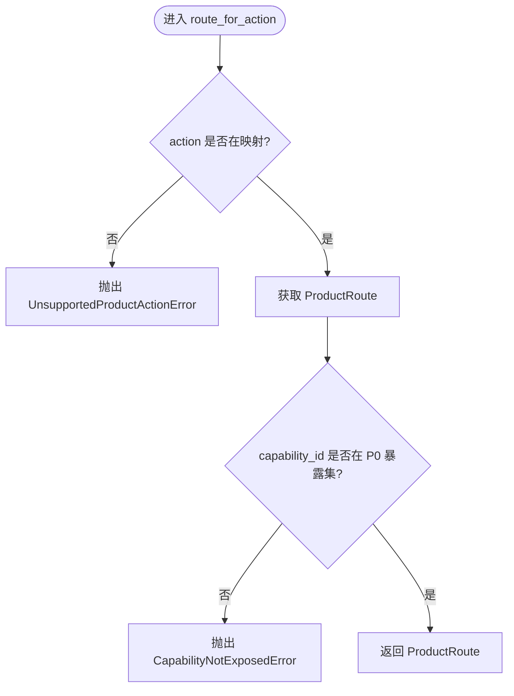
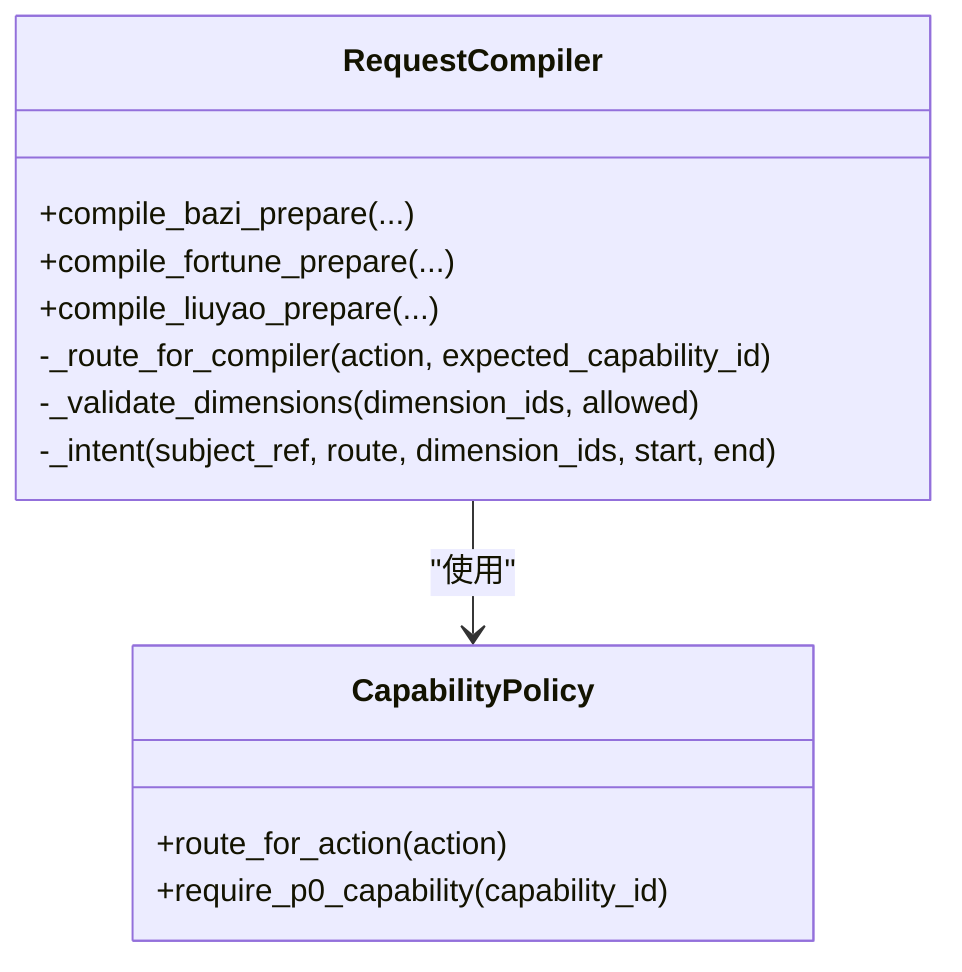
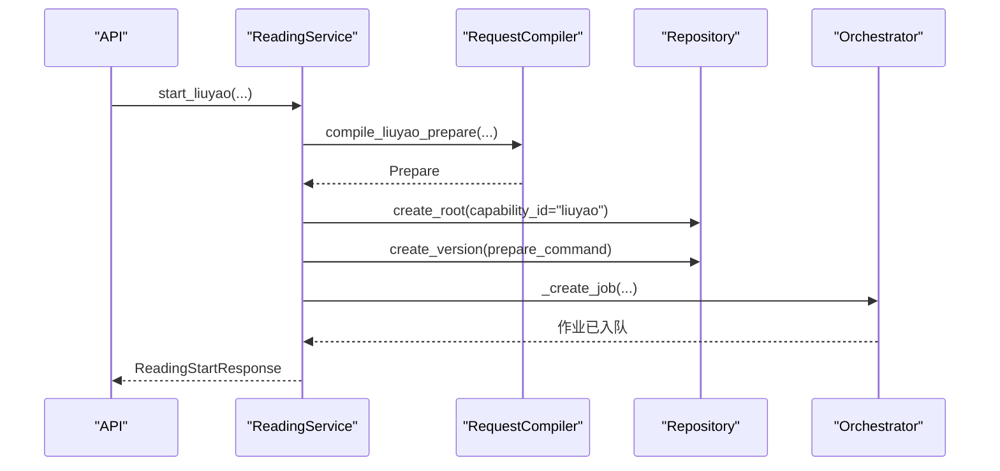
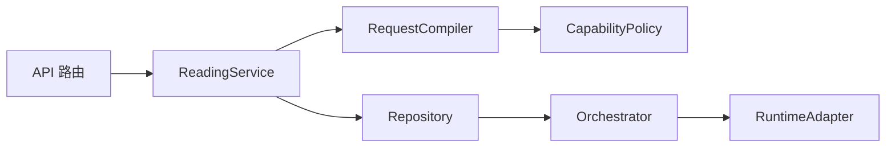

# 解读能力策略

<cite>
**本文引用的文件**
- [capability_policy.py](file://backend/app/readings/capability_policy.py)
- [request_compiler.py](file://backend/app/readings/request_compiler.py)
- [service.py](file://backend/app/readings/service.py)
- [readings.py](file://backend/app/api/readings.py)
- [orchestrator.py](file://backend/app/readings/orchestrator.py)
- [config.py](file://backend/app/config.py)
- [product-capabilities.ts](file://web/src/lib/product-capabilities.ts)
</cite>

## 目录
1. [引言](#引言)
2. [项目结构](#项目结构)
3. [核心组件](#核心组件)
4. [架构总览](#架构总览)
5. [详细组件分析](#详细组件分析)
6. [依赖关系分析](#依赖关系分析)
7. [性能与扩展性考虑](#性能与扩展性考虑)
8. [故障排查指南](#故障排查指南)
9. [结论](#结论)
10. [附录：调用示例与最佳实践](#附录调用示例与最佳实践)

## 引言
本文件系统性阐述“命理解读能力策略”的设计与实现，聚焦于如何通过能力白名单、产品路由、请求编译和权限校验，控制不同解读类型（如八字、运势、六爻）的访问。文档覆盖能力检查流程（预检查、运行时检查、权限验证）、各解读类型的配置参数与限制条件、能力策略的扩展机制，以及常见权限问题的解决方案与最佳实践。

## 项目结构
后端围绕“读取服务 + 能力策略 + 请求编译 + 编排器”的分层组织：
- API 层负责鉴权、限流、参数校验，并调用服务层。
- 服务层负责业务编排、幂等、持久化与能力标识绑定。
- 能力策略定义可暴露的能力集合与产品动作到能力的映射。
- 请求编译器将用户意图编译为运行时可执行的 Prepare 命令，并在过程中执行能力与维度校验。
- 编排器驱动运行时代码，完成准备、生成、产出组装与确认。

图表来源
- [readings.py:87-237](file://backend/app/api/readings.py#L87-L237)
- [service.py:129-254](file://backend/app/readings/service.py#L129-L254)
- [request_compiler.py:96-216](file://backend/app/readings/request_compiler.py#L96-L216)
- [capability_policy.py:5-67](file://backend/app/readings/capability_policy.py#L5-L67)
- [orchestrator.py:178-450](file://backend/app/readings/orchestrator.py#L178-L450)

章节来源
- [readings.py:87-237](file://backend/app/api/readings.py#L87-L237)
- [service.py:129-254](file://backend/app/readings/service.py#L129-L254)
- [request_compiler.py:96-216](file://backend/app/readings/request_compiler.py#L96-L216)
- [capability_policy.py:5-67](file://backend/app/readings/capability_policy.py#L5-L67)
- [orchestrator.py:178-450](file://backend/app/readings/orchestrator.py#L178-L450)

## 核心组件
- 能力策略（CapabilityPolicy）
  - 维护 V51 发布可用的能力 ID 列表与 P0 暴露能力集合。
  - 提供产品动作到能力路由的映射，确保仅允许受控的动作进入系统。
- 请求编译器（RequestCompiler）
  - 将高层产品动作编译为 Prepare 命令，同时校验维度、时间、起卦方式等约束。
  - 通过 route_for_action 强制动作与能力的一致性。
- 读取服务（ReadingService）
  - 封装 start_preview/start_fortune/start_liuyao/follow_up 等入口，绑定 capability_id 并创建版本与作业。
  - 处理输入补充、结果查询、幂等键与速率限制。
- API 路由（Readings API）
  - 统一鉴权、限流、错误映射，捕获 CapabilityNotExposedError 并返回 400。
- 编排器（ReadingOrchestrator）
  - 驱动 Prepare/Generate/Complete 生命周期，记录尝试次数、告警与状态迁移。

章节来源
- [capability_policy.py:5-67](file://backend/app/readings/capability_policy.py#L5-L67)
- [request_compiler.py:35-94](file://backend/app/readings/request_compiler.py#L35-L94)
- [service.py:129-254](file://backend/app/readings/service.py#L129-L254)
- [readings.py:87-237](file://backend/app/api/readings.py#L87-L237)
- [orchestrator.py:178-450](file://backend/app/readings/orchestrator.py#L178-L450)

## 架构总览
下图展示一次“今日运势”请求从前端到后端的完整链路，包括能力策略在预检查阶段的拦截点。

图表来源
- [readings.py:124-158](file://backend/app/api/readings.py#L124-L158)
- [service.py:167-204](file://backend/app/readings/service.py#L167-L204)
- [request_compiler.py:129-170](file://backend/app/readings/request_compiler.py#L129-L170)
- [capability_policy.py:38-67](file://backend/app/readings/capability_policy.py#L38-L67)
- [orchestrator.py:212-285](file://backend/app/readings/orchestrator.py#L212-L285)

## 详细组件分析

### 能力策略（CapabilityPolicy）
- 设计要点
  - 能力白名单：V51_RELEASE_CAPABILITY_IDS 列出所有已发布能力。
  - P0 暴露集：P0_EXPOSED_CAPABILITY_IDS 限定当前阶段对外暴露的能力（bazi、fortune、liuyao）。
  - 产品路由：_PRODUCT_ROUTES 将产品动作映射到能力、对象与时域（object_id/horizon_id）。
  - 校验函数：require_p0_capability 确保能力属于 P0 暴露集；route_for_action 校验动作合法性并返回路由。
- 关键行为
  - 当 action 不在映射中，抛出 UnsupportedProductActionError。
  - 当路由中的 capability_id 不在 P0 暴露集，抛出 CapabilityNotExposedError。

图表来源
- [capability_policy.py:38-67](file://backend/app/readings/capability_policy.py#L38-L67)

章节来源
- [capability_policy.py:5-67](file://backend/app/readings/capability_policy.py#L5-L67)

### 请求编译器（RequestCompiler）
- 职责
  - 将产品动作编译为 Prepare 命令，注入 intent（包含 capability_id、object_id、horizon、dimension_ids）。
  - 校验维度白名单、时区有效性、起卦方式与取值范围。
- 与能力策略的协作
  - 通过 _route_for_compiler 调用 route_for_action，并断言返回的 capability_id 与预期一致，防止越权。
- 各解读类型的关键约束
  - 八字（bazi）
    - 维度白名单：overview、career。
    - 事实字段：出生信息、时区、地点、性别、时间基准策略、子时策略、坐标等。
  - 运势（fortune）
    - 维度白名单：career。
    - 时区不可被覆盖；参考日期由服务器时间归一化；日/周时域自动计算起止日期。
  - 六爻（liuyao）
    - 维度白名单：career、outcome、timing。
    - 起卦方式支持数字硬币或 6..9 的六次抛掷序列；事件时间需带时区并归一化。

图表来源
- [request_compiler.py:35-94](file://backend/app/readings/request_compiler.py#L35-L94)
- [capability_policy.py:53-67](file://backend/app/readings/capability_policy.py#L53-L67)

章节来源
- [request_compiler.py:96-216](file://backend/app/readings/request_compiler.py#L96-L216)

### 读取服务（ReadingService）
- 入口方法
  - start_preview：绑定 capability_id="bazi"，编译八字准备命令。
  - start_fortune：绑定 capability_id="fortune"，编译运势准备命令，校验 action 为 today/near_seven。
  - start_liuyao：绑定 capability_id="liuyao"，编译六爻准备命令，支持数字硬币或手动抛掷。
- 其他能力
  - follow_up：基于已接受副本继续同一 lineage，复用 state_token。
- 输入补充
  - supply_input：按 runtime 返回的 input_request 校验并合并事实，重新提交 Prepare。
- 幂等与速率
  - 使用 Idempotency-Key 防重放；全局速率限制在 API 层应用。

图表来源
- [service.py:206-254](file://backend/app/readings/service.py#L206-L254)
- [request_compiler.py:183-216](file://backend/app/readings/request_compiler.py#L183-L216)

章节来源
- [service.py:129-254](file://backend/app/readings/service.py#L129-L254)
- [service.py:256-292](file://backend/app/readings/service.py#L256-L292)
- [service.py:367-427](file://backend/app/readings/service.py#L367-L427)

### API 路由（Readings API）
- 统一处理
  - 鉴权：require_owner_csrf / require_owner。
  - 限流：check_rate_limiter。
  - 错误映射：将 ReadingServiceError 映射为 ApiProblem；捕获 CapabilityNotExposedError 返回 400。
- 端点
  - /preview、/today、/week、/liuyao：启动不同解读。
  - /{id}/input：补充运行时输入。
  - /{id}/result：获取结果。
  - /{id}/verification：提交验证。
  - /{id}/follow-up：基于已接受副本发起追问。

章节来源
- [readings.py:87-237](file://backend/app/api/readings.py#L87-L237)
- [readings.py:281-399](file://backend/app/api/readings.py#L281-L399)

### 编排器（ReadingOrchestrator）
- 生命周期
  - run：根据 checkpoint 决定下一步（_prepare/_generate/_complete）。
  - _prepare：调用运行时执行 Prepare，处理 Stopped/Prepared/Transport 异常。
  - _generate：调用模型生成，进行叙事守卫校验，组装公开副本，记录尝试次数与告警。
  - _complete：调用 Complete 确认，校验 token 与副本一致性。
- 健壮性
  - 重试退避、延迟队列、运行时未知状态标记、成本告警。

章节来源
- [orchestrator.py:178-450](file://backend/app/readings/orchestrator.py#L178-L450)

## 依赖关系分析
- 耦合关系
  - API 依赖 Service；Service 依赖 Repository 与 RequestCompiler；RequestCompiler 依赖 CapabilityPolicy；Orchestrator 依赖 Runtime/Model/Guard/Assembler。
- 外部依赖
  - 运行时适配器、模型适配器、数据库会话、速率限制器。
- 潜在循环
  - 无直接循环依赖；分层清晰。

图表来源
- [readings.py:87-237](file://backend/app/api/readings.py#L87-L237)
- [service.py:129-254](file://backend/app/readings/service.py#L129-L254)
- [request_compiler.py:96-216](file://backend/app/readings/request_compiler.py#L96-L216)
- [capability_policy.py:38-67](file://backend/app/readings/capability_policy.py#L38-L67)
- [orchestrator.py:178-450](file://backend/app/readings/orchestrator.py#L178-L450)

章节来源
- [readings.py:87-237](file://backend/app/api/readings.py#L87-L237)
- [service.py:129-254](file://backend/app/readings/service.py#L129-L254)
- [request_compiler.py:96-216](file://backend/app/readings/request_compiler.py#L96-L216)
- [capability_policy.py:38-67](file://backend/app/readings/capability_policy.py#L38-L67)
- [orchestrator.py:178-450](file://backend/app/readings/orchestrator.py#L178-L450)

## 性能与扩展性考虑
- 性能
  - 编排器对 Prepare/Complete 设置退避时间，避免雪崩。
  - 最大尝试次数限制，失败后进入延迟队列，降低无效重试。
  - 模型调用成本与告警记录，便于容量规划。
- 扩展性
  - 新增解读能力：在 CapabilityPolicy 中添加能力 ID 与 P0 暴露（如需），在 _PRODUCT_ROUTES 增加动作映射；在 RequestCompiler 添加对应 compile_*_prepare 与维度白名单；在 Service 提供入口方法；在 API 注册端点。
  - 自定义权限规则：可在 API 层引入订阅/配额检查，或在 Service 层结合用户身份与订阅状态进行放行/拒绝。

[本节为通用指导，不直接分析具体文件]

## 故障排查指南
- 常见问题与定位
  - 400 Invalid request：通常来自 CapabilityNotExposedError 或 RequestCompilationError。检查 action 是否合法、capability_id 是否在 P0 暴露集、维度是否在白名单。
  - 409 Conflict：幂等键冲突或重复提交；检查 Idempotency-Key 是否与之前相同且 payload 一致。
  - 404 Not found：读取版本不存在或不属于当前所有者；检查 version_id 与 owner。
  - 503 Unavailable：运行时未注册或不可用；检查 Runtime Release 是否已登记。
- 日志与告警
  - 编排器会发出 guard_rejection、delayed、model_cost、runtime_unknown 等告警，结合 job_id 追踪问题。
- 建议
  - 在 API 层统一捕获并分类错误；在服务层细化异常类型；在编排器中完善告警细节。

章节来源
- [readings.py:67-84](file://backend/app/api/readings.py#L67-L84)
- [orchestrator.py:196-210](file://backend/app/readings/orchestrator.py#L196-L210)
- [orchestrator.py:301-394](file://backend/app/readings/orchestrator.py#L301-L394)

## 结论
本系统通过“能力策略 + 请求编译 + 服务编排”的分层设计，实现了严格的解读能力访问控制与稳定的执行流程。P0 阶段仅暴露 bazi、fortune、liuyao 三大能力，并通过产品动作到能力路由的强约束，确保请求的合法性与安全性。后续可通过扩展能力白名单、增加订阅/配额检查与自定义权限规则，平滑演进到更丰富的商业化能力矩阵。

[本节为总结，不直接分析具体文件]

## 附录：调用示例与最佳实践

- 能力检查流程
  - 预检查：API 层鉴权与限流；Service 层解析参数；RequestCompiler 调用 route_for_action 校验动作与能力映射。
  - 运行时检查：Orchestrator 执行 Prepare/Generate/Complete，处理传输异常与状态迁移。
  - 权限验证：CapabilityPolicy.require_p0_capability 确保能力属于 P0 暴露集；未来可扩展订阅/配额检查。
- 各解读类型配置要点
  - 八字：维度限于 overview/career；事实包含出生信息与坐标等。
  - 运势：维度限于 career；时区不可覆盖；日/周时域自动计算。
  - 六爻：维度限于 career/outcome/timing；起卦支持数字硬币或 6..9 的六次抛掷；事件时间需带时区。
- 添加新解读能力步骤
  - 在 CapabilityPolicy 中添加能力 ID 与 P0 暴露（如需），更新 _PRODUCT_ROUTES。
  - 在 RequestCompiler 中新增 compile_*_prepare 与维度白名单。
  - 在 Service 中新增入口方法，绑定 capability_id 并创建版本与作业。
  - 在 API 中注册端点，处理错误映射与响应。
- 自定义策略实现方法
  - 在 API 层引入订阅/配额检查中间件，依据用户身份与订阅状态决定是否放行。
  - 在 Service 层结合 OwnerProtocol 与订阅数据，拒绝超限额或过期订阅的请求。
- 常见权限问题解决方案
  - 动作未映射：检查 _PRODUCT_ROUTES 是否包含该 action。
  - 能力未暴露：检查 P0_EXPOSED_CAPABILITY_IDS 是否包含该 capability_id。
  - 维度非法：检查维度白名单与传入 dimension_ids。
  - 幂等冲突：确保 Idempotency-Key 唯一且与 payload 匹配。
  - 运行时不可用：登记 Runtime Release 并确保生产环境路径与摘要正确。

章节来源
- [capability_policy.py:5-67](file://backend/app/readings/capability_policy.py#L5-L67)
- [request_compiler.py:96-216](file://backend/app/readings/request_compiler.py#L96-L216)
- [service.py:129-254](file://backend/app/readings/service.py#L129-L254)
- [readings.py:87-237](file://backend/app/api/readings.py#L87-L237)
- [config.py:22-42](file://backend/app/config.py#L22-L42)
- [product-capabilities.ts:34-92](file://web/src/lib/product-capabilities.ts#L34-L92)