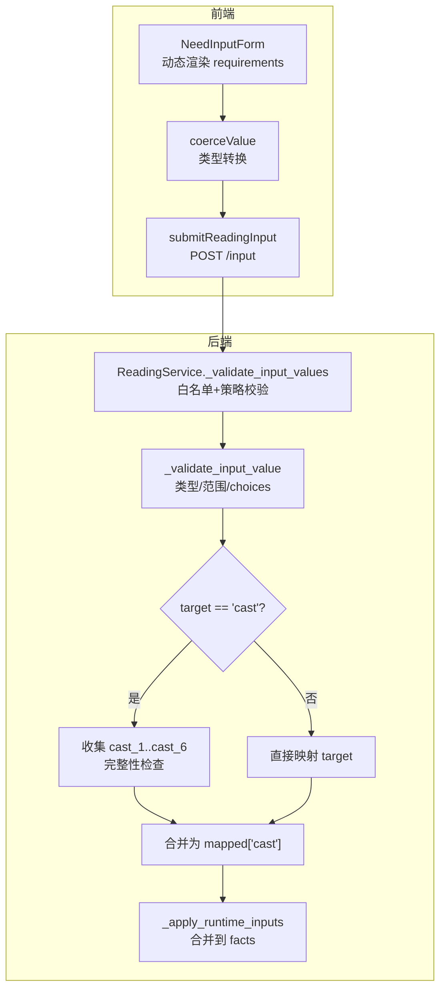
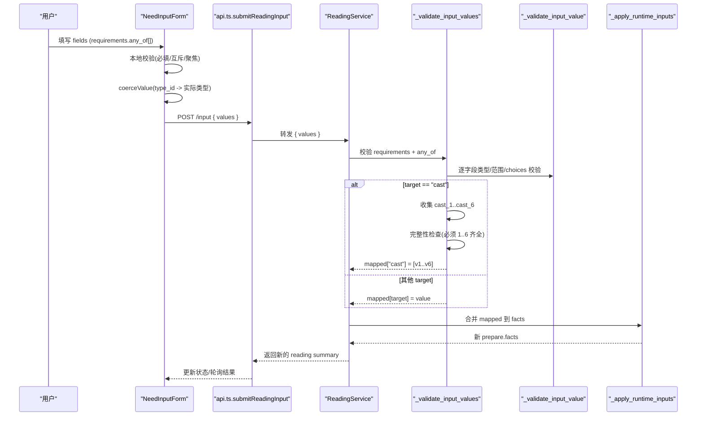
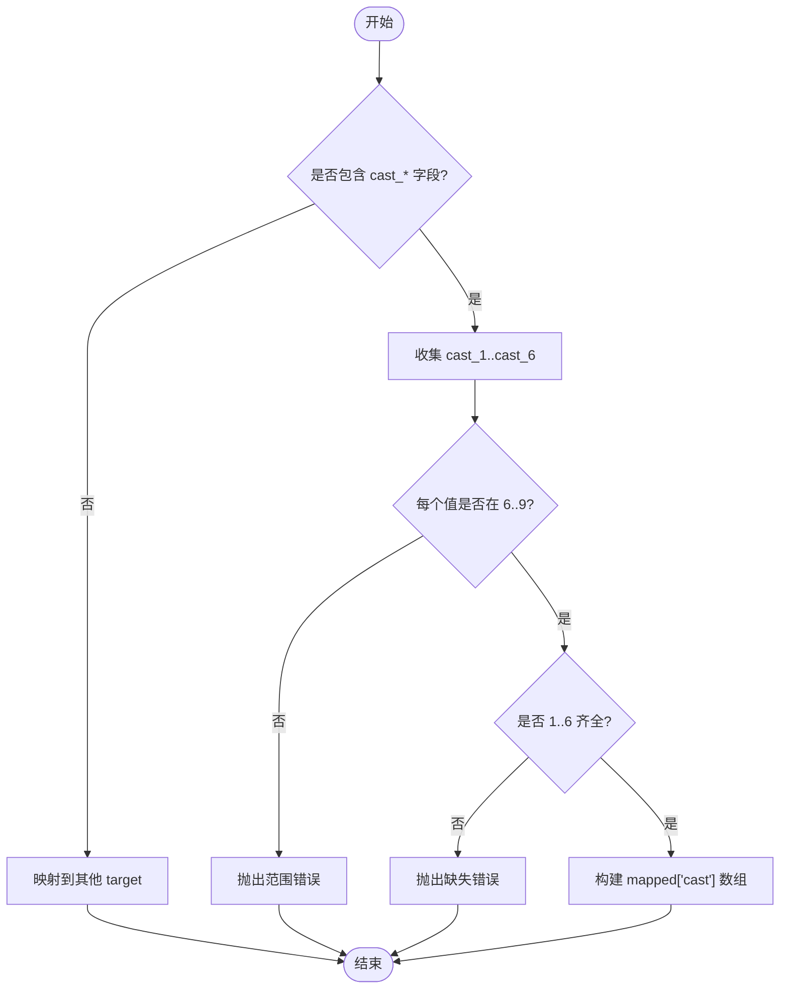
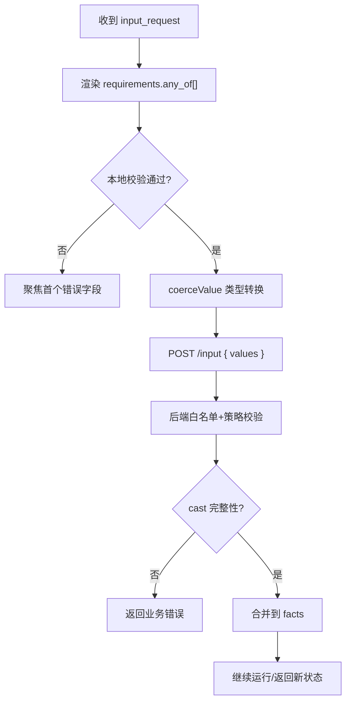
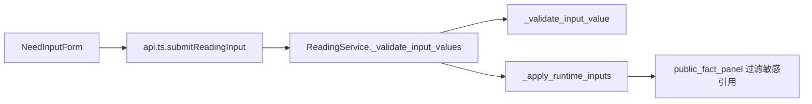

# 输入验证机制

<cite>
**本文引用的文件**
- [backend/app/readings/service.py](file://backend/app/readings/service.py)
- [web/src/components/readings/need-input-form.tsx](file://web/src/components/readings/need-input-form.tsx)
- [web/src/lib/api.ts](file://web/src/lib/api.ts)
- [contracts/schemas/mingli-result-v2.schema.json](file://contracts/schemas/mingli-result-v2.schema.json)
- [backend/app/readings/public_fact_panel.py](file://backend/app/readings/public_fact_panel.py)
- [backend/app/api/errors.py](file://backend/app/api/errors.py)
</cite>

## 目录
1. [简介](#简介)
2. [项目结构](#项目结构)
3. [核心组件](#核心组件)
4. [架构总览](#架构总览)
5. [详细组件分析](#详细组件分析)
6. [依赖关系分析](#依赖关系分析)
7. [性能考虑](#性能考虑)
8. [故障排查指南](#故障排查指南)
9. [结论](#结论)
10. [附录](#附录)

## 简介
本文件系统性说明命理解读系统中的“输入验证机制”，重点覆盖：
- InputFieldPolicy 的设计原理与字段类型（integer、text、textarea、choice）的验证规则
- 六爻占卜中 cast 字段的特殊验证：数值范围限制与完整性检查
- 动态输入请求处理流程：根据 runtime 返回的 requirements 动态生成前端表单并校验用户输入
- 输入值映射机制：将前端提交值转换为 runtime 期望的事实数据格式
- 错误分类与处理策略：业务规则违反 vs 数据格式错误
- 自定义验证规则的扩展方法与错误响应格式化建议
- 常见输入问题的调试技巧与用户体验优化建议

## 项目结构
输入验证贯穿前后端：
- 后端服务负责解析 runtime 返回的 input_request，依据白名单策略进行强校验与映射，再合并到 facts 继续执行。
- 前端根据 input_request.requirements 动态渲染表单，做本地必填与互斥校验，提交前对值进行类型转换，最终通过 API 提交 values。

**图表来源**
- [web/src/components/readings/need-input-form.tsx:65-162](file://web/src/components/readings/need-input-form.tsx#L65-L162)
- [web/src/lib/api.ts:490-498](file://web/src/lib/api.ts#L490-L498)
- [backend/app/readings/service.py:677-731](file://backend/app/readings/service.py#L677-L731)
- [backend/app/readings/service.py:751-785](file://backend/app/readings/service.py#L751-L785)
- [backend/app/readings/service.py:788-798](file://backend/app/readings/service.py#L788-L798)

**章节来源**
- [web/src/components/readings/need-input-form.tsx:65-162](file://web/src/components/readings/need-input-form.tsx#L65-L162)
- [web/src/lib/api.ts:490-498](file://web/src/lib/api.ts#L490-L498)
- [backend/app/readings/service.py:677-731](file://backend/app/readings/service.py#L677-L731)

## 核心组件
- InputFieldPolicy：定义每个允许的前端字段 ID 到目标事实键的映射、允许的 type_id、以及数值范围约束（minimum/maximum）。
- _INPUT_FIELD_POLICIES：全局白名单，仅允许已知字段进入系统，防止任意字段注入。
- ReadingService._validate_input_values：校验 requirements 结构、any_of 互斥选择、未知字段拒绝、按策略校验类型/范围/choices，并将 cast 字段聚合为数组。
- _validate_input_value：针对 integer/text/textarea/choice 的具体校验逻辑。
- NeedInputForm：根据 requirements.any_of[] 动态渲染表单，实现组内单选、必填提示、本地错误聚焦与提交前类型转换。
- submitReadingInput：前端 API 客户端封装，统一发送 { values } 到后端 /input 接口。

**章节来源**
- [backend/app/readings/service.py:88-114](file://backend/app/readings/service.py#L88-L114)
- [backend/app/readings/service.py:677-731](file://backend/app/readings/service.py#L677-L731)
- [backend/app/readings/service.py:751-785](file://backend/app/readings/service.py#L751-L785)
- [web/src/components/readings/need-input-form.tsx:65-162](file://web/src/components/readings/need-input-form.tsx#L65-L162)
- [web/src/lib/api.ts:490-498](file://web/src/lib/api.ts#L490-L498)

## 架构总览
下图展示从前端表单到后端事实合并的完整调用链，包括动态表单生成、本地校验、API 提交、后端白名单与策略校验、cast 完整性检查、以及最终合并到 facts。

**图表来源**
- [web/src/components/readings/need-input-form.tsx:95-162](file://web/src/components/readings/need-input-form.tsx#L95-L162)
- [web/src/lib/api.ts:490-498](file://web/src/lib/api.ts#L490-L498)
- [backend/app/readings/service.py:677-731](file://backend/app/readings/service.py#L677-L731)
- [backend/app/readings/service.py:751-785](file://backend/app/readings/service.py#L751-L785)
- [backend/app/readings/service.py:788-798](file://backend/app/readings/service.py#L788-L798)

## 详细组件分析

### InputFieldPolicy 设计与字段类型验证
- 设计要点
  - 白名单控制：仅 _INPUT_FIELD_POLICIES 中声明的 field_id 可被接受，避免任意字段注入。
  - 类型白名单：每个 policy 限定 type_ids，前端 type_id 必须匹配。
  - 数值范围：支持 minimum/maximum，用于整数或浮点输入的范围约束。
  - 目标映射：policy.target 决定该字段在运行时 facts 中的写入位置；cast 字段聚合为数组。
- 已支持的字段与类型
  - cast_1..cast_6：type_id=integer，范围 6..9，target="cast"
  - zi_policy：type_id=choice，target="zi_hour_policy"
  - fixture_input：type_id=text|textarea，target="fixture_input"
- 字段类型验证规则
  - integer：必须是整型
  - text/textarea：必须是字符串且非空（去除空白后）
  - choice：必须是字符串，且必须在 choices 列表中
  - 其他类型：拒绝

**章节来源**
- [backend/app/readings/service.py:88-114](file://backend/app/readings/service.py#L88-L114)
- [backend/app/readings/service.py:751-785](file://backend/app/readings/service.py#L751-L785)

### 六爻 cast 字段的特殊验证
- 字段命名约定：cast_1..cast_6，分别对应初爻至上爻
- 数值范围限制：每个 cast 值必须为整数且在 6..9 范围内
- 完整性检查：若存在任一 cast 输入，则必须提供全部六个 cast 值，否则报错
- 映射行为：当检测到 cast 字段时，收集各爻位值并按顺序组装为数组，写入 mapped["cast"]

**图表来源**
- [backend/app/readings/service.py:710-731](file://backend/app/readings/service.py#L710-L731)
- [backend/app/readings/service.py:751-773](file://backend/app/readings/service.py#L751-L773)

**章节来源**
- [backend/app/readings/service.py:710-731](file://backend/app/readings/service.py#L710-L731)
- [backend/app/readings/service.py:751-773](file://backend/app/readings/service.py#L751-L773)

### 动态输入请求处理流程
- 前端渲染
  - 读取 result 中的 input_request.requirements
  - 每个 requirement.any_of[] 表示一组互斥字段，组内只能填一项
  - 单字段组视为必填；多字段组至少填一项
  - 根据 type_id 渲染不同控件（文本、多选下拉、布尔等）
  - 提交前进行本地校验：必填、互斥、聚焦首个错误字段
  - 提交前对值进行类型转换（coerceValue），如 integer 转 Number
- 后端校验
  - 校验 requirements 结构合法
  - 校验 each any_of 恰好选择一个字段
  - 拒绝任何未在白名单中的字段
  - 按策略校验类型、范围、choices
  - 将映射后的值合并到 facts，继续运行

**图表来源**
- [web/src/components/readings/need-input-form.tsx:95-162](file://web/src/components/readings/need-input-form.tsx#L95-L162)
- [web/src/lib/api.ts:490-498](file://web/src/lib/api.ts#L490-L498)
- [backend/app/readings/service.py:677-731](file://backend/app/readings/service.py#L677-L731)

**章节来源**
- [web/src/components/readings/need-input-form.tsx:95-162](file://web/src/components/readings/need-input-form.tsx#L95-L162)
- [backend/app/readings/service.py:677-731](file://backend/app/readings/service.py#L677-L731)

### 输入值映射机制
- 映射规则
  - 若 policy.target 为 "cast"，则从 field_id 提取爻位索引，收集为数组，顺序为 1..6
  - 其他 target 直接以 policy.target 作为键写入 mapped
- 合并到 facts
  - 将 mapped 合并到 prepare.facts 的各 subject 引用下，形成新的 prepare 并继续执行
- 安全边界
  - 公共面板会过滤掉原始输入引用，只暴露派生事实，避免敏感信息泄露

**章节来源**
- [backend/app/readings/service.py:710-731](file://backend/app/readings/service.py#L710-L731)
- [backend/app/readings/service.py:788-798](file://backend/app/readings/service.py#L788-L798)
- [backend/app/readings/public_fact_panel.py:9-32](file://backend/app/readings/public_fact_panel.py#L9-L32)

### 错误分类与处理策略
- 业务规则违反
  - 例如：每组 must 选且仅选一个字段；未知字段禁止；cast 不完整；数值超出范围；choices 不在允许列表
  - 这些错误由 InvalidReadingInputError 表达，属于业务规则层面的失败
- 数据格式错误
  - 例如：integer 不是整型；text/textarea 为空；choice 不是字符串；requirements 结构不合法
  - 同样由 InvalidReadingInputError 表达，但语义上更偏向数据格式问题
- 前端处理
  - 本地错误：必填、互斥、聚焦首个错误字段
  - 服务端错误：通过 ApiError 捕获，显示 title/detail
- 后端错误模型
  - ApiProblem 提供统一的异常结构（status/title/detail），便于上层统一格式化响应

**章节来源**
- [backend/app/readings/service.py:69-71](file://backend/app/readings/service.py#L69-L71)
- [backend/app/readings/service.py:677-731](file://backend/app/readings/service.py#L677-L731)
- [backend/app/readings/service.py:751-785](file://backend/app/readings/service.py#L751-L785)
- [backend/app/api/errors.py:1-17](file://backend/app/api/errors.py#L1-L17)
- [web/src/lib/api.ts:244-284](file://web/src/lib/api.ts#L244-L284)

### 自定义验证规则的添加方法
- 新增字段策略
  - 在 _INPUT_FIELD_POLICIES 中添加新条目，指定 target、type_ids、可选 minimum/maximum
  - 确保前端 type_id 与策略一致
- 扩展类型校验
  - 在 _validate_input_value 中增加对新 type_id 的处理分支
  - 如需新增 choices 校验，可在 field.choices 中配置，后端自动校验
- 示例路径参考
  - 策略定义位置：[backend/app/readings/service.py:88-114](file://backend/app/readings/service.py#L88-L114)
  - 类型校验位置：[backend/app/readings/service.py:751-785](file://backend/app/readings/service.py#L751-L785)
  - 前端类型转换位置：[web/src/components/readings/need-input-form.tsx:32-43](file://web/src/components/readings/need-input-form.tsx#L32-L43)

**章节来源**
- [backend/app/readings/service.py:88-114](file://backend/app/readings/service.py#L88-L114)
- [backend/app/readings/service.py:751-785](file://backend/app/readings/service.py#L751-L785)
- [web/src/components/readings/need-input-form.tsx:32-43](file://web/src/components/readings/need-input-form.tsx#L32-L43)

### 错误响应的格式化
- 前端
  - ApiError 携带 status 与 detail，统一在 requestJson 中抛出
  - NeedInputForm 捕获错误并显示 message 或默认提示
- 后端
  - 使用 InvalidReadingInputError 表达输入校验失败
  - 可通过 ApiProblem 统一封装响应体（status/title/detail）
- 建议
  - 保持错误消息简洁明确，区分“业务规则”和“数据格式”两类
  - 对 cast 相关错误给出具体提示（如“缺少某爻位”、“数值不在 6..9”）

**章节来源**
- [web/src/lib/api.ts:244-284](file://web/src/lib/api.ts#L244-L284)
- [web/src/components/readings/need-input-form.tsx:149-161](file://web/src/components/readings/need-input-form.tsx#L149-L161)
- [backend/app/api/errors.py:1-17](file://backend/app/api/errors.py#L1-L17)
- [backend/app/readings/service.py:69-71](file://backend/app/readings/service.py#L69-L71)

## 依赖关系分析
- 前端依赖
  - NeedInputForm 依赖 api.ts 的 submitReadingInput
  - 依赖 contracts 中的 schema 描述（requirements/inputRequest）
- 后端依赖
  - ReadingService 依赖 repository、profiles、security.envelope
  - 依赖 public_fact_panel 过滤敏感输入引用
- 契约与一致性
  - 前端 types 与后端 schema 保持一致，确保 requirements.inputRequest 结构对齐

**图表来源**
- [web/src/components/readings/need-input-form.tsx:65-162](file://web/src/components/readings/need-input-form.tsx#L65-L162)
- [web/src/lib/api.ts:490-498](file://web/src/lib/api.ts#L490-L498)
- [backend/app/readings/service.py:677-731](file://backend/app/readings/service.py#L677-L731)
- [backend/app/readings/public_fact_panel.py:9-32](file://backend/app/readings/public_fact_panel.py#L9-L32)

**章节来源**
- [web/src/components/readings/need-input-form.tsx:65-162](file://web/src/components/readings/need-input-form.tsx#L65-L162)
- [web/src/lib/api.ts:490-498](file://web/src/lib/api.ts#L490-L498)
- [backend/app/readings/service.py:677-731](file://backend/app/readings/service.py#L677-L731)
- [backend/app/readings/public_fact_panel.py:9-32](file://backend/app/readings/public_fact_panel.py#L9-L32)

## 性能考虑
- 前端
  - 本地校验减少无效提交，降低网络开销
  - 类型转换在提交前完成，避免后端重复转换
- 后端
  - 白名单与策略校验快速失败，避免深入处理非法输入
  - cast 完整性检查集中处理，避免多次遍历
- 建议
  - 对 large choices 列表进行分页或搜索以提升交互性能
  - 对频繁提交的场景启用防抖与幂等键（已有 idempotency 支持）

## 故障排查指南
- 常见问题
  - “本组只能填写一项”：any_of 组内多选或未选
  - “所有 cast 值必需”：未提供完整的 1..6 爻位
  - “数值超出范围”：cast 值不在 6..9
  - “未知字段禁止”：提交了未在策略中声明的字段
  - “choices 不在允许列表”：选择的值不在 choices 中
- 调试步骤
  - 检查 input_request.requirements 结构是否符合 schema
  - 确认前端 type_id 与后端策略 type_ids 一致
  - 查看浏览器控制台与网络请求，确认 values 是否正确转换
  - 在后端日志中定位 InvalidReadingInputError 的具体消息
- 用户体验优化
  - 实时提示与聚焦首个错误字段
  - 对必填项提供清晰标签与描述
  - 对 cast 字段提供数字键盘与范围提示

**章节来源**
- [web/src/components/readings/need-input-form.tsx:109-162](file://web/src/components/readings/need-input-form.tsx#L109-L162)
- [backend/app/readings/service.py:677-731](file://backend/app/readings/service.py#L677-L731)
- [backend/app/readings/service.py:751-785](file://backend/app/readings/service.py#L751-L785)

## 结论
本系统的输入验证机制通过“前端动态表单 + 后端白名单策略”的双层保障，确保输入数据的合法性与安全性。InputFieldPolicy 提供了灵活的字段映射与约束能力，cast 字段的特殊处理满足六爻占卜的业务需求。错误分类清晰，便于前后端协同处理与用户反馈。通过合理的本地校验、类型转换与后端策略校验，系统在可用性与健壮性之间取得平衡。

## 附录
- 关键代码片段路径
  - 策略定义：[backend/app/readings/service.py:88-114](file://backend/app/readings/service.py#L88-L114)
  - 输入校验主流程：[backend/app/readings/service.py:677-731](file://backend/app/readings/service.py#L677-L731)
  - 字段类型校验：[backend/app/readings/service.py:751-785](file://backend/app/readings/service.py#L751-L785)
  - 动态表单与本地校验：[web/src/components/readings/need-input-form.tsx:65-162](file://web/src/components/readings/need-input-form.tsx#L65-L162)
  - API 客户端封装：[web/src/lib/api.ts:490-498](file://web/src/lib/api.ts#L490-L498)
  - Schema 契约：[contracts/schemas/mingli-result-v2.schema.json:44-76](file://contracts/schemas/mingli-result-v2.schema.json#L44-L76)
  - 敏感输入过滤：[backend/app/readings/public_fact_panel.py:9-32](file://backend/app/readings/public_fact_panel.py#L9-L32)