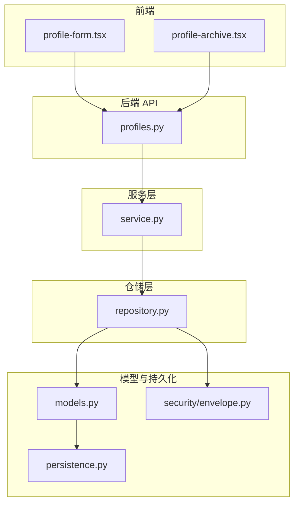
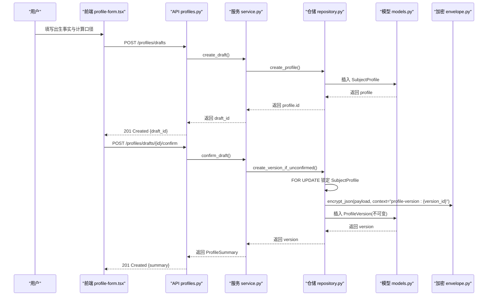
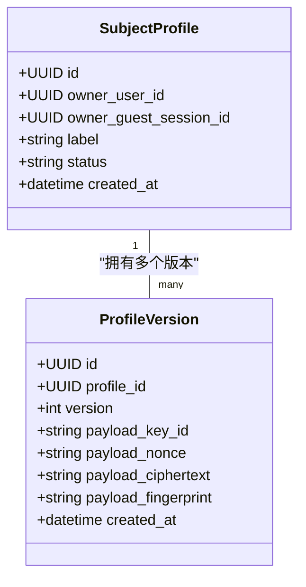
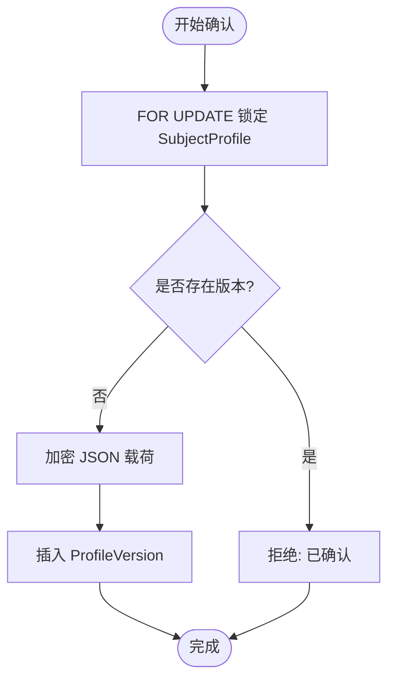
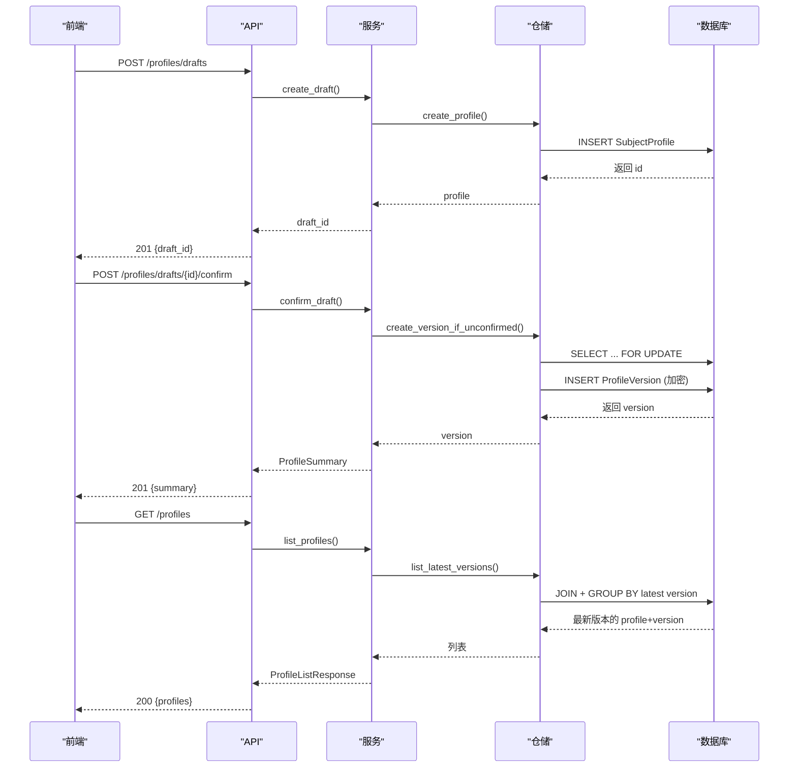
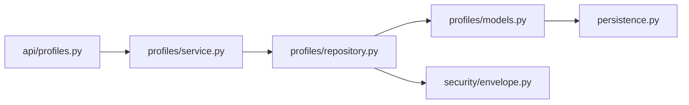

# 用户档案领域

<cite>
**本文引用的文件**
- [backend/app/profiles/models.py](file://backend/app/profiles/models.py)
- [backend/app/profiles/repository.py](file://backend/app/profiles/repository.py)
- [backend/app/profiles/service.py](file://backend/app/profiles/service.py)
- [backend/app/api/profiles.py](file://backend/app/api/profiles.py)
- [backend/app/profiles/schemas.py](file://backend/app/profiles/schemas.py)
- [backend/app/security/envelope.py](file://backend/app/security/envelope.py)
- [backend/app/persistence.py](file://backend/app/persistence.py)
- [web/src/components/profile-form.tsx](file://web/src/components/profile-form.tsx)
- [web/src/components/profile-archive.tsx](file://web/src/components/profile-archive.tsx)
- [docs/adr/0004-version-profiles-and-readings-immutably.md](file://docs/adr/0004-version-profiles-and-readings-immutably.md)
</cite>

## 目录
1. [简介](#简介)
2. [项目结构](#项目结构)
3. [核心组件](#核心组件)
4. [架构总览](#架构总览)
5. [详细组件分析](#详细组件分析)
6. [依赖关系分析](#依赖关系分析)
7. [性能与一致性](#性能与一致性)
8. [故障排查指南](#故障排查指南)
9. [结论](#结论)
10. [附录：API 契约与字段定义](#附录api-契约与字段定义)

## 简介
本领域文档聚焦“用户档案”子系统，围绕不可变版本化的 ProfileVersion 数据模型、版本控制机制、CRUD 流程、数据结构与业务规则、权限与安全存储进行系统化说明。系统采用“草稿确认即生成不可变版本”的设计，确保历史可追溯、结果可复现、审计可核验。前端提供建档表单与档案列表，后端通过 API、服务层、仓储层与加密信封实现端到端的安全与一致性保障。

## 项目结构
用户档案相关代码主要分布在后端 profiles 模块与前端 profile 页面组件中：
- 后端
  - models: 定义 SubjectProfile（主体档案）与 ProfileVersion（不可变版本）
  - repository: 封装数据库访问、行级锁、加密落库与解密读取
  - service: 编排创建草稿、确认草稿、列出最新版本的业务流程
  - api: FastAPI 路由，处理请求校验、速率限制、错误映射
  - security.envelope: AES-GCM 信封加密，带上下文绑定与指纹校验
  - persistence: 不可变记录错误类型
- 前端
  - profile-form: 收集出生事实与计算口径，调用后端创建并确认档案
  - profile-archive: 展示已保存的档案版本，支持启动解读

图表来源
- [backend/app/api/profiles.py:1-111](file://backend/app/api/profiles.py#L1-L111)
- [backend/app/profiles/service.py:1-189](file://backend/app/profiles/service.py#L1-L189)
- [backend/app/profiles/repository.py:1-198](file://backend/app/profiles/repository.py#L1-L198)
- [backend/app/profiles/models.py:1-80](file://backend/app/profiles/models.py#L1-L80)
- [backend/app/security/envelope.py:1-122](file://backend/app/security/envelope.py#L1-L122)
- [backend/app/persistence.py:1-3](file://backend/app/persistence.py#L1-L3)
- [web/src/components/profile-form.tsx:1-570](file://web/src/components/profile-form.tsx#L1-L570)
- [web/src/components/profile-archive.tsx:1-256](file://web/src/components/profile-archive.tsx#L1-L256)

章节来源
- [backend/app/profiles/models.py:1-80](file://backend/app/profiles/models.py#L1-L80)
- [backend/app/profiles/repository.py:1-198](file://backend/app/profiles/repository.py#L1-L198)
- [backend/app/profiles/service.py:1-189](file://backend/app/profiles/service.py#L1-L189)
- [backend/app/api/profiles.py:1-111](file://backend/app/api/profiles.py#L1-L111)
- [backend/app/security/envelope.py:1-122](file://backend/app/security/envelope.py#L1-L122)
- [backend/app/persistence.py:1-3](file://backend/app/persistence.py#L1-L3)
- [web/src/components/profile-form.tsx:1-570](file://web/src/components/profile-form.tsx#L1-L570)
- [web/src/components/profile-archive.tsx:1-256](file://web/src/components/profile-archive.tsx#L1-L256)

## 核心组件
- 数据模型
  - SubjectProfile: 档案主体，拥有唯一所有者（用户或访客会话），包含标签、状态、创建时间等元信息
  - ProfileVersion: 不可变版本，包含版本号、加密载荷及指纹，禁止更新
- 服务层
  - ProfileService: 提供 create_draft、confirm_draft、list_profiles、get_owned_profile_version、claim_guest_ownership 等方法
- 仓储层
  - ProfileRepository: 负责行级锁、版本分配、加密写入、解密读取、查询最新版本的聚合
- API 层
  - /profiles/drafts: 创建草稿
  - /profiles/drafts/{draft_id}/confirm: 确认草稿并生成不可变版本
  - /profiles: 列出当前所有者的最新档案版本
- 安全与持久化
  - EnvelopeCipher: AES-256-GCM 信封加密，带上下文绑定与 HMAC 指纹校验
  - ImmutableRecordError: 用于拦截对不可变记录的修改尝试

章节来源
- [backend/app/profiles/models.py:21-80](file://backend/app/profiles/models.py#L21-L80)
- [backend/app/profiles/service.py:18-189](file://backend/app/profiles/service.py#L18-L189)
- [backend/app/profiles/repository.py:15-198](file://backend/app/profiles/repository.py#L15-L198)
- [backend/app/api/profiles.py:28-111](file://backend/app/api/profiles.py#L28-L111)
- [backend/app/security/envelope.py:20-122](file://backend/app/security/envelope.py#L20-L122)
- [backend/app/persistence.py:1-3](file://backend/app/persistence.py#L1-L3)

## 架构总览
用户档案采用分层架构：API 路由接收请求并进行速率限制与鉴权；服务层编排业务逻辑；仓储层执行数据库操作与加解密；模型层定义表结构与不可变约束；前端组件驱动用户交互。

图表来源
- [backend/app/api/profiles.py:43-93](file://backend/app/api/profiles.py#L43-L93)
- [backend/app/profiles/service.py:52-105](file://backend/app/profiles/service.py#L52-L105)
- [backend/app/profiles/repository.py:57-104](file://backend/app/profiles/repository.py#L57-L104)
- [backend/app/profiles/models.py:49-80](file://backend/app/profiles/models.py#L49-L80)
- [backend/app/security/envelope.py:98-122](file://backend/app/security/envelope.py#L98-L122)

## 详细组件分析

### 数据模型与不可变设计
- SubjectProfile
  - 主键 id、所有者 user/guest 二选一约束、标签 label、状态 status、创建时间 created_at
  - 通过 CheckConstraint 保证 owner_user_id 与 owner_guest_session_id 有且仅有一个非空
- ProfileVersion
  - 主键 id、关联 profile_id、递增 version、加密载荷 key_id/nonce/ciphertext/fingerprint、创建时间
  - UniqueConstraint(profile_id, version) 保证版本唯一性
  - before_update 事件监听抛出 ImmutableRecordError，强制不可变

图表来源
- [backend/app/profiles/models.py:21-80](file://backend/app/profiles/models.py#L21-L80)

章节来源
- [backend/app/profiles/models.py:21-80](file://backend/app/profiles/models.py#L21-L80)
- [backend/app/persistence.py:1-3](file://backend/app/persistence.py#L1-L3)

### 版本控制机制与并发安全
- 行级锁序列化
  - 使用 SELECT ... WITH FOR UPDATE 锁定 SubjectProfile，避免并发确认导致重复版本
- 预检查与幂等
  - 在持有锁后检查是否已有版本，若存在则拒绝二次确认
- 版本号自增
  - 基于 max(version)+1 计算新版本号，保证单调递增
- 不可变保障
  - 数据库层 before_update 触发器抛出异常，防止误更新

图表来源
- [backend/app/profiles/repository.py:57-104](file://backend/app/profiles/repository.py#L57-L104)
- [backend/app/profiles/models.py:77-80](file://backend/app/profiles/models.py#L77-L80)

章节来源
- [backend/app/profiles/repository.py:57-104](file://backend/app/profiles/repository.py#L57-L104)
- [backend/app/profiles/models.py:77-80](file://backend/app/profiles/models.py#L77-L80)

### 档案数据结构与业务规则
- 个人信息
  - birth_datetime: ISO 8601 字符串，严格格式校验
  - timezone: IANA 时区标识，服务端与前端双重校验
  - location: 城市级地点描述，用于时区与口径确认
  - gender: male/female/other 三态枚举
- 计算口径
  - time_basis_policy: civil/solar/lunar 三种时间口径
  - zi_hour_policy: midnight/substitute/solar 子时换日策略
- 可选地理校准
  - longitude: -180~180 浮点
  - latitude: -90~90 浮点
  - coordinate_source: 坐标来源标注
- 规则要点
  - 真太阳时模式下才需要经纬度与来源；其他模式不提交这些高级字段
  - 所有字段在服务端 Pydantic Schema 中进行白名单与范围校验，前端 Zod 同步校验

章节来源
- [backend/app/profiles/schemas.py:10-60](file://backend/app/profiles/schemas.py#L10-L60)
- [web/src/components/profile-form.tsx:66-108](file://web/src/components/profile-form.tsx#L66-L108)
- [web/src/components/profile-form.tsx:458-533](file://web/src/components/profile-form.tsx#L458-L533)

### CRUD 操作流程与最佳实践
- 创建草稿
  - 前端调用 /profiles/drafts，后端创建 SubjectProfile 并返回 draft_id
- 确认草稿
  - 前端携带出生事实与口径参数调用 /profiles/drafts/{draft_id}/confirm
  - 后端加密并写入 ProfileVersion，返回摘要（含 profile_version_id、version、created_at）
- 列出最新版本
  - 前端调用 /profiles，后端按所有者聚合每个档案的最新版本
- 最佳实践
  - 前端先创建草稿再确认，避免无效确认
  - 使用稳定意图键（idempotency）发起后续解读，避免重复
  - 列表页只展示服务端返回的安全字段，敏感数据不暴露到前端

图表来源
- [backend/app/api/profiles.py:43-111](file://backend/app/api/profiles.py#L43-L111)
- [backend/app/profiles/service.py:52-113](file://backend/app/profiles/service.py#L52-L113)
- [backend/app/profiles/repository.py:27-182](file://backend/app/profiles/repository.py#L27-L182)

章节来源
- [backend/app/api/profiles.py:43-111](file://backend/app/api/profiles.py#L43-L111)
- [backend/app/profiles/service.py:52-113](file://backend/app/profiles/service.py#L52-L113)
- [backend/app/profiles/repository.py:27-182](file://backend/app/profiles/repository.py#L27-L182)

### 档案与用户的关联与权限控制
- 所有者模型
  - SubjectProfile 同时支持 user 与 guest 两种所有者，通过外键区分
  - OwnerProtocol 抽象统一接口，便于服务层以 owner.kind/owner.id 判定归属
- 访客认领
  - claim_guest_ownership 原子迁移：将访客会话下的档案、解读与幂等键迁移至已认证用户
  - 使用 with_for_update 锁定访客会话，避免竞态
- 权限边界
  - 列表与获取均按 owner 过滤，确保只能访问自有档案
  - 确认接口需 CSRF 保护，写操作受速率限制

章节来源
- [backend/app/profiles/models.py:21-47](file://backend/app/profiles/models.py#L21-L47)
- [backend/app/profiles/service.py:30-42](file://backend/app/profiles/service.py#L30-L42)
- [backend/app/profiles/service.py:130-178](file://backend/app/profiles/service.py#L130-L178)
- [backend/app/api/profiles.py:31-41](file://backend/app/api/profiles.py#L31-L41)

### 安全存储与隐私保护
- 信封加密
  - 使用 AES-256-GCM 对 JSON 载荷进行加密，附带 nonce、key_id、ciphertext
  - 通过 context 绑定“profile-version:{version_id}”，防止重放与跨上下文复用
  - 使用 HMAC 指纹验证载荷完整性，解密失败或指纹不匹配抛出错误
- 不可变审计
  - ProfileVersion 不可更新，任何修改都会产生新版本，满足审计与退款核验需求
- 最小暴露
  - 列表与摘要仅返回安全字段（如 profile_version_id、version、created_at），不暴露敏感内容

章节来源
- [backend/app/security/envelope.py:20-122](file://backend/app/security/envelope.py#L20-L122)
- [backend/app/profiles/repository.py:79-104](file://backend/app/profiles/repository.py#L79-L104)
- [backend/app/profiles/repository.py:184-198](file://backend/app/profiles/repository.py#L184-L198)
- [docs/adr/0004-version-profiles-and-readings-immutably.md:5-11](file://docs/adr/0004-version-profiles-and-readings-immutably.md#L5-L11)

## 依赖关系分析
- 模块耦合
  - API 依赖 service 与 schemas；service 依赖 repository 与 security；repository 依赖 models 与 encryption
- 外部依赖
  - SQLAlchemy 异步会话与 ORM
  - cryptography 的 AESGCM 实现
  - FastAPI 路由与依赖注入
- 潜在循环
  - 各层单向依赖，无循环引用风险

图表来源
- [backend/app/api/profiles.py:1-111](file://backend/app/api/profiles.py#L1-L111)
- [backend/app/profiles/service.py:1-189](file://backend/app/profiles/service.py#L1-L189)
- [backend/app/profiles/repository.py:1-198](file://backend/app/profiles/repository.py#L1-L198)
- [backend/app/profiles/models.py:1-80](file://backend/app/profiles/models.py#L1-L80)
- [backend/app/security/envelope.py:1-122](file://backend/app/security/envelope.py#L1-L122)
- [backend/app/persistence.py:1-3](file://backend/app/persistence.py#L1-L3)

章节来源
- [backend/app/api/profiles.py:1-111](file://backend/app/api/profiles.py#L1-L111)
- [backend/app/profiles/service.py:1-189](file://backend/app/profiles/service.py#L1-L189)
- [backend/app/profiles/repository.py:1-198](file://backend/app/profiles/repository.py#L1-L198)
- [backend/app/profiles/models.py:1-80](file://backend/app/profiles/models.py#L1-L80)
- [backend/app/security/envelope.py:1-122](file://backend/app/security/envelope.py#L1-L122)
- [backend/app/persistence.py:1-3](file://backend/app/persistence.py#L1-L3)

## 性能与一致性
- 并发一致
  - 行级锁 + 预检查避免重复确认
  - 版本号自增保证单调性
- 读写路径
  - 写路径涉及加密与数据库事务，注意连接池与超时配置
  - 读路径使用聚合查询获取最新版本，减少冗余传输
- 扩展建议
  - 为 subject_profiles 与 profile_versions 建立索引优化查询
  - 对高频读取场景考虑缓存最近列表（注意失效策略）

[本节为通用指导，不直接分析具体文件]

## 故障排查指南
- 常见错误
  - 未找到档案或版本：检查 owner 过滤与版本 ID 是否正确
  - 重复确认：检查是否已存在版本，或并发冲突被正确拒绝
  - 解密失败：检查 key_id、context、nonce/ciphertext 是否匹配
  - 访客认领失败：检查会话是否已被认领或不存在
- 定位步骤
  - 查看 API 返回的错误码与标题
  - 检查仓储层的异常抛出点（例如 IntegrityError、LookupError）
  - 核对加密信封的上下文与指纹

章节来源
- [backend/app/api/profiles.py:78-93](file://backend/app/api/profiles.py#L78-L93)
- [backend/app/profiles/service.py:18-28](file://backend/app/profiles/service.py#L18-L28)
- [backend/app/profiles/repository.py:52-77](file://backend/app/profiles/repository.py#L52-L77)
- [backend/app/security/envelope.py:75-96](file://backend/app/security/envelope.py#L75-L96)

## 结论
用户档案领域通过不可变版本化、行级锁与信封加密，实现了高可靠的历史追溯、强一致性与隐私保护。前端表单与服务端校验共同确保输入质量，API 层提供清晰的 CRUD 入口。该设计在牺牲简单覆盖更新的同时，换取了可审计、可复现与可退款的业务优势，适合命理类产品的合规与信任要求。

[本节为总结性内容，不直接分析具体文件]

## 附录：API 契约与字段定义
- 创建草稿
  - 方法: POST /profiles/drafts
  - 请求体: label（必填，长度限制）
  - 响应: draft_id、status=draft
- 确认草稿
  - 方法: POST /profiles/drafts/{draft_id}/confirm
  - 请求体: birth_datetime、timezone、location、gender、time_basis_policy、zi_hour_policy、longitude、latitude、coordinate_source（部分可选）
  - 响应: profile_id、profile_version_id、subject_ref、version、created_at
- 列出档案
  - 方法: GET /profiles
  - 响应: profiles 列表（每项为 ProfileSummary）

章节来源
- [backend/app/profiles/schemas.py:10-60](file://backend/app/profiles/schemas.py#L10-L60)
- [backend/app/api/profiles.py:43-111](file://backend/app/api/profiles.py#L43-L111)