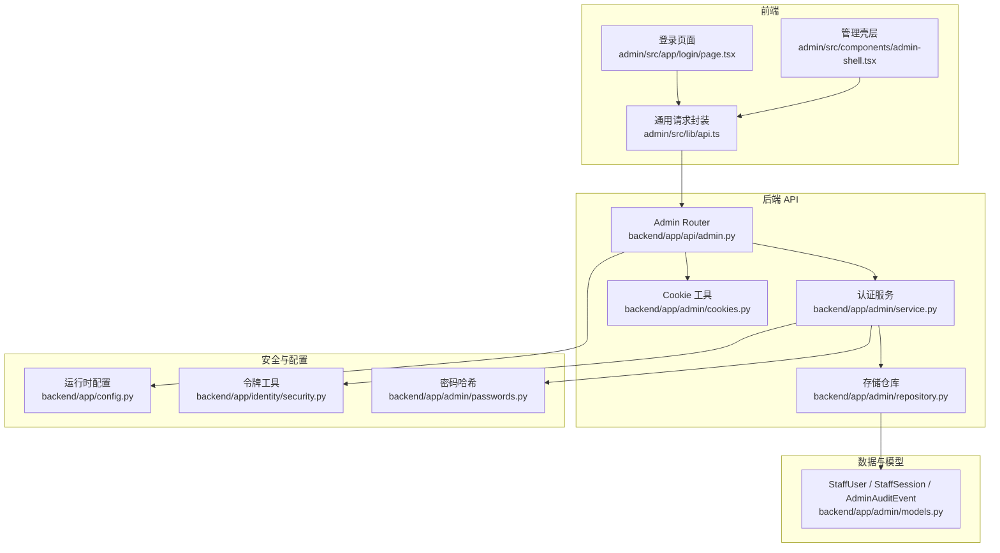
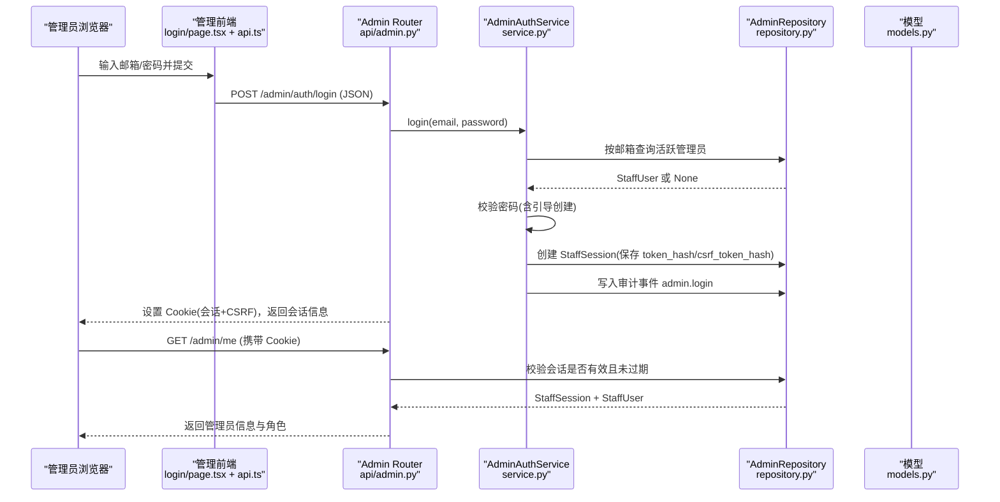
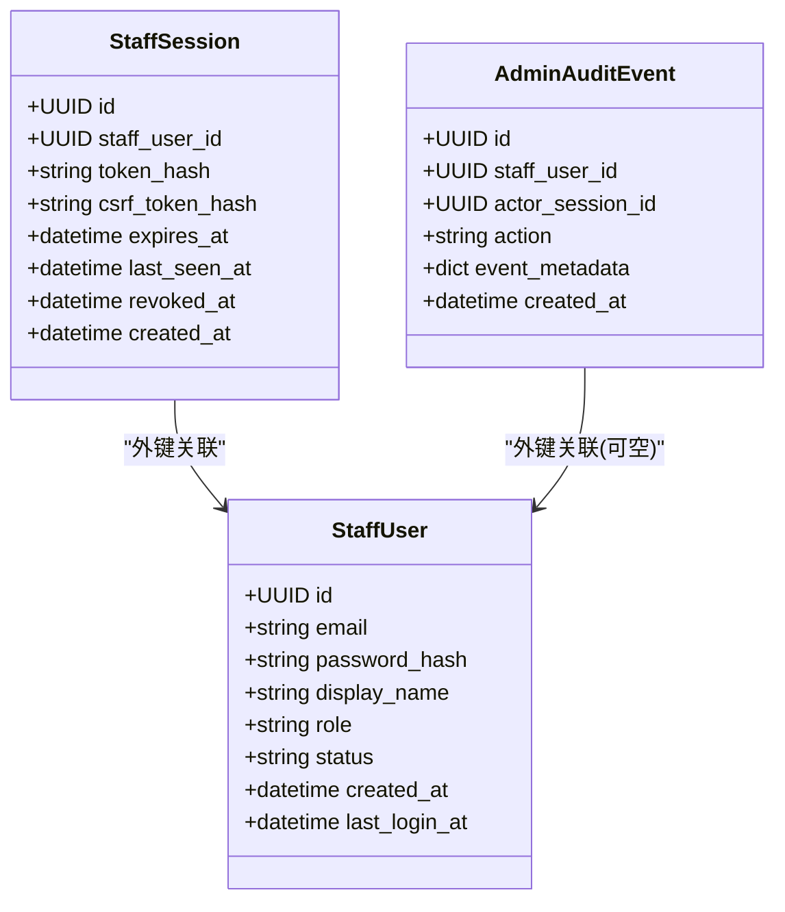
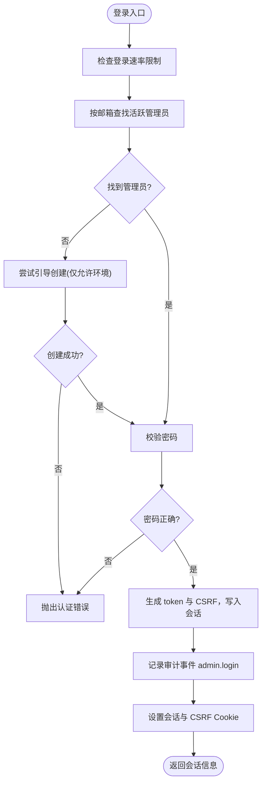
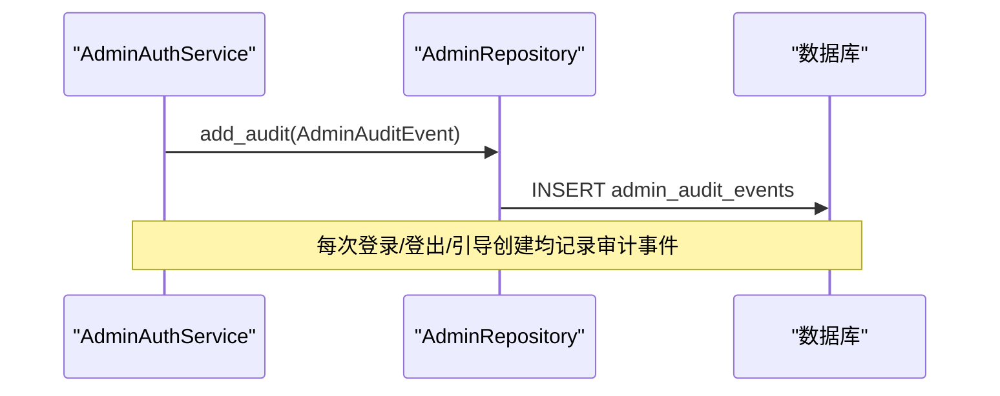
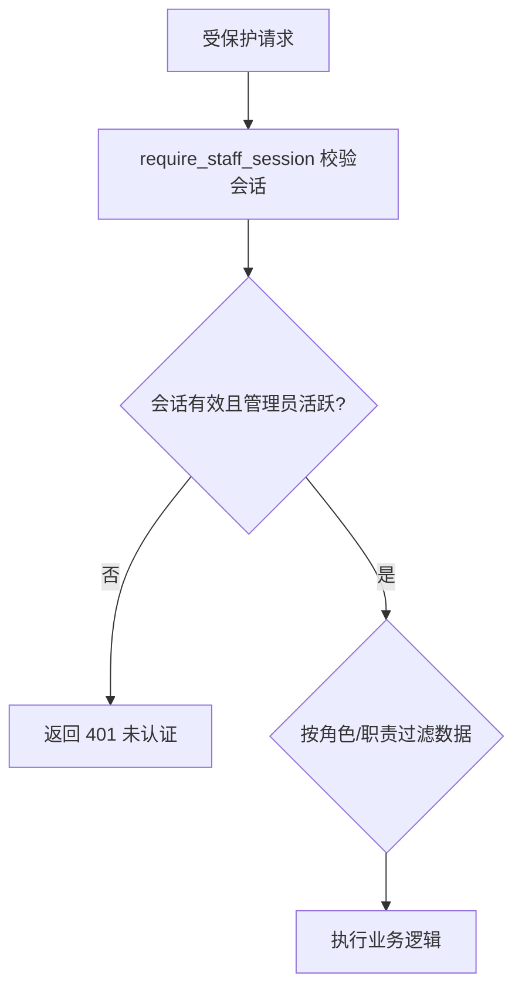
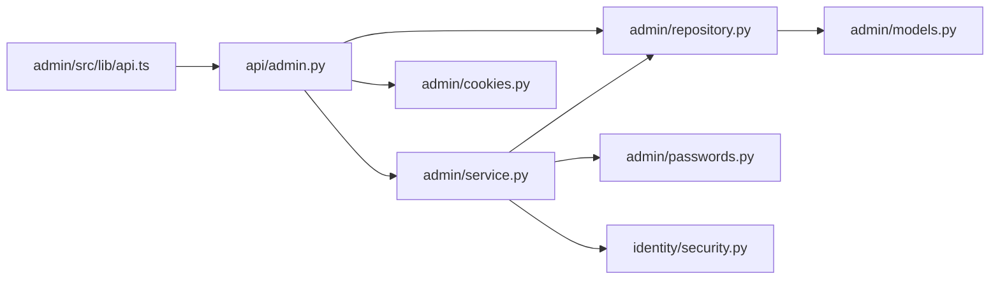
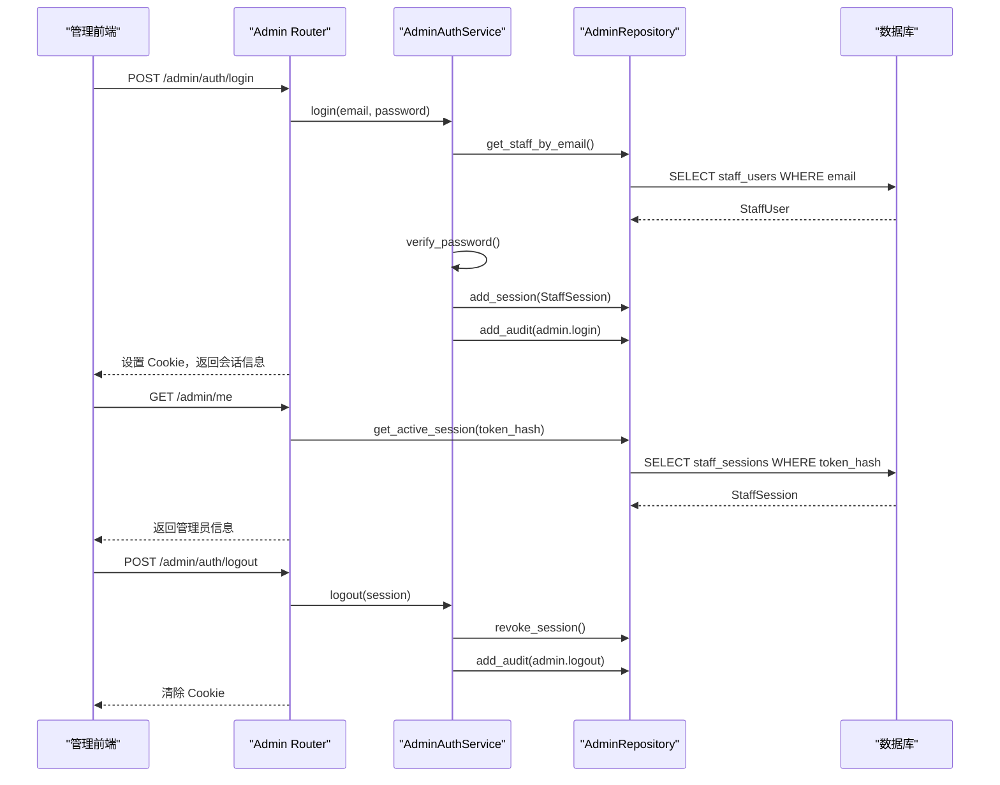

# 管理后台领域

<cite>
**本文引用的文件**
- [backend/app/admin/models.py](file://backend/app/admin/models.py)
- [backend/app/admin/service.py](file://backend/app/admin/service.py)
- [backend/app/admin/repository.py](file://backend/app/admin/repository.py)
- [backend/app/admin/passwords.py](file://backend/app/admin/passwords.py)
- [backend/app/admin/cookies.py](file://backend/app/admin/cookies.py)
- [backend/app/admin/schemas.py](file://backend/app/admin/schemas.py)
- [backend/app/api/admin.py](file://backend/app/api/admin.py)
- [backend/app/identity/security.py](file://backend/app/identity/security.py)
- [backend/app/config.py](file://backend/app/config.py)
- [admin/src/lib/api.ts](file://admin/src/lib/api.ts)
- [admin/src/app/login/page.tsx](file://admin/src/app/login/page.tsx)
- [admin/src/components/admin-shell.tsx](file://admin/src/components/admin-shell.tsx)
- [admin/src/app/audit/page.tsx](file://admin/src/app/audit/page.tsx)
- [backend/app/observability.py](file://backend/app/observability.py)
</cite>

## 目录
1. [简介](#简介)
2. [项目结构](#项目结构)
3. [核心组件](#核心组件)
4. [架构总览](#架构总览)
5. [详细组件分析](#详细组件分析)
6. [依赖关系分析](#依赖关系分析)
7. [性能与监控](#性能与监控)
8. [故障排查指南](#故障排查指南)
9. [结论](#结论)
10. [附录：管理员操作完整流程示例](#附录：管理员操作完整流程示例)

## 简介
本领域文档聚焦管理后台（运营台）的安全与权限体系，覆盖管理员身份与会话、密码安全、审计日志、数据访问控制、前端交互以及性能与监控。目标是帮助读者理解并安全地扩展管理后台能力，确保“最小权限、可审计、可观测”的原则落地。

## 项目结构
管理后台由后端 FastAPI 服务与 Next.js 管理前端组成：
- 后端模块集中在 backend/app/admin 与 backend/app/api/admin.py，负责认证、会话、审计与接口暴露。
- 前端位于 admin/src，提供登录页、壳层导航与通用请求封装，自动携带 CSRF 头。
- 配置与安全策略通过 backend/app/config.py 集中管理，生产环境强制启用严格限制。

**图示来源**
- [backend/app/api/admin.py:1-200](file://backend/app/api/admin.py#L1-L200)
- [backend/app/admin/service.py:1-148](file://backend/app/admin/service.py#L1-L148)
- [backend/app/admin/repository.py:1-57](file://backend/app/admin/repository.py#L1-L57)
- [backend/app/admin/models.py:1-81](file://backend/app/admin/models.py#L1-L81)
- [backend/app/admin/passwords.py:1-55](file://backend/app/admin/passwords.py#L1-L55)
- [backend/app/identity/security.py:1-11](file://backend/app/identity/security.py#L1-L11)
- [backend/app/config.py:62-146](file://backend/app/config.py#L62-L146)
- [admin/src/lib/api.ts:28-79](file://admin/src/lib/api.ts#L28-L79)
- [admin/src/app/login/page.tsx:17-31](file://admin/src/app/login/page.tsx#L17-L31)
- [admin/src/components/admin-shell.tsx:36-59](file://admin/src/components/admin-shell.tsx#L36-L59)

**章节来源**
- [backend/app/api/admin.py:1-200](file://backend/app/api/admin.py#L1-L200)
- [backend/app/admin/service.py:1-148](file://backend/app/admin/service.py#L1-L148)
- [backend/app/admin/repository.py:1-57](file://backend/app/admin/repository.py#L1-L57)
- [backend/app/admin/models.py:1-81](file://backend/app/admin/models.py#L1-L81)
- [backend/app/admin/passwords.py:1-55](file://backend/app/admin/passwords.py#L1-L55)
- [backend/app/identity/security.py:1-11](file://backend/app/identity/security.py#L1-L11)
- [backend/app/config.py:62-146](file://backend/app/config.py#L62-L146)
- [admin/src/lib/api.ts:28-79](file://admin/src/lib/api.ts#L28-L79)
- [admin/src/app/login/page.tsx:17-31](file://admin/src/app/login/page.tsx#L17-L31)
- [admin/src/components/admin-shell.tsx:36-59](file://admin/src/components/admin-shell.tsx#L36-L59)

## 核心组件
- 管理员与会话模型：StaffUser、StaffSession、AdminAuditEvent，定义管理员账户、会话生命周期与审计事件结构。
- 认证服务：AdminAuthService 实现登录、登出、引导创建超级管理员、记录审计事件。
- 存储仓库：AdminRepository 封装对 StaffUser、StaffSession、AdminAuditEvent 的读写与查询。
- 密码安全：基于 scrypt 的密码哈希与校验，强制最小长度。
- Cookie 管理：为管理后台设置独立的 Session Cookie 与 CSRF Cookie，支持 HttpOnly、SameSite、Secure 等安全属性。
- API 路由：/admin/auth/login、/admin/auth/logout、/admin/me、/admin/overview，统一鉴权与限流。
- 前端交互：登录页调用登录接口；壳层校验会话并展示角色信息；通用 fetch 自动附加 CSRF 头。
- 配置与安全：集中化 Settings，包含会话时长、登录限流、生产环境强制约束等。

**章节来源**
- [backend/app/admin/models.py:17-81](file://backend/app/admin/models.py#L17-L81)
- [backend/app/admin/service.py:16-129](file://backend/app/admin/service.py#L16-L129)
- [backend/app/admin/repository.py:14-57](file://backend/app/admin/repository.py#L14-L57)
- [backend/app/admin/passwords.py:16-54](file://backend/app/admin/passwords.py#L16-L54)
- [backend/app/admin/cookies.py:11-80](file://backend/app/admin/cookies.py#L11-L80)
- [backend/app/api/admin.py:68-199](file://backend/app/api/admin.py#L68-L199)
- [admin/src/lib/api.ts:28-79](file://admin/src/lib/api.ts#L28-L79)
- [backend/app/config.py:141-145](file://backend/app/config.py#L141-L145)

## 架构总览
管理后台采用前后端分离架构，后端以 FastAPI 暴露 REST 接口，使用数据库持久化管理员与会话，并通过审计表记录关键行为。前端通过 Same-Origin Cookie 传递会话标识，并在写操作时附带 CSRF Token 进行跨站请求伪造防护。

**图示来源**
- [backend/app/api/admin.py:103-145](file://backend/app/api/admin.py#L103-L145)
- [backend/app/api/admin.py:166-185](file://backend/app/api/admin.py#L166-L185)
- [backend/app/admin/service.py:49-89](file://backend/app/admin/service.py#L49-L89)
- [backend/app/admin/repository.py:22-53](file://backend/app/admin/repository.py#L22-L53)
- [backend/app/admin/models.py:17-57](file://backend/app/admin/models.py#L17-L57)
- [admin/src/app/login/page.tsx:17-31](file://admin/src/app/login/page.tsx#L17-L31)
- [admin/src/lib/api.ts:43-79](file://admin/src/lib/api.ts#L43-L79)

## 详细组件分析

### 管理员与会话模型
- StaffUser：管理员账户，包含邮箱、密码哈希、显示名、角色、状态、创建时间、最后登录时间。唯一约束在邮箱，索引优化状态查询。
- StaffSession：会话实体，关联管理员 ID，存储 token_hash、csrf_token_hash、过期时间、最后访问时间、撤销时间。唯一约束在 token_hash，索引优化按管理员查询。
- AdminAuditEvent：审计事件，记录管理员 ID、会话 ID、动作、元数据、创建时间。索引优化按管理员和时间查询。

**图示来源**
- [backend/app/admin/models.py:17-81](file://backend/app/admin/models.py#L17-L81)

**章节来源**
- [backend/app/admin/models.py:17-81](file://backend/app/admin/models.py#L17-L81)

### 认证与会话验证
- 登录流程：
  - 前端提交邮箱与密码到 /admin/auth/login。
  - 后端通过速率限制器保护登录接口，防止暴力破解。
  - 服务层校验管理员是否存在、状态是否活跃、密码是否正确；若允许引导模式且为空库，则创建超级管理员。
  - 成功后生成不透明 token 与 CSRF token，计算哈希后写入会话，并记录审计事件。
  - 响应中设置两个 Cookie：HttpOnly 的会话 Cookie 与非 HttpOnly 的 CSRF Cookie。
- 会话验证：
  - require_staff_session 从 Cookie 读取会话 token，计算哈希后查询数据库，检查未撤销且未过期，同时校验管理员状态。
  - require_staff_csrf 要求请求携带 x-csrf-token 头，并与 Cookie 中的 CSRF 值一致，同时与服务端存储的 CSRF 哈希比对。
- 登出流程：
  - 将会话标记为已撤销，记录审计事件，清除 Cookie。

**图示来源**
- [backend/app/api/admin.py:103-145](file://backend/app/api/admin.py#L103-L145)
- [backend/app/admin/service.py:49-89](file://backend/app/admin/service.py#L49-L89)
- [backend/app/admin/repository.py:22-53](file://backend/app/admin/repository.py#L22-L53)
- [backend/app/admin/passwords.py:16-54](file://backend/app/admin/passwords.py#L16-L54)

**章节来源**
- [backend/app/api/admin.py:68-163](file://backend/app/api/admin.py#L68-L163)
- [backend/app/admin/service.py:49-129](file://backend/app/admin/service.py#L49-L129)
- [backend/app/admin/repository.py:22-57](file://backend/app/admin/repository.py#L22-L57)
- [backend/app/admin/passwords.py:16-54](file://backend/app/admin/passwords.py#L16-L54)

### 审计日志系统
- 审计事件模型：AdminAuditEvent 记录谁（staff_user_id）、哪个会话（actor_session_id）、做了什么（action）、相关元数据（event_metadata）。
- 关键事件：
  - admin.login：管理员登录成功，记录角色。
  - admin.logout：管理员登出。
  - admin.bootstrap_created：首次引导创建超级管理员。
- 查询与索引：按 staff_user_id 与 created_at 建立索引，便于按管理员与时间范围检索。
- 前端视图：审计页面预留占位，后续接入审计事件 API。

**图示来源**
- [backend/app/admin/service.py:75-82](file://backend/app/admin/service.py#L75-L82)
- [backend/app/admin/service.py:94-101](file://backend/app/admin/service.py#L94-L101)
- [backend/app/admin/service.py:121-128](file://backend/app/admin/service.py#L121-L128)
- [backend/app/admin/models.py:59-81](file://backend/app/admin/models.py#L59-L81)

**章节来源**
- [backend/app/admin/models.py:59-81](file://backend/app/admin/models.py#L59-L81)
- [backend/app/admin/service.py:75-128](file://backend/app/admin/service.py#L75-L128)
- [admin/src/app/audit/page.tsx:4-10](file://admin/src/app/audit/page.tsx#L4-L10)

### 数据访问控制
- 当前实现以“会话有效性 + 管理员状态”作为访问控制基础：
  - require_staff_session 确保请求来自有效且未过期的会话，且管理员处于活跃状态。
  - 所有受保护接口均依赖此依赖注入，未通过则返回 401。
- 角色与权限：
  - StaffUser.role 字段用于区分角色（support、finance、ops、superadmin），当前接口尚未按角色做细粒度授权，可在后续扩展为基于角色的访问控制（RBAC）。
- 数据范围隔离：
  - 当前概览接口返回占位数据，未来可按管理员角色与职责过滤数据范围，例如财务仅见支付相关数据。

**图示来源**
- [backend/app/api/admin.py:68-84](file://backend/app/api/admin.py#L68-L84)
- [backend/app/admin/schemas.py:11-11](file://backend/app/admin/schemas.py#L11-L11)

**章节来源**
- [backend/app/api/admin.py:68-84](file://backend/app/api/admin.py#L68-L84)
- [backend/app/admin/schemas.py:11-11](file://backend/app/admin/schemas.py#L11-L11)

### 密码管理与安全配置
- 密码哈希：
  - 使用 scrypt，参数 n=2^14、r=8、p=1，盐长度为 16 字节，输出密钥长度 64 字节。
  - 密码最小长度 8 字符，否则拒绝。
  - 校验时使用 hmac.compare_digest 避免时序攻击。
- 令牌安全：
  - 会话 token 与 CSRF token 均为不透明随机字符串，服务端仅存储其 SHA-256 哈希。
- 配置安全：
  - 生产环境禁止使用本地哈希密钥与内容加密密钥，禁止 SMTP OTP 与假适配器。
  - 生产环境禁止管理员引导凭据，强制启用 Secure Cookie。
  - 会话时长、登录限流可通过配置调整。

**章节来源**
- [backend/app/admin/passwords.py:16-54](file://backend/app/admin/passwords.py#L16-L54)
- [backend/app/identity/security.py:5-10](file://backend/app/identity/security.py#L5-L10)
- [backend/app/config.py:188-239](file://backend/app/config.py#L188-L239)
- [backend/app/config.py:141-145](file://backend/app/config.py#L141-L145)

### 前端与管理后台交互
- 登录页：
  - 收集邮箱与密码，调用 /admin/auth/login，成功后重定向到首页。
- 壳层：
  - 进入管理后台后调用 /admin/me 校验会话，失败跳转登录页。
  - 显示管理员显示名与角色，提供退出按钮。
- 通用请求：
  - adminFetch 自动读取 mingli_admin_csrf Cookie，并在请求头中附加 x-csrf-token。
  - 统一处理 204 无内容与错误响应体解析。

**章节来源**
- [admin/src/app/login/page.tsx:17-31](file://admin/src/app/login/page.tsx#L17-L31)
- [admin/src/components/admin-shell.tsx:36-59](file://admin/src/components/admin-shell.tsx#L36-L59)
- [admin/src/lib/api.ts:28-79](file://admin/src/lib/api.ts#L28-L79)

## 依赖关系分析
- API 路由依赖认证服务、仓库、Cookie 工具与配置。
- 认证服务依赖仓库、密码工具与令牌工具。
- 仓库依赖 SQLAlchemy 异步会话与模型。
- 前端依赖通用请求封装与类型定义。

**图示来源**
- [backend/app/api/admin.py:1-33](file://backend/app/api/admin.py#L1-L33)
- [backend/app/admin/service.py:1-14](file://backend/app/admin/service.py#L1-L14)
- [backend/app/admin/repository.py:1-12](file://backend/app/admin/repository.py#L1-L12)
- [backend/app/admin/passwords.py:1-8](file://backend/app/admin/passwords.py#L1-L8)
- [backend/app/identity/security.py:1-3](file://backend/app/identity/security.py#L1-L3)
- [backend/app/admin/models.py:1-15](file://backend/app/admin/models.py#L1-L15)
- [admin/src/lib/api.ts:1-27](file://admin/src/lib/api.ts#L1-L27)

**章节来源**
- [backend/app/api/admin.py:1-33](file://backend/app/api/admin.py#L1-L33)
- [backend/app/admin/service.py:1-14](file://backend/app/admin/service.py#L1-L14)
- [backend/app/admin/repository.py:1-12](file://backend/app/admin/repository.py#L1-L12)
- [backend/app/admin/models.py:1-15](file://backend/app/admin/models.py#L1-L15)
- [admin/src/lib/api.ts:1-27](file://admin/src/lib/api.ts#L1-L27)

## 性能与监控
- 登录限流：
  - 使用 WindowRateLimiter 按邮箱桶限制登录尝试次数与窗口大小，防止暴力破解与资源滥用。
- 会话维护：
  - 每次受保护请求更新 last_seen_at，有助于识别活跃会话与清理过期会话。
- 请求观测：
  - 中间件记录每个 HTTP 请求的请求 ID、方法、路径、状态码与耗时，便于追踪与告警。
- 建议优化：
  - 为审计事件表增加分页与时间范围查询。
  - 对高频查询（如按管理员查会话）增加复合索引。
  - 对敏感接口增加更严格的速率限制与异常告警。

**章节来源**
- [backend/app/api/admin.py:56-65](file://backend/app/api/admin.py#L56-L65)
- [backend/app/api/admin.py:83-83](file://backend/app/api/admin.py#L83-L83)
- [backend/app/observability.py:27-51](file://backend/app/observability.py#L27-L51)

## 故障排查指南
- 401 未认证：
  - 检查 Cookie 是否携带 mingli_admin_session。
  - 检查会话是否过期或被撤销。
  - 检查管理员状态是否为 active。
- 403 CSRF 验证失败：
  - 确认请求头包含 x-csrf-token 且与 Cookie 中的 mingli_admin_csrf 一致。
  - 确认服务端存储的 CSRF 哈希与客户端传入值匹配。
- 登录失败：
  - 检查邮箱是否规范、密码是否满足最小长度。
  - 检查速率限制是否触发。
  - 检查引导模式是否允许及凭据是否正确。
- 审计缺失：
  - 确认登录/登出/引导创建路径是否调用了审计记录。
  - 检查数据库写入是否成功。

**章节来源**
- [backend/app/api/admin.py:68-100](file://backend/app/api/admin.py#L68-L100)
- [backend/app/api/admin.py:103-145](file://backend/app/api/admin.py#L103-L145)
- [backend/app/admin/service.py:49-129](file://backend/app/admin/service.py#L49-L129)

## 结论
管理后台实现了基于会话与 CSRF 的安全访问控制，配合审计日志与生产环境强约束，形成“可认证、可防篡改、可审计、可观测”的基础能力。后续可扩展基于角色的细粒度权限控制、数据范围隔离与更丰富的审计事件，以满足复杂的管理场景。

## 附录：管理员操作完整流程示例
- 管理员登录：
  - 前端提交邮箱与密码到 /admin/auth/login。
  - 后端校验速率限制、管理员存在性与密码正确性，必要时引导创建超级管理员。
  - 创建会话并记录审计事件，设置会话与 CSRF Cookie，返回会话信息。
- 访问受保护接口：
  - 前端调用 /admin/me 或其他受保护接口，自动携带 CSRF 头。
  - 后端校验会话有效性与管理员状态，返回管理员信息或执行业务逻辑。
- 管理员登出：
  - 前端调用 /admin/auth/logout。
  - 后端撤销会话、记录审计事件、清除 Cookie。

**图示来源**
- [backend/app/api/admin.py:103-163](file://backend/app/api/admin.py#L103-L163)
- [backend/app/admin/service.py:49-101](file://backend/app/admin/service.py#L49-L101)
- [backend/app/admin/repository.py:22-57](file://backend/app/admin/repository.py#L22-L57)
- [backend/app/admin/models.py:17-81](file://backend/app/admin/models.py#L17-L81)
- [admin/src/lib/api.ts:43-79](file://admin/src/lib/api.ts#L43-L79)