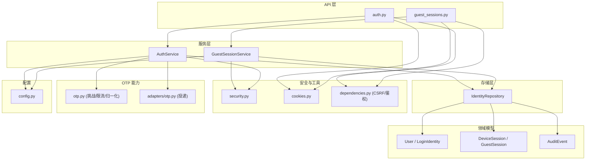
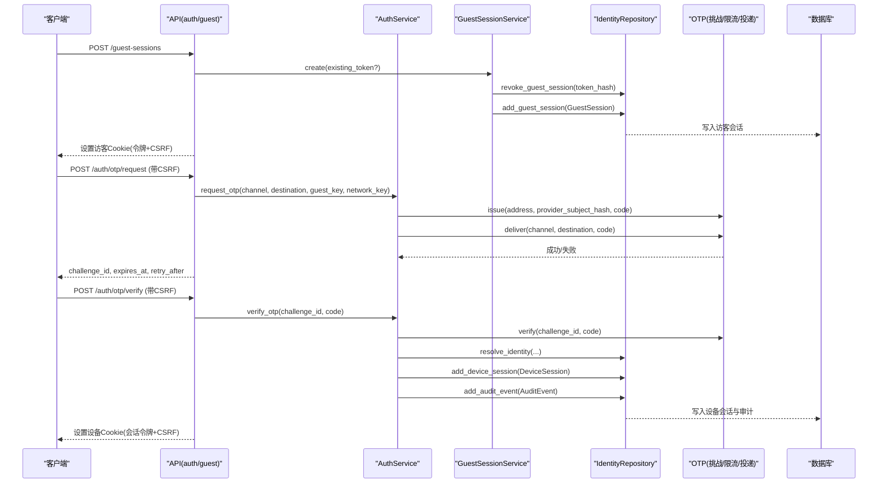
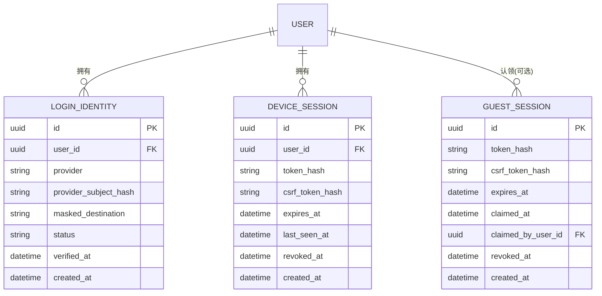
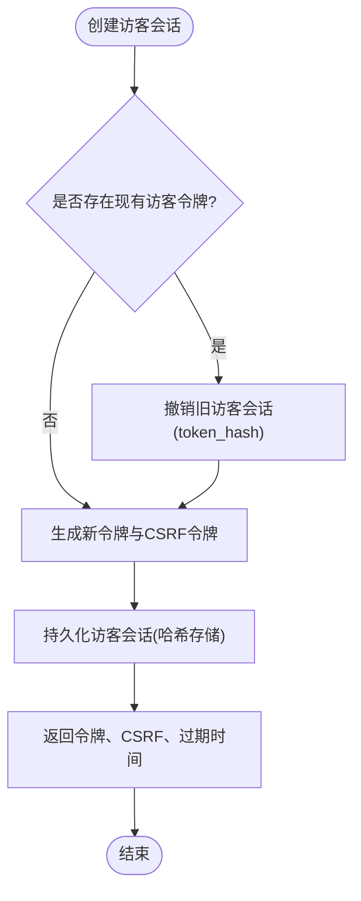
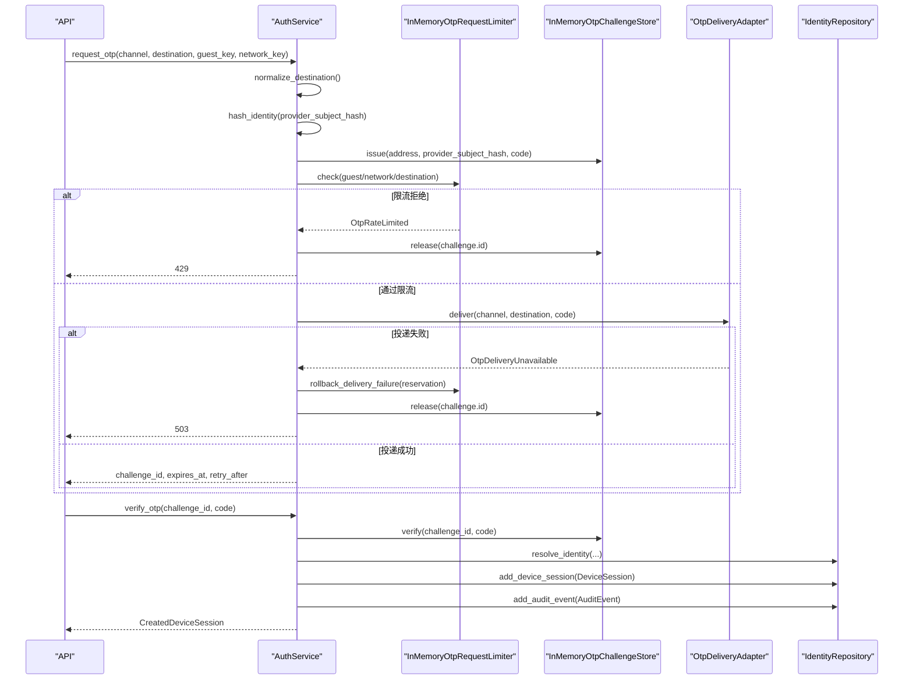
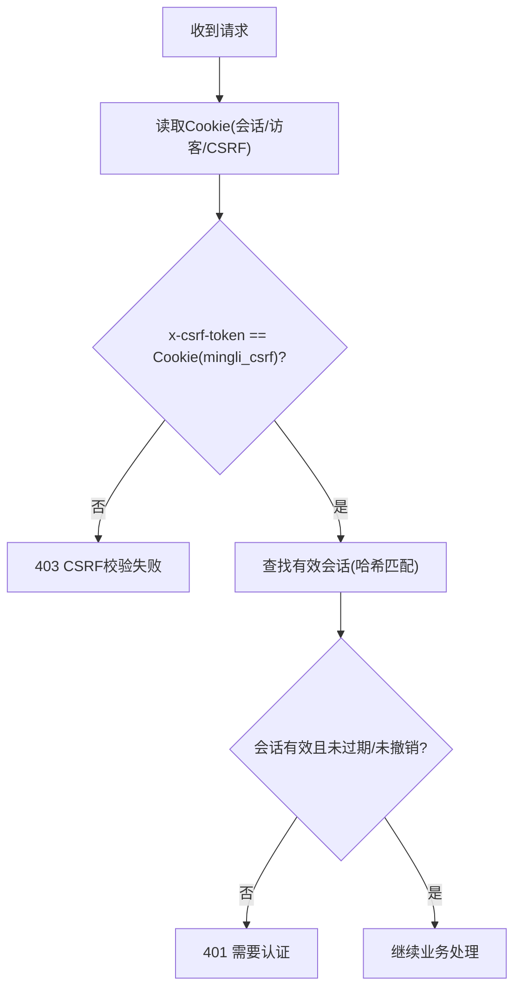
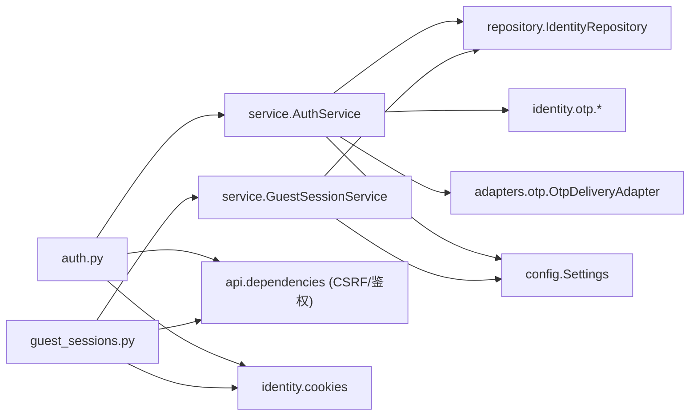

# 身份认证领域

<cite>
**本文引用的文件**
- [backend/app/identity/service.py](file://backend/app/identity/service.py)
- [backend/app/identity/models.py](file://backend/app/identity/models.py)
- [backend/app/identity/security.py](file://backend/app/identity/security.py)
- [backend/app/identity/otp.py](file://backend/app/identity/otp.py)
- [backend/app/identity/repository.py](file://backend/app/identity/repository.py)
- [backend/app/identity/cookies.py](file://backend/app/identity/cookies.py)
- [backend/app/api/auth.py](file://backend/app/api/auth.py)
- [backend/app/api/guest_sessions.py](file://backend/app/api/guest_sessions.py)
- [backend/app/api/dependencies.py](file://backend/app/api/dependencies.py)
- [backend/app/adapters/otp.py](file://backend/app/adapters/otp.py)
- [backend/app/config.py](file://backend/app/config.py)
- [backend/app/api/rate_guard.py](file://backend/app/api/rate_guard.py)
</cite>

## 目录
1. [简介](#简介)
2. [项目结构](#项目结构)
3. [核心组件](#核心组件)
4. [架构总览](#架构总览)
5. [详细组件分析](#详细组件分析)
6. [依赖关系分析](#依赖关系分析)
7. [性能考虑](#性能考虑)
8. [故障排查指南](#故障排查指南)
9. [结论](#结论)
10. [附录：端到端流程与最佳实践](#附录：端到端流程与最佳实践)

## 简介
本文件聚焦于身份认证领域的完整设计与实现，覆盖用户身份管理、OTP 验证码流程、会话管理（访客与会话）、安全机制（令牌哈希、CSRF 保护、速率限制）以及身份模型设计（User、LoginIdentity、DeviceSession、GuestSession）。文档同时给出关键业务流程的时序图与流程图，并基于代码路径提供可追溯的实现参考。

## 项目结构
后端采用分层与模块化组织：
- API 层：路由与请求处理（auth、guest-sessions）
- 服务层：业务编排（AuthService、GuestSessionService）
- 领域模型：用户、登录身份、设备会话、访客会话、审计事件
- 存储层：Repository 抽象数据库访问
- 安全与工具：令牌生成与哈希、Cookie 设置、CSRF 校验
- OTP 能力：挑战存储、限流、地址归一化、投递适配器
- 配置：运行期安全策略与开关

图表来源
- [backend/app/api/auth.py:1-161](file://backend/app/api/auth.py#L1-L161)
- [backend/app/api/guest_sessions.py:1-53](file://backend/app/api/guest_sessions.py#L1-L53)
- [backend/app/identity/service.py:1-192](file://backend/app/identity/service.py#L1-L192)
- [backend/app/identity/models.py:1-132](file://backend/app/identity/models.py#L1-L132)
- [backend/app/identity/repository.py:1-114](file://backend/app/identity/repository.py#L1-L114)
- [backend/app/identity/security.py:1-11](file://backend/app/identity/security.py#L1-L11)
- [backend/app/identity/cookies.py:1-102](file://backend/app/identity/cookies.py#L1-L102)
- [backend/app/identity/otp.py:1-304](file://backend/app/identity/otp.py#L1-L304)
- [backend/app/adapters/otp.py:1-129](file://backend/app/adapters/otp.py#L1-L129)
- [backend/app/config.py:1-335](file://backend/app/config.py#L1-L335)

章节来源
- [backend/app/api/auth.py:1-161](file://backend/app/api/auth.py#L1-L161)
- [backend/app/api/guest_sessions.py:1-53](file://backend/app/api/guest_sessions.py#L1-L53)
- [backend/app/identity/service.py:1-192](file://backend/app/identity/service.py#L1-L192)
- [backend/app/identity/models.py:1-132](file://backend/app/identity/models.py#L1-L132)
- [backend/app/identity/repository.py:1-114](file://backend/app/identity/repository.py#L1-L114)
- [backend/app/identity/security.py:1-11](file://backend/app/identity/security.py#L1-L11)
- [backend/app/identity/cookies.py:1-102](file://backend/app/identity/cookies.py#L1-L102)
- [backend/app/identity/otp.py:1-304](file://backend/app/identity/otp.py#L1-L304)
- [backend/app/adapters/otp.py:1-129](file://backend/app/adapters/otp.py#L1-L129)
- [backend/app/config.py:1-335](file://backend/app/config.py#L1-L335)

## 核心组件
- AuthService：负责 OTP 请求、验证、设备会话创建与审计记录
- GuestSessionService：负责访客会话创建与旧会话撤销
- IdentityRepository：封装 User/LoginIdentity/DeviceSession/GuestSession/AuditEvent 的持久化操作
- OTP 子系统：地址归一化、挑战存储、限流器、投递适配器
- 安全与鉴权：令牌哈希、CSRF 双提交校验、Cookie 安全属性、速率限制
- 配置：生产环境安全约束、OTP 行为参数、会话时长等

章节来源
- [backend/app/identity/service.py:1-192](file://backend/app/identity/service.py#L1-L192)
- [backend/app/identity/repository.py:1-114](file://backend/app/identity/repository.py#L1-L114)
- [backend/app/identity/otp.py:1-304](file://backend/app/identity/otp.py#L1-L304)
- [backend/app/identity/security.py:1-11](file://backend/app/identity/security.py#L1-L11)
- [backend/app/identity/cookies.py:1-102](file://backend/app/identity/cookies.py#L1-L102)
- [backend/app/api/dependencies.py:1-137](file://backend/app/api/dependencies.py#L1-L137)
- [backend/app/config.py:1-335](file://backend/app/config.py#L1-L335)

## 架构总览
身份认证由“访客阶段”和“已认证设备会话阶段”组成：
- 访客阶段：通过 /guest-sessions 创建访客会话，返回访客令牌与 CSRF 令牌；后续 OTP 请求需携带 CSRF 进行双重校验
- 认证阶段：通过 /auth/otp/request 发送验证码，经 OTP 渠道投递；通过 /auth/otp/verify 校验后创建设备会话，设置设备 Cookie
- 安全机制：所有敏感令牌在数据库中均以哈希形式存储；CSRF 使用 Cookie + Header 双提交比对；速率限制覆盖访客创建、OTP 请求与验证尝试

图表来源
- [backend/app/api/guest_sessions.py:16-53](file://backend/app/api/guest_sessions.py#L16-L53)
- [backend/app/api/auth.py:44-138](file://backend/app/api/auth.py#L44-L138)
- [backend/app/identity/service.py:35-192](file://backend/app/identity/service.py#L35-L192)
- [backend/app/identity/otp.py:221-304](file://backend/app/identity/otp.py#L221-L304)
- [backend/app/adapters/otp.py:57-129](file://backend/app/adapters/otp.py#L57-L129)
- [backend/app/identity/repository.py:20-114](file://backend/app/identity/repository.py#L20-L114)

## 详细组件分析

### 身份模型与生命周期
- User：用户实体，状态为 active/inactive 等
- LoginIdentity：绑定用户与外部提供方（邮箱/手机），以 provider_subject_hash 唯一标识，记录 masked_destination 与 verified_at
- DeviceSession：设备会话，包含 token_hash、csrf_token_hash、expires_at、last_seen_at、revoked_at
- GuestSession：访客会话，包含 token_hash、csrf_token_hash、expires_at、claimed_at、claimed_by_user_id、revoked_at
- AuditEvent：审计事件，记录动作与元数据

图表来源
- [backend/app/identity/models.py:31-132](file://backend/app/identity/models.py#L31-L132)

章节来源
- [backend/app/identity/models.py:31-132](file://backend/app/identity/models.py#L31-L132)

### GuestSessionService 设计与实现
- 职责：创建访客会话，支持传入 existing_token 以撤销旧访客会话，避免并发重复创建
- 安全措施：
  - 令牌与 CSRF 令牌均使用安全随机数生成，并在数据库中保存哈希
  - 访客会话具有固定生命周期（默认 24 小时）
- 典型调用：
  - API 层接收 Cookie 中的现有访客令牌，若存在则先撤销再创建新会话
  - 成功后设置访客 Cookie（令牌与 CSRF）

图表来源
- [backend/app/identity/service.py:35-58](file://backend/app/identity/service.py#L35-L58)
- [backend/app/identity/security.py:5-11](file://backend/app/identity/security.py#L5-L11)
- [backend/app/identity/repository.py:20-31](file://backend/app/identity/repository.py#L20-L31)

章节来源
- [backend/app/identity/service.py:35-58](file://backend/app/identity/service.py#L35-L58)
- [backend/app/api/guest_sessions.py:16-53](file://backend/app/api/guest_sessions.py#L16-L53)

### AuthService 与 OTP 流程
- 请求 OTP：
  - 归一化目的地（手机号/邮箱），计算 provider_subject_hash
  - 生成一次性验证码，创建挑战（含 code_hash、过期时间、尝试次数）
  - 可选的三层速率限制：按访客、网络、目的地维度
  - 投递验证码（邮件/短信或测试模拟）
  - 异常回滚：投递失败时释放挑战与占用计数
- 验证 OTP：
  - 校验挑战有效性（未过期、未消耗、尝试次数限制）
  - 解析或创建用户与登录身份（首次登录自动创建）
  - 创建设备会话（token_hash、csrf_token_hash、过期时间）
  - 记录审计事件（identity.otp_verified）
  - 将访客所有权转移给已认证用户（如适用）

图表来源
- [backend/app/identity/service.py:100-192](file://backend/app/identity/service.py#L100-L192)
- [backend/app/identity/otp.py:64-181](file://backend/app/identity/otp.py#L64-L181)
- [backend/app/identity/otp.py:221-304](file://backend/app/identity/otp.py#L221-L304)
- [backend/app/adapters/otp.py:57-129](file://backend/app/adapters/otp.py#L57-L129)
- [backend/app/identity/repository.py:48-85](file://backend/app/identity/repository.py#L48-L85)

章节来源
- [backend/app/identity/service.py:100-192](file://backend/app/identity/service.py#L100-L192)
- [backend/app/identity/otp.py:64-181](file://backend/app/identity/otp.py#L64-L181)
- [backend/app/identity/otp.py:221-304](file://backend/app/identity/otp.py#L221-L304)
- [backend/app/adapters/otp.py:57-129](file://backend/app/adapters/otp.py#L57-L129)
- [backend/app/identity/repository.py:48-85](file://backend/app/identity/repository.py#L48-L85)

### 会话管理与 CSRF 保护
- 访客与会话 Cookie：
  - 访客 Cookie：包含访客令牌与 CSRF 令牌，HttpOnly 仅对令牌启用，CSRF 不 HttpOnly 以便前端读取
  - 设备会话 Cookie：包含设备会话令牌与 CSRF 令牌，HttpOnly 仅对会话令牌启用
- CSRF 双提交校验：
  - 请求头 x-csrf-token 必须与 Cookie 中的 mingli_csrf 一致
  - 服务端比较时使用常量时间比较函数，防止时序攻击
  - 针对访客与会话分别提供 require_guest_csrf 与 require_device_csrf 依赖注入
- 注销：
  - 标记设备会话为已撤销，清除设备 Cookie，记录审计事件

图表来源
- [backend/app/api/dependencies.py:29-130](file://backend/app/api/dependencies.py#L29-L130)
- [backend/app/identity/cookies.py:12-102](file://backend/app/identity/cookies.py#L12-L102)
- [backend/app/api/auth.py:141-161](file://backend/app/api/auth.py#L141-L161)

章节来源
- [backend/app/api/dependencies.py:29-130](file://backend/app/api/dependencies.py#L29-L130)
- [backend/app/identity/cookies.py:12-102](file://backend/app/identity/cookies.py#L12-L102)
- [backend/app/api/auth.py:141-161](file://backend/app/api/auth.py#L141-L161)

### 安全机制与最佳实践
- 令牌哈希：
  - 所有令牌（访客令牌、设备会话令牌、CSRF 令牌）均在数据库中保存哈希值，避免明文泄露风险
  - 使用 SHA-256 哈希与随机令牌生成
- CSRF 保护：
  - 强制双提交校验，结合 HttpOnly 与 SameSite=Lax 的 Cookie 策略
- 速率限制：
  - 访客会话创建：每 IP 窗口限制
  - OTP 请求：按访客、网络、目的地三层限流，支持投递失败回滚
  - OTP 验证：挑战尝试次数上限，超限返回 429
- 生产安全约束：
  - 禁止使用 fake OTP 与本地密钥
  - 强制 secure Cookie、禁用明文传输
  - 严格白名单模型与运行时路径

章节来源
- [backend/app/identity/security.py:5-11](file://backend/app/identity/security.py#L5-L11)
- [backend/app/identity/otp.py:64-181](file://backend/app/identity/otp.py#L64-L181)
- [backend/app/identity/otp.py:221-304](file://backend/app/identity/otp.py#L221-L304)
- [backend/app/config.py:188-329](file://backend/app/config.py#L188-L329)
- [backend/app/api/rate_guard.py:5-20](file://backend/app/api/rate_guard.py#L5-L20)

## 依赖关系分析
- 服务层依赖：
  - AuthService 依赖 IdentityRepository、OTP 挑战存储、投递适配器、配置
  - GuestSessionService 依赖 IdentityRepository 与安全工具
- 存储层依赖：
  - Repository 直接映射到 SQLAlchemy 模型，提供事务性操作
- 安全依赖：
  - dependencies.py 提供 CSRF 与会话校验依赖注入
  - cookies.py 统一设置 Cookie 安全属性
- 外部依赖：
  - SMTP 适配器用于邮件 OTP 投递
  - 配置模块提供运行期安全策略与阈值

图表来源
- [backend/app/api/auth.py:1-161](file://backend/app/api/auth.py#L1-L161)
- [backend/app/api/guest_sessions.py:1-53](file://backend/app/api/guest_sessions.py#L1-L53)
- [backend/app/identity/service.py:1-192](file://backend/app/identity/service.py#L1-L192)
- [backend/app/identity/repository.py:1-114](file://backend/app/identity/repository.py#L1-L114)
- [backend/app/identity/otp.py:1-304](file://backend/app/identity/otp.py#L1-L304)
- [backend/app/adapters/otp.py:1-129](file://backend/app/adapters/otp.py#L1-L129)
- [backend/app/api/dependencies.py:1-137](file://backend/app/api/dependencies.py#L1-L137)
- [backend/app/identity/cookies.py:1-102](file://backend/app/identity/cookies.py#L1-L102)
- [backend/app/config.py:1-335](file://backend/app/config.py#L1-L335)

章节来源
- [backend/app/api/auth.py:1-161](file://backend/app/api/auth.py#L1-L161)
- [backend/app/api/guest_sessions.py:1-53](file://backend/app/api/guest_sessions.py#L1-L53)
- [backend/app/identity/service.py:1-192](file://backend/app/identity/service.py#L1-L192)
- [backend/app/identity/repository.py:1-114](file://backend/app/identity/repository.py#L1-L114)
- [backend/app/identity/otp.py:1-304](file://backend/app/identity/otp.py#L1-L304)
- [backend/app/adapters/otp.py:1-129](file://backend/app/adapters/otp.py#L1-L129)
- [backend/app/api/dependencies.py:1-137](file://backend/app/api/dependencies.py#L1-L137)
- [backend/app/identity/cookies.py:1-102](file://backend/app/identity/cookies.py#L1-L102)
- [backend/app/config.py:1-335](file://backend/app/config.py#L1-L335)

## 性能考虑
- 挑战存储与限流器当前为内存实现，适合单机或小规模部署；生产建议替换为 Redis 以支持水平扩展与持久化
- 速率限制窗口与阈值应根据实际流量调优，避免误伤正常用户
- 数据库索引：
  - 设备会话与访客会话按 token_hash 唯一索引，查询高效
  - 登录身份按 provider_subject_hash 唯一索引，避免冲突
- 异步 I/O：
  - SMTP 投递使用线程池执行，避免阻塞事件循环
- 审计事件：
  - 高吞吐场景下可考虑异步落库或批处理

[本节为通用指导，不直接分析具体文件]

## 故障排查指南
- 403 CSRF 校验失败：
  - 检查请求是否携带 x-csrf-token，且与 Cookie mingli_csrf 一致
  - 确认 Cookie 域与路径配置正确
- 401 需要认证：
  - 检查 Cookie 中会话令牌或访客令牌是否存在且有效
  - 确认令牌未过期或未撤销
- 429 速率限制：
  - 检查 OTP 请求/验证频率是否超过限制
  - 查看 Retry-After 响应头提示等待时间
- 503 OTP 投递不可用：
  - 检查 SMTP 配置与服务器可达性
  - 确认生产环境未启用禁用适配器

章节来源
- [backend/app/api/dependencies.py:29-130](file://backend/app/api/dependencies.py#L29-L130)
- [backend/app/api/auth.py:69-110](file://backend/app/api/auth.py#L69-L110)
- [backend/app/adapters/otp.py:41-55](file://backend/app/adapters/otp.py#L41-L55)
- [backend/app/adapters/otp.py:98-129](file://backend/app/adapters/otp.py#L98-L129)

## 结论
该身份认证体系通过清晰的层次划分与严格的安全策略，实现了从访客到已认证用户的完整流转。核心亮点包括：
- 安全的令牌与 CSRF 机制
- 多层速率限制与健壮的错误回滚
- 可扩展的 OTP 投递适配与配置化策略
- 完善的审计与生命周期管理

在生产环境中，应确保使用持久化挑战存储与真实 OTP 通道，并遵循配置中的安全约束。

[本节为总结，不直接分析具体文件]

## 附录：端到端流程与最佳实践
- 访客会话创建：
  - 调用 /guest-sessions，若存在旧令牌则先撤销再创建新会话
  - 设置访客 Cookie（令牌与 CSRF），有效期默认 24 小时
- OTP 请求：
  - 调用 /auth/otp/request，携带 CSRF；系统归一化目的地、生成挑战、限流、投递
  - 返回 challenge_id、过期时间与重试间隔
- OTP 验证：
  - 调用 /auth/otp/verify，携带 CSRF；系统校验挑战、解析/创建用户与身份、创建设备会话
  - 设置设备 Cookie（会话令牌与 CSRF），有效期默认 30 天
- 注销：
  - 调用 /auth/logout，撤销设备会话并清除设备 Cookie
- 最佳实践：
  - 始终使用 HTTPS 与 secure Cookie
  - 合理配置速率限制与超时
  - 定期清理过期会话与审计日志
  - 生产环境禁用 fake 适配器与本地密钥

章节来源
- [backend/app/api/guest_sessions.py:16-53](file://backend/app/api/guest_sessions.py#L16-L53)
- [backend/app/api/auth.py:44-161](file://backend/app/api/auth.py#L44-L161)
- [backend/app/identity/service.py:35-192](file://backend/app/identity/service.py#L35-L192)
- [backend/app/identity/cookies.py:12-102](file://backend/app/identity/cookies.py#L12-L102)
- [backend/app/config.py:122-141](file://backend/app/config.py#L122-L141)