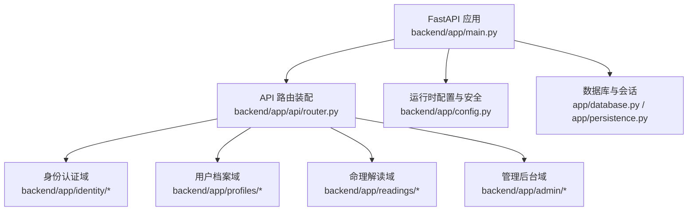
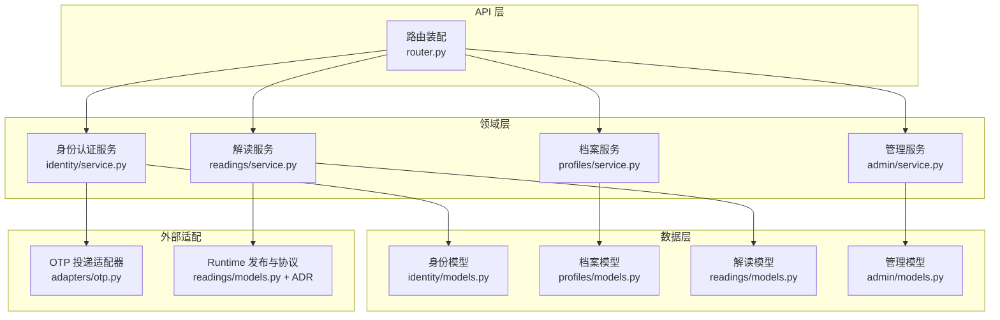
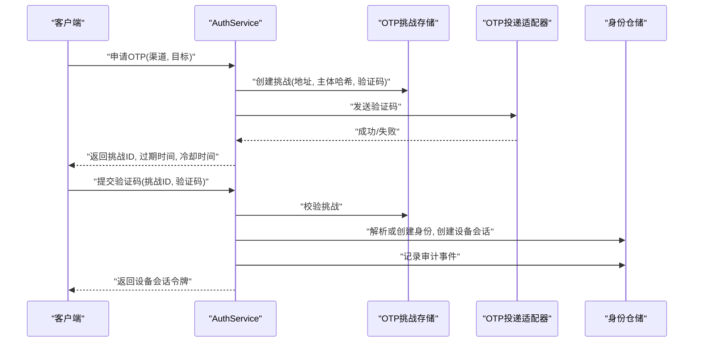
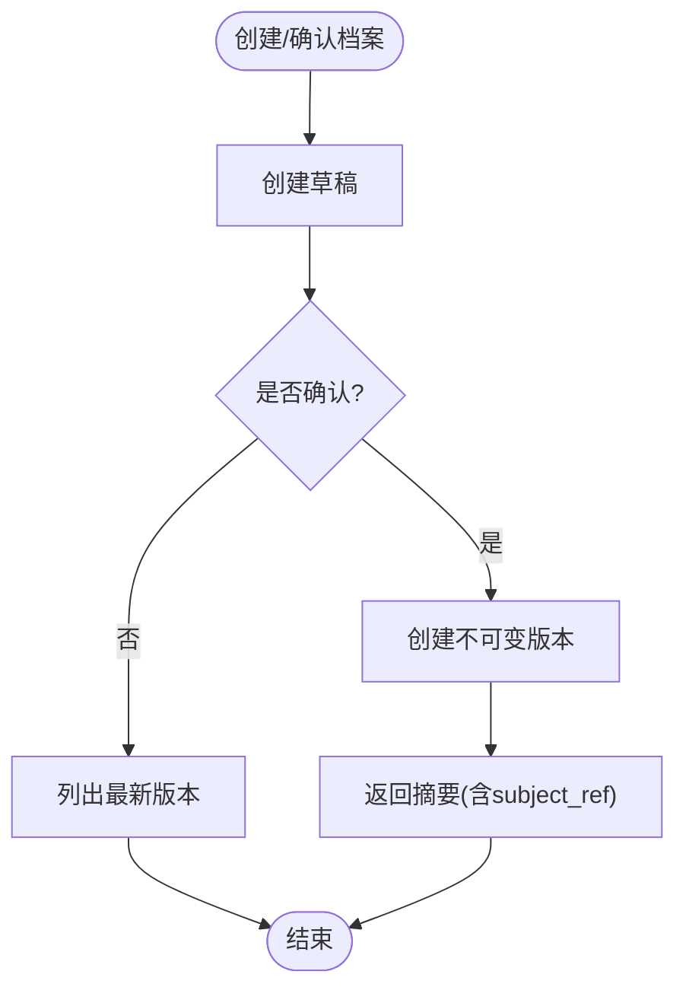
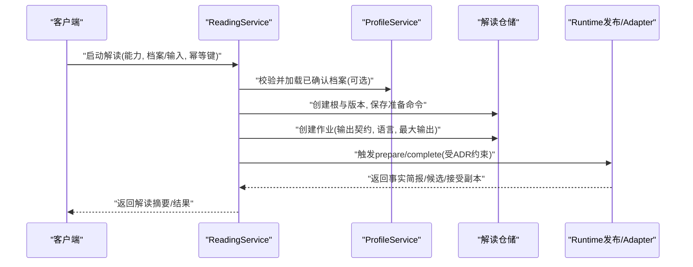
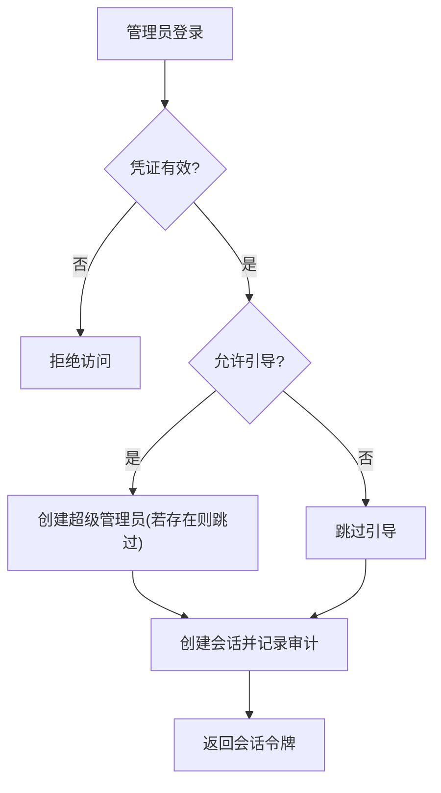

# 领域设计

<cite>
**本文引用的文件**
- [backend/app/main.py](file://backend/app/main.py)
- [backend/app/config.py](file://backend/app/config.py)
- [backend/app/api/router.py](file://backend/app/api/router.py)
- [backend/app/identity/service.py](file://backend/app/identity/service.py)
- [backend/app/identity/models.py](file://backend/app/identity/models.py)
- [backend/app/profiles/service.py](file://backend/app/profiles/service.py)
- [backend/app/profiles/models.py](file://backend/app/profiles/models.py)
- [backend/app/readings/service.py](file://backend/app/readings/service.py)
- [backend/app/readings/models.py](file://backend/app/readings/models.py)
- [backend/app/admin/service.py](file://backend/app/admin/service.py)
- [backend/app/admin/models.py](file://backend/app/admin/models.py)
- [docs/adr/0010-replace-agent-loop-with-an-explicit-reading-orchestrator.md](file://docs/adr/0010-replace-agent-loop-with-an-explicit-reading-orchestrator.md)
- [docs/adr/0002-isolate-mingli-core-behind-json-adapter.md](file://docs/adr/0002-isolate-mingli-core-behind-json-adapter.md)
</cite>

## 目录
1. [引言](#引言)
2. [项目结构](#项目结构)
3. [核心领域](#核心领域)
4. [架构总览](#架构总览)
5. [详细领域分析](#详细领域分析)
6. [依赖关系分析](#依赖关系分析)
7. [性能与一致性](#性能与一致性)
8. [故障排查指南](#故障排查指南)
9. [结论](#结论)
10. [附录：领域服务实现模式示例](#附录：领域服务实现模式示例)

## 引言
本领域设计文档面向 Mingli Web 项目的后端领域模型与服务编排，采用领域驱动设计的思想对系统进行模块化划分。围绕身份认证、用户档案、命理解读与管理后台四大核心领域，明确各领域的职责边界、核心概念、业务规则、领域间协作方式以及隔离策略。同时给出领域架构图、交互流程图和关键实现路径，帮助读者在不深入代码细节的情况下把握系统全貌。

## 项目结构
后端以 FastAPI 应用为入口，通过路由装配将不同能力暴露为 API；每个领域以 service/repository/models/schemas 分层组织，并通过共享配置与安全组件完成跨领域协作。

图表来源
- [backend/app/main.py:30-156](file://backend/app/main.py#L30-L156)
- [backend/app/api/router.py:12-21](file://backend/app/api/router.py#L12-L21)
- [backend/app/config.py:62-149](file://backend/app/config.py#L62-L149)

章节来源
- [backend/app/main.py:30-156](file://backend/app/main.py#L30-L156)
- [backend/app/api/router.py:12-21](file://backend/app/api/router.py#L12-L21)
- [backend/app/config.py:62-149](file://backend/app/config.py#L62-L149)

## 核心领域
- 身份认证域：负责访客会话、设备会话、OTP 验证码发放与校验、登录审计等。
- 用户档案域：负责建档草稿、不可变版本化存储、游客资源认领到已验证用户。
- 命理解读域：负责解读生命周期编排（准备、输入补充、生成、验收、追问）、幂等性、状态机与结果交付。
- 管理后台域：负责员工登录、会话管理与运营概览，具备引导式超级管理员初始化能力。

章节来源
- [backend/app/identity/service.py:28-192](file://backend/app/identity/service.py#L28-L192)
- [backend/app/profiles/service.py:44-189](file://backend/app/profiles/service.py#L44-L189)
- [backend/app/readings/service.py:117-819](file://backend/app/readings/service.py#L117-L819)
- [backend/app/admin/service.py:33-148](file://backend/app/admin/service.py#L33-L148)

## 架构总览
系统采用“显式编排 + 不可变记录”的领域架构：API 层仅做请求路由与参数校验，领域服务承载业务规则，仓储负责持久化，外部能力通过适配器隔离。

图表来源
- [backend/app/api/router.py:12-21](file://backend/app/api/router.py#L12-L21)
- [backend/app/identity/service.py:78-192](file://backend/app/identity/service.py#L78-L192)
- [backend/app/profiles/service.py:44-189](file://backend/app/profiles/service.py#L44-L189)
- [backend/app/readings/service.py:117-819](file://backend/app/readings/service.py#L117-L819)
- [backend/app/admin/service.py:33-148](file://backend/app/admin/service.py#L33-L148)
- [backend/app/identity/models.py:31-132](file://backend/app/identity/models.py#L31-L132)
- [backend/app/profiles/models.py:21-80](file://backend/app/profiles/models.py#L21-L80)
- [backend/app/readings/models.py:28-378](file://backend/app/readings/models.py#L28-L378)
- [backend/app/admin/models.py:66-80](file://backend/app/admin/models.py#L66-L80)

## 详细领域分析

### 身份认证领域
- 职责边界
  - 访客会话创建与过期管理。
  - OTP 验证码申请、限流、挑战存储与投递。
  - 验证码校验后建立设备会话并记录审计事件。
- 核心概念
  - 实体：User、LoginIdentity、DeviceSession、GuestSession、AuditEvent。
  - 值对象：RequestedOtp、CreatedDeviceSession、CreatedGuestSession。
  - 聚合根：设备会话与访客会话分别作为短期会话聚合。
- 业务规则
  - OTP 需经过目的地归一化、哈希主体、挑战存储、发送限流与投递失败回滚。
  - 设备会话有效期由配置决定，登录成功后写入审计事件。
- 领域间协作
  - 通过 OwnerProtocol 抽象统一用户/访客所有权上下文，供档案与解读领域复用。
- 领域事件
  - 使用审计事件记录登录成功、登出等操作，便于追踪与合规。

图表来源
- [backend/app/identity/service.py:78-192](file://backend/app/identity/service.py#L78-L192)
- [backend/app/identity/models.py:31-132](file://backend/app/identity/models.py#L31-L132)

章节来源
- [backend/app/identity/service.py:28-192](file://backend/app/identity/service.py#L28-L192)
- [backend/app/identity/models.py:31-132](file://backend/app/identity/models.py#L31-L132)

### 用户档案领域
- 职责边界
  - 创建档案草稿，确认草稿生成不可变版本。
  - 列出最新档案版本，按所有者（用户或访客）隔离访问。
  - 支持访客资源认领到已验证用户，原子迁移关联数据。
- 核心概念
  - 实体：SubjectProfile、ProfileVersion。
  - 值对象：ProfileSummary。
  - 聚合根：SubjectProfile 拥有多个不可变 ProfileVersion。
- 业务规则
  - 版本一旦创建即不可变，更新尝试会抛出不可变记录错误。
  - 访客认领时需锁定会话并原子迁移档案与解读幂等键。
- 领域间协作
  - 解读服务通过 OwnerProtocol 获取所有者上下文，确保资源归属一致。
- 领域事件
  - 通过审计事件与不可变版本保证可追溯性与防篡改。

图表来源
- [backend/app/profiles/service.py:44-189](file://backend/app/profiles/service.py#L44-L189)
- [backend/app/profiles/models.py:21-80](file://backend/app/profiles/models.py#L21-L80)

章节来源
- [backend/app/profiles/service.py:44-189](file://backend/app/profiles/service.py#L44-L189)
- [backend/app/profiles/models.py:21-80](file://backend/app/profiles/models.py#L21-L80)

### 命理解读领域
- 职责边界
  - 启动解读（本命预览、今日/近七日、六爻一事一问）。
  - 处理运行时输入补充，校验字段类型与范围。
  - 编排解读任务，维护幂等键，查询结果与验证反馈。
  - 支持基于已接受副本的追问，保持连续状态。
- 核心概念
  - 实体：ReadingRoot、ReadingVersion、FactBrief、AcceptedCopy、GenerationAttempt、ReadingJobRecord、ReadingIdempotencyKey、ReadingVerification。
  - 值对象：ReadingStartResponse、ReadingResultResponse、InputFieldPolicy、IdempotencyContext。
  - 聚合根：ReadingRoot 下包含多版本 ReadingVersion 及相关工件。
- 业务规则
  - 幂等键用于防止重复提交；冲突时抛出幂等冲突错误。
  - 输入字段必须满足运行时要求与产品白名单策略。
  - 解读完成后允许提交验证结果，形成闭环。
- 领域间协作
  - 依赖档案领域获取已确认版本；通过 OwnerProtocol 统一所有权检查。
  - 通过 Runtime Release 与 JSON Adapter 调用命理核心，遵循 ADR 约束。
- 领域事件
  - 生成尝试、接受副本、验证结果均持久化，支持审计与回溯。

图表来源
- [backend/app/readings/service.py:117-819](file://backend/app/readings/service.py#L117-L819)
- [backend/app/readings/models.py:53-378](file://backend/app/readings/models.py#L53-L378)
- [docs/adr/0010-replace-agent-loop-with-an-explicit-reading-orchestrator.md:6-27](file://docs/adr/0010-replace-agent-loop-with-an-explicit-reading-orchestrator.md#L6-L27)
- [docs/adr/0002-isolate-mingli-core-behind-json-adapter.md:5-12](file://docs/adr/0002-isolate-mingli-core-behind-json-adapter.md#L5-L12)

章节来源
- [backend/app/readings/service.py:117-819](file://backend/app/readings/service.py#L117-L819)
- [backend/app/readings/models.py:53-378](file://backend/app/readings/models.py#L53-L378)
- [docs/adr/0010-replace-agent-loop-with-an-explicit-reading-orchestrator.md:6-27](file://docs/adr/0010-replace-agent-loop-with-an-explicit-reading-orchestrator.md#L6-L27)
- [docs/adr/0002-isolate-mingli-core-behind-json-adapter.md:5-12](file://docs/adr/0002-isolate-mingli-core-behind-json-adapter.md#L5-L12)

### 管理后台领域
- 职责边界
  - 员工登录、会话创建与撤销。
  - 环境允许的超级管理员引导式初始化。
  - 提供运营概览（当前为占位数据）。
- 核心概念
  - 实体：StaffUser、StaffSession、AdminAuditEvent。
  - 值对象：CreatedStaffSession、AdminOverviewResponse。
  - 聚合根：StaffSession 代表一次管理会话。
- 业务规则
  - 登录失败或状态非活跃拒绝访问。
  - 引导式初始化仅在允许且无现有员工时生效。
- 领域间协作
  - 独立于用户域，不直接访问用户/档案/解读数据，仅记录自身审计事件。
- 领域事件
  - 登录、登出、引导创建均记录审计事件。

图表来源
- [backend/app/admin/service.py:33-148](file://backend/app/admin/service.py#L33-L148)
- [backend/app/admin/models.py:66-80](file://backend/app/admin/models.py#L66-L80)

章节来源
- [backend/app/admin/service.py:33-148](file://backend/app/admin/service.py#L33-L148)
- [backend/app/admin/models.py:66-80](file://backend/app/admin/models.py#L66-L80)

## 依赖关系分析
- 领域内聚与耦合
  - 身份域与档案域通过 OwnerProtocol 解耦所有权上下文。
  - 解读域依赖档案域获取已确认版本，但不直接修改档案。
  - 管理后台域与其他领域弱耦合，仅通过审计事件进行间接关联。
- 外部依赖
  - OTP 投递适配器根据环境选择实现（生产禁用 fake，SMTP 需完整配置）。
  - 命理核心通过 JSON Adapter 调用，禁止业务侧直接 import 核心库。
- 循环依赖
  - 未发现循环导入；路由装配集中管理依赖注入点。

图表来源
- [backend/app/identity/service.py:78-192](file://backend/app/identity/service.py#L78-L192)
- [backend/app/profiles/service.py:44-189](file://backend/app/profiles/service.py#L44-L189)
- [backend/app/readings/service.py:117-819](file://backend/app/readings/service.py#L117-L819)
- [docs/adr/0002-isolate-mingli-core-behind-json-adapter.md:5-12](file://docs/adr/0002-isolate-mingli-core-behind-json-adapter.md#L5-L12)

章节来源
- [backend/app/api/router.py:12-21](file://backend/app/api/router.py#L12-L21)
- [backend/app/config.py:188-329](file://backend/app/config.py#L188-L329)

## 性能与一致性
- 幂等性
  - 解读启动与追问使用 HMAC 派生的幂等键上下文，结合唯一约束避免重复执行。
- 并发控制
  - 访客认领使用行级锁 with_for_update 保证原子迁移。
  - 解读作业通过状态索引与租约机制避免重复领取。
- 安全与隔离
  - 敏感字段（会话令牌、内容密钥）加密存储；生产环境强制安全 Cookie、固定路径与白名单。
- 超时与限制
  - 模型调用设置连接、读取与整体超时上限；响应体大小限制；温度与 token 数冻结。

章节来源
- [backend/app/readings/service.py:429-620](file://backend/app/readings/service.py#L429-L620)
- [backend/app/profiles/service.py:130-179](file://backend/app/profiles/service.py#L130-L179)
- [backend/app/readings/models.py:247-338](file://backend/app/readings/models.py#L247-L338)
- [backend/app/config.py:188-329](file://backend/app/config.py#L188-L329)

## 故障排查指南
- 常见错误分类
  - 身份认证：OTP 限流、投递不可用、挑战释放失败。
  - 档案：草稿不存在、版本已确认、访客已被认领。
  - 解读：版本不存在、非等待输入、幂等冲突、运行时不可用、输入非法。
  - 管理后台：凭证无效、状态非活跃、引导被禁止。
- 定位建议
  - 查看对应服务的异常类与抛出位置。
  - 检查数据库唯一约束与索引冲突。
  - 核对环境变量与生产安全校验。
  - 关注审计事件与作业状态。

章节来源
- [backend/app/identity/service.py:100-192](file://backend/app/identity/service.py#L100-L192)
- [backend/app/profiles/service.py:18-105](file://backend/app/profiles/service.py#L18-L105)
- [backend/app/readings/service.py:45-80](file://backend/app/readings/service.py#L45-L80)
- [backend/app/admin/service.py:16-58](file://backend/app/admin/service.py#L16-L58)

## 结论
Mingli Web 通过清晰的领域划分与严格的不可变记录策略，实现了身份认证、用户档案、命理解读与管理后台的解耦与协作。领域服务承担业务规则，仓储负责持久化，外部能力通过适配器隔离，配合幂等键、审计事件与环境安全校验，保障了系统的可维护性、可观测性与安全性。未来扩展应遵循 ADR 约束，新增能力需经产品映射与回归测试后方可开放。

## 附录：领域服务实现模式示例
以下示例展示领域服务的典型实现模式，具体代码路径见引用。

- 身份认证服务：OTP 申请与校验流程
  - 参考路径：[backend/app/identity/service.py:78-192](file://backend/app/identity/service.py#L78-L192)
- 档案服务：草稿确认与版本不可变
  - 参考路径：[backend/app/profiles/service.py:65-105](file://backend/app/profiles/service.py#L65-L105)
  - 不可变约束：[backend/app/profiles/models.py:77-80](file://backend/app/profiles/models.py#L77-L80)
- 解读服务：启动解读与幂等保护
  - 参考路径：[backend/app/readings/service.py:129-254](file://backend/app/readings/service.py#L129-L254)
  - 幂等键上下文与重放：[backend/app/readings/service.py:429-620](file://backend/app/readings/service.py#L429-L620)
- 管理服务：员工登录与引导初始化
  - 参考路径：[backend/app/admin/service.py:49-129](file://backend/app/admin/service.py#L49-L129)