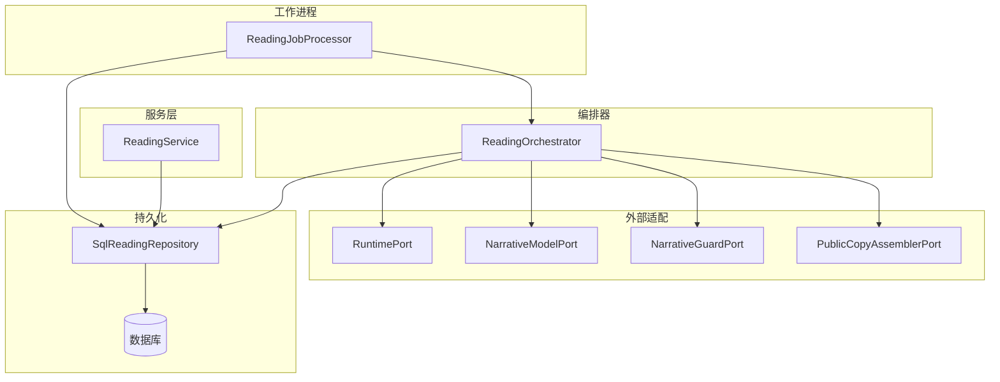
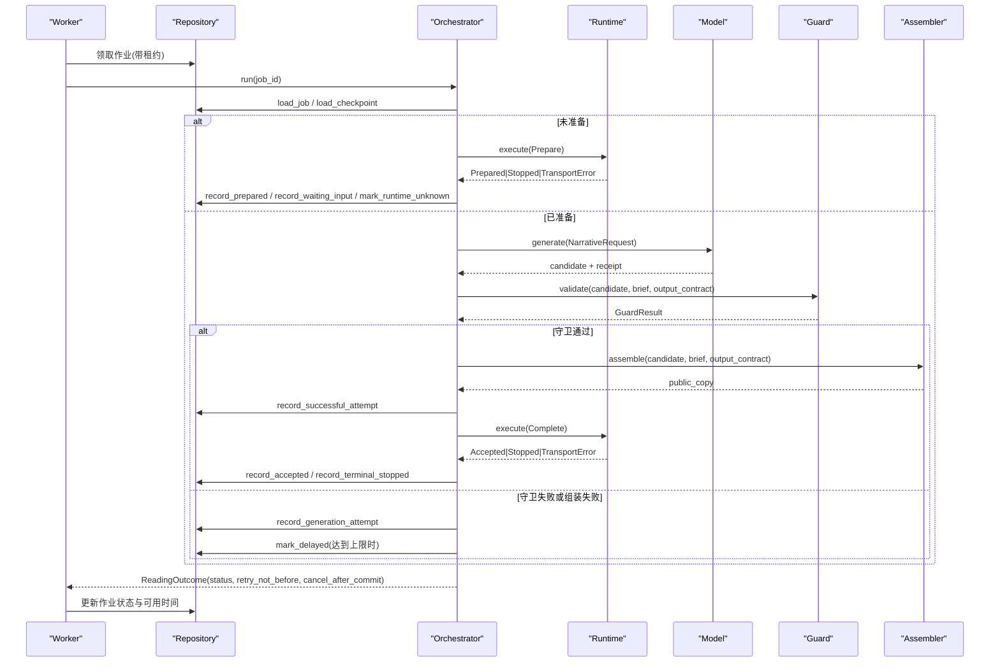
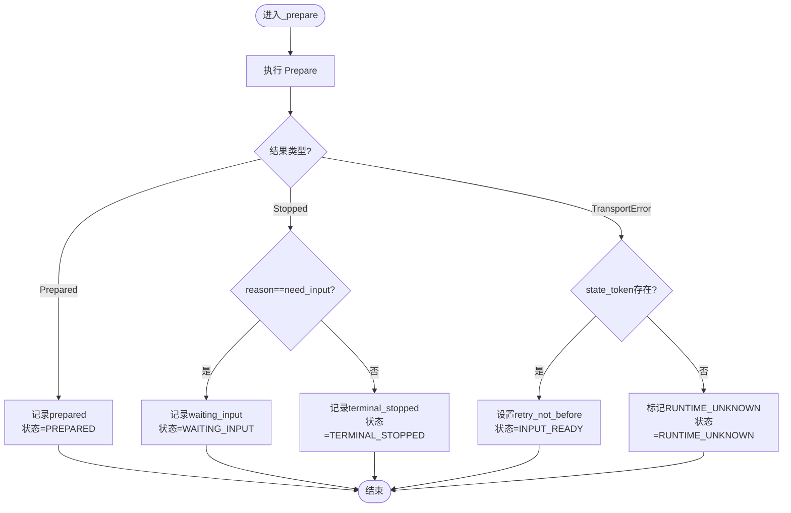
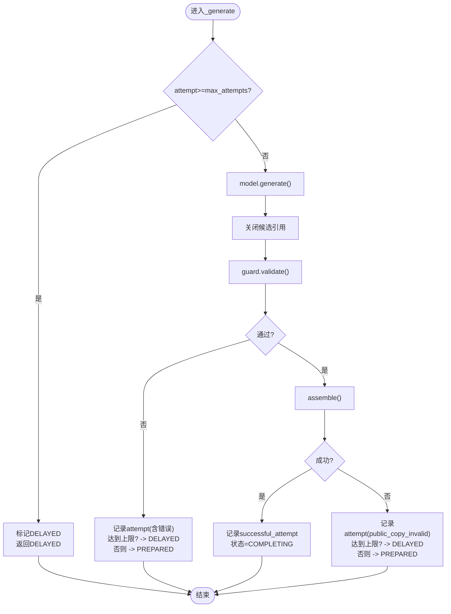
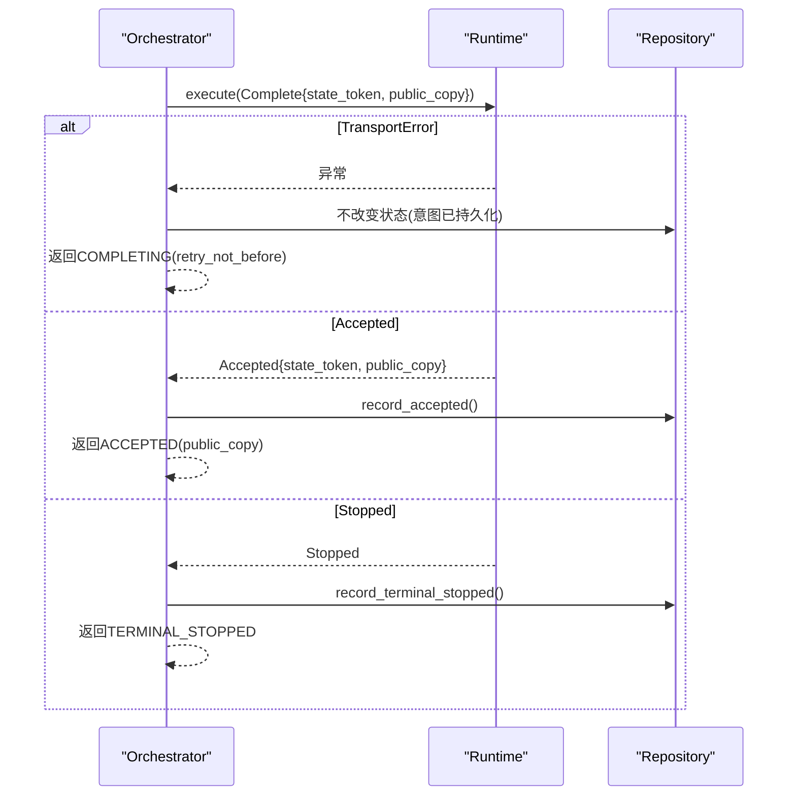
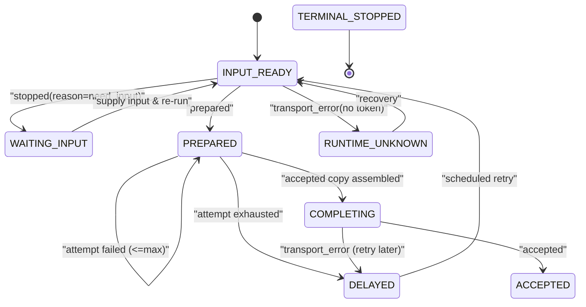
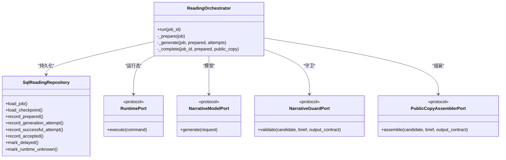

# 任务调度与执行

<cite>
**本文引用的文件**
- [orchestrator.py](file://backend/app/readings/orchestrator.py)
- [models.py](file://backend/app/readings/models.py)
- [repository.py](file://backend/app/readings/repository.py)
- [service.py](file://backend/app/readings/service.py)
- [runtime_contracts.py](file://backend/app/readings/runtime_contracts.py)
- [status.py](file://backend/app/readings/status.py)
- [errors.py](file://backend/app/readings/errors.py)
- [readings.py](file://backend/worker/readings.py)
</cite>

## 目录
1. [简介](#简介)
2. [项目结构](#项目结构)
3. [核心组件](#核心组件)
4. [架构总览](#架构总览)
5. [详细组件分析](#详细组件分析)
6. [依赖关系分析](#依赖关系分析)
7. [性能考虑](#性能考虑)
8. [故障排查指南](#故障排查指南)
9. [结论](#结论)

## 简介
本文聚焦命理解读任务的调度与执行，围绕 ReadingJob 的数据结构与生命周期，深入解析 _prepare、_generate、_complete 三个关键阶段的工作原理，并说明重试机制、错误处理策略与最终状态更新流程。读者可据此理解从“准备”到“生成候选”再到“完成确认”的完整编排过程。

## 项目结构
本仓库采用分层与领域模块组织：
- 领域模型与契约：models.py、runtime_contracts.py、status.py、errors.py
- 编排器：orchestrator.py（ReadingOrchestrator）
- 持久化：repository.py（SqlReadingRepository）
- 服务层：service.py（ReadingService，负责创建版本与作业）
- 工作进程：worker/readings.py（作业领取、租约、状态回写）

图表来源
- [orchestrator.py:178-189](file://backend/app/readings/orchestrator.py#L178-L189)
- [repository.py:51-55](file://backend/app/readings/repository.py#L51-L55)
- [readings.py:164-251](file://backend/worker/readings.py#L164-L251)

章节来源
- [service.py:455-513](file://backend/app/readings/service.py#L455-L513)
- [readings.py:63-82](file://backend/worker/readings.py#L63-L82)

## 核心组件
- ReadingJob：描述一次解读作业的运行时参数与约束，包含 id、prepare_command、narrative_policy_version、output_contract、language、max_output_chars、max_attempts 等字段。
- ReadingOrchestrator：编排 Prepare -> Generate -> Complete 的状态机，协调 Repository、Runtime、Model、Guard、Assembler。
- SqlReadingRepository：封装所有持久化操作，包括作业创建、检查点记录、尝试次数与结果落盘、状态迁移。
- Runtime/Model/Guard/Assembler 端口：通过协议抽象外部依赖，便于替换与测试。
- Worker 读取与租约：从数据库安全地领取作业，使用租约防止重复处理，并在完成后回写状态与延迟时间。

章节来源
- [orchestrator.py:43-58](file://backend/app/readings/orchestrator.py#L43-L58)
- [orchestrator.py:178-189](file://backend/app/readings/orchestrator.py#L178-L189)
- [repository.py:200-224](file://backend/app/readings/repository.py#L200-L224)
- [readings.py:108-161](file://backend/worker/readings.py#L108-L161)

## 架构总览
ReadingOrchestrator.run 根据检查点决定下一步：
- 若已接受则直接返回
- 若终端停止则返回终止结果
- 若存在完成意图则进入 _complete
- 若处于等待输入且无 state_token 则返回终止
- 若已有 Prepared 则进入 _generate
- 否则进入 _prepare

图表来源
- [orchestrator.py:212-248](file://backend/app/readings/orchestrator.py#L212-L248)
- [orchestrator.py:250-285](file://backend/app/readings/orchestrator.py#L250-L285)
- [orchestrator.py:287-394](file://backend/app/readings/orchestrator.py#L287-L394)
- [orchestrator.py:396-435](file://backend/app/readings/orchestrator.py#L396-L435)
- [readings.py:175-231](file://backend/worker/readings.py#L175-L231)

## 详细组件分析

### ReadingJob 数据结构
- id：作业唯一标识，用于加载与追踪。
- prepare_command：Prepare 命令对象，包含 query、intent、facts、state_token、transition 等，由服务层编译后持久化并解密传入。
- narrative_policy_version：叙事策略版本，控制生成时的策略与规则。
- output_contract：输出契约，定义公开副本的结构与限制。
- language：语言代码，如 zh-CN，影响生成语言。
- max_output_chars：最大输出字符数，限制候选长度。
- max_attempts：最大尝试次数，默认 2，限制生成+守卫的总尝试轮次。

章节来源
- [orchestrator.py:43-58](file://backend/app/readings/orchestrator.py#L43-L58)
- [runtime_contracts.py:113-135](file://backend/app/readings/runtime_contracts.py#L113-L135)
- [repository.py:200-224](file://backend/app/readings/repository.py#L200-L224)
- [service.py:505-513](file://backend/app/readings/service.py#L505-L513)

### _prepare 方法：准备阶段
- 调用 runtime.execute(Prepare)，可能返回 Prepared、Stopped 或抛出传输异常。
- 若返回 Prepared：记录 prepared 检查点，设置状态为 PREPARED。
- 若返回 Stopped：
  - need_input：记录 waiting_input，状态 WAITING_INPUT，等待用户补充输入。
  - 其他原因：记录 terminal_stopped，状态 TERMINAL_STOPPED。
- 若发生 RuntimeTransportError：
  - 当 prepare_command.state_token 存在时：返回 INPUT_READY 并设置 retry_not_before（基于 prepare_transport_backoff），以便稍后重试。
  - 否则：标记 RUNTIME_UNKNOWN，发出告警，返回 RUNTIME_UNKNOWN。

图表来源
- [orchestrator.py:250-285](file://backend/app/readings/orchestrator.py#L250-L285)
- [errors.py:8-10](file://backend/app/readings/errors.py#L8-L10)

章节来源
- [orchestrator.py:250-285](file://backend/app/readings/orchestrator.py#L250-L285)

### _generate 方法：候选生成与守卫验证
- 构造 NarrativeRequest（携带 brief、策略版本、输出契约、语言、最大输出字符）。
- 若已完成尝试次数达到上限：标记 DELAYED 并返回。
- 调用 model.generate(request) 获取候选与收据。
- 关闭候选引用（close_candidate_references）。
- 调用 guard.validate(candidate, brief, output_contract)。
- 若守卫通过：
  - 调用 assembler.assemble 组装公共副本。
  - 记录 successful_attempt，状态 COMPLETING。
  - 若存在 model_receipt，发出成本告警。
- 若守卫失败或组装失败：
  - 记录 generation_attempt（含错误列表）。
  - 若达到上限：标记 DELAYED；否则返回 PREPARED（允许重试）。
- 若模型调用取消：
  - 必须携带 safe receipt，否则视为不变量错误。
  - 记录 attempt 并标记 DELAYED，同时设置 cancel_after_commit 以在事务提交后取消。

图表来源
- [orchestrator.py:287-394](file://backend/app/readings/orchestrator.py#L287-L394)

章节来源
- [orchestrator.py:287-394](file://backend/app/readings/orchestrator.py#L287-L394)

### _complete 方法：完成阶段
- 构造 Complete(state_token, public_copy) 并执行 runtime.execute。
- 若返回 Accepted：
  - 校验 state_token 与 public_copy 与预期一致。
  - 记录 accepted，状态 ACCEPTED，返回最终结果。
- 若返回 Stopped：记录 terminal_stopped 并返回终止结果。
- 若发生 RuntimeTransportError：
  - 由于完成意图已持久化，返回 COMPLETING 并设置 retry_not_before（基于 complete_transport_backoff），以便下次重试。

图表来源
- [orchestrator.py:396-435](file://backend/app/readings/orchestrator.py#L396-L435)

章节来源
- [orchestrator.py:396-435](file://backend/app/readings/orchestrator.py#L396-L435)

### 重试机制与延迟策略
- transport_backoff：
  - prepare_transport_backoff：当 Prepare 遇到传输异常且存在 state_token 时，设置 retry_not_before，避免立即重试。
  - complete_transport_backoff：当 Complete 遇到传输异常时，设置 retry_not_before，确保幂等重放。
- max_attempts：
  - 控制生成阶段的尝试次数，达到上限后标记 DELAYED，交由后续调度重试或人工干预。
- 延迟处理：
  - 工作进程根据 outcome.retry_not_before 计算 available_at，将作业推迟到未来再取。
  - 对于 no-token Prepare 的过期租约，工作进程会将状态置为 RUNTIME_UNKNOWN，避免不安全重放。

章节来源
- [orchestrator.py:187-194](file://backend/app/readings/orchestrator.py#L187-L194)
- [orchestrator.py:250-285](file://backend/app/readings/orchestrator.py#L250-L285)
- [orchestrator.py:287-394](file://backend/app/readings/orchestrator.py#L287-L394)
- [orchestrator.py:396-435](file://backend/app/readings/orchestrator.py#L396-L435)
- [readings.py:175-231](file://backend/worker/readings.py#L175-L231)
- [readings.py:121-161](file://backend/worker/readings.py#L121-L161)

### 状态机与最终状态更新
- 状态枚举：INPUT_READY、WAITING_INPUT、TERMINAL_STOPPED、PREPARED、COMPLETING、ACCEPTED、DELAYED、RUNTIME_UNKNOWN。
- 工作进程将 ReadingStatus 映射为作业表 status 与 available_at，实现调度与重试。

图表来源
- [status.py:4-12](file://backend/app/readings/status.py#L4-L12)
- [readings.py:220-231](file://backend/worker/readings.py#L220-L231)

章节来源
- [status.py:4-12](file://backend/app/readings/status.py#L4-L12)
- [readings.py:220-231](file://backend/worker/readings.py#L220-L231)

## 依赖关系分析
- ReadingOrchestrator 依赖：
  - Repository：加载作业与检查点、记录尝试与结果、状态迁移。
  - RuntimePort：执行 Prepare/Complete。
  - NarrativeModelPort：生成候选。
  - NarrativeGuardPort：守卫验证。
  - PublicCopyAssemblerPort：组装公开副本。
  - Clock：时间源，用于重试延迟。
- SqlReadingRepository 依赖：
  - EnvelopeCipher：敏感数据加密/解密。
  - 数据库：读写 ReadingVersion、FactBrief、GenerationAttempt、AcceptedCopy、ReadingJobRecord 等。
- Worker 依赖：
  - 租约与锁：防止并发重复处理。
  - 状态映射：将 ReadingStatus 转为作业表状态与可用时间。

图表来源
- [orchestrator.py:178-189](file://backend/app/readings/orchestrator.py#L178-L189)
- [repository.py:51-55](file://backend/app/readings/repository.py#L51-L55)

章节来源
- [orchestrator.py:178-189](file://backend/app/readings/orchestrator.py#L178-L189)
- [repository.py:51-55](file://backend/app/readings/repository.py#L51-L55)

## 性能考虑
- 最小化网络往返：Prepare/Complete 的传输异常通过 backoff 控制重试频率，避免雪崩。
- 尝试次数限制：max_attempts 控制模型调用与守卫的总轮次，避免无限重试。
- 数据库锁与租约：使用 with_for_update 与 lease 机制保证作业串行处理与幂等性。
- 敏感数据加密：所有中间产物（brief、candidate、accepted copy）均加密存储，降低泄露风险。
- 异步执行：工作进程与编排器均为异步，提升吞吐。

## 故障排查指南
- 传输异常（RuntimeTransportError）：
  - Prepare 阶段：若存在 state_token，返回 INPUT_READY 并设置 retry_not_before；否则标记 RUNTIME_UNKNOWN。
  - Complete 阶段：返回 COMPLETING 并设置 retry_not_before，确保幂等重放。
- 守卫拒绝：
  - 记录 attempt 的错误列表，若达到上限则标记 DELAYED。
- 模型取消：
  - 必须携带 safe receipt，否则抛出不变量错误；记录 attempt 并标记 DELAYED，提交后取消。
- 租约丢失：
  - 工作进程检测到租约失效或过期，抛出 LeaseLostError，作业保持原状等待下次领取。
- 不变量错误：
  - 如 completion intent 不存在 prepared checkpoint、accepted token/copy 不一致等，应快速失败并告警。

章节来源
- [errors.py:4-30](file://backend/app/readings/errors.py#L4-L30)
- [orchestrator.py:250-285](file://backend/app/readings/orchestrator.py#L250-L285)
- [orchestrator.py:287-394](file://backend/app/readings/orchestrator.py#L287-L394)
- [orchestrator.py:396-435](file://backend/app/readings/orchestrator.py#L396-L435)
- [readings.py:175-231](file://backend/worker/readings.py#L175-L231)

## 结论
ReadingJob 作为解读任务的运行时载体，承载了策略版本、输出契约、语言与尝试限制等关键信息。ReadingOrchestrator 通过严格的状态机与检查点机制，将 Prepare、Generate、Complete 三阶段串联起来，配合 Worker 的租约与重试策略，实现了高可靠的任务执行。错误处理与告警贯穿全流程，确保系统在异常情况下仍能恢复与继续推进。