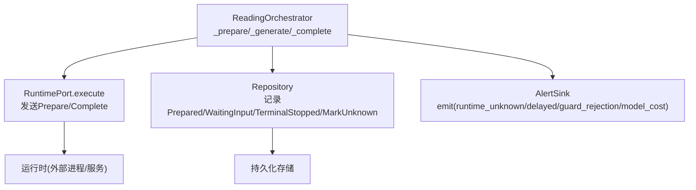
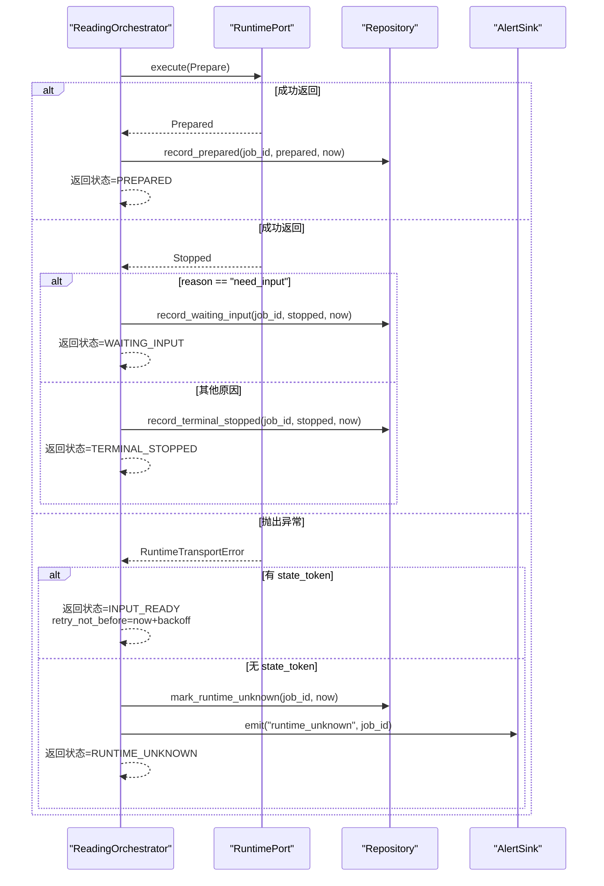
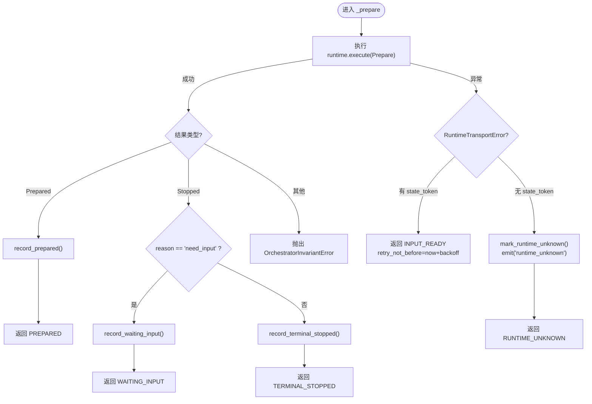
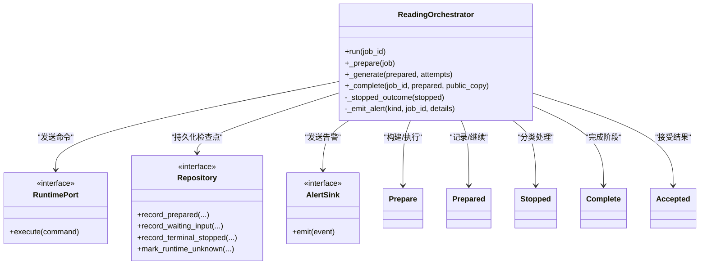

# 准备阶段执行

<cite>
**本文引用的文件**
- [orchestrator.py](file://backend/app/readings/orchestrator.py)
- [runtime_contracts.py](file://backend/app/readings/runtime_contracts.py)
- [errors.py](file://backend/app/readings/errors.py)
- [alerts.py](file://backend/app/readings/alerts.py)
- [status.py](file://backend/app/readings/status.py)
- [readings.py](file://backend/worker/readings.py)
- [test_reading_orchestrator_prepare.py](file://backend/tests/test_reading_orchestrator_prepare.py)
</cite>

## 目录
1. [简介](#简介)
2. [项目结构](#项目结构)
3. [核心组件](#核心组件)
4. [架构总览](#架构总览)
5. [详细组件分析](#详细组件分析)
6. [依赖关系分析](#依赖关系分析)
7. [性能考虑](#性能考虑)
8. [故障排查指南](#故障排查指南)
9. [结论](#结论)

## 简介
本文聚焦命理解读任务“准备阶段”的执行流程，围绕 orchestrator 中的 _prepare 方法展开，系统说明 Prepare 命令的构建与执行、运行时通信机制、结果处理逻辑、重试策略、未知状态处理以及错误恢复。目标是让读者在不深入代码细节的情况下，也能准确理解准备阶段的完整行为与边界条件。

## 项目结构
准备阶段的核心位于后端 readings 模块：
- 编排器 orchestrator 负责调度准备、生成与完成三个阶段；
- runtime_contracts 定义 Prepare/Prepared/Stopped/Complete/Accepted 等命令与结果契约；
- errors 定义运行时传输异常等错误类型；
- alerts 提供告警事件抽象与实现；
- status 定义读取任务的状态枚举；
- worker 侧在领取任务时，对无 state_token 的过期 prepare 进行隔离并标记为 RUNTIME_UNKNOWN。

图表来源
- [orchestrator.py:178-285](file://backend/app/readings/orchestrator.py#L178-L285)
- [runtime_contracts.py:113-155](file://backend/app/readings/runtime_contracts.py#L113-L155)
- [alerts.py:16-75](file://backend/app/readings/alerts.py#L16-L75)
- [status.py:4-12](file://backend/app/readings/status.py#L4-L12)

章节来源
- [orchestrator.py:178-285](file://backend/app/readings/orchestrator.py#L178-L285)
- [runtime_contracts.py:113-155](file://backend/app/readings/runtime_contracts.py#L113-L155)
- [alerts.py:16-75](file://backend/app/readings/alerts.py#L16-L75)
- [status.py:4-12](file://backend/app/readings/status.py#L4-L12)

## 核心组件
- ReadingOrchestrator：编排准备、模型生成、完成的整体流程；维护重试退避时间、告警输出等。
- RuntimePort：与运行时通信的抽象接口，execute(command) 返回 MingliResult。
- Repository：持久化检查点（prepared/waiting_input/terminal_stopped）和特殊标记（mark_runtime_unknown）。
- Alerts：统一告警事件，用于记录 runtime_unknown、delayed、guard_rejection、model_cost 等。
- Status：任务状态机枚举，包含 INPUT_READY/WAITING_INPUT/TERMINAL_STOPPED/PREPARED/COMPLETING/ACCEPTED/DELAYED/RUNTIME_UNKNOWN。
- Contracts：Prepare/Prepared/Stopped/Complete/Accepted 等命令与结果的强约束数据结构。

章节来源
- [orchestrator.py:43-189](file://backend/app/readings/orchestrator.py#L43-L189)
- [runtime_contracts.py:105-251](file://backend/app/readings/runtime_contracts.py#L105-L251)
- [alerts.py:16-75](file://backend/app/readings/alerts.py#L16-L75)
- [status.py:4-12](file://backend/app/readings/status.py#L4-L12)

## 架构总览
准备阶段由 orchestrator.run 进入，若尚未 prepared，则调用 _prepare。_prepare 会：
- 向运行时发送 Prepare 命令；
- 捕获 RuntimeTransportError，按是否携带 state_token 分流处理；
- 将 Prepared 写入仓库并推进到 PREPARED；
- 将 Stopped 分类为 need_input（等待输入）或其他原因（终止），并推进到 WAITING_INPUT 或 TERMINAL_STOPPED；
- 其他结果视为不变量错误。

图表来源
- [orchestrator.py:250-285](file://backend/app/readings/orchestrator.py#L250-L285)
- [runtime_contracts.py:113-251](file://backend/app/readings/runtime_contracts.py#L113-L251)
- [alerts.py:16-75](file://backend/app/readings/alerts.py#L16-L75)
- [status.py:4-12](file://backend/app/readings/status.py#L4-L12)

## 详细组件分析

### _prepare 方法工作原理
- 构建与执行 Prepare：通过 RuntimePort.execute 发送 Prepare 命令。Prepare 包含 query、intent、facts、state_token、transition 等字段，并在构造时进行 JSON Schema 校验。
- 结果处理：
  - Prepared：记录 prepared 检查点，推进到 PREPARED。
  - Stopped：
    - need_input：记录 waiting_input，推进到 WAITING_INPUT。
    - 其他原因：记录 terminal_stopped，推进到 TERMINAL_STOPPED。
  - 其他结果：抛出 OrchestratorInvariantError。
- 异常处理：
  - RuntimeTransportError：
    - 若 Prepare 携带 state_token：返回 INPUT_READY，并设置 retry_not_before = now + prepare_transport_backoff，交由上层调度延迟重试。
    - 若无 state_token：调用 repository.mark_runtime_unknown 标记 RUNTIME_UNKNOWN，并发送 alert 事件 runtime_unknown。

图表来源
- [orchestrator.py:250-285](file://backend/app/readings/orchestrator.py#L250-L285)
- [runtime_contracts.py:113-251](file://backend/app/readings/runtime_contracts.py#L113-L251)
- [alerts.py:16-75](file://backend/app/readings/alerts.py#L16-L75)
- [status.py:4-12](file://backend/app/readings/status.py#L4-L12)

章节来源
- [orchestrator.py:250-285](file://backend/app/readings/orchestrator.py#L250-L285)
- [runtime_contracts.py:113-251](file://backend/app/readings/runtime_contracts.py#L113-L251)
- [errors.py:4-30](file://backend/app/readings/errors.py#L4-L30)
- [alerts.py:16-75](file://backend/app/readings/alerts.py#L16-L75)
- [status.py:4-12](file://backend/app/readings/status.py#L4-L12)

### Prepare 命令构建与执行
- Prepare 数据类包含 query、intent、facts、state_token、transition、kind="prepare"，并在 __post_init__ 中冻结 intent/facts 并进行命令 schema 校验。
- 首次准备通常不带 state_token；恢复或重试场景可能携带 state_token，以支持幂等与重放安全。
- 执行通过 RuntimePort.execute 异步调用，返回 Prepared/Stopped/Accepted/Described 之一。

章节来源
- [runtime_contracts.py:113-155](file://backend/app/readings/runtime_contracts.py#L113-L155)
- [orchestrator.py:250-285](file://backend/app/readings/orchestrator.py#L250-L285)

### 运行时通信机制
- 使用抽象接口 RuntimePort.execute(command) 屏蔽底层实现差异（进程、HTTP、本地门控等）。
- 返回值严格遵循 MingliResult 契约，确保上游编排器可确定性分支。

章节来源
- [orchestrator.py:85-87](file://backend/app/readings/orchestrator.py#L85-L87)
- [runtime_contracts.py:155-251](file://backend/app/readings/runtime_contracts.py#L155-L251)

### 结果处理逻辑
- Prepared：记录 prepared 检查点后返回 PREPARED，后续进入 _generate。
- Stopped：
  - need_input：记录 waiting_input，返回 WAITING_INPUT，等待用户补充输入。
  - 其他原因：记录 terminal_stopped，返回 TERMINAL_STOPPED，不再重试。
- 其他结果：抛出 OrchestratorInvariantError，表示状态机不变量被破坏。

章节来源
- [orchestrator.py:268-285](file://backend/app/readings/orchestrator.py#L268-L285)
- [status.py:4-12](file://backend/app/readings/status.py#L4-L12)

### 不同返回结果的处理流程
- Prepared：
  - 记录 prepared 检查点；
  - 返回 PREPARED，后续由 run 路由到 _generate。
- Stopped：
  - need_input：记录 waiting_input；返回 WAITING_INPUT。
  - 其他原因：记录 terminal_stopped；返回 TERMINAL_STOPPED。
- RuntimeTransportError：
  - 带 state_token：返回 INPUT_READY，并设置 retry_not_before；
  - 无 state_token：标记 RUNTIME_UNKNOWN，发送 alert。

章节来源
- [orchestrator.py:250-285](file://backend/app/readings/orchestrator.py#L250-L285)
- [alerts.py:16-75](file://backend/app/readings/alerts.py#L16-L75)
- [status.py:4-12](file://backend/app/readings/status.py#L4-L12)

### 重试机制与 state_token、transport_backoff
- state_token 的作用：
  - 当 Prepare 携带 state_token 且发生 RuntimeTransportError 时，表明可能存在已执行的副作用但结果未知；此时不立即重试，而是返回 INPUT_READY 并设置 retry_not_before，由上层调度在退避后重试，保证幂等与重放安全。
  - 无 state_token 的 Prepare 失败无法区分“未执行”和“已执行”，因此直接标记 RUNTIME_UNKNOWN，避免自动重试造成重复副作用。
- transport_backoff：
  - prepare_transport_backoff：用于 Prepare 阶段的退避时间，默认 timedelta(seconds=5)，可通过构造函数注入。
  - complete_transport_backoff：用于 Complete 阶段的退避时间，同样默认 5 秒。
- 延迟重试策略：
  - 返回的 ReadingOutcome 包含 retry_not_before，上层调度器据此决定何时重新入队该任务。

章节来源
- [orchestrator.py:178-194](file://backend/app/readings/orchestrator.py#L178-L194)
- [orchestrator.py:250-285](file://backend/app/readings/orchestrator.py#L250-L285)
- [test_reading_orchestrator_prepare.py:161-191](file://backend/tests/test_reading_orchestrator_prepare.py#L161-L191)

### 运行时未知状态的处理逻辑
- 触发条件：Prepare 阶段抛出 RuntimeTransportError 且 state_token 为 None。
- 处理动作：
  - repository.mark_runtime_unknown：将任务状态标记为 RUNTIME_UNKNOWN；
  - 发送 alert 事件 runtime_unknown，附带 job_id 以便追踪。
- 上层处理：
  - worker 在 claim_one 时，若发现过期的无 token Prepare，也会将其置为 RUNTIME_UNKNOWN 并释放租约，防止误重试。

章节来源
- [orchestrator.py:250-285](file://backend/app/readings/orchestrator.py#L250-L285)
- [readings.py:121-149](file://backend/worker/readings.py#L121-L149)
- [alerts.py:16-75](file://backend/app/readings/alerts.py#L16-L75)
- [status.py:4-12](file://backend/app/readings/status.py#L4-L12)

### 准备阶段的错误处理与故障恢复
- 运行时传输异常：
  - 带 state_token：延迟重试（INPUT_READY + retry_not_before）；
  - 无 state_token：标记 RUNTIME_UNKNOWN 并告警。
- 生成阶段异常（非准备阶段但相关）：
  - NarrativeGenerationError/NarrativeGenerationCancelled：记录尝试次数，达到上限后标记 DELAYED 并告警。
- 完成阶段异常：
  - Complete 阶段遇到 RuntimeTransportError：保持 COMPLETING 状态并设置 retry_not_before，下次重试精确重放同一 token 与 public_copy。

章节来源
- [orchestrator.py:287-435](file://backend/app/readings/orchestrator.py#L287-L435)
- [errors.py:4-30](file://backend/app/readings/errors.py#L4-L30)
- [alerts.py:16-75](file://backend/app/readings/alerts.py#L16-L75)

## 依赖关系分析
- orchestrator 依赖：
  - RuntimePort：与运行时通信；
  - Repository：持久化检查点与状态标记；
  - AlertSink：告警事件；
  - Clock：时间源，用于计算 retry_not_before。
- contracts：
  - Prepare/Prepared/Stopped/Complete/Accepted 等强类型对象，确保跨进程/服务的契约一致性。
- worker：
  - 在领取任务时对无 token 的过期 prepare 进行隔离，避免误重试。

图表来源
- [orchestrator.py:178-450](file://backend/app/readings/orchestrator.py#L178-L450)
- [runtime_contracts.py:113-251](file://backend/app/readings/runtime_contracts.py#L113-L251)
- [alerts.py:16-75](file://backend/app/readings/alerts.py#L16-L75)

章节来源
- [orchestrator.py:178-450](file://backend/app/readings/orchestrator.py#L178-L450)
- [runtime_contracts.py:113-251](file://backend/app/readings/runtime_contracts.py#L113-L251)
- [alerts.py:16-75](file://backend/app/readings/alerts.py#L16-L75)

## 性能考虑
- 退避重试：prepare_transport_backoff 与 complete_transport_backoff 控制重试频率，避免雪崩与资源争用。
- 幂等性：通过 state_token 保证带副作用的命令可安全重放，减少重复执行风险。
- 最小化敏感信息：异常与日志不包含敏感 payload，降低泄露风险。
- 快速失败：遇到不变量错误立即抛出，便于定位问题。

[本节为通用指导，无需特定文件引用]

## 故障排查指南
- 现象：任务长时间停留在 RUNTIME_UNKNOWN
  - 检查 Prepare 是否携带 state_token；若无，需人工介入确认运行时状态。
  - 查看 alert 事件 runtime_unknown 的 job_id 与详情。
- 现象：频繁重试但未推进
  - 检查 prepare_transport_backoff 配置是否合理。
  - 确认 Retry 后的 Prepare 是否携带正确的 state_token。
- 现象：需要输入但未提示
  - 检查 Stopped.reason 是否为 need_input；若是，应记录 waiting_input 并返回 WAITING_INPUT。
- 现象：完成后仍显示 COMPLETING
  - 检查 Complete 阶段是否遇到 RuntimeTransportError；若有，将设置 retry_not_before 并延迟重试。

章节来源
- [orchestrator.py:250-435](file://backend/app/readings/orchestrator.py#L250-L435)
- [alerts.py:16-75](file://backend/app/readings/alerts.py#L16-L75)
- [status.py:4-12](file://backend/app/readings/status.py#L4-L12)

## 结论
准备阶段通过严格的契约与状态机设计，确保 Prepare 命令的可重放性与安全性。state_token 是幂等与重放的关键，配合 transport_backoff 实现稳健的重试策略。对于未知状态的 Prepare，系统选择保守处理：标记 RUNTIME_UNKNOWN 并告警，避免自动重试带来的副作用风险。整体流程清晰、可观测性强，便于在生产环境中定位与恢复。

[本节为总结性内容，无需特定文件引用]