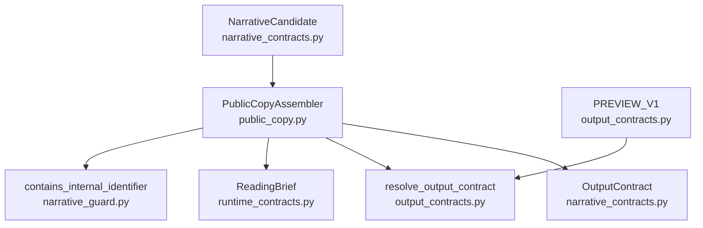
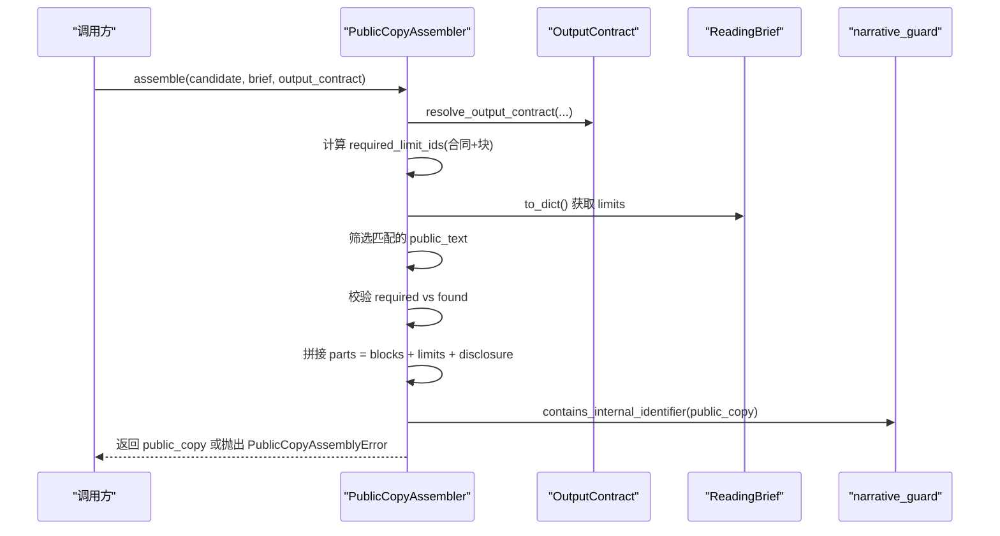
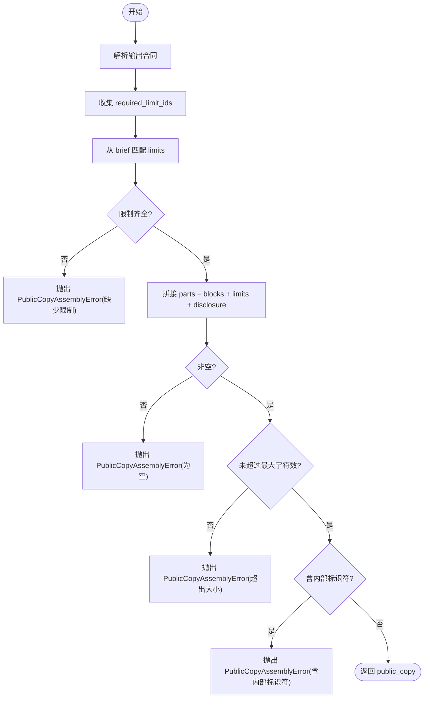
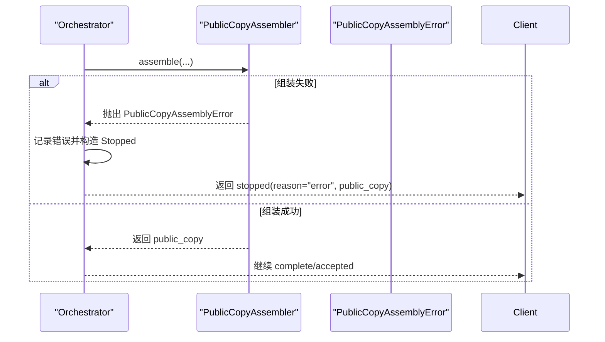
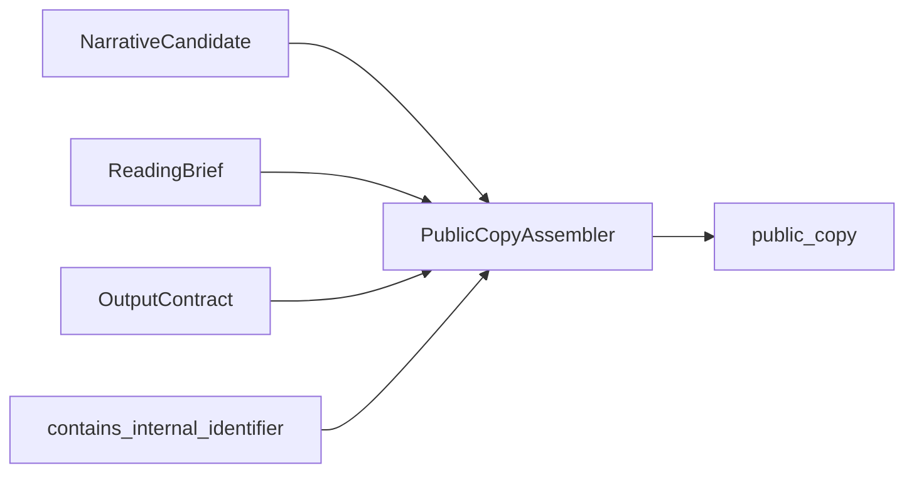

# 公共副本组装

<cite>
**本文引用的文件**
- [public_copy.py](file://backend/app/readings/public_copy.py)
- [output_contracts.py](file://backend/app/readings/output_contracts.py)
- [narrative_contracts.py](file://backend/app/readings/narrative_contracts.py)
- [runtime_contracts.py](file://backend/app/readings/runtime_contracts.py)
- [narrative_guard.py](file://backend/app/readings/narrative_guard.py)
- [orchestrator.py](file://backend/app/readings/orchestrator.py)
- [test_public_copy.py](file://backend/tests/test_public_copy.py)
- [test_narrative_guard.py](file://backend/tests/test_narrative_guard.py)
</cite>

## 目录
1. [简介](#简介)
2. [项目结构](#项目结构)
3. [核心组件](#核心组件)
4. [架构总览](#架构总览)
5. [详细组件分析](#详细组件分析)
6. [依赖关系分析](#依赖关系分析)
7. [性能考量](#性能考量)
8. [故障排查指南](#故障排查指南)
9. [结论](#结论)
10. [附录](#附录)

## 简介
本文件聚焦“命理解读公共副本组装”能力，围绕 PublicCopyAssembler 的工作流程展开，系统说明候选数据处理、模板渲染与输出格式化规则；阐述数据转换（字段映射、类型转换、格式标准化）；解释组装错误处理机制与恢复策略；说明 OutputContract 的作用与验证过程；并提供配置示例与扩展自定义输出的方法；最后给出性能优化建议与最佳实践。

## 项目结构
与公共副本组装直接相关的代码集中在后端 readings 模块中：
- 组装器与错误定义：public_copy.py
- 输出合同管理与解析：output_contracts.py
- 叙事候选与输出合同的数据模型：narrative_contracts.py
- 运行时契约与 ReadingBrief：runtime_contracts.py
- 内容安全与引用闭合校验：narrative_guard.py
- 编排层对组装器的使用与异常捕获：orchestrator.py
- 测试用例覆盖组装行为与边界条件：test_public_copy.py、test_narrative_guard.py

图表来源
- [public_copy.py:13-45](file://backend/app/readings/public_copy.py#L13-L45)
- [output_contracts.py:10-34](file://backend/app/readings/output_contracts.py#L10-L34)
- [narrative_contracts.py:16-137](file://backend/app/readings/narrative_contracts.py#L16-L137)
- [runtime_contracts.py:74-93](file://backend/app/readings/runtime_contracts.py#L74-L93)
- [narrative_guard.py:18-41](file://backend/app/readings/narrative_guard.py#L18-L41)

章节来源
- [public_copy.py:1-46](file://backend/app/readings/public_copy.py#L1-L46)
- [output_contracts.py:1-35](file://backend/app/readings/output_contracts.py#L1-L35)
- [narrative_contracts.py:1-168](file://backend/app/readings/narrative_contracts.py#L1-L168)
- [runtime_contracts.py:1-304](file://backend/app/readings/runtime_contracts.py#L1-L304)
- [narrative_guard.py:1-191](file://backend/app/readings/narrative_guard.py#L1-L191)
- [orchestrator.py:28-335](file://backend/app/readings/orchestrator.py#L28-L335)
- [test_public_copy.py:1-77](file://backend/tests/test_public_copy.py#L1-L77)
- [test_narrative_guard.py:1-245](file://backend/tests/test_narrative_guard.py#L1-L245)

## 核心组件
- PublicCopyAssembler：负责将 NarrativeCandidate 的文本块与 ReadingBrief 中的限制声明、以及 OutputContract 的披露文案机械拼接为最终公开副本，并进行多重安全检查。
- OutputContract：描述产品版本对外输出的约束，包括语言、块数范围、最大字符数、必须覆盖的维度与限制类型、以及披露文案。
- NarrativeCandidate/NarrativeBlock：承载候选解读的结构化数据，包含每个块的文本、主题、维度、主张类型、确定性级别、引用关系及限制类型等。
- ReadingBrief：来自运行时的上下文摘要，包含事实、证据、发现、限制、请求视图等，供组装时筛选并注入必要的限制声明。
- NarrativeGuard：在组装前/后对候选内容进行引用闭合、合规性、长度、内部标识符等检查，确保输出安全可控。

章节来源
- [public_copy.py:9-45](file://backend/app/readings/public_copy.py#L9-L45)
- [narrative_contracts.py:16-137](file://backend/app/readings/narrative_contracts.py#L16-L137)
- [runtime_contracts.py:74-93](file://backend/app/readings/runtime_contracts.py#L74-L93)
- [narrative_guard.py:70-191](file://backend/app/readings/narrative_guard.py#L70-L191)

## 架构总览
PublicCopyAssembler 的装配流程如下：
- 解析输出合同：支持传入字符串或 OutputContract 对象，统一解析为 OutputContract。
- 计算必需的限制集合：从 OutputContract.required_limit_kind_ids 与候选各块的 limit_kind_ids 合并得到 required_limit_ids。
- 从 ReadingBrief 中筛选并提取所需限制文本：遍历 brief.limits，匹配 kind_id，收集 public_text。
- 校验限制完整性：若 found_limit_ids 与 required_limit_ids 不一致，抛出 PublicCopyAssemblyError。
- 拼接公开副本：按顺序拼接候选块文本、限制文本、披露文案，并以双换行分隔。
- 最终安全检查：非空、不超过最大字符数、不包含内部标识符。任一失败均抛出 PublicCopyAssemblyError。

图表来源
- [public_copy.py:14-45](file://backend/app/readings/public_copy.py#L14-L45)
- [output_contracts.py:24-34](file://backend/app/readings/output_contracts.py#L24-L34)
- [narrative_guard.py:40-41](file://backend/app/readings/narrative_guard.py#L40-L41)

章节来源
- [public_copy.py:14-45](file://backend/app/readings/public_copy.py#L14-L45)
- [output_contracts.py:24-34](file://backend/app/readings/output_contracts.py#L24-L34)
- [narrative_guard.py:40-41](file://backend/app/readings/narrative_guard.py#L40-L41)

## 详细组件分析

### PublicCopyAssembler 工作流程
- 输入：
  - candidate：NarrativeCandidate，包含若干 NarrativeBlock。
  - brief：ReadingBrief，包含 facts/evidence/findings/limits 等运行时上下文。
  - output_contract：字符串或 OutputContract。
- 处理：
  - 解析输出合同，确定语言、块数范围、最大字符数、必须维度与限制、披露文案。
  - 汇总 required_limit_ids 并与 brief 中的 limits 进行匹配，收集 public_text。
  - 校验限制是否齐全，缺失则报错。
  - 拼接候选块文本、限制文本、披露文案，形成最终 public_copy。
  - 执行最终安全检查：非空、大小不超合同上限、不含内部标识符。
- 输出：
  - 成功返回 public_copy 字符串；失败抛出 PublicCopyAssemblyError。

图表来源
- [public_copy.py:14-45](file://backend/app/readings/public_copy.py#L14-L45)

章节来源
- [public_copy.py:14-45](file://backend/app/readings/public_copy.py#L14-L45)

### 数据转换与格式化规则
- 字段映射：
  - 候选块：text → 直接作为公开副本片段。
  - 限制：brief.limits 中 kind_id 匹配 required_limit_ids 的项，取其 public_text 追加到副本末尾。
  - 披露文案：OutputContract.disclosure_text 固定追加到最后。
- 类型转换：
  - output_contract 支持 str 或 OutputContract，通过 resolve_output_contract 统一为 OutputContract。
  - ReadingBrief.to_dict() 用于读取 limits 列表，键名与值类型由 schema 保证。
- 格式标准化：
  - 各部分以双换行 "\n\n" 连接，确保可读性与段落分隔。
  - 最终结果需满足非空、长度不超过 max_output_chars、不含内部标识符。

章节来源
- [public_copy.py:20-45](file://backend/app/readings/public_copy.py#L20-L45)
- [output_contracts.py:24-34](file://backend/app/readings/output_contracts.py#L24-L34)
- [runtime_contracts.py:74-93](file://backend/app/readings/runtime_contracts.py#L74-L93)

### 组装错误处理与恢复策略
- 错误类型：
  - PublicCopyAssemblyError：继承自 ValueError，表示机械组装后的副本不可提交完成。
- 触发场景：
  - 缺少必需的限制声明。
  - 最终副本为空。
  - 最终副本超过合同允许的最大字符数。
  - 最终副本包含内部标识符（如 state_token、fact:、finding:、evidence:、subject:、schema、prompt、provider 等）。
- 恢复策略：
  - 上游编排层捕获 PublicCopyAssemblyError 并回退到“停止”状态，携带 public_copy 与原因，交由调用方决定重试或提示用户。
  - 可通过调整候选块、补充限制、缩短文本或更换输出合同来修复。

图表来源
- [public_copy.py:9-45](file://backend/app/readings/public_copy.py#L9-L45)
- [orchestrator.py:28-335](file://backend/app/readings/orchestrator.py#L28-L335)

章节来源
- [public_copy.py:9-45](file://backend/app/readings/public_copy.py#L9-L45)
- [orchestrator.py:28-335](file://backend/app/readings/orchestrator.py#L28-L335)

### 输出合同 OutputContract 的作用与验证
- 作用：
  - 规定对外输出的语言、块数范围、最大字符数、必须覆盖的维度与限制类型、披露文案。
  - 作为公共副本的最终约束，确保不同产品版本输出一致且合规。
- 验证过程：
  - 构建 OutputContract 时会校验 schema 与 min_blocks ≤ max_blocks。
  - 解析阶段 resolve_output_contract 支持字符串或对象，未知合同会抛出 UnknownOutputContractError。
  - 组装阶段依据 contract.max_output_chars 与 required_limit_kind_ids 进行最终校验。

章节来源
- [narrative_contracts.py:91-137](file://backend/app/readings/narrative_contracts.py#L91-L137)
- [output_contracts.py:6-34](file://backend/app/readings/output_contracts.py#L6-L34)
- [public_copy.py:20-45](file://backend/app/readings/public_copy.py#L20-L45)

### 具体组装配置示例与扩展方法
- 使用内置合同：
  - 以字符串 "preview-v1" 作为 output_contract，自动解析为 PREVIEW_V1。
  - 适用于预览版输出，具备固定的披露文案与限制要求。
- 自定义合同：
  - 构造 OutputContract 实例，指定 contract_id、language、min/max_blocks、max_output_chars、required_dimension_ids、required_limit_kind_ids、disclosure_text。
  - 注意：自定义合同不会注册到 _OUTPUT_CONTRACTS，因此只能通过对象形式传入，避免通过字符串解析。
- 扩展点：
  - 新增输出合同：在 output_contracts.py 中定义新常量并加入 _OUTPUT_CONTRACTS 映射，即可通过字符串解析。
  - 修改披露文案：调整 OutputContract.disclosure_text。
  - 调整限制要求：更新 required_limit_kind_ids，确保 brief 中存在对应 kind_id 的 public_text。

章节来源
- [output_contracts.py:10-34](file://backend/app/readings/output_contracts.py#L10-L34)
- [narrative_contracts.py:91-137](file://backend/app/readings/narrative_contracts.py#L91-L137)
- [test_public_copy.py:11-77](file://backend/tests/test_public_copy.py#L11-L77)

## 依赖关系分析
- PublicCopyAssembler 依赖：
  - NarrativeCandidate：提供待渲染的文本块与元数据。
  - ReadingBrief：提供限制声明与上下文。
  - OutputContract：提供输出约束与披露文案。
  - narrative_guard.contains_internal_identifier：最终安全扫描。
- 耦合与内聚：
  - 组装逻辑集中于 PublicCopyAssembler，职责单一，内聚度高。
  - 通过 OutputContract 抽象输出约束，降低与具体产品版本的耦合。
- 外部依赖：
  - runtime_contracts._validate_schema：基于 JSON Schema 的强类型校验。
  - output_contracts._OUTPUT_CONTRACTS：只读映射，防止篡改。

图表来源
- [public_copy.py:14-45](file://backend/app/readings/public_copy.py#L14-L45)
- [narrative_contracts.py:16-137](file://backend/app/readings/narrative_contracts.py#L16-L137)
- [runtime_contracts.py:74-93](file://backend/app/readings/runtime_contracts.py#L74-L93)
- [narrative_guard.py:40-41](file://backend/app/readings/narrative_guard.py#L40-L41)

章节来源
- [public_copy.py:14-45](file://backend/app/readings/public_copy.py#L14-L45)
- [narrative_contracts.py:16-137](file://backend/app/readings/narrative_contracts.py#L16-L137)
- [runtime_contracts.py:74-93](file://backend/app/readings/runtime_contracts.py#L74-L93)
- [narrative_guard.py:40-41](file://backend/app/readings/narrative_guard.py#L40-L41)

## 性能考量
- 最小化重复计算：
  - required_limit_ids 仅计算一次，使用集合去重与快速查找。
- 高效匹配：
  - brief.limits 遍历与 kind_id 匹配采用集合比较，减少冗余。
- 尽早失败：
  - 先校验限制完整性，再拼接与最终检查，避免无谓计算。
- 内存友好：
  - 使用 tuple 与 MappingProxyType 冻结数据结构，减少拷贝与可变副作用。
- 建议：
  - 若 brief.limits 规模较大，可预先建立 kind_id 索引以提升匹配效率。
  - 对超长文本进行分段检查，避免一次性大对象操作。

[本节提供通用指导，无需特定文件引用]

## 故障排查指南
- 常见错误与定位：
  - “缺少必需限制”：检查 OutputContract.required_limit_kind_ids 与 brief.limits 中是否存在对应 kind_id 的 public_text。
  - “副本为空”：确认候选块 text 非空，或至少有一块被保留。
  - “超出大小”：核对 OutputContract.max_output_chars，必要时缩短文本或调整合同。
  - “包含内部标识符”：检查最终 public_copy 是否含有 state_token、fact:、finding:、evidence:、subject:、schema、prompt、provider 等关键字。
- 调试步骤：
  - 打印 required_limit_ids 与 found_limit_ids，确认匹配情况。
  - 逐步注释拼接段，定位问题来源（块、限制、披露文案）。
  - 使用单元测试夹具与断言复现问题。
- 恢复建议：
  - 修正候选块或补充限制声明。
  - 调整输出合同参数（如增大 max_output_chars）。
  - 清理内部标识符后再提交。

章节来源
- [public_copy.py:20-45](file://backend/app/readings/public_copy.py#L20-L45)
- [test_public_copy.py:30-77](file://backend/tests/test_public_copy.py#L30-L77)
- [narrative_guard.py:18-41](file://backend/app/readings/narrative_guard.py#L18-L41)

## 结论
PublicCopyAssembler 以严格的契约驱动与安全检查为核心，确保命理解读的公开副本在内容、长度与安全上符合产品规范。通过 OutputContract 与 ReadingBrief 的配合，实现了灵活而稳定的组装流程；配合 NarrativeGuard 的前置与后置校验，构建了完整的质量保障体系。遵循本文的配置与最佳实践，可有效扩展输出格式、提升性能并降低出错概率。

[本节总结性内容，无需特定文件引用]

## 附录
- 关键类与方法路径参考：
  - PublicCopyAssembler.assemble：[public_copy.py:14-45](file://backend/app/readings/public_copy.py#L14-L45)
  - resolve_output_contract：[output_contracts.py:24-34](file://backend/app/readings/output_contracts.py#L24-L34)
  - OutputContract 数据模型：[narrative_contracts.py:91-137](file://backend/app/readings/narrative_contracts.py#L91-L137)
  - ReadingBrief 数据访问：[runtime_contracts.py:74-93](file://backend/app/readings/runtime_contracts.py#L74-L93)
  - 内部标识符检测：[narrative_guard.py:40-41](file://backend/app/readings/narrative_guard.py#L40-L41)
- 测试用例参考：
  - 组装行为与边界：[test_public_copy.py:11-77](file://backend/tests/test_public_copy.py#L11-L77)
  - 守卫规则与反例：[test_narrative_guard.py:111-245](file://backend/tests/test_narrative_guard.py#L111-L245)