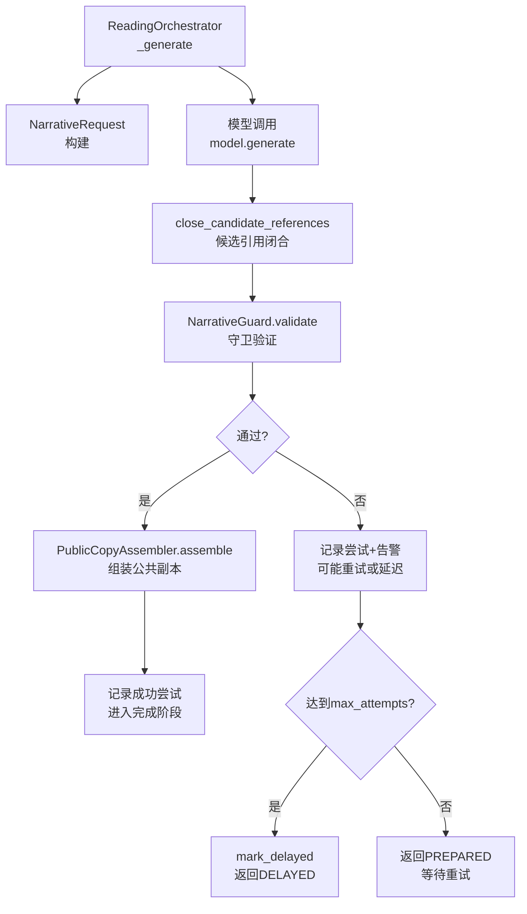
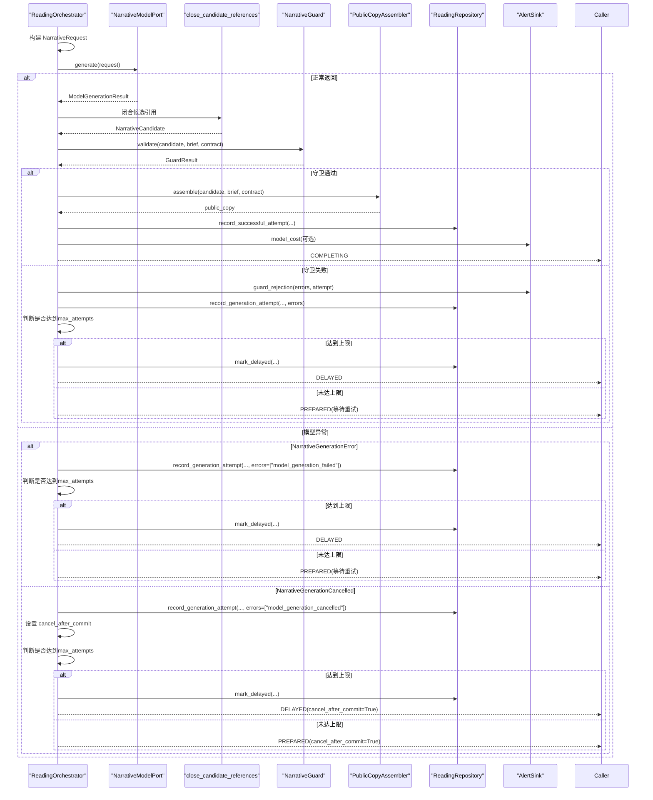
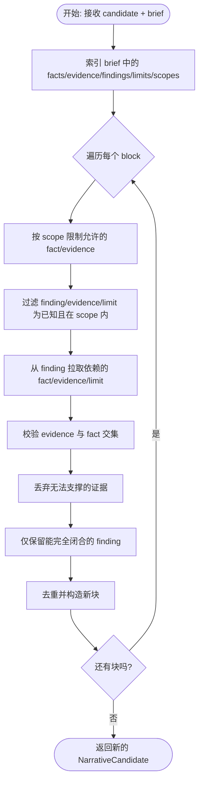
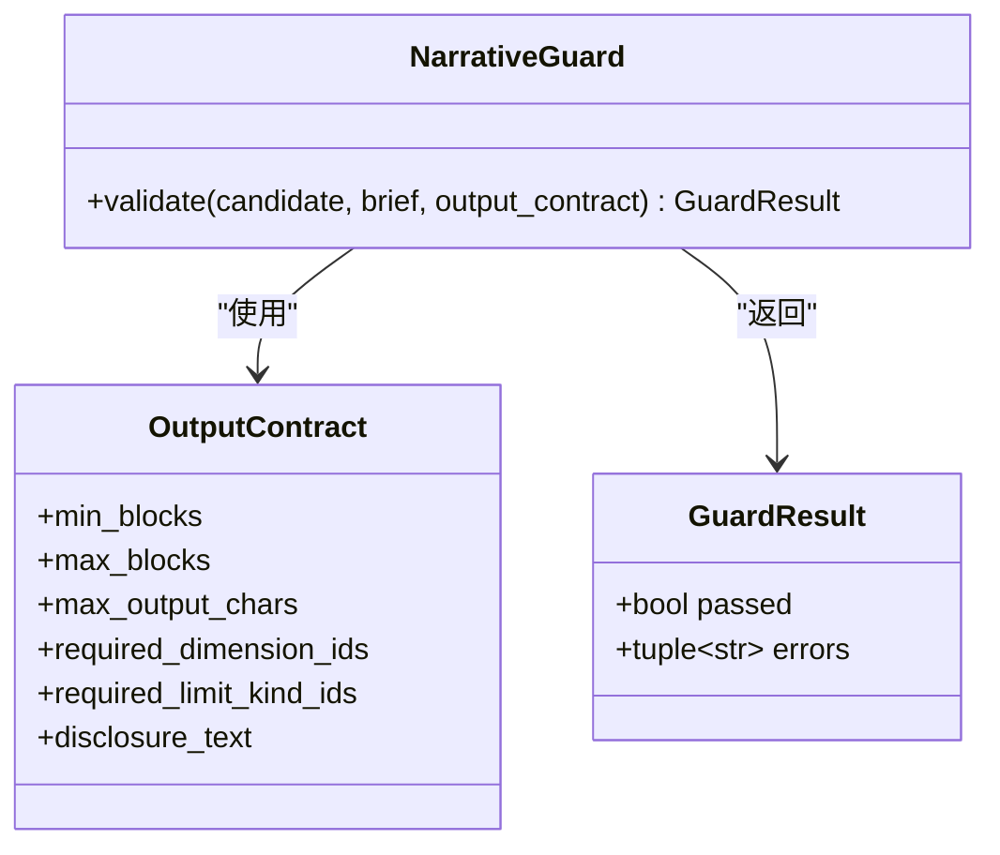
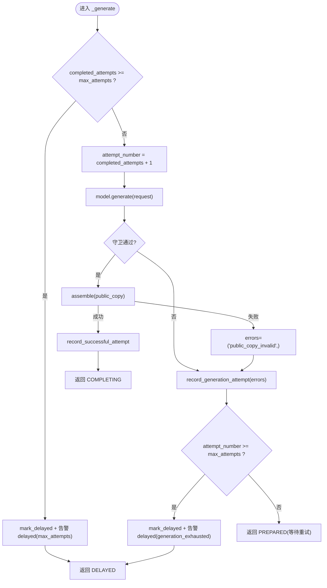
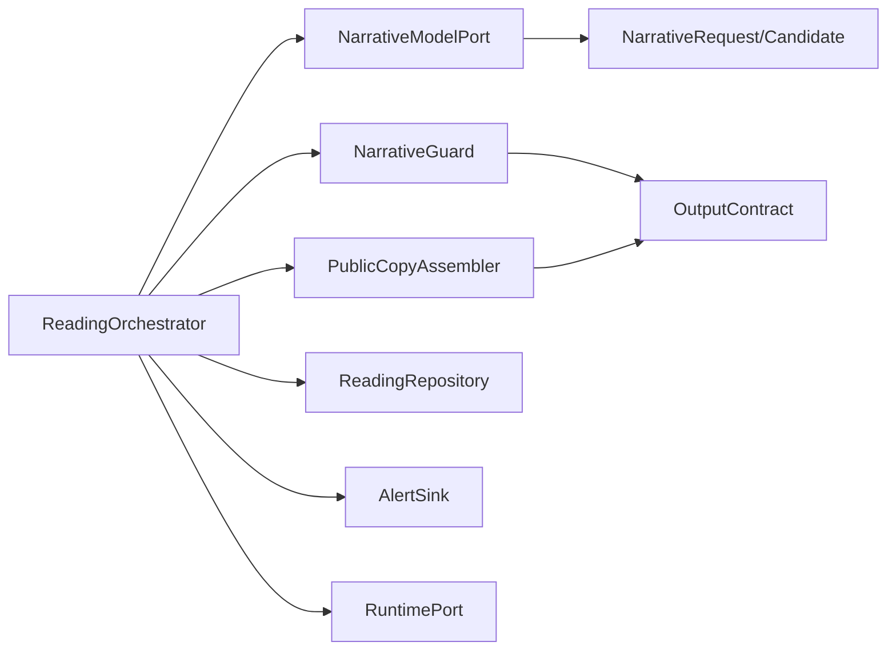

# 叙事生成与验证

<cite>
**本文引用的文件**
- [orchestrator.py](file://backend/app/readings/orchestrator.py)
- [errors.py](file://backend/app/readings/errors.py)
- [candidate_reference_closer.py](file://backend/app/readings/candidate_reference_closer.py)
- [narrative_guard.py](file://backend/app/readings/narrative_guard.py)
- [public_copy.py](file://backend/app/readings/public_copy.py)
- [narrative_contracts.py](file://backend/app/readings/narrative_contracts.py)
- [alerts.py](file://backend/app/readings/alerts.py)
- [status.py](file://backend/app/readings/status.py)
</cite>

## 目录
1. [简介](#简介)
2. [项目结构](#项目结构)
3. [核心组件](#核心组件)
4. [架构总览](#架构总览)
5. [详细组件分析](#详细组件分析)
6. [依赖关系分析](#依赖关系分析)
7. [性能考虑](#性能考虑)
8. [故障排查指南](#故障排查指南)
9. [结论](#结论)

## 简介
本文件聚焦于“命理解读”的叙事生成与验证流程，重点解析 orchestrator 中的 _generate 方法：从 NarrativeRequest 构建、模型调用、候选结果处理、守卫验证到公共副本组装；并说明错误处理（NarrativeGenerationError、NarrativeGenerationCancelled）、候选引用关闭机制 close_candidate_references、守卫验证流程（GuardResult、错误收集与告警）、公共副本组装（PublicCopyAssembler）以及重试机制（attempt_count、max_attempts、延迟标记）。

## 项目结构
围绕叙事生成的关键模块位于 backend/app/readings 下：
- 编排器 orchestrator.py：定义 ReadingOrchestrator 及其 _prepare/_generate/_complete 等阶段，协调运行时、模型、守卫、公共副本组装。
- 契约与数据模型 narrative_contracts.py：定义 NarrativeRequest、NarrativeCandidate、NarrativeBlock、OutputContract。
- 守卫 narrative_guard.py：对候选进行结构与范围校验，输出 GuardResult。
- 引用闭合 candidate_reference_closer.py：在守卫前补齐/裁剪候选块的引用集合，确保“闭世界”校验有效。
- 公共副本 public_copy.py：将候选块与必要限制文本拼接为对外可见的公共副本。
- 错误 errors.py：定义 NarrativeGenerationError、NarrativeGenerationCancelled 等异常。
- 告警 alerts.py：统一告警事件与 sink。
- 状态 status.py：读取版本状态机枚举。

图表来源
- [orchestrator.py:287-394](file://backend/app/readings/orchestrator.py#L287-L394)
- [narrative_contracts.py:140-168](file://backend/app/readings/narrative_contracts.py#L140-L168)
- [candidate_reference_closer.py:18-66](file://backend/app/readings/candidate_reference_closer.py#L18-L66)
- [narrative_guard.py:70-191](file://backend/app/readings/narrative_guard.py#L70-L191)
- [public_copy.py:13-46](file://backend/app/readings/public_copy.py#L13-L46)
- [status.py:4-13](file://backend/app/readings/status.py#L4-L13)

章节来源
- [orchestrator.py:1-195](file://backend/app/readings/orchestrator.py#L1-L195)
- [narrative_contracts.py:1-168](file://backend/app/readings/narrative_contracts.py#L1-L168)
- [candidate_reference_closer.py:1-171](file://backend/app/readings/candidate_reference_closer.py#L1-L171)
- [narrative_guard.py:1-191](file://backend/app/readings/narrative_guard.py#L1-L191)
- [public_copy.py:1-46](file://backend/app/readings/public_copy.py#L1-L46)
- [alerts.py:1-82](file://backend/app/readings/alerts.py#L1-L82)
- [status.py:1-13](file://backend/app/readings/status.py#L1-L13)

## 核心组件
- ReadingOrchestrator._generate：负责一次生成尝试的核心逻辑，包括请求构建、模型调用、候选闭合、守卫、组装、记录与重试/延迟决策。
- NarrativeRequest：封装 brief、策略版本、输出契约、语言与最大输出长度，供模型使用。
- close_candidate_references：在守卫前对候选块引用做“闭世界”修正，避免外部未声明引用导致守卫误判。
- NarrativeGuard：基于输出契约与 brief 对候选进行严格的结构与范围校验，产出 GuardResult。
- PublicCopyAssembler：将候选块与必须的限制文本、披露文案拼接为最终对外副本，并进行安全与大小检查。
- 错误体系：NarrativeGenerationError（模型失败但可恢复）、NarrativeGenerationCancelled（取消但保留 receipt）。
- 告警：统一 emit 操作，便于运维追踪。
- 状态：DELAYED/PREPARED 等用于控制重试与后续流程。

章节来源
- [orchestrator.py:287-394](file://backend/app/readings/orchestrator.py#L287-L394)
- [narrative_contracts.py:140-168](file://backend/app/readings/narrative_contracts.py#L140-L168)
- [candidate_reference_closer.py:18-66](file://backend/app/readings/candidate_reference_closer.py#L18-L66)
- [narrative_guard.py:70-191](file://backend/app/readings/narrative_guard.py#L70-L191)
- [public_copy.py:13-46](file://backend/app/readings/public_copy.py#L13-L46)
- [errors.py:1-30](file://backend/app/readings/errors.py#L1-L30)
- [alerts.py:16-82](file://backend/app/readings/alerts.py#L16-L82)
- [status.py:4-13](file://backend/app/readings/status.py#L4-L13)

## 架构总览
下图展示 _generate 的主流程与分支：

图表来源
- [orchestrator.py:287-394](file://backend/app/readings/orchestrator.py#L287-L394)
- [errors.py:12-26](file://backend/app/readings/errors.py#L12-L26)
- [narrative_guard.py:70-191](file://backend/app/readings/narrative_guard.py#L70-L191)
- [public_copy.py:13-46](file://backend/app/readings/public_copy.py#L13-L46)
- [alerts.py:16-82](file://backend/app/readings/alerts.py#L16-L82)

## 详细组件分析

### _generate 方法实现逻辑
- NarrativeRequest 构建：从 job 中取 narrative_policy_version、output_contract、language、max_output_chars，并结合 prepared.brief 构造请求。
- 重试前置检查：若 completed_attempts >= max_attempts，直接标记延迟并告警，返回 DELAYED。
- 模型调用：调用 model.generate(request)，捕获两类异常：
  - NarrativeGenerationError：记录 errors=["model_generation_failed"]，携带 receipt（如有）。
  - NarrativeGenerationCancelled：要求 receipt 存在，记录 errors=["model_generation_cancelled"]，并设置 cancel_after_commit。
- 候选引用闭合：对返回的 candidate 执行 close_candidate_references，以修复缺失的 fact/evidence/finding/limit 引用，保证守卫的闭世界假设成立。
- 守卫验证：guard.validate(candidate, brief, output_contract) 返回 GuardResult。若未通过，收集 errors 并告警 guard_rejection。
- 公共副本组装：仅在守卫通过后尝试 assembler.assemble(...)，若失败则转为 errors=("public_copy_invalid",)。
- 结果记录与流转：
  - 若 public_copy 为空：记录一次尝试 attempt_number，并根据是否达到 max_attempts 决定 DELAYED 或 PREPARED。
  - 若成功：记录 successful_attempt，并在有 receipt 时发出 model_cost 告警，返回 COMPLETING。

章节来源
- [orchestrator.py:287-394](file://backend/app/readings/orchestrator.py#L287-L394)
- [narrative_contracts.py:140-168](file://backend/app/readings/narrative_contracts.py#L140-L168)
- [errors.py:12-26](file://backend/app/readings/errors.py#L12-L26)
- [alerts.py:16-82](file://backend/app/readings/alerts.py#L16-L82)

### 模型调用的错误处理
- NarrativeGenerationError：表示模型未返回有效候选。orchestrator 会提取 receipt（若有），记录 errors=["model_generation_failed"]，并按重试策略决定是否延迟。
- NarrativeGenerationCancelled：表示外部取消。orchestrator 强制要求 receipt 存在，记录 errors=["model_generation_cancelled"]，并设置 cancel_after_commit，以便后续提交阶段按取消语义处理。

章节来源
- [errors.py:12-26](file://backend/app/readings/errors.py#L12-L26)
- [orchestrator.py:337-349](file://backend/app/readings/orchestrator.py#L337-L349)

### 候选引用关闭机制 close_candidate_references
作用：
- 真实模型常引用 findings/evidence 但未列出其所需的 fact_refs/supports_fact_refs 等依赖，这属于“引用卫生”问题。该函数在不改变内容的前提下，补齐/裁剪候选块的引用集合，使守卫能在“闭世界”下进行一致性校验。

实现要点：
- 从 brief 中索引 facts/evidence/findings/limits/claim_scopes。
- 对每个 block：
  - 根据 scope 限定允许的 fact/evidence 引用。
  - 过滤 finding/evidence/limit 引用至已知且符合 scope 的集合。
  - 从被引用的 finding 拉取其依赖的 fact/evidence/limit，并追加到当前块引用集。
  - 校验证据与事实交集，必要时丢弃无法落地的证据。
  - 剔除仍无法闭合的 finding。
- 去重后返回新的 NarrativeCandidate。

图表来源
- [candidate_reference_closer.py:18-66](file://backend/app/readings/candidate_reference_closer.py#L18-L66)
- [candidate_reference_closer.py:85-171](file://backend/app/readings/candidate_reference_closer.py#L85-L171)

章节来源
- [candidate_reference_closer.py:1-171](file://backend/app/readings/candidate_reference_closer.py#L1-L171)

### 守卫验证流程（GuardResult、错误收集与告警）
- 输入：NarrativeCandidate（或映射）、ReadingBrief、OutputContract。
- 校验项：
  - 块数量、总字符数、block_id 唯一性。
  - subject_ref/dimension_id 是否在 brief 范围内。
  - 所有引用（fact/finding/evidence/limit）必须在 brief 中存在。
  - 与 claim_scopes 的一致性：allowed_kind_ids、certainty_ceiling、fact/evidence/limit 子集约束。
  - 文本安全：禁止内部标识符、概率词、绝对保证词、未在 brief 中出现的具体日期/金额。
  - 必需维度与限制是否覆盖。
- 输出：GuardResult(passed, errors)。
- 告警：当 passed=False 时，orchestrator 发送 guard_rejection 告警，包含 errors 列表与 attempt 编号。

图表来源
- [narrative_guard.py:34-38](file://backend/app/readings/narrative_guard.py#L34-L38)
- [narrative_guard.py:70-191](file://backend/app/readings/narrative_guard.py#L70-L191)
- [narrative_contracts.py:91-138](file://backend/app/readings/narrative_contracts.py#L91-L138)

章节来源
- [narrative_guard.py:70-191](file://backend/app/readings/narrative_guard.py#L70-L191)
- [orchestrator.py:316-327](file://backend/app/readings/orchestrator.py#L316-L327)

### 公共副本组装过程（PublicCopyAssembler）
- 职责：将候选块文本与必要的限制文本、披露文案拼接为对外可见的公共副本，并进行安全与大小检查。
- 规则：
  - 收集 required_limit_kind_ids（来自契约与块自身 limit_kind_ids）。
  - 从 brief.limits 中提取对应 public_text，缺失则抛出 PublicCopyAssemblyError。
  - 拼接块文本、限制文本、披露文案，空串或超长均抛错。
  - 禁止出现内部标识符。
- 错误处理：在 orchestrator 中捕获 PublicCopyAssemblyError，将其视为 errors=("public_copy_invalid",)，走失败重试/延迟路径。

章节来源
- [public_copy.py:13-46](file://backend/app/readings/public_copy.py#L13-L46)
- [orchestrator.py:328-337](file://backend/app/readings/orchestrator.py#L328-L337)

### 重试机制（attempt_count、max_attempts、延迟标记）
- attempt_count：checkpoint.attempt_count 跟踪已完成尝试次数；_generate 中 attempt_number = completed_attempts + 1。
- max_attempts：job.max_attempts 限制 P0 模型尝试次数（1..2），超出即进入 DELAYED。
- 延迟标记：
  - 当达到上限或生成耗尽时，调用 repository.mark_delayed(job_id, now) 并告警 delayed。
  - 返回 ReadingOutcome(status=DELAYED)，由上层调度在退避后重试。
- 取消后的提交：cancel_after_commit=True 时，即使本次失败也会允许后续提交阶段按取消语义处理。

图表来源
- [orchestrator.py:287-394](file://backend/app/readings/orchestrator.py#L287-L394)
- [status.py:4-13](file://backend/app/readings/status.py#L4-L13)

章节来源
- [orchestrator.py:43-58](file://backend/app/readings/orchestrator.py#L43-L58)
- [orchestrator.py:287-394](file://backend/app/readings/orchestrator.py#L287-L394)
- [status.py:4-13](file://backend/app/readings/status.py#L4-L13)

## 依赖关系分析
- orchestrator 依赖：
  - runtime（Prepare/Complete 命令执行）
  - model（NarrativeModelPort.generate）
  - guard（NarrativeGuard.validate）
  - assembler（PublicCopyAssembler.assemble）
  - repository（持久化 checkpoint、尝试记录、延迟标记等）
  - alert_sink（告警）
- 数据契约：
  - NarrativeRequest/NarrativeCandidate/NarrativeBlock/OutputContract 作为跨组件边界类型。
  - ReadingBrief 作为上下文信息源。
- 耦合与内聚：
  - 各端口通过 Protocol 解耦，便于替换实现。
  - 错误与告警集中管理，提升可观测性。

图表来源
- [orchestrator.py:85-189](file://backend/app/readings/orchestrator.py#L85-L189)
- [narrative_contracts.py:16-168](file://backend/app/readings/narrative_contracts.py#L16-L168)

章节来源
- [orchestrator.py:85-189](file://backend/app/readings/orchestrator.py#L85-L189)
- [narrative_contracts.py:16-168](file://backend/app/readings/narrative_contracts.py#L16-L168)

## 性能考虑
- 最小化无效尝试：在 _generate 开头检查 completed_attempts >= max_attempts，避免无意义模型调用。
- 快速失败：守卫与公共副本组装尽早发现不合规，减少下游成本。
- 退避与延迟：通过 mark_delayed 与 retry_not_before 控制重试节奏，降低瞬时压力。
- 资源可见性：通过 model_cost 告警统计模型调用成本，辅助容量规划。

[本节提供通用指导，不直接分析具体文件]

## 故障排查指南
- 模型失败（model_generation_failed）：
  - 检查模型端返回是否包含有效 candidate。
  - 查看 record_generation_attempt 的错误字段与 receipt。
  - 确认未达到 max_attempts；若已达上限，关注 delayed 告警。
- 模型取消（model_generation_cancelled）：
  - 确认 receipt 存在；否则触发不变量错误。
  - 关注 cancel_after_commit 标志，确保后续提交阶段正确处理。
- 守卫拒绝（guard_rejection）：
  - 检查 errors 列表定位问题（如 unknown_fact_ref、scope_mismatch、internal_identifier_visible 等）。
  - 调整 prompt 或模型输出，使其满足契约与范围约束。
- 公共副本组装失败（public_copy_invalid）：
  - 检查是否缺少 required limit 的 public_text。
  - 检查是否超长或包含内部标识符。
- 延迟（delayed）：
  - 确认是否达到 max_attempts 或 generation_exhausted。
  - 观察上层调度是否在退避后重新入队。

章节来源
- [errors.py:12-26](file://backend/app/readings/errors.py#L12-L26)
- [narrative_guard.py:70-191](file://backend/app/readings/narrative_guard.py#L70-L191)
- [public_copy.py:13-46](file://backend/app/readings/public_copy.py#L13-L46)
- [orchestrator.py:316-394](file://backend/app/readings/orchestrator.py#L316-L394)
- [alerts.py:16-82](file://backend/app/readings/alerts.py#L16-L82)

## 结论
_generate 方法将“请求构建—模型调用—引用闭合—守卫验证—公共副本组装—记录与重试/延迟”串联成一条稳健的流水线。通过严格的契约与守卫、引用闭合与告警机制，系统在保障输出质量与安全的同时，提供了可控的重试与延迟策略，确保在模型不稳定或超限情况下仍能优雅降级与可观测。