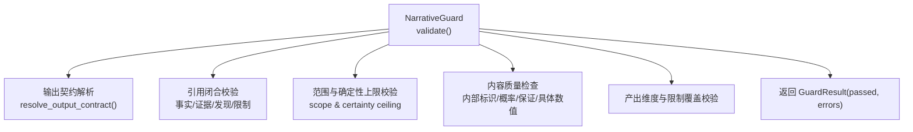
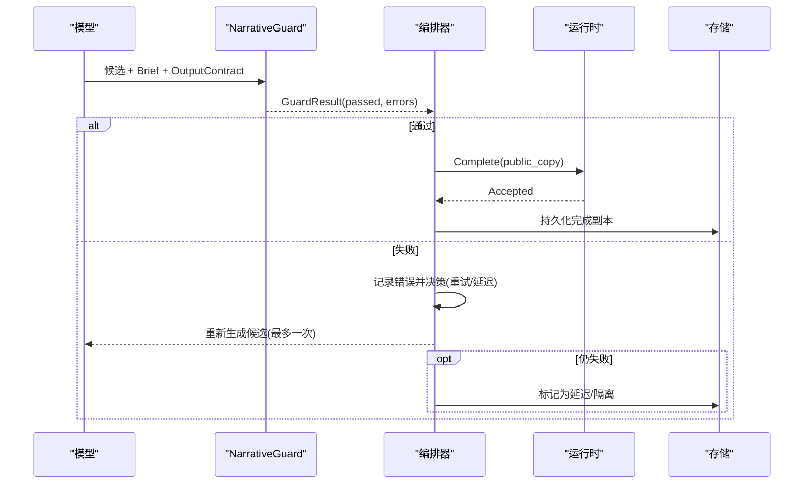
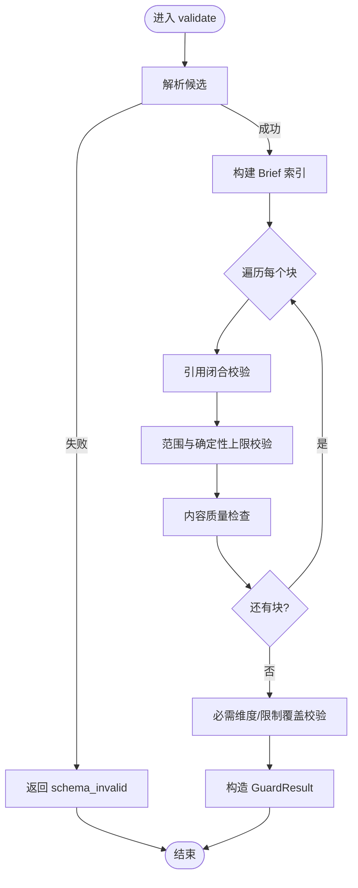
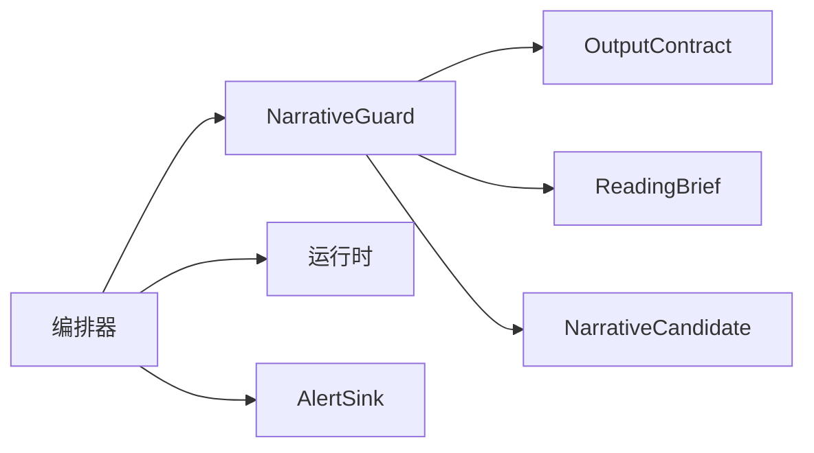

# 守卫验证与质量控制

<cite>
**本文引用的文件**
- [narrative_guard.py](file://backend/app/readings/narrative_guard.py)
- [alerts.py](file://backend/app/readings/alerts.py)
- [errors.py](file://backend/app/readings/errors.py)
- [rate_guard.py](file://backend/app/api/rate_guard.py)
- [test_narrative_guard.py](file://backend/tests/test_narrative_guard.py)
- [test_reading_orchestrator_complete.py](file://backend/tests/test_reading_orchestrator_complete.py)
- [test_reading_worker.py](file://backend/tests/test_reading_worker.py)
</cite>

## 目录
1. [简介](#简介)
2. [项目结构](#项目结构)
3. [核心组件](#核心组件)
4. [架构总览](#架构总览)
5. [详细组件分析](#详细组件分析)
6. [依赖关系分析](#依赖关系分析)
7. [性能考量](#性能考量)
8. [故障排查指南](#故障排查指南)
9. [结论](#结论)
10. [附录](#附录)

## 简介
本文件聚焦命理解读系统中的“守卫验证与质量控制”，围绕 GuardResult 的处理流程、验证阶段（格式/业务规则/内容质量）、告警发送机制、错误分类与处理策略，以及可配置的验证规则与自定义守卫实现进行系统化说明。文档以代码为依据，提供流程图与时序图帮助读者快速理解数据流与控制流。

## 项目结构
与守卫验证相关的关键模块位于后端应用：
- 叙事守卫与结果类型定义：backend/app/readings/narrative_guard.py
- 告警事件与接收器：backend/app/readings/alerts.py
- 编排器错误类型：backend/app/readings/errors.py
- API 层速率限制守卫：backend/app/api/rate_guard.py
- 单元测试覆盖守卫行为与编排重试：backend/tests/test_narrative_guard.py、backend/tests/test_reading_orchestrator_complete.py、backend/tests/test_reading_worker.py

图表来源
- [narrative_guard.py:73-190](file://backend/app/readings/narrative_guard.py#L73-L190)

章节来源
- [narrative_guard.py:1-191](file://backend/app/readings/narrative_guard.py#L1-L191)

## 核心组件
- GuardResult：不可变结果对象，包含 passed 布尔与 errors 元组，用于统一表达验证通过与否及错误集合。
- NarrativeGuard.validate：主入口，负责将候选文本解析为结构化候选，结合 ReadingBrief 与 OutputContract 执行多阶段校验，最终返回 GuardResult。
- 辅助函数：_add_error 去重收集错误；_candidate_from_value 安全解析候选；_certainty_exceeds 比较确定性等级是否超过上限。

章节来源
- [narrative_guard.py:34-68](file://backend/app/readings/narrative_guard.py#L34-L68)
- [narrative_guard.py:73-190](file://backend/app/readings/narrative_guard.py#L73-L190)

## 架构总览
守卫验证嵌入在读取编排流程中：模型生成候选后，由守卫进行“参考闭合+产品边界”的强约束校验；若失败，编排器会触发重试或延迟策略，避免提交不合规结果。

图表来源
- [test_reading_orchestrator_complete.py:304-379](file://backend/tests/test_reading_orchestrator_complete.py#L304-L379)

章节来源
- [test_reading_orchestrator_complete.py:304-379](file://backend/tests/test_reading_orchestrator_complete.py#L304-L379)

## 详细组件分析

### GuardResult 处理流程
- 输入：候选（可为对象或映射）、ReadingBrief、OutputContract。
- 解析：尝试将候选解析为结构化对象；解析失败直接返回 schema_invalid。
- 聚合：从 Brief 构建 facts/evidence/findings/limits/scope 索引，便于后续引用校验。
- 块级校验：对每个 block 执行范围、引用、确定性上限、内容质量等检查，使用 _add_error 去重收集错误。
- 全局校验：确保必需维度与限制被覆盖。
- 输出：构造 GuardResult(passed=not errors, errors=tuple(errors))。

图表来源
- [narrative_guard.py:73-190](file://backend/app/readings/narrative_guard.py#L73-L190)

章节来源
- [narrative_guard.py:73-190](file://backend/app/readings/narrative_guard.py#L73-L190)

### 验证阶段详解
- 格式与结构校验
  - 块数量必须在契约允许范围内。
  - 输出字符数不得超过最大限制。
  - 块 ID 必须唯一。
  - 候选解析失败视为 schema_invalid。
- 业务规则校验（引用闭合与范围）
  - 块中的 subject_ref/dimension_id 必须存在于 Brief 的 subjects/dimensions。
  - fact/evidence/finding/limit 引用必须能在 Brief 中找到。
  - 块的 claim_kind_id 必须在 scope 允许的 kind 列表中。
  - 确定性等级不得超出 scope 设定的上限。
  - 块的 fact/evidence 引用必须是 scope 的子集。
  - evidence 必须支持该块使用的至少一个 fact。
  - finding/limit 的引用也必须满足范围约束。
- 内容质量检查
  - 禁止出现内部标识符（如 state_token、fact:、evidence: 等）。
  - 禁止未校准的概率表述（含百分比符号或“百分之”）。
  - 禁止绝对保证性用语（如“保证/必然/一定会/肯定会”）。
  - 禁止编造未在 Brief 中出现的具体日期或金额。

章节来源
- [narrative_guard.py:99-189](file://backend/app/readings/narrative_guard.py#L99-L189)
- [test_narrative_guard.py:111-245](file://backend/tests/test_narrative_guard.py#L111-L245)

### 告警发送机制
- 告警事件结构 AlertEvent：包含事件种类、时间戳、可选 job_id、reading_version_id 与 details。
- 接收器协议 AlertSink：emit(event)。
- 内置实现：
  - NoopAlertSink：测试环境空实现。
  - LoggingAlertSink：生产/预发环境写入结构化日志（不含敏感值）。
  - RecordingAlertSink：测试环境记录事件到内存。
- 工厂方法 build_alert_sink：根据配置启用或禁用告警。
- 在编排器/工作进程中，可通过注入 alert_sink 将关键异常或状态变更转为可观测事件。

章节来源
- [alerts.py:16-81](file://backend/app/readings/alerts.py#L16-L81)

### 错误分类与处理策略
- 可重试错误
  - 运行时传输未知（RuntimeTransportError）：编排器会在相同 token 下重试 complete，直到确认结果或达到重试预算。
  - 守卫失败：编排器对同一模型调用最多重试一次，成功后继续完成；若再次失败则进入延迟状态，不再调用 complete。
- 不可恢复错误
  - 守护失败且耗尽重试：进入 DELAYED 状态，不提交完成副本。
  - 初始 prepare 声明过期：隔离而不回放运行时，避免不一致。
- API 层限流错误
  - RateLimitExceededError 转换为 429 ApiProblem，并附带 Retry-After 头，提示客户端退避。

章节来源
- [errors.py:4-30](file://backend/app/readings/errors.py#L4-L30)
- [test_reading_orchestrator_complete.py:304-379](file://backend/tests/test_reading_orchestrator_complete.py#L304-L379)
- [test_reading_worker.py:901-934](file://backend/tests/test_reading_worker.py#L901-L934)
- [rate_guard.py:5-19](file://backend/app/api/rate_guard.py#L5-L19)

### 验证规则配置示例
- 通过 OutputContract 控制：
  - 最小/最大块数、最大输出字符数。
  - required_dimension_ids：必需覆盖的维度集合。
  - required_limit_kind_ids：必需覆盖的限制类别集合。
- 通过 ReadingBrief 的 claim_scopes 控制：
  - 每个 subject+dimension 的 allowed_kind_ids、certainty_ceiling_id、fact_refs、evidence_refs。
- 通过 limits 控制：
  - public_text、scope_refs、detail_ids 等对外展示与范围约束。

章节来源
- [narrative_guard.py:83-189](file://backend/app/readings/narrative_guard.py#L83-L189)
- [test_narrative_guard.py:20-108](file://backend/tests/test_narrative_guard.py#L20-L108)

### 自定义守卫实现指南
- 目标：在不改变现有接口的前提下扩展或替换守卫逻辑。
- 步骤：
  1) 保持返回 GuardResult(passed, errors) 的语义。
  2) 复用 _add_error 收集错误，避免重复。
  3) 如需新增规则，可在 validate 中插入新的检查分支，并在 tests 中补充反例用例。
  4) 若需接入告警，通过注入的 AlertSink.emit 发出 AlertEvent，便于追踪。
  5) 在编排器中替换 guard 参数以启用自定义守卫。

章节来源
- [narrative_guard.py:34-68](file://backend/app/readings/narrative_guard.py#L34-L68)
- [alerts.py:16-81](file://backend/app/readings/alerts.py#L16-L81)
- [test_reading_orchestrator_complete.py:304-379](file://backend/tests/test_reading_orchestrator_complete.py#L304-L379)

## 依赖关系分析
- NarrativeGuard 依赖：
  - 输出契约解析 resolve_output_contract。
  - 运行时契约 ReadingBrief、ContractValidationError。
  - 叙事契约 NarrativeCandidate。
- 编排器依赖：
  - 守卫结果驱动重试/延迟/完成分支。
  - 运行时命令 Prepare/Complete 的重试与幂等。
- 告警子系统：
  - 通过 AlertSink 抽象解耦，便于测试与生产切换。

图表来源
- [narrative_guard.py:8-16](file://backend/app/readings/narrative_guard.py#L8-L16)
- [alerts.py:16-81](file://backend/app/readings/alerts.py#L16-L81)
- [test_reading_orchestrator_complete.py:304-379](file://backend/tests/test_reading_orchestrator_complete.py#L304-L379)

章节来源
- [narrative_guard.py:8-16](file://backend/app/readings/narrative_guard.py#L8-L16)
- [alerts.py:16-81](file://backend/app/readings/alerts.py#L16-L81)
- [test_reading_orchestrator_complete.py:304-379](file://backend/tests/test_reading_orchestrator_complete.py#L304-L379)

## 性能考量
- 校验复杂度：对每个块进行常数次哈希查找与正则匹配，整体近似 O(N)，N 为块数量。
- 正则开销：内部标识符、概率、保证、具体日期/金额的正则在每块文本上执行，建议保持文本长度可控。
- 错误收集：使用列表去重追加，避免重复错误导致的冗余判断。
- 重试策略：仅对模型生成进行一次重试，避免无限循环；传输未知错误采用延迟重试，降低瞬时压力。

[本节为通用指导，无需特定文件来源]

## 故障排查指南
- 常见守卫错误定位
  - schema_invalid：候选无法解析为预期结构，检查字段名与必填项。
  - unknown_subject_ref / unknown_dimension：块引用了不在 Brief 中的主体或维度。
  - unknown_fact_ref / unknown_finding_ref / unknown_evidence_ref / unknown_limit_ref：引用不存在于 Brief。
  - kind_not_allowed / certainty_exceeded：断言类型或确定性超出范围上限。
  - scope_mismatch：块与 scope 的 fact/evidence/finding/limit 引用不一致。
  - internal_identifier_visible：输出中包含内部标识符。
  - uncalibrated_probability / unsupported_guarantee：包含概率或保证性用语。
  - invented_specific：出现未在 Brief 中声明的具体日期或金额。
  - output_too_long / block_count_out_of_range：超出输出长度或块数量限制。
  - required_dimension_missing / required_limit_missing：未覆盖契约要求的维度或限制。
- 重试与延迟
  - 首次守卫失败会重试一次模型；若仍失败，进入 DELAYED 且不提交完成副本。
  - 运行时传输未知错误会延迟重试 complete，直至成功或达到预算。
- 告警与可观测性
  - 通过 AlertSink.emit 记录关键事件，检查日志中的 ops_alert 事件。
  - 生产环境建议使用 LoggingAlertSink，测试环境可使用 RecordingAlertSink。

章节来源
- [narrative_guard.py:99-189](file://backend/app/readings/narrative_guard.py#L99-L189)
- [test_narrative_guard.py:111-245](file://backend/tests/test_narrative_guard.py#L111-L245)
- [test_reading_orchestrator_complete.py:304-379](file://backend/tests/test_reading_orchestrator_complete.py#L304-L379)
- [test_reading_worker.py:901-934](file://backend/tests/test_reading_worker.py#L901-L934)
- [alerts.py:20-81](file://backend/app/readings/alerts.py#L20-L81)

## 结论
守卫验证通过严格的引用闭合、范围与内容质量检查，确保命理解读输出的合规性与一致性。GuardResult 作为统一的结果载体，配合编排器的重试与延迟策略，有效平衡了质量与可用性。告警子系统提供了可扩展的可观测能力，便于在生产环境中持续监控与排障。

[本节为总结性内容，无需特定文件来源]

## 附录
- 推荐实践
  - 在 Brief 中明确 claim_scopes，限定断言类型与确定性上限。
  - 在 OutputContract 中设置合理的块数与输出长度限制。
  - 使用 alerts 记录守卫失败与重试事件，建立告警阈值。
  - 为新规则编写反例测试，确保回归稳定。

[本节为通用指导，无需特定文件来源]