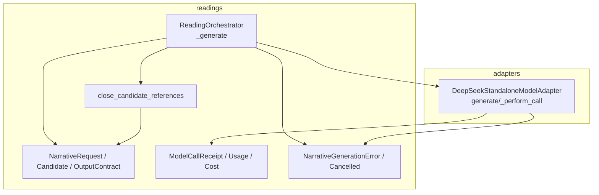
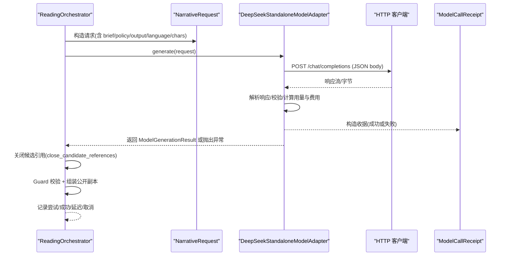
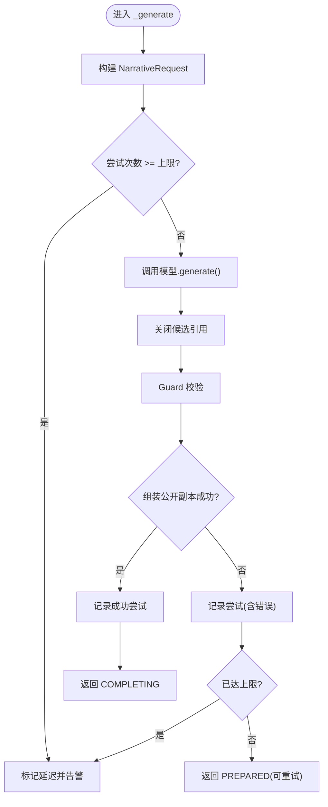
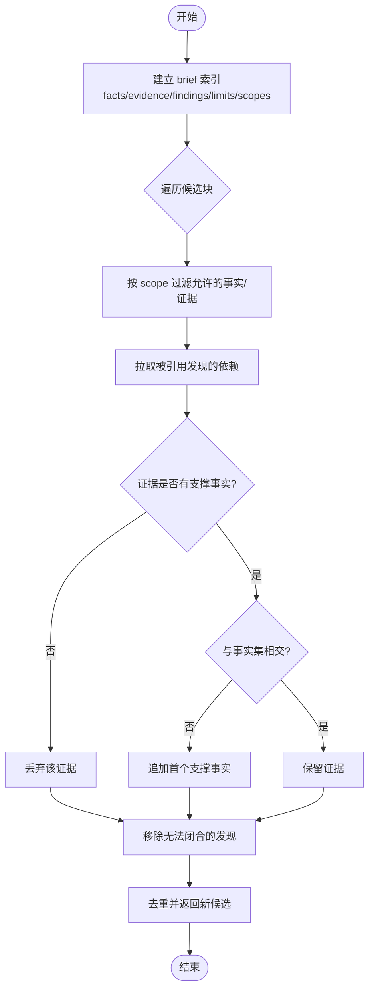
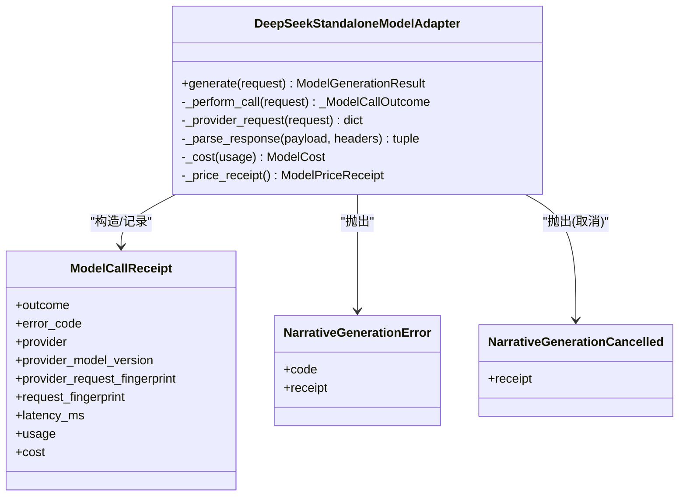
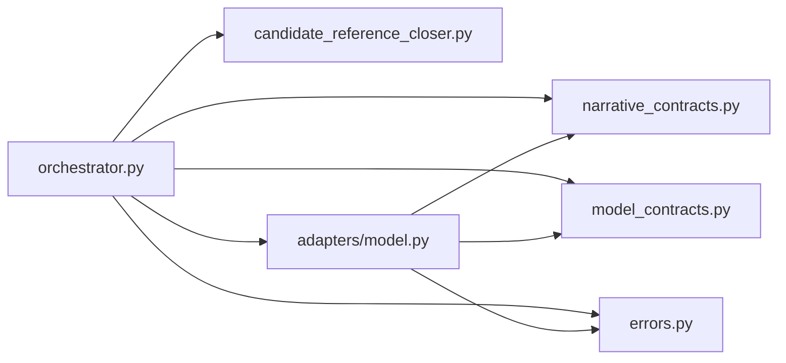

# 模型调用与候选处理

<cite>
**本文引用的文件**
- [orchestrator.py](file://backend/app/readings/orchestrator.py)
- [candidate_reference_closer.py](file://backend/app/readings/candidate_reference_closer.py)
- [errors.py](file://backend/app/readings/errors.py)
- [model.py](file://backend/app/adapters/model.py)
- [narrative_contracts.py](file://backend/app/readings/narrative_contracts.py)
- [model_contracts.py](file://backend/app/readings/model_contracts.py)
- [test_candidate_reference_closer.py](file://backend/tests/test_candidate_reference_closer.py)
</cite>

## 目录
1. [简介](#简介)
2. [项目结构](#项目结构)
3. [核心组件](#核心组件)
4. [架构总览](#架构总览)
5. [详细组件分析](#详细组件分析)
6. [依赖关系分析](#依赖关系分析)
7. [性能考量](#性能考量)
8. [故障排查指南](#故障排查指南)
9. [结论](#结论)

## 简介
本文件聚焦命理解读流程中的“模型调用”与“候选处理”，围绕以下目标展开：
- 深入说明 orchestrator._generate 方法中模型调用的实现逻辑，包括 NarrativeRequest 的构建、模型接口调用与错误处理。
- 详细解释 close_candidate_references 的工作原理，包括引用验证、数据完整性检查与潜在问题修复。
- 阐述模型调用的异常处理，特别是 NarrativeGenerationError 与 NarrativeGenerationCancelled 的处理方式。
- 说明 ModelCallReceipt 的作用与数据记录机制。
- 提供具体代码路径与典型错误场景的处理方案。

## 项目结构
与本次主题相关的后端模块主要位于 backend/app/readings 与 backend/app/adapters：
- readings 层负责编排（Orchestrator）、候选引用闭合（Candidate Reference Closer）、契约定义（Narrative/Output Contracts）与错误类型。
- adapters 层提供具体的模型适配器（DeepSeekStandaloneModelAdapter），封装 HTTP 调用、响应解析、审计收据生成与异常转换。

图表来源
- [orchestrator.py:287-394](file://backend/app/readings/orchestrator.py#L287-L394)
- [candidate_reference_closer.py:18-170](file://backend/app/readings/candidate_reference_closer.py#L18-L170)
- [model.py:200-334](file://backend/app/adapters/model.py#L200-L334)
- [narrative_contracts.py:140-168](file://backend/app/readings/narrative_contracts.py#L140-L168)
- [model_contracts.py:115-252](file://backend/app/readings/model_contracts.py#L115-L252)

章节来源
- [orchestrator.py:287-394](file://backend/app/readings/orchestrator.py#L287-L394)
- [model.py:200-334](file://backend/app/adapters/model.py#L200-L334)

## 核心组件
- ReadingOrchestrator._generate：负责从 Prepared 状态进入模型生成阶段，构造 NarrativeRequest，调用模型，执行候选引用闭合、Guard 校验与公开副本组装，并记录尝试结果与成本。
- close_candidate_references：在 Guard 之前对候选进行“引用闭合”，补齐缺失的事实、证据、发现与限制引用，剔除越界引用，确保后续闭世界校验通过。
- DeepSeekStandaloneModelAdapter.generate/_perform_call：将 NarrativeRequest 转为提供商请求，发起 HTTP 调用，解析响应，构造 ModelCallReceipt，并将各类异常转换为统一的 NarrativeGenerationError/NarrativeGenerationCancelled。
- NarrativeRequest / NarrativeCandidate / OutputContract：描述生成请求、候选结构与输出契约，包含严格的字段约束与版本控制。
- ModelCallReceipt：记录每次模型调用的审计信息，包括成功/失败、错误码、提供方元数据、请求指纹、延迟、用量与费用等。

章节来源
- [narrative_contracts.py:140-168](file://backend/app/readings/narrative_contracts.py#L140-L168)
- [model_contracts.py:115-252](file://backend/app/readings/model_contracts.py#L115-L252)
- [candidate_reference_closer.py:18-170](file://backend/app/readings/candidate_reference_closer.py#L18-L170)
- [model.py:200-334](file://backend/app/adapters/model.py#L200-L334)
- [orchestrator.py:287-394](file://backend/app/readings/orchestrator.py#L287-L394)

## 架构总览
下图展示了 _generate 到模型适配器的完整调用链，以及异常与收据的流转。

图表来源
- [orchestrator.py:287-394](file://backend/app/readings/orchestrator.py#L287-L394)
- [model.py:200-334](file://backend/app/adapters/model.py#L200-L334)
- [model_contracts.py:115-252](file://backend/app/readings/model_contracts.py#L115-L252)

## 详细组件分析

### _generate：模型调用与候选处理主流程
- 输入：已准备好的 Prepared 对象与当前尝试次数。
- 关键步骤：
  - 构造 NarrativeRequest：携带 ReadingBrief、策略版本、输出契约、语言与最大字符数。
  - 尝试次数上限检查：达到上限则标记延迟并告警。
  - 调用模型：await self.model.generate(request)。
  - 候选引用闭合：close_candidate_references(generation.candidate, brief)，用于修复引用不完整导致的 Guard 失败。
  - 获取收据：generation.receipt 作为 ModelCallReceipt。
  - Guard 校验：validate(candidate, brief, output_contract)。
  - 公开副本组装：assemble(candidate, brief, output_contract)。
  - 异常处理：捕获 NarrativeGenerationError 与 NarrativeGenerationCancelled，分别设置错误码与 cancel_after_commit 标志。
  - 记录与决策：根据是否产出 public_copy 决定记录尝试还是成功；若失败且已达上限，标记延迟并返回；否则返回 PREPARED 以便重试。

图表来源
- [orchestrator.py:287-394](file://backend/app/readings/orchestrator.py#L287-L394)

章节来源
- [orchestrator.py:287-394](file://backend/app/readings/orchestrator.py#L287-L394)
- [narrative_contracts.py:140-168](file://backend/app/readings/narrative_contracts.py#L140-L168)

### close_candidate_references：引用闭合与数据完整性修复
- 目的：真实模型常只引用“发现/证据”，而不列出其依赖的“事实/证据/限制”。该函数在不改变文本的前提下，补全这些依赖，使 Guard 的闭世界校验更诚实。
- 工作原理：
  - 从 brief 中提取 facts/evidence/findings/limits/claim_scopes 索引。
  - 遍历候选块，按 scope 过滤允许的 fact/evidence 引用。
  - 对于被引用的 finding，将其依赖的 fact/evidence/limit 拉入当前块的引用集合。
  - 对每个 evidence，确保其与块的事实集有交集；若无支撑事实则丢弃该证据；若有支撑但与事实不交，则追加首个支撑事实。
  - 无法闭合的 finding 将被移除。
  - 最终去重并返回新的 NarrativeCandidate。
- 效果：通过“引用闭合”，减少因引用不完整导致的 Guard 失败，避免无谓重试。

图表来源
- [candidate_reference_closer.py:18-170](file://backend/app/readings/candidate_reference_closer.py#L18-L170)

章节来源
- [candidate_reference_closer.py:18-170](file://backend/app/readings/candidate_reference_closer.py#L18-L170)
- [test_candidate_reference_closer.py:90-153](file://backend/tests/test_candidate_reference_closer.py#L90-L153)

### 模型适配器：接口调用、异常与收据
- 请求构建：将 NarrativeRequest 转为 DeepSeek/DashScope 兼容的 JSON 消息体，固定 temperature 与 max_tokens，禁用 thinking 模式以保证 P0 稳定。
- 网络调用：使用 httpx 异步流式读取响应，限制最大响应字节，防止内存溢出。
- 响应解析：严格校验 choices/message/content/usage 等字段，提取 NarrativeCandidate 与用量。
- 异常分类：
  - 网络/超时/编码/重定向/上游错误等统一映射为 NarrativeGenerationError，附带安全错误码。
  - 外部取消（asyncio.CancelledError）包装为 NarrativeGenerationCancelled，并携带收据。
- 收据生成：无论成功或失败，均构造 ModelCallReceipt，记录 outcome、error_code、提供方元数据、请求指纹、延迟、用量与费用快照。
- 审计：将收据写入审计 sink（仅记录受控元数据，不包含敏感内容）。

图表来源
- [model.py:144-334](file://backend/app/adapters/model.py#L144-L334)
- [model_contracts.py:115-252](file://backend/app/readings/model_contracts.py#L115-L252)
- [errors.py:12-25](file://backend/app/readings/errors.py#L12-L25)

章节来源
- [model.py:200-334](file://backend/app/adapters/model.py#L200-L334)
- [model_contracts.py:115-252](file://backend/app/readings/model_contracts.py#L115-L252)
- [errors.py:12-25](file://backend/app/readings/errors.py#L12-L25)

### 异常处理：NarrativeGenerationError 与 NarrativeGenerationCancelled
- NarrativeGenerationError：表示模型未返回有效候选或上游错误。_generate 捕获后设置 errors=("model_generation_failed",)，并尽可能复用 receipt 以记录失败上下文。
- NarrativeGenerationCancelled：表示外部取消。_generate 捕获后设置 errors=("model_generation_cancelled",)，并设置 cancel_after_commit=True，以便完成阶段正确处理取消语义。
- 不变量保护：若取消时缺少 safe receipt，会抛出 OrchestratorInvariantError，保证审计一致性。

章节来源
- [orchestrator.py:337-348](file://backend/app/readings/orchestrator.py#L337-L348)
- [errors.py:12-25](file://backend/app/readings/errors.py#L12-L25)

### ModelCallReceipt：数据记录机制
- 作用：记录每次模型调用的审计信息，包括成功/失败、错误码、提供方元数据、请求指纹、延迟、用量与费用快照。
- 字段约束：
  - 成功时必须包含 provider_model_version、provider_request_fingerprint、usage、cost。
  - 失败时必须包含安全的 error_code。
  - cost 必须与 price_snapshot 绑定一致，且由 usage 与价格率计算得出。
- 用途：
  - 在 _generate 中记录尝试或成功尝试，便于追踪与计费。
  - 在成功时发出 model_cost 告警，记录 outcome/provider/profile_id。

章节来源
- [model_contracts.py:115-252](file://backend/app/readings/model_contracts.py#L115-L252)
- [model.py:292-334](file://backend/app/adapters/model.py#L292-L334)
- [orchestrator.py:376-394](file://backend/app/readings/orchestrator.py#L376-L394)

## 依赖关系分析
- orchestrator 依赖：
  - narrative_contracts：NarrativeRequest、NarrativeCandidate、OutputContract。
  - candidate_reference_closer：引用闭合。
  - model_contracts：ModelCallReceipt、ModelGenerationResult。
  - errors：异常类型。
  - adapters.model：模型适配器接口。
- 适配器依赖：
  - httpx：网络 I/O。
  - pydantic：密钥管理。
  - model_contracts：收据与用量。
  - narrative_contracts：候选与契约。
  - errors：异常转换。

图表来源
- [orchestrator.py:1-40](file://backend/app/readings/orchestrator.py#L1-L40)
- [model.py:1-35](file://backend/app/adapters/model.py#L1-L35)

章节来源
- [orchestrator.py:1-40](file://backend/app/readings/orchestrator.py#L1-L40)
- [model.py:1-35](file://backend/app/adapters/model.py#L1-L35)

## 性能考量
- 模型侧：
  - 固定 temperature=0.2、max_output_tokens=4096，降低随机性与输出长度带来的不确定性。
  - 限制最大响应字节，避免大响应导致内存压力。
  - 禁用 thinking 模式（DashScope DeepSeek），避免思考 token 耗尽导致空内容。
- 编排侧：
  - 尝试次数上限（默认 2），超过则延迟并重试，避免无限重试。
  - 先做引用闭合再 Guard，减少无效重试。
  - 收据记录轻量且结构化，便于观测与计费。

[本节为通用指导，不直接分析具体文件]

## 故障排查指南
- 常见错误码与含义（来自适配器）：
  - model_redirect_forbidden：上游重定向不被允许。
  - model_rate_limited：触发限流。
  - model_upstream_error：上游服务错误。
  - model_http_error：非 200 的 HTTP 状态。
  - model_encoding_forbidden：不支持的 content-encoding。
  - model_response_too_large：响应超出限制。
  - model_policy_not_approved：策略版本未批准。
  - model_invalid_response：响应结构不符合预期。
  - model_usage_invalid：用量字段非法或不一致。
  - model_timeout：超时。
  - model_transport_error：网络传输错误。
  - model_cancelled：外部取消。
- 排查建议：
  - 查看 ModelCallReceipt.error_code 与 latency_ms，定位是网络、上游还是解析问题。
  - 若为 model_invalid_response，检查上游返回的 choices/message/content/usage 是否符合预期。
  - 若为 model_rate_limited，考虑退避重试或调整并发。
  - 若为 policy 相关错误，确认 narrative_policy_version 与输出契约是否匹配。
  - 若频繁出现 scope_mismatch，优先检查 close_candidate_references 是否正确闭合引用。

章节来源
- [model.py:250-334](file://backend/app/adapters/model.py#L250-L334)
- [model_contracts.py:115-252](file://backend/app/readings/model_contracts.py#L115-L252)

## 结论
- _generate 将 NarrativeRequest 构建、模型调用、候选引用闭合、Guard 校验与公开副本组装串联成稳定的生成管线，并通过异常与收据保障可观测性与可恢复性。
- close_candidate_references 在不改动文本的前提下修复引用缺失，显著降低 Guard 失败率，提升整体成功率。
- 适配器将底层网络与解析细节封装为统一异常与收据，屏蔽供应商差异，同时提供严格的预算与审计能力。
- 通过尝试次数上限与延迟策略，系统在稳定性与用户体验之间取得平衡。