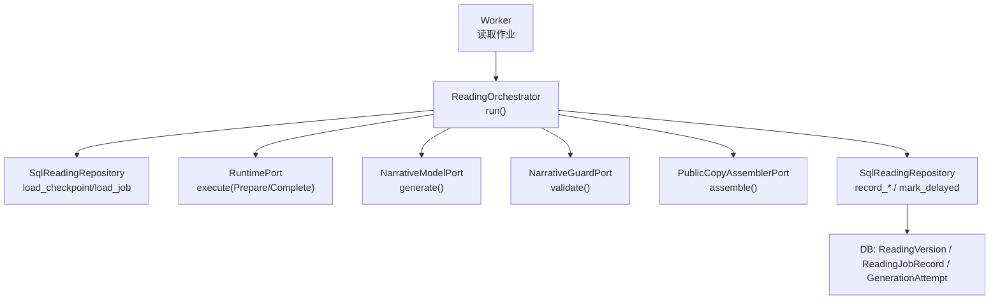
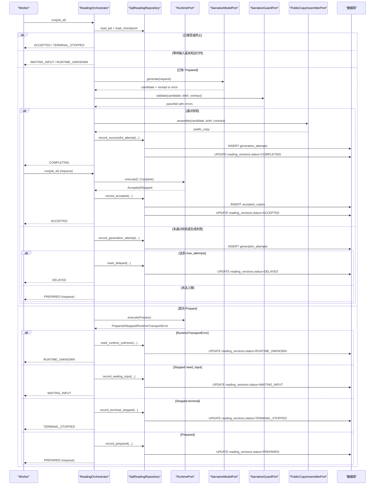
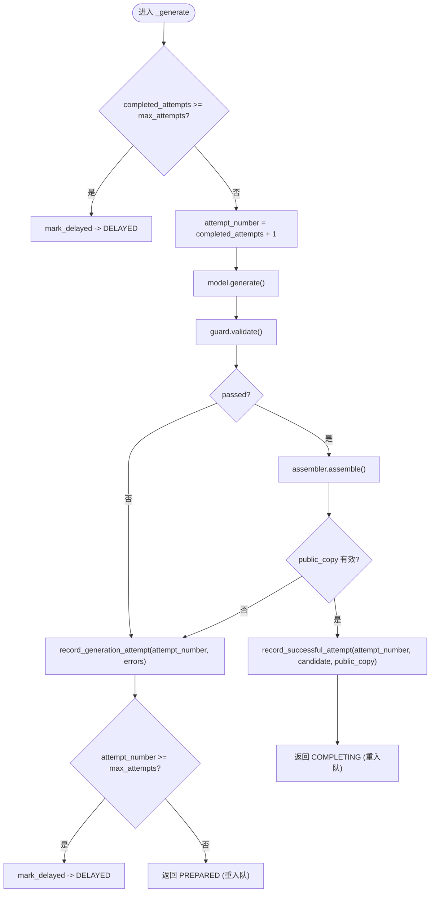
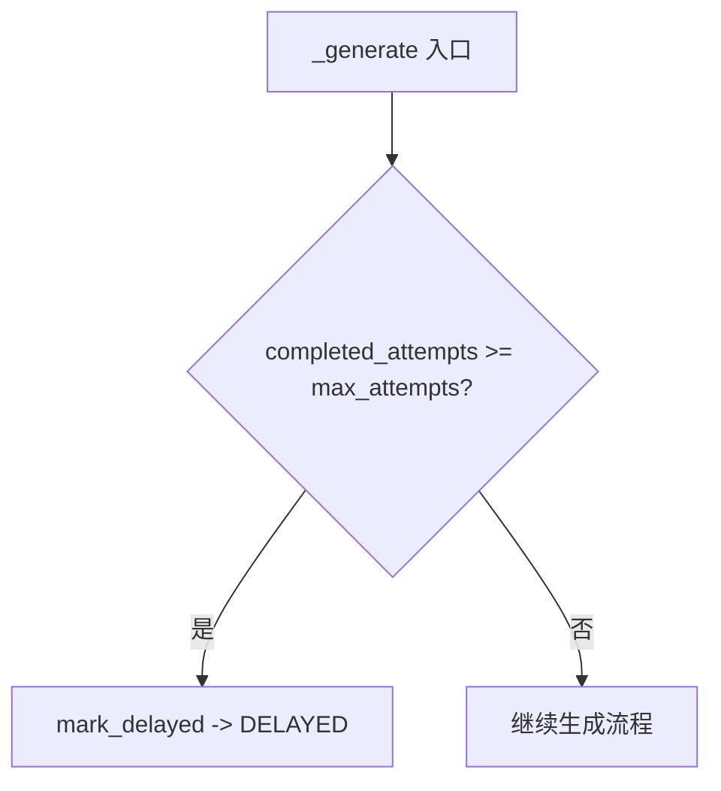
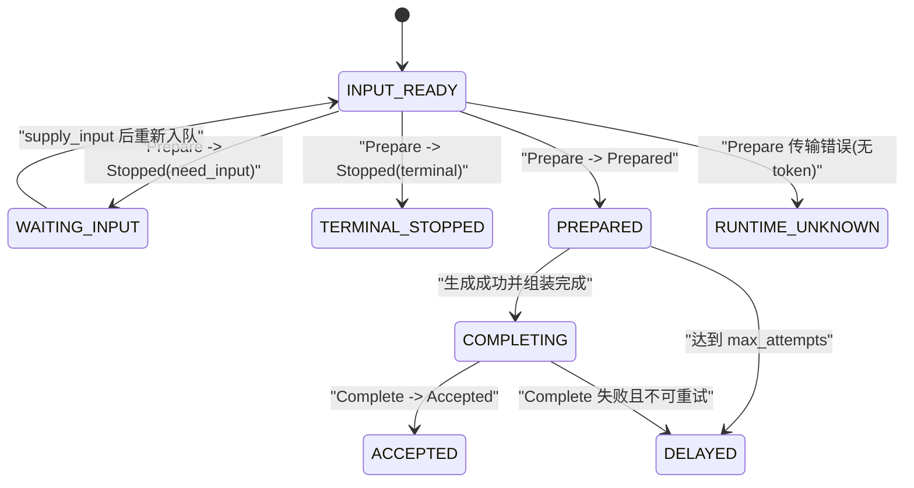
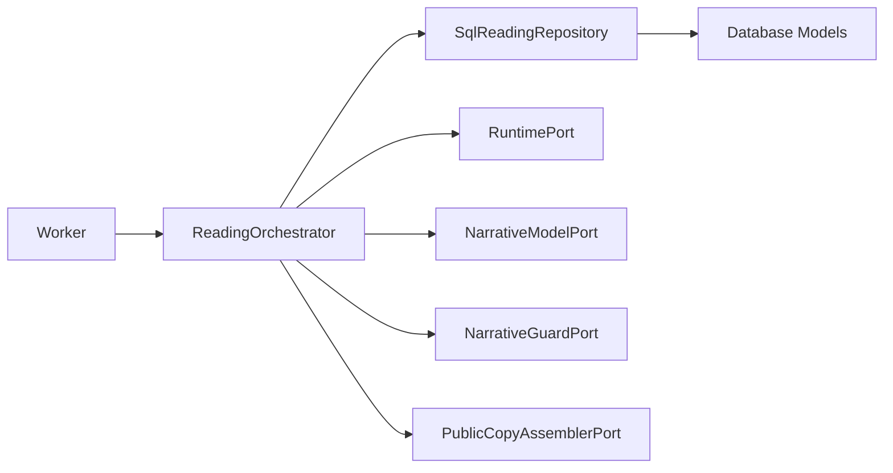

# 重试与尝试管理

<cite>
**本文引用的文件**
- [backend/app/readings/status.py](file://backend/app/readings/status.py)
- [backend/app/readings/orchestrator.py](file://backend/app/readings/orchestrator.py)
- [backend/app/readings/repository.py](file://backend/app/readings/repository.py)
- [backend/app/readings/models.py](file://backend/app/readings/models.py)
- [backend/worker/readings.py](file://backend/worker/readings.py)
- [backend/app/config.py](file://backend/app/config.py)
</cite>

## 目录
1. [简介](#简介)
2. [项目结构](#项目结构)
3. [核心组件](#核心组件)
4. [架构总览](#架构总览)
5. [详细组件分析](#详细组件分析)
6. [依赖关系分析](#依赖关系分析)
7. [性能考虑](#性能考虑)
8. [故障排查指南](#故障排查指南)
9. [结论](#结论)
10. [附录](#附录)

## 简介
本文件系统性说明命理解读（Reading）在生成阶段的重试与尝试管理机制，重点覆盖：
- attempt_count 跟踪机制：如何记录、同步与持久化。
- max_attempts 限制：阈值检查、延迟标记与状态转换。
- 重试策略配置：最大尝试次数、延迟时间与退避算法。
- ReadingStatus 状态流转：PREPARED、DELAYED、COMPLETING 等状态的转换条件。
- 最佳实践与监控指标：可观测性、告警与排障建议。

## 项目结构
围绕重试与尝试管理的核心代码分布在以下模块：
- 状态定义：ReadingStatus 枚举定义了所有读取任务的状态。
- 编排器：ReadingOrchestrator 负责驱动 Prepare、Generate、Complete 流程，并维护 attempt_count 与 max_attempts 的边界。
- 仓库层：SqlReadingRepository 负责将 checkpoint、attempt、delayed 等状态持久化到数据库。
- 数据模型：models.py 中的 GenerationAttempt、ReadingVersion、ReadingJobRecord 等表承载尝试计数、版本状态与作业调度信息。
- Worker：worker/readings.py 负责从队列中领取作业、执行编排器、根据 outcome.retry_not_before 设置下一次可用时间。
- 配置：config.py 提供运行时参数（如告警开关），配合编排器的退避时间常量实现可观测与可控的重试节奏。

图表来源
- [backend/worker/readings.py:175-231](file://backend/worker/readings.py#L175-L231)
- [backend/app/readings/orchestrator.py:212-435](file://backend/app/readings/orchestrator.py#L212-L435)
- [backend/app/readings/repository.py:448-730](file://backend/app/readings/repository.py#L448-L730)
- [backend/app/readings/models.py:188-292](file://backend/app/readings/models.py#L188-L292)

章节来源
- [backend/app/readings/status.py:1-13](file://backend/app/readings/status.py#L1-L13)
- [backend/app/readings/orchestrator.py:43-79](file://backend/app/readings/orchestrator.py#L43-L79)
- [backend/app/readings/repository.py:200-224](file://backend/app/readings/repository.py#L200-L224)
- [backend/app/readings/models.py:188-292](file://backend/app/readings/models.py#L188-L292)
- [backend/worker/readings.py:108-231](file://backend/worker/readings.py#L108-L231)
- [backend/app/config.py:146-149](file://backend/app/config.py#L146-L149)

## 核心组件
- ReadingStatus：定义读取任务生命周期状态，包括 INPUT_READY、WAITING_INPUT、TERMINAL_STOPPED、PREPARED、COMPLETING、ACCEPTED、DELAYED、RUNTIME_UNKNOWN。
- ReadingCheckpoint：内存中的检查点，包含 status、prepared、attempt_count、completion_copy、accepted 等字段，用于编排器决策。
- ReadingJob：作业元数据，包含 prepare_command、output_contract、language、max_output_chars、max_attempts（当前固定为 2）。
- ReadingOutcome：编排器返回结果，包含 status、public_copy、input_request、retry_not_before、cancel_after_commit。
- SqlReadingRepository：持久化接口，提供 record_generation_attempt、record_successful_attempt、mark_delayed、mark_runtime_unknown 等方法。
- Worker：作业调度与重试窗口控制，依据 outcome.retry_not_before 更新作业 available_at。

章节来源
- [backend/app/readings/status.py:4-13](file://backend/app/readings/status.py#L4-L13)
- [backend/app/readings/orchestrator.py:43-79](file://backend/app/readings/orchestrator.py#L43-L79)
- [backend/app/readings/repository.py:556-730](file://backend/app/readings/repository.py#L556-L730)
- [backend/worker/readings.py:175-231](file://backend/worker/readings.py#L175-L231)

## 架构总览
下图展示一次读取任务的完整重试与尝试管理流程，包括 Prepare、Generate、Guard、Assembly、Complete 以及失败时的重试与延迟。

图表来源
- [backend/app/readings/orchestrator.py:212-435](file://backend/app/readings/orchestrator.py#L212-L435)
- [backend/app/readings/repository.py:556-730](file://backend/app/readings/repository.py#L556-L730)
- [backend/worker/readings.py:175-231](file://backend/worker/readings.py#L175-L231)

## 详细组件分析

### attempt_count 跟踪机制
- 记录位置：GenerationAttempt 表按 reading_version_id 与 attempt_number 唯一约束，确保每次尝试仅记录一次。
- 计数来源：repository.load_checkpoint 通过聚合查询获取该版本的最大 attempt_number，作为 completed_attempts 传入 orchestrator._generate。
- 写入时机：
  - 失败或未产出 public_copy：调用 record_generation_attempt，写入 candidate（可选）、guard_errors、model_receipt。
  - 成功产出 public_copy：调用 record_successful_attempt，同时写入 candidate、receipt 并设置 completion 意图。
- 幂等与一致性：attempt_number 唯一约束防止重复写入；completed_attempts 由数据库聚合保证最终一致。

图表来源
- [backend/app/readings/orchestrator.py:287-394](file://backend/app/readings/orchestrator.py#L287-L394)
- [backend/app/readings/repository.py:616-659](file://backend/app/readings/repository.py#L616-L659)
- [backend/app/readings/models.py:188-223](file://backend/app/readings/models.py#L188-L223)

章节来源
- [backend/app/readings/orchestrator.py:287-394](file://backend/app/readings/orchestrator.py#L287-L394)
- [backend/app/readings/repository.py:512-554](file://backend/app/readings/repository.py#L512-L554)
- [backend/app/readings/models.py:188-223](file://backend/app/readings/models.py#L188-L223)

### max_attempts 限制的实现逻辑
- 配置来源：ReadingJob.max_attempts 在创建作业时由 service 指定，当前固定为 2。
- 阈值检查：_generate 在进入时比较 completed_attempts 与 max_attempts，若已达上限则直接标记为 DELAYED。
- 延迟标记：当达到上限后，调用 repository.mark_delayed，将 reading_versions.status 置为 DELAYED，作业状态置为 delayed。
- 状态转换：DELAYED 状态下，Worker 不再立即处理，需外部干预或后续调度策略恢复。

图表来源
- [backend/app/readings/orchestrator.py:287-304](file://backend/app/readings/orchestrator.py#L287-L304)
- [backend/app/readings/repository.py:718-723](file://backend/app/readings/repository.py#L718-L723)
- [backend/app/readings/models.py:247-292](file://backend/app/readings/models.py#L247-L292)

章节来源
- [backend/app/readings/service.py:505-513](file://backend/app/readings/service.py#L505-L513)
- [backend/app/readings/orchestrator.py:287-304](file://backend/app/readings/orchestrator.py#L287-L304)
- [backend/app/readings/repository.py:718-723](file://backend/app/readings/repository.py#L718-L723)

### 重试策略的配置选项
- 最大尝试次数：ReadingJob.max_attempts，当前固定为 2，由 service._create_job 写入作业。
- 延迟时间：
  - Prepare 传输失败：orchestrator.prepare_transport_backoff 默认 5 秒，返回 retry_not_before 以延迟重试。
  - Complete 传输失败：orchestrator.complete_transport_backoff 默认 5 秒，返回 retry_not_before 以延迟重试。
- 退避算法：当前为固定延迟（非指数退避），由 orchestrator 的 backoff 字段决定；Worker 根据 outcome.retry_not_before 设置作业 available_at。
- 可观测性：alert_sink_enabled 配置项控制是否启用告警输出，便于监控重试与延迟事件。

章节来源
- [backend/app/readings/orchestrator.py:178-194](file://backend/app/readings/orchestrator.py#L178-L194)
- [backend/app/readings/orchestrator.py:257-267](file://backend/app/readings/orchestrator.py#L257-L267)
- [backend/app/readings/orchestrator.py:396-414](file://backend/app/readings/orchestrator.py#L396-L414)
- [backend/worker/readings.py:187-196](file://backend/worker/readings.py#L187-L196)
- [backend/app/config.py:146-149](file://backend/app/config.py#L146-L149)

### ReadingStatus 的状态流转
- 初始状态：INPUT_READY（创建版本时设置）。
- 等待输入：WAITING_INPUT（Prepare 返回 Stopped 且 reason=need_input）。
- 终止停止：TERMINAL_STOPPED（Prepare 返回 Stopped 且 reason!=need_input）。
- 准备完成：PREPARED（Prepare 返回 Prepared）。
- 生成中：COMPLETING（成功组装 public_copy 后设置）。
- 已接受：ACCEPTED（Complete 返回 Accepted 并记录 accepted_copies）。
- 延迟：DELAYED（达到 max_attempts 或生成耗尽）。
- 运行时未知：RUNTIME_UNKNOWN（Prepare 传输错误且无 state_token）。

图表来源
- [backend/app/readings/status.py:4-13](file://backend/app/readings/status.py#L4-L13)
- [backend/app/readings/orchestrator.py:250-285](file://backend/app/readings/orchestrator.py#L250-L285)
- [backend/app/readings/orchestrator.py:396-435](file://backend/app/readings/orchestrator.py#L396-L435)
- [backend/app/readings/repository.py:556-730](file://backend/app/readings/repository.py#L556-L730)

章节来源
- [backend/app/readings/status.py:4-13](file://backend/app/readings/status.py#L4-L13)
- [backend/app/readings/orchestrator.py:250-285](file://backend/app/readings/orchestrator.py#L250-L285)
- [backend/app/readings/orchestrator.py:396-435](file://backend/app/readings/orchestrator.py#L396-L435)
- [backend/app/readings/repository.py:556-730](file://backend/app/readings/repository.py#L556-L730)

### 具体状态转换示例
- 示例一：Prepare 成功 -> 生成失败 -> 重试 -> 成功
  - 步骤：INPUT_READY -> PREPARED -> DELAYED（若达到上限）或 PREPARED（重试）-> COMPLETING -> ACCEPTED。
  - 关键点：attempt_count 递增，record_generation_attempt 记录错误；成功后 record_successful_attempt 并设置 COMPLETING。
- 示例二：Prepare 传输错误（无 token）-> 标记 RUNTIME_UNKNOWN
  - 步骤：INPUT_READY -> RUNTIME_UNKNOWN。
  - 关键点：mark_runtime_unknown 设置状态，Worker 不再处理直到修复。
- 示例三：达到 max_attempts -> DELAYED
  - 步骤：PREPARED -> DELAYED。
  - 关键点：threshold 检查在 _generate 入口处进行，随后 mark_delayed。

章节来源
- [backend/app/readings/orchestrator.py:287-394](file://backend/app/readings/orchestrator.py#L287-L394)
- [backend/app/readings/orchestrator.py:257-267](file://backend/app/readings/orchestrator.py#L257-L267)
- [backend/app/readings/repository.py:718-730](file://backend/app/readings/repository.py#L718-L730)

## 依赖关系分析
- Orchestrator 依赖 Repository、Runtime、Model、Guard、Assembler 等端口，形成松耦合的可插拔架构。
- Repository 封装了所有持久化操作，屏蔽了加密、事务与并发细节。
- Worker 通过 ReadingJobWorkSource 与 ReadingJobProcessor 协作，实现作业的领取、执行与重试窗口控制。
- 数据模型通过外键与唯一约束保障一致性，如 GenerationAttempt 的 attempt_number 唯一性。

图表来源
- [backend/app/readings/orchestrator.py:178-194](file://backend/app/readings/orchestrator.py#L178-L194)
- [backend/app/readings/repository.py:51-55](file://backend/app/readings/repository.py#L51-L55)
- [backend/worker/readings.py:164-231](file://backend/worker/readings.py#L164-L231)
- [backend/app/readings/models.py:188-292](file://backend/app/readings/models.py#L188-L292)

章节来源
- [backend/app/readings/orchestrator.py:178-194](file://backend/app/readings/orchestrator.py#L178-L194)
- [backend/app/readings/repository.py:51-55](file://backend/app/readings/repository.py#L51-L55)
- [backend/worker/readings.py:164-231](file://backend/worker/readings.py#L164-L231)
- [backend/app/readings/models.py:188-292](file://backend/app/readings/models.py#L188-L292)

## 性能考虑
- 重试频率：当前使用固定延迟（prepare/complete transport backoff），避免瞬时风暴。
- 数据库压力：attempt_count 通过聚合查询获取，避免额外计数器字段；GenerationAttempt 插入采用唯一约束防止重复。
- 并发安全：Worker 使用 lease fencing 与 with_for_update 保证作业不重复处理。
- 可扩展性：可通过引入指数退避或自适应退避提升高负载下的稳定性。

[本节提供通用指导，无需特定文件引用]

## 故障排查指南
- 常见问题定位：
  - 任务卡在 DELAYED：检查 attempt_count 是否达到 max_attempts；查看 guard_errors 与 model_receipt。
  - 任务卡在 RUNTIME_UNKNOWN：检查 Prepare 传输错误与 state_token 是否存在。
  - 任务反复重试：检查 retry_not_before 是否合理；确认 Worker 是否正确设置 available_at。
- 监控指标建议：
  - 重试次数分布：统计每个 reading_version 的 attempt_count。
  - 延迟原因分类：区分 max_attempts、generation_exhausted、runtime_unknown。
  - 成功率与失败率：COMPLETING 到 ACCEPTED 的转化率。
- 告警与日志：
  - 启用 alert_sink_enabled 以捕获 delayed、guard_rejection、model_cost 等事件。
  - 结合 observability 配置日志级别，便于问题回溯。

章节来源
- [backend/app/readings/orchestrator.py:196-210](file://backend/app/readings/orchestrator.py#L196-L210)
- [backend/app/readings/orchestrator.py:301-304](file://backend/app/readings/orchestrator.py#L301-L304)
- [backend/app/readings/orchestrator.py:359-369](file://backend/app/readings/orchestrator.py#L359-L369)
- [backend/app/config.py:146-149](file://backend/app/config.py#L146-L149)

## 结论
本系统通过明确的 ReadingStatus、attempt_count 跟踪与 max_attempts 限制，实现了健壮的重试与尝试管理。结合 Worker 的作业调度与 retry_not_before 机制，确保了任务的可恢复性与可控的重试节奏。未来可考虑引入更灵活的退避策略与更丰富的监控指标，以提升系统的可观测性与稳定性。

[本节总结内容，无需特定文件引用]

## 附录
- 关键配置项：
  - max_attempts：当前固定为 2，位于 service._create_job。
  - prepare_transport_backoff / complete_transport_backoff：默认 5 秒，位于 orchestrator。
  - alert_sink_enabled：控制告警输出，位于 config.py。
- 数据表关系：
  - ReadingVersion：存储状态与加密的 prepare/brief/completion。
  - GenerationAttempt：记录每次尝试的候选与错误。
  - ReadingJobRecord：作业调度状态与可用时间。

章节来源
- [backend/app/readings/service.py:505-513](file://backend/app/readings/service.py#L505-L513)
- [backend/app/readings/orchestrator.py:178-194](file://backend/app/readings/orchestrator.py#L178-L194)
- [backend/app/config.py:146-149](file://backend/app/config.py#L146-L149)
- [backend/app/readings/models.py:188-292](file://backend/app/readings/models.py#L188-L292)