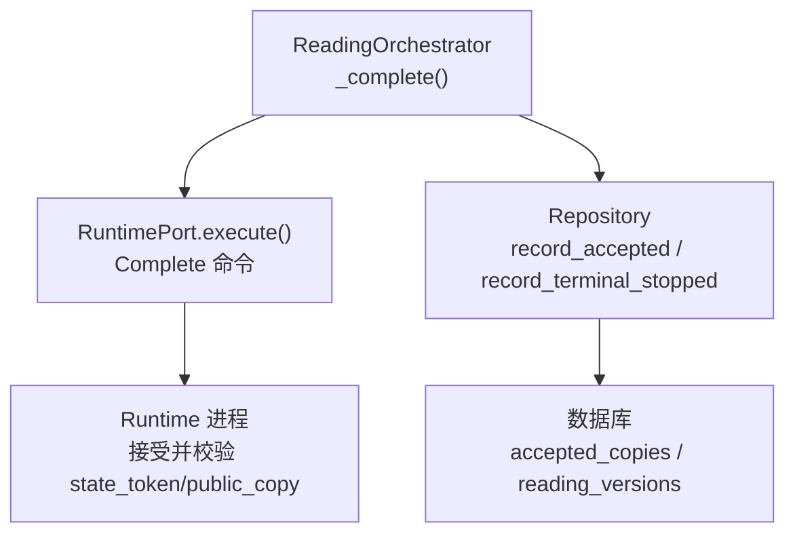
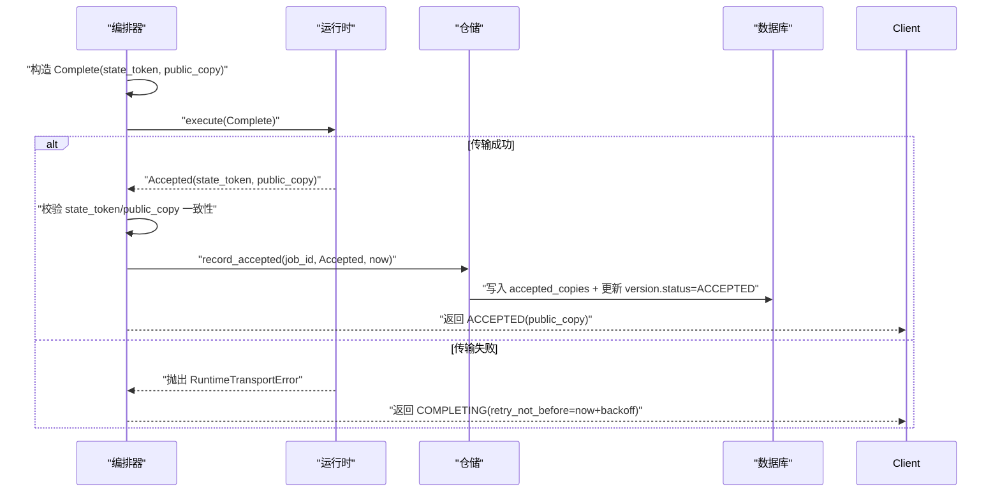
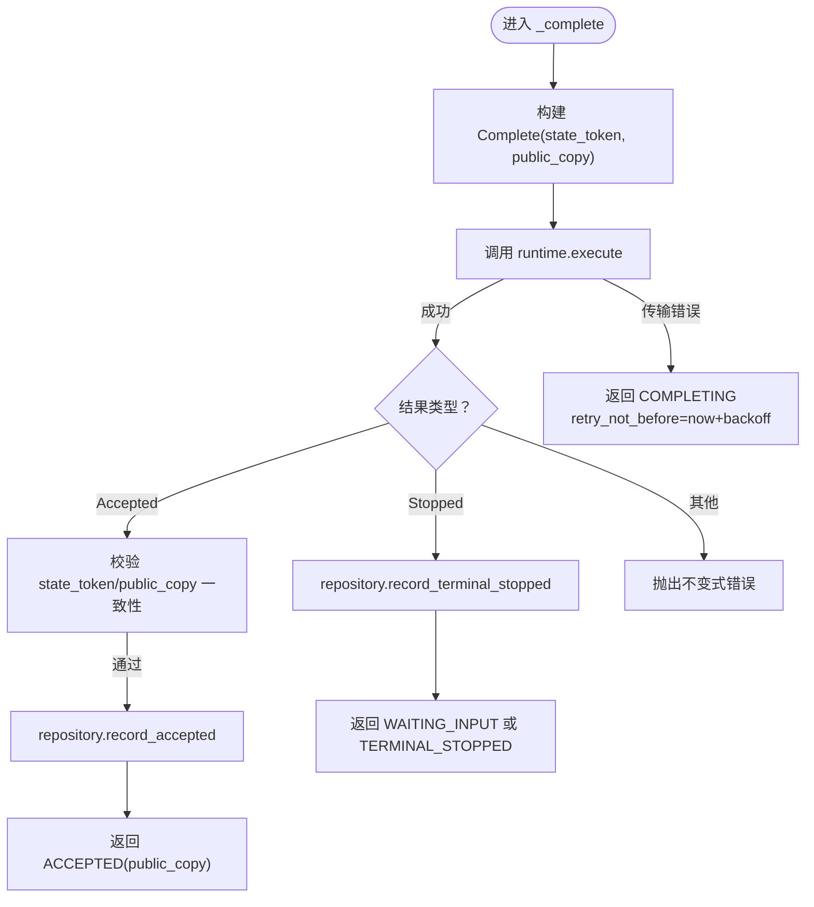
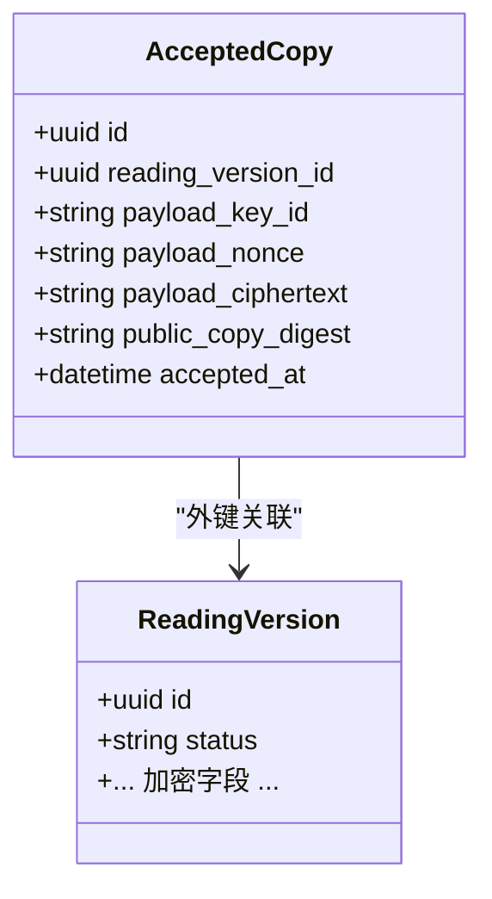
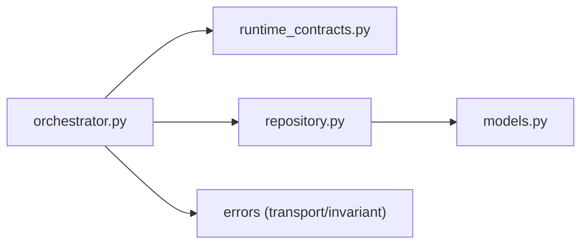

# 完成阶段处理

<cite>
**本文引用的文件**
- [orchestrator.py](file://backend/app/readings/orchestrator.py)
- [runtime_contracts.py](file://backend/app/readings/runtime_contracts.py)
- [repository.py](file://backend/app/readings/repository.py)
- [models.py](file://backend/app/readings/models.py)
- [test_reading_orchestrator_complete.py](file://backend/tests/test_reading_orchestrator_complete.py)
</cite>

## 目录
1. [简介](#简介)
2. [项目结构](#项目结构)
3. [核心组件](#核心组件)
4. [架构总览](#架构总览)
5. [详细组件分析](#详细组件分析)
6. [依赖关系分析](#依赖关系分析)
7. [性能考虑](#性能考虑)
8. [故障排查指南](#故障排查指南)
9. [结论](#结论)

## 简介
本文聚焦命理解读任务“完成阶段”的处理逻辑，围绕 ReadingOrchestrator._complete 方法展开，系统说明：
- Complete 命令的构建与执行流程
- Accepted 结果的验证（state_token 与 public_copy 一致性）
- Completed/ACCEPTED 状态的持久化（record_accepted 调用与最终状态设置）
- Stopped 结果的处理（终止状态记录与最终结果返回）
- 传输错误的重试机制（complete_transport_backoff 配置与幂等性保证）
- 异常处理与故障恢复策略

## 项目结构
完成阶段涉及的核心代码位于后端 readings 模块：
- 编排器 orchestrator.py：定义 _complete 方法及整体工作流
- 运行时契约 runtime_contracts.py：定义 Complete/Accepted/Stopped 等命令与结果类型
- 仓储 repository.py：实现 record_accepted、record_terminal_stopped、状态更新与加密存储
- 数据模型 models.py：定义 accepted_copies、reading_versions 等表结构与约束
- 测试 test_reading_orchestrator_complete.py：覆盖完成阶段的典型路径与边界条件



图表来源
- [orchestrator.py:396-435](file://backend/app/readings/orchestrator.py#L396-L435)
- [repository.py:674-716](file://backend/app/readings/repository.py#L674-L716)
- [runtime_contracts.py:138-152](file://backend/app/readings/runtime_contracts.py#L138-L152)

章节来源
- [orchestrator.py:396-435](file://backend/app/readings/orchestrator.py#L396-L435)
- [runtime_contracts.py:138-152](file://backend/app/readings/runtime_contracts.py#L138-L152)
- [repository.py:674-716](file://backend/app/readings/repository.py#L674-L716)
- [models.py:225-244](file://backend/app/readings/models.py#L225-L244)

## 核心组件
- ReadingOrchestrator._complete：完成阶段入口，负责构造 Complete 命令、调用运行时、校验结果、持久化与状态推进。
- Complete/Accepted/Stopped：跨进程命令与结果契约，确保 state_token 与 public_copy 在两端一致。
- Repository.record_accepted：将 Accepted 结果持久化为不可变记录，并标记版本为 ACCEPTED。
- Repository.record_terminal_stopped：将 Stopped 结果持久化为终止状态。
- 配置 complete_transport_backoff：控制完成阶段传输失败后的重试退避时间。

章节来源
- [orchestrator.py:178-194](file://backend/app/readings/orchestrator.py#L178-L194)
- [runtime_contracts.py:138-152](file://backend/app/readings/runtime_contracts.py#L138-L152)
- [runtime_contracts.py:202-216](file://backend/app/readings/runtime_contracts.py#L202-L216)
- [runtime_contracts.py:222-248](file://backend/app/readings/runtime_contracts.py#L222-L248)
- [repository.py:674-716](file://backend/app/readings/repository.py#L674-L716)
- [repository.py:571-582](file://backend/app/readings/repository.py#L571-L582)

## 架构总览
完成阶段的数据流与状态流转如下：



图表来源
- [orchestrator.py:396-435](file://backend/app/readings/orchestrator.py#L396-L435)
- [repository.py:674-716](file://backend/app/readings/repository.py#L674-L716)

## 详细组件分析

### _complete 方法实现逻辑
- 命令构建：使用 Prepared 中的 state_token 与已生成的 public_copy 构造 Complete 命令。
- 执行与异常：调用 RuntimePort.execute；若抛出 RuntimeTransportError，则返回 COMPLETING 并设置 retry_not_before = now + complete_transport_backoff。
- 结果分支：
  - Accepted：校验 state_token 与 prepared.state_token 相等，public_copy 与入参 public_copy 相等；通过则调用 repository.record_accepted 并返回 ACCEPTED(public_copy)。
  - Stopped：调用 repository.record_terminal_stopped，并通过 _stopped_outcome 返回 WAITING_INPUT 或 TERMINAL_STOPPED。
  - 其他：抛出不变式错误。



图表来源
- [orchestrator.py:396-435](file://backend/app/readings/orchestrator.py#L396-L435)

章节来源
- [orchestrator.py:396-435](file://backend/app/readings/orchestrator.py#L396-L435)

### Accepted 结果的验证过程
- state_token 一致性：必须等于 Prepared 中记录的 state_token，防止令牌漂移或被替换。
- public_copy 一致性：必须等于本次完成意图的 public_copy，确保交付内容与被持久化的完成意图完全一致。
- 不一致时抛出不变式错误，阻断后续持久化，避免脏写。

章节来源
- [orchestrator.py:416-422](file://backend/app/readings/orchestrator.py#L416-L422)
- [runtime_contracts.py:138-152](file://backend/app/readings/runtime_contracts.py#L138-L152)
- [runtime_contracts.py:202-216](file://backend/app/readings/runtime_contracts.py#L202-L216)

### Completed/ACCEPTED 状态的持久化存储
- record_accepted 职责：
  - 首次写入：加密存储 public_copy 到 accepted_copies，记录 public_copy_digest，并将 reading_versions.status 设置为 ACCEPTED，job 状态置为 complete。
  - 幂等保护：若已存在 accepted_copies，解密后比较 public_copy；不一致则抛出不可变记录错误（first-write-wins）。
- 读取侧：load_checkpoint 会加载 accepted 字段，run 入口优先返回 ACCEPTED 并附带 public_copy，确保幂等重放。



图表来源
- [models.py:225-244](file://backend/app/readings/models.py#L225-L244)
- [repository.py:674-716](file://backend/app/readings/repository.py#L674-L716)

章节来源
- [repository.py:674-716](file://backend/app/readings/repository.py#L674-L716)
- [models.py:225-244](file://backend/app/readings/models.py#L225-L244)
- [orchestrator.py:212-231](file://backend/app/readings/orchestrator.py#L212-L231)

### Stopped 结果的处理逻辑
- 当运行时返回 Stopped：
  - 记录终止状态：repository.record_terminal_stopped 将 last_result 写入并设置 version.status=TERMINAL_STOPPED，job 状态置为 stopped。
  - 返回语义：_stopped_outcome 根据 reason 决定返回 WAITING_INPUT（need_input）或 TERMINAL_STOPPED，并携带 public_copy、input_request、stopped_reason。

章节来源
- [orchestrator.py:428-435](file://backend/app/readings/orchestrator.py#L428-L435)
- [orchestrator.py:437-449](file://backend/app/readings/orchestrator.py#L437-L449)
- [repository.py:571-582](file://backend/app/readings/repository.py#L571-L582)

### 传输错误的重试机制与幂等性保证
- 重试触发：_complete 捕获 RuntimeTransportError，返回 COMPLETING 并设置 retry_not_before = now + complete_transport_backoff。
- 幂等性保障：
  - 完成意图已持久化：在生成阶段成功后，public_copy 已通过 _set_completion 持久化到 reading_versions.completion_* 字段；即使运行时响应丢失，下一次调度仍用相同的 state_token 与 public_copy 重放 Complete，确保幂等。
  - Accepted 幂等：record_accepted 对同一 reading_version_id 仅允许一次写入，且要求 public_copy 一致，避免重复提交导致的状态漂移。
- 配置项：complete_transport_backoff 用于控制重试间隔，必须在初始化时为正数。

```mermaid
sequenceDiagram
participant S as "调度器"
participant O as "编排器"
participant R as "运行时"
participant D as "数据库"
S->>O : "run(job_id)"
O->>D : "读取 completion_copy"
O->>R : "execute(Complete)"
alt 传输失败
R--x O : "RuntimeTransportError"
O--S : "COMPLETING(retry_not_before)"
Note over O,D : "completion_copy 已持久化，下次可重放"
else 成功
R--O : "Accepted/Stopped"
O->>D : "record_accepted / record_terminal_stopped"
O--S : "ACCEPTED/WAITING_INPUT/TERMINAL_STOPPED"
end
```

图表来源
- [orchestrator.py:396-435](file://backend/app/readings/orchestrator.py#L396-L435)
- [repository.py:661-672](file://backend/app/readings/repository.py#L661-L672)
- [repository.py:674-716](file://backend/app/readings/repository.py#L674-L716)

章节来源
- [orchestrator.py:186-194](file://backend/app/readings/orchestrator.py#L186-L194)
- [orchestrator.py:396-435](file://backend/app/readings/orchestrator.py#L396-L435)
- [repository.py:661-672](file://backend/app/readings/repository.py#L661-L672)
- [repository.py:674-716](file://backend/app/readings/repository.py#L674-L716)

### 异常处理与故障恢复策略
- 不变式错误：Accepted token/public_copy 不一致、未知结果类型等，直接抛出 OrchestratorInvariantError，阻止继续推进。
- 传输错误：RuntimeTransportError 不视为业务失败，而是网络/运行时临时问题，通过 backoff 重试。
- 恢复路径：
  - 若 checkpoint.accepted 存在，run 直接返回 ACCEPTED(public_copy)，无需再次调用运行时。
  - 若 checkpoint.terminal_stopped 存在，直接返回终止结果。
  - 若 checkpoint.completion_copy 存在但尚未 accepted，重新执行 _complete，利用已持久化的 state_token 与 public_copy 幂等完成。

章节来源
- [orchestrator.py:212-248](file://backend/app/readings/orchestrator.py#L212-L248)
- [orchestrator.py:396-435](file://backend/app/readings/orchestrator.py#L396-L435)

## 依赖关系分析
- orchestrator.py 依赖：
  - runtime_contracts.py：Complete/Accepted/Stopped 等类型与序列化/反序列化
  - repository.py：持久化接口（record_accepted、record_terminal_stopped、checkpoint 读写）
  - errors：RuntimeTransportError、OrchestratorInvariantError 等
- repository.py 依赖：
  - models.py：accepted_copies、reading_versions 等表结构
  - security.envelope：加密/解密 public_copy 与敏感字段
- 测试用例覆盖：
  - 成功路径、传输失败重试、Accepted 幂等、Stopped 分支、guard 失败不进入 complete 等场景



图表来源
- [orchestrator.py:1-40](file://backend/app/readings/orchestrator.py#L1-L40)
- [repository.py:1-40](file://backend/app/readings/repository.py#L1-L40)
- [models.py:225-244](file://backend/app/readings/models.py#L225-L244)

章节来源
- [orchestrator.py:1-40](file://backend/app/readings/orchestrator.py#L1-L40)
- [repository.py:1-40](file://backend/app/readings/repository.py#L1-L40)
- [models.py:225-244](file://backend/app/readings/models.py#L225-L244)

## 性能考虑
- 最小化往返：完成阶段仅在必要时调用运行时；若已 accepted，直接返回，避免冗余网络开销。
- 幂等重放：基于已持久化的 completion_copy 与 state_token，重试不会引入额外计算成本。
- 数据库写入：accepted_copies 为单行追加写入，配合唯一约束与不可变记录保护，写入成本低且安全。
- 退避策略：complete_transport_backoff 合理设置可避免风暴式重试，降低运行时压力。

[本节为通用指导，不直接分析具体文件]

## 故障排查指南
- 现象：反复出现 COMPLETING 并带 retry_not_before
  - 检查 complete_transport_backoff 配置是否为正数
  - 确认运行时是否可用，网络是否稳定
  - 查看数据库中是否存在 completion_copy 与 state_token
- 现象：Accepted 不一致报错
  - 核对 Prepared 的 state_token 与运行时返回的 state_token 是否一致
  - 核对 public_copy 是否与完成意图一致，避免中间篡改
- 现象：无法进入 ACCEPTED
  - 检查 record_accepted 是否被重复调用且 public_copy 不同（first-write-wins 保护）
  - 确认 accepted_copies 是否已存在且内容与预期一致
- 现象：进入 TERMINAL_STOPPED 或 WAITING_INPUT
  - 检查运行时返回的 Stopped.reason 是否为 need_input 或其他终止原因
  - 确认 repository.record_terminal_stopped 是否正确写入 last_result 与状态

章节来源
- [orchestrator.py:186-194](file://backend/app/readings/orchestrator.py#L186-L194)
- [orchestrator.py:416-435](file://backend/app/readings/orchestrator.py#L416-L435)
- [repository.py:674-716](file://backend/app/readings/repository.py#L674-L716)
- [repository.py:571-582](file://backend/app/readings/repository.py#L571-L582)

## 结论
完成阶段通过严格的命令/结果契约、一致性校验与不可变持久化，确保了命理解读任务的最终一致性、幂等性与可恢复性。_complete 方法以 Complete 命令为核心，结合 Accepted/Stopped 分支处理与 backoff 重试机制，形成健壮的状态推进闭环。仓储层通过 accepted_copies 与 reading_versions 的状态机，保证了最终状态的安全落盘与快速恢复。测试覆盖了关键路径与边界情况，为生产稳定性提供了保障。