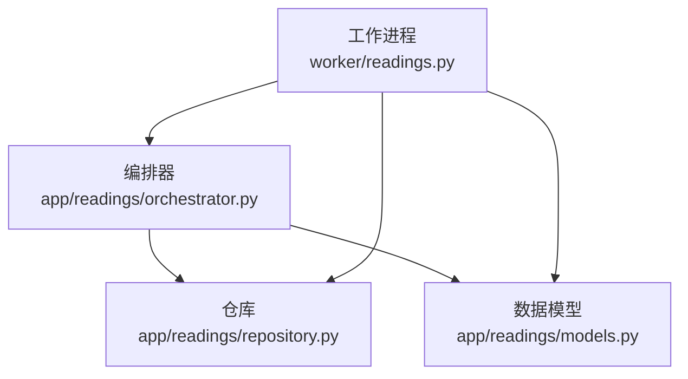
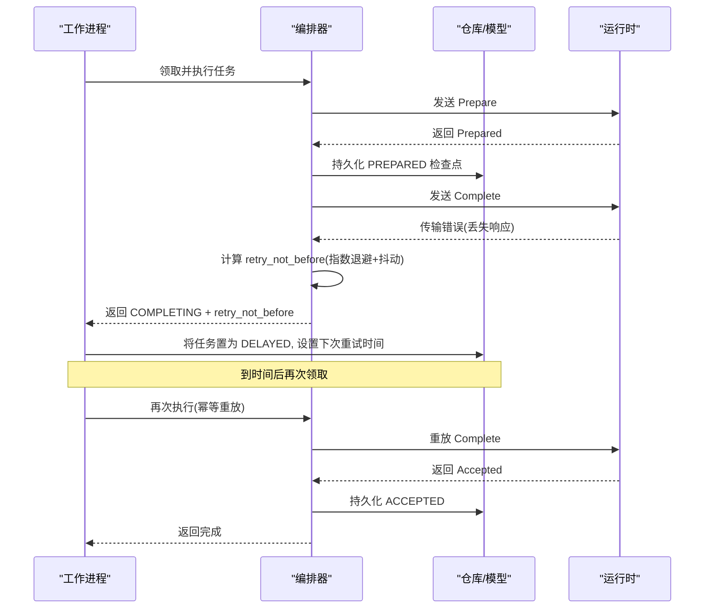
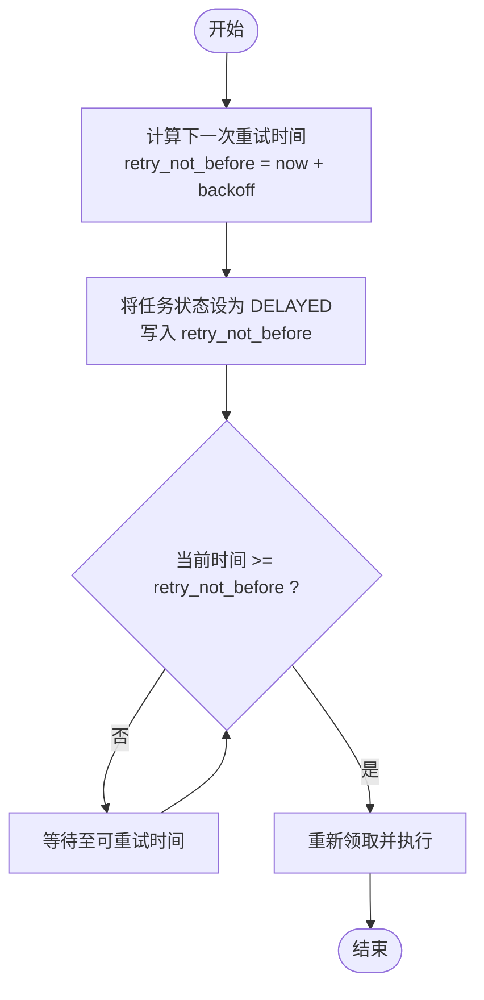
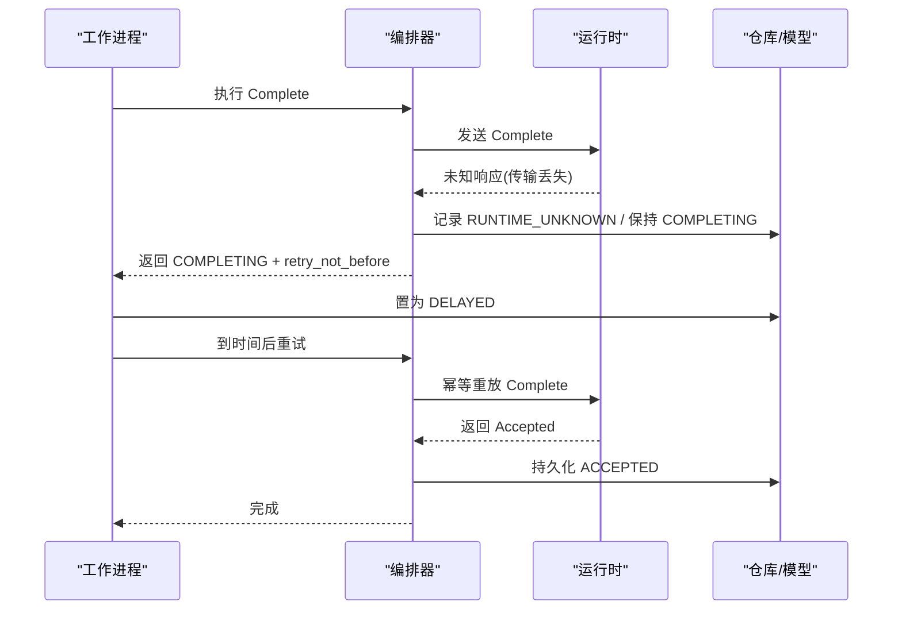
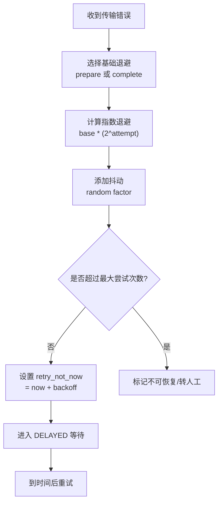
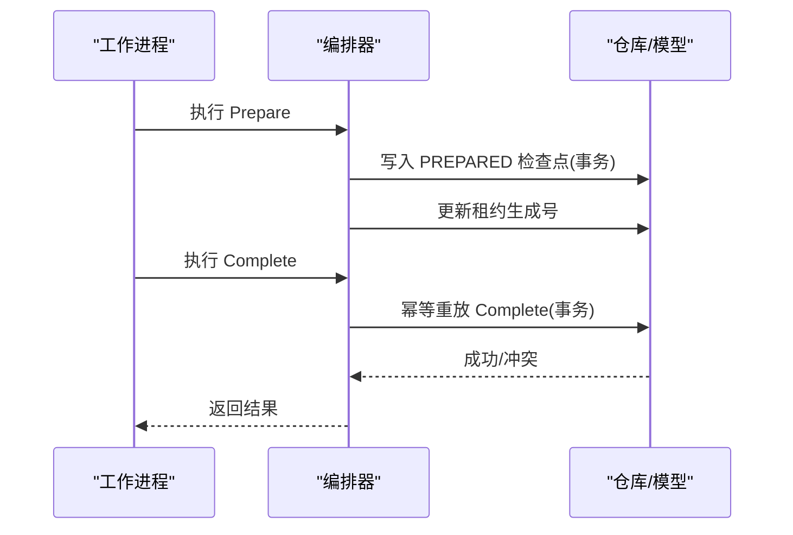
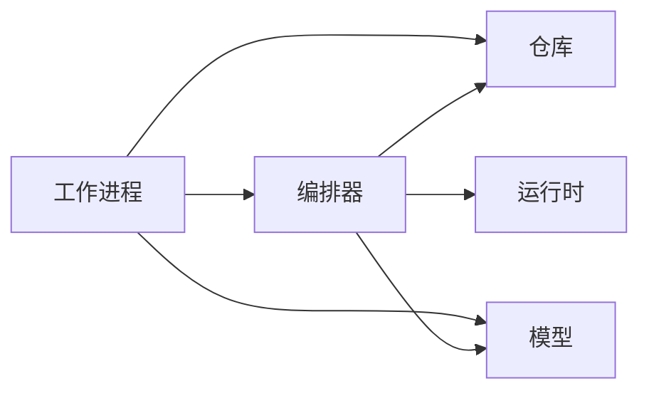

# 重试与退避机制

<cite>
**本文引用的文件**
- [backend/app/readings/orchestrator.py](file://backend/app/readings/orchestrator.py)
- [backend/worker/readings.py](file://backend/worker/readings.py)
- [backend/app/readings/models.py](file://backend/app/readings/models.py)
- [backend/app/readings/repository.py](file://backend/app/readings/repository.py)
- [backend/tests/test_reading_worker.py](file://backend/tests/test_reading_worker.py)
- [backend/tests/test_reading_orchestrator_recovery.py](file://backend/tests/test_reading_orchestrator_recovery.py)
- [backend/app/readings/errors.py](file://backend/app/readings/errors.py)
</cite>

## 目录
1. [简介](#简介)
2. [项目结构](#项目结构)
3. [核心组件](#核心组件)
4. [架构总览](#架构总览)
5. [详细组件分析](#详细组件分析)
6. [依赖关系分析](#依赖关系分析)
7. [性能考量](#性能考量)
8. [故障排查指南](#故障排查指南)
9. [结论](#结论)
10. [附录](#附录)

## 简介
本文件系统性说明命理解读任务的重试与退避机制，覆盖以下关键主题：
- prepare_transport_backoff 与 complete_transport_backoff 的配置与使用场景
- 最大尝试次数控制（max_attempts）与 attempt_count 跟踪
- 延迟状态管理（DELAYED）与 retry_not_before 计算
- 运行时未知状态（RUNTIME_UNKNOWN）的标记与恢复策略
- 指数退避与抖动算法的实现要点
- 重试过程中的状态持久化与一致性保证
- 监控与告警策略

## 项目结构
重试与退避能力由“编排器 + 工作进程 + 仓库/模型”共同实现：
- 编排器负责定义退避参数、调度重试、维护状态机与幂等性
- 工作进程负责从队列领取任务、调用编排器、根据返回结果更新任务状态
- 仓库与模型负责持久化任务状态、重试时间、尝试计数等

图表来源
- [backend/worker/readings.py](file://backend/worker/readings.py)
- [backend/app/readings/orchestrator.py](file://backend/app/readings/orchestrator.py)
- [backend/app/readings/repository.py](file://backend/app/readings/repository.py)
- [backend/app/readings/models.py](file://backend/app/readings/models.py)

章节来源
- [backend/app/readings/orchestrator.py:187-194](file://backend/app/readings/orchestrator.py#L187-L194)
- [backend/worker/readings.py](file://backend/worker/readings.py)
- [backend/app/readings/repository.py](file://backend/app/readings/repository.py)
- [backend/app/readings/models.py:1-35](file://backend/app/readings/models.py#L1-L35)

## 核心组件
- 编排器配置项
  - prepare_transport_backoff：准备阶段传输失败后的基础退避时长
  - complete_transport_backoff：完成阶段传输失败后的基础退避时长
  - 初始化校验确保两者均为正数
- 工作进程处理器
  - 从作业源领取任务，调用编排器执行
  - 根据编排器返回的 outcome（含 status、retry_not_before）决定下一步动作
- 仓库与模型
  - 持久化任务状态、重试时间、尝试计数、租约生成号等
  - 通过数据库约束与事务保证一致性

章节来源
- [backend/app/readings/orchestrator.py:187-194](file://backend/app/readings/orchestrator.py#L187-L194)
- [backend/worker/readings.py](file://backend/worker/readings.py)
- [backend/app/readings/models.py:1-35](file://backend/app/readings/models.py#L1-L35)
- [backend/app/readings/repository.py](file://backend/app/readings/repository.py)

## 架构总览
下图展示一次包含重试与退避的任务处理流程，涵盖准备阶段与完成阶段的传输异常、延迟重试与最终成功。

图表来源
- [backend/worker/readings.py](file://backend/worker/readings.py)
- [backend/app/readings/orchestrator.py](file://backend/app/readings/orchestrator.py)
- [backend/app/readings/repository.py](file://backend/app/readings/repository.py)
- [backend/app/readings/models.py](file://backend/app/readings/models.py)

## 详细组件分析

### 编排器：prepare_transport_backoff 与 complete_transport_backoff
- 作用
  - prepare_transport_backoff：用于准备阶段网络或传输异常时的基础退避时长
  - complete_transport_backoff：用于完成阶段网络或传输异常时的基础退避时长
- 配置与校验
  - 初始化时强制要求为正数，避免无效配置导致立即重试风暴
- 使用方式
  - 在对应阶段发生传输错误时，基于该基础值计算下一次重试时间
  - 结合指数退避与抖动，形成平滑的重试曲线

章节来源
- [backend/app/readings/orchestrator.py:187-194](file://backend/app/readings/orchestrator.py#L187-L194)

### 最大尝试次数与尝试计数跟踪
- max_attempts
  - 限制同一阶段的最大重试次数，防止无限重试
  - 超过上限时，应转为不可恢复错误或进入人工干预流程
- attempt_count
  - 每次重试递增，用于判断是否达到上限
  - 与数据库中的任务记录保持一致，确保跨进程可见性

章节来源
- [backend/app/readings/orchestrator.py](file://backend/app/readings/orchestrator.py)
- [backend/app/readings/models.py](file://backend/app/readings/models.py)
- [backend/app/readings/repository.py](file://backend/app/readings/repository.py)

### 延迟状态与 retry_not_before 计算
- DELAYED 状态
  - 当需要等待一段时间再重试时，将任务置为 DELAYED，避免被立即重新领取
- retry_not_before
  - 表示最早可重试的时间点，由当前时间与退避时长计算得出
  - 工作进程仅在当前时间 >= retry_not_before 时才重新领取并执行

图表来源
- [backend/worker/readings.py](file://backend/worker/readings.py)
- [backend/app/readings/orchestrator.py](file://backend/app/readings/orchestrator.py)
- [backend/app/readings/models.py](file://backend/app/readings/models.py)

章节来源
- [backend/worker/readings.py](file://backend/worker/readings.py)
- [backend/app/readings/orchestrator.py](file://backend/app/readings/orchestrator.py)
- [backend/app/readings/models.py](file://backend/app/readings/models.py)

### 运行时未知状态的处理：RUNTIME_UNKNOWN 标记与恢复
- 触发条件
  - 运行时返回“传输结果未知”，无法确定命令是否成功提交
- 处理策略
  - 标记为 RUNTIME_UNKNOWN，避免直接判定失败
  - 通过幂等重放机制，在后续重试中安全地重放上一次命令
  - 若重放确认成功，则推进状态；否则继续按退避策略重试
- 测试验证
  - 用例验证在 Complete 阶段出现传输丢失时，编排器会返回 COMPLETING 并设置 retry_not_before，随后重放 Complete 并成功

图表来源
- [backend/tests/test_reading_orchestrator_recovery.py:56-90](file://backend/tests/test_reading_orchestrator_recovery.py#L56-L90)
- [backend/app/readings/orchestrator.py](file://backend/app/readings/orchestrator.py)
- [backend/app/readings/models.py](file://backend/app/readings/models.py)

章节来源
- [backend/tests/test_reading_orchestrator_recovery.py:56-90](file://backend/tests/test_reading_orchestrator_recovery.py#L56-L90)
- [backend/app/readings/orchestrator.py](file://backend/app/readings/orchestrator.py)
- [backend/app/readings/models.py](file://backend/app/readings/models.py)

### 退避算法：指数退避与抖动
- 指数退避
  - 以基础退避值为基数，随尝试次数呈指数增长，降低瞬时压力
  - 不同阶段可使用不同的基础值（prepare vs complete）
- 抖动
  - 在指数退避基础上加入随机抖动，避免多实例同时重试导致的“惊群效应”
- 上限保护
  - 结合 max_attempts 限制最大重试次数，避免无限重试
  - 超过上限时转入人工处理或降级策略

图表来源
- [backend/app/readings/orchestrator.py](file://backend/app/readings/orchestrator.py)
- [backend/worker/readings.py](file://backend/worker/readings.py)

章节来源
- [backend/app/readings/orchestrator.py](file://backend/app/readings/orchestrator.py)
- [backend/worker/readings.py](file://backend/worker/readings.py)

### 重试过程中的状态持久化与一致性保证
- 原子检查点
  - 在 Prepare 成功后写入检查点，确保崩溃后可恢复
- 幂等重放
  - Complete 阶段支持幂等重放，避免重复执行造成副作用
- 事务与约束
  - 通过数据库事务与唯一约束，保证状态迁移的一致性
- 租约与抢占
  - 使用租约生成号防止并发抢占导致的状态不一致

图表来源
- [backend/app/readings/orchestrator.py](file://backend/app/readings/orchestrator.py)
- [backend/app/readings/repository.py](file://backend/app/readings/repository.py)
- [backend/app/readings/models.py](file://backend/app/readings/models.py)

章节来源
- [backend/app/readings/orchestrator.py](file://backend/app/readings/orchestrator.py)
- [backend/app/readings/repository.py](file://backend/app/readings/repository.py)
- [backend/app/readings/models.py](file://backend/app/readings/models.py)

### 监控与告警策略
- 指标采集
  - 记录各阶段重试次数、退避时长分布、超时与传输错误率
  - 统计 DELAYED 任务数量与平均等待时间
- 告警规则
  - 当某阶段连续多次失败且接近 max_attempts 时触发告警
  - 当大量任务处于 RUNTIME_UNKNOWN 或 DELAYED 状态时触发告警
- 可观测性
  - 在编排器与工作进程中埋点，输出结构化日志与指标
  - 对关键路径（Prepare/Complete）进行端到端追踪

章节来源
- [backend/app/readings/orchestrator.py](file://backend/app/readings/orchestrator.py)
- [backend/worker/readings.py](file://backend/worker/readings.py)

## 依赖关系分析
- 编排器依赖
  - 仓库：读写任务状态、重试时间、尝试计数
  - 模型：定义任务字段与约束
  - 运行时：执行 Prepare/Complete 命令
- 工作进程依赖
  - 编排器：执行任务逻辑
  - 仓库/模型：更新任务状态与重试计划
- 外部依赖
  - 运行时适配器：可能抛出传输错误，需被捕获并转化为重试策略

图表来源
- [backend/worker/readings.py](file://backend/worker/readings.py)
- [backend/app/readings/orchestrator.py](file://backend/app/readings/orchestrator.py)
- [backend/app/readings/repository.py](file://backend/app/readings/repository.py)
- [backend/app/readings/models.py](file://backend/app/readings/models.py)

章节来源
- [backend/worker/readings.py](file://backend/worker/readings.py)
- [backend/app/readings/orchestrator.py](file://backend/app/readings/orchestrator.py)
- [backend/app/readings/repository.py](file://backend/app/readings/repository.py)
- [backend/app/readings/models.py](file://backend/app/readings/models.py)

## 性能考量
- 退避参数调优
  - 根据运行时特性调整 prepare/complete 的基础退避值，平衡延迟与吞吐
- 抖动范围
  - 合理设置抖动比例，避免多实例同步重试
- 批量处理
  - 工作进程采用批处理模式，减少数据库往返
- 资源保护
  - 通过 max_attempts 与延迟队列保护后端资源，防止雪崩

[本节提供通用指导，不直接分析具体文件]

## 故障排查指南
- 常见问题
  - 传输错误频繁：检查运行时稳定性与网络状况
  - 任务长期 DELAYED：核对 retry_not_before 与系统时钟一致性
  - RUNTIME_UNKNOWN 堆积：核查幂等重放逻辑与运行时响应
- 定位方法
  - 查看编排器日志与指标，关注重试次数与退避时长
  - 检查数据库中任务状态与重试时间字段
  - 通过测试用例复现问题，如传输丢失场景

章节来源
- [backend/tests/test_reading_worker.py:511-545](file://backend/tests/test_reading_worker.py#L511-L545)
- [backend/tests/test_reading_worker.py:901-934](file://backend/tests/test_reading_worker.py#L901-L934)
- [backend/app/readings/errors.py](file://backend/app/readings/errors.py)

## 结论
本机制通过明确的退避参数、严格的尝试次数控制、可靠的延迟状态管理与幂等重放策略，确保了命理解读任务在网络波动与运行时异常下的鲁棒性。配合完善的监控与告警，可在生产环境中及时发现并处理异常，保障服务的高可用性与一致性。

[本节总结整体发现，不直接分析具体文件]

## 附录
- 相关测试用例参考
  - 令牌化准备阶段传输重试：[test_reading_worker.py:511-545](file://backend/tests/test_reading_worker.py#L511-L545)
  - PostgreSQL 完成阶段重试延迟与精确性：[test_reading_worker.py:901-934](file://backend/tests/test_reading_worker.py#L901-L934)
  - 完成阶段未知响应重放：[test_reading_orchestrator_recovery.py:56-90](file://backend/tests/test_reading_orchestrator_recovery.py#L56-L90)

章节来源
- [backend/tests/test_reading_worker.py:511-545](file://backend/tests/test_reading_worker.py#L511-L545)
- [backend/tests/test_reading_worker.py:901-934](file://backend/tests/test_reading_worker.py#L901-L934)
- [backend/tests/test_reading_orchestrator_recovery.py:56-90](file://backend/tests/test_reading_orchestrator_recovery.py#L56-L90)