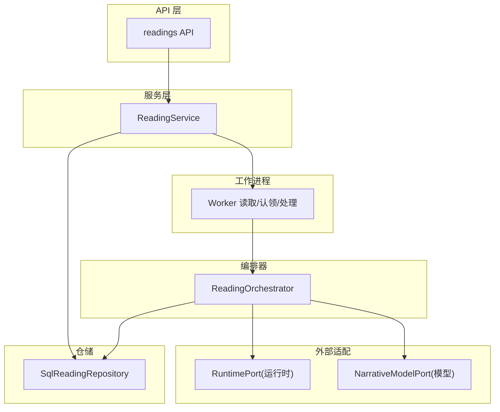
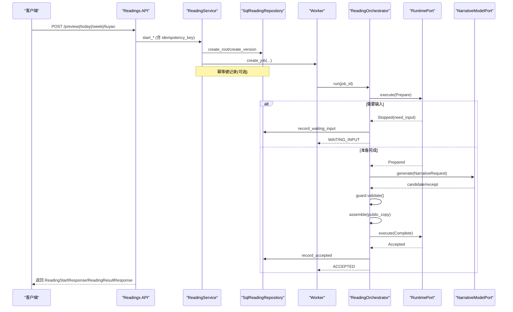
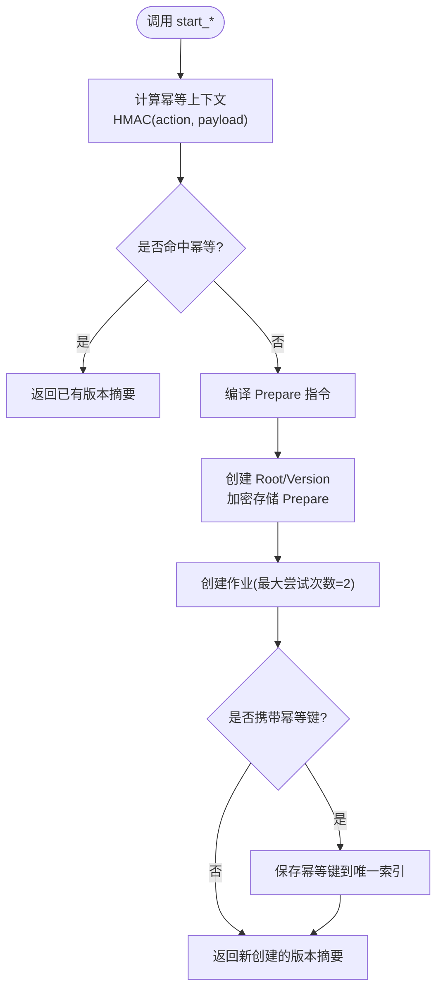
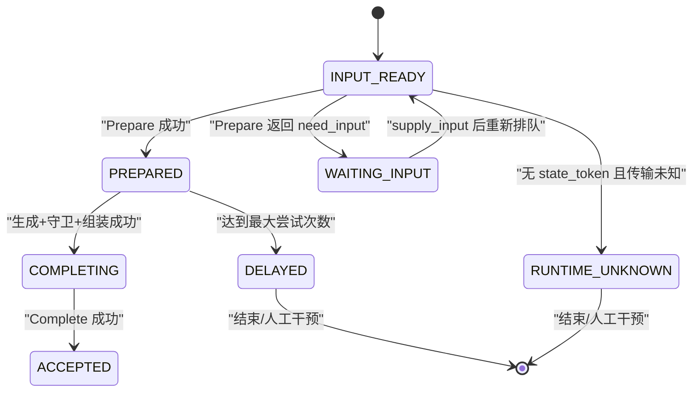
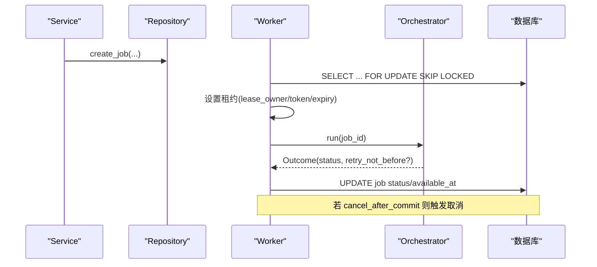
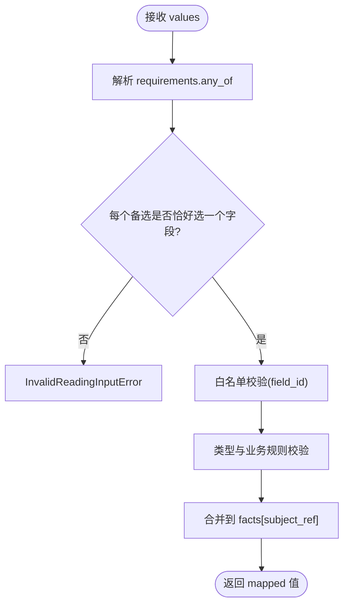
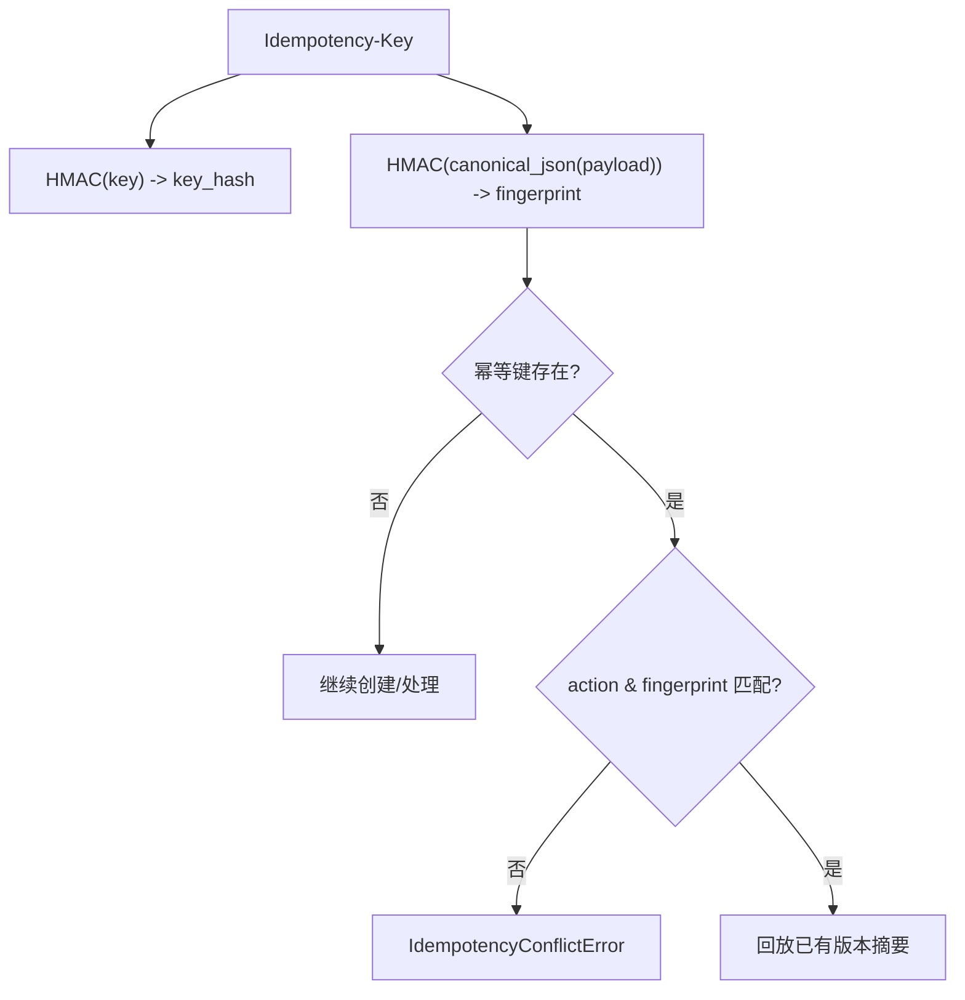
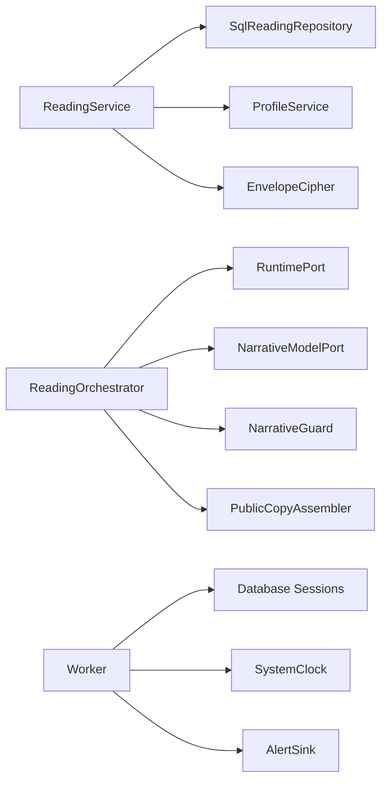
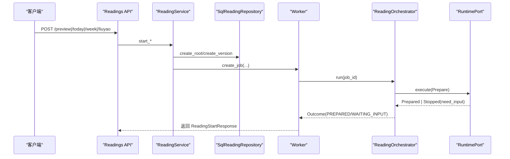

# 命理解读编排器

<cite>
**本文引用的文件**
- [service.py](file://backend/app/readings/service.py)
- [orchestrator.py](file://backend/app/readings/orchestrator.py)
- [status.py](file://backend/app/readings/status.py)
- [readings.py](file://backend/worker/readings.py)
- [repository.py](file://backend/app/readings/repository.py)
- [request_compiler.py](file://backend/app/readings/request_compiler.py)
- [runtime_contracts.py](file://backend/app/readings/runtime_contracts.py)
- [models.py](file://backend/app/readings/models.py)
- [errors.py](file://backend/app/readings/errors.py)
- [api_schemas.py](file://backend/app/readings/api_schemas.py)
- [readings API](file://backend/app/api/readings.py)
</cite>

## 目录
1. [简介](#简介)
2. [项目结构](#项目结构)
3. [核心组件](#核心组件)
4. [架构总览](#架构总览)
5. [详细组件分析](#详细组件分析)
6. [依赖关系分析](#依赖关系分析)
7. [性能与可靠性](#性能与可靠性)
8. [故障排查指南](#故障排查指南)
9. [结论](#结论)
10. [附录：状态机与流程图](#附录状态机与流程图)

## 简介
本文件面向“命理解读编排器”的完整技术文档，聚焦 ReadingService 的核心业务逻辑、解读状态机管理、任务调度机制、输入验证系统、幂等性控制以及版本管理与归档策略。文档以代码级为依据，提供可视化图示与可操作的排错建议，帮助读者快速理解并安全扩展该子系统。

## 项目结构
后端围绕“服务层 + 编排器 + 工作进程 + 仓储 + 契约模型”分层组织：
- 服务层 service.py：对外暴露 start_preview/start_fortune/start_liuyao/supply_input/follow_up 等方法，负责参数归一化、幂等键计算、持久化启动、创建作业与结果汇总。
- 编排器 orchestrator.py：驱动 Prepare/Complete 流程，处理运行时交互、模型生成、守卫校验、公共副本组装与最终接受。
- 工作进程 worker/readings.py：从数据库领取作业、加租约执行、回写状态、重试与延迟。
- 仓储 repository.py：读写 ReadingRoot/Version/Job/IdempotencyKey 等实体，加密存储 Prepare/Result，维护版本序列与约束。
- 契约 runtime_contracts.py：定义 Prepare/Prepared/Complete/Accepted/Stopped 等命令与结果类型，并进行 JSON Schema 校验。
- 请求编译 request_compiler.py：将产品动作（bazi/fortune/liuyao）编译为合法的 Prepare 指令，校验维度与时区等。
- 模型 models.py：SQLAlchemy 模型定义，包含 RuntimeRelease、ReadingRoot、ReadingVersion、FactBrief、GenerationAttempt 等。
- API readings.py：FastAPI 路由，绑定 ReadingService，统一错误映射与速率限制。



**图表来源**
- [readings API:87-200](file://backend/app/api/readings.py#L87-L200)
- [service.py:117-513](file://backend/app/readings/service.py#L117-L513)
- [orchestrator.py:178-450](file://backend/app/readings/orchestrator.py#L178-L450)
- [readings.py:108-286](file://backend/worker/readings.py#L108-L286)
- [repository.py:51-200](file://backend/app/readings/repository.py#L51-L200)

**章节来源**
- [readings API:87-200](file://backend/app/api/readings.py#L87-L200)
- [service.py:117-513](file://backend/app/readings/service.py#L117-L513)
- [orchestrator.py:178-450](file://backend/app/readings/orchestrator.py#L178-L450)
- [readings.py:108-286](file://backend/worker/readings.py#L108-L286)
- [repository.py:51-200](file://backend/app/readings/repository.py#L51-L200)

## 核心组件
- ReadingService：封装业务入口，负责：
  - 启动解读：start_preview、start_fortune、start_liuyao
  - 补充输入：supply_input
  - 后续追问：follow_up
  - 幂等控制：基于 HMAC 的 IdempotencyContext 与重复请求回放
  - 输入校验：InputFieldPolicy 与字段类型/范围/选择集校验
  - 版本与作业：创建 ReadingRoot/Version、写入 Prepare、创建 Job
- ReadingOrchestrator：编排 Prepare/Complete 生命周期，处理：
  - 运行时交互（Prepare/Complete）
  - 模型生成与守卫校验
  - 公共副本组装
  - 重试、延迟、终止与接受
- Worker 与 Job 队列：
  - 通过 SQL 锁与租约避免并发冲突
  - 将编排器状态映射为作业状态（queued/waiting_input/stopped/delayed/runtime_unknown/complete）
- Repository：
  - 加密存储 Prepare/Result
  - 维护版本序列、能力与维度、时间域
  - 幂等键表与历史查询

**章节来源**
- [service.py:81-128](file://backend/app/readings/service.py#L81-L128)
- [service.py:129-513](file://backend/app/readings/service.py#L129-L513)
- [orchestrator.py:43-189](file://backend/app/readings/orchestrator.py#L43-L189)
- [readings.py:108-286](file://backend/worker/readings.py#L108-L286)
- [repository.py:51-200](file://backend/app/readings/repository.py#L51-L200)

## 架构总览


**图表来源**
- [readings API:87-200](file://backend/app/api/readings.py#L87-L200)
- [service.py:129-513](file://backend/app/readings/service.py#L129-L513)
- [orchestrator.py:212-435](file://backend/app/readings/orchestrator.py#L212-L435)
- [readings.py:175-231](file://backend/worker/readings.py#L175-L231)

## 详细组件分析

### ReadingService 启动方法工作原理
- start_preview：
  - 解析默认查询与维度，构造幂等上下文
  - 检查幂等回放，若命中直接返回已有版本摘要
  - 加载已确认的用户画像版本，编译 bazi Prepare
  - 持久化 Root/Version，创建 Job，保存幂等键
- start_fortune：
  - 校验 action 为 today/near_seven，构造幂等上下文
  - 编译 fortune Prepare（含参考时间与时间域）
  - 持久化与创建 Job
- start_liuyao：
  - 解析投掷或数字硬币模式，构造幂等上下文
  - 编译 liuyao Prepare（事件时间、时区、地点、维度）
  - 持久化与创建 Job



**图表来源**
- [service.py:129-254](file://backend/app/readings/service.py#L129-L254)
- [service.py:455-513](file://backend/app/readings/service.py#L455-L513)
- [service.py:597-620](file://backend/app/readings/service.py#L597-L620)

**章节来源**
- [service.py:129-254](file://backend/app/readings/service.py#L129-L254)
- [service.py:455-513](file://backend/app/readings/service.py#L455-L513)
- [service.py:597-620](file://backend/app/readings/service.py#L597-L620)

### 解读状态机管理
状态枚举与转换规则：
- INPUT_READY：初始态，等待编排器执行 Prepare
- WAITING_INPUT：运行时要求用户输入（Stopped reason=need_input）
- TERMINAL_STOPPED：不可恢复停止
- PREPARED：Prepare 成功，进入模型生成阶段
- COMPLETING：公共副本已组装，提交 Complete
- ACCEPTED：运行时接受，最终态
- DELAYED：达到最大尝试次数或需延后重试
- RUNTIME_UNKNOWN：无 state_token 的 Prepare 失败且无法区分根是否创建

关键转换：
- INPUT_READY → PREPARED：Prepare 成功
- INPUT_READY → WAITING_INPUT：Prepare 返回 need_input
- PREPARED → COMPLETING：模型生成+守卫通过+组装成功
- COMPLETING → ACCEPTED：Complete 成功
- PREPARED → DELAYED：超过最大尝试次数
- INPUT_READY → RUNTIME_UNKNOWN：无 state_token 的 Prepare 失败



**图表来源**
- [status.py:4-13](file://backend/app/readings/status.py#L4-L13)
- [orchestrator.py:212-285](file://backend/app/readings/orchestrator.py#L212-L285)
- [orchestrator.py:287-435](file://backend/app/readings/orchestrator.py#L287-L435)
- [readings.py:220-231](file://backend/worker/readings.py#L220-L231)

**章节来源**
- [status.py:4-13](file://backend/app/readings/status.py#L4-L13)
- [orchestrator.py:212-285](file://backend/app/readings/orchestrator.py#L212-L285)
- [orchestrator.py:287-435](file://backend/app/readings/orchestrator.py#L287-L435)
- [readings.py:220-231](file://backend/worker/readings.py#L220-L231)

### 任务调度机制
- 异步任务创建：
  - Service._create_job 写入作业记录，指定输出契约、语言、最大尝试次数
- Worker 进程通信：
  - ReadingJobWorkSource.claim_one 使用 with_for_update(skip_locked=True) 选取可执行作业
  - 对过期租约进行清理；对无 state_token 的 Prepare 失败标记 RUNTIME_UNKNOWN
  - ReadingJobProcessor.process 持有租约运行编排器，完成后更新作业状态与可用时间
- 结果处理：
  - 编排器返回 ReadingOutcome，映射为作业状态（queued/waiting_input/stopped/delayed/runtime_unknown/complete）
  - 支持 retry_not_before 延迟重试与 cancel_after_commit 取消



**图表来源**
- [service.py:505-513](file://backend/app/readings/service.py#L505-L513)
- [readings.py:63-161](file://backend/worker/readings.py#L63-L161)
- [readings.py:175-231](file://backend/worker/readings.py#L175-L231)

**章节来源**
- [service.py:505-513](file://backend/app/readings/service.py#L505-L513)
- [readings.py:63-161](file://backend/worker/readings.py#L63-L161)
- [readings.py:175-231](file://backend/worker/readings.py#L175-L231)

### 输入验证系统
- InputFieldPolicy：
  - target：目标字段名（如 cast、zi_hour_policy、fixture_input）
  - type_ids：允许的字段类型集合（integer/text/textarea/choice）
  - minimum/maximum：数值范围约束
- supply_input 校验流程：
  - 解析 input_request.requirements.any_of，确保每个备选恰好选择一个字段
  - 白名单校验：仅允许已知 field_id
  - 类型与业务规则校验：整数、文本非空、选择集匹配、六爻投掷值范围
  - 合并 facts：将输入值注入对应 subject_ref 的事实中
- 错误处理：
  - InvalidReadingInputError：格式错误、未知字段、类型不符、超出范围、不在选择集



**图表来源**
- [service.py:256-292](file://backend/app/readings/service.py#L256-L292)
- [service.py:677-731](file://backend/app/readings/service.py#L677-L731)
- [service.py:751-786](file://backend/app/readings/service.py#L751-L786)
- [service.py:788-798](file://backend/app/readings/service.py#L788-L798)

**章节来源**
- [service.py:256-292](file://backend/app/readings/service.py#L256-L292)
- [service.py:677-731](file://backend/app/readings/service.py#L677-L731)
- [service.py:751-786](file://backend/app/readings/service.py#L751-L786)
- [service.py:788-798](file://backend/app/readings/service.py#L788-L798)

### 幂等性控制机制
- IdempotencyContext：
  - key_hash：对 Idempotency-Key 做 HMAC（domain="reading-idempotency-key-v1"）
  - action：动作标识（profile_preview/today/near_seven/liuyao_one_question/follow_up）
  - request_fingerprint：对规范化 JSON 负载做 HMAC（domain="reading-idempotency-request-v1"）
- 重复请求处理：
  - 启动前检查幂等键是否存在于当前所有者上下文
  - 若存在且 action/fingerprint 一致，直接回放已有版本摘要
  - 若不一致，抛出 IdempotencyConflictError
  - 保存幂等键时使用唯一索引，冲突时回滚并回放
- 适用场景：start_* 与 follow_up



**图表来源**
- [service.py:81-86](file://backend/app/readings/service.py#L81-L86)
- [service.py:552-620](file://backend/app/readings/service.py#L552-L620)
- [service.py:429-453](file://backend/app/readings/service.py#L429-L453)

**章节来源**
- [service.py:81-86](file://backend/app/readings/service.py#L81-L86)
- [service.py:552-620](file://backend/app/readings/service.py#L552-L620)
- [service.py:429-453](file://backend/app/readings/service.py#L429-L453)

### 解读版本管理
- 版本创建：
  - create_root：绑定能力与所有者（用户或访客会话）
  - create_version：在 Root 上递增 version，加密存储 Prepare，记录能力、对象ID、维度与时间域
- 历史追踪：
  - list_summaries：按拥有者列出最新版本（最多 50）
  - get_result：返回事实面板、已接受副本、验证信息、待输入请求
- 归档策略：
  - 通过 FactBrief、AcceptedCopy、Verification 等表持久化关键产物
  - 所有敏感数据（Prepare/Result）通过 EnvelopeCipher 加密存储
  - 版本不可变：ReadingVersion.version 严格递增，配合唯一约束保证一致性

```mermaid
classDiagram
class ReadingRoot {
+id
+owner_user_id
+owner_guest_session_id
+profile_version_id
+capability_id
+created_at
}
class ReadingVersion {
+id
+reading_root_id
+runtime_release_id
+version
+status
+capability_id
+object_id
+dimension_ids
+horizon
+prepare_*(encrypted)
+state_token_*(encrypted)
+last_result_*(encrypted)
+completion_*(encrypted)
+created_at
}
class FactBrief {
+id
+reading_version_id
+payload_*(encrypted)
+created_at
}
class AcceptedCopy {
+id
+reading_version_id
+public_copy
+created_at
}
class GenerationAttempt {
+id
+reading_version_id
+attempt_number
+candidate_*(encrypted)
+guard_errors
+created_at
}
ReadingRoot ||--o{ ReadingVersion : "拥有多个版本"
ReadingVersion ||--o{ FactBrief : "事实简报"
ReadingVersion ||--o{ AcceptedCopy : "已接受副本"
ReadingVersion ||--o{ GenerationAttempt : "生成尝试"
```

**图表来源**
- [models.py:53-159](file://backend/app/readings/models.py#L53-L159)
- [models.py:162-200](file://backend/app/readings/models.py#L162-L200)
- [repository.py:83-167](file://backend/app/readings/repository.py#L83-L167)

**章节来源**
- [models.py:53-159](file://backend/app/readings/models.py#L53-L159)
- [models.py:162-200](file://backend/app/readings/models.py#L162-L200)
- [repository.py:83-167](file://backend/app/readings/repository.py#L83-L167)

## 依赖关系分析
- ReadingService 依赖：
  - ProfileService：获取已确认的画像版本
  - SqlReadingRepository：持久化 Root/Version/Job/IdempotencyKey
  - EnvelopeCipher：加密敏感数据
- ReadingOrchestrator 依赖：
  - RuntimePort：执行 Prepare/Complete
  - NarrativeModelPort：生成候选叙事
  - NarrativeGuard：校验候选是否符合输出契约
  - PublicCopyAssembler：组装公开副本
- Worker 依赖：
  - Database sessions：事务与锁
  - SystemClock：时间源
  - AlertSink：告警事件



**图表来源**
- [service.py:117-128](file://backend/app/readings/service.py#L117-L128)
- [orchestrator.py:178-189](file://backend/app/readings/orchestrator.py#L178-L189)
- [readings.py:234-286](file://backend/worker/readings.py#L234-L286)

**章节来源**
- [service.py:117-128](file://backend/app/readings/service.py#L117-L128)
- [orchestrator.py:178-189](file://backend/app/readings/orchestrator.py#L178-L189)
- [readings.py:234-286](file://backend/worker/readings.py#L234-L286)

## 性能与可靠性
- 幂等性与去重：
  - 幂等键唯一索引避免重复创建
  - 重复请求直接回放，降低负载
- 并发与锁：
  - 作业认领使用 with_for_update(skip_locked=True) 避免争用
  - Root 级别锁保证版本分配串行化
- 重试与延迟：
  - 最大尝试次数=2，超限时标记 DELAYED
  - 传输错误时根据 state_token 决定是否标记 RUNTIME_UNKNOWN
- 数据安全：
  - 所有敏感数据（Prepare/Result）通过信封加密存储
  - 契约校验确保跨进程边界的数据一致性

[本节为通用指导，不直接分析具体文件]

## 故障排查指南
- 常见错误与定位：
  - Idempotency-Key 冲突：检查 action 与 payload 是否一致
  - 读取不到版本：检查拥有者上下文与版本归属
  - 输入无效：检查 requirements.any_of 与 InputFieldPolicy
  - 运行时未知：无 state_token 的 Prepare 失败，需人工介入
  - 已达最大尝试：查看模型生成与守卫错误日志
- 日志与告警：
  - 编排器通过 AlertSink 发出 guard_rejection、delayed、model_cost、runtime_unknown 等事件
  - Worker 在租约丢失或 fencing token 变化时报 LeaseLostError
- 建议步骤：
  - 先查幂等键与版本归属
  - 再查作业状态与最近一次尝试的错误码
  - 最后核对输入字段与选择集

**章节来源**
- [errors.py:4-30](file://backend/app/readings/errors.py#L4-L30)
- [readings.py:175-218](file://backend/worker/readings.py#L175-L218)
- [orchestrator.py:196-210](file://backend/app/readings/orchestrator.py#L196-L210)

## 结论
本编排器通过清晰的分层与契约化设计，实现了稳定的命理解读流程：
- 服务层负责业务入口与幂等控制
- 编排器驱动 Prepare/Complete 生命周期，保障健壮性
- 工作进程通过租约与锁实现可靠调度
- 仓储层加密存储并维护版本历史
- 输入验证与契约校验确保数据质量
整体具备高内聚、低耦合、可观测与可扩展的特性，适合在生产环境稳定运行。

[本节为总结，不直接分析具体文件]

## 附录：状态机与流程图

### 状态机图（代码级映射）


**图表来源**
- [status.py:4-13](file://backend/app/readings/status.py#L4-L13)
- [orchestrator.py:212-285](file://backend/app/readings/orchestrator.py#L212-L285)
- [orchestrator.py:287-435](file://backend/app/readings/orchestrator.py#L287-L435)
- [readings.py:220-231](file://backend/worker/readings.py#L220-L231)

### 启动流程时序图（代码级映射）


**图表来源**
- [readings API:87-200](file://backend/app/api/readings.py#L87-L200)
- [service.py:129-513](file://backend/app/readings/service.py#L129-L513)
- [orchestrator.py:212-285](file://backend/app/readings/orchestrator.py#L212-L285)
- [readings.py:175-231](file://backend/worker/readings.py#L175-L231)