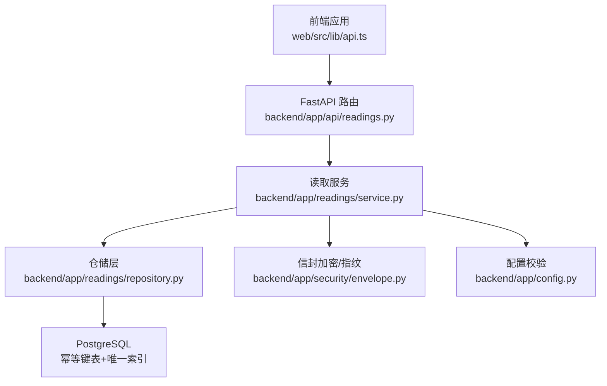
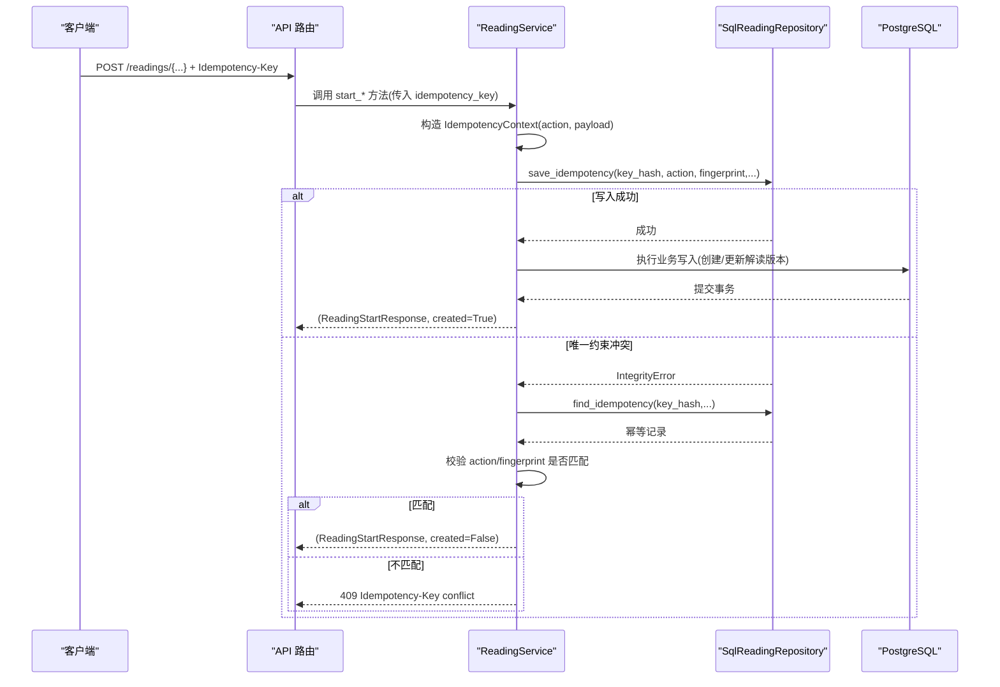
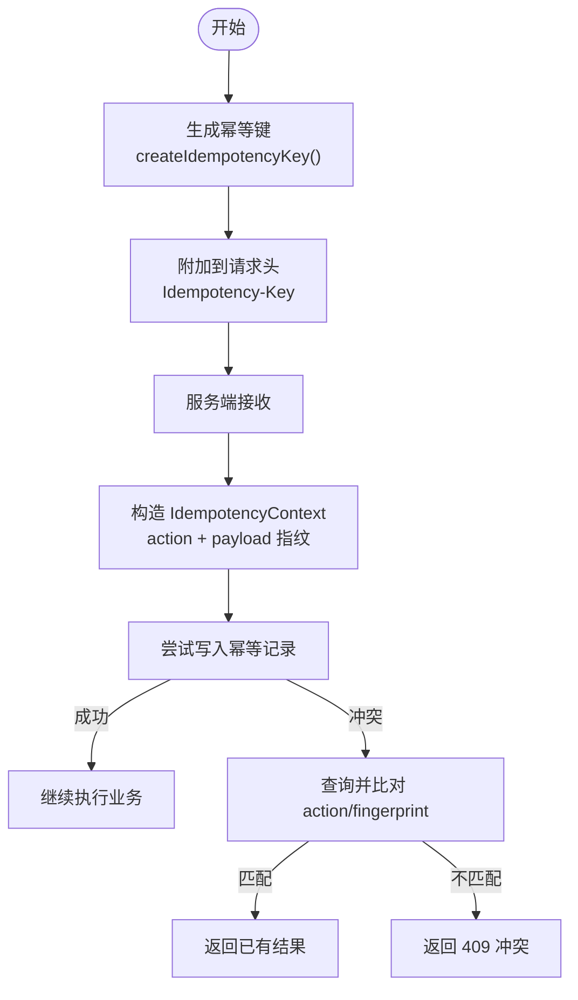
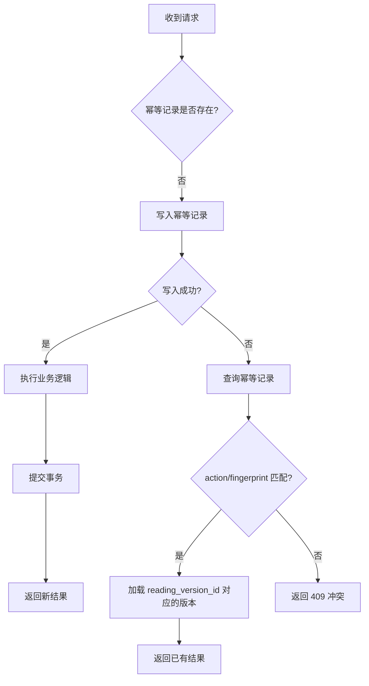
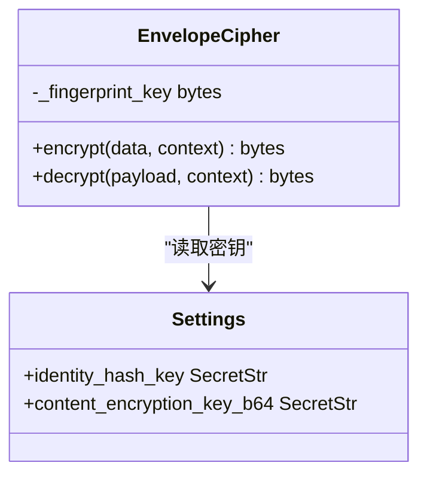
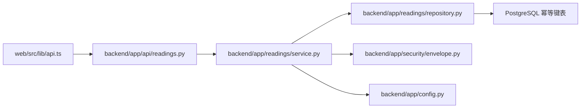
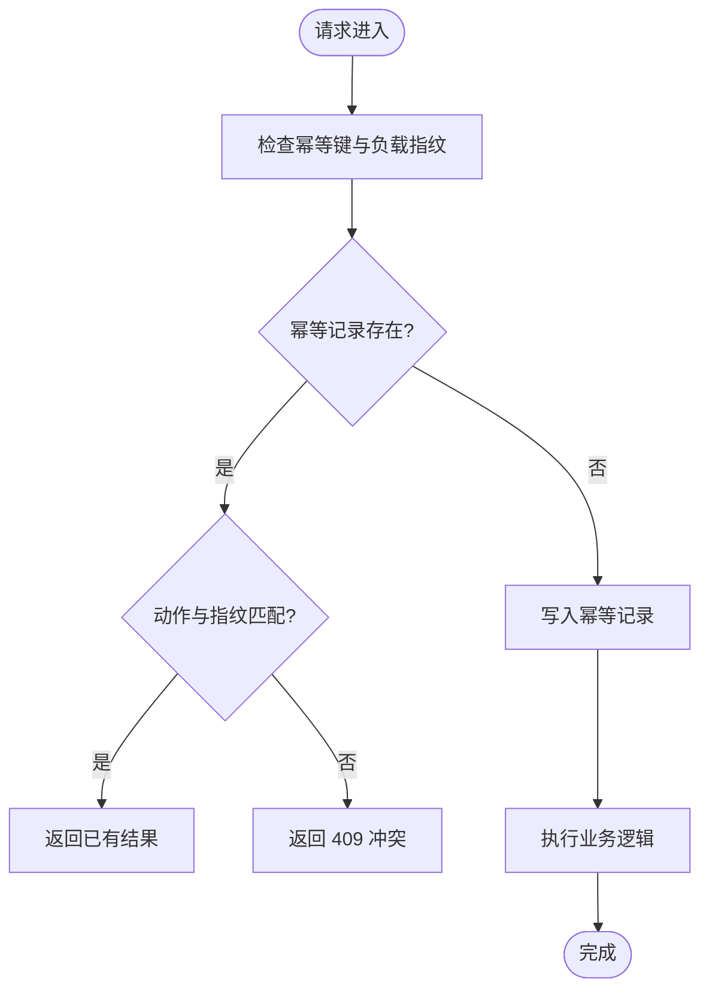

# 幂等性控制机制

<cite>
**本文引用的文件**
- [backend/app/readings/service.py](file://backend/app/readings/service.py)
- [backend/app/readings/repository.py](file://backend/app/readings/repository.py)
- [backend/app/api/readings.py](file://backend/app/api/readings.py)
- [web/src/lib/api.ts](file://web/src/lib/api.ts)
- [web/src/lib/idempotency.ts](file://web/src/lib/idempotency.ts)
- [backend/alembic/versions/0007_reading_api_idempotency_and_verification.py](file://backend/alembic/versions/0007_reading_api_idempotency_and_verification.py)
- [backend/app/security/envelope.py](file://backend/app/security/envelope.py)
- [backend/app/config.py](file://backend/app/config.py)
- [backend/tests/test_readings_api.py](file://backend/tests/test_readings_api.py)
</cite>

## 目录
1. [简介](#简介)
2. [项目结构](#项目结构)
3. [核心组件](#核心组件)
4. [架构总览](#架构总览)
5. [详细组件分析](#详细组件分析)
6. [依赖关系分析](#依赖关系分析)
7. [性能考虑](#性能考虑)
8. [故障排查指南](#故障排查指南)
9. [结论](#结论)
10. [附录](#附录)

## 简介
本文件系统性阐述命理解读系统的幂等性控制机制，覆盖以下关键主题：
- IdempotencyContext 的设计原理与职责边界
- 幂等键生成、请求去重与状态同步流程
- HMAC 签名在安全上下文中的使用（密钥管理、计算与验证）
- 重复请求处理策略（缓存/数据库记录、状态检查、冲突解决）
- 幂等性保证的实现手段（数据库事务、行级锁、一致性协议）
- 幂等性边界定义（哪些操作支持幂等、为何不支持）
- 流程图与安全注意事项

## 项目结构
幂等性相关能力横跨前端客户端与服务端：
- 前端负责为可幂等的写操作生成并携带幂等键，并在 UI 层对意图进行稳定化，避免重复提交。
- 后端通过 API 层接收幂等键，服务层构造幂等上下文，持久化幂等记录并利用数据库唯一约束实现原子去重；发生冲突时回退到“重放”路径返回已有结果。
- 数据层通过迁移脚本创建幂等键表及唯一索引，确保跨实例一致性与幂等键的不可重用性。

**图表来源**
- [backend/app/api/readings.py:87-237](file://backend/app/api/readings.py#L87-L237)
- [backend/app/readings/service.py:129-200](file://backend/app/readings/service.py#L129-L200)
- [backend/app/readings/repository.py:406-446](file://backend/app/readings/repository.py#L406-L446)
- [backend/app/security/envelope.py:33-94](file://backend/app/security/envelope.py#L33-L94)
- [backend/app/config.py:211-236](file://backend/app/config.py#L211-L236)

**章节来源**
- [backend/app/api/readings.py:87-237](file://backend/app/api/readings.py#L87-L237)
- [backend/app/readings/service.py:129-200](file://backend/app/readings/service.py#L129-L200)
- [backend/app/readings/repository.py:406-446](file://backend/app/readings/repository.py#L406-L446)
- [backend/alembic/versions/0007_reading_api_idempotency_and_verification.py:1-70](file://backend/alembic/versions/0007_reading_api_idempotency_and_verification.py#L1-L70)

## 核心组件
- 幂等上下文 IdempotencyContext：封装幂等键哈希、动作标识与请求指纹，用于判定“同一业务意图”。
- 幂等键生成与携带：前端基于随机 UUID 生成幂等键，并通过 HTTP 头传递给后端。
- 幂等持久化与冲突检测：仓储层写入幂等记录，利用数据库唯一约束实现原子去重；冲突时触发重放逻辑。
- 重放与结果复用：当检测到幂等记录存在且语义匹配时，直接返回已存在的解读版本摘要。
- 安全与完整性：信封加密与 HMAC 指纹保障内容完整性；配置层强制生产环境注入密钥，防止弱密钥或密钥复用。

**章节来源**
- [backend/app/readings/service.py:81-86](file://backend/app/readings/service.py#L81-L86)
- [web/src/lib/api.ts:387-392](file://web/src/lib/api.ts#L387-L392)
- [backend/app/readings/repository.py:406-446](file://backend/app/readings/repository.py#L406-L446)
- [backend/app/readings/service.py:552-595](file://backend/app/readings/service.py#L552-L595)
- [backend/app/security/envelope.py:33-94](file://backend/app/security/envelope.py#L33-L94)
- [backend/app/config.py:211-236](file://backend/app/config.py#L211-L236)

## 架构总览
幂等性贯穿“请求进入—意图识别—去重判断—执行/重放—结果返回”的全链路。

**图表来源**
- [backend/app/api/readings.py:87-237](file://backend/app/api/readings.py#L87-L237)
- [backend/app/readings/service.py:129-200](file://backend/app/readings/service.py#L129-L200)
- [backend/app/readings/repository.py:406-446](file://backend/app/readings/repository.py#L406-L446)
- [backend/app/readings/service.py:552-595](file://backend/app/readings/service.py#L552-L595)

## 详细组件分析

### IdempotencyContext 设计与幂等键生成
- 设计要点
  - key_hash：对幂等键进行哈希，避免明文存储敏感值。
  - action：区分不同业务动作（如 profile_preview、today、near_se七、liuyao_one_question），防止跨动作复用。
  - request_fingerprint：对请求负载进行规范化后计算指纹，确保相同意图才视为幂等。
- 生成与携带
  - 前端 createIdempotencyKey 使用 crypto.randomUUID() 生成高熵 ID，并以固定前缀拼接。
  - 前端 jsonPost 将幂等键放入 Idempotency-Key 请求头。
  - 后端路由从 Header 中读取幂等键，长度限制在 8–128。
- 复杂度与安全性
  - 哈希与指纹计算均为 O(n)（n 为负载大小）。
  - 幂等键空间足够大，碰撞概率极低；key_hash 降低泄露风险。

**图表来源**
- [web/src/lib/api.ts:387-392](file://web/src/lib/api.ts#L387-L392)
- [web/src/lib/api.ts:292-315](file://web/src/lib/api.ts#L292-L315)
- [backend/app/api/readings.py:99-104](file://backend/app/api/readings.py#L99-L104)
- [backend/app/readings/service.py:129-200](file://backend/app/readings/service.py#L129-L200)
- [backend/app/readings/repository.py:406-446](file://backend/app/readings/repository.py#L406-L446)
- [backend/app/readings/service.py:552-595](file://backend/app/readings/service.py#L552-L595)

**章节来源**
- [web/src/lib/api.ts:387-392](file://web/src/lib/api.ts#L387-L392)
- [web/src/lib/api.ts:292-315](file://web/src/lib/api.ts#L292-L315)
- [backend/app/api/readings.py:99-104](file://backend/app/api/readings.py#L99-L104)
- [backend/app/readings/service.py:81-86](file://backend/app/readings/service.py#L81-L86)
- [backend/app/readings/service.py:129-200](file://backend/app/readings/service.py#L129-L200)

### 请求去重与状态同步
- 去重策略
  - 首次请求：尝试写入幂等记录；若成功则执行业务逻辑，并将结果与幂等记录关联。
  - 重复请求：写入失败（唯一约束冲突）→ 查询幂等记录 → 校验 action 与 request_fingerprint → 匹配则返回已有结果；不匹配则返回冲突错误。
- 状态同步
  - 幂等记录包含 reading_version_id，重放路径据此加载对应版本摘要，保证前后端状态一致。
- 并发与事务
  - 幂等写入与业务写入在同一会话内提交；冲突时回滚并重放，避免部分完成导致的脏状态。

**图表来源**
- [backend/app/readings/service.py:429-453](file://backend/app/readings/service.py#L429-L453)
- [backend/app/readings/service.py:552-595](file://backend/app/readings/service.py#L552-L595)
- [backend/app/readings/repository.py:406-446](file://backend/app/readings/repository.py#L406-L446)

**章节来源**
- [backend/app/readings/service.py:429-453](file://backend/app/readings/service.py#L429-L453)
- [backend/app/readings/service.py:552-595](file://backend/app/readings/service.py#L552-L595)
- [backend/app/readings/repository.py:406-446](file://backend/app/readings/repository.py#L406-L446)

### HMAC 签名与密钥管理
- 使用场景
  - 信封加密模块使用 HMAC 计算指纹，并与密文绑定，解密时校验指纹，防止篡改。
  - 其他安全场景（如 CSRF、OTP）亦广泛使用 hmac.compare_digest 进行常量时间比较，避免时序攻击。
- 密钥管理
  - 配置层要求生产环境必须注入 identity_hash_key 与 content_encryption_key，禁止本地默认密钥复用，确保密钥强度与隔离。
- 计算与验证
  - 指纹计算采用 HMAC-SHA256；验证使用恒定时间比较函数，提升安全性。

**图表来源**
- [backend/app/security/envelope.py:33-94](file://backend/app/security/envelope.py#L33-L94)
- [backend/app/config.py:211-236](file://backend/app/config.py#L211-L236)

**章节来源**
- [backend/app/security/envelope.py:33-94](file://backend/app/security/envelope.py#L33-L94)
- [backend/app/config.py:211-236](file://backend/app/config.py#L211-L236)

### 重复请求处理策略
- 请求缓存/持久化
  - 幂等记录作为“轻量缓存”，以 key_hash 为主键维度，结合 owner 范围限定作用域。
- 状态检查
  - 冲突后通过 action 与 request_fingerprint 双重校验，确保幂等键不被跨动作或跨负载复用。
- 冲突解决
  - 匹配则返回已有结果；不匹配则返回 409 冲突，提示客户端重新发起请求并更换幂等键。

**章节来源**
- [backend/app/readings/service.py:552-595](file://backend/app/readings/service.py#L552-L595)
- [backend/app/api/readings.py:67-84](file://backend/app/api/readings.py#L67-L84)

### 幂等性保证的实现
- 数据库事务
  - 幂等写入与业务写入处于同一事务；冲突时回滚并重放，保证原子性。
- 分布式锁/行级锁
  - 通过 PostgreSQL 唯一约束与 SELECT ... FOR UPDATE（在其他资源上）保证并发安全；幂等键写入天然具备互斥性。
- 一致性协议
  - 幂等键与业务结果强绑定；重放路径仅返回已确认的结果，避免二次副作用。

**章节来源**
- [backend/app/readings/service.py:429-453](file://backend/app/readings/service.py#L429-L453)
- [backend/app/readings/service.py:552-595](file://backend/app/readings/service.py#L552-L595)
- [backend/alembic/versions/0007_reading_api_idempotency_and_verification.py:1-70](file://backend/alembic/versions/0007_reading_api_idempotency_and_verification.py#L1-L70)

### 幂等性边界定义
- 支持幂等的操作
  - 预览、今日运势、周运势、六爻起卦、后续追问等写入口，均接受 Idempotency-Key 头。
- 不支持幂等的操作
  - 输入补充、验证反馈等非幂等写操作未暴露 Idempotency-Key 参数，因其语义不适合幂等重放。
- 原因说明
  - 幂等适用于“同一意图多次提交应得到相同结果”的场景；对于需要累积或顺序依赖的操作，不应强行幂等。

**章节来源**
- [backend/app/api/readings.py:87-237](file://backend/app/api/readings.py#L87-L237)
- [backend/app/api/readings.py:281-361](file://backend/app/api/readings.py#L281-L361)
- [backend/app/api/readings.py:364-399](file://backend/app/api/readings.py#L364-L399)

## 依赖关系分析
- 前端依赖
  - web/src/lib/api.ts：幂等键生成与请求头注入。
  - web/src/lib/idempotency.ts：意图稳定化，避免重复提交导致的新键生成。
- 后端依赖
  - backend/app/api/readings.py：路由层解析幂等键，映射服务异常为 HTTP 状态码。
  - backend/app/readings/service.py：幂等上下文构建、重放逻辑、HMAC 指纹参与。
  - backend/app/readings/repository.py：幂等记录的查找与保存。
  - backend/app/security/envelope.py：信封指纹与完整性校验。
  - backend/app/config.py：密钥注入与生产环境校验。
  - backend/alembic/versions/0007_reading_api_idempotency_and_verification.py：幂等键表结构与唯一约束。

**图表来源**
- [web/src/lib/api.ts:292-315](file://web/src/lib/api.ts#L292-L315)
- [backend/app/api/readings.py:87-237](file://backend/app/api/readings.py#L87-L237)
- [backend/app/readings/service.py:129-200](file://backend/app/readings/service.py#L129-L200)
- [backend/app/readings/repository.py:406-446](file://backend/app/readings/repository.py#L406-L446)
- [backend/app/security/envelope.py:33-94](file://backend/app/security/envelope.py#L33-L94)
- [backend/app/config.py:211-236](file://backend/app/config.py#L211-L236)

**章节来源**
- [web/src/lib/api.ts:292-315](file://web/src/lib/api.ts#L292-L315)
- [backend/app/api/readings.py:87-237](file://backend/app/api/readings.py#L87-L237)
- [backend/app/readings/service.py:129-200](file://backend/app/readings/service.py#L129-L200)
- [backend/app/readings/repository.py:406-446](file://backend/app/readings/repository.py#L406-L446)
- [backend/app/security/envelope.py:33-94](file://backend/app/security/envelope.py#L33-L94)
- [backend/app/config.py:211-236](file://backend/app/config.py#L211-L236)

## 性能考虑
- 幂等键写入为单行插入，命中唯一索引，开销低；冲突路径增加一次查询，整体延迟可控。
- 指纹计算与 HMAC 校验为 CPU 密集型但数据量小，影响有限。
- 建议
  - 合理设置幂等记录保留策略（如按时间或容量清理），避免无限增长。
  - 监控幂等冲突率，过高可能意味着客户端重试策略过激或网络抖动严重。

[本节为通用指导，不直接分析具体文件]

## 故障排查指南
- 常见错误与定位
  - 409 Idempotency-Key conflict：幂等键被用于不同动作或负载，需更换幂等键。
  - Reading not found：重放路径无法找到对应版本，检查业务写入是否成功。
  - CSRF 校验失败：前端自动刷新 CSRF 并重试，若持续失败检查会话与会话 Cookie。
- 日志与断点
  - 在服务层捕获 IntegrityError 并记录 key_hash、action、fingerprint 以便复现。
  - 在仓库层记录幂等记录查找与写入结果。
- 测试参考
  - 端到端用例验证相同幂等键返回相同解读版本。

**章节来源**
- [backend/app/api/readings.py:67-84](file://backend/app/api/readings.py#L67-L84)
- [backend/app/readings/service.py:429-453](file://backend/app/readings/service.py#L429-L453)
- [backend/tests/test_readings_api.py:501-520](file://backend/tests/test_readings_api.py#L501-L520)

## 结论
该幂等性控制机制通过“前端幂等键 + 后端幂等上下文 + 数据库唯一约束 + 重放路径”的组合，实现了在高并发与网络不稳定环境下的一致性与可靠性。配合 HMAC 指纹与严格的密钥管理，进一步保障了数据完整性与安全性。建议在运维侧关注幂等记录生命周期与冲突率指标，持续优化客户端重试策略与系统吞吐。

[本节为总结性内容，不直接分析具体文件]

## 附录
- 幂等性流程图（概念）

[此图为概念示意，不直接映射具体源码，故无图表来源]