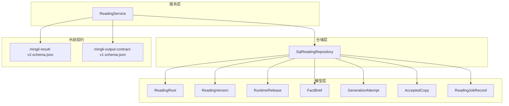
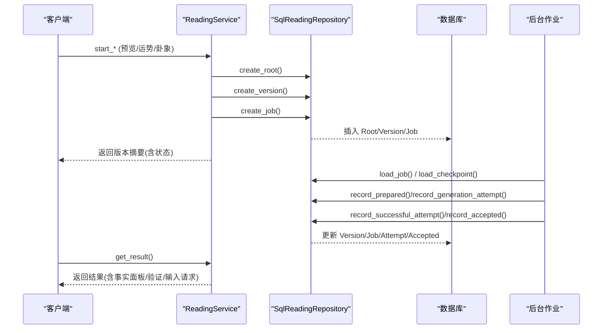
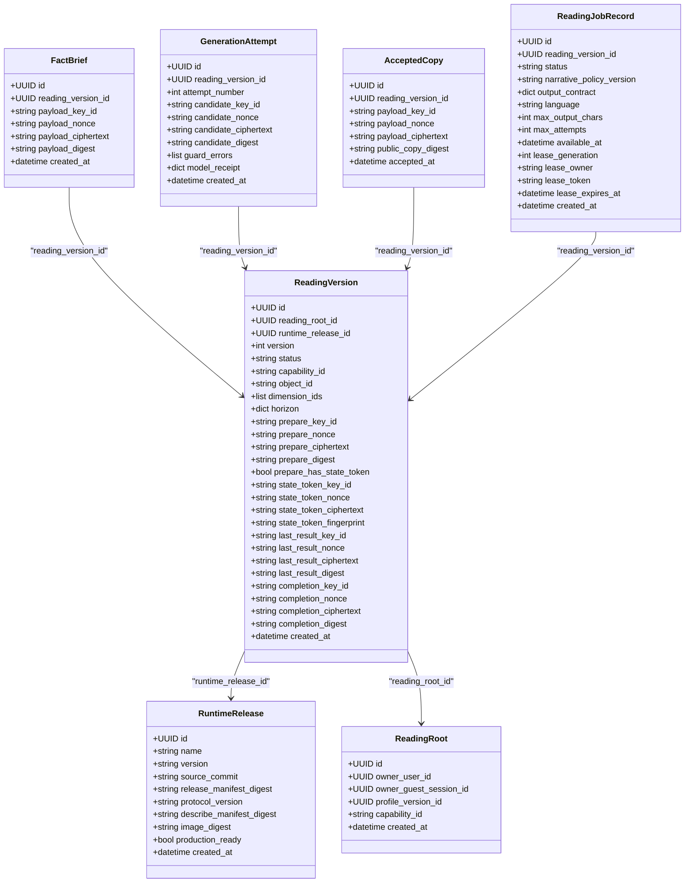
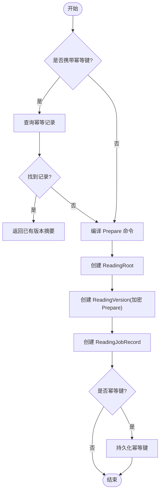
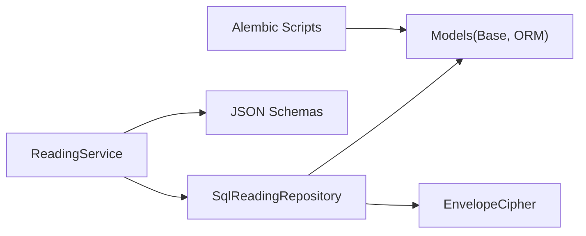
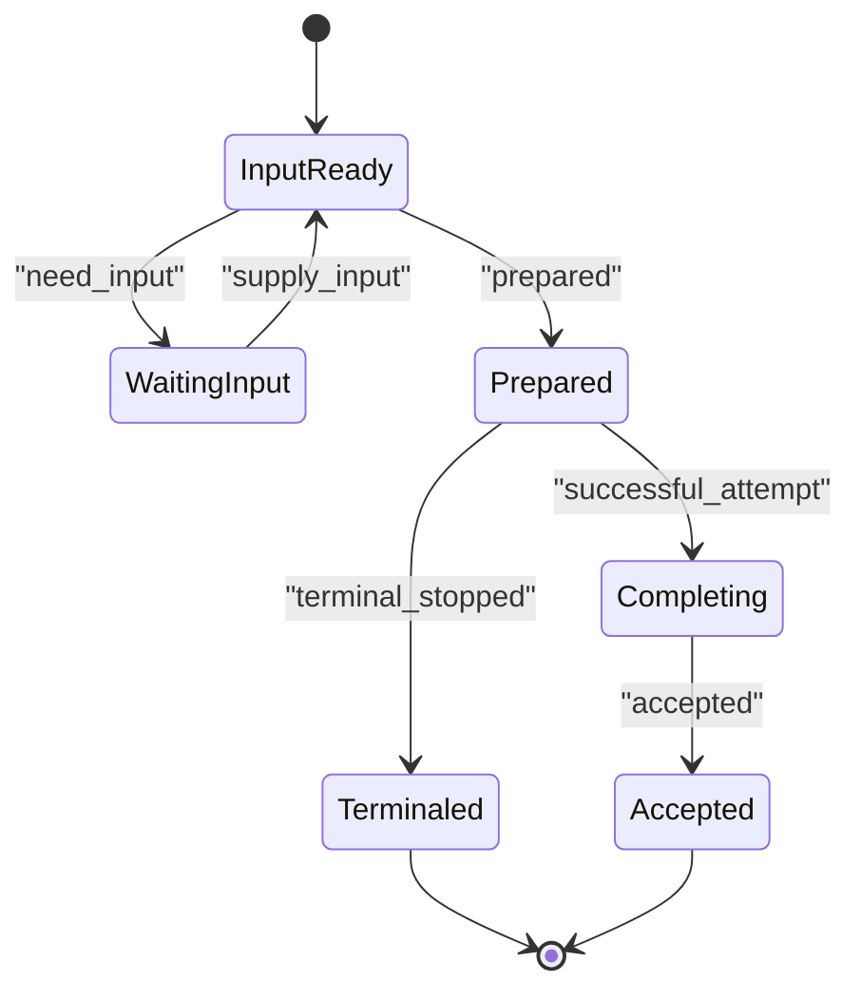

# 版本管理策略

<cite>
**本文引用的文件**
- [backend/app/readings/models.py](file://backend/app/readings/models.py)
- [backend/app/readings/repository.py](file://backend/app/readings/repository.py)
- [backend/app/readings/service.py](file://backend/app/readings/service.py)
- [backend/app/readings/status.py](file://backend/app/readings/status.py)
- [backend/alembic/versions/0002_profiles_and_readings.py](file://backend/alembic/versions/0002_profiles_and_readings.py)
- [backend/tests/test_reading_migrations.py](file://backend/tests/test_reading_migrations.py)
- [contracts/schemas/mingli-result-v2.schema.json](file://contracts/schemas/mingli-result-v2.schema.json)
- [contracts/schemas/mingli-output-contract-v1.schema.json](file://contracts/schemas/mingli-output-contract-v1.schema.json)
- [docs/adr/0004-version-profiles-and-readings-immutably.md](file://docs/adr/0004-version-profiles-and-readings-immutably.md)
</cite>

## 目录
1. [简介](#简介)
2. [项目结构](#项目结构)
3. [核心组件](#核心组件)
4. [架构总览](#架构总览)
5. [详细组件分析](#详细组件分析)
6. [依赖关系分析](#依赖关系分析)
7. [性能与存储优化](#性能与存储优化)
8. [故障排查指南](#故障排查指南)
9. [结论](#结论)
10. [附录：流程图与数据迁移方案](#附录：流程图与数据迁移方案)

## 简介
本文件面向“命理解读”系统的版本管理策略，聚焦解读版本的数据结构设计、版本创建流程、历史追踪机制、归档与清理策略、以及兼容性管理。系统采用不可变版本化设计：每次修改或追问都会产生新的版本记录，确保可复现、可审计、可回溯。

## 项目结构
围绕版本管理的核心代码位于后端模块：
- 模型层定义：读取根、读取版本、运行时发布、事实简报、生成尝试、已接受副本、作业记录等表结构及约束。
- 仓储层实现：版本创建、状态流转、加密载荷持久化、并发控制（行级锁）。
- 服务层编排：入口触发、输入校验、幂等控制、版本与作业创建、结果聚合。
- 迁移脚本：数据库演进与约束保障。
- 契约与模式：接口协议、输出合同、结果模式。

图表来源
- [backend/app/readings/service.py:117-513](file://backend/app/readings/service.py#L117-L513)
- [backend/app/readings/repository.py:51-800](file://backend/app/readings/repository.py#L51-L800)
- [backend/app/readings/models.py:28-378](file://backend/app/readings/models.py#L28-L378)
- [contracts/schemas/mingli-result-v2.schema.json:1-392](file://contracts/schemas/mingli-result-v2.schema.json#L1-L392)
- [contracts/schemas/mingli-output-contract-v1.schema.json:1-45](file://contracts/schemas/mingli-output-contract-v1.schema.json#L1-L45)

章节来源
- [backend/app/readings/models.py:28-378](file://backend/app/readings/models.py#L28-L378)
- [backend/app/readings/repository.py:51-800](file://backend/app/readings/repository.py#L51-L800)
- [backend/app/readings/service.py:117-513](file://backend/app/readings/service.py#L117-L513)

## 核心组件
- 运行时发布 RuntimeRelease：记录运行时镜像/清单的元数据与生产就绪标记，用于绑定版本生成的运行环境。
- 读取根 ReadingRoot：一次命理解读的根实体，绑定所有者（用户或访客会话）、能力标识、关联的档案版本。
- 读取版本 ReadingVersion：不可变版本记录，包含版本号、状态、能力、对象、维度、时间范围、加密的 Prepare/State/Result/Completion 载荷、创建时间。
- 事实简报 FactBrief：保存准备阶段产出的公开事实摘要（加密），用于展示证据链。
- 生成尝试 GenerationAttempt：记录每次模型调用尝试的候选结果、守卫错误、模型回执（加密/可选）。
- 已接受副本 AcceptedCopy：用户最终接受的公开文本副本（加密）与指纹，仅允许首次写入。
- 作业记录 ReadingJobRecord：后台处理任务的状态、策略版本、输出合同、重试次数、租约等。

章节来源
- [backend/app/readings/models.py:28-378](file://backend/app/readings/models.py#L28-L378)
- [backend/app/readings/status.py:1-13](file://backend/app/readings/status.py#L1-L13)

## 架构总览
版本生命周期由服务层驱动，仓储层负责持久化与并发安全，模型层提供不可变约束与完整性检查。

图表来源
- [backend/app/readings/service.py:129-513](file://backend/app/readings/service.py#L129-L513)
- [backend/app/readings/repository.py:120-716](file://backend/app/readings/repository.py#L120-L716)
- [backend/app/readings/models.py:84-378](file://backend/app/readings/models.py#L84-L378)

## 详细组件分析

### 版本数据结构与关系
- 版本标识：每个 ReadingVersion 拥有唯一 id 和递增 version 号；通过 reading_root_id 归属到同一根下形成版本树。
- 时间戳：created_at 记录版本创建时间；作业与接受副本也有各自的时间字段。
- 变更内容：Prepare/State/Result/Completion 等敏感载荷以加密形式存储，并附带 key_id、nonce、ciphertext、digest/fingerprint，保证可验证与防篡改。
- 关联关系：
  - ReadingVersion 关联 RuntimeRelease（运行时环境）、ReadingRoot（根实体）。
  - FactBrief、GenerationAttempt、AcceptedCopy、ReadingVerification 均通过 reading_version_id 关联版本。
  - ReadingJobRecord 指向当前活跃的作业，并与版本状态联动。

图表来源
- [backend/app/readings/models.py:28-378](file://backend/app/readings/models.py#L28-L378)

章节来源
- [backend/app/readings/models.py:28-378](file://backend/app/readings/models.py#L28-L378)

### 版本创建流程（触发条件、快照生成、元数据记录）
- 触发条件：
  - 预览/运势/卦象入口：start_preview/start_fortune/start_liuyao。
  - 补充输入：supply_input（当版本处于 waiting_input 时）。
  - 追问 follow_up：基于已接受副本继续新版本的生成。
- 快照生成：
  - Prepare 命令被加密后持久化为 ReadingVersion 的 prepare_* 字段。
  - State token、last result、completion 等关键中间态均以加密信封形式存储，并记录指纹。
- 元数据记录：
  - 版本号按 root 维度自增。
  - 能力标识、对象、维度、时间范围等意图信息存入版本。
  - 作业记录包含输出合同、语言、最大字符数、重试上限等。

图表来源
- [backend/app/readings/service.py:129-513](file://backend/app/readings/service.py#L129-L513)
- [backend/app/readings/repository.py:120-224](file://backend/app/readings/repository.py#L120-L224)

章节来源
- [backend/app/readings/service.py:129-513](file://backend/app/readings/service.py#L129-L513)
- [backend/app/readings/repository.py:120-224](file://backend/app/readings/repository.py#L120-L224)

### 版本历史追踪（版本树构建、差异计算、回溯查询）
- 版本树构建：
  - 通过 reading_root_id 将多个 ReadingVersion 组织为树；version 字段提供顺序。
  - 列表接口按 created_at 倒序返回最近 N 个版本（默认 50）。
- 差异计算：
  - 由于所有载荷均为加密且不可变，差异比较应在应用层对解密后的 Prepare/Result/Completion 进行比对；仓库层不直接暴露明文。
  - 可通过 fact_brief 中的公开事实与证据进行对比，辅助展示差异。
- 回溯查询：
  - 通过 list_owned_versions 获取历史版本；结合 job 状态与 attempted 记录重建执行轨迹。
  - checkpoint 聚合了 waiting_input、prepared、attempt_count、completion_copy、accepted 等信息，便于快速回溯。

章节来源
- [backend/app/readings/repository.py:239-281](file://backend/app/readings/repository.py#L239-L281)
- [backend/app/readings/repository.py:472-554](file://backend/app/readings/repository.py#L472-L554)
- [backend/app/readings/service.py:305-344](file://backend/app/readings/service.py#L305-L344)

### 归档策略（压缩、存储优化、清理规则）
- 压缩与存储优化：
  - 敏感载荷使用信封加密存储，减少明文体积并提升安全性。
  - 事实简报、候选结果、已接受副本等独立表存储，避免大对象膨胀主版本表。
- 清理规则：
  - 未在当前仓库中定义自动清理策略；建议基于业务策略定期归档旧版本或冷数据。
  - 幂等键与验证记录可按隐私与合规要求保留最小必要数据。

章节来源
- [backend/app/readings/models.py:162-378](file://backend/app/readings/models.py#L162-L378)
- [backend/app/readings/repository.py:591-716](file://backend/app/readings/repository.py#L591-L716)

### 兼容性管理（向后兼容、向前迁移、废弃策略）
- 向后兼容：
  - 输出合同与结果模式通过 JSON Schema 明确约束，前端与服务端共同遵守。
  - 新增字段应默认可空或带默认值，避免破坏旧客户端。
- 向前迁移：
  - 数据库迁移脚本逐步演进表结构与约束，测试覆盖升级/降级路径。
  - 运行时发布记录 protocol_version 与 manifest digest，确保版本与环境一致。
- 废弃策略：
  - 通过 ADR 文档确立不可变版本化原则，废弃旧能力需引入新版本能力标识。
  - 对外 API 版本化（如 v1/v2），旧版本在过渡期保留，逐步下线。

章节来源
- [contracts/schemas/mingli-result-v2.schema.json:1-392](file://contracts/schemas/mingli-result-v2.schema.json#L1-L392)
- [contracts/schemas/mingli-output-contract-v1.schema.json:1-45](file://contracts/schemas/mingli-output-contract-v1.schema.json#L1-L45)
- [backend/alembic/versions/0002_profiles_and_readings.py:28-303](file://backend/alembic/versions/0002_profiles_and_readings.py#L28-L303)
- [docs/adr/0004-version-profiles-and-readings-immutably.md:1-12](file://docs/adr/0004-version-profiles-and-readings-immutably.md#L1-L12)

## 依赖关系分析
- 服务层依赖仓储层进行数据访问与事务控制。
- 仓储层依赖模型层定义表结构与约束，并通过加密器保护敏感数据。
- 迁移脚本确保数据库结构与应用模型一致。
- 契约模式约束前后端交互格式，确保兼容性。

图表来源
- [backend/app/readings/service.py:117-513](file://backend/app/readings/service.py#L117-L513)
- [backend/app/readings/repository.py:51-800](file://backend/app/readings/repository.py#L51-L800)
- [backend/app/readings/models.py:28-378](file://backend/app/readings/models.py#L28-L378)
- [backend/alembic/versions/0002_profiles_and_readings.py:28-303](file://backend/alembic/versions/0002_profiles_and_readings.py#L28-L303)

章节来源
- [backend/app/readings/service.py:117-513](file://backend/app/readings/service.py#L117-L513)
- [backend/app/readings/repository.py:51-800](file://backend/app/readings/repository.py#L51-L800)
- [backend/app/readings/models.py:28-378](file://backend/app/readings/models.py#L28-L378)
- [backend/alembic/versions/0002_profiles_and_readings.py:28-303](file://backend/alembic/versions/0002_profiles_and_readings.py#L28-L303)

## 性能与存储优化
- 并发控制：使用 PostgreSQL 的行级锁（FOR UPDATE）序列化版本分配，避免竞态条件。
- 索引与约束：
  - 作业表针对活跃状态建立唯一索引，防止重复占用。
  - 版本表通过唯一约束保证 root+version 唯一性。
- 加密与分表：
  - 敏感数据分表存储（brief、attempt、accepted），降低主表体积。
  - 加密载荷附带指纹，便于快速校验一致性。
- 历史限制：列表接口限制返回数量（默认 50），避免全量扫描。

章节来源
- [backend/app/readings/repository.py:44-48](file://backend/app/readings/repository.py#L44-L48)
- [backend/app/readings/models.py:247-291](file://backend/app/readings/models.py#L247-L291)
- [backend/app/readings/repository.py:260-281](file://backend/app/readings/repository.py#L260-L281)

## 故障排查指南
- 常见错误类型：
  - 找不到版本或作业：LookupError。
  - 非等待输入状态提交：ReadingNotWaitingInputError。
  - 幂等键冲突：IdempotencyConflictError。
  - 不可变记录被修改：ImmutableRecordError。
- 排查步骤：
  - 检查版本状态是否为预期（waiting_input/input_ready/completing/accepted）。
  - 确认幂等键是否与动作和请求指纹匹配。
  - 查看作业状态与尝试记录，定位失败点。
  - 校验加密载荷指纹与摘要是否一致。

章节来源
- [backend/app/readings/service.py:45-80](file://backend/app/readings/service.py#L45-L80)
- [backend/app/readings/repository.py:174-199](file://backend/app/readings/repository.py#L174-L199)
- [backend/app/readings/repository.py:616-659](file://backend/app/readings/repository.py#L616-L659)

## 结论
本系统通过不可变版本化、加密载荷、严格约束与迁移脚本，实现了高可靠、可审计、可回溯的命理解读版本管理。服务层编排清晰，仓储层并发安全，模型层完整性强，契约模式保障兼容性。建议在后续迭代中完善归档与清理策略，并持续监控性能指标。

## 附录：流程图与数据迁移方案

### 版本状态机

图表来源
- [backend/app/readings/status.py:1-13](file://backend/app/readings/status.py#L1-L13)
- [backend/app/readings/repository.py:556-730](file://backend/app/readings/repository.py#L556-L730)

### 数据迁移方案
- 迁移目标：
  - 创建 subject_profiles、profile_versions、runtime_releases、reading_roots、reading_versions、fact_briefs、generation_attempts、accepted_copies、reading_jobs 等表。
  - 添加唯一约束、外键约束、检查约束，确保数据完整性。
- 回滚策略：
  - 提供 downgrade 函数，按依赖顺序删除索引与表。
- 测试覆盖：
  - 验证表结构、约束、列存在性，以及升级/降级路径。

章节来源
- [backend/alembic/versions/0002_profiles_and_readings.py:28-303](file://backend/alembic/versions/0002_profiles_and_readings.py#L28-L303)
- [backend/tests/test_reading_migrations.py:23-52](file://backend/tests/test_reading_migrations.py#L23-L52)
- [backend/tests/test_reading_migrations.py:299-323](file://backend/tests/test_reading_migrations.py#L299-L323)