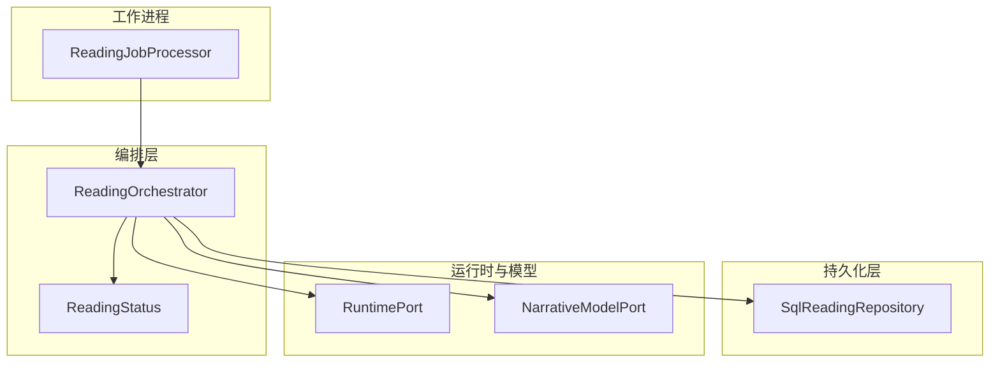
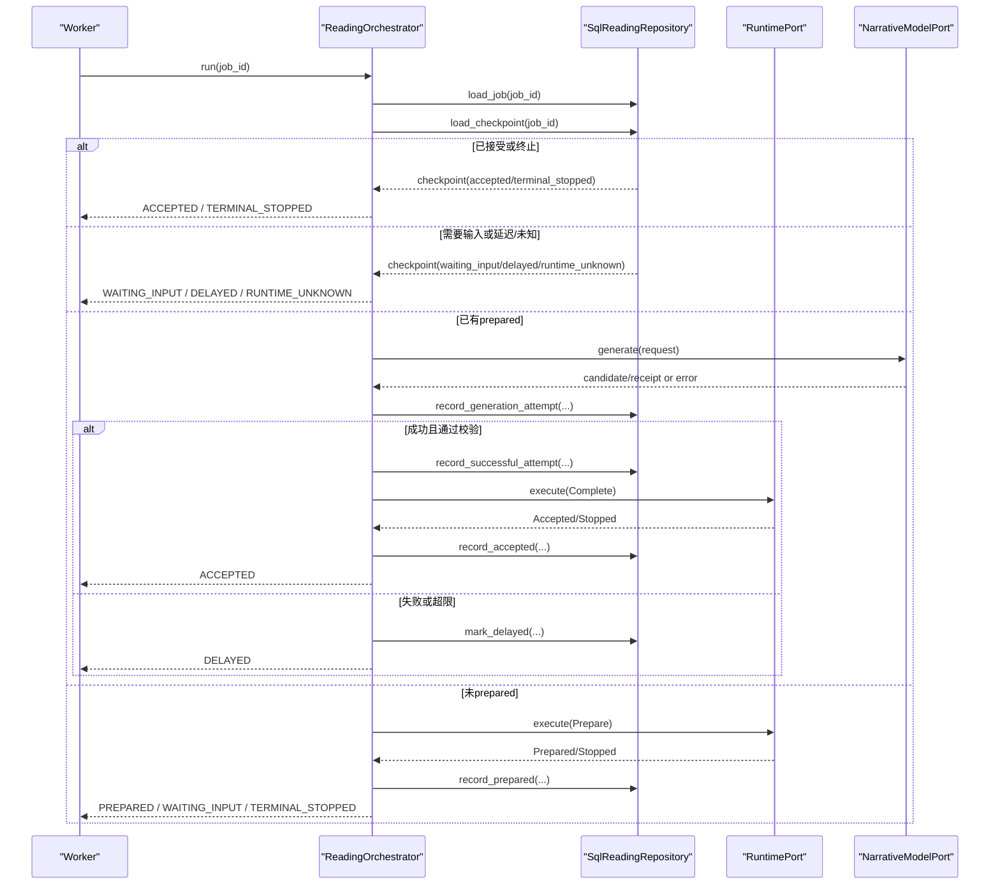
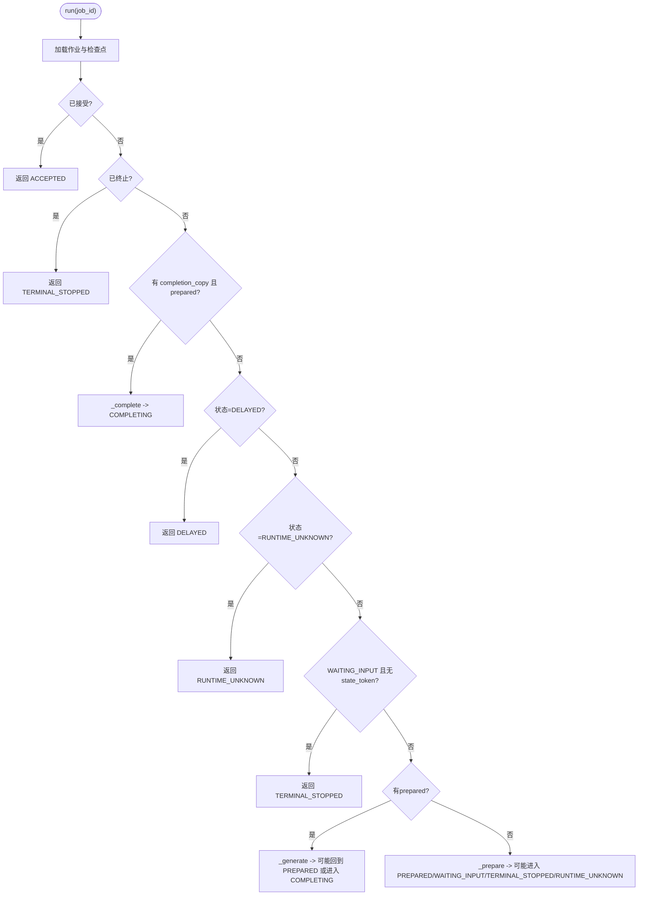
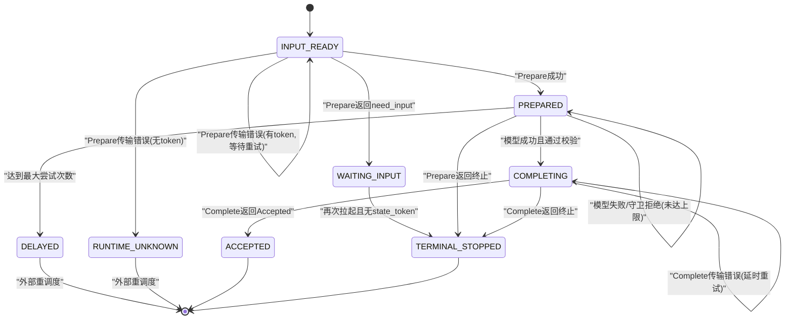
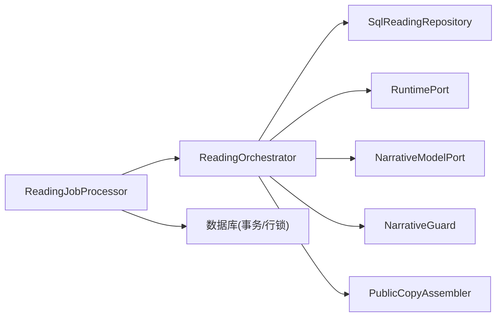

# 解读生命周期管理

<cite>
**本文引用的文件**
- [backend/app/readings/orchestrator.py](file://backend/app/readings/orchestrator.py)
- [backend/app/readings/status.py](file://backend/app/readings/status.py)
- [backend/app/readings/repository.py](file://backend/app/readings/repository.py)
- [backend/worker/readings.py](file://backend/worker/readings.py)
- [backend/app/readings/errors.py](file://backend/app/readings/errors.py)
- [backend/tests/test_reading_orchestrator_complete.py](file://backend/tests/test_reading_orchestrator_complete.py)
</cite>

## 目录
1. [简介](#简介)
2. [项目结构](#项目结构)
3. [核心组件](#核心组件)
4. [架构总览](#架构总览)
5. [详细组件分析](#详细组件分析)
6. [依赖关系分析](#依赖关系分析)
7. [性能考虑](#性能考虑)
8. [故障排查指南](#故障排查指南)
9. [结论](#结论)

## 简介
本文聚焦命理解读（Reading）任务的生命周期管理，围绕 ReadingOrchestrator 的状态机设计、run 方法执行流程、检查点数据结构与持久化策略进行系统化说明。文档覆盖状态转换规则、异常恢复机制、以及错误处理路径，帮助读者在不深入代码细节的情况下理解系统如何保证幂等、可恢复和一致性的运行。

## 项目结构
本主题涉及的后端模块主要位于 backend 目录下：
- 编排器与状态机：backend/app/readings/orchestrator.py
- 状态枚举：backend/app/readings/status.py
- 数据持久化接口与实现：backend/app/readings/repository.py
- Worker 调度与租约管理：backend/worker/readings.py
- 错误类型定义：backend/app/readings/errors.py
- 相关测试用例：backend/tests/test_reading_orchestrator_complete.py

图表来源
- [backend/app/readings/orchestrator.py:178-249](file://backend/app/readings/orchestrator.py#L178-L249)
- [backend/app/readings/status.py:4-12](file://backend/app/readings/status.py#L4-L12)
- [backend/app/readings/repository.py:472-554](file://backend/app/readings/repository.py#L472-L554)
- [backend/worker/readings.py:164-231](file://backend/worker/readings.py#L164-L231)

章节来源
- [backend/app/readings/orchestrator.py:178-249](file://backend/app/readings/orchestrator.py#L178-L249)
- [backend/app/readings/status.py:4-12](file://backend/app/readings/status.py#L4-L12)
- [backend/app/readings/repository.py:472-554](file://backend/app/readings/repository.py#L472-L554)
- [backend/worker/readings.py:164-231](file://backend/worker/readings.py#L164-L231)

## 核心组件
- ReadingOrchestrator：命理解读任务的状态机与业务流程编排，负责协调 Runtime、模型生成、内容组装与结果提交。
- ReadingCheckpoint：表示一次读取任务的“检查点”快照，包含当前状态、中间产物与重试计数等。
- SqlReadingRepository：将检查点与中间结果持久化到数据库，提供加载与记录能力。
- Worker 调度：通过租约机制安全地挑选并执行任务，结合 Orchestrator 的 run 完成幂等推进。

章节来源
- [backend/app/readings/orchestrator.py:43-79](file://backend/app/readings/orchestrator.py#L43-L79)
- [backend/app/readings/orchestrator.py:178-249](file://backend/app/readings/orchestrator.py#L178-L249)
- [backend/app/readings/repository.py:472-554](file://backend/app/readings/repository.py#L472-L554)
- [backend/worker/readings.py:108-231](file://backend/worker/readings.py#L108-L231)

## 架构总览
ReadingOrchestrator 以 run(job_id) 为入口，依据检查点决定下一步动作；仓库负责加载/保存检查点；运行时与模型适配器分别负责准备阶段与文本生成；Worker 负责并发安全地拉取与执行任务。

图表来源
- [backend/app/readings/orchestrator.py:212-249](file://backend/app/readings/orchestrator.py#L212-L249)
- [backend/app/readings/orchestrator.py:250-285](file://backend/app/readings/orchestrator.py#L250-L285)
- [backend/app/readings/orchestrator.py:287-394](file://backend/app/readings/orchestrator.py#L287-L394)
- [backend/app/readings/orchestrator.py:396-435](file://backend/app/readings/orchestrator.py#L396-L435)
- [backend/app/readings/repository.py:584-730](file://backend/app/readings/repository.py#L584-L730)
- [backend/worker/readings.py:175-231](file://backend/worker/readings.py#L175-L231)

## 详细组件分析

### ReadingOrchestrator 状态机与 run 流程
- 状态集合：INPUT_READY、WAITING_INPUT、TERMINAL_STOPPED、PREPARED、COMPLETING、ACCEPTED、DELAYED、RUNTIME_UNKNOWN。
- run 的核心决策顺序：
  - 若已接受：直接返回 ACCEPTED。
  - 若已终止：返回 TERMINAL_STOPPED。
  - 若存在 completion_copy 且有 prepared：进入 _complete 流程。
  - 若处于 DELAYED 或 RUNTIME_UNKNOWN：原样返回。
  - 若 WAITING_INPUT 且无 state_token：视为终止，返回对应停止原因。
  - 若已有 prepared：进入 _generate 流程。
  - 否则进入 _prepare 流程。

图表来源
- [backend/app/readings/orchestrator.py:212-249](file://backend/app/readings/orchestrator.py#L212-L249)
- [backend/app/readings/orchestrator.py:250-285](file://backend/app/readings/orchestrator.py#L250-L285)
- [backend/app/readings/orchestrator.py:287-394](file://backend/app/readings/orchestrator.py#L287-L394)
- [backend/app/readings/orchestrator.py:396-435](file://backend/app/readings/orchestrator.py#L396-L435)

章节来源
- [backend/app/readings/orchestrator.py:212-249](file://backend/app/readings/orchestrator.py#L212-L249)
- [backend/app/readings/orchestrator.py:250-285](file://backend/app/readings/orchestrator.py#L250-L285)
- [backend/app/readings/orchestrator.py:287-394](file://backend/app/readings/orchestrator.py#L287-L394)
- [backend/app/readings/orchestrator.py:396-435](file://backend/app/readings/orchestrator.py#L396-L435)

### 状态转换规则
- INPUT_READY：初始或重试窗口到达后重新入队；当 Prepare 调用成功返回 Prepared 时转入 PREPARED；若 Prepare 传输错误且带 state_token，则回退到 INPUT_READY 并设置重试时间；若无 state_token 且传输错误，标记为 RUNTIME_UNKNOWN。
- WAITING_INPUT：Prepare 返回 need_input 时进入；若后续再次拉起且无 state_token，则转为终止。
- TERMINAL_STOPPED：Prepare 或 Complete 返回非 need_input 的停止原因时进入。
- PREPARED：Prepare 成功后进入；模型生成失败或达到最大尝试次数时可能回到 PREPARED 或进入 DELAYED。
- COMPLETING：模型生成并通过校验后，进入 Complete 流程；若 Complete 传输错误，保持 COMPLETING 并延时重试。
- ACCEPTED：Complete 返回 Accepted 且校验通过后进入。
- DELAYED：达到最大尝试次数或生成耗尽时进入。
- RUNTIME_UNKNOWN：Prepare 阶段无法确定运行时结果且无 state_token 时进入；过期租约也会回退到此状态。

图表来源
- [backend/app/readings/orchestrator.py:212-249](file://backend/app/readings/orchestrator.py#L212-L249)
- [backend/app/readings/orchestrator.py:250-285](file://backend/app/readings/orchestrator.py#L250-L285)
- [backend/app/readings/orchestrator.py:287-394](file://backend/app/readings/orchestrator.py#L287-L394)
- [backend/app/readings/orchestrator.py:396-435](file://backend/app/readings/orchestrator.py#L396-L435)
- [backend/worker/readings.py:121-161](file://backend/worker/readings.py#L121-L161)

### run 方法的执行流程：检查点、恢复与异常
- 检查点加载：run 首先加载作业与检查点，根据检查点字段快速分支，避免重复计算。
- 状态恢复：
  - 已接受：直接返回最终结果。
  - 已完成但尚未提交：携带 completion_copy 与 prepared 进入 _complete，确保幂等提交。
  - 等待输入：若缺少 state_token，视为不可恢复，转为终止。
  - 延迟/未知：直接返回，交由上层调度。
- 异常处理：
  - Prepare 传输错误：有 token 则回退到 INPUT_READY 并设置重试时间；无 token 则标记 RUNTIME_UNKNOWN。
  - 模型生成异常：记录尝试与审计回执，若达到上限则进入 DELAYED；取消场景支持提交后取消信号。
  - Complete 传输错误：保持 COMPLETING 并延时重试，确保幂等提交。
  - 不变量破坏：如 Accepted 的 token/copy 不一致，抛出不变量错误。

章节来源
- [backend/app/readings/orchestrator.py:212-249](file://backend/app/readings/orchestrator.py#L212-L249)
- [backend/app/readings/orchestrator.py:250-285](file://backend/app/readings/orchestrator.py#L250-L285)
- [backend/app/readings/orchestrator.py:287-394](file://backend/app/readings/orchestrator.py#L287-L394)
- [backend/app/readings/orchestrator.py:396-435](file://backend/app/readings/orchestrator.py#L396-L435)
- [backend/app/readings/errors.py:4-30](file://backend/app/readings/errors.py#L4-L30)

### ReadingCheckpoint 数据结构与作用
- status：当前状态，用于快速定位执行位置。
- waiting_input：上一次需要输入的停止信息，用于判断是否需要用户交互。
- terminal_stopped：终止性停止信息，用于直接返回终止结果。
- prepared：已准备的上下文（含 state_token 与 brief），用于继续生成或完成。
- attempt_count：已完成的模型生成尝试次数，用于控制重试与延迟。
- completion_copy：已持久化的完成副本，用于幂等提交。
- accepted：最终接受的副本，用于快速返回最终结果。

章节来源
- [backend/app/readings/orchestrator.py:60-69](file://backend/app/readings/orchestrator.py#L60-L69)
- [backend/app/readings/repository.py:472-554](file://backend/app/readings/repository.py#L472-L554)

### 状态持久化策略与一致性保证
- 保存时机：
  - 准备成功：record_prepared，写入 brief 与 state_token，状态置为 PREPARED。
  - 生成尝试：record_generation_attempt，记录候选、守卫错误与模型回执。
  - 生成成功：record_successful_attempt，写入 completion_copy，状态置为 COMPLETING。
  - 完成意图：record_completion_intent，在需要时可提前持久化完成副本。
  - 接受结果：record_accepted，写入 accepted 并置为 ACCEPTED。
  - 延迟/未知：mark_delayed/mark_runtime_unknown，更新状态以便外部调度。
- 一致性保证：
  - 使用数据库事务与行级锁（with_for_update）保护版本分配与关键写路径。
  - 敏感数据加密存储（brief、last_result、completion、accepted-copy、state-token）。
  - 幂等约束：GenerationAttempt 唯一性、AcceptedCopy 首次写入获胜、Completed 的 token/copy 校验。
  - 租约与 fencing：Worker 通过 lease_owner/lease_token/lease_generation 防止并发冲突。

章节来源
- [backend/app/readings/repository.py:584-730](file://backend/app/readings/repository.py#L584-L730)
- [backend/app/readings/repository.py:756-800](file://backend/app/readings/repository.py#L756-L800)
- [backend/worker/readings.py:121-161](file://backend/worker/readings.py#L121-L161)
- [backend/worker/readings.py:175-231](file://backend/worker/readings.py#L175-L231)

### 错误恢复流程
- Prepare 传输错误：
  - 有 state_token：返回 INPUT_READY 并设置 retry_not_before，由 Worker 在可用时间后重试。
  - 无 state_token：标记 RUNTIME_UNKNOWN，交由外部调度。
- 模型生成失败/取消：
  - 记录尝试与回执；若达到最大尝试次数，进入 DELAYED；取消场景支持 cancel_after_commit 信号。
- Complete 传输错误：
  - 保持 COMPLETING 并延时重试，确保幂等提交。
- 不变量破坏：
  - 如 Accepted 的 token/copy 与预期不一致，抛出不变量错误，阻止错误状态推进。

章节来源
- [backend/app/readings/orchestrator.py:250-285](file://backend/app/readings/orchestrator.py#L250-L285)
- [backend/app/readings/orchestrator.py:287-394](file://backend/app/readings/orchestrator.py#L287-L394)
- [backend/app/readings/orchestrator.py:396-435](file://backend/app/readings/orchestrator.py#L396-L435)
- [backend/app/readings/errors.py:4-30](file://backend/app/readings/errors.py#L4-L30)

## 依赖关系分析
- ReadingOrchestrator 依赖：
  - Repository：加载/保存检查点与中间结果。
  - RuntimePort：执行 Prepare/Complete。
  - NarrativeModelPort：生成候选文本。
  - Guard/Assembler：校验与组装公开副本。
- Worker 依赖：
  - 租约机制：确保同一时刻只有一个 Worker 处理一个 Job。
  - 状态映射：将 ReadingStatus 映射为 Job 表中的字符串状态。

图表来源
- [backend/app/readings/orchestrator.py:178-189](file://backend/app/readings/orchestrator.py#L178-L189)
- [backend/app/readings/repository.py:472-554](file://backend/app/readings/repository.py#L472-L554)
- [backend/worker/readings.py:164-231](file://backend/worker/readings.py#L164-L231)

章节来源
- [backend/app/readings/orchestrator.py:178-189](file://backend/app/readings/orchestrator.py#L178-L189)
- [backend/app/readings/repository.py:472-554](file://backend/app/readings/repository.py#L472-L554)
- [backend/worker/readings.py:164-231](file://backend/worker/readings.py#L164-L231)

## 性能考虑
- 重试退避：Prepare 与 Complete 均配置了退避时间，减少瞬时抖动对下游的影响。
- 尝试次数限制：通过 attempt_count 控制模型调用次数，避免无限重试。
- 数据库锁：使用 with_for_update 序列化关键写路径，避免竞态条件。
- 加密开销：敏感字段加密存储带来一定开销，但保障数据安全。

[本节为通用指导，不直接分析具体文件]

## 故障排查指南
- 常见问题定位：
  - 任务卡在 WAITING_INPUT：检查是否存在 state_token；若无，可能被视作终止。
  - 任务进入 RUNTIME_UNKNOWN：Prepare 阶段传输错误且无 state_token，需外部调度重试。
  - 任务进入 DELAYED：达到最大尝试次数或生成耗尽，需人工介入或调整策略。
  - 任务卡在 COMPLETING：Complete 传输错误，会延时重试；检查网络与下游可用性。
- 日志与告警：
  - 关注 guard_rejection、model_cost、delayed、runtime_unknown 等告警事件，辅助定位问题。
- 测试参考：
  - 通过测试用例验证 receipt 持久化、取消场景、并发隔离等行为。

章节来源
- [backend/app/readings/orchestrator.py:212-249](file://backend/app/readings/orchestrator.py#L212-L249)
- [backend/app/readings/orchestrator.py:250-285](file://backend/app/readings/orchestrator.py#L250-L285)
- [backend/app/readings/orchestrator.py:287-394](file://backend/app/readings/orchestrator.py#L287-L394)
- [backend/app/readings/orchestrator.py:396-435](file://backend/app/readings/orchestrator.py#L396-L435)
- [backend/tests/test_reading_orchestrator_complete.py:70-173](file://backend/tests/test_reading_orchestrator_complete.py#L70-L173)

## 结论
ReadingOrchestrator 通过明确的状态机与检查点机制，实现了命理解读任务的幂等、可恢复与一致性运行。配合 Worker 的租约管理与数据库的事务/锁机制，系统在异常与中断场景下仍能保持稳定推进。建议在生产环境中关注重试退避、尝试次数限制与告警事件，以确保整体可靠性与可观测性。