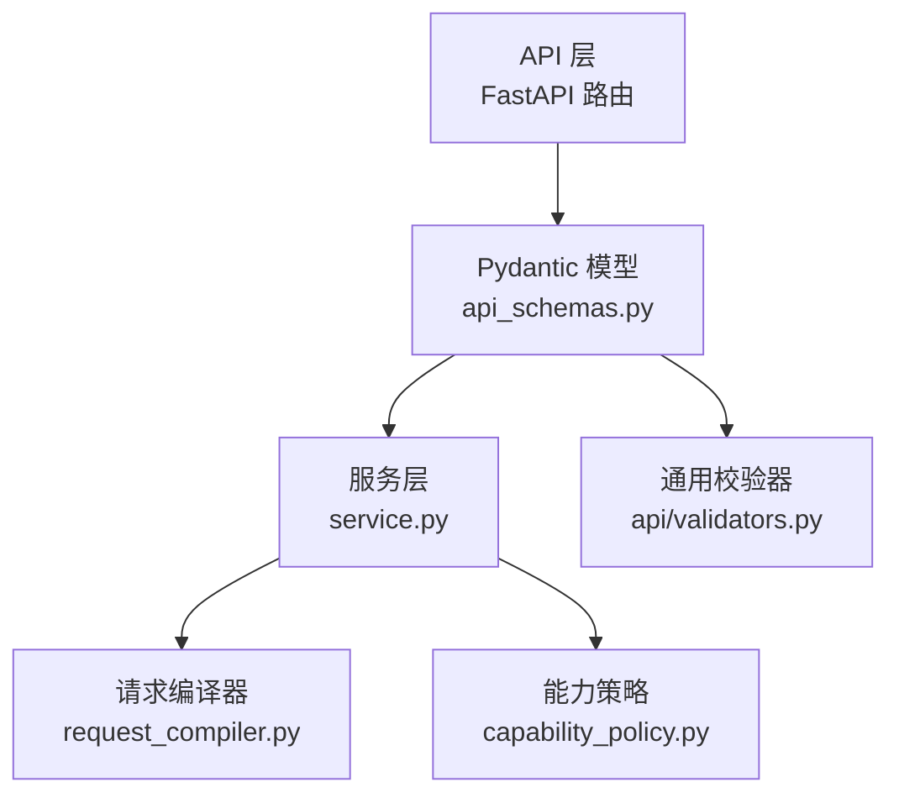
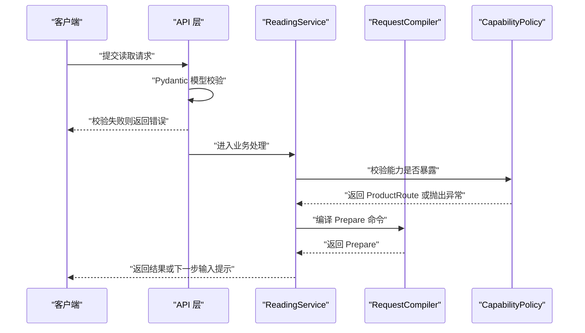
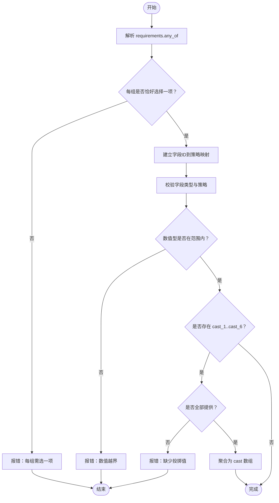
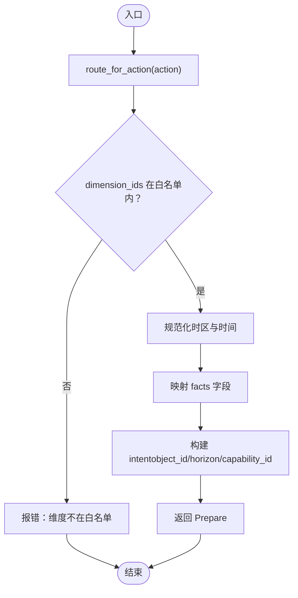
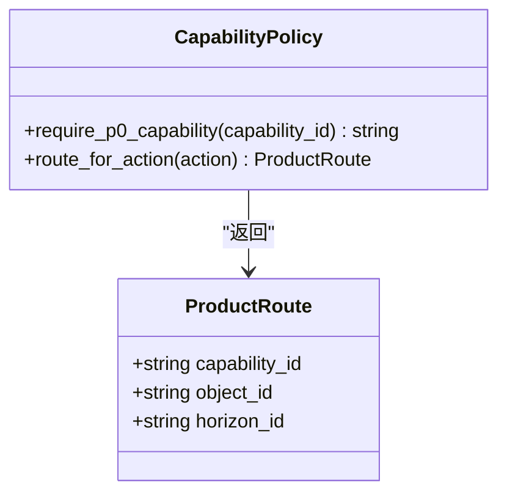
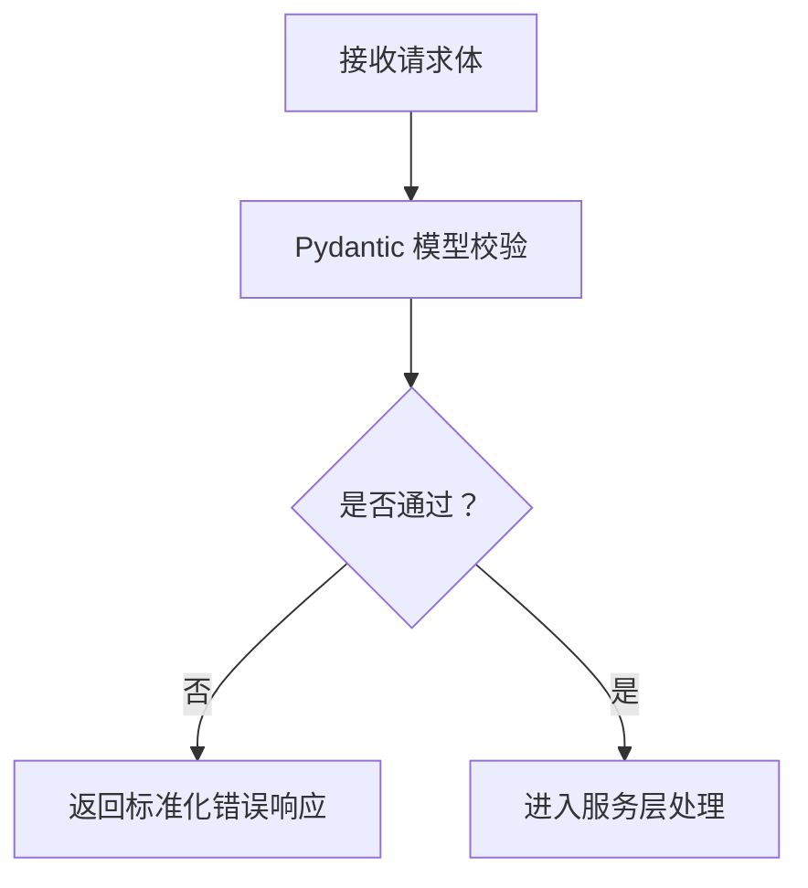
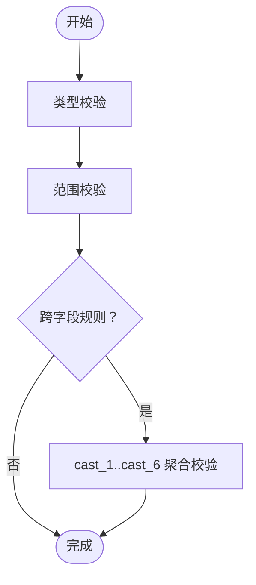
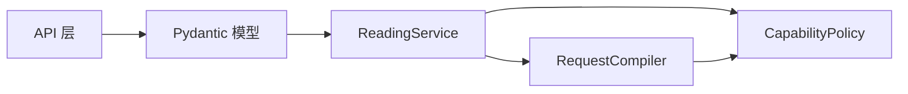

# 输入验证系统

<cite>
**本文引用的文件**
- [backend/app/readings/request_compiler.py](file://backend/app/readings/request_compiler.py)
- [backend/app/readings/capability_policy.py](file://backend/app/readings/capability_policy.py)
- [backend/app/readings/api_schemas.py](file://backend/app/readings/api_schemas.py)
- [backend/app/readings/service.py](file://backend/app/readings/service.py)
- [backend/app/api/validators.py](file://backend/app/api/validators.py)
</cite>

## 目录
1. [简介](#简介)
2. [项目结构](#项目结构)
3. [核心组件](#核心组件)
4. [架构总览](#架构总览)
5. [详细组件分析](#详细组件分析)
6. [依赖关系分析](#依赖关系分析)
7. [性能考虑](#性能考虑)
8. [故障排查指南](#故障排查指南)
9. [结论](#结论)
10. [附录](#附录)

## 简介
本文件面向命理解读系统的“输入验证”能力，围绕以下目标展开：
- InputFieldPolicy 的配置机制：字段类型定义、必填性检查与格式校验规则。
- RequestCompiler 的编译过程：请求数据转换、字段映射与业务规则应用。
- CapabilityPolicy 的能力控制：用户权限检查、功能开关与资源限制。
- API Schema 验证：Pydantic 模型定义、数据校验与错误响应格式化。
- 自定义验证器：业务规则验证、跨字段校验与异步验证支持。
- 提供验证流程图与常见验证错误的处理方法。

## 项目结构
与输入验证相关的后端代码集中在 backend/app/readings 与 backend/app/api 中：
- api_schemas.py：定义 Pydantic 请求/响应模型，负责边界入参的结构化校验。
- service.py：实现运行时输入值校验（InputFieldPolicy）与业务映射。
- request_compiler.py：将高层产品动作编译为内部 Prepare 命令，包含维度白名单与时区规范化等规则。
- capability_policy.py：维护产品能力路由与 P0 暴露策略，用于能力级访问控制。
- api/validators.py：通用校验工具（如 IANA 时区校验），被 Pydantic 模型复用。

图表来源
- [backend/app/readings/api_schemas.py:17-55](file://backend/app/readings/api_schemas.py#L17-L55)
- [backend/app/readings/service.py:88-114](file://backend/app/readings/service.py#L88-L114)
- [backend/app/readings/request_compiler.py:96-216](file://backend/app/readings/request_compiler.py#L96-L216)
- [backend/app/readings/capability_policy.py:31-68](file://backend/app/readings/capability_policy.py#L31-L68)
- [backend/app/api/validators.py](file://backend/app/api/validators.py)

章节来源
- [backend/app/readings/api_schemas.py:1-130](file://backend/app/readings/api_schemas.py#L1-L130)
- [backend/app/readings/service.py:1-200](file://backend/app/readings/service.py#L1-L200)
- [backend/app/readings/request_compiler.py:1-216](file://backend/app/readings/request_compiler.py#L1-L216)
- [backend/app/readings/capability_policy.py:1-68](file://backend/app/readings/capability_policy.py#L1-L68)

## 核心组件
- InputFieldPolicy：定义运行时输入字段的策略，包括目标字段名、允许的类型集合、数值上下界等。
- _INPUT_FIELD_POLICIES：集中声明所有受产品批准的输入字段及其策略，例如六爻投掷值、子时口径、测试输入等。
- ReadingService._validate_input_values：按 runtime 返回的 requirements 进行“每组单选”约束、未知字段拒绝、类型与范围校验，并将 cast_1..cast_6 聚合为 cast 数组。
- RequestCompiler：将产品动作（如 profile_preview/today/near_seven/liuyao_one_question）编译为 Prepare 命令，包含维度白名单、时区规范化、事实字段映射。
- CapabilityPolicy：通过 ProductRoute 与 require_p0_capability 控制哪些能力在 P0 版本暴露，并校验 action 到 capability 的一致性。
- API Schemas：使用 Pydantic 对请求体做结构化校验，如长度、枚举、必填、时区合法性等。

章节来源
- [backend/app/readings/service.py:88-114](file://backend/app/readings/service.py#L88-L114)
- [backend/app/readings/service.py:677-773](file://backend/app/readings/service.py#L677-L773)
- [backend/app/readings/request_compiler.py:96-216](file://backend/app/readings/request_compiler.py#L96-L216)
- [backend/app/readings/capability_policy.py:31-68](file://backend/app/readings/capability_policy.py#L31-L68)
- [backend/app/readings/api_schemas.py:17-55](file://backend/app/readings/api_schemas.py#L17-L55)

## 架构总览
输入验证贯穿“API 入参 -> 运行时输入 -> 产品动作编译 -> 能力策略”四层：
- API 层：Pydantic 模型完成基础结构与格式校验。
- 服务层：根据运行时 requirements 执行 InputFieldPolicy 校验与字段映射。
- 编译器：将高层意图转换为 Prepare 命令，确保维度与时区等业务规则。
- 能力策略：锁定 action 到 capability 的路由，防止未暴露能力被调用。

图表来源
- [backend/app/readings/api_schemas.py:17-55](file://backend/app/readings/api_schemas.py#L17-L55)
- [backend/app/readings/capability_policy.py:53-68](file://backend/app/readings/capability_policy.py#L53-L68)
- [backend/app/readings/request_compiler.py:96-216](file://backend/app/readings/request_compiler.py#L96-L216)
- [backend/app/readings/service.py:129-200](file://backend/app/readings/service.py#L129-L200)

## 详细组件分析

### InputFieldPolicy 配置机制
- 字段策略对象：
  - target：目标字段名（如 cast、zi_hour_policy）。
  - type_ids：允许的输入类型集合（integer、text、textarea、choice）。
  - minimum/maximum：数值型输入的上下界。
- 预置策略：
  - cast_1..cast_6：类型为 integer，范围 6..9，目标聚合为 cast。
  - zi_policy：类型为 choice，目标 zi_hour_policy。
  - fixture_input：类型为 text/textarea，目标 fixture_input。
- 运行时校验流程：
  - 解析 requirements.any_of，要求每组恰好选择一个字段。
  - 拒绝未知字段与未批准字段。
  - 依据 field.type_id 与 policy.type_ids 进行类型匹配。
  - 对数值型字段执行最小/最大范围校验。
  - 若存在 cast_1..cast_6，必须全部提供并聚合成有序数组。

图表来源
- [backend/app/readings/service.py:677-773](file://backend/app/readings/service.py#L677-L773)
- [backend/app/readings/service.py:88-114](file://backend/app/readings/service.py#L88-L114)

章节来源
- [backend/app/readings/service.py:88-114](file://backend/app/readings/service.py#L88-L114)
- [backend/app/readings/service.py:677-773](file://backend/app/readings/service.py#L677-L773)

### RequestCompiler 编译过程
- 作用：将产品动作（profile_preview、today、near_seven、liuyao_one_question）编译为 Prepare 命令，填充 intent、facts 等。
- 关键规则：
  - 维度白名单：bazi/fengshui/fortune/liuren/liuyao/luming-nayin/meihua/physiognomy/qimen/selection/taiyi/xingming/ziwei 对应不同维度集合；仅允许白名单内的 dimension_ids。
  - 时区规范化：事件时间必须带时区信息，并按确认的时区转换。
  - 事实字段映射：根据不同动作组装 facts，如四柱/八字、参考时间、卦象投掷值等。
  - 能力一致性：action 对应的 capability_id 必须与预期一致，否则抛出编译错误。

图表来源
- [backend/app/readings/request_compiler.py:35-93](file://backend/app/readings/request_compiler.py#L35-L93)
- [backend/app/readings/request_compiler.py:96-216](file://backend/app/readings/request_compiler.py#L96-L216)

章节来源
- [backend/app/readings/request_compiler.py:35-93](file://backend/app/readings/request_compiler.py#L35-L93)
- [backend/app/readings/request_compiler.py:96-216](file://backend/app/readings/request_compiler.py#L96-L216)

### CapabilityPolicy 能力控制
- 能力列表：V51_RELEASE_CAPABILITY_IDS 列出可发布的能力；P0_EXPOSED_CAPABILITY_IDS 限定当前对外暴露的能力。
- 产品路由：ProductRoute 将 action 映射到 capability_id、object_id、horizon_id。
- 访问控制：
  - route_for_action：校验 action 是否受支持，并检查其 capability_id 是否在 P0 暴露列表中。
  - require_p0_capability：强制能力暴露策略，未暴露则抛出异常。
- 影响范围：阻止未授权能力被调用，保障产品版本边界与资源限制。

图表来源
- [backend/app/readings/capability_policy.py:31-68](file://backend/app/readings/capability_policy.py#L31-L68)

章节来源
- [backend/app/readings/capability_policy.py:1-68](file://backend/app/readings/capability_policy.py#L1-L68)

### API Schema 验证
- Pydantic 模型：
  - PreviewStartRequest/FortuneStartRequest/LiuyaoStartRequest：定义请求体字段、长度、可选/必填、枚举等。
  - LiuyaoStartRequest.timezone：通过 validate_iana_timezone 校验 IANA 时区字符串。
  - Horizon/ReadingVersionSummary/ReadingResultResponse：定义响应体结构。
- 校验要点：
  - extra="forbid"：禁止额外字段，增强安全性。
  - Field(min_length/max_length/ge/le)：约束字符串长度与数值范围。
  - Literal：限制枚举取值。
- 错误响应：
  - FastAPI 会将 Pydantic 校验失败转换为标准 JSON 错误响应（含字段、消息等），便于前端展示。

图表来源
- [backend/app/readings/api_schemas.py:17-55](file://backend/app/readings/api_schemas.py#L17-L55)
- [backend/app/readings/api_schemas.py:76-130](file://backend/app/readings/api_schemas.py#L76-L130)

章节来源
- [backend/app/readings/api_schemas.py:1-130](file://backend/app/readings/api_schemas.py#L1-L130)
- [backend/app/api/validators.py](file://backend/app/api/validators.py)

### 自定义验证器
- IANA 时区校验：validate_iana_timezone 被 Pydantic field_validator 调用，确保 timezone 字段合法。
- 运行时输入校验：
  - 类型校验：integer/text/textarea/choice 分别对应严格类型检查。
  - 范围校验：数值型字段依据 policy.minimum/policy.maximum 进行上下界检查。
  - 跨字段校验：cast_1..cast_6 必须全部提供且顺序正确，最终聚合为 cast 数组。
  - 业务规则：requirements.any_of 每组必须恰好选择一项，未知字段与未批准字段直接拒绝。
- 异步验证支持：
  - 当前实现以同步校验为主；如需异步校验（如远程白名单查询），可在 Pydantic v2 中使用 model_validator 或自定义 validator 包装异步逻辑，并在服务层 await 执行。

图表来源
- [backend/app/readings/service.py:677-773](file://backend/app/readings/service.py#L677-L773)
- [backend/app/readings/api_schemas.py:51-55](file://backend/app/readings/api_schemas.py#L51-L55)

章节来源
- [backend/app/readings/service.py:677-773](file://backend/app/readings/service.py#L677-L773)
- [backend/app/readings/api_schemas.py:51-55](file://backend/app/readings/api_schemas.py#L51-L55)

## 依赖关系分析
- API 层依赖 Pydantic 模型进行入参校验。
- 服务层依赖运行时 requirements 与 InputFieldPolicy 进行值校验与映射。
- 编译器依赖能力策略与维度白名单，确保 Prepare 命令合法。
- 能力策略依赖 P0 暴露列表，限制可用能力集。

图表来源
- [backend/app/readings/api_schemas.py:17-55](file://backend/app/readings/api_schemas.py#L17-L55)
- [backend/app/readings/service.py:129-200](file://backend/app/readings/service.py#L129-L200)
- [backend/app/readings/request_compiler.py:96-216](file://backend/app/readings/request_compiler.py#L96-L216)
- [backend/app/readings/capability_policy.py:53-68](file://backend/app/readings/capability_policy.py#L53-L68)

章节来源
- [backend/app/readings/api_schemas.py:17-55](file://backend/app/readings/api_schemas.py#L17-L55)
- [backend/app/readings/service.py:129-200](file://backend/app/readings/service.py#L129-L200)
- [backend/app/readings/request_compiler.py:96-216](file://backend/app/readings/request_compiler.py#L96-L216)
- [backend/app/readings/capability_policy.py:53-68](file://backend/app/readings/capability_policy.py#L53-L68)

## 性能考虑
- 校验阶段尽量前置：Pydantic 与 InputFieldPolicy 校验均在早期执行，减少后续计算成本。
- 避免重复计算：维度白名单与时区规范化均为常量或轻量操作。
- 批量聚合：cast_1..cast_6 一次性聚合为数组，降低多次 IO 与分支判断。
- 可扩展性：新增字段策略只需在 _INPUT_FIELD_POLICIES 中声明，无需改动主流程。

[本节为通用指导，不直接分析具体文件]

## 故障排查指南
- 维度不在白名单：检查 dimension_ids 是否属于当前能力的允许集合。
- 时区无效：确认 timezone 为有效 IANA 字符串，并确保事件时间带时区。
- 投掷值非法：确保 cast_1..cast_6 为整数且在 6..9 范围内，且全部提供。
- 文本为空：text/textarea 类型不能为空字符串或空白。
- 未知字段：禁止提交未在 requirements.any_of 中定义的字段。
- 能力未暴露：确认 action 对应的 capability_id 在 P0 暴露列表中。

章节来源
- [backend/app/readings/request_compiler.py:48-71](file://backend/app/readings/request_compiler.py#L48-L71)
- [backend/app/readings/request_compiler.py:173-180](file://backend/app/readings/request_compiler.py#L173-L180)
- [backend/app/readings/service.py:677-773](file://backend/app/readings/service.py#L677-L773)
- [backend/app/readings/capability_policy.py:53-68](file://backend/app/readings/capability_policy.py#L53-L68)

## 结论
本输入验证系统通过分层校验与策略化配置，实现了从 API 入参到运行时输入、再到产品动作编译的全链路安全与一致性保障。InputFieldPolicy 提供了灵活的字段策略，RequestCompiler 确保了业务规则的严谨性，CapabilityPolicy 控制了能力暴露边界，API Schema 提供了标准化的数据契约。结合清晰的错误响应与可观测的错误路径，系统具备良好的可维护性与扩展性。

[本节为总结，不直接分析具体文件]

## 附录
- 建议在前端增加与后端一致的字段提示与错误文案，提升用户体验。
- 对于需要异步校验的场景（如远程白名单），建议在 Pydantic v2 中使用 model_validator 封装异步逻辑，并在服务层统一 await。
- 持续完善维度白名单与能力策略，确保产品演进过程中的向后兼容与安全边界。

[本节为补充说明，不直接分析具体文件]