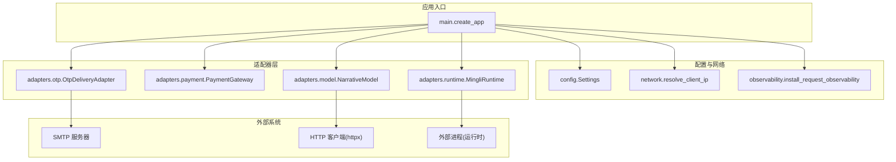
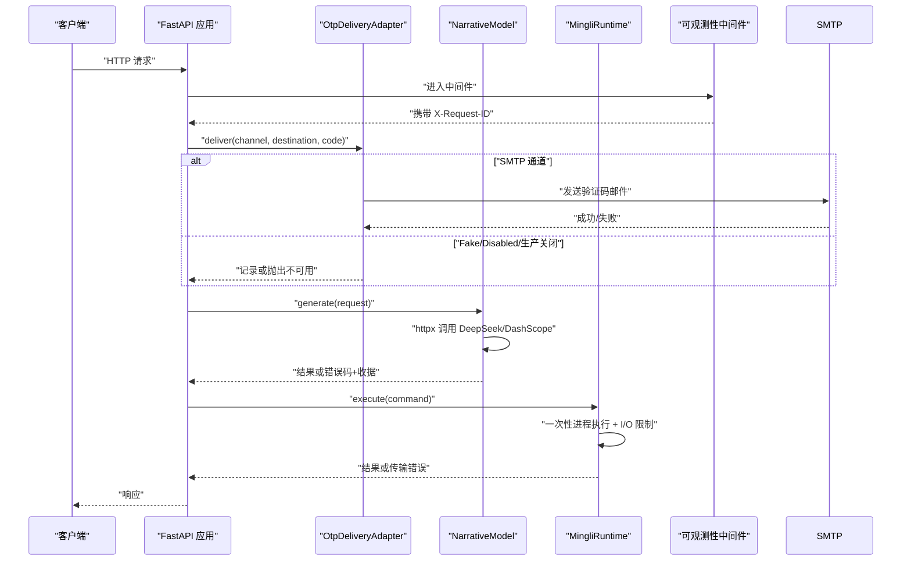
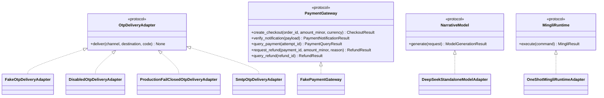
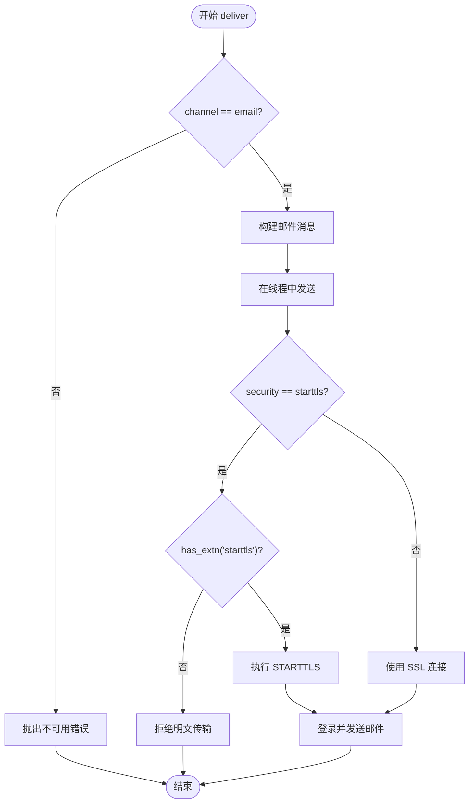
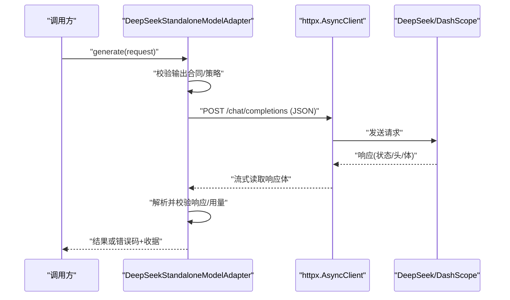
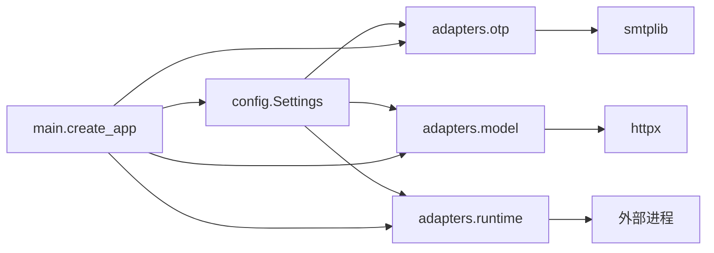

# 外部系统集成

<cite>
**本文引用的文件**
- [backend/app/adapters/payment.py](file://backend/app/adapters/payment.py)
- [backend/app/adapters/otp.py](file://backend/app/adapters/otp.py)
- [backend/app/adapters/model.py](file://backend/app/adapters/model.py)
- [backend/app/adapters/runtime.py](file://backend/app/adapters/runtime.py)
- [backend/app/network.py](file://backend/app/network.py)
- [backend/app/config.py](file://backend/app/config.py)
- [backend/app/observability.py](file://backend/app/observability.py)
- [backend/app/main.py](file://backend/app/main.py)
- [infra/fateradar-test.env.example](file://infra/fateradar-test.env.example)
</cite>

## 目录
1. [简介](#简介)
2. [项目结构](#项目结构)
3. [核心组件](#核心组件)
4. [架构总览](#架构总览)
5. [详细组件分析](#详细组件分析)
6. [依赖关系分析](#依赖关系分析)
7. [性能与可靠性](#性能与可靠性)
8. [故障排查指南](#故障排查指南)
9. [结论](#结论)

## 简介
本架构文档聚焦于后端服务的外部系统集成，围绕适配器模式、第三方服务集成（短信/邮件/支付）、网络通信层、配置管理、监控日志以及容错设计展开。代码库采用清晰的协议抽象与具体实现分离，通过依赖注入将不同环境下的适配策略组合到应用启动流程中；同时提供严格的配置校验与安全约束，确保生产环境的健壮性与可观测性。

## 项目结构
后端模块按职责分层组织：
- adapters：外部能力端口与本地占位实现（支付、OTP、模型、运行时）
- api：HTTP 路由、错误处理、速率限制等
- identity/profiles/readings：领域服务与数据契约
- config：集中式配置加载与强校验
- network：可信代理解析与客户端 IP 推导
- observability：请求追踪与结构化日志
- main：应用装配与依赖注入

图表来源
- [backend/app/main.py:30-156](file://backend/app/main.py#L30-L156)
- [backend/app/config.py:62-335](file://backend/app/config.py#L62-L335)
- [backend/app/network.py:16-72](file://backend/app/network.py#L16-L72)
- [backend/app/observability.py:14-52](file://backend/app/observability.py#L14-L52)
- [backend/app/adapters/otp.py:20-129](file://backend/app/adapters/otp.py#L20-L129)
- [backend/app/adapters/payment.py:34-92](file://backend/app/adapters/payment.py#L34-L92)
- [backend/app/adapters/model.py:67-687](file://backend/app/adapters/model.py#L67-L687)
- [backend/app/adapters/runtime.py:54-935](file://backend/app/adapters/runtime.py#L54-L935)

章节来源
- [backend/app/main.py:30-156](file://backend/app/main.py#L30-L156)
- [backend/app/config.py:62-335](file://backend/app/config.py#L62-L335)

## 核心组件
- 适配器接口与实现
  - OTP 投递：定义 OtpDeliveryAdapter 协议，提供 Fake、Disabled、ProductionFailClosed、Smtp 四种实现，支持安全传输与失败关闭策略。
  - 支付网关：定义 PaymentGateway 协议及 Checkout/Verify/Query/Refund 等能力，并提供 FakePaymentGateway 用于测试。
  - 模型调用：定义 NarrativeModel 协议，DeepSeekStandaloneModelAdapter 使用 httpx 进行 JSON 对象生成，含严格输入输出校验与审计收据。
  - 运行时：定义 MingliRuntime 协议，OneShotMingliRuntimeAdapter 以一次性进程方式执行固定发布包，配合 RuntimeStartupGate 做发布物完整性校验。
- 配置管理
  - Settings 集中管理环境变量，包含安全字段 SecretStr、白名单校验、生产环境强制约束、超时与大小限制等。
- 网络通信
  - 基于 httpx 的异步 HTTP 客户端，设置连接/读取/整体超时、禁止重定向、禁用信任环境变量、响应体大小限制与编码白名单。
  - 可信代理解析：从 X-Forwarded-For 链中解析真实客户端 IP，防止伪造。
- 监控与日志
  - 安装请求级中间件，记录结构化日志并透传 X-Request-ID，屏蔽敏感传输层日志。
- 容错设计
  - 明确异常类型与错误码，统一转换为领域错误；对上游超时、限流、服务端错误进行分类处理；运行时进程边界具备超时、I/O 上限与进程组清理。

章节来源
- [backend/app/adapters/otp.py:20-129](file://backend/app/adapters/otp.py#L20-L129)
- [backend/app/adapters/payment.py:34-92](file://backend/app/adapters/payment.py#L34-L92)
- [backend/app/adapters/model.py:67-687](file://backend/app/adapters/model.py#L67-L687)
- [backend/app/adapters/runtime.py:54-935](file://backend/app/adapters/runtime.py#L54-L935)
- [backend/app/config.py:62-335](file://backend/app/config.py#L62-L335)
- [backend/app/network.py:16-72](file://backend/app/network.py#L16-L72)
- [backend/app/observability.py:14-52](file://backend/app/observability.py#L14-L52)

## 架构总览
下图展示了外部集成的关键路径：API 层通过依赖注入选择 OTP/模型/运行时适配器，调用外部系统时遵循严格的配置与安全约束，并通过可观测性中间件记录请求链路。

图表来源
- [backend/app/main.py:30-156](file://backend/app/main.py#L30-L156)
- [backend/app/adapters/otp.py:57-129](file://backend/app/adapters/otp.py#L57-L129)
- [backend/app/adapters/model.py:144-334](file://backend/app/adapters/model.py#L144-L334)
- [backend/app/adapters/runtime.py:605-707](file://backend/app/adapters/runtime.py#L605-L707)
- [backend/app/observability.py:27-52](file://backend/app/observability.py#L27-L52)

## 详细组件分析

### 适配器模式与依赖注入
- 协议抽象
  - OtpDeliveryAdapter：定义 deliver(channel, destination, code) 异步方法。
  - PaymentGateway：定义创建结账、通知验签、查询支付、退款申请与查询。
  - NarrativeModel：定义 generate(NarrativeRequest) -> ModelGenerationResult。
  - MingliRuntime：定义 execute(MingliCommand) -> MingliResult。
- 具体实现
  - OTP：FakeOtpDeliveryAdapter（仅记录）、DisabledOtpDeliveryAdapter（抛不可用）、ProductionFailClosedOtpDeliveryAdapter（生产默认关闭直到持久化挑战存储就绪）、SmtpOtpDeliveryAdapter（TLS/STARTTLS）。
  - 支付：FakePaymentGateway（始终返回不可用，避免误触发真实交易）。
  - 模型：DeepSeekStandaloneModelAdapter（httpx 调用，严格校验响应与用量，生成审计收据）。
  - 运行时：OneShotMingliRuntimeAdapter（一次性进程，I/O 上限、超时、进程组清理），配合 RuntimeStartupGate 校验发布物完整性。
- 依赖注入
  - 在 create_app 中根据 Settings 选择 OTP 适配器实例并挂载到 application.state。
  - 构建器函数 build_deepseek_model_adapter、build_runtime_startup_gate 依据配置组装具体实现。

图表来源
- [backend/app/adapters/otp.py:20-129](file://backend/app/adapters/otp.py#L20-L129)
- [backend/app/adapters/payment.py:34-92](file://backend/app/adapters/payment.py#L34-L92)
- [backend/app/adapters/model.py:67-687](file://backend/app/adapters/model.py#L67-L687)
- [backend/app/adapters/runtime.py:54-935](file://backend/app/adapters/runtime.py#L54-L935)

章节来源
- [backend/app/adapters/otp.py:20-129](file://backend/app/adapters/otp.py#L20-L129)
- [backend/app/adapters/payment.py:34-92](file://backend/app/adapters/payment.py#L34-L92)
- [backend/app/adapters/model.py:67-687](file://backend/app/adapters/model.py#L67-L687)
- [backend/app/adapters/runtime.py:54-935](file://backend/app/adapters/runtime.py#L54-L935)
- [backend/app/main.py:30-156](file://backend/app/main.py#L30-L156)

### 第三方服务集成

#### 邮件服务（SMTP）
- 安全传输：仅允许 STARTTLS 或 SSL，拒绝明文；若服务器未声明 STARTTLS 则直接拒绝。
- 凭据保护：用户名与密码使用 SecretStr，不在异常文本或日志中泄露。
- 超时控制：构造 SMTP 客户端时传入超时秒数，发送过程在事件循环线程中执行以避免阻塞。
- 错误处理：非 OtpDeliveryUnavailable 的异常被包装为统一不可用错误，便于上层降级。

图表来源
- [backend/app/adapters/otp.py:57-129](file://backend/app/adapters/otp.py#L57-L129)

章节来源
- [backend/app/adapters/otp.py:57-129](file://backend/app/adapters/otp.py#L57-L129)

#### 支付网关
- 协议抽象：统一结账、通知验签、查询与退款接口，屏蔽渠道差异。
- 测试友好：FakePaymentGateway 永远返回不可用，避免测试环境产生真实交易。
- 状态语义：结果包含 channel、status、payment_succeeded、channel_transaction_id 等字段，便于业务编排。

章节来源
- [backend/app/adapters/payment.py:6-92](file://backend/app/adapters/payment.py#L6-L92)

#### 模型服务（DeepSeek/DashScope）
- HTTP 客户端：使用 httpx.AsyncClient，设置 connect/read/write/pool 超时，禁止重定向，禁用信任环境变量。
- 请求构造：将策略指令、输出合同、准备简报与生成参数封装为 JSON，强制 response_format=json_object。
- 响应校验：检查状态码、编码、内容长度、choices/message/content 结构、model 版本、usage 合法性。
- 审计收据：每次调用生成 ModelCallReceipt，记录 outcome、error_code、latency、usage、cost、price_snapshot 等。
- 取消与超时：捕获 asyncio.CancelledError 与 TimeoutError，转化为领域错误并保留收据。

图表来源
- [backend/app/adapters/model.py:144-334](file://backend/app/adapters/model.py#L144-L334)
- [backend/app/adapters/model.py:336-525](file://backend/app/adapters/model.py#L336-L525)

章节来源
- [backend/app/adapters/model.py:144-687](file://backend/app/adapters/model.py#L144-L687)

### 网络通信层
- 客户端 IP 解析：从请求 peer 与 X-Forwarded-For 链中解析真实客户端 IP，仅信任配置的 CIDR 网段，防止头部伪造。
- 可信代理：parse_trusted_proxy_cidrs 将逗号分隔的 CIDR 列表解析为元组供后续校验。

章节来源
- [backend/app/network.py:16-72](file://backend/app/network.py#L16-L72)

### 配置管理
- 环境变量前缀：MINGLI_，忽略大小写，额外字段忽略。
- 安全字段：SecretStr 保护敏感信息；自定义源过滤 DEEPSEEK_API_KEY 的日志暴露。
- 生产安全：强制 secure cookies、禁止 fake 适配器、要求绝对路径、冻结运行时路径、校验 manifest 与 capability shape、限制模型参数范围与价格快照标识。
- 示例配置：参考测试环境 env 示例，覆盖数据库、代理、OTP、加密密钥等。

章节来源
- [backend/app/config.py:62-335](file://backend/app/config.py#L62-L335)
- [infra/fateradar-test.env.example:1-45](file://infra/fateradar-test.env.example#L1-L45)

### 监控与日志集成
- 请求追踪：中间件提取或生成 X-Request-ID，写入响应头，记录结构化日志（方法、路径、状态码、耗时）。
- 日志级别：通过配置项 log_level 控制；屏蔽敏感传输层日志（httpx/httpcore/h2/hpack）。

章节来源
- [backend/app/observability.py:14-52](file://backend/app/observability.py#L14-L52)
- [backend/app/main.py:138-140](file://backend/app/main.py#L138-L140)

### 容错设计
- 明确错误分类：
  - 运行时传输错误：进程边界未知结果、管道不可用、输出过大、非零退出、无效输出/结果。
  - 模型生成错误：上游错误、限流、重定向禁止、编码禁止、响应过大、非法响应、用量非法、取消。
  - OTP 投递不可用：通道不匹配、未配置、生产关闭。
- 超时控制：
  - 模型：connect/read/overall 超时，整体超时包裹整个调用。
  - 运行时：一次性进程执行带超时，超时时终止进程组。
- 降级策略：
  - OTP：生产默认关闭直到持久化挑战存储就绪；开发/测试可使用 Fake。
  - 支付：Fake 实现保证不会误触发真实交易。
  - 模型：FakeModelGateway 提供确定性输出用于测试。
- 资源保护：
  - 响应体大小限制、输出 token 上限、I/O 字节上限、禁止重定向、禁止信任环境变量。

章节来源
- [backend/app/readings/errors.py:4-30](file://backend/app/readings/errors.py#L4-L30)
- [backend/app/adapters/model.py:213-334](file://backend/app/adapters/model.py#L213-L334)
- [backend/app/adapters/runtime.py:605-707](file://backend/app/adapters/runtime.py#L605-L707)
- [backend/app/adapters/otp.py:41-55](file://backend/app/adapters/otp.py#L41-L55)

## 依赖关系分析
- 耦合与内聚
  - 适配器层通过 Protocol 解耦业务逻辑与外部实现，提升内聚与可替换性。
  - 配置集中在 Settings，所有适配器与网络行为由配置驱动，降低硬编码耦合。
- 外部依赖
  - httpx：模型调用的 HTTP 客户端。
  - smtplib：SMTP 邮件发送。
  - 外部进程：运行时一次性执行固定发布包。
- 潜在循环依赖
  - 当前模块间依赖方向清晰：main -> adapters/config/network/observability，无循环引用迹象。

图表来源
- [backend/app/main.py:30-156](file://backend/app/main.py#L30-L156)
- [backend/app/config.py:62-335](file://backend/app/config.py#L62-L335)
- [backend/app/adapters/model.py:144-334](file://backend/app/adapters/model.py#L144-L334)
- [backend/app/adapters/otp.py:57-129](file://backend/app/adapters/otp.py#L57-L129)
- [backend/app/adapters/runtime.py:605-707](file://backend/app/adapters/runtime.py#L605-L707)

章节来源
- [backend/app/main.py:30-156](file://backend/app/main.py#L30-L156)
- [backend/app/config.py:62-335](file://backend/app/config.py#L62-L335)

## 性能与可靠性
- 性能
  - 模型调用使用流式读取响应体并按最大响应字节限制，避免内存膨胀。
  - 运行时一次性进程隔离计算任务，I/O 上限与超时保障主进程稳定。
  - 日志结构化且精简，屏蔽底层传输细节，减少 I/O 开销。
- 可靠性
  - 配置层强制生产安全约束，防止误配导致的不稳定行为。
  - 错误分类与收据机制便于定位问题与计费核算。
  - 可信代理解析与严格的安全传输策略降低攻击面。

[本节为通用指导，无需特定文件引用]

## 故障排查指南
- 常见问题定位
  - 邮件发送失败：检查 SMTP 主机、端口、安全模式、用户名/密码是否配置正确；确认服务器是否支持 STARTTLS；查看是否抛出“Email OTP delivery failed”。
  - 模型调用失败：关注 error_code（如 model_rate_limited、model_upstream_error、model_timeout、model_invalid_response）；核对 base_url、endpoint_path、temperature、max_output_tokens 是否在允许范围内；检查响应体大小与 usage 合法性。
  - 运行时执行失败：检查 launcher/python/release/state 路径是否为绝对路径且存在；确认 manifest digest 与 capability shape 是否匹配；查看 stdout/stderr 是否超过限制；注意进程非零退出与无效输出。
  - 客户端 IP 异常：检查 trusted_proxy_cidrs 是否正确配置；确认 X-Forwarded-For 链长度与格式合法。
- 日志与追踪
  - 通过 X-Request-ID 关联请求全链路日志；观察 observability 中间件输出的结构化日志。
  - 调整 log_level 以获取更多上下文；注意敏感传输层日志已被屏蔽。
- 配置验证
  - 启动时 Settings 会执行严格校验，任何违反生产安全或参数范围的配置都会抛出异常；根据错误提示修正环境变量。

章节来源
- [backend/app/adapters/otp.py:57-129](file://backend/app/adapters/otp.py#L57-L129)
- [backend/app/adapters/model.py:213-334](file://backend/app/adapters/model.py#L213-L334)
- [backend/app/adapters/runtime.py:605-707](file://backend/app/adapters/runtime.py#L605-L707)
- [backend/app/network.py:16-72](file://backend/app/network.py#L16-L72)
- [backend/app/observability.py:14-52](file://backend/app/observability.py#L14-L52)
- [backend/app/config.py:188-329](file://backend/app/config.py#L188-L329)

## 结论
该外部系统集成方案通过适配器模式实现了高内聚、低耦合的第三方服务接入；借助严格的配置校验与安全策略，保障了生产环境的稳定性与安全性；结合可观测性中间件与明确的错误分类，提升了问题定位效率与系统可维护性。未来可在现有基础上引入更完善的熔断与重试策略，进一步增强对外部依赖的弹性与韧性。