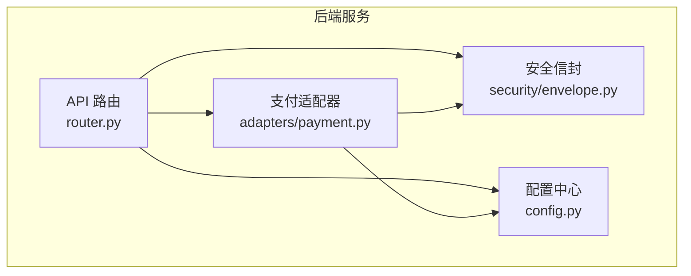
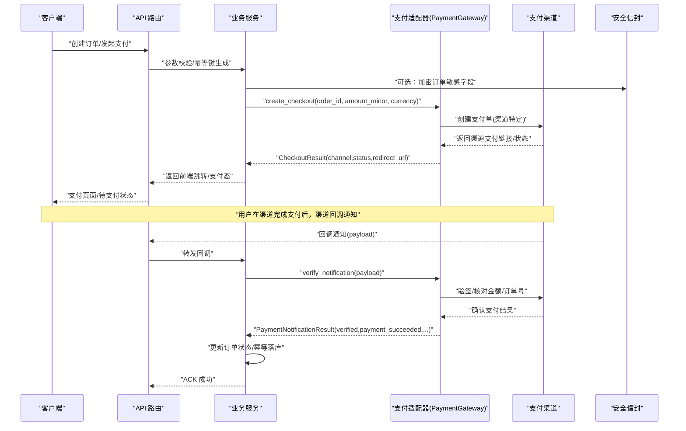
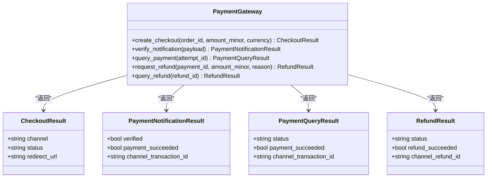
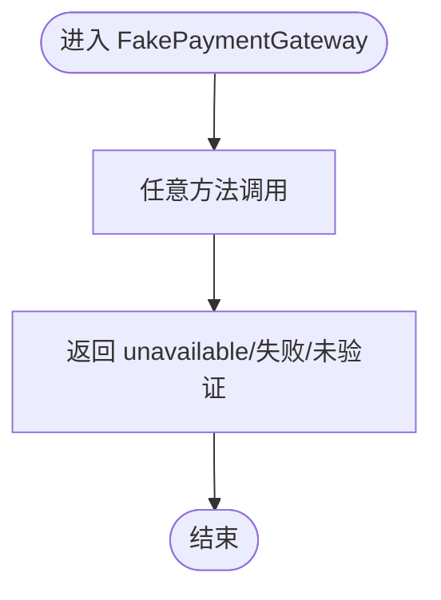
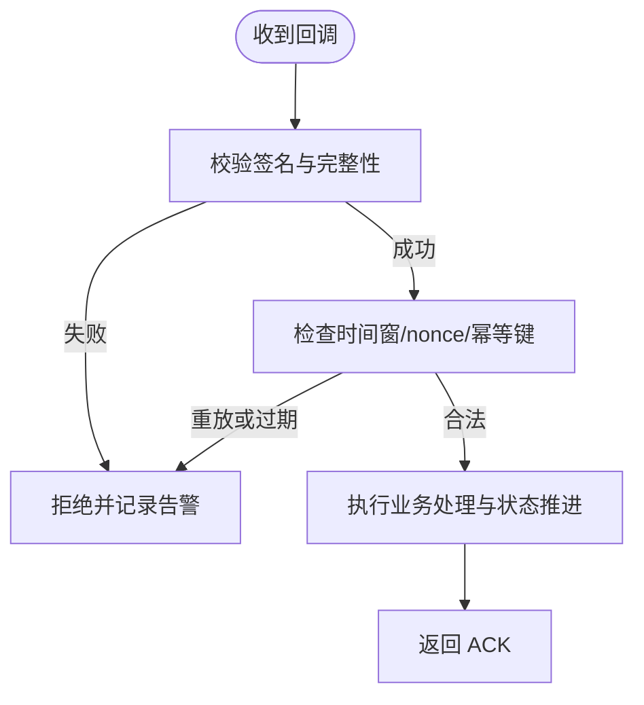
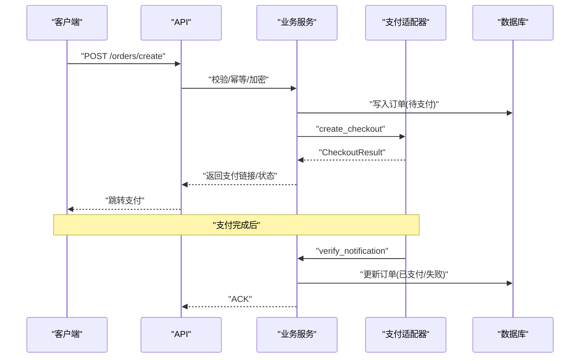
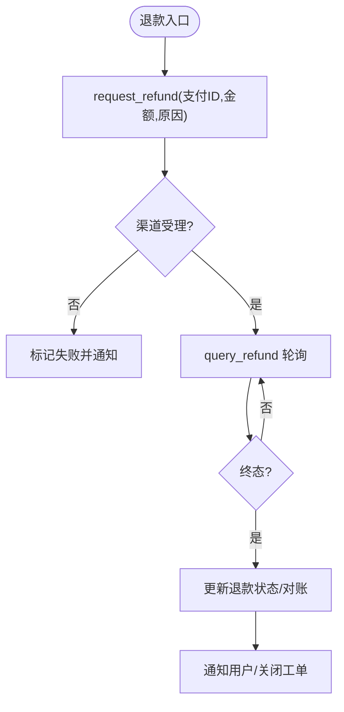
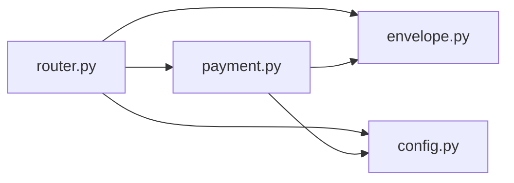

# 支付网关集成

<cite>
**本文引用的文件**
- [backend/app/adapters/payment.py](file://backend/app/adapters/payment.py)
- [backend/tests/test_fake_adapters.py](file://backend/tests/test_fake_adapters.py)
- [backend/app/config.py](file://backend/app/config.py)
- [backend/app/security/envelope.py](file://backend/app/security/envelope.py)
- [backend/app/api/router.py](file://backend/app/api/router.py)
</cite>

## 目录
1. [简介](#简介)
2. [项目结构](#项目结构)
3. [核心组件](#核心组件)
4. [架构总览](#架构总览)
5. [详细组件分析](#详细组件分析)
6. [依赖关系分析](#依赖关系分析)
7. [性能考虑](#性能考虑)
8. [故障排查指南](#故障排查指南)
9. [结论](#结论)
10. [附录](#附录)

## 简介
本文件面向“支付网关集成”的落地设计，围绕支付适配器抽象、多支付方式接入、统一接口与版本兼容、订单创建/支付授权/回调处理/状态同步、安全机制（签名验证、数据加密、防重放）、退款与争议处理、监控审计与合规报告、以及流程图与安全设计、故障恢复策略进行系统化说明。当前代码库已提供支付适配器的协议定义与假实现，用于隔离外部支付渠道并保证不可信输入不会直接转化为支付事实；同时具备内容信封加密能力与严格的配置校验，为后续接入真实支付渠道奠定安全与可观测基础。

## 项目结构
- 支付适配器位于后端模块 adapters 下，定义了统一的 PaymentGateway 协议及结果模型，并提供 FakePaymentGateway 作为安全占位实现。
- 安全能力集中在 security.envelope，提供带密钥标识、随机非重复 nonce、上下文绑定的信封加解密与指纹校验。
- 配置集中管理于 config.Settings，包含环境安全约束、加密密钥强度与来源限制等。
- API 路由通过 router 聚合各业务子路由，支付相关路由可按需挂载至 /api/v1 前缀下。

图表来源
- [backend/app/api/router.py:12-21](file://backend/app/api/router.py#L12-L21)
- [backend/app/adapters/payment.py:34-55](file://backend/app/adapters/payment.py#L34-L55)
- [backend/app/security/envelope.py](file://backend/app/security/envelope.py)
- [backend/app/config.py:62-149](file://backend/app/config.py#L62-L149)

章节来源
- [backend/app/api/router.py:12-21](file://backend/app/api/router.py#L12-L21)
- [backend/app/adapters/payment.py:34-55](file://backend/app/adapters/payment.py#L34-L55)
- [backend/app/config.py:62-149](file://backend/app/config.py#L62-L149)

## 核心组件
- 支付协议与数据模型：定义结账、通知、查询、退款等统一数据结构与异步方法契约，屏蔽不同支付渠道差异。
- 假支付网关：确保测试与开发阶段不会产生真实交易，所有回调与查询均返回不可用或失败状态，避免误触发资金流。
- 安全信封：对敏感数据进行信封级加密，支持密钥轮换、上下文绑定与篡改检测。
- 配置校验：生产环境强制启用安全 Cookie、禁用不安全适配器、要求强加密密钥与固定运行时路径等。

章节来源
- [backend/app/adapters/payment.py:6-55](file://backend/app/adapters/payment.py#L6-L55)
- [backend/app/adapters/payment.py:58-91](file://backend/app/adapters/payment.py#L58-L91)
- [backend/app/security/envelope.py](file://backend/app/security/envelope.py)
- [backend/app/config.py:188-329](file://backend/app/config.py#L188-L329)

## 架构总览
支付网关集成分层如下：
- 接口层：FastAPI 路由暴露订单创建、支付查询、退款申请等 API。
- 编排层：业务服务负责订单生命周期管理、幂等控制、状态机推进与事件发布。
- 适配器层：PaymentGateway 协议统一对接多渠道支付；FakePaymentGateway 用于安全占位。
- 安全层：信封加密保护敏感载荷；配置层保障运行期安全基线。
- 可观测性：审计日志、指标上报、告警通道（由上层服务扩展）。

图表来源
- [backend/app/adapters/payment.py:34-55](file://backend/app/adapters/payment.py#L34-L55)
- [backend/app/adapters/payment.py:6-31](file://backend/app/adapters/payment.py#L6-L31)
- [backend/app/security/envelope.py](file://backend/app/security/envelope.py)

## 详细组件分析

### 支付适配器协议与数据模型
- 统一接口：
  - create_checkout：创建结账会话，返回渠道、状态与跳转地址。
  - verify_notification：接收并验证渠道回调，返回是否可信与支付是否成功。
  - query_payment/query_refund：轮询支付/退款状态，便于补偿与对账。
  - request_refund：发起退款请求。
- 数据模型：
  - CheckoutResult：channel、status、redirect_url。
  - PaymentNotificationResult：verified、payment_succeeded、channel_transaction_id。
  - PaymentQueryResult：status、payment_succeeded、channel_transaction_id。
  - RefundResult：status、refund_succeeded、channel_refund_id。

图表来源
- [backend/app/adapters/payment.py:6-55](file://backend/app/adapters/payment.py#L6-L55)

章节来源
- [backend/app/adapters/payment.py:6-55](file://backend/app/adapters/payment.py#L6-L55)

### 假支付网关（安全占位）
- 行为约束：任何调用都不会产生真实资金变动；所有回调验证均返回未验证且支付失败；查询与退款均返回不可用。
- 测试覆盖：断言 checkout、notification、query、refund 均处于安全状态，防止误报结算。

图表来源
- [backend/app/adapters/payment.py:58-91](file://backend/app/adapters/payment.py#L58-L91)
- [backend/tests/test_fake_adapters.py:5-33](file://backend/tests/test_fake_adapters.py#L5-L33)

章节来源
- [backend/app/adapters/payment.py:58-91](file://backend/app/adapters/payment.py#L58-L91)
- [backend/tests/test_fake_adapters.py:5-33](file://backend/tests/test_fake_adapters.py#L5-L33)

### 安全机制：签名验证、数据加密与防重放
- 签名验证：在 verify_notification 中，适配器应基于渠道提供的签名算法与共享密钥对回调 payload 进行验签，并严格校验金额、订单号、时间戳等关键字段。
- 数据加密：使用信封加密对敏感字段（如用户信息、订单详情）进行加密存储与传输，密钥标识与上下文绑定，防止跨上下文泄露。
- 防重放攻击：
  - 回调处理需校验时间窗口与一次性令牌（nonce），拒绝过期或重复请求。
  - 对外部回调仅接受白名单 IP/域名，结合速率限制与异常告警。
  - 内部幂等键（attempt_id/order_id）去重，确保同一请求只生效一次。

图表来源
- [backend/app/adapters/payment.py:34-55](file://backend/app/adapters/payment.py#L34-L55)
- [backend/app/security/envelope.py](file://backend/app/security/envelope.py)

章节来源
- [backend/app/adapters/payment.py:34-55](file://backend/app/adapters/payment.py#L34-L55)
- [backend/app/security/envelope.py](file://backend/app/security/envelope.py)

### 支付流程：订单创建、授权、回调与状态同步
- 订单创建：业务服务生成唯一 order_id 与幂等键，必要时对敏感字段进行信封加密，调用 create_checkout 获取渠道支付链接或待支付状态。
- 支付授权：前端引导用户到渠道完成支付；服务端等待回调或通过 query_payment 轮询。
- 回调处理：verify_notification 验签并确认支付结果，更新订单状态，触发后续履约（如开通权益）。
- 状态同步：若回调丢失或延迟，通过 query_payment 主动拉取最终状态，确保一致性。

图表来源
- [backend/app/adapters/payment.py:34-55](file://backend/app/adapters/payment.py#L34-L55)
- [backend/app/api/router.py:12-21](file://backend/app/api/router.py#L12-L21)

章节来源
- [backend/app/adapters/payment.py:34-55](file://backend/app/adapters/payment.py#L34-L55)
- [backend/app/api/router.py:12-21](file://backend/app/api/router.py#L12-L21)

### 退款与争议处理
- 退款流程：业务侧根据用户申请或风控策略调用 request_refund，记录退款原因与金额，随后通过 query_refund 轮询直至终态。
- 状态管理：退款状态包括不可用、处理中、成功、失败；需持久化渠道退款 ID 以便对账。
- 用户通知：状态变更通过消息队列或事件总线通知用户端，展示退款进度与预计到账时间。
- 争议处理：当渠道返回争议时，业务服务应冻结相关权益并转人工审核，保留完整证据链（订单、流水、截图、日志）。

图表来源
- [backend/app/adapters/payment.py:47-55](file://backend/app/adapters/payment.py#L47-L55)

章节来源
- [backend/app/adapters/payment.py:47-55](file://backend/app/adapters/payment.py#L47-L55)

### 监控与审计
- 交易记录：每次 create_checkout、verify_notification、query_*、request_refund 均应记录结构化审计日志（含订单号、渠道、状态码、耗时、错误码）。
- 异常检测：对验签失败、金额不一致、超时、网络错误等设置阈值告警；对高频失败与异常回调进行熔断与限流。
- 合规报告：定期导出对账单、退款明细、争议事件，满足内审与监管要求；敏感字段脱敏输出。

章节来源
- [backend/app/adapters/payment.py:34-55](file://backend/app/adapters/payment.py#L34-L55)
- [backend/app/config.py:188-329](file://backend/app/config.py#L188-L329)

## 依赖关系分析
- 适配器与路由：API 路由通过依赖注入将 PaymentGateway 接入业务服务，保持松耦合。
- 适配器与安全：支付回调与敏感数据通过信封加密与签名校验，降低泄露与篡改风险。
- 配置与运行期：生产环境强制安全基线（Cookie 安全、禁用不安全适配器、固定运行时路径、强加密密钥），确保稳定与合规。

图表来源
- [backend/app/api/router.py:12-21](file://backend/app/api/router.py#L12-L21)
- [backend/app/adapters/payment.py:34-55](file://backend/app/adapters/payment.py#L34-L55)
- [backend/app/security/envelope.py](file://backend/app/security/envelope.py)
- [backend/app/config.py:62-149](file://backend/app/config.py#L62-L149)

章节来源
- [backend/app/api/router.py:12-21](file://backend/app/api/router.py#L12-L21)
- [backend/app/adapters/payment.py:34-55](file://backend/app/adapters/payment.py#L34-L55)
- [backend/app/config.py:62-149](file://backend/app/config.py#L62-L149)

## 性能考虑
- 超时与重试：为 create_checkout、verify_notification、query_* 设置合理的连接、读取与整体超时；对幂等查询可做指数退避重试。
- 资源限制：限制回调负载大小与响应体大小，防止恶意放大；对高并发场景采用连接池与限流。
- 缓存与索引：对频繁查询的订单与支付状态建立缓存与索引，减少数据库压力。
- 可观测性：埋点统计 QPS、P95/P99 延迟、错误率与渠道成功率，支撑容量规划与问题定位。

## 故障排查指南
- 回调验签失败：检查共享密钥、签名算法、时间戳与 nonce；查看适配器日志中的错误码与原始 payload（脱敏）。
- 金额不一致：比对订单金额与回调金额，关注货币单位与精度；记录差异事件并触发人工复核。
- 状态不一致：通过 query_payment 主动拉取最终状态；检查本地幂等键与事务边界，确保状态机推进原子性。
- 退款失败：核对渠道退款接口返回码与原因；检查账户余额、原支付状态与退款限额；必要时发起二次退款或争议申诉。
- 配置问题：生产环境需启用安全 Cookie、注入强加密密钥、固定运行时路径；参考配置校验规则逐项排查。

章节来源
- [backend/app/adapters/payment.py:34-55](file://backend/app/adapters/payment.py#L34-L55)
- [backend/app/config.py:188-329](file://backend/app/config.py#L188-L329)

## 结论
本集成以 PaymentGateway 协议为核心，屏蔽多渠道差异并提供统一抽象；FakePaymentGateway 确保安全可控的开发与测试体验；配合信封加密与严格配置校验，构建起签名验证、数据加密与防重放的安全体系。通过清晰的订单创建、授权、回调与状态同步流程，以及完善的退款与争议处理、监控审计与合规报告，系统具备高可用、可观测与可扩展的能力。后续接入真实支付渠道时，只需实现 PaymentGateway 协议并保持数据模型与流程一致，即可平滑上线。

## 附录
- 版本兼容性建议：
  - 对外 API 使用语义化版本号，保持向后兼容；新增字段默认空值或兼容旧客户端。
  - 支付渠道升级时，通过适配器内部适配层隔离变化，避免影响上层业务。
- 最佳实践清单：
  - 所有回调必须验签与金额校验；禁止信任未经验证的回调。
  - 使用幂等键与分布式锁防止重复处理。
  - 敏感数据一律信封加密，密钥按环境隔离并定期轮换。
  - 关键操作全链路审计，日志脱敏并集中收集。
  - 生产环境启用限流、熔断与告警，保障稳定性。