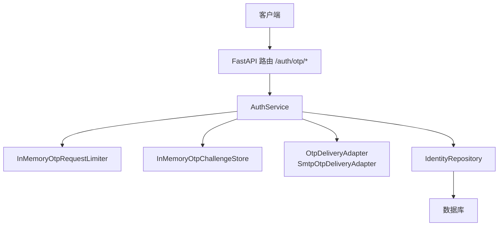
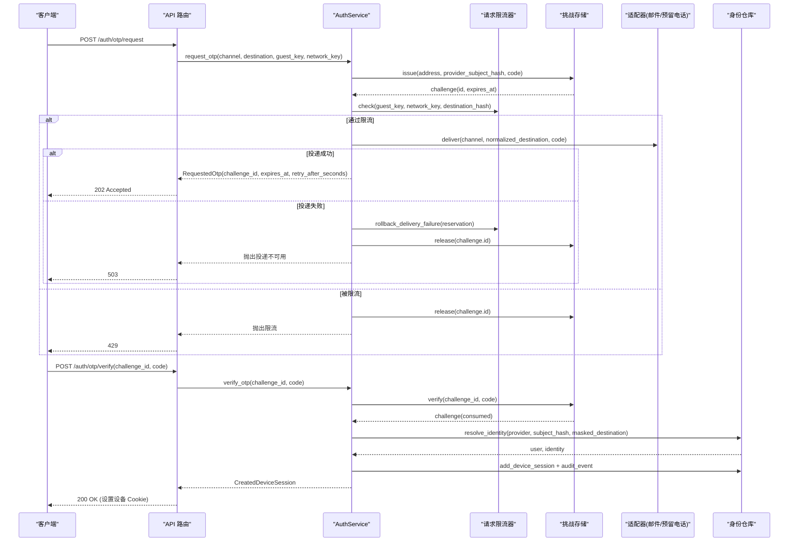
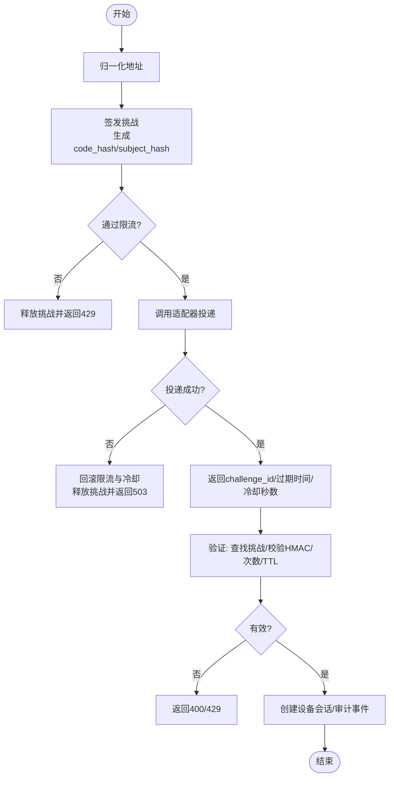
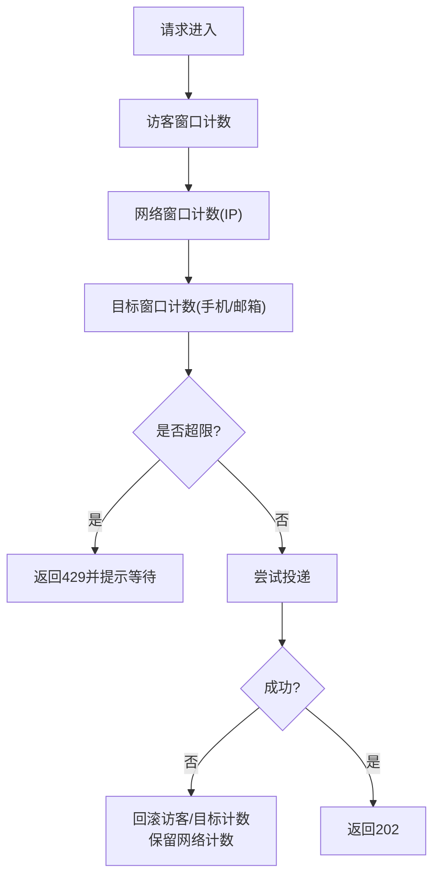
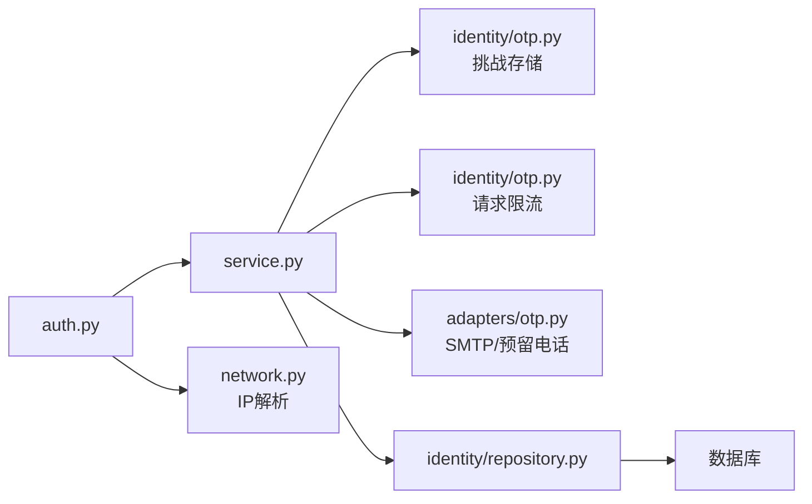

# 短信服务集成

<cite>
**本文引用的文件**
- [backend/app/adapters/otp.py](file://backend/app/adapters/otp.py)
- [backend/app/identity/otp.py](file://backend/app/identity/otp.py)
- [backend/app/identity/service.py](file://backend/app/identity/service.py)
- [backend/app/api/auth.py](file://backend/app/api/auth.py)
- [backend/app/config.py](file://backend/app/config.py)
- [backend/app/network.py](file://backend/app/network.py)
- [backend/app/api/rate_guard.py](file://backend/app/api/rate_guard.py)
- [backend/tests/test_smtp_otp_adapter.py](file://backend/tests/test_smtp_otp_adapter.py)
- [backend/tests/test_auth.py](file://backend/tests/test_auth.py)
</cite>

## 目录
1. [简介](#简介)
2. [项目结构](#项目结构)
3. [核心组件](#核心组件)
4. [架构总览](#架构总览)
5. [详细组件分析](#详细组件分析)
6. [依赖关系分析](#依赖关系分析)
7. [性能与容量规划](#性能与容量规划)
8. [故障排查指南](#故障排查指南)
9. [结论](#结论)
10. [附录：配置项速查](#附录：配置项速查)

## 简介
本文件面向“短信服务集成”的完整实现，覆盖 OTP（一次性密码）生成与校验、数字签名与安全设计、时间窗口与冷却期控制、多通道适配器（当前已实现邮箱 SMTP，预留电话通道）、速率限制与防滥用策略、错误处理与重试逻辑，以及端到端流程图和排障指引。代码库中短信发送适配器的具体实现以邮箱为主，但接口层对“phone”通道进行了规范化与限流保护；生产环境要求使用持久化挑战存储与安全的密钥注入。

## 项目结构
围绕 OTP 与认证的关键路径位于后端模块：
- API 路由：接收请求、参数校验、异常映射、会话设置
- 身份服务：OTP 发放、验证、会话创建、审计事件
- OTP 安全与存储：挑战对象、哈希、时间窗口、尝试次数、冷却期
- 适配器：邮件发送（SMTP），并包含禁用/失败关闭等变体
- 网络工具：客户端 IP 解析（支持可信代理链）
- 配置：环境变量驱动的安全与行为开关

图表来源
- [backend/app/api/auth.py:44-138](file://backend/app/api/auth.py#L44-L138)
- [backend/app/identity/service.py:78-192](file://backend/app/identity/service.py#L78-L192)
- [backend/app/identity/otp.py:221-304](file://backend/app/identity/otp.py#L221-L304)
- [backend/app/adapters/otp.py:57-129](file://backend/app/adapters/otp.py#L57-L129)

章节来源
- [backend/app/api/auth.py:44-138](file://backend/app/api/auth.py#L44-L138)
- [backend/app/identity/service.py:78-192](file://backend/app/identity/service.py#L78-L192)
- [backend/app/identity/otp.py:221-304](file://backend/app/identity/otp.py#L221-L304)
- [backend/app/adapters/otp.py:57-129](file://backend/app/adapters/otp.py#L57-L129)

## 核心组件
- 适配器层（adapters/otp.py）
  - 定义统一交付协议 OtpDeliveryAdapter，支持 email/phone 通道
  - 提供 SmtpOtpDeliveryAdapter（TLS/STARTTLS 强制，凭据使用 SecretStr）
  - 提供 Fake/Disabled/ProductionFailClosed 等变体用于测试与生产保护
- 身份安全与状态（identity/otp.py）
  - IdentityAddress：地址归一化与脱敏显示
  - OtpChallenge：挑战对象（ID、地址、提供者主题哈希、验证码哈希、有效期、尝试次数、消费时间）
  - InMemoryOtpChallengeStore：挑战发放、释放、校验（含 TTL、冷却期、最大尝试次数）
  - InMemoryOtpRequestLimiter：三层限流（访客、网络、目标地址），支持原子回滚
  - hash_identity/hash_otp：基于 HMAC-SHA256 的数字签名
- 业务编排（identity/service.py）
  - AuthService.request_otp：归一化地址、签发挑战、限流检查、调用适配器投递、失败回滚
  - AuthService.verify_otp：校验挑战、解析/绑定身份、创建设备会话、记录审计事件
- API 路由（api/auth.py）
  - POST /auth/otp/request：返回 challenge_id、过期时间、冷却秒数，开发环境可返回 fake code
  - POST /auth/otp/verify：校验通过后设置设备 Cookie，返回会话信息
- 配置（config.py）
  - OTP 相关：TTL、冷却期、最大尝试次数、各维度限流窗口与上限
  - 生产安全：禁止 fake 适配器、强制 secure cookie、强制注入密钥、禁止明文传输
- 网络工具（network.py）
  - resolve_client_ip：从连接或 X-Forwarded-For 解析真实客户端 IP，支持可信代理网段

章节来源
- [backend/app/adapters/otp.py:16-129](file://backend/app/adapters/otp.py#L16-L129)
- [backend/app/identity/otp.py:27-304](file://backend/app/identity/otp.py#L27-L304)
- [backend/app/identity/service.py:23-192](file://backend/app/identity/service.py#L23-L192)
- [backend/app/api/auth.py:44-138](file://backend/app/api/auth.py#L44-L138)
- [backend/app/config.py:62-149](file://backend/app/config.py#L62-L149)
- [backend/app/network.py:22-54](file://backend/app/network.py#L22-L54)

## 架构总览
下图展示了从请求到投递再到验证的完整流程，包括限流、挑战存储、适配器与错误回滚。

图表来源
- [backend/app/api/auth.py:44-138](file://backend/app/api/auth.py#L44-L138)
- [backend/app/identity/service.py:100-192](file://backend/app/identity/service.py#L100-L192)
- [backend/app/identity/otp.py:221-304](file://backend/app/identity/otp.py#L221-L304)
- [backend/app/adapters/otp.py:57-129](file://backend/app/adapters/otp.py#L57-L129)

## 详细组件分析

### OTP 生成与验证流程（含数字签名与时间窗口）
- 生成阶段
  - 地址归一化：手机号仅保留数字并按中国大陆规则校验；邮箱标准化并脱敏显示
  - 生成 6 位随机码（非 fake 场景）
  - 计算 provider_subject_hash = HMAC(identity_hash_key, channel||normalized)
  - 计算 code_hash = HMAC(secret, challenge_id||code)
  - 写入挑战记录（含 created_at、expires_at、attempts=0）
  - 可选：按访客/网络/目标地址进行三层限流，失败时原子回滚
  - 调用适配器投递；若失败则回滚限流与冷却占用，并释放挑战
- 验证阶段
  - 查找挑战并校验未过期、未消费、尝试次数未超限
  - 计算 supplied_hash = HMAC(secret, challenge_id||code)，与存储的 code_hash 比较
  - 成功后标记 consumed_at，清理冷却占用，解析/绑定身份，创建设备会话并记录审计事件

图表来源
- [backend/app/identity/otp.py:183-218](file://backend/app/identity/otp.py#L183-L218)
- [backend/app/identity/otp.py:240-304](file://backend/app/identity/otp.py#L240-L304)
- [backend/app/identity/service.py:100-192](file://backend/app/identity/service.py#L100-L192)
- [backend/app/api/auth.py:44-138](file://backend/app/api/auth.py#L44-L138)

章节来源
- [backend/app/identity/otp.py:183-304](file://backend/app/identity/otp.py#L183-L304)
- [backend/app/identity/service.py:100-192](file://backend/app/identity/service.py#L100-L192)
- [backend/app/api/auth.py:44-138](file://backend/app/api/auth.py#L44-L138)

### 数字签名与安全设计
- 身份标识签名：使用 identity_hash_key 对 channel 与 normalized 地址做 HMAC-SHA256，避免明文暴露敏感信息
- 验证码签名：使用内部 secret 对 challenge_id 与 code 做 HMAC-SHA256，防止重放与篡改
- 安全模式：
  - 生产环境禁止 fake 适配器、必须启用 secure cookie、必须注入 identity_hash_key 与内容加密密钥
  - SMTP 适配器强制 TLS/STARTTLS，拒绝明文降级
  - 所有凭据使用 SecretStr，不在日志或异常中泄露

章节来源
- [backend/app/identity/otp.py:211-218](file://backend/app/identity/otp.py#L211-L218)
- [backend/app/adapters/otp.py:57-129](file://backend/app/adapters/otp.py#L57-L129)
- [backend/app/config.py:188-239](file://backend/app/config.py#L188-L239)

### 短信发送适配器（多供应商支持与消息模板）
- 当前实现
  - 邮箱 SMTP：支持 starttls 与 ssl 两种安全模式，超时可控，凭据安全封装
  - 预留 phone 通道：接口层允许 channel="phone"，但 SMTP 适配器会拒绝非 email 通道
- 多供应商扩展建议
  - 在 adapters/otp.py 中新增 PhoneOtpDeliveryAdapter，实现 deliver(channel="phone", ...)
  - 通过配置选择不同供应商（如阿里云短信、腾讯云短信等），保持统一接口
  - 为每个供应商维护独立模板 ID 与变量映射，由 service 层组装后传入适配器
- 消息模板管理
  - 将模板内容与占位符（如 {code}、{expire_minutes}）外置至配置或模板服务
  - 适配器根据 channel 选择模板并渲染，确保多语言与合规文案

章节来源
- [backend/app/adapters/otp.py:12-129](file://backend/app/adapters/otp.py#L12-L129)
- [backend/tests/test_smtp_otp_adapter.py:83-131](file://backend/tests/test_smtp_otp_adapter.py#L83-L131)

### 发送状态跟踪
- 当前实现
  - 适配器投递成功即认为送达；失败抛出 OtpDeliveryUnavailable
  - 服务层捕获失败后进行回滚与释放挑战，API 返回 503
- 扩展建议
  - 在适配器中增加回调或异步任务，记录发送结果（成功/失败/重试次数）
  - 将状态写入审计表或外部追踪系统，便于运营监控与问题定位

章节来源
- [backend/app/adapters/otp.py:98-129](file://backend/app/adapters/otp.py#L98-L129)
- [backend/app/identity/service.py:131-146](file://backend/app/identity/service.py#L131-L146)
- [backend/app/api/auth.py:76-78](file://backend/app/api/auth.py#L76-L78)

### 速率限制与防滥用机制
- 三层限流（请求级）
  - 访客维度：防止同一会话频繁请求
  - 网络维度：基于客户端 IP（支持可信代理链）限制，防止单 IP 滥用
  - 目标维度：针对同一目的地（手机号/邮箱）限制，防止轰炸
- 挑战级限制
  - 冷却期：同一 provider_subject_hash 在 cooldown_seconds 内不可重复签发
  - 最大尝试次数：超过阈值触发 429，并附带重试等待时间
- 失败回滚
  - 投递失败时回滚访客与目标维度的计数，但保留网络维度，防止利用故障绕过 IP 限制
- 通用限流工具
  - rate_guard.check_rate_limiter：统一包装 WindowRateLimiter，输出 429 与 Retry-After 头

图表来源
- [backend/app/identity/otp.py:64-181](file://backend/app/identity/otp.py#L64-L181)
- [backend/app/identity/service.py:116-146](file://backend/app/identity/service.py#L116-L146)
- [backend/app/api/rate_guard.py:5-20](file://backend/app/api/rate_guard.py#L5-L20)
- [backend/app/network.py:22-54](file://backend/app/network.py#L22-L54)

章节来源
- [backend/app/identity/otp.py:64-181](file://backend/app/identity/otp.py#L64-L181)
- [backend/app/identity/service.py:116-146](file://backend/app/identity/service.py#L116-L146)
- [backend/app/api/rate_guard.py:5-20](file://backend/app/api/rate_guard.py#L5-L20)
- [backend/app/network.py:22-54](file://backend/app/network.py#L22-L54)

### 错误处理与重试逻辑
- 网络与服务错误
  - SMTP 连接/认证/发送异常统一转换为 OtpDeliveryUnavailable，API 返回 503
  - 客户端 IP 解析失败或非法代理链时回退为本地 peer 地址，避免误判
- 业务错误
  - 无效目的地：400
  - 验证码错误或过期：400
  - 过多尝试：429，并携带重试等待秒数
- 重试策略
  - 适配器侧不自动重试，由上层或客户端根据 429/503 与 Retry-After 决定重试
  - 失败回滚保证后续重试不会因临时故障而耗尽配额

章节来源
- [backend/app/adapters/otp.py:98-129](file://backend/app/adapters/otp.py#L98-L129)
- [backend/app/identity/service.py:131-146](file://backend/app/identity/service.py#L131-L146)
- [backend/app/api/auth.py:69-110](file://backend/app/api/auth.py#L69-L110)
- [backend/app/network.py:22-54](file://backend/app/network.py#L22-L54)

## 依赖关系分析
- 组件耦合
  - API 路由依赖 AuthService，AuthService 依赖挑战存储、适配器、身份仓库与限流器
  - 挑战存储与限流器解耦，便于替换为 Redis/分布式实现
  - 适配器抽象使多供应商切换成本低
- 外部依赖
  - SMTP 客户端（标准库 smtplib）
  - 数据库（通过 SQLAlchemy AsyncSession）
  - 网络工具（解析客户端 IP）

图表来源
- [backend/app/api/auth.py:44-138](file://backend/app/api/auth.py#L44-L138)
- [backend/app/identity/service.py:78-192](file://backend/app/identity/service.py#L78-L192)
- [backend/app/identity/otp.py:64-304](file://backend/app/identity/otp.py#L64-L304)
- [backend/app/adapters/otp.py:57-129](file://backend/app/adapters/otp.py#L57-L129)
- [backend/app/network.py:22-54](file://backend/app/network.py#L22-L54)

章节来源
- [backend/app/api/auth.py:44-138](file://backend/app/api/auth.py#L44-L138)
- [backend/app/identity/service.py:78-192](file://backend/app/identity/service.py#L78-L192)
- [backend/app/identity/otp.py:64-304](file://backend/app/identity/otp.py#L64-L304)
- [backend/app/adapters/otp.py:57-129](file://backend/app/adapters/otp.py#L57-L129)
- [backend/app/network.py:22-54](file://backend/app/network.py#L22-L54)

## 性能与容量规划
- 内存与并发
  - 当前挑战存储与请求限流为内存实现，适合单机/测试；生产需替换为 Redis 等分布式存储
  - 锁粒度较小（asyncio.Lock），在高并发下仍应保持低延迟
- 超时与资源
  - SMTP 连接/发送超时可配置，避免长连接占用资源
  - 建议在生产开启告警与指标采集（发送成功率、延迟、错误分布）
- 限流参数调优
  - 根据业务峰值调整 otp_guest_window_limit、otp_network_window_limit、otp_destination_window_limit
  - 结合 CDN/WAF 的 IP 聚合能力，合理设置网络维度限制

[本节为通用指导，无需特定文件引用]

## 故障排查指南
- 常见问题定位
  - 503 投递不可用：检查 SMTP 配置（host/port/security/username/password/sender）、网络连通性、服务器是否支持 STARTTLS
  - 429 限流：确认访客/网络/目标维度是否达到上限；查看 Retry-After 秒数；检查代理链是否正确传递真实 IP
  - 400 无效或过期：核对 challenge_id 与 code；检查 TTL 与客户端时钟偏差
- 调试步骤
  - 启用更详细的日志（注意不要打印敏感信息）
  - 使用测试用例中的 SMTP 录制方式验证适配器行为
  - 模拟投递失败，验证回滚逻辑是否符合预期（访客/目标计数应回滚，网络计数保留）
- 参考测试
  - SMTP 适配器的 SSL/STARTTLS、明文降级拒绝、通道拒绝等行为
  - 投递失败时的限流回滚与网络窗口保留行为

章节来源
- [backend/tests/test_smtp_otp_adapter.py:83-131](file://backend/tests/test_smtp_otp_adapter.py#L83-L131)
- [backend/tests/test_auth.py:491-539](file://backend/tests/test_auth.py#L491-L539)

## 结论
该实现提供了安全、可扩展的 OTP 认证流程：通过 HMAC 数字签名、严格的时间窗口与冷却期、三层限流与失败回滚，保障验证码发放与验证的安全性及可用性。当前已实现邮箱 SMTP 适配器，并为电话通道预留了接口与限流保护。生产环境需替换为持久化挑战存储与分布式限流，并严格遵循安全配置约束。

[本节为总结性内容，无需特定文件引用]

## 附录：配置项速查
- OTP 基础
  - otp_ttl_seconds：验证码有效期（秒）
  - otp_cooldown_seconds：同一主体冷却间隔（秒）
  - otp_max_attempts：单次挑战最大尝试次数
- 限流窗口
  - otp_rate_window_seconds：限流窗口时长（秒）
  - otp_guest_window_limit：每窗口访客上限
  - otp_network_window_limit：每窗口网络（IP）上限
  - otp_destination_window_limit：每窗口目标（手机/邮箱）上限
- 会话与 Cookie
  - device_session_days：设备会话天数
  - cookie_secure：生产必须为真
- 适配器
  - otp_adapter：fake/smtp/disabled（生产禁止 fake）
  - smtp_host/port/security/username/password/sender：SMTP 配置
- 安全
  - identity_hash_key：身份哈希密钥（生产必须注入）
  - content_encryption_key_b64：内容加密密钥（生产必须注入且不与 identity_hash_key 相同）

章节来源
- [backend/app/config.py:62-149](file://backend/app/config.py#L62-L149)
- [backend/app/config.py:188-239](file://backend/app/config.py#L188-L239)