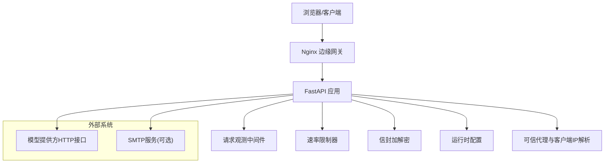
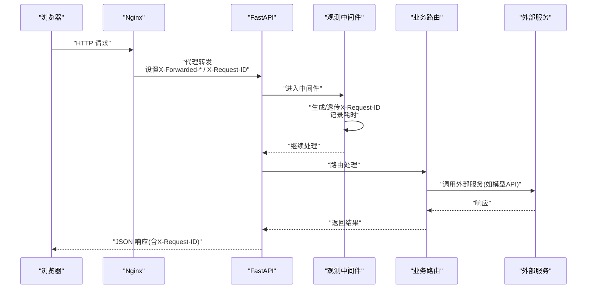
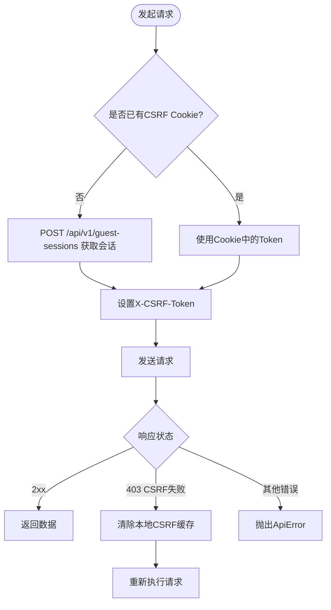
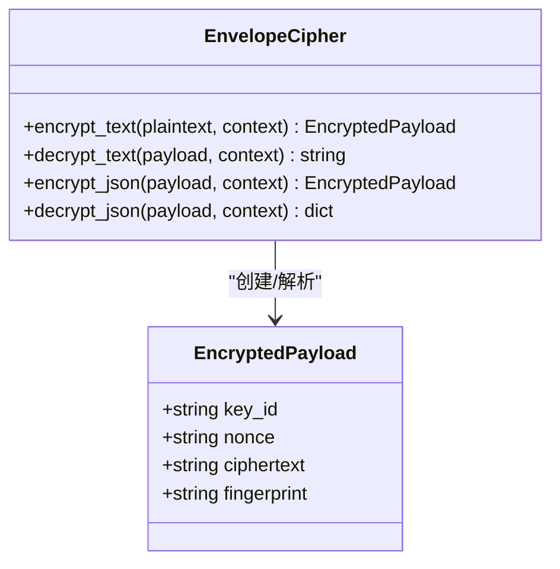
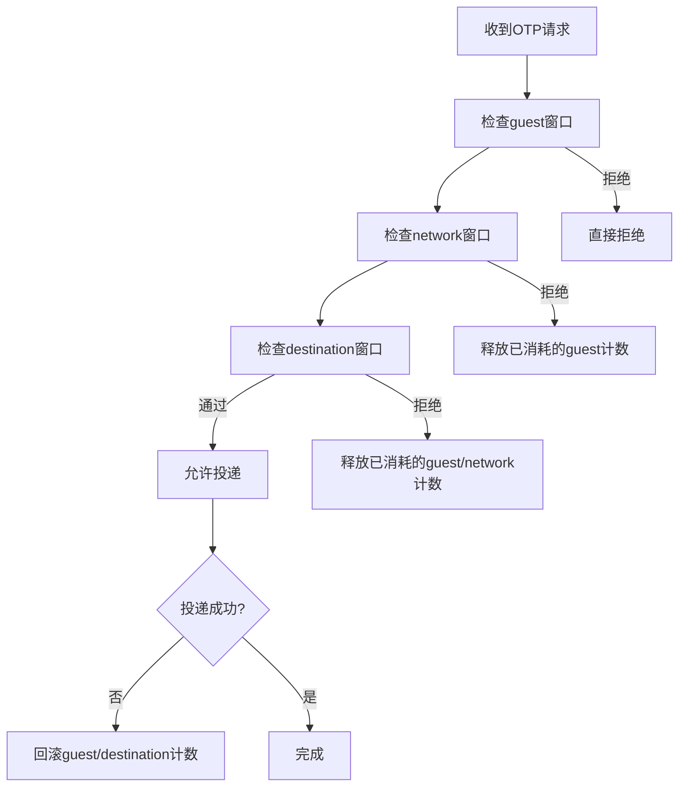
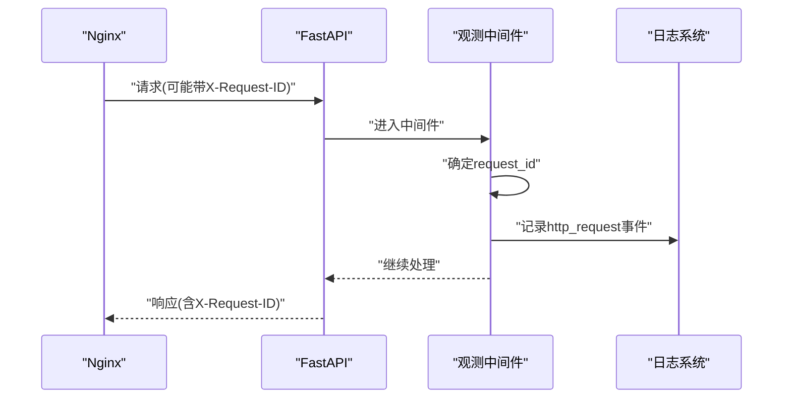
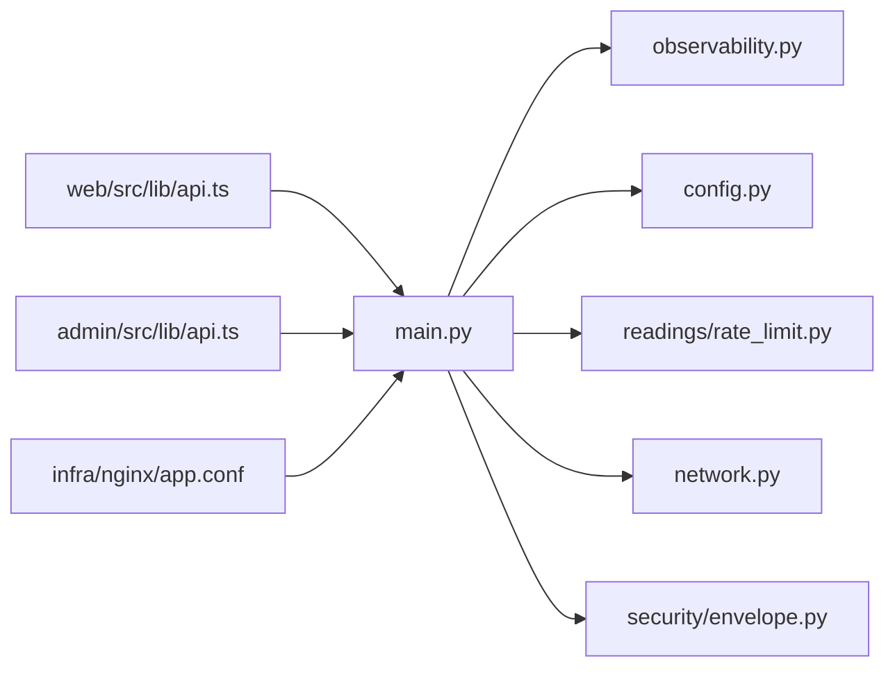

# 网络通信层

<cite>
**本文引用的文件**
- [backend/app/network.py](file://backend/app/network.py)
- [backend/app/observability.py](file://backend/app/observability.py)
- [backend/app/config.py](file://backend/app/config.py)
- [backend/app/main.py](file://backend/app/main.py)
- [backend/app/security/envelope.py](file://backend/app/security/envelope.py)
- [backend/app/readings/rate_limit.py](file://backend/app/readings/rate_limit.py)
- [backend/app/api/errors.py](file://backend/app/api/errors.py)
- [web/src/lib/api.ts](file://web/src/lib/api.ts)
- [admin/src/lib/api.ts](file://admin/src/lib/api.ts)
- [infra/nginx/app.conf](file://infra/nginx/app.conf)
- [infra/compose.local.yml](file://infra/compose.local.yml)
</cite>

## 目录
1. [简介](#简介)
2. [项目结构](#项目结构)
3. [核心组件](#核心组件)
4. [架构总览](#架构总览)
5. [详细组件分析](#详细组件分析)
6. [依赖关系分析](#依赖关系分析)
7. [性能考量](#性能考量)
8. [故障排查指南](#故障排查指南)
9. [结论](#结论)
10. [附录](#附录)

## 简介
本文件聚焦于项目的网络通信层，覆盖 HTTP 客户端配置、请求拦截器（签名、解密、缓存）、错误处理（网络异常、超时、熔断式限流）、监控与追踪（链路 ID、指标、错误上报）、安全配置（TLS、HTTPS、CORS）等主题。文档同时提供架构图、配置示例与优化建议，帮助读者从整体到细节掌握该层的实现与使用方式。

## 项目结构
后端以 FastAPI 应用为核心，通过中间件完成请求观测与链路追踪；Nginx 作为边缘网关统一转发并注入安全头；前端（Web 与 Admin）各自封装了统一的 fetch 调用与 CSRF 处理；配置集中管理，包含模型调用超时、内容加密密钥、可信代理网段等关键参数。

**图示来源**
- [infra/nginx/app.conf:16-32](file://infra/nginx/app.conf#L16-L32)
- [backend/app/main.py:50-140](file://backend/app/main.py#L50-L140)
- [backend/app/observability.py:27-51](file://backend/app/observability.py#L27-L51)
- [backend/app/config.py:62-149](file://backend/app/config.py#L62-L149)

**章节来源**
- [infra/nginx/app.conf:1-44](file://infra/nginx/app.conf#L1-L44)
- [backend/app/main.py:30-156](file://backend/app/main.py#L30-L156)
- [backend/app/observability.py:1-51](file://backend/app/observability.py#L1-L51)
- [backend/app/config.py:62-149](file://backend/app/config.py#L62-L149)

## 核心组件
- HTTP 客户端与拦截器
  - Web 端：统一封装 fetch，自动携带凭证、CSRF Token、幂等键，并对 403 CSRF 失败进行重试。
  - Admin 端：统一封装 fetch，强制 no-store 缓存策略，自动注入 CSRF。
- 请求观测与追踪
  - 中间件生成或透传 X-Request-ID，记录方法、路径、状态码、耗时。
- 安全与加解密
  - 信封加解密：AES-256-GCM + HMAC 指纹，支持文本与 JSON 的加解密。
  - 配置校验：生产环境强制 secure cookie、固定路径、白名单模型地址等。
- 速率限制与“类熔断”保护
  - 进程内滑动窗口限流器，用于写操作与 OTP 请求的多维限速。
  - 在投递失败时回滚 guest/destination 窗口，保留 network 窗口，避免攻击者利用故障绕过限制。
- 可信代理与客户端 IP 解析
  - 基于 trusted proxy CIDR 列表，从 X-Forwarded-For 链中挑选最近不可信地址作为稳定客户端 IP。

**章节来源**
- [web/src/lib/api.ts:256-385](file://web/src/lib/api.ts#L256-L385)
- [admin/src/lib/api.ts:43-79](file://admin/src/lib/api.ts#L43-L79)
- [backend/app/observability.py:20-51](file://backend/app/observability.py#L20-L51)
- [backend/app/security/envelope.py:32-122](file://backend/app/security/envelope.py#L32-L122)
- [backend/app/readings/rate_limit.py:9-60](file://backend/app/readings/rate_limit.py#L9-L60)
- [backend/app/network.py:16-72](file://backend/app/network.py#L16-L72)

## 架构总览
下图展示一次典型请求从浏览器到后端的完整链路，包括 Nginx 注入的安全头、FastAPI 中间件的观测、业务路由的处理以及对外部服务的调用。

**图示来源**
- [infra/nginx/app.conf:16-32](file://infra/nginx/app.conf#L16-L32)
- [backend/app/observability.py:27-51](file://backend/app/observability.py#L27-L51)

## 详细组件分析

### HTTP 客户端配置与拦截器
- Web 端
  - 统一请求函数：自动 include credentials，解析 JSON 响应，非 2xx 抛出 ApiError。
  - CSRF 流程：优先读取 Cookie，否则发起会话获取；遇到 403 清除缓存并重试。
  - 幂等性：为写操作生成 Idempotency-Key 并附加到请求头。
- Admin 端
  - 统一 fetch：强制 application/json、same-origin、no-store，自动注入 CSRF。
  - 错误包装：将失败响应转为结构化对象，便于上层处理。

**图示来源**
- [web/src/lib/api.ts:256-385](file://web/src/lib/api.ts#L256-L385)

**章节来源**
- [web/src/lib/api.ts:256-385](file://web/src/lib/api.ts#L256-L385)
- [admin/src/lib/api.ts:43-79](file://admin/src/lib/api.ts#L43-L79)

### 连接池、超时与重试策略
- 连接池
  - 浏览器侧：由浏览器内置 HTTP 栈管理连接复用与连接池，无需显式配置。
  - 后端侧：FastAPI 基于 ASGI/HTTP 服务器运行，连接复用由底层框架与服务器负责。
- 超时
  - 模型调用：配置项包含连接、读取、总体超时上限，并在生产环境强制边界检查。
  - 传输日志级别：对 httpx/httpcore/h2/hpack 等敏感传输日志降级至 WARNING，防止泄露敏感信息。
- 重试
  - Web 端：仅针对 403 CSRF 失败进行一次性重试（清理缓存后重发）。
  - 后端：未实现通用重试；对于外部服务调用，超时与错误由上层适配器与测试用例约束行为。

**章节来源**
- [backend/app/config.py:108-115](file://backend/app/config.py#L108-L115)
- [backend/app/config.py:253-267](file://backend/app/config.py#L253-L267)
- [backend/app/observability.py:14-18](file://backend/app/observability.py#L14-L18)
- [web/src/lib/api.ts:317-329](file://web/src/lib/api.ts#L317-L329)

### 请求签名、响应解密与缓存机制
- 请求签名
  - 当前代码库未实现通用的请求签名拦截器；幂等性通过 Idempotency-Key 保障写操作的幂等。
- 响应解密
  - 信封加解密：使用 AES-256-GCM 与 HMAC 指纹，支持文本与 JSON 的加解密；key_id 必须匹配，上下文需一致。
- 缓存
  - Nginx：API 路径强制 private, no-store, max-age=0，禁止中间层缓存。
  - Admin 端：fetch 强制 cache: no-store。
  - Web 端：未启用浏览器缓存；通过 CSRF 与会话控制访问。

**图示来源**
- [backend/app/security/envelope.py:24-122](file://backend/app/security/envelope.py#L24-L122)

**章节来源**
- [backend/app/security/envelope.py:32-122](file://backend/app/security/envelope.py#L32-L122)
- [infra/nginx/app.conf:16-32](file://infra/nginx/app.conf#L16-L32)
- [admin/src/lib/api.ts:55-60](file://admin/src/lib/api.ts#L55-L60)

### 错误处理：网络异常、超时与“熔断”模式
- 网络异常
  - Web 端：非 2xx 响应统一抛出 ApiError，携带 status 与 detail。
  - Admin 端：将失败响应包装为结构化对象，便于上层判断。
- 超时
  - 后端模型调用：配置项限定 connect/read/overall 超时，生产环境强制上限；测试验证不会泄露敏感值。
- “熔断”式限流
  - OTP 请求多维限速：guest/network/destination 三层窗口，失败时回滚 guest/destination 计数，保留 network 计数，防止攻击者利用故障绕过限制。
  - 写操作限流：滑动窗口限流器，超限返回 retry_after。

**图示来源**
- [backend/app/identity/otp.py:86-140](file://backend/app/identity/otp.py#L86-L140)

**章节来源**
- [web/src/lib/api.ts:256-284](file://web/src/lib/api.ts#L256-L284)
- [admin/src/lib/api.ts:61-79](file://admin/src/lib/api.ts#L61-L79)
- [backend/app/readings/rate_limit.py:9-60](file://backend/app/readings/rate_limit.py#L9-L60)
- [backend/app/identity/otp.py:64-180](file://backend/app/identity/otp.py#L64-L180)

### 监控与追踪：链路追踪、指标收集与错误上报
- 链路追踪
  - 中间件生成或透传 X-Request-ID，并在响应头中返回，便于全链路追踪。
- 指标收集
  - 中间件记录事件：http_request，包含 request_id、method、path、status、duration_ms。
- 错误上报
  - 当前未集成外部错误上报；可通过日志聚合平台采集结构化日志进行分析。

**图示来源**
- [backend/app/observability.py:20-51](file://backend/app/observability.py#L20-L51)

**章节来源**
- [backend/app/observability.py:20-51](file://backend/app/observability.py#L20-L51)

### 安全配置：TLS、HTTPS 与 CORS
- TLS/HTTPS
  - Nginx 作为边缘入口，可配置 HTTPS 终止与证书管理（本项目仓库未包含证书文件，但提供了安全头与反代配置）。
  - 生产环境强制 secure cookie，避免明文传输敏感 Cookie。
- CORS
  - 当前仓库未实现显式 CORS 策略；如需跨域，应在 Nginx 或 FastAPI 层添加相应头。
- 安全头
  - Nginx 为 API 路径重复声明安全头，确保不被继承中断：X-Content-Type-Options、X-Frame-Options、Referrer-Policy、Permissions-Policy、Cache-Control。

**章节来源**
- [infra/nginx/app.conf:1-44](file://infra/nginx/app.conf#L1-L44)
- [backend/app/config.py:188-193](file://backend/app/config.py#L188-L193)

## 依赖关系分析
- 模块耦合
  - main.py 组装应用、注册中间件、初始化限流器与可信代理网段。
  - observability.py 提供请求观测中间件，被 main.py 安装。
  - config.py 提供 Settings，约束生产安全与模型调用参数。
  - security/envelope.py 提供信封加解密能力，供业务层按需使用。
  - readings/rate_limit.py 提供滑动窗口限流，被 main.py 初始化并挂载到应用状态。
  - network.py 提供可信代理与客户端 IP 解析，被 main.py 初始化并挂载到应用状态。
  - web/admin 前端分别封装 fetch，依赖后端提供的会话与 CSRF 机制。

**图示来源**
- [backend/app/main.py:50-140](file://backend/app/main.py#L50-L140)
- [backend/app/observability.py:27-51](file://backend/app/observability.py#L27-L51)
- [backend/app/config.py:62-149](file://backend/app/config.py#L62-L149)
- [backend/app/readings/rate_limit.py:9-60](file://backend/app/readings/rate_limit.py#L9-L60)
- [backend/app/network.py:16-72](file://backend/app/network.py#L16-L72)
- [backend/app/security/envelope.py:32-122](file://backend/app/security/envelope.py#L32-L122)
- [web/src/lib/api.ts:256-385](file://web/src/lib/api.ts#L256-L385)
- [admin/src/lib/api.ts:43-79](file://admin/src/lib/api.ts#L43-L79)
- [infra/nginx/app.conf:16-32](file://infra/nginx/app.conf#L16-L32)

**章节来源**
- [backend/app/main.py:30-156](file://backend/app/main.py#L30-L156)
- [backend/app/observability.py:1-51](file://backend/app/observability.py#L1-L51)
- [backend/app/config.py:62-149](file://backend/app/config.py#L62-L149)
- [backend/app/readings/rate_limit.py:1-61](file://backend/app/readings/rate_limit.py#L1-L61)
- [backend/app/network.py:1-72](file://backend/app/network.py#L1-L72)
- [backend/app/security/envelope.py:1-122](file://backend/app/security/envelope.py#L1-L122)
- [web/src/lib/api.ts:1-537](file://web/src/lib/api.ts#L1-L537)
- [admin/src/lib/api.ts:1-80](file://admin/src/lib/api.ts#L1-L80)
- [infra/nginx/app.conf:1-44](file://infra/nginx/app.conf#L1-L44)

## 性能考量
- 连接复用
  - 浏览器与服务器均具备连接复用能力；避免频繁建立新连接可降低延迟。
- 超时与资源占用
  - 合理设置模型调用的 connect/read/overall 超时，防止长尾请求占用资源。
  - 限制响应体大小，避免大响应导致内存压力。
- 缓存策略
  - API 路径禁用缓存，减少脏读风险；静态资源可在 CDN 层缓存以提升性能。
- 限流与背压
  - 使用滑动窗口限流器保护写操作与 OTP 请求，避免雪崩。
- 日志与追踪
  - 结构化日志与 X-Request-ID 有助于定位慢请求与异常。

[本节为通用指导，不直接分析具体文件]

## 故障排查指南
- 常见问题
  - CSRF 失败：检查 Cookie 是否存在且有效；必要时触发会话刷新。
  - 429 限流：根据 retry_after 提示等待；检查 guest/network/destination 窗口是否耗尽。
  - 503 服务不可用：可能是外部服务故障；观察网络窗口是否因失败而累积。
- 诊断步骤
  - 查看 X-Request-ID 对应日志，确认请求路径与耗时。
  - 检查 Nginx 安全头是否正确注入。
  - 核对配置项（如 trusted_proxy_cidrs、超时、模型白名单）。
- 相关错误类型
  - ApiProblem：业务错误，携带 status/title/detail。
  - RateLimitExceededError：限流超限，包含 retry_after_seconds。
  - EnvelopeDecryptionError：加解密失败，检查 key_id、context、nonce/ciphertext。

**章节来源**
- [backend/app/api/errors.py:1-17](file://backend/app/api/errors.py#L1-L17)
- [backend/app/readings/rate_limit.py:55-60](file://backend/app/readings/rate_limit.py#L55-L60)
- [backend/app/security/envelope.py:20-22](file://backend/app/security/envelope.py#L20-L22)
- [backend/app/observability.py:20-51](file://backend/app/observability.py#L20-L51)

## 结论
该网络通信层以 FastAPI 为核心，结合 Nginx 边缘网关与前端统一客户端封装，实现了安全的请求处理、可靠的链路追踪与健壮的限流保护。通过严格的配置校验与信封加解密，保障了生产环境的安全性与可控性。建议在后续迭代中补充 CORS 策略与外部错误上报能力，进一步提升可观测性与可用性。

[本节为总结，不直接分析具体文件]

## 附录
- 配置示例（环境变量）
  - MINGLI_TRUSTED_PROXY_CIDRS：可信代理网段，逗号分隔。
  - MINGLI_COOKIE_SECURE：生产环境应启用。
  - MINGLI_MODEL_CONNECT_TIMEOUT_SECONDS / READ_TIMEOUT_SECONDS / OVERALL_TIMEOUT_SECONDS：模型调用超时。
  - MINGLI_CONTENT_ENCRYPTION_KEY_B64 / CONTENT_ENCRYPTION_KEY_ID：内容加密密钥与标识。
- 参考位置
  - 环境变量定义与默认值：[backend/app/config.py:62-149](file://backend/app/config.py#L62-L149)
  - Compose 环境注入：[infra/compose.local.yml:31-42](file://infra/compose.local.yml#L31-L42)

**章节来源**
- [backend/app/config.py:62-149](file://backend/app/config.py#L62-L149)
- [infra/compose.local.yml:31-42](file://infra/compose.local.yml#L31-L42)