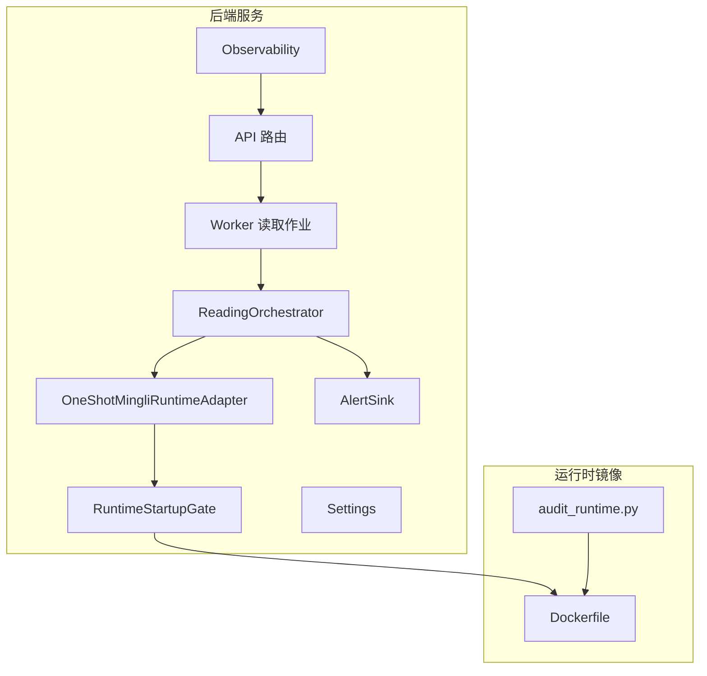
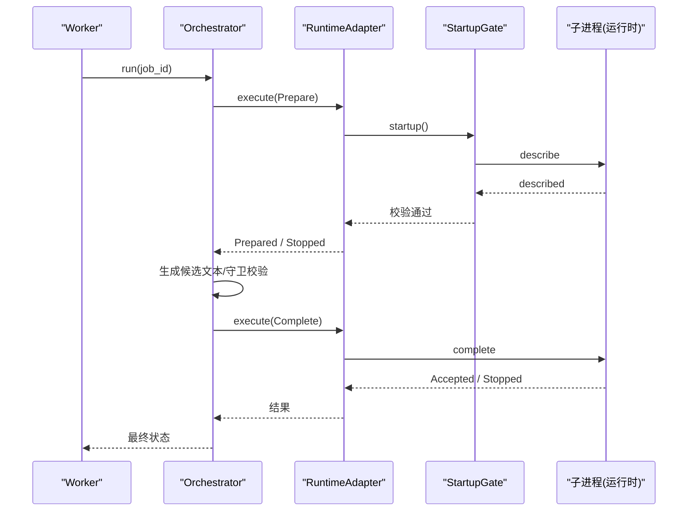
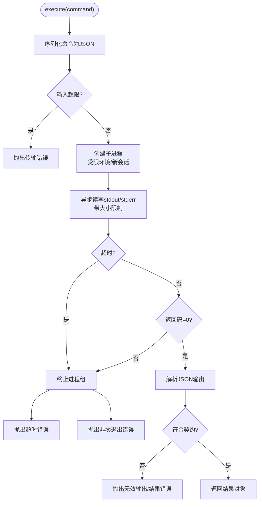
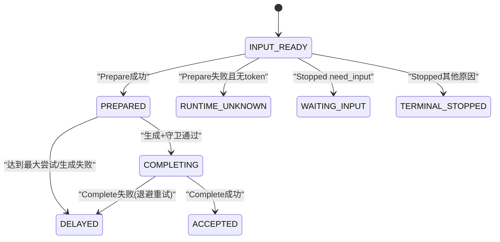
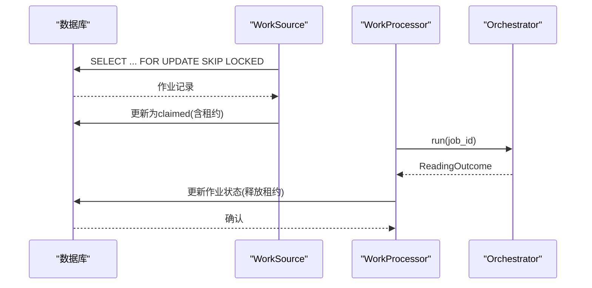
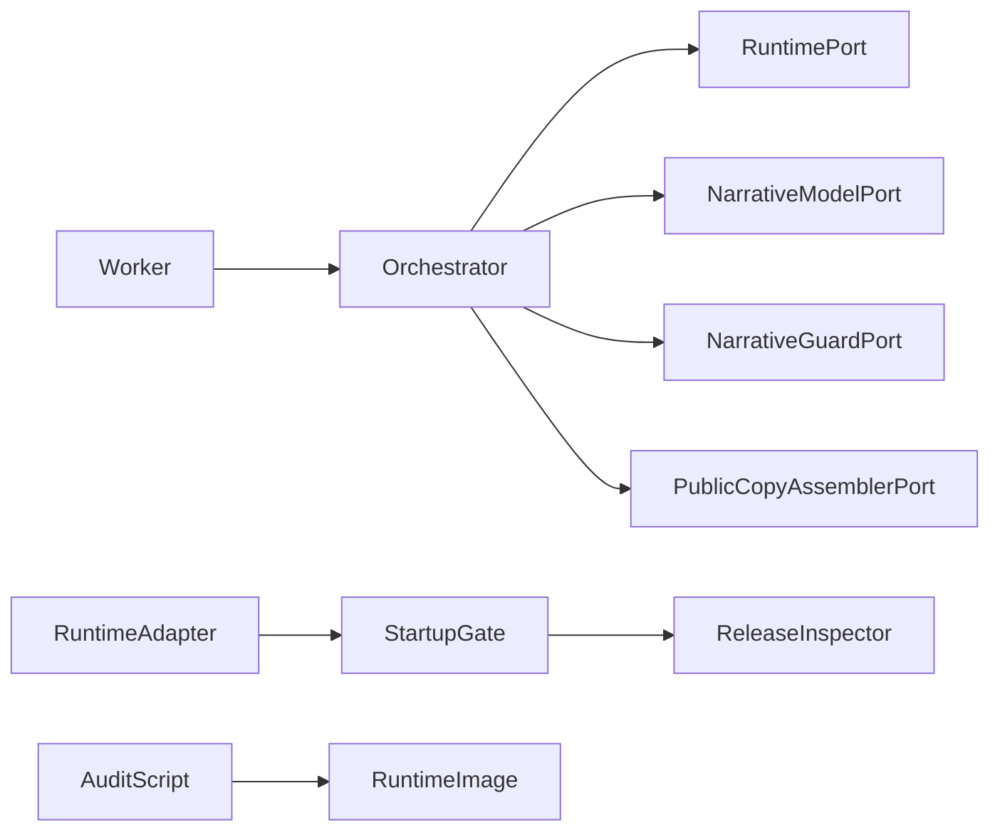

# 运行时引擎集成

<cite>
**本文引用的文件**
- [backend/app/adapters/runtime.py](file://backend/app/adapters/runtime.py)
- [backend/app/readings/orchestrator.py](file://backend/app/readings/orchestrator.py)
- [backend/worker/readings.py](file://backend/worker/readings.py)
- [backend/app/config.py](file://backend/app/config.py)
- [infra/mingli-runtime/audit_runtime.py](file://infra/mingli-runtime/audit_runtime.py)
- [infra/mingli-runtime/Dockerfile](file://infra/mingli-runtime/Dockerfile)
- [backend/app/readings/runtime_contracts.py](file://backend/app/readings/runtime_contracts.py)
- [backend/app/observability.py](file://backend/app/observability.py)
- [backend/app/readings/alerts.py](file://backend/app/readings/alerts.py)
</cite>

## 目录
1. [简介](#简介)
2. [项目结构](#项目结构)
3. [核心组件](#核心组件)
4. [架构总览](#架构总览)
5. [详细组件分析](#详细组件分析)
6. [依赖关系分析](#依赖关系分析)
7. [性能考虑](#性能考虑)
8. [故障诊断指南](#故障诊断指南)
9. [结论](#结论)
10. [附录](#附录)

## 简介
本文件面向“命理计算”系统的运行时引擎集成，聚焦以下目标：
- 进程隔离、资源管理与生命周期控制：通过一次性子进程适配器与启动门控，确保外部运行时在安全边界内执行。
- 任务编排器：工作流定义、依赖管理与并发控制，覆盖准备、生成、完成三阶段状态机与重试/延迟策略。
- 性能优化：内存与I/O限制、超时控制、背压与退避、模型调用参数冻结。
- 监控与调试：结构化日志、请求追踪、告警事件、审计探针与发布物校验。
- 扩展机制：新算法接入（Provider）、插件式适配器、版本与能力集管理。

## 项目结构
后端服务由API层、工作进程、运行时适配器、编排器、契约与配置组成；运行时镜像提供可验证的固定环境、工具链与审计脚本。

图表来源
- [backend/app/readings/orchestrator.py:178-248](file://backend/app/readings/orchestrator.py#L178-L248)
- [backend/app/adapters/runtime.py:605-756](file://backend/app/adapters/runtime.py#L605-L756)
- [infra/mingli-runtime/Dockerfile:154-229](file://infra/mingli-runtime/Dockerfile#L154-L229)
- [infra/mingli-runtime/audit_runtime.py:351-393](file://infra/mingli-runtime/audit_runtime.py#L351-L393)

章节来源
- [backend/app/readings/orchestrator.py:178-248](file://backend/app/readings/orchestrator.py#L178-L248)
- [backend/app/adapters/runtime.py:605-756](file://backend/app/adapters/runtime.py#L605-L756)
- [infra/mingli-runtime/Dockerfile:154-229](file://infra/mingli-runtime/Dockerfile#L154-L229)
- [infra/mingli-runtime/audit_runtime.py:351-393](file://infra/mingli-runtime/audit_runtime.py#L351-L393)

## 核心组件
- 运行时适配器与启动门控：一次性子进程执行固定协议，启动前进行发布物完整性校验与能力集一致性检查。
- 编排器：驱动 Prepare → Generate → Complete 的状态机，处理输入等待、重试、延迟与终止。
- 工作进程：从数据库领取作业，使用租约防重入，持久化中间状态并映射到作业状态。
- 配置与安全：严格的环境变量约束，生产环境强制固定路径与白名单。
- 可观测性：结构化HTTP日志、告警事件、审计探针与发布物校验。

章节来源
- [backend/app/adapters/runtime.py:54-67](file://backend/app/adapters/runtime.py#L54-L67)
- [backend/app/adapters/runtime.py:486-544](file://backend/app/adapters/runtime.py#L486-L544)
- [backend/app/readings/orchestrator.py:178-248](file://backend/app/readings/orchestrator.py#L178-L248)
- [backend/worker/readings.py:234-286](file://backend/worker/readings.py#L234-L286)
- [backend/app/config.py:62-149](file://backend/app/config.py#L62-L149)
- [backend/app/observability.py:14-51](file://backend/app/observability.py#L14-L51)
- [backend/app/readings/alerts.py:16-75](file://backend/app/readings/alerts.py#L16-L75)

## 架构总览
系统采用“进程隔离 + 契约校验 + 编排状态机”的分层设计：
- API/Worker 仅持有轻量级适配器接口，不直接感知外部运行时实现细节。
- 启动门控在首次Describe时校验协议版本、能力集形状、发布物清单与证据索引。
- 编排器维护作业状态机，将运行时结果转换为统一的工作流状态，并通过告警与日志暴露运行期行为。
- 运行时镜像包含固定Python、Node、Git与工具链，配合审计脚本对运行时进行机器级断言。

图表来源
- [backend/app/readings/orchestrator.py:212-248](file://backend/app/readings/orchestrator.py#L212-L248)
- [backend/app/adapters/runtime.py:495-544](file://backend/app/adapters/runtime.py#L495-L544)
- [backend/app/adapters/runtime.py:641-707](file://backend/app/adapters/runtime.py#L641-L707)

## 详细组件分析

### 运行时适配器与进程隔离
- 一次性子进程执行：每个命令以独立进程运行，设置受限环境变量、最小PATH、禁止写入字节码、UTC时区等，降低污染面。
- I/O与超时保护：stdin/stdout/stderr大小上限、异步读取限长、超时后整进程组被终止，避免僵尸进程。
- 启动门控：在启动时校验发布物清单、闭包覆盖、提供者目录、参考包与证据索引，确保只允许受信任的发布物进入。
- 能力集一致性：要求运行时描述恰好13个Provider且能力形状哈希匹配，防止漂移。

图表来源
- [backend/app/adapters/runtime.py:546-597](file://backend/app/adapters/runtime.py#L546-L597)
- [backend/app/adapters/runtime.py:641-707](file://backend/app/adapters/runtime.py#L641-L707)

章节来源
- [backend/app/adapters/runtime.py:69-67](file://backend/app/adapters/runtime.py#L69-L67)
- [backend/app/adapters/runtime.py:486-544](file://backend/app/adapters/runtime.py#L486-L544)
- [backend/app/adapters/runtime.py:605-707](file://backend/app/adapters/runtime.py#L605-L707)

### 任务编排器与工作流
- 状态机：INPUT_READY → PREPARED → COMPLETING → ACCEPTED；支持WAITING_INPUT、TERMINAL_STOPPED、DELAYED、RUNTIME_UNKNOWN。
- 重试与延迟：Prepare失败且无state_token时标记RUNTIME_UNKNOWN；达到最大尝试次数或生成失败则置为DELAYED并告警。
- 幂等与恢复：Complete阶段已持久化意图，若传输失败会按退避重试；Accepted需校验token与public_copy一致。
- 依赖管理：Prepare产出Brief，随后构造NarrativeRequest，经模型生成与守卫校验后组装公开副本。

图表来源
- [backend/app/readings/orchestrator.py:212-248](file://backend/app/readings/orchestrator.py#L212-L248)
- [backend/app/readings/orchestrator.py:287-394](file://backend/app/readings/orchestrator.py#L287-L394)
- [backend/app/readings/orchestrator.py:396-435](file://backend/app/readings/orchestrator.py#L396-L435)

章节来源
- [backend/app/readings/orchestrator.py:43-79](file://backend/app/readings/orchestrator.py#L43-L79)
- [backend/app/readings/orchestrator.py:178-248](file://backend/app/readings/orchestrator.py#L178-L248)
- [backend/app/readings/orchestrator.py:287-394](file://backend/app/readings/orchestrator.py#L287-L394)
- [backend/app/readings/orchestrator.py:396-435](file://backend/app/readings/orchestrator.py#L396-L435)

### 工作进程与并发控制
- 作业领取：基于SQL查询与for_update(skip_locked=True)实现无锁竞争领取，支持过期租约回收。
- 租约防重入：claimed状态记录lease_owner、lease_token、lease_generation与过期时间，提交更新时再次校验，避免并发写冲突。
- 状态映射：将编排器状态映射为作业表状态，支持queued/waiting_input/stopped/delayed/runtime_unknown/complete。
- 工厂装配：根据配置注入真实或Fake运行时与模型适配器，生产环境强制真实适配器。

图表来源
- [backend/worker/readings.py:63-82](file://backend/worker/readings.py#L63-L82)
- [backend/worker/readings.py:121-161](file://backend/worker/readings.py#L121-L161)
- [backend/worker/readings.py:175-218](file://backend/worker/readings.py#L175-L218)
- [backend/worker/readings.py:234-286](file://backend/worker/readings.py#L234-L286)

章节来源
- [backend/worker/readings.py:63-82](file://backend/worker/readings.py#L63-L82)
- [backend/worker/readings.py:121-161](file://backend/worker/readings.py#L121-L161)
- [backend/worker/readings.py:175-218](file://backend/worker/readings.py#L175-L218)
- [backend/worker/readings.py:234-286](file://backend/worker/readings.py#L234-L286)

### 配置与安全基线
- 运行时路径与环境：生产环境强制固定launcher、Python、release root与state root，禁止相对路径。
- 发布物指纹：要求manifest digest与capability shape sha256与冻结值一致，防止未授权变更。
- 模型参数冻结：P0模型provider/profile/id/base_url/endpoint/thinking_mode均白名单校验，温度与tokens上限固定。
- 安全开关：生产禁用fake适配器与真实流量，启用告警收集。

章节来源
- [backend/app/config.py:62-149](file://backend/app/config.py#L62-L149)
- [backend/app/config.py:188-329](file://backend/app/config.py#L188-L329)

### 监控与调试
- HTTP可观测性：中间件注入request_id，记录方法、路径、状态码与耗时，响应头回传request_id便于链路追踪。
- 告警事件：编排器在guard拒绝、模型成本、延迟等场景发出ops_alert，本地/预发环境落盘结构化日志。
- 审计探针：镜像内审计脚本对describe重复性、超时杀进程、篡改发布物拒绝等进行断言，保障运行时可信。
- 契约校验：命令与结果通过JSON Schema校验，越界或不合规数据在入口处拦截。

章节来源
- [backend/app/observability.py:14-51](file://backend/app/observability.py#L14-L51)
- [backend/app/readings/alerts.py:16-75](file://backend/app/readings/alerts.py#L16-L75)
- [infra/mingli-runtime/audit_runtime.py:351-393](file://infra/mingli-runtime/audit_runtime.py#L351-L393)
- [backend/app/readings/runtime_contracts.py:27-40](file://backend/app/readings/runtime_contracts.py#L27-L40)

### 扩展机制
- 新算法接入：新增Provider需在发布物清单与提供者目录中声明，并在运行时描述capabilities中体现；能力形状sha256随之变化，需同步配置。
- 插件架构：RuntimePort/NarrativeModelPort/NarrativeGuardPort/PublicCopyAssemblerPort均为Protocol，可替换实现以适配不同后端。
- 版本管理：通过冻结manifest digest与capability shape sha256锁定版本；镜像构建产物与审计报告绑定，保证可追溯。

章节来源
- [backend/app/adapters/runtime.py:476-544](file://backend/app/adapters/runtime.py#L476-L544)
- [backend/app/readings/orchestrator.py:85-109](file://backend/app/readings/orchestrator.py#L85-L109)
- [infra/mingli-runtime/Dockerfile:154-229](file://infra/mingli-runtime/Dockerfile#L154-L229)

## 依赖关系分析
- 编排器依赖运行时适配器、模型适配器、守卫与公开副本组装器，通过Protocol解耦。
- 工作进程依赖数据库会话、编排器工厂与告警接收器，负责作业领取与状态持久化。
- 运行时适配器依赖配置与契约类型，启动门控依赖发布物检查器。
- 审计脚本依赖镜像内工具链，对运行时进行机器级断言。

图表来源
- [backend/app/readings/orchestrator.py:85-109](file://backend/app/readings/orchestrator.py#L85-L109)
- [backend/app/adapters/runtime.py:486-544](file://backend/app/adapters/runtime.py#L486-L544)
- [backend/worker/readings.py:234-286](file://backend/worker/readings.py#L234-L286)
- [infra/mingli-runtime/audit_runtime.py:351-393](file://infra/mingli-runtime/audit_runtime.py#L351-L393)

章节来源
- [backend/app/readings/orchestrator.py:85-109](file://backend/app/readings/orchestrator.py#L85-L109)
- [backend/app/adapters/runtime.py:486-544](file://backend/app/adapters/runtime.py#L486-L544)
- [backend/worker/readings.py:234-286](file://backend/worker/readings.py#L234-L286)
- [infra/mingli-runtime/audit_runtime.py:351-393](file://infra/mingli-runtime/audit_runtime.py#L351-L393)

## 性能考虑
- 内存与I/O限制：stdin/stdout/stderr上限防止OOM与无限增长；超时后整进程组被终止，避免资源泄漏。
- CPU调度：一次性子进程天然隔离，避免长时间占用主进程线程；可通过Worker并发度与数据库锁粒度调节吞吐。
- 负载均衡：数据库层面的skip_locked领取与租约机制天然支持多Worker水平扩展；状态机中的DELAYED用于削峰填谷。
- 模型调用参数冻结：温度与tokens上限固定，减少波动带来的不确定性；整体超时覆盖连接与读取超时，避免挂起。
- 背压与重试：Prepare与Complete阶段分别配置退避时间，失败时延后重试，降低瞬时压力。

[本节为通用指导，不直接分析具体文件]

## 故障诊断指南
- 运行时未知：当Prepare失败且无state_token时，作业进入RUNTIME_UNKNOWN，需检查子进程启动、环境变量与发布物完整性。
- 输入等待：Stopped reason为need_input时，作业进入WAITING_INPUT，需补充必要输入字段。
- 生成失败：达到最大尝试次数或守卫拒绝，作业进入DELAYED，查看告警事件中的errors与attempt信息。
- 完成失败：Complete阶段失败会按退避重试，若持续失败检查持久化意图与运行时Accept一致性。
- 发布物篡改：审计探针会拒绝被修改的发布物，检查镜像构建与校验流程。
- 超时与僵尸进程：审计探针验证超时能杀死整个进程组，若残留进程需检查信号处理与进程组ID。

章节来源
- [backend/app/readings/orchestrator.py:250-285](file://backend/app/readings/orchestrator.py#L250-L285)
- [backend/app/readings/orchestrator.py:287-394](file://backend/app/readings/orchestrator.py#L287-L394)
- [backend/app/readings/orchestrator.py:396-435](file://backend/app/readings/orchestrator.py#L396-L435)
- [infra/mingli-runtime/audit_runtime.py:251-348](file://infra/mingli-runtime/audit_runtime.py#L251-L348)
- [infra/mingli-runtime/audit_runtime.py:351-393](file://infra/mingli-runtime/audit_runtime.py#L351-L393)

## 结论
本系统集成通过严格的发布物校验、进程隔离与契约约束，构建了高可靠、可审计的命理计算运行时。编排器以明确的状态机管理复杂工作流，结合告警与日志实现可观测性。工作进程利用数据库锁与租约实现可扩展的并发处理。未来扩展新算法只需遵循契约与发布物规范，即可无缝接入。

[本节为总结，不直接分析具体文件]

## 附录
- 关键契约类型：Describe/Prepare/Complete命令与Described/Prepared/Accepted/Stopped结果，均在运行时契约模块中定义与校验。
- 镜像构建：Dockerfile分阶段构建依赖、工具链与生产镜像，最终入口为固定脚本，审计目标与生产目标一致。
- 审计脚本：提供characterization、runtime probes、tree identity、git smoke等能力，确保运行时环境与发布物一致。

章节来源
- [backend/app/readings/runtime_contracts.py:105-251](file://backend/app/readings/runtime_contracts.py#L105-L251)
- [infra/mingli-runtime/Dockerfile:154-229](file://infra/mingli-runtime/Dockerfile#L154-L229)
- [infra/mingli-runtime/audit_runtime.py:204-213](file://infra/mingli-runtime/audit_runtime.py#L204-L213)
- [infra/mingli-runtime/audit_runtime.py:351-393](file://infra/mingli-runtime/audit_runtime.py#L351-L393)