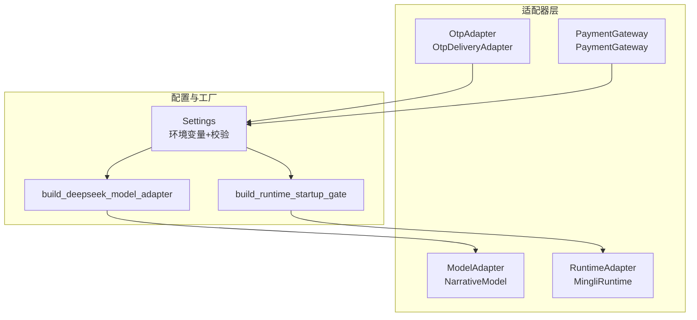
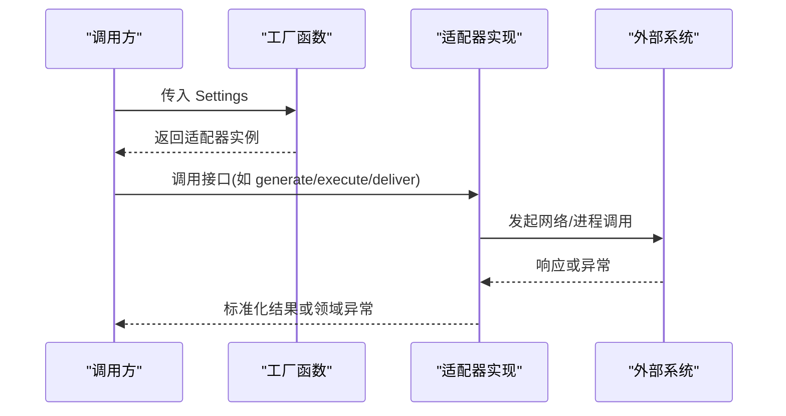
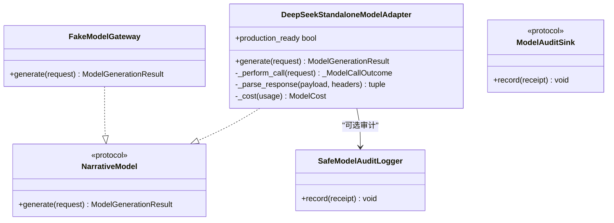
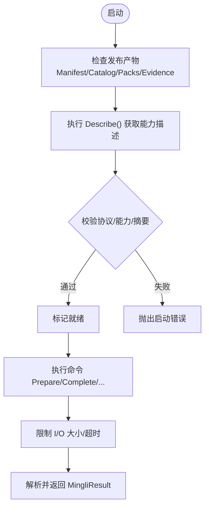
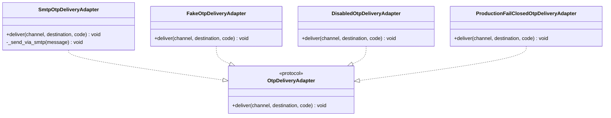
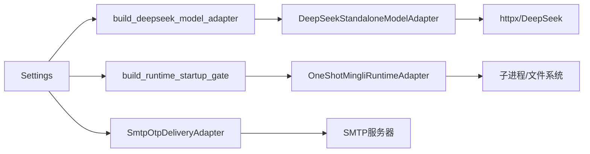

# 适配器模式设计

<cite>
**本文引用的文件**
- [backend/app/adapters/model.py](file://backend/app/adapters/model.py)
- [backend/app/adapters/otp.py](file://backend/app/adapters/otp.py)
- [backend/app/adapters/payment.py](file://backend/app/adapters/payment.py)
- [backend/app/adapters/runtime.py](file://backend/app/adapters/runtime.py)
- [backend/app/config.py](file://backend/app/config.py)
- [backend/app/readings/errors.py](file://backend/app/readings/errors.py)
- [backend/tests/test_fake_adapters.py](file://backend/tests/test_fake_adapters.py)
- [backend/tests/test_runtime_process_adapter.py](file://backend/tests/test_runtime_process_adapter.py)
</cite>

## 目录
1. [简介](#简介)
2. [项目结构](#项目结构)
3. [核心组件](#核心组件)
4. [架构总览](#架构总览)
5. [详细组件分析](#详细组件分析)
6. [依赖关系分析](#依赖关系分析)
7. [性能与可靠性考量](#性能与可靠性考量)
8. [故障排查指南](#故障排查指南)
9. [结论](#结论)
10. [附录：接口规范与最佳实践](#附录接口规范与最佳实践)

## 简介
本仓库在外部能力边界（模型生成、运行时进程、短信/邮件验证码、支付网关）采用统一的适配器模式，通过协议（Protocol）定义抽象接口，提供生产实现与测试用 Fake 实现，并通过配置驱动与工厂函数完成依赖注入与运行时切换。该设计将第三方服务异常映射为领域错误，结合严格的输入校验、资源限制和审计收据，确保系统可测试、可观测且在生产环境安全可控。

## 项目结构
适配器相关代码集中在 backend/app/adapters 目录下，按能力域划分：
- model.py：模型生成适配器（DeepSeek 生产实现 + Fake 实现），包含价格快照、审计日志、请求指纹、成本计算等。
- otp.py：OTP 发送适配器（SMTP 生产实现 + Fake/Disabled/ProductionFailClosed）。
- payment.py：支付网关适配器（Fake 实现，用于隔离真实支付流程）。
- runtime.py：命理运行时适配器（一次性子进程调用 + 启动门禁 + Fake 实现）。

配置集中于 app/config.py，使用 Pydantic Settings 从环境变量加载，并在验证阶段强制生产安全策略（禁止使用 Fake、锁定 P0 模型参数、路径白名单等）。

图表来源
- [backend/app/adapters/model.py:67-69](file://backend/app/adapters/model.py#L67-L69)
- [backend/app/adapters/runtime.py:54-56](file://backend/app/adapters/runtime.py#L54-L56)
- [backend/app/adapters/otp.py:20-21](file://backend/app/adapters/otp.py#L20-L21)
- [backend/app/adapters/payment.py:34-55](file://backend/app/adapters/payment.py#L34-L55)
- [backend/app/config.py:62-122](file://backend/app/config.py#L62-L122)

章节来源
- [backend/app/adapters/model.py:1-687](file://backend/app/adapters/model.py#L1-L687)
- [backend/app/adapters/otp.py:1-129](file://backend/app/adapters/otp.py#L1-L129)
- [backend/app/adapters/payment.py:1-92](file://backend/app/adapters/payment.py#L1-L92)
- [backend/app/adapters/runtime.py:1-935](file://backend/app/adapters/runtime.py#L1-L935)
- [backend/app/config.py:1-335](file://backend/app/config.py#L1-L335)

## 核心组件
- 统一接口规范（协议）
  - NarrativeModel：定义 generate(request) -> ModelGenerationResult。
  - MingliRuntime：定义 execute(command) -> MingliResult。
  - OtpDeliveryAdapter：定义 deliver(channel, destination, code)。
  - PaymentGateway：定义 create_checkout、verify_notification、query_payment、request_refund、query_refund。
- 抽象层与实现分离
  - 每个适配器既有生产实现（如 DeepSeekStandaloneModelAdapter、SmtpOtpDeliveryAdapter、OneShotMingliRuntimeAdapter），也有测试用 Fake（FakeModelGateway、FakeOtpDeliveryAdapter、FakePaymentGateway、FakeMingliRuntimeAdapter）。
- 依赖注入与工厂
  - build_deepseek_model_adapter(settings, ...)：根据 Settings 构造 DeepSeek 适配器实例。
  - build_runtime_startup_gate(settings)：构建 Runtime 启动门禁与一次性进程适配器。
- 配置驱动与运行时切换
  - Settings 中的 model_adapter、runtime_adapter、otp_adapter 决定启用哪个实现；生产环境强制禁用 Fake，并锁定关键参数。

章节来源
- [backend/app/adapters/model.py:67-69](file://backend/app/adapters/model.py#L67-L69)
- [backend/app/adapters/runtime.py:54-56](file://backend/app/adapters/runtime.py#L54-L56)
- [backend/app/adapters/otp.py:20-21](file://backend/app/adapters/otp.py#L20-L21)
- [backend/app/adapters/payment.py:34-55](file://backend/app/adapters/payment.py#L34-L55)
- [backend/app/adapters/model.py:553-586](file://backend/app/adapters/model.py#L553-L586)
- [backend/app/adapters/runtime.py:710-756](file://backend/app/adapters/runtime.py#L710-L756)
- [backend/app/config.py:62-122](file://backend/app/config.py#L62-L122)

## 架构总览
适配器层位于业务逻辑与外部系统之间，屏蔽差异、收敛错误、记录审计。上层仅依赖协议，不感知具体实现。

图表来源
- [backend/app/adapters/model.py:553-586](file://backend/app/adapters/model.py#L553-L586)
- [backend/app/adapters/runtime.py:710-756](file://backend/app/adapters/runtime.py#L710-L756)
- [backend/app/adapters/otp.py:57-129](file://backend/app/adapters/otp.py#L57-L129)

## 详细组件分析

### 模型适配器（NarrativeModel）
- 协议与数据契约
  - NarrativeModel.generate(NarrativeRequest) -> ModelGenerationResult。
  - 使用 ModelCallReceipt、ModelTokenUsage、ModelCost、ModelPriceSnapshot 记录用量与成本。
- 生产实现：DeepSeekStandaloneModelAdapter
  - 严格白名单 base_url、固定 temperature/max_output_tokens、禁止重定向/压缩编码、限制响应大小。
  - 将 HTTP 状态码与上游错误映射为 NarrativeGenerationError（含 error_code）。
  - 捕获超时、传输错误、解析错误，统一为领域错误；取消操作映射为 NarrativeGenerationCancelled。
  - 审计：SafeModelAuditLogger 仅记录受控元数据（用量、成本、指纹），不记录请求/响应体。
- 工厂与配置
  - build_deepseek_model_adapter(settings, ...) 校验 settings.model_adapter == "deepseek"，要求 API Key、价格快照版本与单价。
- Fake 实现：FakeModelGateway
  - 确定性输出，零网络开销，便于单元测试与集成测试。

图表来源
- [backend/app/adapters/model.py:67-69](file://backend/app/adapters/model.py#L67-L69)
- [backend/app/adapters/model.py:144-199](file://backend/app/adapters/model.py#L144-L199)
- [backend/app/adapters/model.py:200-334](file://backend/app/adapters/model.py#L200-L334)
- [backend/app/adapters/model.py:553-586](file://backend/app/adapters/model.py#L553-L586)
- [backend/app/adapters/model.py:601-687](file://backend/app/adapters/model.py#L601-L687)

章节来源
- [backend/app/adapters/model.py:1-687](file://backend/app/adapters/model.py#L1-L687)

### 运行时适配器（MingliRuntime）
- 协议：MingliRuntime.execute(MingliCommand) -> MingliResult。
- 一次性进程适配器：OneShotMingliRuntimeAdapter
  - 通过子进程执行固定 launcher，stdin/stdout 以 JSON 单向通信，严格限制 stdin/stdout/stderr 大小。
  - 超时后终止整个进程组，避免孤儿进程。
  - 对非零退出码、无效输出、非法结果进行错误转换，抛出 RuntimeTransportError。
  - 环境变量隔离（PATH 固定、HOME 置空、TZ=UTC），防止宿主环境影响。
- 启动门禁：RuntimeStartupGate
  - 启动时校验 Release Manifest、Provider Catalog、Reference Packs、Evidence Index 的完整性与一致性。
  - 校验协议版本、能力集、清单摘要、闭包覆盖范围，确保只允许受信任的发布产物运行。
- 工厂：build_runtime_startup_gate(settings)
  - 基于 Settings 构造 OneShotMingliRuntimeAdapter 与 FileSystemRuntimeReleaseInspector，并组装 Gate。
- Fake 实现：FakeMingliRuntimeAdapter
  - 确定性行为，不执行实际命理计算，用于端到端测试。

图表来源
- [backend/app/adapters/runtime.py:169-232](file://backend/app/adapters/runtime.py#L169-L232)
- [backend/app/adapters/runtime.py:487-544](file://backend/app/adapters/runtime.py#L487-L544)
- [backend/app/adapters/runtime.py:605-707](file://backend/app/adapters/runtime.py#L605-L707)
- [backend/app/adapters/runtime.py:710-756](file://backend/app/adapters/runtime.py#L710-L756)

章节来源
- [backend/app/adapters/runtime.py:1-935](file://backend/app/adapters/runtime.py#L1-L935)

### OTP 适配器（OtpDeliveryAdapter）
- 协议：deliver(channel, destination, code)。
- 生产实现：SmtpOtpDeliveryAdapter
  - 仅支持 email 通道；强制 STARTTLS 或 SSL，拒绝明文；凭据使用 SecretStr，不出现在异常文本中。
  - 异步发送，封装 smtplib 客户端工厂以便测试替换。
- 其他实现
  - FakeOtpDeliveryAdapter：本地记录投递信息。
  - DisabledOtpDeliveryAdapter：直接抛出不可用异常。
  - ProductionFailClosedOtpDeliveryAdapter：生产环境默认禁用，直到具备持久化挑战存储。

图表来源
- [backend/app/adapters/otp.py:20-21](file://backend/app/adapters/otp.py#L20-L21)
- [backend/app/adapters/otp.py:57-129](file://backend/app/adapters/otp.py#L57-L129)
- [backend/app/adapters/otp.py:31-55](file://backend/app/adapters/otp.py#L31-L55)

章节来源
- [backend/app/adapters/otp.py:1-129](file://backend/app/adapters/otp.py#L1-L129)

### 支付网关适配器（PaymentGateway）
- 协议：create_checkout、verify_notification、query_payment、request_refund、query_refund。
- 当前仅提供 FakePaymentGateway，所有操作返回“不可用”，确保测试不会触发真实资金流转。

章节来源
- [backend/app/adapters/payment.py:1-92](file://backend/app/adapters/payment.py#L1-L92)

## 依赖关系分析
- 配置到适配器的注入
  - Settings 提供 model_adapter、runtime_adapter、otp_adapter 以及各实现所需参数（如 deepseek_api_key、smtp_*、runtime_* 路径）。
  - 工厂函数读取 Settings 并创建具体适配器实例。
- 适配器到外部系统的耦合
  - 模型适配器依赖 httpx 访问 DeepSeek/DashScope。
  - 运行时适配器依赖操作系统进程管理（asyncio.subprocess）。
  - OTP 适配器依赖 stdlib smtplib。
- 错误体系
  - 外部异常被转换为领域错误（NarrativeGenerationError、RuntimeTransportError），保证上层无需感知底层细节。

图表来源
- [backend/app/config.py:62-122](file://backend/app/config.py#L62-L122)
- [backend/app/adapters/model.py:553-586](file://backend/app/adapters/model.py#L553-L586)
- [backend/app/adapters/runtime.py:710-756](file://backend/app/adapters/runtime.py#L710-L756)
- [backend/app/adapters/otp.py:57-129](file://backend/app/adapters/otp.py#L57-L129)

章节来源
- [backend/app/config.py:1-335](file://backend/app/config.py#L1-L335)
- [backend/app/adapters/model.py:553-586](file://backend/app/adapters/model.py#L553-L586)
- [backend/app/adapters/runtime.py:710-756](file://backend/app/adapters/runtime.py#L710-L756)
- [backend/app/adapters/otp.py:57-129](file://backend/app/adapters/otp.py#L57-L129)

## 性能与可靠性考量
- 超时与限流
  - 模型适配器设置 connect/read/overall 超时，限制响应字节数，避免内存溢出。
  - 运行时适配器限制 stdin/stdout/stderr 大小，超时后终止进程组，防止僵尸进程。
- 安全性
  - 模型适配器白名单 base_url，禁止重定向与压缩编码，固定温度与最大输出 token。
  - 运行时适配器固定 PATH、HOME、TZ，禁止符号链接，校验发布产物签名与闭包覆盖。
  - OTP 适配器强制 TLS，凭据使用 SecretStr，不在异常中泄露。
- 可观测性
  - 模型适配器记录受控审计收据（用量、成本、指纹），不记录敏感内容。
  - 运行时适配器将非零退出码与无效输出转换为明确错误码，便于定位问题。

[本节为通用指导，不直接分析具体文件]

## 故障排查指南
- 模型生成失败
  - 常见错误码：model_rate_limited、model_upstream_error、model_http_error、model_timeout、model_transport_error、model_invalid_response、model_unapproved_response。
  - 排查要点：检查 base_url 是否在白名单、API Key 是否注入、temperature/max_output_tokens 是否符合 P0 冻结值、响应体是否超限。
- 运行时适配器异常
  - 常见错误码：runtime_spawn_failed、runtime_timed_out、runtime_nonzero_exit、runtime_invalid_output、runtime_invalid_result、runtime_stdout_too_large、runtime_stderr_too_large。
  - 排查要点：launcher/python/release/state 路径是否正确、子进程是否存活、stdout/stderr 是否超限、JSON 输出是否合法。
- OTP 发送失败
  - 检查 SMTP 主机/端口/用户名/密码/发件人是否配置齐全，STARTTLS/SSL 是否可用。
  - 生产环境默认禁用 OTP 直发，需具备持久化挑战存储。

章节来源
- [backend/app/adapters/model.py:200-334](file://backend/app/adapters/model.py#L200-L334)
- [backend/app/adapters/runtime.py:605-707](file://backend/app/adapters/runtime.py#L605-L707)
- [backend/app/adapters/otp.py:57-129](file://backend/app/adapters/otp.py#L57-L129)
- [backend/app/readings/errors.py:1-30](file://backend/app/readings/errors.py#L1-L30)

## 结论
本项目通过协议抽象、工厂注入与配置驱动，实现了高内聚、低耦合的适配器层。生产实现强调安全、可观测与可回滚，测试实现提供确定性与无副作用的行为。错误处理将第三方异常映射为领域错误，配合严格的输入校验与资源限制，提升了系统的鲁棒性与可维护性。

[本节为总结，不直接分析具体文件]

## 附录：接口规范与最佳实践

### 接口规范
- NarrativeModel
  - generate(request: NarrativeRequest) -> ModelGenerationResult
- MingliRuntime
  - execute(command: MingliCommand) -> MingliResult
- OtpDeliveryAdapter
  - deliver(channel: "phone"|"email", destination: str, code: str) -> None
- PaymentGateway
  - create_checkout(order_id, amount_minor, currency) -> CheckoutResult
  - verify_notification(payload: bytes) -> PaymentNotificationResult
  - query_payment(attempt_id) -> PaymentQueryResult
  - request_refund(payment_id, amount_minor, reason) -> RefundResult
  - query_refund(refund_id) -> RefundResult

章节来源
- [backend/app/adapters/model.py:67-69](file://backend/app/adapters/model.py#L67-L69)
- [backend/app/adapters/runtime.py:54-56](file://backend/app/adapters/runtime.py#L54-L56)
- [backend/app/adapters/otp.py:20-21](file://backend/app/adapters/otp.py#L20-L21)
- [backend/app/adapters/payment.py:34-55](file://backend/app/adapters/payment.py#L34-L55)

### 注册机制与服务发现
- 动态加载与配置驱动
  - 通过 Settings 的 model_adapter/runtime_adapter/otp_adapter 选择实现。
  - 工厂函数依据配置创建对应适配器实例，实现“配置即装配”。
- 运行时切换
  - 修改环境变量并重启服务即可切换不同适配器（例如从 fake 切换到 deepseek/one-shot/smtp）。
- 服务发现
  - 运行时适配器通过 Describe() 获取能力列表，并与期望的能力集比对，确保只允许受信任的提供者运行。

章节来源
- [backend/app/config.py:62-122](file://backend/app/config.py#L62-L122)
- [backend/app/adapters/model.py:553-586](file://backend/app/adapters/model.py#L553-L586)
- [backend/app/adapters/runtime.py:710-756](file://backend/app/adapters/runtime.py#L710-L756)

### 错误处理与异常转换
- 第三方服务异常映射
  - 模型适配器将 HTTP 状态码与上游错误映射为 NarrativeGenerationError（含 error_code）。
  - 运行时适配器将子进程异常与 I/O 异常映射为 RuntimeTransportError。
- 重试策略
  - 当前适配器未内置自动重试；可在上层编排器根据 error_code 决定是否重试（例如 rate limited）。
- 降级处理
  - 可通过配置切换到 Fake 适配器进行降级（开发/测试环境），生产环境禁止使用 Fake。

章节来源
- [backend/app/adapters/model.py:200-334](file://backend/app/adapters/model.py#L200-L334)
- [backend/app/adapters/runtime.py:605-707](file://backend/app/adapters/runtime.py#L605-L707)
- [backend/app/readings/errors.py:1-30](file://backend/app/readings/errors.py#L1-L30)

### 测试策略
- Mock 适配器
  - 使用 FakeModelGateway、FakeOtpDeliveryAdapter、FakePaymentGateway、FakeMingliRuntimeAdapter 替代真实依赖。
- 单元测试
  - 针对适配器内部逻辑（如参数校验、错误映射、资源限制）编写用例。
- 集成测试
  - 通过一次性子进程模拟运行时，验证 stdin/stdout 协议、超时、I/O 限制与异常清理。

章节来源
- [backend/tests/test_fake_adapters.py:1-221](file://backend/tests/test_fake_adapters.py#L1-L221)
- [backend/tests/test_runtime_process_adapter.py:1-475](file://backend/tests/test_runtime_process_adapter.py#L1-L475)