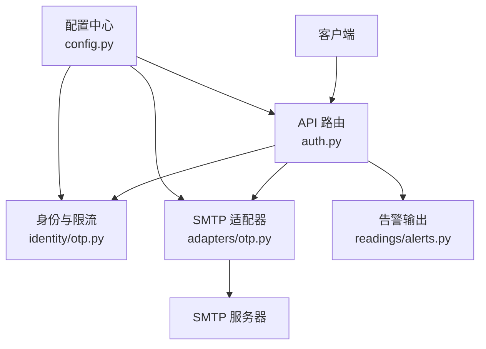
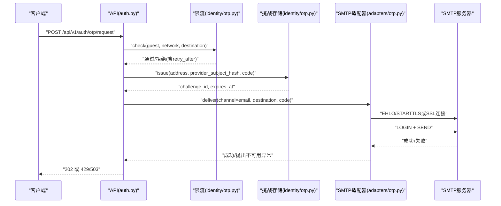
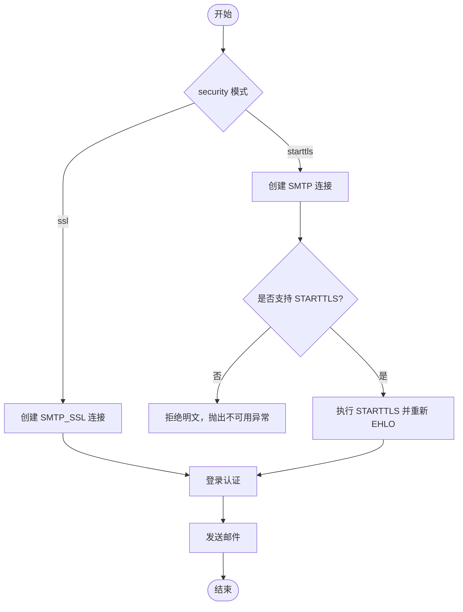
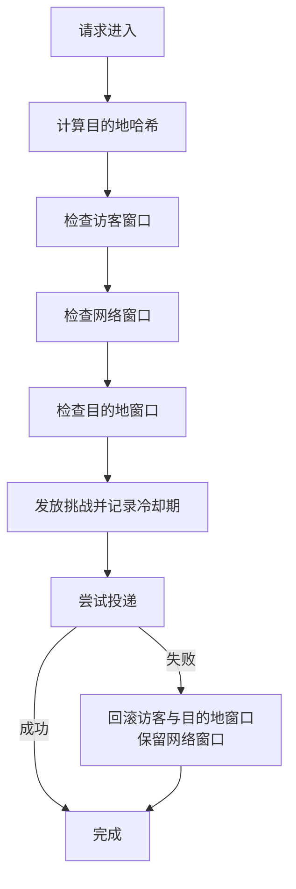
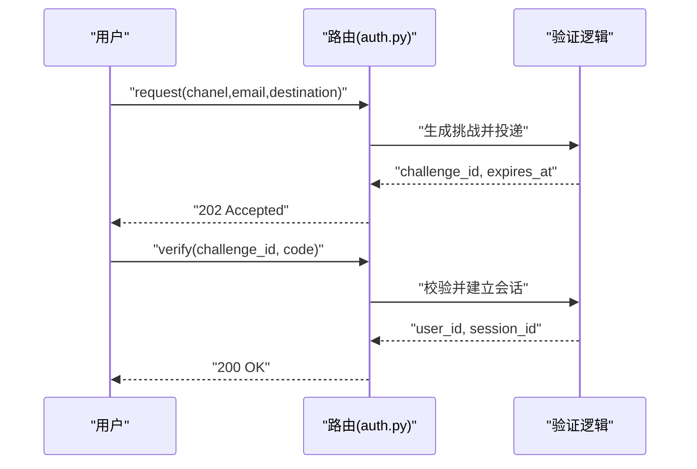
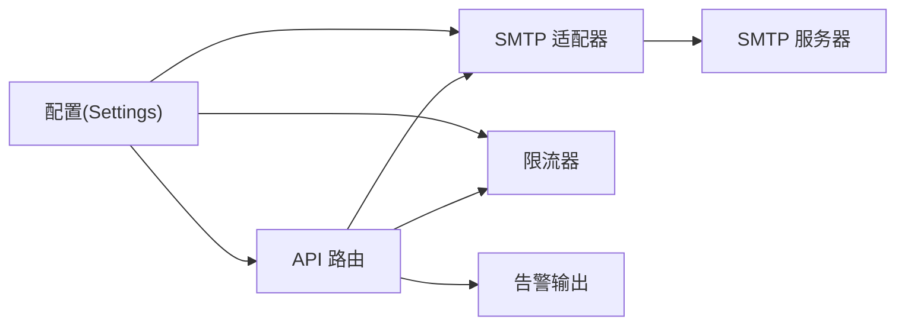
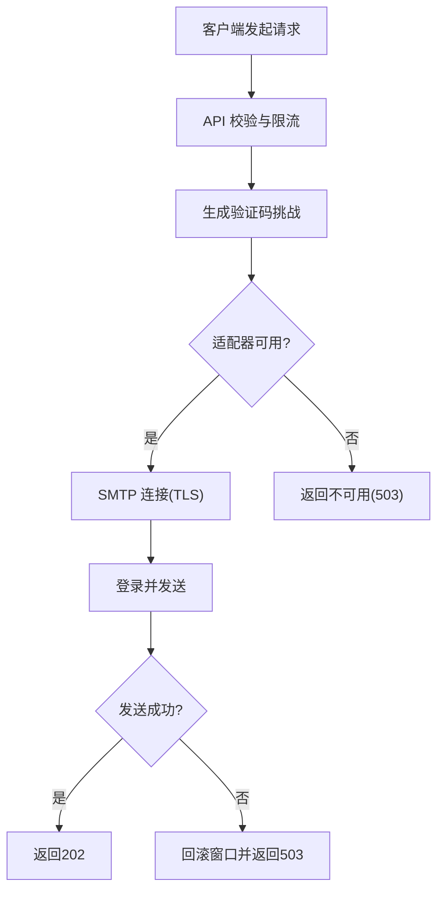

# 邮件服务集成

<cite>
**本文引用的文件**
- [backend/app/adapters/otp.py](file://backend/app/adapters/otp.py)
- [backend/app/config.py](file://backend/app/config.py)
- [backend/app/identity/otp.py](file://backend/app/identity/otp.py)
- [backend/app/api/auth.py](file://backend/app/api/auth.py)
- [backend/app/readings/alerts.py](file://backend/app/readings/alerts.py)
- [infra/EMAIL_OTP_RUNBOOK.md](file://infra/EMAIL_OTP_RUNBOOK.md)
- [backend/tests/test_smtp_otp_adapter.py](file://backend/tests/test_smtp_otp_adapter.py)
- [backend/tests/test_config.py](file://backend/tests/test_config.py)
</cite>

## 目录
1. [简介](#简介)
2. [项目结构](#项目结构)
3. [核心组件](#核心组件)
4. [架构总览](#架构总览)
5. [详细组件分析](#详细组件分析)
6. [依赖关系分析](#依赖关系分析)
7. [性能与可靠性](#性能与可靠性)
8. [故障排查指南](#故障排查指南)
9. [结论](#结论)
10. [附录：配置示例与运维手册](#附录配置示例与运维手册)

## 简介
本文件面向“明理”后端中的邮件服务集成，聚焦以下目标：
- SMTP 配置与管理：连接方式、SSL/TLS、认证、超时与失败策略。
- 邮件模板系统：当前实现为纯文本验证码；说明扩展 HTML 模板、变量替换与多语言的可行路径。
- 发送队列与异步处理：基于线程池的异步调用、重试与优先级（当前未实现持久化队列）。
- 内容安全：XSS 防护、链接验证与内容过滤策略建议。
- 监控与审计：告警事件、结构化日志、成功率统计与异常告警接入点。
- 流程图、配置示例与运维手册：覆盖从请求到投递的全链路及生产注意事项。

## 项目结构
邮件相关能力集中在后端模块中，围绕“适配器 + 配置 + 身份校验 + API 路由 + 告警”分层组织：
- 适配器层：SmtpOtpDeliveryAdapter 负责通过 smtplib 发送邮件，支持 starttls 与 ssl 两种模式。
- 配置层：Settings 集中管理 SMTP 参数、OTP 行为、速率限制、环境开关等。
- 身份与限流：normalize_destination、InMemoryOtpRequestLimiter、InMemoryOtpChallengeStore 提供地址归一化、三重窗口限流与一次性挑战存储。
- API 层：POST /api/v1/auth/otp/request 与 POST /api/v1/auth/otp/verify 暴露验证码申请与校验接口。
- 告警层：AlertSink 抽象与 LoggingAlertSink 输出结构化告警日志。

图表来源
- [backend/app/api/auth.py:79-112](file://backend/app/api/auth.py#L79-L112)
- [backend/app/adapters/otp.py:57-129](file://backend/app/adapters/otp.py#L57-L129)
- [backend/app/identity/otp.py:64-213](file://backend/app/identity/otp.py#L64-L213)
- [backend/app/readings/alerts.py:16-75](file://backend/app/readings/alerts.py#L16-L75)
- [backend/app/config.py:62-149](file://backend/app/config.py#L62-L149)

章节来源
- [backend/app/adapters/otp.py:57-129](file://backend/app/adapters/otp.py#L57-L129)
- [backend/app/config.py:62-149](file://backend/app/config.py#L62-L149)
- [backend/app/identity/otp.py:64-213](file://backend/app/identity/otp.py#L64-L213)
- [backend/app/api/auth.py:79-112](file://backend/app/api/auth.py#L79-L112)
- [backend/app/readings/alerts.py:16-75](file://backend/app/readings/alerts.py#L16-L75)

## 核心组件
- SmtpOtpDeliveryAdapter：封装 SMTP 连接、TLS 升级、登录与发送；使用 asyncio.to_thread 将阻塞 I/O 放入线程池执行，避免阻塞事件循环。
- InMemoryOtpRequestLimiter：三层窗口限流（访客、网络、目的地），支持原子性消费与失败回滚，防止攻击者利用失败消耗容量。
- InMemoryOtpChallengeStore：生成一次性验证码挑战，包含 TTL、冷却期、最大尝试次数与哈希校验。
- Settings：集中加载环境变量，强制生产环境安全策略（如禁用 fake OTP、要求 secure cookie、禁止明文传输等）。
- AlertSink：统一告警抽象，LoggingAlertSink 输出结构化 JSON 日志，便于外部采集与告警。

章节来源
- [backend/app/adapters/otp.py:57-129](file://backend/app/adapters/otp.py#L57-L129)
- [backend/app/identity/otp.py:64-213](file://backend/app/identity/otp.py#L64-L213)
- [backend/app/config.py:188-329](file://backend/app/config.py#L188-L329)
- [backend/app/readings/alerts.py:16-75](file://backend/app/readings/alerts.py#L16-L75)

## 架构总览
下图展示一次“申请验证码”的关键调用链：API 接收请求 -> 身份与限流检查 -> 生成挑战 -> 通过适配器发送 -> 返回结果或错误。

图表来源
- [backend/app/api/auth.py:79-112](file://backend/app/api/auth.py#L79-L112)
- [backend/app/identity/otp.py:64-213](file://backend/app/identity/otp.py#L64-L213)
- [backend/app/adapters/otp.py:88-129](file://backend/app/adapters/otp.py#L88-L129)

## 详细组件分析

### SMTP 适配器与连接管理
- 连接模式：
  - starttls：先 EHLO，检测是否支持 STARTTLS，若不支持则拒绝明文；成功后再 EHLO 并登录发送。
  - ssl：直接建立 SSL 连接。
- 认证：使用 SecretStr 保存用户名与密码，仅在登录时读取，不打印到日志或异常信息。
- 超时：可配置连接超时秒数，避免长时间阻塞。
- 线程模型：通过 asyncio.to_thread 将阻塞式 smtplib 调用放入线程池，保证主事件循环不被阻塞。
- 失败语义：任何非预期的异常被包装为 OtpDeliveryUnavailable，上层可据此进行重试或降级。

图表来源
- [backend/app/adapters/otp.py:88-129](file://backend/app/adapters/otp.py#L88-L129)

章节来源
- [backend/app/adapters/otp.py:57-129](file://backend/app/adapters/otp.py#L57-L129)
- [backend/tests/test_smtp_otp_adapter.py:79-127](file://backend/tests/test_smtp_otp_adapter.py#L79-L127)

### 身份归一化与限流
- 地址归一化：邮箱使用标准库校验并规范化小写；手机号仅保留数字并按中国大陆规则校验。
- 哈希键：使用 identity_hash_key 对 channel+normalized 做 HMAC，避免在限流器中存储原始地址。
- 三层窗口：
  - 访客窗口：按 guest session key 限制。
  - 网络窗口：按 IP（经可信代理解析）限制。
  - 目的地窗口：按归一化后的地址哈希限制。
- 失败回滚：当投递失败时，释放访客与目的地窗口计数，但保留网络窗口计数，防止攻击者利用提供商故障绕过限制。

图表来源
- [backend/app/identity/otp.py:64-213](file://backend/app/identity/otp.py#L64-L213)

章节来源
- [backend/app/identity/otp.py:64-213](file://backend/app/identity/otp.py#L64-L213)
- [infra/EMAIL_OTP_RUNBOOK.md:81-112](file://infra/EMAIL_OTP_RUNBOOK.md#L81-L112)

### API 端点与流程
- POST /api/v1/auth/otp/request：申请验证码，返回 challenge_id、过期时间与可选开发码（本地/测试且启用 fake 适配器时）。
- POST /api/v1/auth/otp/verify：校验验证码，成功后建立会话并返回用户与会话信息。
- 错误映射：无效或过期代码返回 400；超过尝试次数返回 429；投递不可用返回 503。

图表来源
- [backend/app/api/auth.py:79-112](file://backend/app/api/auth.py#L79-L112)

章节来源
- [backend/app/api/auth.py:79-112](file://backend/app/api/auth.py#L79-L112)

### 监控与审计
- 告警事件：AlertEvent 携带 kind、时间戳、上下文 ID 与详情；LoggingAlertSink 以结构化 JSON 输出警告日志。
- 开关控制：alert_sink_enabled 控制是否启用告警输出；real_traffic_enabled 控制真实流量开关。
- 可扩展：可通过实现 AlertSink 协议对接外部监控系统（如 Prometheus、Sentry、企业日志平台）。

章节来源
- [backend/app/readings/alerts.py:16-75](file://backend/app/readings/alerts.py#L16-L75)
- [backend/app/config.py:146-149](file://backend/app/config.py#L146-L149)

## 依赖关系分析
- 配置驱动：Settings 决定 OTP 适配器类型、SMTP 参数、速率限制与环境安全策略。
- 适配器解耦：通过 Protocol 与工厂注入，单元测试无需真实网络即可验证行为。
- 限流与存储：当前为进程内内存实现，适合单实例；生产需替换为 Redis/Postgres 以保证分布式一致性。
- 告警与日志：通过统一 Sink 抽象，便于在不同环境切换输出目标。

图表来源
- [backend/app/config.py:62-149](file://backend/app/config.py#L62-L149)
- [backend/app/adapters/otp.py:57-129](file://backend/app/adapters/otp.py#L57-L129)
- [backend/app/identity/otp.py:64-213](file://backend/app/identity/otp.py#L64-L213)
- [backend/app/readings/alerts.py:16-75](file://backend/app/readings/alerts.py#L16-L75)

章节来源
- [backend/app/config.py:62-149](file://backend/app/config.py#L62-L149)
- [backend/app/adapters/otp.py:57-129](file://backend/app/adapters/otp.py#L57-L129)
- [backend/app/identity/otp.py:64-213](file://backend/app/identity/otp.py#L64-L213)
- [backend/app/readings/alerts.py:16-75](file://backend/app/readings/alerts.py#L16-L75)

## 性能与可靠性
- 异步与线程池：通过 asyncio.to_thread 将阻塞 SMTP 操作移出事件循环，提高并发吞吐。
- 连接复用：当前每封邮件新建连接；如需提升性能，可引入连接池并在适配器中复用连接，注意 TLS 会话与认证状态管理。
- 超时与重试：可配置连接超时；对于瞬时失败可采用指数退避重试，结合告警输出。
- 限流保护：三重窗口有效抑制滥用；失败回滚确保不会因提供商故障导致合法用户被误限。
- 生产约束：生产环境默认禁用真实流量与 fake 适配器；需要持久化挑战存储后方可启用 SMTP 投递。

[本节为通用指导，不直接分析具体文件]

## 故障排查指南
- 启动失败：
  - 若启用 smtp 适配器但缺少 host/username/password/sender，将抛出配置校验错误。
  - 生产环境不允许使用 fake 适配器或明文 cookie。
- 投递失败：
  - 若 SMTP 不支持 STARTTLS，适配器会拒绝明文并抛出不可用异常。
  - 网络异常或认证失败会被包装为通用错误，避免泄露敏感信息。
- 限流触发：
  - 429 响应携带 retry_after_seconds；检查访客、网络、目的地窗口是否达到上限。
- 告警与日志：
  - 启用 alert_sink_enabled 后，告警以结构化 JSON 输出，便于检索与告警。

章节来源
- [backend/app/config.py:188-329](file://backend/app/config.py#L188-L329)
- [backend/app/adapters/otp.py:113-129](file://backend/app/adapters/otp.py#L113-L129)
- [backend/app/identity/otp.py:183-213](file://backend/app/identity/otp.py#L183-L213)
- [backend/app/readings/alerts.py:48-75](file://backend/app/readings/alerts.py#L48-L75)

## 结论
该邮件服务集成以“适配器 + 配置 + 限流 + 告警”为核心，实现了安全的 SMTP 投递、严格的速率限制与可扩展的监控能力。当前版本在生产环境保持 fail-closed，待持久化挑战存储就绪后再开放真实邮件投递。后续可在连接池、模板系统与队列方面进一步增强。

[本节为总结，不直接分析具体文件]

## 附录：配置示例与运维手册

### SMTP 配置要点
- 环境变量前缀：MINGLI_
- 关键项：
  - MINGLI_OTP_ADAPTER=smtp
  - MINGLI_SMTP_HOST、MINGLI_SMTP_PORT、MINGLI_SMTP_SECURITY(starttls|ssl)
  - MINGLI_SMTP_SENDER、MINGLI_SMTP_USERNAME、MINGLI_SMTP_PASSWORD
- 安全策略：
  - 生产环境必须启用 secure cookie。
  - 生产环境禁止使用 fake 适配器。
  - 生产环境 SMTP 投递需持久化挑战存储后才允许启用。

章节来源
- [infra/EMAIL_OTP_RUNBOOK.md:22-37](file://infra/EMAIL_OTP_RUNBOOK.md#L22-L37)
- [backend/app/config.py:188-239](file://backend/app/config.py#L188-L239)

### 发送流程图（端到端）

图表来源
- [backend/app/api/auth.py:79-112](file://backend/app/api/auth.py#L79-L112)
- [backend/app/adapters/otp.py:88-129](file://backend/app/adapters/otp.py#L88-L129)
- [backend/app/identity/otp.py:64-213](file://backend/app/identity/otp.py#L64-L213)

### 模板系统现状与建议
- 现状：当前验证码内容为纯文本，不包含 HTML。
- 建议方案：
  - 引入模板引擎（如 Jinja2），支持 HTML 模板渲染与变量替换。
  - 多语言支持：根据用户偏好或区域设置选择模板与文案。
  - 安全加固：对模板内容进行 XSS 防护，对用户输入进行白名单过滤；对外部链接进行域名白名单校验与 HTTPS 强制。
  - 可观测性：在模板渲染阶段埋点，记录渲染耗时与错误率。

[本节为概念性建议，不直接分析具体文件]

### 队列与重试策略
- 现状：无持久化队列；通过线程池异步执行 SMTP 发送。
- 建议方案：
  - 引入消息队列（如 RabbitMQ、Redis Streams），实现异步处理与优先级管理。
  - 失败重试：采用指数退避与最大重试次数；区分可重试与不可重试错误。
  - 死信队列：用于追踪持续失败的邮件，便于人工介入。
  - 监控指标：发送量、成功率、平均延迟、失败原因分布。

[本节为概念性建议，不直接分析具体文件]

### 内容安全最佳实践
- XSS 防护：对所有用户输入进行转义或白名单过滤；HTML 模板使用安全渲染函数。
- 链接验证：仅允许白名单域名；强制 HTTPS；必要时添加重定向中间页提示风险。
- 内容过滤：屏蔽恶意附件与脚本；对超大正文进行截断。
- 隐私保护：不在日志中记录敏感信息（如验证码、密码、完整邮箱）。

[本节为概念性建议，不直接分析具体文件]

### 监控与审计清单
- 告警输出：启用 alert_sink_enabled，观察结构化告警日志。
- 成功率统计：基于日志聚合计算发送成功率与失败原因。
- 异常告警：针对连续失败、SMTP 不可用、限流频繁触发等场景设置阈值告警。
- 审计追踪：记录挑战发放、验证、会话建立等关键事件，便于问题回溯。

章节来源
- [backend/app/readings/alerts.py:16-75](file://backend/app/readings/alerts.py#L16-L75)
- [backend/app/config.py:146-149](file://backend/app/config.py#L146-L149)