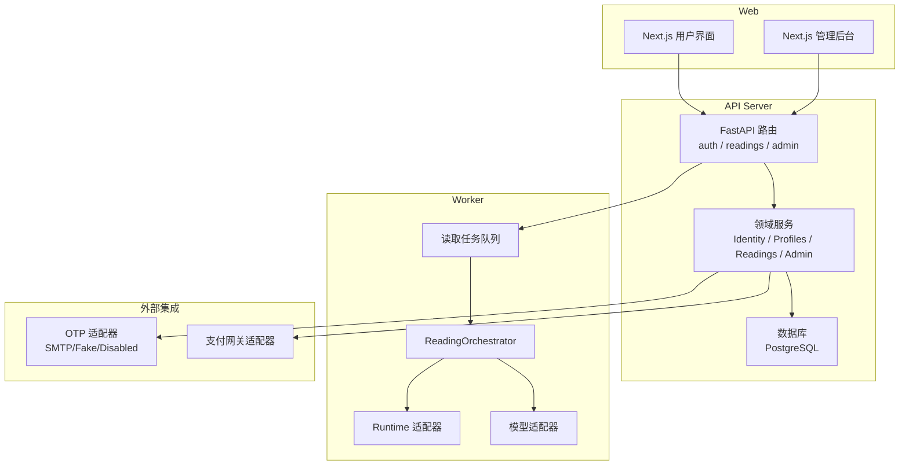
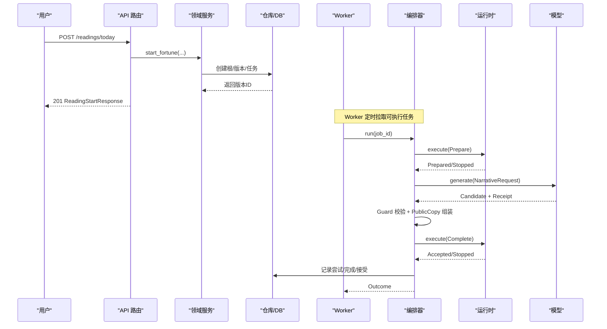
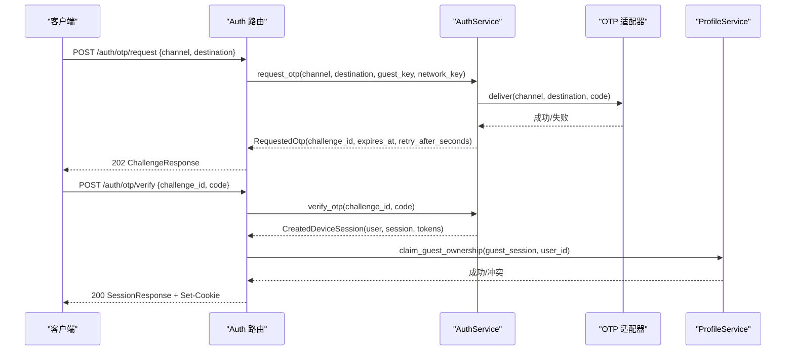
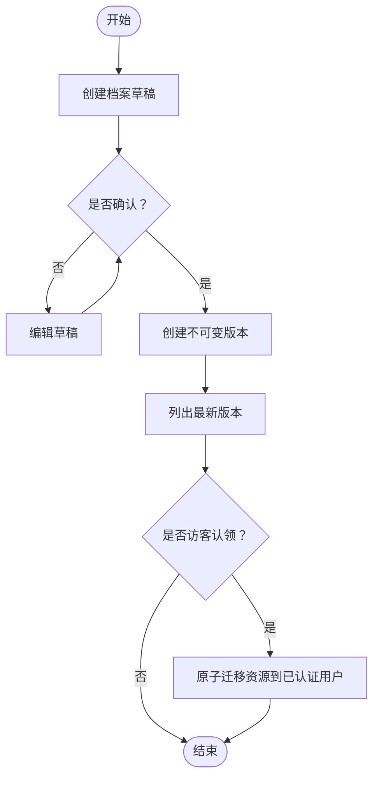
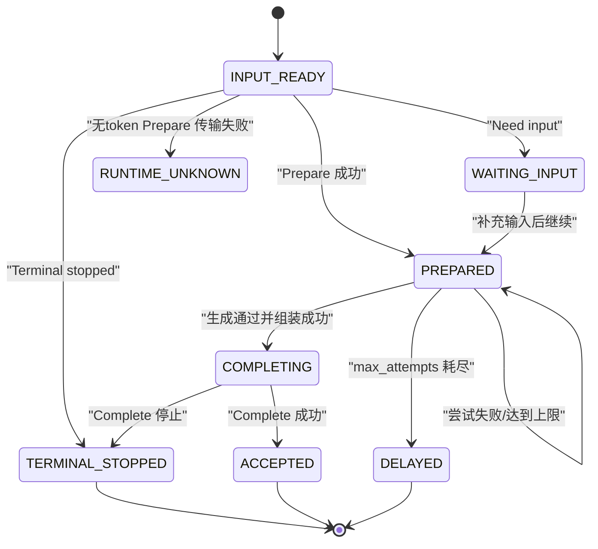
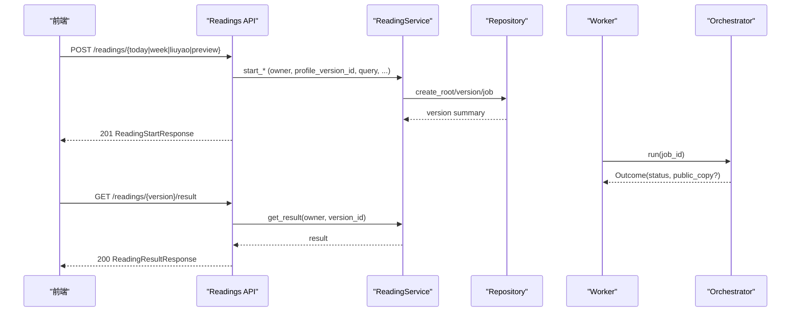
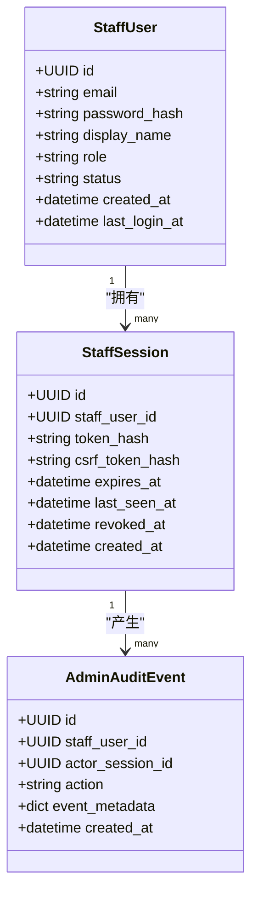
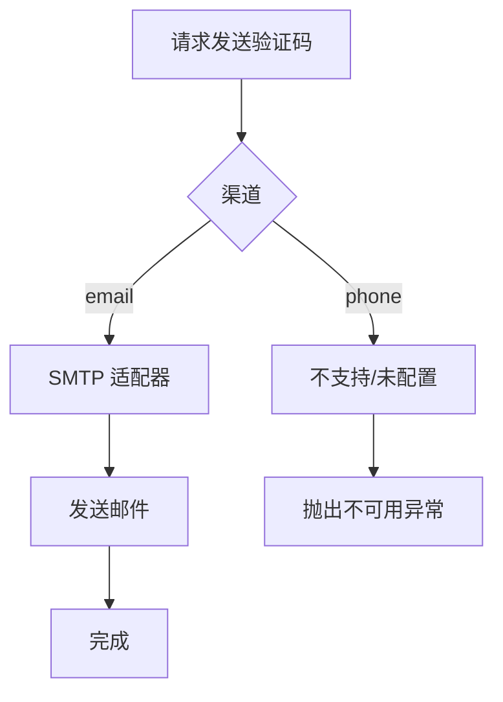
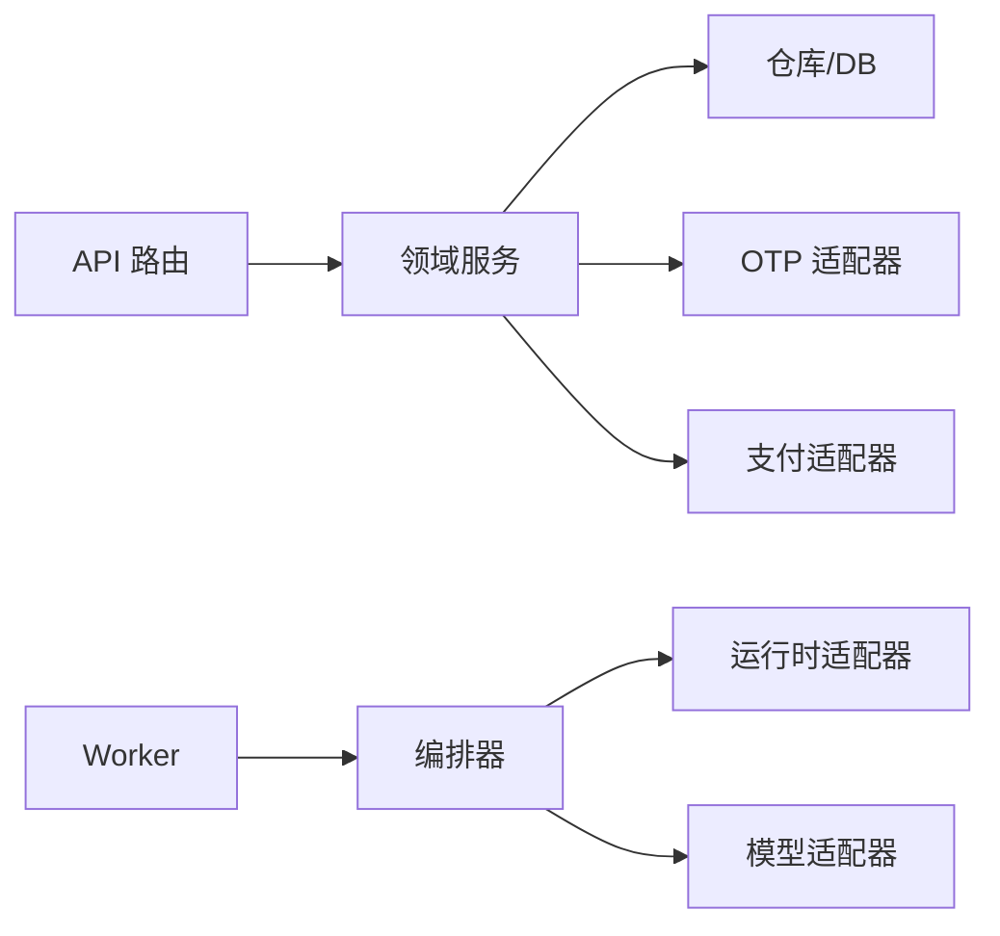

# 核心功能

<cite>
**本文引用的文件**
- [backend/app/main.py](file://backend/app/main.py)
- [backend/app/api/auth.py](file://backend/app/api/auth.py)
- [backend/app/api/readings.py](file://backend/app/api/readings.py)
- [backend/app/identity/service.py](file://backend/app/identity/service.py)
- [backend/app/profiles/service.py](file://backend/app/profiles/service.py)
- [backend/app/admin/service.py](file://backend/app/admin/service.py)
- [backend/app/adapters/otp.py](file://backend/app/adapters/otp.py)
- [backend/app/adapters/payment.py](file://backend/app/adapters/payment.py)
- [backend/app/readings/orchestrator.py](file://backend/app/readings/orchestrator.py)
- [backend/app/readings/service.py](file://backend/app/readings/service.py)
- [backend/app/readings/models.py](file://backend/app/readings/models.py)
- [backend/worker/readings.py](file://backend/worker/readings.py)
</cite>

## 目录
1. [简介](#简介)
2. [项目结构](#项目结构)
3. [核心组件](#核心组件)
4. [架构总览](#架构总览)
5. [详细组件分析](#详细组件分析)
6. [依赖关系分析](#依赖关系分析)
7. [性能与可靠性](#性能与可靠性)
8. [故障排查指南](#故障排查指南)
9. [结论](#结论)
10. [附录](#附录)

## 简介
本文件聚焦命理解读系统的核心能力，覆盖八字分析、每日运势、一周运势、六爻占卜的业务流程；用户认证与授权（手机号/邮箱 OTP、访客会话、权限控制）；用户档案的创建、编辑、版本化与归档；解读编排器（Orchestrator）的任务调度、状态机与结果处理；管理后台的用户、订单与审计日志；以及外部系统集成（短信/邮件 OTP、支付网关）的适配器实现。文档包含流程图、状态转换图与错误处理策略，帮助读者从业务到代码逐层理解系统。

## 项目结构
后端采用模块化单体架构：API 路由层负责鉴权、限流与请求校验；领域服务封装业务逻辑；数据持久化通过 SQLAlchemy 模型与仓库；异步 Worker 消费任务并驱动编排器执行；外部能力通过适配器抽象（OTP、支付、运行时、模型）。前端 Next.js 应用提供用户与管理后台界面。

**图表来源**
- [backend/app/main.py:30-156](file://backend/app/main.py#L30-L156)
- [backend/app/api/readings.py:42-399](file://backend/app/api/readings.py#L42-L399)
- [backend/worker/readings.py:254-319](file://backend/worker/readings.py#L254-L319)

**章节来源**
- [backend/app/main.py:30-156](file://backend/app/main.py#L30-L156)

## 核心组件
- 身份与认证：支持手机号/邮箱 OTP 登录、访客会话、设备会话与 CSRF 保护。
- 用户档案：草稿→确认→不可变版本，支持访客认领与版本列表。
- 命理解读：预览、今日运势、一周运势、六爻占卜，统一通过编排器推进状态。
- 编排器：以 Prepare→Generate→Complete 三阶段驱动，具备重试、延迟、告警与幂等保障。
- 管理后台：员工登录与会话、审计事件、概览与队列摘要。
- 外部集成：OTP 通道（SMTP）、支付网关（Checkout/Query/Refund）。

**章节来源**
- [backend/app/identity/service.py:23-192](file://backend/app/identity/service.py#L23-L192)
- [backend/app/profiles/service.py:44-189](file://backend/app/profiles/service.py#L44-L189)
- [backend/app/readings/service.py:117-819](file://backend/app/readings/service.py#L117-L819)
- [backend/app/readings/orchestrator.py:178-450](file://backend/app/readings/orchestrator.py#L178-L450)
- [backend/app/admin/service.py:33-148](file://backend/app/admin/service.py#L33-L148)
- [backend/app/adapters/otp.py:20-129](file://backend/app/adapters/otp.py#L20-L129)
- [backend/app/adapters/payment.py:34-92](file://backend/app/adapters/payment.py#L34-L92)

## 架构总览
系统由 API 层、领域服务、数据层与 Worker 组成。API 层暴露 REST 接口，进行鉴权、限流与参数校验；领域服务编排业务流程；数据层使用加密信封存储敏感字段；Worker 拉取任务并通过编排器驱动外部运行时与模型生成结果。

**图表来源**
- [backend/app/api/readings.py:124-195](file://backend/app/api/readings.py#L124-L195)
- [backend/app/readings/service.py:167-204](file://backend/app/readings/service.py#L167-L204)
- [backend/app/readings/orchestrator.py:212-435](file://backend/app/readings/orchestrator.py#L212-L435)
- [backend/worker/readings.py:164-231](file://backend/worker/readings.py#L164-L231)

## 详细组件分析

### 用户认证与授权（OTP、访客会话、权限控制）
- OTP 流程：请求验证码（支持 phone/email），基于目标地址归一化与哈希，发放挑战并限制频率；验证通过后解析或创建身份，建立设备会话并设置 Cookie。
- 访客会话：匿名访问期间创建短期会话令牌与 CSRF Token，用于后续归属转移。
- 权限控制：API 通过依赖注入获取 Owner（user/guest），对写操作启用速率限制与 CSRF 校验。

**图表来源**
- [backend/app/api/auth.py:44-138](file://backend/app/api/auth.py#L44-L138)
- [backend/app/identity/service.py:100-192](file://backend/app/identity/service.py#L100-L192)
- [backend/app/profiles/service.py:130-179](file://backend/app/profiles/service.py#L130-L179)

**章节来源**
- [backend/app/api/auth.py:44-161](file://backend/app/api/auth.py#L44-L161)
- [backend/app/identity/service.py:23-192](file://backend/app/identity/service.py#L23-L192)
- [backend/app/profiles/service.py:44-189](file://backend/app/profiles/service.py#L44-L189)

### 用户档案管理系统（创建、编辑、版本控制、归档）
- 创建草稿：为当前 Owner（用户或访客）新建 Profile Draft。
- 确认草稿：将草稿转为不可变版本，写入出生时间、时区、地点、性别、时间基准策略等。
- 访客认领：在用户登录后，原子性地将访客拥有的资源（档案、解读、幂等键）迁移至该用户。
- 版本列表：仅展示最新版本的摘要信息。

**图表来源**
- [backend/app/profiles/service.py:52-105](file://backend/app/profiles/service.py#L52-L105)
- [backend/app/profiles/service.py:130-179](file://backend/app/profiles/service.py#L130-L179)

**章节来源**
- [backend/app/profiles/service.py:44-189](file://backend/app/profiles/service.py#L44-L189)

### 命理解读编排器（任务调度、状态管理、结果处理）
- 状态机：INPUT_READY → PREPARED → COMPLETING → ACCEPTED；中间可能进入 WAITING_INPUT、TERMINAL_STOPPED、DELAYED、RUNTIME_UNKNOWN。
- 三阶段：
  - Prepare：调用运行时准备输入或返回待补充字段。
  - Generate：调用模型生成候选文本，经叙事守卫校验后组装公开副本。
  - Complete：提交最终副本，确保 token 与副本一致性。
- 重试与延迟：根据最大尝试次数与退避策略，标记 DELAYED 并告警。
- 幂等与恢复：Completed 意图持久化后可安全重放；无 state_token 的 Prepare 失败会标记 RUNTIME_UNKNOWN。

**图表来源**
- [backend/app/readings/orchestrator.py:212-450](file://backend/app/readings/orchestrator.py#L212-L450)
- [backend/app/readings/status.py](file://backend/app/readings/status.py)

**章节来源**
- [backend/app/readings/orchestrator.py:178-450](file://backend/app/readings/orchestrator.py#L178-L450)
- [backend/worker/readings.py:164-231](file://backend/worker/readings.py#L164-L231)

### 命理解读 API（八字、每日、一周、六爻）
- 八字预览：基于已确认档案生成格局预览。
- 每日/一周运势：按 action 编译 Prepare 指令，启动解读任务。
- 六爻占卜：支持手动起卦或数字起卦，结合事件时间与地点。
- 输入补充：当 Runtime 需要更多事实时，客户端提交受控字段，再次触发编排。
- 结果查询：返回状态、公开副本、事实面板、验证反馈与输入请求。

**图表来源**
- [backend/app/api/readings.py:87-399](file://backend/app/api/readings.py#L87-L399)
- [backend/app/readings/service.py:129-428](file://backend/app/readings/service.py#L129-L428)
- [backend/app/readings/orchestrator.py:212-435](file://backend/app/readings/orchestrator.py#L212-L435)

**章节来源**
- [backend/app/api/readings.py:87-399](file://backend/app/api/readings.py#L87-L399)
- [backend/app/readings/service.py:117-819](file://backend/app/readings/service.py#L117-L819)

### 管理后台（用户管理、订单处理、审计日志）
- 员工认证：独立于用户会话的 Staff 登录与会话管理，支持引导式超级管理员初始化。
- 审计事件：所有写操作记录 append-only 审计日志，便于追踪与合规。
- 概览与队列：提供关键指标与队列摘要（占位实现，可扩展对接真实数据源）。

**图表来源**
- [backend/app/admin/models.py:17-81](file://backend/app/admin/models.py#L17-L81)

**章节来源**
- [backend/app/admin/service.py:33-148](file://backend/app/admin/service.py#L33-L148)
- [backend/app/admin/models.py:17-81](file://backend/app/admin/models.py#L17-L81)

### 外部系统集成（短信/邮件 OTP、支付网关）
- OTP 适配器：
  - SMTP：仅 TLS/STARTTLS，拒绝明文；发送“明理验证码”邮件。
  - Fake：本地记录投递，便于测试。
  - Disabled/ProductionFailClosed：生产环境默认禁用，直到存在持久化挑战存储。
- 支付网关：
  - 协议抽象：创建结账、通知校验、支付查询、退款申请与查询。
  - Fake 实现：永远返回不可用，避免不安全转化。

**图表来源**
- [backend/app/adapters/otp.py:57-129](file://backend/app/adapters/otp.py#L57-L129)

**章节来源**
- [backend/app/adapters/otp.py:20-129](file://backend/app/adapters/otp.py#L20-L129)
- [backend/app/adapters/payment.py:34-92](file://backend/app/adapters/payment.py#L34-L92)

## 依赖关系分析
- API 路由依赖领域服务，服务依赖仓库与加密信封；编排器依赖运行时与模型适配器；Worker 通过数据库锁与租约机制保证并发安全。
- 外部适配器的松耦合设计使替换实现成为可能，且在生产环境中可通过配置切换行为。

**图表来源**
- [backend/app/main.py:30-156](file://backend/app/main.py#L30-L156)
- [backend/worker/readings.py:254-319](file://backend/worker/readings.py#L254-L319)

**章节来源**
- [backend/app/main.py:30-156](file://backend/app/main.py#L30-L156)
- [backend/worker/readings.py:108-231](file://backend/worker/readings.py#L108-L231)

## 性能与可靠性
- 速率限制：针对阅读写入、个人资料写入、访客会话创建、管理员登录等多维度窗口限流，防止滥用。
- 幂等键：读解入口支持 Idempotency-Key，基于 HMAC 指纹防重放与冲突检测。
- 并发安全：Worker 使用数据库行级锁与租约（lease）避免重复处理；过期租约自动释放。
- 弹性重试：Prepare/Complete 传输失败时按退避策略重试；超过最大尝试次数则延迟并告警。
- 数据安全：敏感字段（Prepare、结果、完成副本、事实简报）使用信封加密存储，降低泄露风险。

[本节为通用指导，不直接分析具体文件]

## 故障排查指南
- OTP 相关：
  - 429 请求过多：检查访客/网络/目的地维度的冷却与限制。
  - 503 投递不可用：确认 SMTP 配置与服务器 STARTTLS 支持；生产环境需持久化挑战存储。
- 读解相关：
  - 409 幂等冲突：检查 Idempotency-Key 是否与动作/载荷匹配。
  - 409 非等待输入：确认版本状态是否为 WAITING_INPUT 后再提交补充输入。
  - 503 运行时不可用：检查运行时发布注册与连接。
- 管理后台：
  - 401 未认证：确认 Staff 会话有效且未过期；登出后会话被撤销。
  - 审计日志为空：Phase B 接入 audit-events API 前仅为占位。

**章节来源**
- [backend/app/api/auth.py:44-161](file://backend/app/api/auth.py#L44-L161)
- [backend/app/api/readings.py:67-84](file://backend/app/api/readings.py#L67-L84)
- [backend/app/readings/service.py:45-80](file://backend/app/readings/service.py#L45-L80)
- [backend/app/admin/service.py:49-101](file://backend/app/admin/service.py#L49-L101)

## 结论
本系统通过清晰的模块边界与适配器抽象，实现了命理解读的全链路能力：从用户认证、档案版本化，到多类型解读任务的编排与执行，再到管理后台的可观测性与合规审计。编排器以强一致的状态机与重试/延迟策略保障鲁棒性；外部集成通过协议隔离提升可替换性与安全性。建议在后续迭代中完善支付与审计的端到端闭环，并持续优化限流与监控告警。

[本节为总结，不直接分析具体文件]

## 附录
- 关键数据模型：
  - 读解根与版本：承载能力标识、状态、维度、时间范围与加密的 Prepare/结果/完成副本。
  - 事实简报：加密的事实摘要，供前端展示公共事实面板。
  - 尝试记录：每次模型调用的候选、错误与收据，支撑回溯与成本分析。

**章节来源**
- [backend/app/readings/models.py:28-200](file://backend/app/readings/models.py#L28-L200)