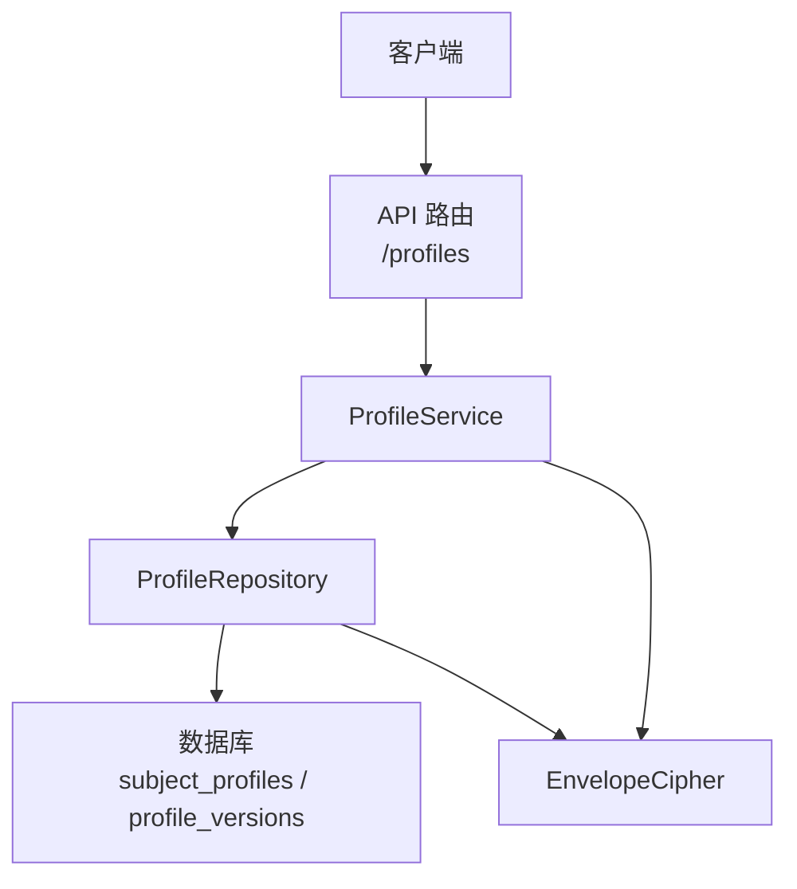
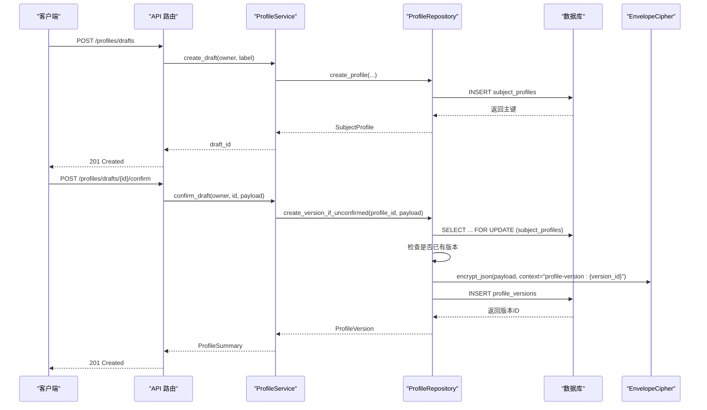
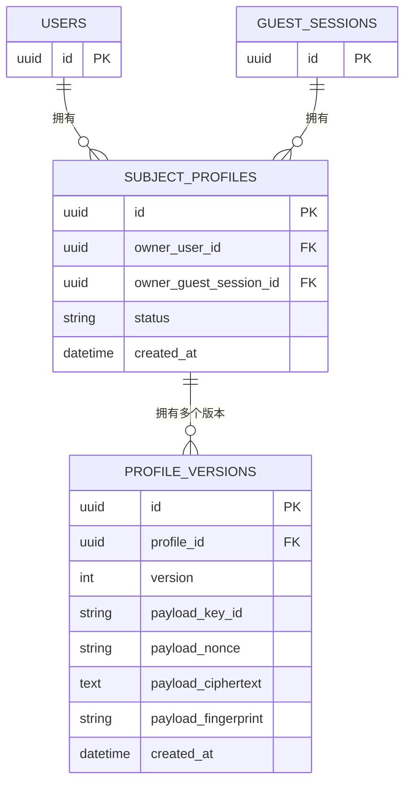
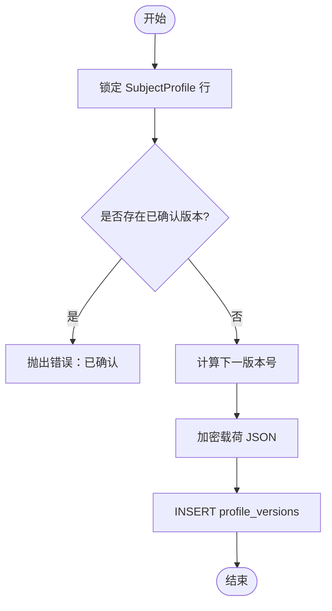
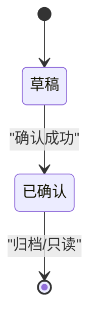
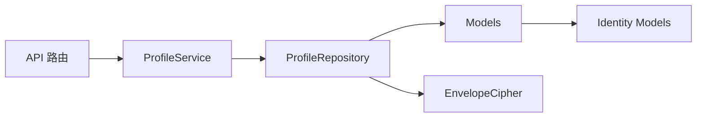

# 用户档案管理

<cite>
**本文引用的文件**
- [backend/app/profiles/models.py](file://backend/app/profiles/models.py)
- [backend/app/profiles/service.py](file://backend/app/profiles/service.py)
- [backend/app/profiles/repository.py](file://backend/app/profiles/repository.py)
- [backend/app/profiles/schemas.py](file://backend/app/profiles/schemas.py)
- [backend/app/api/profiles.py](file://backend/app/api/profiles.py)
- [backend/app/identity/models.py](file://backend/app/identity/models.py)
- [backend/app/security/envelope.py](file://backend/app/security/envelope.py)
- [backend/alembic/versions/0002_profiles_and_readings.py](file://backend/alembic/versions/0002_profiles_and_readings.py)
</cite>

## 目录
1. [简介](#简介)
2. [项目结构](#项目结构)
3. [核心组件](#核心组件)
4. [架构总览](#架构总览)
5. [详细组件分析](#详细组件分析)
6. [依赖关系分析](#依赖关系分析)
7. [性能与查询优化](#性能与查询优化)
8. [故障排查指南](#故障排查指南)
9. [结论](#结论)
10. [附录：API 使用示例](#附录api-使用示例)

## 简介
本设计文档围绕“用户档案管理系统”展开，聚焦以下目标：
- 档案数据结构设计：SubjectProfile、ProfileVersion 模型、字段定义与数据关系。
- 版本控制机制：不可变数据模型、版本创建与变更追踪。
- 档案生命周期管理：创建草稿、确认生成不可变版本、列表查询、访客会话认领。
- 所有权验证：OwnerProtocol 接口实现与访问控制。
- 查询优化：索引策略、缓存机制与性能调优建议。
- 数据迁移：Schema 演进与向后兼容性保证。
- 图示：实体关系图、状态转换图与 API 调用时序图。

## 项目结构
后端采用分层组织：
- API 层：FastAPI 路由，负责鉴权、限流、请求校验与响应封装。
- Service 层：业务编排（创建草稿、确认、列表、访客认领）。
- Repository 层：数据库访问、行级锁、加密载荷写入与读取。
- Models 层：SQLAlchemy ORM 模型与约束。
- Security：信封式加密（AES-GCM + HMAC 指纹），用于持久化敏感字段。
- Migration：Alembic 脚本维护 Schema 演进。

图表来源
- [backend/app/api/profiles.py:43-111](file://backend/app/api/profiles.py#L43-L111)
- [backend/app/profiles/service.py:44-113](file://backend/app/profiles/service.py#L44-L113)
- [backend/app/profiles/repository.py:22-104](file://backend/app/profiles/repository.py#L22-L104)
- [backend/app/security/envelope.py:32-122](file://backend/app/security/envelope.py#L32-L122)

章节来源
- [backend/app/api/profiles.py:43-111](file://backend/app/api/profiles.py#L43-L111)
- [backend/app/profiles/service.py:44-113](file://backend/app/profiles/service.py#L44-L113)
- [backend/app/profiles/repository.py:22-104](file://backend/app/profiles/repository.py#L22-L104)
- [backend/app/security/envelope.py:32-122](file://backend/app/security/envelope.py#L32-L122)

## 核心组件
- SubjectProfile：档案主体，拥有唯一所有者（User 或 GuestSession 二选一），包含标签与状态。
- ProfileVersion：不可变版本记录，存储加密后的档案载荷与元数据（key_id、nonce、ciphertext、fingerprint）。
- ProfileService：编排草稿创建、确认、列表、访客认领等流程。
- ProfileRepository：封装行级锁、并发安全版本分配、加密写入与解密读取。
- EnvelopeCipher：提供 AES-GCM 加解密与 HMAC 指纹校验，确保载荷完整性与防篡改。
- Schemas：Pydantic 模型用于请求/响应校验与序列化。

章节来源
- [backend/app/profiles/models.py:21-79](file://backend/app/profiles/models.py#L21-L79)
- [backend/app/profiles/service.py:44-189](file://backend/app/profiles/service.py#L44-L189)
- [backend/app/profiles/repository.py:22-198](file://backend/app/profiles/repository.py#L22-L198)
- [backend/app/security/envelope.py:32-122](file://backend/app/security/envelope.py#L32-L122)
- [backend/app/profiles/schemas.py:10-60](file://backend/app/profiles/schemas.py#L10-L60)

## 架构总览
系统通过 FastAPI 暴露 /profiles 相关接口，服务层调用仓库进行数据库操作，仓库使用 SQLAlchemy 异步会话执行 SQL，并通过信封加密保护敏感载荷。所有版本记录不可变，确保审计与可追溯性。

图表来源
- [backend/app/api/profiles.py:43-93](file://backend/app/api/profiles.py#L43-L93)
- [backend/app/profiles/service.py:52-105](file://backend/app/profiles/service.py#L52-L105)
- [backend/app/profiles/repository.py:57-104](file://backend/app/profiles/repository.py#L57-L104)
- [backend/app/security/envelope.py:98-122](file://backend/app/security/envelope.py#L98-L122)

## 详细组件分析

### 数据模型与关系
- SubjectProfile：
  - 主键 id（UUID）
  - owner_user_id（可选，外键 users.id）
  - owner_guest_session_id（可选，外键 guest_sessions.id）
  - 约束：owner_user_id 与 owner_guest_session_id 有且仅有一个非空
  - label（可选）、status（默认 active）、created_at
- ProfileVersion：
  - 主键 id（UUID）
  - profile_id（外键 subject_profiles.id）
  - version（整数，自增逻辑在仓库层）
  - payload_key_id、payload_nonce、payload_ciphertext、payload_fingerprint（加密载荷）
  - created_at
  - 唯一约束：(profile_id, version)
  - 不可变：before_update 事件抛出异常阻止更新

图表来源
- [backend/app/profiles/models.py:21-79](file://backend/app/profiles/models.py#L21-L79)
- [backend/app/identity/models.py:31-111](file://backend/app/identity/models.py#L31-L111)
- [backend/alembic/versions/0002_profiles_and_readings.py:28-72](file://backend/alembic/versions/0002_profiles_and_readings.py#L28-L72)

章节来源
- [backend/app/profiles/models.py:21-79](file://backend/app/profiles/models.py#L21-L79)
- [backend/app/identity/models.py:31-111](file://backend/app/identity/models.py#L31-L111)
- [backend/alembic/versions/0002_profiles_and_readings.py:28-72](file://backend/alembic/versions/0002_profiles_and_readings.py#L28-L72)

### 版本控制与不可变数据
- 不可变性：
  - ProfileVersion 的 before_update 事件直接抛出错误，禁止任何修改。
  - 通过 UniqueConstraint(profile_id, version) 防止重复版本号。
- 版本创建：
  - 仓库层对 SubjectProfile 行加锁（SELECT ... FOR UPDATE），避免并发冲突。
  - 计算当前最大版本号并递增，生成新的 UUID 作为版本 ID。
  - 使用 EnvelopeCipher.encrypt_json 将载荷加密为 key_id、nonce、ciphertext、fingerprint。
  - 插入 profile_versions 表。
- 变更追踪：
  - 每个版本独立存储完整载荷快照，支持历史回溯与审计。
  - fingerprint 由 HMAC 生成，确保载荷未被篡改。

图表来源
- [backend/app/profiles/repository.py:57-104](file://backend/app/profiles/repository.py#L57-L104)
- [backend/app/profiles/models.py:77-79](file://backend/app/profiles/models.py#L77-L79)
- [backend/app/security/envelope.py:98-122](file://backend/app/security/envelope.py#L98-L122)

章节来源
- [backend/app/profiles/repository.py:57-104](file://backend/app/profiles/repository.py#L57-L104)
- [backend/app/profiles/models.py:77-79](file://backend/app/profiles/models.py#L77-L79)
- [backend/app/security/envelope.py:98-122](file://backend/app/security/envelope.py#L98-L122)

### 档案生命周期管理
- 创建草稿：
  - API 接收 label，Service 调用 Repository 创建 SubjectProfile。
  - 返回 draft_id，状态保持为草稿。
- 确认草稿：
  - 校验 Owner 权限，获取草稿。
  - 尝试创建不可变版本；若已存在版本则返回冲突。
  - 成功后返回 ProfileSummary（包含 profile_id、profile_version_id、subject_ref、version、created_at）。
- 列表查询：
  - 按所有者列出最新版本的摘要。
- 访客认领：
  - 原子性地将被访客拥有的资源（SubjectProfile、ReadingRoot、ReadingIdempotencyKey）转移至已认证用户。
  - 标记访客会话 claimed_at 与 claimed_by_user_id。

图表来源
- [backend/app/api/profiles.py:43-111](file://backend/app/api/profiles.py#L43-L111)
- [backend/app/profiles/service.py:52-113](file://backend/app/profiles/service.py#L52-L113)
- [backend/app/profiles/service.py:130-178](file://backend/app/profiles/service.py#L130-L178)

章节来源
- [backend/app/api/profiles.py:43-111](file://backend/app/api/profiles.py#L43-L111)
- [backend/app/profiles/service.py:52-113](file://backend/app/profiles/service.py#L52-L113)
- [backend/app/profiles/service.py:130-178](file://backend/app/profiles/service.py#L130-L178)

### 所有权验证与访问控制
- OwnerProtocol：
  - 抽象出 kind（user/guest）与 id，统一处理不同所有者的资源访问。
- 所有者解析：
  - owner_ids(owner) 根据 kind 返回 user_id 或 guest_session_id。
- 访问控制：
  - API 通过 require_owner_csrf 或 require_owner 注入 Owner。
  - Repository 查询时强制匹配 owner_user_id 与 owner_guest_session_id，确保越权访问被拒绝。
- 访客认领：
  - 使用 with_for_update() 锁定访客会话，防止竞态。
  - 批量更新 SubjectProfile、ReadingRoot、ReadingIdempotencyKey 的所有者。

章节来源
- [backend/app/profiles/service.py:30-42](file://backend/app/profiles/service.py#L30-L42)
- [backend/app/api/dependencies.py:87-110](file://backend/app/api/dependencies.py#L87-L110)
- [backend/app/profiles/repository.py:106-143](file://backend/app/profiles/repository.py#L106-L143)
- [backend/app/profiles/service.py:130-178](file://backend/app/profiles/service.py#L130-L178)

### 查询优化与性能调优
- 行级锁与并发安全：
  - 使用 SELECT ... FOR UPDATE 锁定 SubjectProfile，避免并发确认导致重复版本。
- 最新版本查询：
  - 通过子查询聚合 max(version)，再 JOIN 获取最新版本的完整信息。
- 加密开销：
  - 载荷以 JSON 形式加密，减少明文存储风险；注意在高并发场景下的 CPU 开销。
- 建议优化：
  - 针对频繁查询条件添加索引（例如 owner_user_id、owner_guest_session_id、created_at）。
  - 对列表接口引入缓存（如 Redis），缓存最近 N 条最新版本的摘要。
  - 对大对象载荷考虑分片或外部存储（如对象存储），仅保留指纹与引用。

章节来源
- [backend/app/profiles/repository.py:145-182](file://backend/app/profiles/repository.py#L145-L182)
- [backend/app/profiles/repository.py:57-77](file://backend/app/profiles/repository.py#L57-L77)
- [backend/app/security/envelope.py:98-122](file://backend/app/security/envelope.py#L98-L122)

### 数据迁移与 Schema 演进
- 迁移脚本：
  - 0002_profiles_and_readings.py 创建 subject_profiles、profile_versions 等表，并建立外键与唯一约束。
- 向后兼容：
  - 新增列与表不影响既有功能；通过 Alembic 版本管理逐步演进。
  - 测试覆盖迁移构建与回滚路径，确保一致性。

章节来源
- [backend/alembic/versions/0002_profiles_and_readings.py:28-72](file://backend/alembic/versions/0002_profiles_and_readings.py#L28-L72)
- [backend/tests/test_migrations.py:14-32](file://backend/tests/test_migrations.py#L14-L32)
- [backend/tests/test_reading_migrations.py:23-51](file://backend/tests/test_reading_migrations.py#L23-L51)

## 依赖关系分析
- API 依赖 Service，Service 依赖 Repository 与 EnvelopeCipher。
- Repository 依赖 Models 与数据库会话。
- Models 依赖 Identity 模块中的 User、GuestSession。
- 所有敏感载荷通过 EnvelopeCipher 加密，确保安全性。

图表来源
- [backend/app/api/profiles.py:43-111](file://backend/app/api/profiles.py#L43-L111)
- [backend/app/profiles/service.py:44-113](file://backend/app/profiles/service.py#L44-L113)
- [backend/app/profiles/repository.py:22-104](file://backend/app/profiles/repository.py#L22-L104)
- [backend/app/profiles/models.py:21-79](file://backend/app/profiles/models.py#L21-L79)
- [backend/app/identity/models.py:31-111](file://backend/app/identity/models.py#L31-L111)
- [backend/app/security/envelope.py:32-122](file://backend/app/security/envelope.py#L32-L122)

章节来源
- [backend/app/api/profiles.py:43-111](file://backend/app/api/profiles.py#L43-L111)
- [backend/app/profiles/service.py:44-113](file://backend/app/profiles/service.py#L44-L113)
- [backend/app/profiles/repository.py:22-104](file://backend/app/profiles/repository.py#L22-L104)
- [backend/app/profiles/models.py:21-79](file://backend/app/profiles/models.py#L21-L79)
- [backend/app/identity/models.py:31-111](file://backend/app/identity/models.py#L31-L111)
- [backend/app/security/envelope.py:32-122](file://backend/app/security/envelope.py#L32-L122)

## 性能与查询优化
- 并发安全：
  - 行级锁确保同一草稿只能被确认一次，避免重复版本。
- 查询效率：
  - 最新版本查询使用子查询聚合，减少全表扫描。
- 加密成本：
  - AES-GCM 加解密开销可控，但高并发下需评估 CPU 使用率。
- 缓存建议：
  - 对列表接口引入短期缓存，降低数据库压力。
- 索引建议：
  - 为 owner_user_id、owner_guest_session_id、created_at 添加索引以提升查询性能。

[本节为通用性能指导，不直接分析具体文件]

## 故障排查指南
- 404 未找到：
  - 草稿不存在或不属于当前所有者。
  - 版本不存在或无访问权限。
- 409 冲突：
  - 草稿已被确认，再次确认会返回冲突。
- 401 未认证：
  - 缺少会话令牌或令牌无效。
- 数据完整性：
  - 如果指纹不匹配，说明载荷被篡改，解密失败。
- 并发问题：
  - 如果出现重复版本，检查是否正确使用了行级锁与唯一约束。

章节来源
- [backend/app/api/profiles.py:78-93](file://backend/app/api/profiles.py#L78-L93)
- [backend/app/profiles/service.py:18-28](file://backend/app/profiles/service.py#L18-L28)
- [backend/app/security/envelope.py:75-96](file://backend/app/security/envelope.py#L75-L96)

## 结论
用户档案管理系统通过不可变版本模型、行级锁与信封加密，实现了安全、可审计、可追溯的档案生命周期管理。结合清晰的 API 设计与严格的访问控制，系统能够支撑多租户、多设备、访客到用户的平滑过渡。未来可通过索引与缓存进一步优化查询性能，并扩展更多高级特性。

[本节为总结性内容，不直接分析具体文件]

## 附录：API 使用示例
- 创建草稿：
  - 方法：POST
  - 路径：/profiles/drafts
  - 请求体：label（必填，长度 1-80）
  - 响应：draft_id、status=draft
- 确认草稿：
  - 方法：POST
  - 路径：/profiles/drafts/{draft_id}/confirm
  - 请求体：birth_datetime、timezone、location、gender、time_basis_policy、zi_hour_policy、longitude、latitude、coordinate_source
  - 响应：profile_id、profile_version_id、subject_ref、version、created_at
- 列出档案：
  - 方法：GET
  - 路径：/profiles
  - 响应：profiles（数组，包含每个档案的最新版本摘要）

章节来源
- [backend/app/api/profiles.py:43-111](file://backend/app/api/profiles.py#L43-L111)
- [backend/app/profiles/schemas.py:10-60](file://backend/app/profiles/schemas.py#L10-L60)