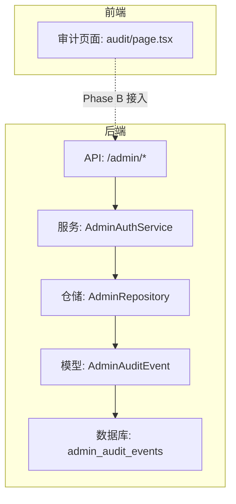
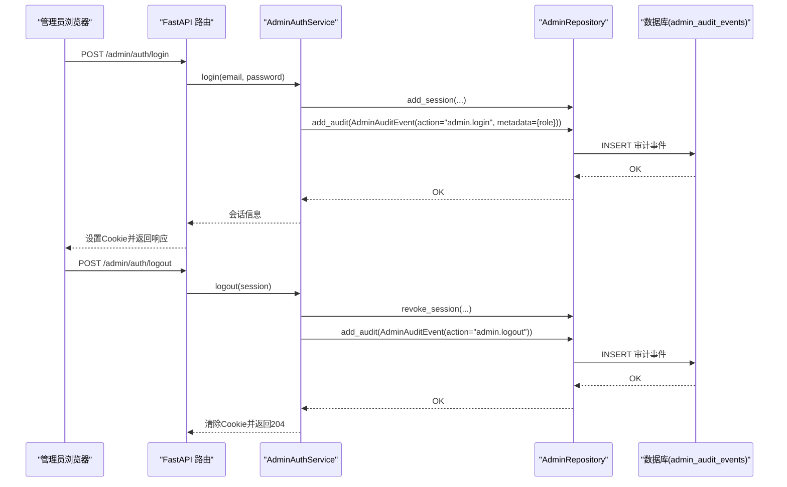
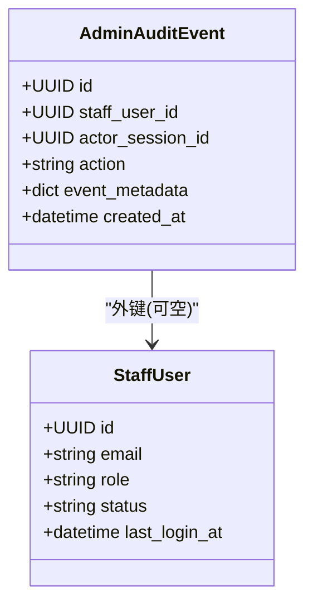
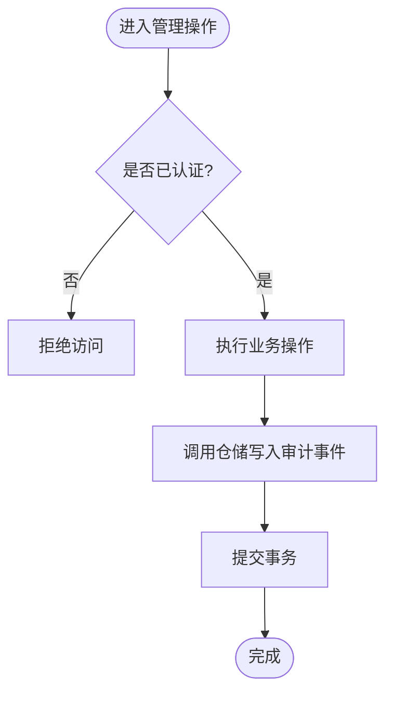
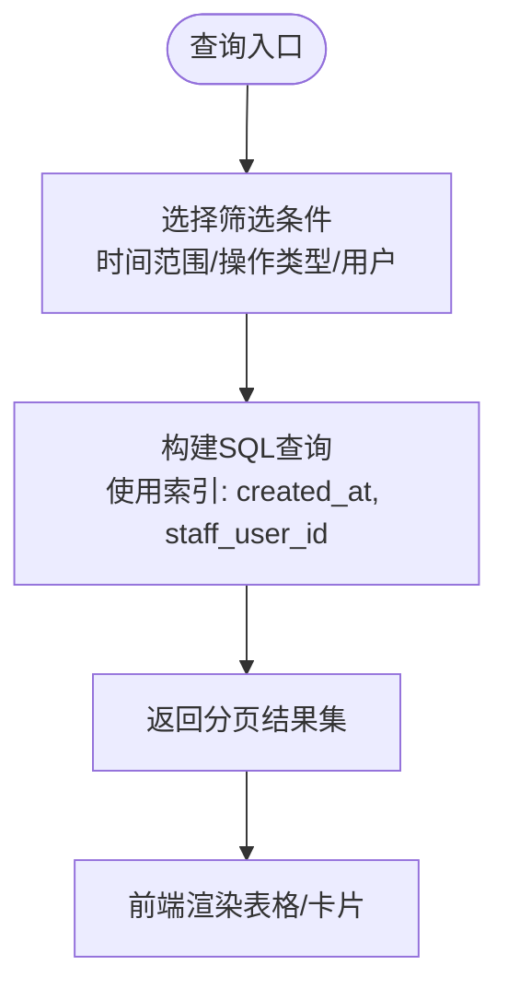
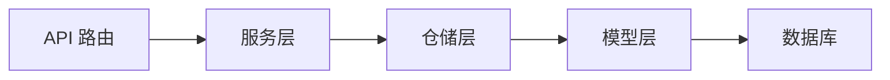

# 审计日志系统

<cite>
**本文引用的文件**
- [backend/app/admin/models.py](file://backend/app/admin/models.py)
- [backend/app/admin/service.py](file://backend/app/admin/service.py)
- [backend/app/admin/repository.py](file://backend/app/admin/repository.py)
- [backend/app/api/admin.py](file://backend/app/api/admin.py)
- [backend/alembic/versions/0008_admin_staff_foundation.py](file://backend/alembic/versions/0008_admin_staff_foundation.py)
- [admin/src/app/audit/page.tsx](file://admin/src/app/audit/page.tsx)
- [backend/app/identity/models.py](file://backend/app/identity/models.py)
</cite>

## 目录
1. [简介](#简介)
2. [项目结构](#项目结构)
3. [核心组件](#核心组件)
4. [架构总览](#架构总览)
5. [详细组件分析](#详细组件分析)
6. [依赖关系分析](#依赖关系分析)
7. [性能考虑](#性能考虑)
8. [故障排查指南](#故障排查指南)
9. [结论](#结论)
10. [附录](#附录)

## 简介
本文件面向“管理后台审计日志”能力，围绕 AdminAuditEvent 模型设计、事件类型与元数据、时间戳策略、记录机制（自动捕获与手动记录）、查询与分析能力、清理策略、格式规范、查询示例以及监控告警配置进行系统化说明。当前后端已具备登录/登出等关键操作的审计写入能力；前端审计页面预留占位，待接入审计事件 API。

## 项目结构
- 后端领域：
  - 模型层：AdminAuditEvent、StaffUser、StaffSession 定义于 admin/models.py；用户域通用 AuditEvent 定义于 identity/models.py。
  - 服务层：AdminAuthService 在登录/登出/引导创建时写入审计事件。
  - 仓储层：AdminRepository 提供 add_audit 等持久化辅助方法。
  - API 层：/admin/auth/login、/admin/auth/logout、/admin/me、/admin/overview 路由，负责鉴权、会话管理与审计触发点。
  - 迁移：0008_admin_staff_foundation.py 创建 staff_users、staff_sessions、admin_audit_events 表及索引。
- 前端：
  - admin/src/app/audit/page.tsx 为审计列表页面占位，提示后续接入 audit-events API。

**图表来源**
- [backend/app/api/admin.py:103-200](file://backend/app/api/admin.py#L103-L200)
- [backend/app/admin/service.py:49-129](file://backend/app/admin/service.py#L49-L129)
- [backend/app/admin/repository.py:39-40](file://backend/app/admin/repository.py#L39-L40)
- [backend/app/admin/models.py:59-80](file://backend/app/admin/models.py#L59-L80)
- [backend/alembic/versions/0008_admin_staff_foundation.py:71-103](file://backend/alembic/versions/0008_admin_staff_foundation.py#L71-L103)
- [admin/src/app/audit/page.tsx:4-10](file://admin/src/app/audit/page.tsx#L4-L10)

**章节来源**
- [backend/app/admin/models.py:17-80](file://backend/app/admin/models.py#L17-L80)
- [backend/app/admin/service.py:49-129](file://backend/app/admin/service.py#L49-L129)
- [backend/app/admin/repository.py:14-57](file://backend/app/admin/repository.py#L14-L57)
- [backend/app/api/admin.py:68-200](file://backend/app/api/admin.py#L68-L200)
- [backend/alembic/versions/0008_admin_staff_foundation.py:19-113](file://backend/alembic/versions/0008_admin_staff_foundation.py#L19-L113)
- [admin/src/app/audit/page.tsx:1-12](file://admin/src/app/audit/page.tsx#L1-L12)

## 核心组件
- AdminAuditEvent 模型：用于记录管理后台的关键操作，包含操作者、会话、动作类型、扩展元数据与时间戳。
- AdminAuthService：在登录、登出、引导创建超级管理员时自动写入审计事件。
- AdminRepository：封装对数据库的写操作，包括 add_audit。
- API 路由：/admin/auth/login、/admin/auth/logout 作为审计事件的触发入口。
- 迁移脚本：确保 admin_audit_events 表结构与索引就绪。

**章节来源**
- [backend/app/admin/models.py:59-80](file://backend/app/admin/models.py#L59-L80)
- [backend/app/admin/service.py:49-129](file://backend/app/admin/service.py#L49-L129)
- [backend/app/admin/repository.py:39-40](file://backend/app/admin/repository.py#L39-L40)
- [backend/app/api/admin.py:103-164](file://backend/app/api/admin.py#L103-L164)
- [backend/alembic/versions/0008_admin_staff_foundation.py:71-103](file://backend/alembic/versions/0008_admin_staff_foundation.py#L71-L103)

## 架构总览
审计日志以“只追加不改”为原则，通过服务层在关键业务路径中调用仓储写入事件，最终落库到 admin_audit_events 表。前端审计页面暂为占位，后续将对接审计事件查询 API。

**图表来源**
- [backend/app/api/admin.py:103-164](file://backend/app/api/admin.py#L103-L164)
- [backend/app/admin/service.py:49-101](file://backend/app/admin/service.py#L49-L101)
- [backend/app/admin/repository.py:36-40](file://backend/app/admin/repository.py#L36-L40)
- [backend/app/admin/models.py:59-80](file://backend/app/admin/models.py#L59-L80)

## 详细组件分析

### AdminAuditEvent 模型设计
- 字段与约束
  - id：UUID 主键，默认生成。
  - staff_user_id：可空外键，关联 staff_users，删除时置空，支持无会话或历史追溯场景。
  - actor_session_id：可空 UUID，记录操作时的会话标识，便于追踪同一会话下的连续操作。
  - action：字符串，最大长度120，表示操作类型，如 admin.login、admin.logout、admin.bootstrap_created。
  - event_metadata：JSON/JSONB 扩展字段，存储任意键值对，例如角色、邮箱等上下文信息。
  - created_at：带时区的时间戳，服务器默认当前时间，保证不可变性与一致性。
- 索引
  - ix_admin_audit_events_staff_user_id：按操作者快速筛选。
  - ix_admin_audit_events_created_at：按时间范围高效查询。
- 设计要点
  - 只追加：不更新历史事件，保障审计可追溯性。
  - 可扩展：event_metadata 允许在不变更表结构的情况下丰富上下文。
  - 安全：敏感信息应谨慎放入 event_metadata，避免泄露密钥或隐私数据。

**图表来源**
- [backend/app/admin/models.py:59-80](file://backend/app/admin/models.py#L59-L80)
- [backend/app/admin/models.py:17-34](file://backend/app/admin/models.py#L17-L34)
- [backend/alembic/versions/0008_admin_staff_foundation.py:71-103](file://backend/alembic/versions/0008_admin_staff_foundation.py#L71-L103)

**章节来源**
- [backend/app/admin/models.py:59-80](file://backend/app/admin/models.py#L59-L80)
- [backend/alembic/versions/0008_admin_staff_foundation.py:71-103](file://backend/alembic/versions/0008_admin_staff_foundation.py#L71-L103)

### 日志记录机制
- 自动捕获
  - 登录成功：写入 action="admin.login"，metadata 包含角色信息。
  - 登出：写入 action="admin.logout"，metadata 为空对象。
  - 引导创建超级管理员：写入 action="admin.bootstrap_created"，metadata 包含邮箱。
- 手动记录
  - 通过 AdminRepository.add_audit 可在任意业务路径插入审计事件，便于扩展其他管理操作（如审批、导出、批量修改）的审计。
- 异步写入
  - 当前实现为同步写入数据库事务内，确保强一致与幂等。若需高吞吐，可引入消息队列异步落盘，但需保证至少一次语义与去重。

**图表来源**
- [backend/app/api/admin.py:103-164](file://backend/app/api/admin.py#L103-L164)
- [backend/app/admin/service.py:49-129](file://backend/app/admin/service.py#L49-L129)
- [backend/app/admin/repository.py:39-40](file://backend/app/admin/repository.py#L39-L40)

**章节来源**
- [backend/app/admin/service.py:49-129](file://backend/app/admin/service.py#L49-L129)
- [backend/app/admin/repository.py:39-40](file://backend/app/admin/repository.py#L39-L40)
- [backend/app/api/admin.py:103-164](file://backend/app/api/admin.py#L103-L164)

### 日志查询功能
- 时间范围筛选
  - 基于 created_at 索引，支持按开始/结束时间过滤，适合查看某段时间内的操作轨迹。
- 操作类型过滤
  - 基于 action 字段，可按 admin.login、admin.logout、admin.bootstrap_created 等精确筛选。
- 用户追踪
  - 基于 staff_user_id 索引，可定位特定管理员的操作序列；结合 actor_session_id 可还原单次会话行为。
- 前端状态
  - 当前审计页面为占位，提示 Phase B 接入 audit-events API。

**图表来源**
- [backend/app/admin/models.py:59-80](file://backend/app/admin/models.py#L59-L80)
- [backend/alembic/versions/0008_admin_staff_foundation.py:92-103](file://backend/alembic/versions/0008_admin_staff_foundation.py#L92-L103)
- [admin/src/app/audit/page.tsx:4-10](file://admin/src/app/audit/page.tsx#L4-L10)

**章节来源**
- [backend/app/admin/models.py:59-80](file://backend/app/admin/models.py#L59-L80)
- [backend/alembic/versions/0008_admin_staff_foundation.py:92-103](file://backend/alembic/versions/0008_admin_staff_foundation.py#L92-L103)
- [admin/src/app/audit/page.tsx:4-10](file://admin/src/app/audit/page.tsx#L4-L10)

### 日志分析功能
- 操作统计
  - 按 action 分组计数，统计登录/登出/引导创建等频次。
  - 按 staff_user_id 分组，统计各管理员操作量。
- 异常检测
  - 短时间内大量失败登录尝试可作为异常信号（结合速率限制）。
  - 非活跃时段出现敏感操作可作为风险信号。
- 趋势分析
  - 基于 created_at 聚合，观察日/周/月维度的操作趋势，识别峰值与低谷。
- 实施建议
  - 在查询层增加聚合接口，或使用 OLAP 工具对历史数据进行离线分析。

[本节为概念性说明，不直接分析具体文件]

### 日志清理策略
- 保留期限
  - 建议按合规要求设定保留期（如 180 天），到期后归档或物理删除。
- 归档机制
  - 定期将过期数据导出为 JSON/CSV 并压缩归档至冷存储，保留审计证据链。
- 存储空间管理
  - 建立空间阈值告警，当表大小接近上限时触发清理任务。
- 实现建议
  - 使用定时任务扫描 created_at，分批删除或归档，避免长事务锁表。

[本节为概念性说明，不直接分析具体文件]

### 日志格式规范
- 必填字段
  - action：固定枚举或命名空间前缀，如 admin.*。
  - staff_user_id：操作者标识（可为空，用于系统级事件）。
  - actor_session_id：会话标识（可为空，用于无会话事件）。
  - event_metadata：结构化键值对，避免存放敏感明文。
  - created_at：服务器时间，不可篡改。
- 推荐字段
  - ip、user_agent、target_resource、result_code、message 等上下文信息。
- 安全建议
  - 禁止记录密码、令牌、完整请求体等敏感信息；如需记录，请脱敏或哈希。

[本节为概念性说明，不直接分析具体文件]

### 查询示例
- 最近24小时登录事件
  - 筛选条件：action = "admin.login"，created_at 在最近24小时内。
- 指定管理员的所有操作
  - 筛选条件：staff_user_id = 目标ID，按 created_at 降序。
- 登出事件统计
  - 筛选条件：action = "admin.logout"，按日期聚合计数。

[本节为概念性说明，不直接分析具体文件]

### 监控告警配置
- 指标采集
  - 登录失败次数、登出频率、引导创建次数、审计写入延迟。
- 告警规则
  - 登录失败率突增、非工作时间敏感操作、审计写入失败。
- 可视化
  - 仪表盘展示近7日操作趋势、异常事件分布、Top 操作者。

[本节为概念性说明，不直接分析具体文件]

## 依赖关系分析
- 模块耦合
  - API 路由依赖服务层进行业务编排与审计触发。
  - 服务层依赖仓储层进行持久化。
  - 仓储层依赖模型与数据库连接。
- 外部依赖
  - 数据库：PostgreSQL（JSONB 支持）。
  - 迁移工具：Alembic。
- 潜在循环依赖
  - 当前分层清晰，未见循环导入。

**图表来源**
- [backend/app/api/admin.py:103-200](file://backend/app/api/admin.py#L103-L200)
- [backend/app/admin/service.py:49-129](file://backend/app/admin/service.py#L49-L129)
- [backend/app/admin/repository.py:14-57](file://backend/app/admin/repository.py#L14-L57)
- [backend/app/admin/models.py:59-80](file://backend/app/admin/models.py#L59-L80)

**章节来源**
- [backend/app/api/admin.py:103-200](file://backend/app/api/admin.py#L103-L200)
- [backend/app/admin/service.py:49-129](file://backend/app/admin/service.py#L49-L129)
- [backend/app/admin/repository.py:14-57](file://backend/app/admin/repository.py#L14-L57)
- [backend/app/admin/models.py:59-80](file://backend/app/admin/models.py#L59-L80)

## 性能考虑
- 索引利用
  - 充分利用 created_at 与 staff_user_id 索引，避免全表扫描。
- 写入优化
  - 当前为同步写入，若审计量大，可改为异步批处理，降低主流程延迟。
- 查询优化
  - 分页查询，限制返回字段，避免大对象传输。
- 存储优化
  - 定期归档与清理，控制单表规模。

[本节为概念性说明，不直接分析具体文件]

## 故障排查指南
- 登录失败
  - 检查速率限制与凭据校验逻辑，确认未误报。
- 审计缺失
  - 检查服务层是否在关键路径调用 add_audit；确认事务提交成功。
- 查询缓慢
  - 确认索引存在且被使用；检查查询条件是否命中索引。
- 敏感信息泄露
  - 审查 event_metadata 内容，移除敏感字段。

**章节来源**
- [backend/app/api/admin.py:56-84](file://backend/app/api/admin.py#L56-L84)
- [backend/app/admin/service.py:49-129](file://backend/app/admin/service.py#L49-L129)
- [backend/app/admin/repository.py:39-40](file://backend/app/admin/repository.py#L39-L40)

## 结论
当前审计日志系统已具备基础能力：模型设计合理、关键操作自动记录、索引完善、前端预留接入点。下一步建议：
- 在前端实现审计事件查询与展示。
- 扩展更多管理操作的审计埋点。
- 引入异步写入与归档清理机制，提升性能与可维护性。
- 建立监控告警与可视化看板，增强运营可见性。

[本节为总结性内容，不直接分析具体文件]

## 附录
- 相关模型对比
  - 用户域 AuditEvent 与管理域 AdminAuditEvent 结构相似，均支持扩展元数据与时间戳。

**章节来源**
- [backend/app/identity/models.py:113-131](file://backend/app/identity/models.py#L113-L131)