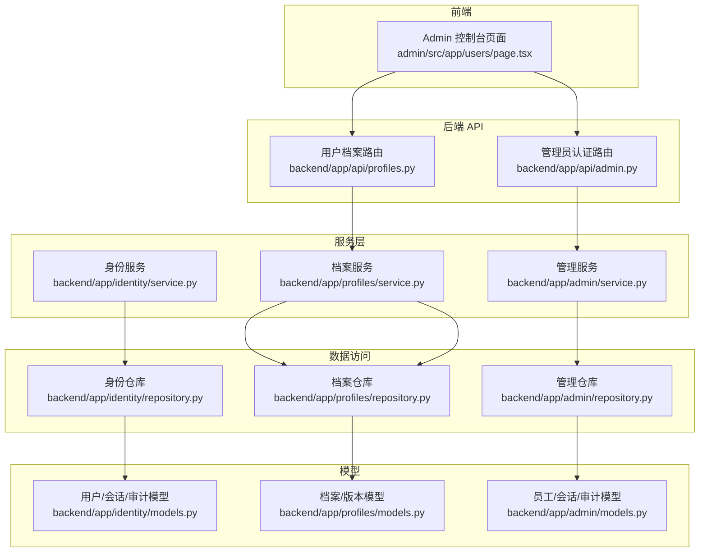
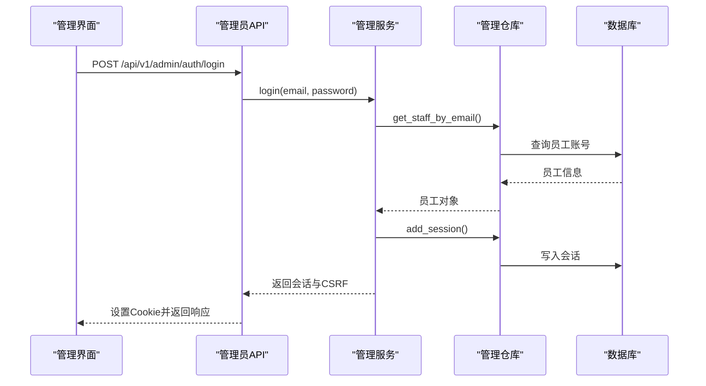
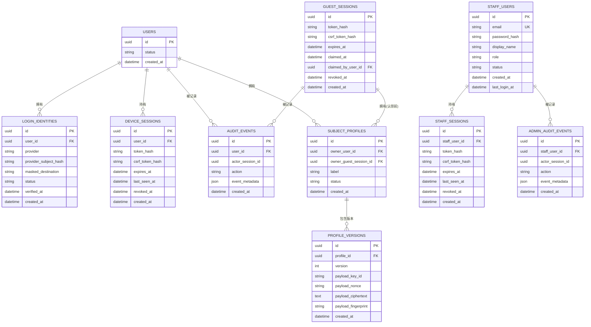
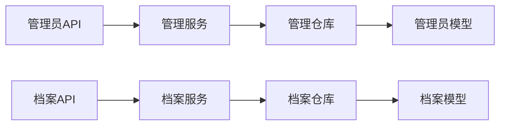

# 用户管理功能

<cite>
**本文引用的文件**
- [backend/app/identity/models.py](file://backend/app/identity/models.py)
- [backend/app/profiles/models.py](file://backend/app/profiles/models.py)
- [backend/app/admin/models.py](file://backend/app/admin/models.py)
- [backend/app/identity/service.py](file://backend/app/identity/service.py)
- [backend/app/profiles/service.py](file://backend/app/profiles/service.py)
- [backend/app/admin/service.py](file://backend/app/admin/service.py)
- [backend/app/api/admin.py](file://backend/app/api/admin.py)
- [backend/app/api/profiles.py](file://backend/app/api/profiles.py)
- [backend/app/identity/repository.py](file://backend/app/identity/repository.py)
- [backend/app/profiles/repository.py](file://backend/app/profiles/repository.py)
- [backend/app/admin/repository.py](file://backend/app/admin/repository.py)
- [contracts/openapi/admin-v1.yaml](file://contracts/openapi/admin-v1.yaml)
- [admin/src/app/users/page.tsx](file://admin/src/app/users/page.tsx)
</cite>

## 目录
1. [简介](#简介)
2. [项目结构](#项目结构)
3. [核心组件](#核心组件)
4. [架构总览](#架构总览)
5. [详细组件分析](#详细组件分析)
6. [依赖关系分析](#依赖关系分析)
7. [性能考虑](#性能考虑)
8. [故障排查指南](#故障排查指南)
9. [结论](#结论)
10. [附录](#附录)

## 简介
本文件面向“用户管理”能力，覆盖用户数据模型、身份与档案的关联、用户查询（搜索、分页、排序）、用户状态管理（激活、禁用、归档）、用户信息查看（基本信息、命盘数据、解读历史）以及批量操作（启用/禁用、导入/导出）。同时说明当前实现范围、待扩展点与权限控制策略。

## 项目结构
后端采用分层设计：API 层暴露 HTTP 接口；Service 层封装业务逻辑；Repository 层负责数据访问；Models 定义持久化实体。前端 Admin 控制台提供管理界面入口。

图表来源
- [backend/app/api/admin.py:1-200](file://backend/app/api/admin.py#L1-L200)
- [backend/app/api/profiles.py:1-111](file://backend/app/api/profiles.py#L1-L111)
- [backend/app/identity/service.py:1-192](file://backend/app/identity/service.py#L1-L192)
- [backend/app/profiles/service.py:1-189](file://backend/app/profiles/service.py#L1-L189)
- [backend/app/admin/service.py:1-148](file://backend/app/admin/service.py#L1-L148)
- [backend/app/identity/repository.py:1-114](file://backend/app/identity/repository.py#L1-L114)
- [backend/app/profiles/repository.py:1-198](file://backend/app/profiles/repository.py#L1-L198)
- [backend/app/admin/repository.py:1-57](file://backend/app/admin/repository.py#L1-L57)
- [backend/app/identity/models.py:1-132](file://backend/app/identity/models.py#L1-L132)
- [backend/app/profiles/models.py:1-80](file://backend/app/profiles/models.py#L1-L80)
- [backend/app/admin/models.py:1-81](file://backend/app/admin/models.py#L1-L81)
- [admin/src/app/users/page.tsx:1-13](file://admin/src/app/users/page.tsx#L1-L13)

章节来源
- [admin/src/app/users/page.tsx:1-13](file://admin/src/app/users/page.tsx#L1-L13)
- [backend/app/api/admin.py:1-200](file://backend/app/api/admin.py#L1-L200)
- [backend/app/api/profiles.py:1-111](file://backend/app/api/profiles.py#L1-L111)

## 核心组件
- 用户与身份
  - 用户实体：包含唯一标识、状态、创建时间等基础字段。
  - 登录身份：绑定第三方提供者与用户，支持多身份聚合。
  - 设备与会话：记录登录会话、CSRF、过期与撤销时间。
  - 访客会话：未注册用户临时会话，可被已验证用户认领。
  - 审计事件：记录关键安全与业务动作。
- 档案与版本
  - 主体档案：归属用户或访客会话，含标签与状态。
  - 档案版本：不可变加密存储，记录版本号和载荷指纹。
- 管理员与审计
  - 员工账号：后台管理账号、角色、状态、最后登录时间。
  - 员工会话：管理端登录会话、CSRF、过期与撤销。
  - 管理审计：记录管理端操作行为。

章节来源
- [backend/app/identity/models.py:31-132](file://backend/app/identity/models.py#L31-L132)
- [backend/app/profiles/models.py:21-80](file://backend/app/profiles/models.py#L21-L80)
- [backend/app/admin/models.py:17-81](file://backend/app/admin/models.py#L17-L81)

## 架构总览
系统通过 FastAPI 暴露两类主要接口：
- 管理员认证与管理概览：用于后台登录、登出、获取当前管理员信息与运营概览。
- 用户档案读写：用于创建草稿、确认版本、列出最新版本等。

图表来源
- [backend/app/api/admin.py:103-145](file://backend/app/api/admin.py#L103-L145)
- [backend/app/admin/service.py:49-89](file://backend/app/admin/service.py#L49-L89)
- [backend/app/admin/repository.py:22-37](file://backend/app/admin/repository.py#L22-L37)
- [contracts/openapi/admin-v1.yaml:15-40](file://contracts/openapi/admin-v1.yaml#L15-L40)

## 详细组件分析

### 数据模型与关联关系
- 用户与登录身份
  - 一个用户可以拥有多个登录身份（不同提供者），通过哈希值保证唯一性。
  - 身份状态为 active 时方可参与认证流程。
- 用户与会话
  - 设备会话绑定用户，记录令牌哈希、CSRF 哈希、过期与最后活跃时间。
  - 访客会话可被已验证用户认领，认领后资源所有权迁移至该用户。
- 档案与版本
  - 档案归属用户或访客会话之一，确保单一所有者。
  - 版本不可变，通过加密载荷与指纹保障完整性与机密性。
- 管理员与审计
  - 管理员账号具备角色与状态，会话独立于普通用户会话。
  - 管理审计记录管理员操作，便于追溯。

图表来源
- [backend/app/identity/models.py:31-132](file://backend/app/identity/models.py#L31-L132)
- [backend/app/profiles/models.py:21-80](file://backend/app/profiles/models.py#L21-L80)
- [backend/app/admin/models.py:17-81](file://backend/app/admin/models.py#L17-L81)

章节来源
- [backend/app/identity/models.py:31-132](file://backend/app/identity/models.py#L31-L132)
- [backend/app/profiles/models.py:21-80](file://backend/app/profiles/models.py#L21-L80)
- [backend/app/admin/models.py:17-81](file://backend/app/admin/models.py#L17-L81)

### 用户查询功能（搜索、分页、排序）
- 当前实现
  - 档案列表：按所有者（用户或访客）列出最新版本的档案摘要，默认按创建时间与版本ID倒序。
  - 身份列表：按用户ID列出活跃的身份，按创建时间和ID排序。
- 建议扩展
  - 搜索条件：支持按邮箱、姓名、注册时间区间、状态等过滤。
  - 分页处理：基于游标或偏移的分页参数，限制每页大小。
  - 排序选项：支持按注册时间、最近活跃时间、状态等排序。
- 注意
  - 敏感字段（如邮箱、手机号）在管理界面应默认打码展示。
  - 列表接口需结合权限校验，仅允许有相应角色的管理员访问。

章节来源
- [backend/app/profiles/repository.py:145-182](file://backend/app/profiles/repository.py#L145-L182)
- [backend/app/identity/repository.py:104-110](file://backend/app/identity/repository.py#L104-L110)
- [backend/app/api/profiles.py:96-111](file://backend/app/api/profiles.py#L96-L111)

### 用户状态管理（激活、禁用、归档）
- 当前实现
  - 用户状态：User.status 字段可用于表示激活/禁用/归档等状态。
  - 身份状态：LoginIdentity.status 控制是否可用。
  - 管理员状态：StaffUser.status 控制后台登录可用性。
  - 会话撤销：通过标记 revoked_at 实现会话失效。
- 建议扩展
  - 统一状态机：明确 active/inactive/archived 语义与转换规则。
  - 批量状态变更：提供批量启用/禁用的接口，并记录审计事件。
  - 软删除：归档不物理删除，保留历史数据与关联。

章节来源
- [backend/app/identity/models.py:31-66](file://backend/app/identity/models.py#L31-L66)
- [backend/app/admin/models.py:17-34](file://backend/app/admin/models.py#L17-L34)
- [backend/app/admin/repository.py:42-57](file://backend/app/admin/repository.py#L42-L57)

### 用户信息查看（基本信息、命盘数据、解读历史）
- 基本信息
  - 可通过管理员接口获取当前管理员信息（角色、邮箱、显示名、会话信息等）。
- 命盘数据
  - 档案版本以加密形式存储，读取时需解密并校验指纹。
  - 列表接口返回最新版本的摘要，详情接口可返回完整版本信息。
- 解读历史
  - 解读记录与档案版本关联，可按用户或访客会话查询。
  - 建议在管理界面增加“解读历史”视图，支持按时间、类型筛选。

章节来源
- [backend/app/api/admin.py:166-185](file://backend/app/api/admin.py#L166-L185)
- [backend/app/profiles/repository.py:184-198](file://backend/app/profiles/repository.py#L184-L198)
- [backend/app/profiles/service.py:107-128](file://backend/app/profiles/service.py#L107-L128)

### 批量操作（启用/禁用、导入/导出）
- 当前实现
  - 尚未提供专门的批量操作接口。
  - 可通过现有接口组合实现单条操作，但缺乏事务性与幂等保障。
- 建议扩展
  - 批量启用/禁用：提供批量更新用户状态的接口，支持任务队列与进度反馈。
  - 导入/导出：支持 CSV/Excel 格式，包含字段校验、错误报告与重试机制。
  - 审计记录：所有批量操作需记录操作人、时间、影响范围与结果。

章节来源
- [backend/app/admin/service.py:91-101](file://backend/app/admin/service.py#L91-L101)
- [contracts/openapi/admin-v1.yaml:69-82](file://contracts/openapi/admin-v1.yaml#L69-L82)

### 用户管理界面与操作流程
- 当前界面
  - 管理控制台“用户档案”页面已预留占位，提示后续接入 Admin users API。
- 操作流程（建议）
  - 登录管理端：使用邮箱与密码登录，设置会话与 CSRF Cookie。
  - 查询用户：输入搜索条件，选择分页与排序，查看用户列表。
  - 查看详情：点击用户进入详情页，查看基本信息、命盘数据、解读历史。
  - 状态变更：执行激活/禁用/归档操作，确认审计日志。
  - 批量操作：上传文件或选择多条记录，执行批量启用/禁用，查看任务进度。
  - 导入/导出：下载模板，填写数据后导入；导出当前筛选结果。

章节来源
- [admin/src/app/users/page.tsx:1-13](file://admin/src/app/users/page.tsx#L1-L13)
- [backend/app/api/admin.py:103-145](file://backend/app/api/admin.py#L103-L145)
- [contracts/openapi/admin-v1.yaml:15-40](file://contracts/openapi/admin-v1.yaml#L15-L40)

### 数据权限控制
- 管理员认证
  - 使用 Cookie 与 CSRF 双提交保护写操作。
  - 会话有效期与刷新策略由配置控制。
- 数据隔离
  - 档案与解读记录按所有者（用户或访客）隔离。
  - 管理员仅能访问授权范围内的数据。
- 审计追踪
  - 所有关键操作记录审计事件，包括操作人、时间、动作与元数据。

章节来源
- [backend/app/api/admin.py:68-100](file://backend/app/api/admin.py#L68-L100)
- [backend/app/admin/service.py:49-89](file://backend/app/admin/service.py#L49-L89)
- [backend/app/admin/repository.py:39-40](file://backend/app/admin/repository.py#L39-L40)

## 依赖关系分析
- 模块耦合
  - API 层依赖 Service 层进行业务编排。
  - Service 层依赖 Repository 层进行数据访问。
  - Repository 层直接操作 Models。
- 外部依赖
  - OpenAPI 规范定义管理员接口契约。
  - 加密库用于档案版本载荷的加解密。
- 潜在循环依赖
  - 当前分层清晰，未发现循环依赖。

图表来源
- [backend/app/api/admin.py:1-200](file://backend/app/api/admin.py#L1-L200)
- [backend/app/api/profiles.py:1-111](file://backend/app/api/profiles.py#L1-L111)
- [backend/app/admin/service.py:1-148](file://backend/app/admin/service.py#L1-L148)
- [backend/app/profiles/service.py:1-189](file://backend/app/profiles/service.py#L1-L189)
- [backend/app/admin/repository.py:1-57](file://backend/app/admin/repository.py#L1-L57)
- [backend/app/profiles/repository.py:1-198](file://backend/app/profiles/repository.py#L1-L198)
- [backend/app/admin/models.py:1-81](file://backend/app/admin/models.py#L1-L81)
- [backend/app/profiles/models.py:1-80](file://backend/app/profiles/models.py#L1-L80)

章节来源
- [backend/app/api/admin.py:1-200](file://backend/app/api/admin.py#L1-L200)
- [backend/app/api/profiles.py:1-111](file://backend/app/api/profiles.py#L1-L111)
- [backend/app/admin/service.py:1-148](file://backend/app/admin/service.py#L1-L148)
- [backend/app/profiles/service.py:1-189](file://backend/app/profiles/service.py#L1-L189)
- [backend/app/admin/repository.py:1-57](file://backend/app/admin/repository.py#L1-L57)
- [backend/app/profiles/repository.py:1-198](file://backend/app/profiles/repository.py#L1-L198)
- [backend/app/admin/models.py:1-81](file://backend/app/admin/models.py#L1-L81)
- [backend/app/profiles/models.py:1-80](file://backend/app/profiles/models.py#L1-L80)

## 性能考虑
- 查询优化
  - 列表接口使用子查询与分组获取最新版本，避免全表扫描。
  - 身份列表按创建时间与ID排序，建议添加索引。
- 并发控制
  - 档案版本创建使用行级锁防止重复确认。
  - 访客认领使用锁定查询保证原子性。
- 缓存策略
  - 可考虑对热点档案摘要进行短期缓存。
  - 管理员会话与 CSRF 令牌应避免频繁数据库查询。

章节来源
- [backend/app/profiles/repository.py:145-182](file://backend/app/profiles/repository.py#L145-L182)
- [backend/app/profiles/repository.py:57-77](file://backend/app/profiles/repository.py#L57-L77)
- [backend/app/profiles/service.py:130-178](file://backend/app/profiles/service.py#L130-L178)

## 故障排查指南
- 认证失败
  - 检查管理员会话是否存在且未过期。
  - 验证 CSRF 令牌是否匹配。
- 档案操作异常
  - 确认草稿是否存在且未被确认。
  - 检查版本创建是否因并发导致冲突。
- 访客认领失败
  - 确认访客会话未被认领且未过期。
  - 检查资源所有权迁移是否成功。

章节来源
- [backend/app/api/admin.py:68-100](file://backend/app/api/admin.py#L68-L100)
- [backend/app/api/profiles.py:63-93](file://backend/app/api/profiles.py#L63-L93)
- [backend/app/profiles/service.py:130-178](file://backend/app/profiles/service.py#L130-L178)

## 结论
当前系统已具备用户与身份的基础模型、档案与版本的可信存储、管理员认证与会话管理。用户管理功能在查询、状态管理与查看方面已有部分实现，批量操作与高级查询仍需扩展。建议优先完善批量操作接口、增强查询能力与权限控制，以提升管理效率与安全性。

## 附录
- 管理员接口契约参考 OpenAPI 文档。
- 前端页面占位说明后续接入计划。

章节来源
- [contracts/openapi/admin-v1.yaml:1-231](file://contracts/openapi/admin-v1.yaml#L1-L231)
- [admin/src/app/users/page.tsx:1-13](file://admin/src/app/users/page.tsx#L1-L13)