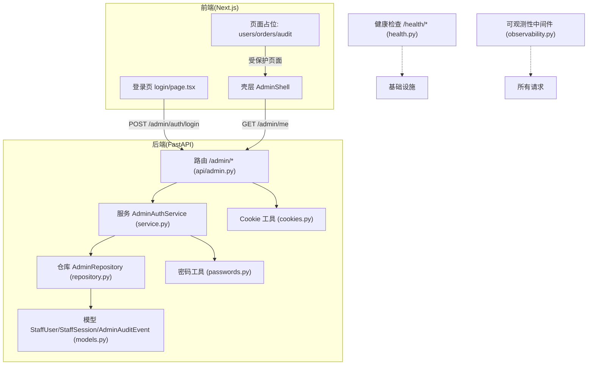
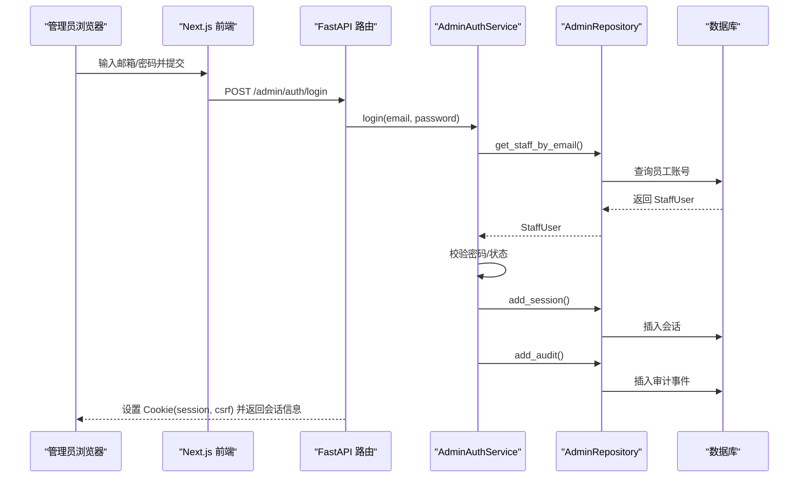
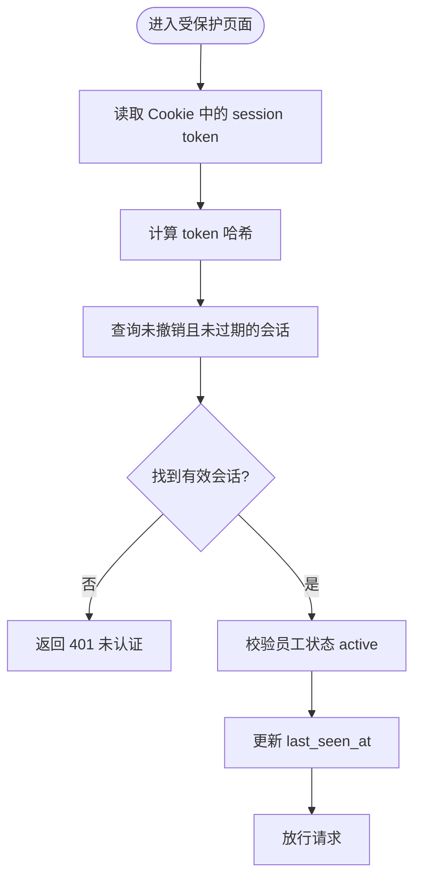
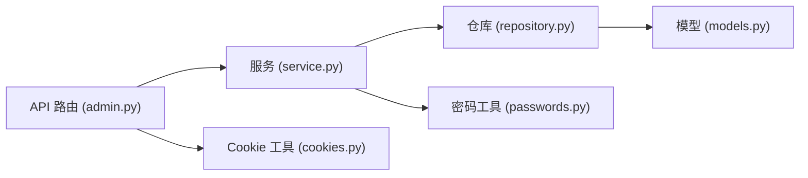

# 管理后台功能

<cite>
**本文引用的文件**
- [backend/app/admin/service.py](file://backend/app/admin/service.py)
- [backend/app/admin/models.py](file://backend/app/admin/models.py)
- [backend/app/admin/repository.py](file://backend/app/admin/repository.py)
- [backend/app/api/admin.py](file://backend/app/api/admin.py)
- [backend/app/admin/cookies.py](file://backend/app/admin/cookies.py)
- [backend/app/admin/passwords.py](file://backend/app/admin/passwords.py)
- [admin/src/lib/api.ts](file://admin/src/lib/api.ts)
- [admin/src/components/admin-shell.tsx](file://admin/src/components/admin-shell.tsx)
- [admin/src/app/login/page.tsx](file://admin/src/app/login/page.tsx)
- [admin/src/app/users/page.tsx](file://admin/src/app/users/page.tsx)
- [admin/src/app/orders/page.tsx](file://admin/src/app/orders/page.tsx)
- [admin/src/app/audit/page.tsx](file://admin/src/app/audit/page.tsx)
- [backend/app/api/health.py](file://backend/app/api/health.py)
- [backend/app/observability.py](file://backend/app/observability.py)
</cite>

## 目录
1. [简介](#简介)
2. [项目结构](#项目结构)
3. [核心组件](#核心组件)
4. [架构总览](#架构总览)
5. [详细组件分析](#详细组件分析)
6. [依赖关系分析](#依赖关系分析)
7. [性能考虑](#性能考虑)
8. [故障排查指南](#故障排查指南)
9. [结论](#结论)
10. [附录](#附录)

## 简介
本文件面向“管理后台”能力，覆盖管理员认证与会话、用户管理、订单与退款、审计日志、系统监控与可观测性、以及内容管理（配置、模板、发布控制）等模块。当前代码库已实现：
- 管理员认证与会话：基于 Cookie + CSRF 的会话机制，支持登录、登出、当前身份查询、概览入口。
- 数据模型与持久化：StaffUser、StaffSession、AdminAuditEvent 三张表，提供增删查改与撤销会话能力。
- 前端壳层与导航：Next.js 管理端壳层，统一鉴权校验、导航与退出流程；登录页对接后端登录接口。
- 健康检查与可观测性：/health/live 与 /health/ready 探针，HTTP 请求级日志与追踪 ID。

尚未接入的部分（页面占位）：
- 用户列表、订单支付、退款审批、审计日志列表等页面目前为占位，标注后续接入计划。

## 项目结构
管理后台由前后端两部分组成：
- 后端（FastAPI）：提供管理员认证、会话、审计事件等 API，并暴露健康检查与可观测性中间件。
- 前端（Next.js）：提供登录、壳层导航、各管理页面占位，统一通过 adminFetch 调用后端 API。

图表来源
- [backend/app/api/admin.py:1-200](file://backend/app/api/admin.py#L1-L200)
- [backend/app/admin/service.py:1-148](file://backend/app/admin/service.py#L1-L148)
- [backend/app/admin/repository.py:1-57](file://backend/app/admin/repository.py#L1-L57)
- [backend/app/admin/models.py:1-81](file://backend/app/admin/models.py#L1-L81)
- [backend/app/admin/cookies.py:1-81](file://backend/app/admin/cookies.py#L1-L81)
- [backend/app/admin/passwords.py:1-55](file://backend/app/admin/passwords.py#L1-L55)
- [backend/app/api/health.py:1-37](file://backend/app/api/health.py#L1-L37)
- [backend/app/observability.py:1-52](file://backend/app/observability.py#L1-L52)

章节来源
- [admin/src/app/login/page.tsx:1-82](file://admin/src/app/login/page.tsx#L1-L82)
- [admin/src/components/admin-shell.tsx:1-116](file://admin/src/components/admin-shell.tsx#L1-L116)
- [admin/src/app/users/page.tsx:1-13](file://admin/src/app/users/page.tsx#L1-L13)
- [admin/src/app/orders/page.tsx:1-12](file://admin/src/app/orders/page.tsx#L1-L12)
- [admin/src/app/audit/page.tsx:1-12](file://admin/src/app/audit/page.tsx#L1-L12)

## 核心组件
- 管理员认证与会话
  - 登录：校验邮箱/密码，必要时进行引导式初始化（仅允许的环境），创建会话并写入 Cookie。
  - 会话验证：从 Cookie 读取 token，哈希后查询有效会话，校验状态并续期 last_seen_at。
  - 登出：撤销会话并清除 Cookie。
  - 当前身份：返回 staff 基本信息与会话过期时间。
- 数据模型
  - StaffUser：员工账号、角色、状态、最后登录时间。
  - StaffSession：会话令牌哈希、CSRF 令牌哈希、过期时间、最后访问时间、撤销时间。
  - AdminAuditEvent：操作记录（谁、在哪个会话、做了什么、元数据）。
- 安全与凭据
  - 密码使用 scrypt 加盐哈希存储与验证。
  - CSRF 防护：Cookie 中的 x-csrf-token 与请求头一致，并与服务端存储的哈希比对。
- 前端壳层与登录
  - 登录页提交邮箱/密码到 /admin/auth/login，成功后跳转首页。
  - 壳层在进入页面时调用 /admin/me 校验会话，失败则重定向至登录页。
  - 统一封装 adminFetch，自动携带 CSRF 头与 same-origin 凭证。

章节来源
- [backend/app/api/admin.py:68-100](file://backend/app/api/admin.py#L68-L100)
- [backend/app/api/admin.py:103-145](file://backend/app/api/admin.py#L103-L145)
- [backend/app/api/admin.py:148-163](file://backend/app/api/admin.py#L148-L163)
- [backend/app/api/admin.py:166-185](file://backend/app/api/admin.py#L166-L185)
- [backend/app/admin/service.py:33-89](file://backend/app/admin/service.py#L33-L89)
- [backend/app/admin/service.py:91-129](file://backend/app/admin/service.py#L91-L129)
- [backend/app/admin/models.py:17-81](file://backend/app/admin/models.py#L17-L81)
- [backend/app/admin/passwords.py:16-54](file://backend/app/admin/passwords.py#L16-L54)
- [admin/src/lib/api.ts:28-79](file://admin/src/lib/api.ts#L28-L79)
- [admin/src/app/login/page.tsx:17-31](file://admin/src/app/login/page.tsx#L17-L31)
- [admin/src/components/admin-shell.tsx:36-59](file://admin/src/components/admin-shell.tsx#L36-L59)

## 架构总览
管理后台采用前后端分离架构：前端 Next.js 负责页面与交互，后端 FastAPI 提供 RESTful API。认证与会话通过 Cookie 传递，敏感写操作启用 CSRF 校验。健康检查与可观测性贯穿全链路。

图表来源
- [backend/app/api/admin.py:103-145](file://backend/app/api/admin.py#L103-L145)
- [backend/app/admin/service.py:49-89](file://backend/app/admin/service.py#L49-L89)
- [backend/app/admin/repository.py:22-40](file://backend/app/admin/repository.py#L22-L40)

## 详细组件分析

### 管理员认证与会话
- 登录流程
  - 速率限制：按邮箱桶对登录尝试限流。
  - 认证：查找活跃员工，必要时执行一次性引导初始化（仅 local/test 环境）。
  - 会话：生成 token 与 csrf_token，哈希后落库，记录过期时间与最后访问时间。
  - 审计：记录 admin.login 事件。
  - 响应：设置 HttpOnly 会话 Cookie 与非 HttpOnly 的 CSRF Cookie，返回会话元信息。
- 会话校验
  - require_staff_session：从 Cookie 取 token，哈希后查询未撤销且未过期的会话，校验员工状态，更新 last_seen_at。
  - require_staff_csrf：校验请求头 x-csrf-token 与 Cookie 一致，并与服务端存储的哈希比对。
- 登出流程
  - 撤销会话并记录 admin.logout 审计事件，清除 Cookie。
- 当前身份
  - 返回员工 id、角色、邮箱、显示名、会话 id 与过期时间。

图表来源
- [backend/app/api/admin.py:68-84](file://backend/app/api/admin.py#L68-L84)
- [backend/app/admin/repository.py:42-53](file://backend/app/admin/repository.py#L42-L53)

章节来源
- [backend/app/api/admin.py:56-100](file://backend/app/api/admin.py#L56-L100)
- [backend/app/api/admin.py:103-163](file://backend/app/api/admin.py#L103-L163)
- [backend/app/admin/service.py:33-129](file://backend/app/admin/service.py#L33-L129)
- [backend/app/admin/cookies.py:15-81](file://backend/app/admin/cookies.py#L15-L81)

### 用户管理
- 现状：前端 /users 页面为占位，提示 Phase B 接入 Admin users API。
- 设计要点（建议）
  - 列表查询：分页、筛选（状态、角色）、排序。
  - 详情查看：脱敏展示敏感字段，只读模式。
  - 状态管理：激活/禁用、角色变更需二次确认与审计。
  - 权限矩阵：support/finance/ops/superadmin 不同可见范围与操作权限。

章节来源
- [admin/src/app/users/page.tsx:1-13](file://admin/src/app/users/page.tsx#L1-L13)
- [admin/src/lib/api.ts:1-26](file://admin/src/lib/api.ts#L1-L26)

### 订单管理系统
- 现状：前端 /orders 页面为占位，提示 Phase B 接入 Admin orders API。
- 设计要点（建议）
  - 订单查询：按时间、状态、渠道、金额区间筛选。
  - 状态跟踪：支付中、已支付、已退款、异常等状态流转。
  - 处理流程：人工复核、重试、冲正、对账差异处理。
  - 审计：关键操作记录操作人、会话、参数摘要。

章节来源
- [admin/src/app/orders/page.tsx:1-12](file://admin/src/app/orders/page.tsx#L1-L12)

### 审计日志系统
- 现状：前端 /audit 页面为占位，提示 Phase B 接入 audit-events API。
- 现有能力
  - 后端已定义 AdminAuditEvent 模型，并在登录/登出/引导初始化时写入事件。
  - 索引优化：按 staff_user_id 与 created_at 建立索引，便于按人员与时间检索。
- 设计要点（建议）
  - 日志查询：按操作人、时间范围、动作类型、会话过滤。
  - 数据分析：统计高频操作、异常行为、风险告警。
  - 数据安全：日志脱敏，禁止记录敏感明文。

章节来源
- [backend/app/admin/models.py:59-81](file://backend/app/admin/models.py#L59-L81)
- [backend/app/admin/service.py:74-82](file://backend/app/admin/service.py#L74-L82)
- [backend/app/admin/service.py:94-101](file://backend/app/admin/service.py#L94-L101)
- [backend/app/admin/service.py:121-128](file://backend/app/admin/service.py#L121-L128)
- [admin/src/app/audit/page.tsx:1-12](file://admin/src/app/audit/page.tsx#L1-L12)

### 系统监控与可观测性
- 健康检查
  - /health/live：快速存活探针。
  - /health/ready：就绪探针，依赖外部资源可用性。
- 可观测性
  - 中间件注入 X-Request-ID，记录 HTTP 请求方法、路径、状态码、耗时。
  - 屏蔽敏感传输日志器，降低噪声。
- 建议扩展
  - 指标采集：QPS、延迟分位、错误率、队列积压。
  - 错误追踪：结构化异常堆栈、上下文关联。

章节来源
- [backend/app/api/health.py:11-36](file://backend/app/api/health.py#L11-L36)
- [backend/app/observability.py:14-52](file://backend/app/observability.py#L14-L52)

### 内容管理（配置、模板、发布控制）
- 现状：当前代码未包含内容管理相关 API 或页面。
- 设计要点（建议）
  - 配置管理：键值型配置，版本化与灰度发布。
  - 模板管理：富文本/JSON Schema 模板，预览与回滚。
  - 发布控制：草稿、预发、线上多环境隔离，发布审批流。
  - 审计：配置变更、模板替换、发布操作均记录审计事件。

[本节为概念性说明，不直接分析具体文件]

## 依赖关系分析
- 组件耦合
  - API 路由依赖服务层，服务层依赖仓库，仓库依赖 ORM 模型。
  - Cookie 工具独立于业务逻辑，被路由与服务共同复用。
  - 密码工具仅用于凭据哈希与校验，无副作用。
- 外部依赖
  - 数据库：PostgreSQL（JSONB 变体）。
  - 运行时：FastAPI、SQLAlchemy Async。
- 潜在循环依赖
  - 当前分层清晰，未见循环导入。

图表来源
- [backend/app/api/admin.py:1-200](file://backend/app/api/admin.py#L1-L200)
- [backend/app/admin/service.py:1-148](file://backend/app/admin/service.py#L1-L148)
- [backend/app/admin/repository.py:1-57](file://backend/app/admin/repository.py#L1-L57)
- [backend/app/admin/models.py:1-81](file://backend/app/admin/models.py#L1-L81)
- [backend/app/admin/cookies.py:1-81](file://backend/app/admin/cookies.py#L1-L81)
- [backend/app/admin/passwords.py:1-55](file://backend/app/admin/passwords.py#L1-L55)

章节来源
- [backend/app/api/admin.py:1-200](file://backend/app/api/admin.py#L1-L200)
- [backend/app/admin/service.py:1-148](file://backend/app/admin/service.py#L1-L148)

## 性能考虑
- 会话查询
  - 使用 token_hash 唯一约束与索引，避免明文比较与全表扫描。
  - 每次访问更新 last_seen_at，利于识别僵尸会话。
- 登录限流
  - 基于窗口限流器，防止暴力破解与滥用。
- 密码强度
  - scrypt 参数可调，平衡安全性与 CPU 开销。
- 健康检查
  - /health/ready 应轻量，避免阻塞启动或影响探针判定。
- 可观测性
  - 请求级日志包含耗时，便于定位慢请求；注意采样与脱敏。

[本节提供通用指导，不直接分析具体文件]

## 故障排查指南
- 401 未认证
  - 可能原因：缺少 Cookie、会话已撤销或过期、员工状态非 active。
  - 排查步骤：检查 Cookie 是否存在；核对会话是否有效；确认员工状态。
- 403 CSRF 校验失败
  - 可能原因：缺少 x-csrf-token 头、与 Cookie 不一致、或服务端哈希不匹配。
  - 排查步骤：确保前端 adminFetch 自动携带 CSRF 头；检查 Cookie 域与路径；确认服务端哈希比对。
- 登录失败
  - 可能原因：邮箱不存在、密码错误、账户非 active、环境不允许引导初始化。
  - 排查步骤：检查速率限制；确认环境变量 allow_bootstrap；核对密码哈希策略。
- 健康检查异常
  - /health/ready 返回 503：检查依赖（如数据库）是否可用；审查 readiness_probe 实现。
- 日志与追踪
  - 使用 X-Request-ID 关联请求；观察 observability 中间件输出；定位慢请求与错误堆栈。

章节来源
- [backend/app/api/admin.py:68-100](file://backend/app/api/admin.py#L68-L100)
- [backend/app/api/admin.py:103-163](file://backend/app/api/admin.py#L103-L163)
- [backend/app/api/health.py:11-36](file://backend/app/api/health.py#L11-L36)
- [backend/app/observability.py:20-52](file://backend/app/observability.py#L20-L52)

## 结论
当前管理后台已具备完整的管理员认证与会话体系，提供安全的登录、登出与身份校验能力，并通过审计事件记录关键操作。前端壳层统一了鉴权与导航体验。健康检查与可观测性为运维提供了基础保障。用户管理、订单、退款与审计日志等页面目前为占位，待 Phase B 接入相应 API 后即可完善。建议在后续迭代中补齐这些模块，并引入更丰富的监控指标与错误追踪能力。

[本节为总结性内容，不直接分析具体文件]

## 附录

### 权限矩阵（建议）
- support：只读用户档案与解读任务，不可修改订单与退款。
- finance：查看订单与退款，发起复核与冲正，不可修改系统配置。
- ops：查看与处理队列、配置与模板发布，受限审计。
- superadmin：全部权限，含系统配置与模板发布。

[本节为概念性说明，不直接分析具体文件]

### 操作流程（示例）
- 登录
  - 打开登录页，输入工作邮箱与密码，提交后设置 Cookie 并跳转首页。
- 进入受保护页面
  - 壳层调用 /admin/me 校验会话，失败则重定向登录页。
- 登出
  - 点击退出，调用 /admin/auth/logout，清除 Cookie 并跳转登录页。

章节来源
- [admin/src/app/login/page.tsx:17-31](file://admin/src/app/login/page.tsx#L17-L31)
- [admin/src/components/admin-shell.tsx:36-59](file://admin/src/components/admin-shell.tsx#L36-L59)
- [backend/app/api/admin.py:103-163](file://backend/app/api/admin.py#L103-L163)