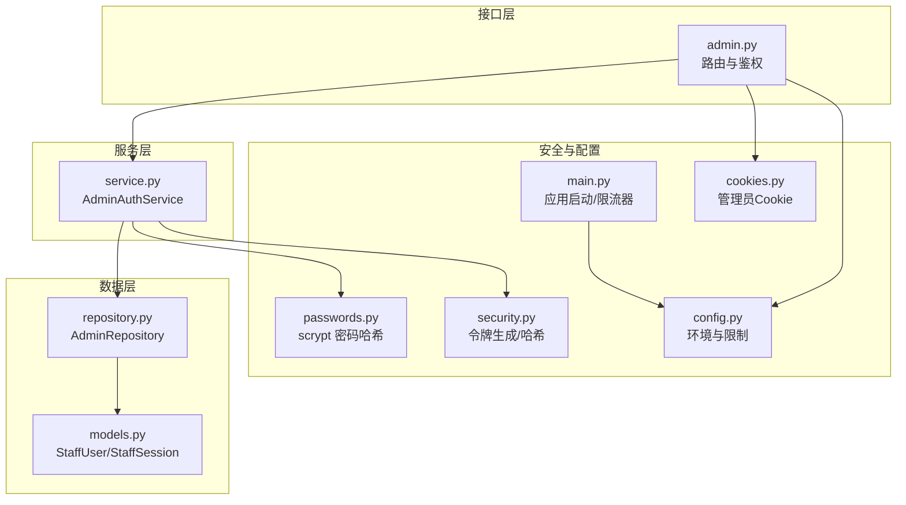
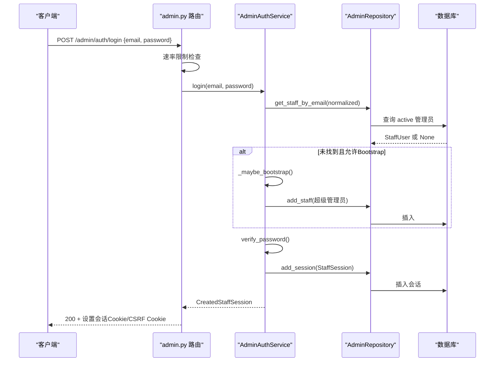
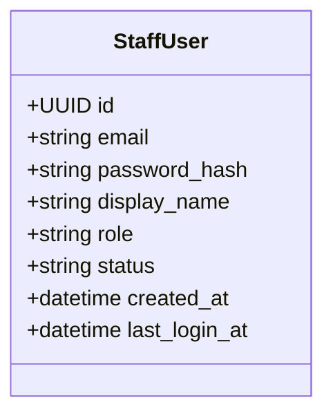
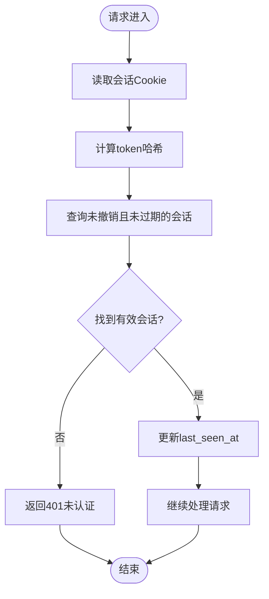
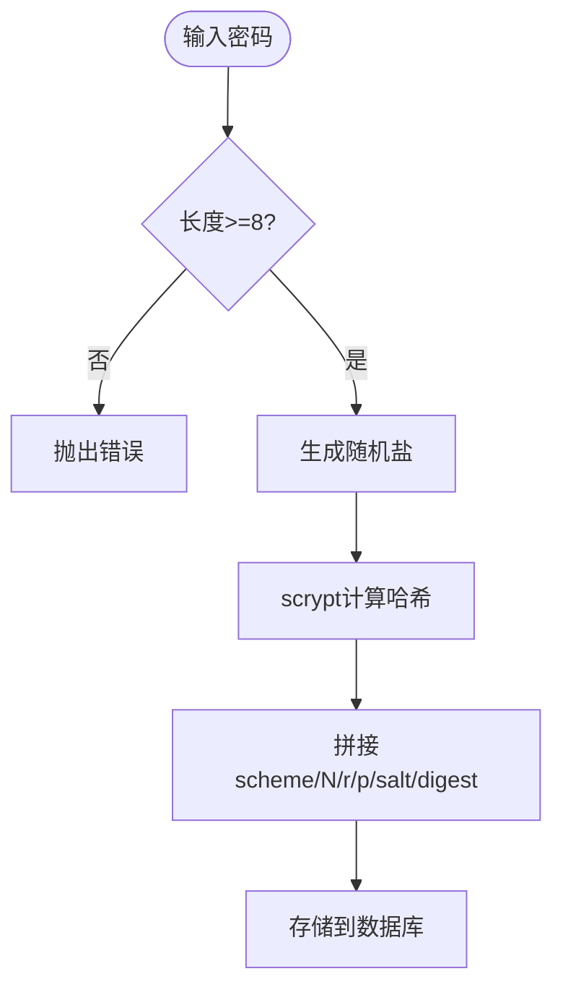
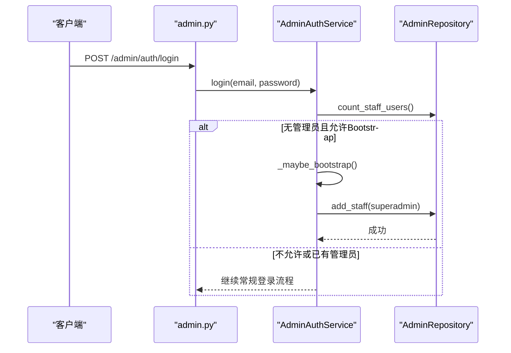
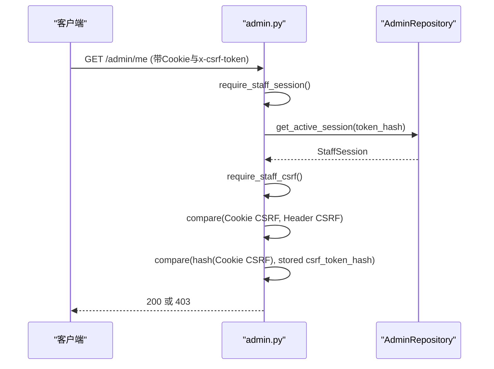
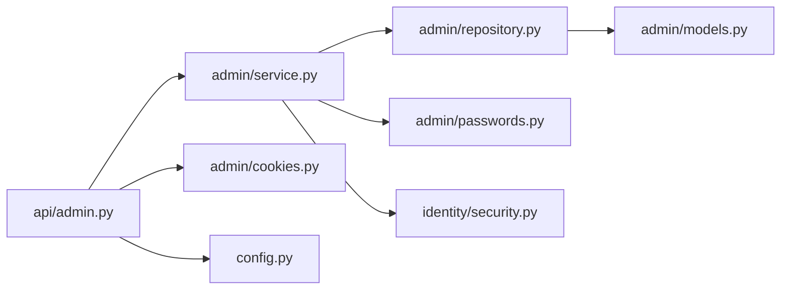
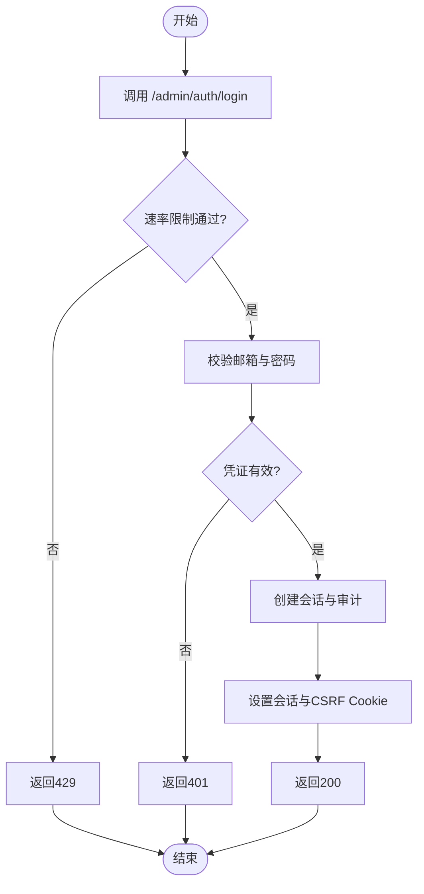

# 管理员认证系统

<cite>
**本文引用的文件**
- [backend/app/admin/models.py](file://backend/app/admin/models.py)
- [backend/app/admin/service.py](file://backend/app/admin/service.py)
- [backend/app/admin/repository.py](file://backend/app/admin/repository.py)
- [backend/app/admin/passwords.py](file://backend/app/admin/passwords.py)
- [backend/app/admin/cookies.py](file://backend/app/admin/cookies.py)
- [backend/app/admin/schemas.py](file://backend/app/admin/schemas.py)
- [backend/app/api/admin.py](file://backend/app/api/admin.py)
- [backend/app/config.py](file://backend/app/config.py)
- [backend/app/main.py](file://backend/app/main.py)
- [backend/app/identity/security.py](file://backend/app/identity/security.py)
</cite>

## 目录
1. [简介](#简介)
2. [项目结构](#项目结构)
3. [核心组件](#核心组件)
4. [架构总览](#架构总览)
5. [详细组件分析](#详细组件分析)
6. [依赖关系分析](#依赖关系分析)
7. [性能与安全考量](#性能与安全考量)
8. [故障排查指南](#故障排查指南)
9. [结论](#结论)
10. [附录：API与流程图](#附录api与流程图)

## 简介
本文件面向管理员认证子系统，系统性说明 StaffUser 模型、StaffSession 会话管理、密码安全策略、Bootstrap 初始化流程以及 CSRF 保护机制。文档同时提供认证流程图、关键 API 示例与安全最佳实践，帮助读者快速理解并正确集成该子系统。

## 项目结构
管理员认证相关代码集中在后端 backend/app 下的 admin 模块与 api/admin 路由中，配合配置模块 config 和通用安全工具 identity/security。整体采用分层设计：
- 数据层：models（ORM 模型）、repository（持久化访问）
- 服务层：service（业务逻辑：登录、登出、Bootstrap）
- 接口层：api/admin（HTTP 路由、鉴权中间件、CSRF 校验）
- 安全与配置：passwords（密码哈希）、identity/security（令牌生成与哈希）、config（环境与安全约束）、main（应用启动与限流器装配）

图表来源
- [backend/app/api/admin.py:1-200](file://backend/app/api/admin.py#L1-L200)
- [backend/app/admin/service.py:1-148](file://backend/app/admin/service.py#L1-L148)
- [backend/app/admin/models.py:1-81](file://backend/app/admin/models.py#L1-L81)
- [backend/app/admin/repository.py:1-57](file://backend/app/admin/repository.py#L1-L57)
- [backend/app/admin/passwords.py:1-55](file://backend/app/admin/passwords.py#L1-L55)
- [backend/app/identity/security.py:1-11](file://backend/app/identity/security.py#L1-L11)
- [backend/app/config.py:62-146](file://backend/app/config.py#L62-L146)
- [backend/app/main.py:30-156](file://backend/app/main.py#L30-L156)
- [backend/app/admin/cookies.py:1-81](file://backend/app/admin/cookies.py#L1-L81)

章节来源
- [backend/app/api/admin.py:1-200](file://backend/app/api/admin.py#L1-L200)
- [backend/app/admin/service.py:1-148](file://backend/app/admin/service.py#L1-L148)
- [backend/app/admin/models.py:1-81](file://backend/app/admin/models.py#L1-L81)
- [backend/app/admin/repository.py:1-57](file://backend/app/admin/repository.py#L1-L57)
- [backend/app/admin/passwords.py:1-55](file://backend/app/admin/passwords.py#L1-L55)
- [backend/app/identity/security.py:1-11](file://backend/app/identity/security.py#L1-L11)
- [backend/app/config.py:62-146](file://backend/app/config.py#L62-L146)
- [backend/app/main.py:30-156](file://backend/app/main.py#L30-L156)
- [backend/app/admin/cookies.py:1-81](file://backend/app/admin/cookies.py#L1-L81)

## 核心组件
- StaffUser：管理员用户实体，包含邮箱、密码哈希、显示名、角色、状态、创建时间与最后登录时间等字段；支持唯一索引与状态索引。
- StaffSession：管理员会话实体，存储会话关联的用户、令牌哈希、CSRF 令牌哈希、过期时间、最后活跃时间、撤销时间与创建时间。
- AdminAuthService：负责登录、登出、Bootstrap 自动创建超级管理员账户、生成会话与审计事件。
- AdminRepository：封装对 StaffUser、StaffSession、AdminAuditEvent 的数据库操作。
- 密码安全：基于 scrypt 的本地实现，含强度校验与常量时间比较验证。
- CSRF 保护：通过 Cookie 与请求头双重令牌比对，并结合服务端存储的哈希进行校验。
- 配置与安全：环境变量驱动，生产环境强制安全策略（如禁用 Bootstrap、强制 Secure Cookie）。

章节来源
- [backend/app/admin/models.py:17-81](file://backend/app/admin/models.py#L17-L81)
- [backend/app/admin/service.py:33-129](file://backend/app/admin/service.py#L33-L129)
- [backend/app/admin/repository.py:14-57](file://backend/app/admin/repository.py#L14-L57)
- [backend/app/admin/passwords.py:16-55](file://backend/app/admin/passwords.py#L16-L55)
- [backend/app/api/admin.py:68-100](file://backend/app/api/admin.py#L68-L100)
- [backend/app/config.py:141-145](file://backend/app/config.py#L141-L145)

## 架构总览
管理员认证的核心交互如下：
- 客户端调用 /admin/auth/login 提交邮箱与密码
- 接口层进行速率限制与参数校验
- 服务层执行身份校验、可选 Bootstrap 创建超级管理员、生成会话与审计
- 响应设置管理员会话 Cookie 与 CSRF Cookie
- 后续受保护接口通过 require_staff_session 与 require_staff_csrf 校验会话与 CSRF

图表来源
- [backend/app/api/admin.py:103-145](file://backend/app/api/admin.py#L103-L145)
- [backend/app/admin/service.py:49-89](file://backend/app/admin/service.py#L49-L89)
- [backend/app/admin/repository.py:22-37](file://backend/app/admin/repository.py#L22-L37)
- [backend/app/admin/passwords.py:34-55](file://backend/app/admin/passwords.py#L34-L55)

## 详细组件分析

### StaffUser 模型设计
- 字段与约束
  - id：UUID 主键
  - email：唯一约束，用于登录识别
  - password_hash：固定长度字符串，存储 scrypt 编码结果
  - display_name：显示名称
  - role：角色枚举（support、finance、ops、superadmin），由 schemas 定义
  - status：状态（默认 active），用于控制是否可登录
  - created_at、last_login_at：审计与活跃度追踪
- 索引与约束
  - 唯一索引 uq_staff_users_email
  - 状态索引 ix_staff_users_status，加速按状态查询

图表来源
- [backend/app/admin/models.py:17-34](file://backend/app/admin/models.py#L17-L34)
- [backend/app/admin/schemas.py:11-18](file://backend/app/admin/schemas.py#L11-L18)

章节来源
- [backend/app/admin/models.py:17-34](file://backend/app/admin/models.py#L17-L34)
- [backend/app/admin/schemas.py:11-18](file://backend/app/admin/schemas.py#L11-L18)

### StaffSession 会话管理机制
- 生命周期
  - 创建：登录成功后生成不透明 token 与 csrf_token，分别以哈希形式存入数据库，记录 expires_at、last_seen_at
  - 验证：每次受保护请求读取 Cookie 中的 session token，计算哈希后查询有效会话（未撤销且未过期）
  - 刷新：更新 last_seen_at 以延长活跃窗口
  - 过期：expires_at 早于当前时间的会话视为无效
  - 撤销：logout 时设置 revoked_at，立即失效
- 数据结构
  - staff_user_id：外键关联管理员
  - token_hash：会话令牌哈希
  - csrf_token_hash：CSRF 令牌哈希
  - expires_at、last_seen_at、revoked_at、created_at：时间戳审计

图表来源
- [backend/app/api/admin.py:68-84](file://backend/app/api/admin.py#L68-L84)
- [backend/app/admin/repository.py:42-53](file://backend/app/admin/repository.py#L42-L53)

章节来源
- [backend/app/admin/models.py:36-57](file://backend/app/admin/models.py#L36-L57)
- [backend/app/api/admin.py:68-84](file://backend/app/api/admin.py#L68-L84)
- [backend/app/admin/repository.py:42-57](file://backend/app/admin/repository.py#L42-L57)

### 密码安全策略
- 算法与参数
  - 使用标准库 hashlib.scrypt，参数 n=2^14、r=8、p=1、dklen=64，盐长度为 16 字节
  - 编码格式为 scheme$N$r$p$salt_hex$digest_hex
- 强度验证
  - 最小长度 8 字符，否则拒绝
- 安全存储与验证
  - 存储仅保存哈希值
  - 验证时使用 hmac.compare_digest 进行常量时间比较，防止时序攻击
- 兼容性
  - 解析时严格匹配 scheme=scrypt，其他方案直接拒绝

图表来源
- [backend/app/admin/passwords.py:16-31](file://backend/app/admin/passwords.py#L16-L31)
- [backend/app/admin/passwords.py:34-55](file://backend/app/admin/passwords.py#L34-L55)

章节来源
- [backend/app/admin/passwords.py:16-55](file://backend/app/admin/passwords.py#L16-L55)

### Bootstrap 初始化流程
- 触发条件
  - 仅在 environment 为 local 或 test 时允许
  - 需要配置 admin_bootstrap_email 与 admin_bootstrap_password
  - 数据库中不存在任何管理员时才会创建
- 行为
  - 首次登录若未找到管理员且满足上述条件，则自动创建超级管理员账户（role=superadmin，status=active）
  - 记录审计事件 admin.bootstrap_created
- 生产环境限制
  - 配置校验禁止在生产环境注入 Bootstrap 凭据

图表来源
- [backend/app/admin/service.py:103-129](file://backend/app/admin/service.py#L103-L129)
- [backend/app/config.py:213-216](file://backend/app/config.py#L213-L216)

章节来源
- [backend/app/admin/service.py:103-129](file://backend/app/admin/service.py#L103-L129)
- [backend/app/config.py:213-216](file://backend/app/config.py#L213-L216)

### CSRF 保护机制
- 令牌生成
  - 登录成功后生成不透明的 session token 与 csrf_token，均通过哈希存储于数据库
  - 响应设置两个 Cookie：mingli_admin_session（HttpOnly）与 mingli_admin_csrf（非 HttpOnly）
- 令牌验证
  - 受保护接口需同时携带 Cookie 中的 CSRF 令牌与请求头 x-csrf-token
  - 服务端将 Cookie 中的 CSRF 令牌与请求头令牌进行 HMAC 常量时间比较
  - 进一步将 Cookie 中的 CSRF 令牌哈希与服务端存储的 csrf_token_hash 比较，确保令牌未被篡改
- 防护策略
  - SameSite=Lax，减少跨站请求风险
  - 生产环境要求 Secure Cookie（由配置强制）

图表来源
- [backend/app/api/admin.py:87-100](file://backend/app/api/admin.py#L87-L100)
- [backend/app/admin/cookies.py:38-65](file://backend/app/admin/cookies.py#L38-L65)
- [backend/app/identity/security.py:5-11](file://backend/app/identity/security.py#L5-L11)

章节来源
- [backend/app/api/admin.py:87-100](file://backend/app/api/admin.py#L87-L100)
- [backend/app/admin/cookies.py:38-65](file://backend/app/admin/cookies.py#L38-L65)
- [backend/app/identity/security.py:5-11](file://backend/app/identity/security.py#L5-L11)

## 依赖关系分析
- 模块耦合
  - api/admin 依赖 service、repository、cookies、config、security
  - service 依赖 repository、passwords、security
  - repository 依赖 models
- 外部依赖
  - FastAPI 路由与依赖注入
  - SQLAlchemy 异步会话
  - Pydantic 配置与校验
- 潜在循环依赖
  - 当前结构清晰分层，未见循环导入
- 集成点
  - main.py 装配限流器与 OTP 能力，不影响管理员认证核心路径
  - config.py 提供生产安全约束与环境开关

图表来源
- [backend/app/api/admin.py:1-200](file://backend/app/api/admin.py#L1-L200)
- [backend/app/admin/service.py:1-148](file://backend/app/admin/service.py#L1-L148)
- [backend/app/admin/repository.py:1-57](file://backend/app/admin/repository.py#L1-L57)
- [backend/app/admin/models.py:1-81](file://backend/app/admin/models.py#L1-L81)
- [backend/app/admin/passwords.py:1-55](file://backend/app/admin/passwords.py#L1-L55)
- [backend/app/identity/security.py:1-11](file://backend/app/identity/security.py#L1-L11)
- [backend/app/admin/cookies.py:1-81](file://backend/app/admin/cookies.py#L1-L81)
- [backend/app/config.py:62-146](file://backend/app/config.py#L62-L146)

章节来源
- [backend/app/api/admin.py:1-200](file://backend/app/api/admin.py#L1-L200)
- [backend/app/admin/service.py:1-148](file://backend/app/admin/service.py#L1-L148)
- [backend/app/admin/repository.py:1-57](file://backend/app/admin/repository.py#L1-L57)
- [backend/app/admin/models.py:1-81](file://backend/app/admin/models.py#L1-L81)
- [backend/app/admin/passwords.py:1-55](file://backend/app/admin/passwords.py#L1-L55)
- [backend/app/identity/security.py:1-11](file://backend/app/identity/security.py#L1-L11)
- [backend/app/admin/cookies.py:1-81](file://backend/app/admin/cookies.py#L1-L81)
- [backend/app/config.py:62-146](file://backend/app/config.py#L62-L146)

## 性能与安全考量
- 性能
  - 会话查询使用 token_hash 精确匹配，结合未撤销与未过期条件，索引优化良好
  - 登录接口引入速率限制，防止暴力破解
  - scrypt 参数适中，兼顾安全性与性能
- 安全
  - 密码哈希使用 scrypt，避免明文存储
  - CSRF 双令牌校验，服务端存储哈希防篡改
  - 生产环境强制 Secure Cookie、禁用 Bootstrap、禁用不安全适配器
  - 审计事件记录登录、登出与 Bootstrap 创建，便于追溯

[本节为通用指导，无需特定文件引用]

## 故障排查指南
- 常见错误
  - 401 未认证：缺少会话 Cookie、会话已过期或被撤销、管理员状态非 active
  - 403 CSRF 失败：缺少 Cookie 或请求头、两者不一致、服务端存储哈希不匹配
  - 429 速率限制：登录尝试过多，等待窗口期
  - 5xx 服务异常：数据库不可用或内部错误
- 定位步骤
  - 检查 Cookie 是否设置成功（mingli_admin_session、mingli_admin_csrf）
  - 核对请求头 x-csrf-token 是否与 Cookie 一致
  - 查看数据库会话表是否存在有效记录（未撤销、未过期）
  - 检查管理员状态是否为 active
  - 审查日志中的审计事件（admin.login、admin.logout、admin.bootstrap_created）

章节来源
- [backend/app/api/admin.py:68-100](file://backend/app/api/admin.py#L68-L100)
- [backend/app/admin/service.py:91-101](file://backend/app/admin/service.py#L91-L101)
- [backend/app/admin/repository.py:42-57](file://backend/app/admin/repository.py#L42-L57)

## 结论
管理员认证系统通过清晰的模型设计、严格的会话管理与安全的密码策略，提供了可靠的管理员访问控制。Bootstrap 机制简化了初始部署，CSRF 保护增强了抗跨站攻击能力。生产环境的安全约束确保了系统在上线时的稳健性。建议在实际使用中遵循本文的最佳实践，合理配置环境变量与速率限制，确保系统安全与性能。

[本节为总结，无需特定文件引用]

## 附录：API与流程图

### 管理员认证 API
- 登录
  - 方法：POST
  - 路径：/admin/auth/login
  - 请求体：{email, password}
  - 响应：{staff_id, session_id, role, display_name, expires_at, csrf_token}
  - 副作用：设置 mingli_admin_session 与 mingli_admin_csrf Cookie
- 登出
  - 方法：POST
  - 路径：/admin/auth/logout
  - 依赖：有效的会话与 CSRF 校验
  - 响应：204 No Content
  - 副作用：撤销会话并清除 Cookie
- 获取当前管理员信息
  - 方法：GET
  - 路径：/admin/me
  - 依赖：有效的会话
  - 响应：{staff_id, role, email, display_name, session_id, expires_at}

章节来源
- [backend/app/api/admin.py:103-145](file://backend/app/api/admin.py#L103-L145)
- [backend/app/api/admin.py:148-163](file://backend/app/api/admin.py#L148-L163)
- [backend/app/api/admin.py:166-185](file://backend/app/api/admin.py#L166-L185)
- [backend/app/admin/schemas.py:14-40](file://backend/app/admin/schemas.py#L14-L40)

### 认证流程图（端到端）

图表来源
- [backend/app/api/admin.py:103-145](file://backend/app/api/admin.py#L103-L145)
- [backend/app/admin/service.py:49-89](file://backend/app/admin/service.py#L49-L89)