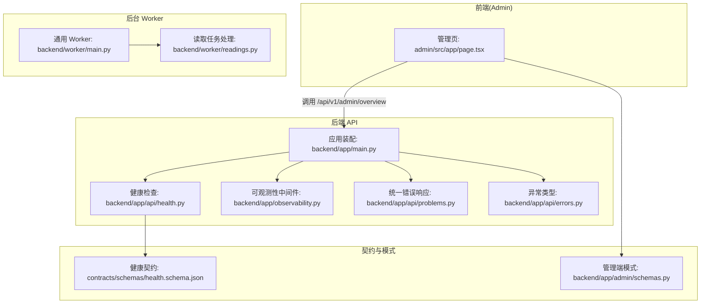
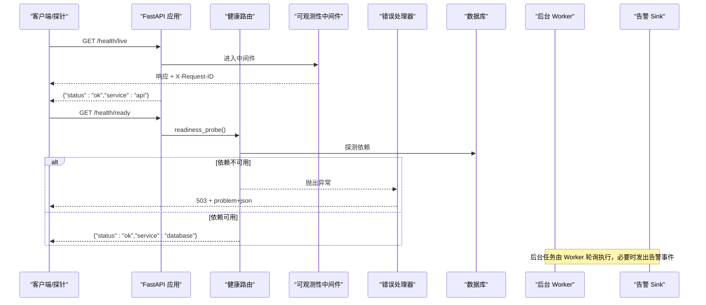
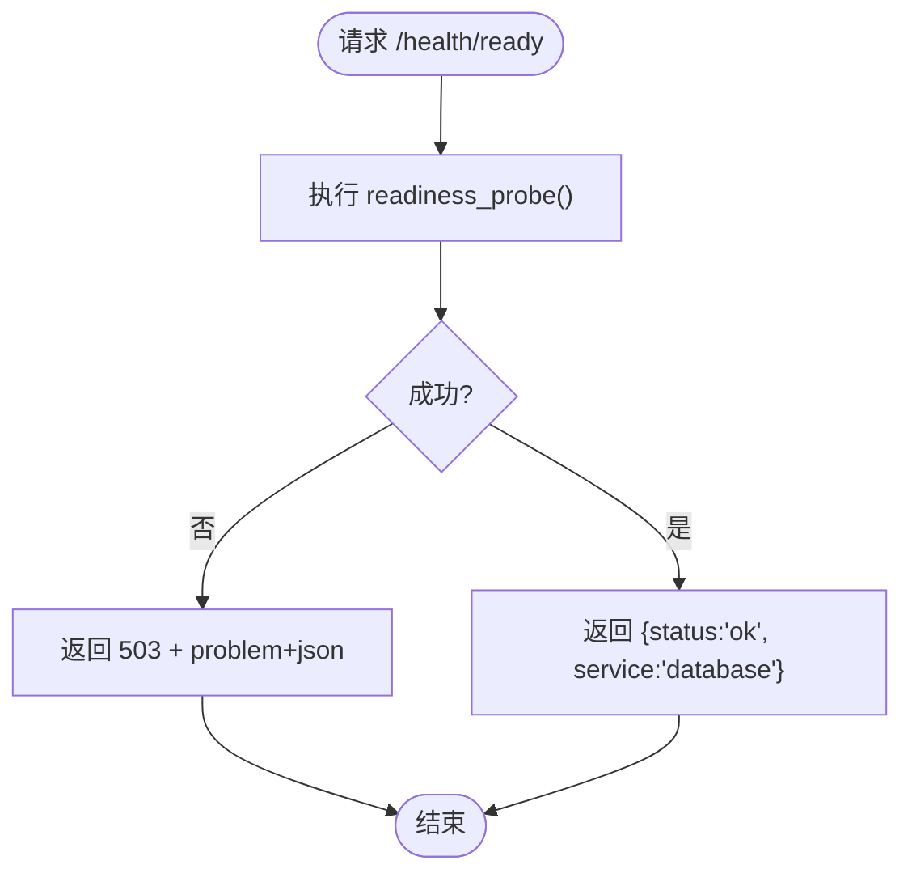
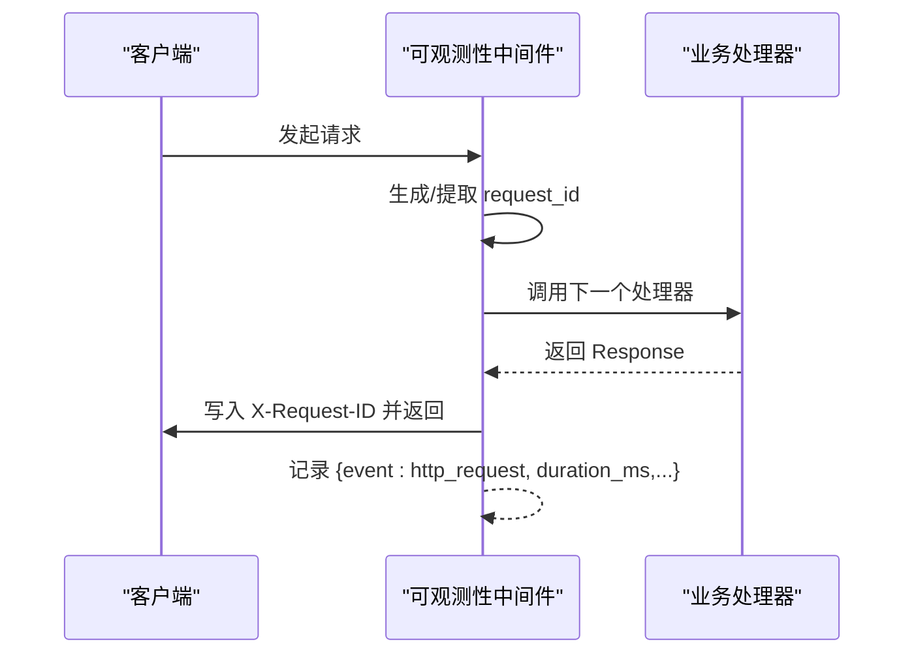
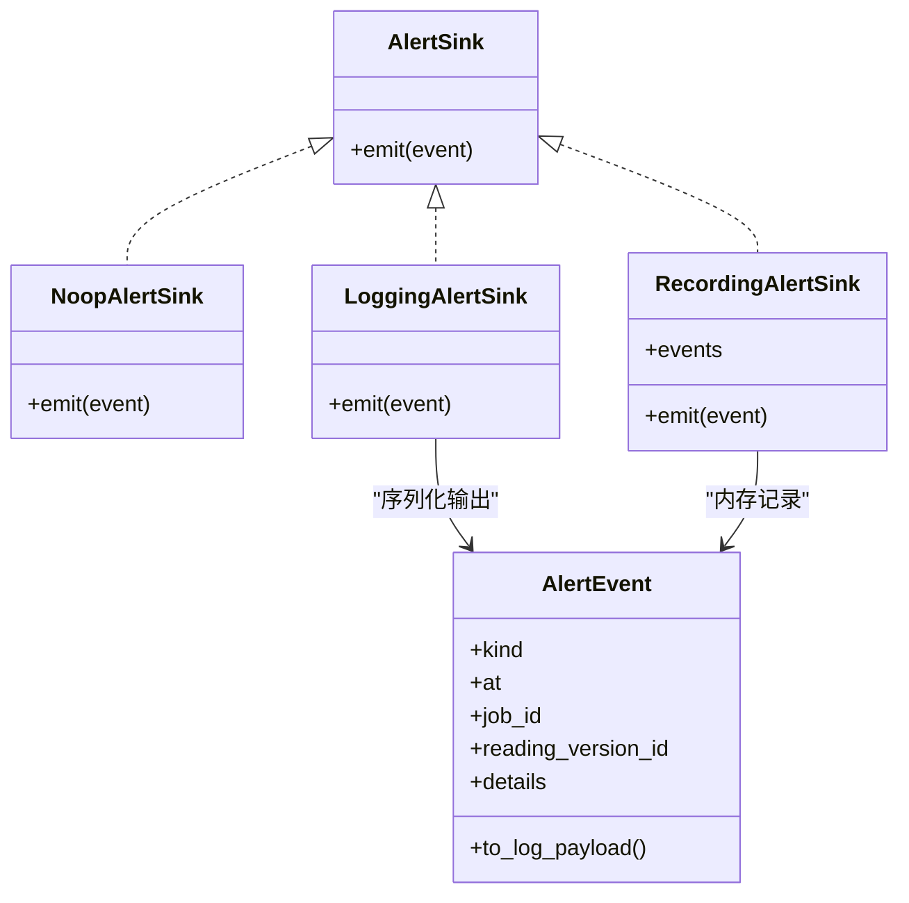
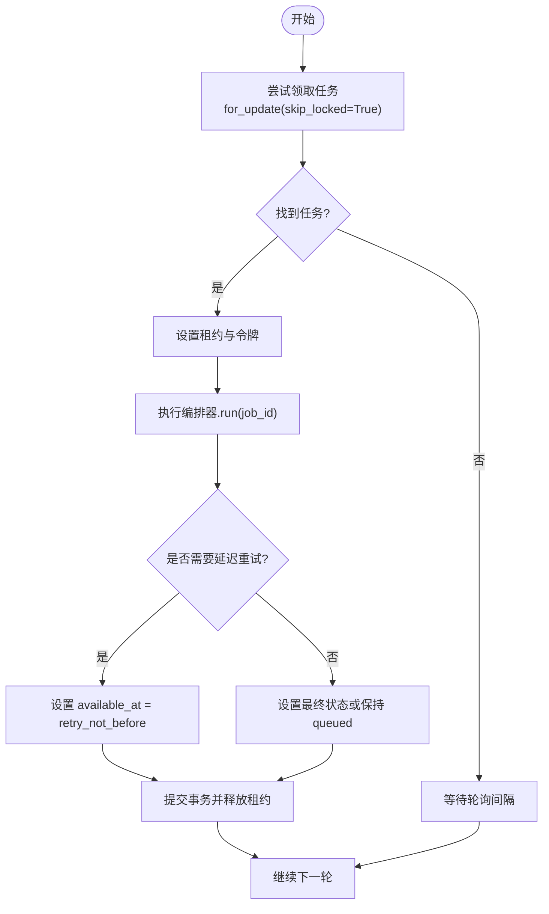
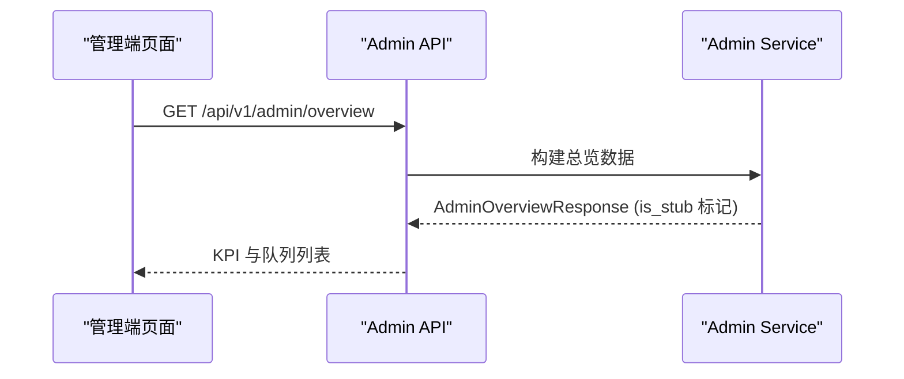
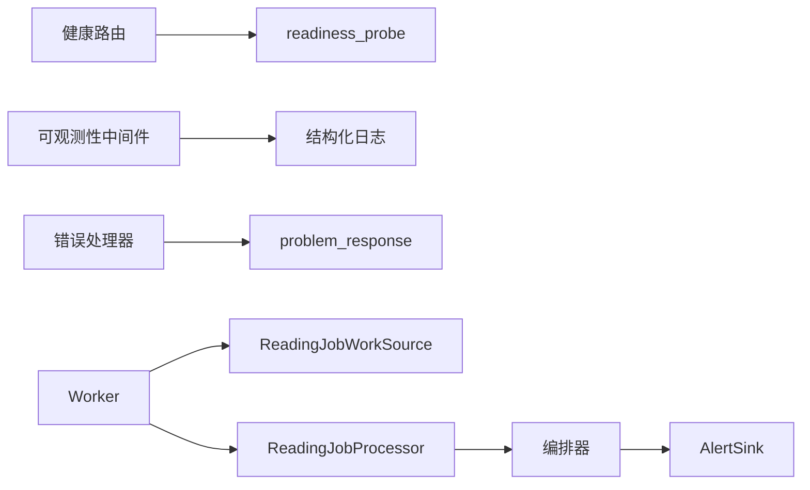

# 系统监控功能

<cite>
**本文引用的文件**
- [backend/app/api/health.py](file://backend/app/api/health.py)
- [backend/app/observability.py](file://backend/app/observability.py)
- [backend/app/api/problems.py](file://backend/app/api/problems.py)
- [backend/app/api/errors.py](file://backend/app/api/errors.py)
- [backend/app/main.py](file://backend/app/main.py)
- [backend/app/readings/alerts.py](file://backend/app/readings/alerts.py)
- [backend/worker/main.py](file://backend/worker/main.py)
- [backend/worker/readings.py](file://backend/worker/readings.py)
- [contracts/schemas/health.schema.json](file://contracts/schemas/health.schema.json)
- [admin/src/app/page.tsx](file://admin/src/app/page.tsx)
- [backend/app/admin/service.py](file://backend/app/admin/service.py)
- [backend/app/admin/schemas.py](file://backend/app/admin/schemas.py)
</cite>

## 目录
1. [简介](#简介)
2. [项目结构](#项目结构)
3. [核心组件](#核心组件)
4. [架构总览](#架构总览)
5. [详细组件分析](#详细组件分析)
6. [依赖关系分析](#依赖关系分析)
7. [性能考量](#性能考量)
8. [故障排查指南](#故障排查指南)
9. [结论](#结论)
10. [附录](#附录)

## 简介
本文件面向运维与研发人员，系统化说明本仓库中的“系统监控”能力：健康检查、KPI 监控、队列监控、错误追踪、性能分析与告警配置。内容基于后端 FastAPI 应用、后台 Worker 进程、管理端仪表板以及契约与模式定义进行梳理，帮助快速定位问题、评估服务状态并持续优化性能。

## 项目结构
与监控相关的关键位置如下：
- 健康检查与健康契约：后端 /health 路由与 JSON Schema 契约
- 请求可观测性：HTTP 中间件记录请求 ID、方法、路径、状态码与耗时
- 告警事件：结构化日志输出（本地/预发）与测试记录器
- 后台任务与工作队列：Worker 轮询、租约锁、重试时间窗、状态映射
- 管理端仪表板：KPI 卡片与队列概览（当前为占位数据）

图表来源
- [backend/app/api/health.py:11-36](file://backend/app/api/health.py#L11-L36)
- [backend/app/observability.py:27-51](file://backend/app/observability.py#L27-L51)
- [backend/app/api/problems.py:5-27](file://backend/app/api/problems.py#L5-L27)
- [backend/app/api/errors.py:1-17](file://backend/app/api/errors.py#L1-L17)
- [backend/app/main.py:115-140](file://backend/app/main.py#L115-L140)
- [backend/worker/main.py:57-97](file://backend/worker/main.py#L57-L97)
- [backend/worker/readings.py:108-231](file://backend/worker/readings.py#L108-L231)
- [contracts/schemas/health.schema.json:1-12](file://contracts/schemas/health.schema.json#L1-L12)
- [backend/app/admin/schemas.py:43-67](file://backend/app/admin/schemas.py#L43-L67)

章节来源
- [backend/app/api/health.py:11-36](file://backend/app/api/health.py#L11-L36)
- [backend/app/observability.py:27-51](file://backend/app/observability.py#L27-L51)
- [backend/app/api/problems.py:5-27](file://backend/app/api/problems.py#L5-L27)
- [backend/app/api/errors.py:1-17](file://backend/app/api/errors.py#L1-L17)
- [backend/app/main.py:115-140](file://backend/app/main.py#L115-L140)
- [backend/worker/main.py:57-97](file://backend/worker/main.py#L57-L97)
- [backend/worker/readings.py:108-231](file://backend/worker/readings.py#L108-L231)
- [contracts/schemas/health.schema.json:1-12](file://contracts/schemas/health.schema.json#L1-L12)
- [backend/app/admin/schemas.py:43-67](file://backend/app/admin/schemas.py#L43-L67)

## 核心组件
- 健康检查机制
  - Liveness：快速判断 API 进程是否存活
  - Readiness：探测关键依赖（如数据库）是否可用；不可用时返回 503 并附带标准问题体
  - 契约：健康响应遵循 JSON Schema，便于外部探针校验
- 请求级可观测性
  - 自动注入 X-Request-ID，跨日志链路串联
  - 记录 HTTP 方法、路径、状态码、耗时（毫秒），便于性能分析
- 告警事件
  - 通过 AlertSink 协议输出 ops_alert 事件（本地/预发写入结构化日志）
  - 支持测试环境内存记录，便于断言
- 工作队列与任务处理
  - Worker 轮询取任务，使用数据库行级锁与租约令牌避免重复处理
  - 支持延迟重试（retry_not_before）与最终状态更新
  - 状态映射到统一字符串集合，便于统计与可视化
- 管理端仪表板
  - 展示 KPI 与队列概览（当前为占位数据，预留接入点）

章节来源
- [backend/app/api/health.py:11-36](file://backend/app/api/health.py#L11-L36)
- [contracts/schemas/health.schema.json:1-12](file://contracts/schemas/health.schema.json#L1-L12)
- [backend/app/observability.py:27-51](file://backend/app/observability.py#L27-L51)
- [backend/app/readings/alerts.py:16-75](file://backend/app/readings/alerts.py#L16-L75)
- [backend/worker/readings.py:108-231](file://backend/worker/readings.py#L108-L231)
- [admin/src/app/page.tsx:26-82](file://admin/src/app/page.tsx#L26-L82)
- [backend/app/admin/service.py:132-147](file://backend/app/admin/service.py#L132-L147)
- [backend/app/admin/schemas.py:43-67](file://backend/app/admin/schemas.py#L43-L67)

## 架构总览
下图展示了从客户端到健康检查、可观测性、错误处理、后台任务与告警的整体流程。

图表来源
- [backend/app/api/health.py:11-36](file://backend/app/api/health.py#L11-L36)
- [backend/app/observability.py:27-51](file://backend/app/observability.py#L27-L51)
- [backend/app/api/problems.py:5-27](file://backend/app/api/problems.py#L5-L27)
- [backend/app/main.py:115-140](file://backend/app/main.py#L115-L140)

## 详细组件分析

### 健康检查机制
- Liveness（/health/live）
  - 用途：容器编排或负载均衡器判定进程是否存活
  - 行为：直接返回 ok，不访问外部依赖
- Readiness（/health/ready）
  - 用途：判定服务是否具备对外服务能力（例如数据库连通性）
  - 行为：调用可插拔的 readiness_probe；失败时返回 503 并附带标准问题体
- 契约校验
  - 健康响应遵循 JSON Schema，便于自动化验证

图表来源
- [backend/app/api/health.py:18-34](file://backend/app/api/health.py#L18-L34)
- [backend/app/api/problems.py:5-27](file://backend/app/api/problems.py#L5-L27)
- [contracts/schemas/health.schema.json:1-12](file://contracts/schemas/health.schema.json#L1-L12)

章节来源
- [backend/app/api/health.py:11-36](file://backend/app/api/health.py#L11-L36)
- [backend/app/api/problems.py:5-27](file://backend/app/api/problems.py#L5-L27)
- [contracts/schemas/health.schema.json:1-12](file://contracts/schemas/health.schema.json#L1-L12)

### 请求级可观测性与性能指标
- 请求追踪
  - 从请求头读取或生成 X-Request-ID，并在响应中回写，贯穿日志
- 性能指标
  - 记录 method、path、status、duration_ms，便于计算 P50/P95/P99 等分位数
- 日志降噪
  - 对敏感传输层日志降低级别，减少噪音

图表来源
- [backend/app/observability.py:27-51](file://backend/app/observability.py#L27-L51)

章节来源
- [backend/app/observability.py:14-51](file://backend/app/observability.py#L14-L51)

### 告警系统与错误追踪
- 告警事件
  - 通过 AlertEvent 描述事件类型、时间、关联作业/版本与详情
  - LoggingAlertSink 将事件以结构化日志输出（不含敏感值）
  - RecordingAlertSink 用于测试断言
- 错误追踪
  - 统一异常 ApiProblem 经全局处理器转换为 application/problem+json
  - 健康检查在依赖不可用时返回 503 并携带问题类型，便于上游编排系统识别

图表来源
- [backend/app/readings/alerts.py:16-75](file://backend/app/readings/alerts.py#L16-L75)

章节来源
- [backend/app/readings/alerts.py:16-75](file://backend/app/readings/alerts.py#L16-L75)
- [backend/app/api/errors.py:1-17](file://backend/app/api/errors.py#L1-L17)
- [backend/app/api/problems.py:5-27](file://backend/app/api/problems.py#L5-L27)
- [backend/app/main.py:115-136](file://backend/app/main.py#L115-L136)

### 队列监控与任务处理
- 任务获取与并发控制
  - ReadingJobWorkSource 按 available_at 与过期租约选择任务，使用 for_update(skip_locked=True) 避免争用
  - 每个 Worker 持有唯一 worker_id，并通过 claim_token 与 lease_generation 实现防重入
- 任务执行与重试
  - ReadingJobProcessor 调用编排器执行任务，根据结果设置状态与 available_at
  - 支持 retry_not_before 在未来某个时间点重试，确保不会立即重试
- 状态映射
  - 领域状态映射为统一字符串（queued/waiting_input/stopped/complete/delayed/runtime_unknown），便于统计

图表来源
- [backend/worker/readings.py:63-161](file://backend/worker/readings.py#L63-L161)
- [backend/worker/readings.py:175-231](file://backend/worker/readings.py#L175-L231)
- [backend/worker/main.py:74-97](file://backend/worker/main.py#L74-L97)

章节来源
- [backend/worker/readings.py:63-231](file://backend/worker/readings.py#L63-L231)
- [backend/worker/main.py:57-97](file://backend/worker/main.py#L57-L97)

### KPI 监控系统与管理端仪表板
- 管理端页面
  - 拉取 /api/v1/admin/overview，渲染 KPI 卡片与队列列表
  - 当前返回 is_stub=true 的占位数据，标注“待接入”
- 后端模型
  - AdminKpi/AdminQueueSummary 定义了 KPI 与队列的结构
  - build_stub_overview 提供默认占位数据，便于前端开发联调

图表来源
- [admin/src/app/page.tsx:26-82](file://admin/src/app/page.tsx#L26-L82)
- [backend/app/admin/service.py:132-147](file://backend/app/admin/service.py#L132-L147)
- [backend/app/admin/schemas.py:43-67](file://backend/app/admin/schemas.py#L43-L67)

章节来源
- [admin/src/app/page.tsx:26-82](file://admin/src/app/page.tsx#L26-L82)
- [backend/app/admin/service.py:132-147](file://backend/app/admin/service.py#L132-L147)
- [backend/app/admin/schemas.py:43-67](file://backend/app/admin/schemas.py#L43-L67)

## 依赖关系分析
- 健康检查依赖 readiness_probe（通常对接数据库探针）
- 可观测性中间件依赖 FastAPI 生命周期钩子
- 错误处理依赖全局异常处理器与统一问题体构造器
- Worker 依赖数据库会话、编排器与可选的外部运行时/模型适配器
- 告警 Sink 可替换（Noop/Logging/Recording），便于不同环境切换

图表来源
- [backend/app/api/health.py:11-36](file://backend/app/api/health.py#L11-L36)
- [backend/app/observability.py:27-51](file://backend/app/observability.py#L27-L51)
- [backend/app/api/problems.py:5-27](file://backend/app/api/problems.py#L5-L27)
- [backend/worker/readings.py:108-231](file://backend/worker/readings.py#L108-L231)
- [backend/app/readings/alerts.py:16-75](file://backend/app/readings/alerts.py#L16-L75)

章节来源
- [backend/app/api/health.py:11-36](file://backend/app/api/health.py#L11-L36)
- [backend/app/observability.py:27-51](file://backend/app/observability.py#L27-L51)
- [backend/app/api/problems.py:5-27](file://backend/app/api/problems.py#L5-L27)
- [backend/worker/readings.py:108-231](file://backend/worker/readings.py#L108-L231)
- [backend/app/readings/alerts.py:16-75](file://backend/app/readings/alerts.py#L16-L75)

## 性能考量
- 健康检查
  - Liveness 无 IO，Readiness 应仅包含轻量依赖探测，避免阻塞
- 可观测性
  - 中间件开销极低（仅时间与 ID 操作），建议在生产开启
  - 可通过日志级别与采样策略控制吞吐
- 队列处理
  - 使用 skip_locked 与租约令牌避免重复处理与死锁
  - 合理设置轮询间隔与租约时长，平衡延迟与资源占用
- 告警
  - 告警事件仅输出必要字段，避免写入大对象造成抖动

[本节为通用指导，无需特定文件引用]

## 故障排查指南
- 健康检查失败
  - /health/ready 返回 503：检查 readiness_probe 指向的依赖（数据库连接、网络、权限）
  - 查看对应请求的 X-Request-ID，检索日志定位根因
- 请求慢或超时
  - 通过可观测性日志中的 duration_ms 定位慢接口
  - 结合 path 与方法筛选热点路径，进一步下钻到具体处理逻辑
- 任务堆积或停滞
  - 检查 Worker 是否运行、轮询间隔是否过大
  - 查看任务状态是否为 delayed/stopped/runtime_unknown，确认是否有未满足的重试条件
  - 关注租约是否频繁过期或被其他 Worker 抢占
- 告警与异常
  - 搜索 ops_alert 日志，定位告警 kind 与关联 job_id/reading_version_id
  - 使用统一问题体中的 problem_type 分类错误（如 dependency-unavailable、invalid-request）

章节来源
- [backend/app/api/health.py:18-34](file://backend/app/api/health.py#L18-L34)
- [backend/app/observability.py:27-51](file://backend/app/observability.py#L27-L51)
- [backend/app/api/problems.py:5-27](file://backend/app/api/problems.py#L5-L27)
- [backend/worker/readings.py:175-231](file://backend/worker/readings.py#L175-L231)
- [backend/app/readings/alerts.py:28-59](file://backend/app/readings/alerts.py#L28-L59)

## 结论
本仓库已具备基础且可扩展的监控能力：健康检查保障服务可用性，可观测性中间件提供请求级性能与追踪，告警系统输出结构化事件，Worker 与队列机制保证任务处理的可靠性与可观测性。管理端仪表板预留了 KPI 与队列展示入口，便于后续接入真实指标。建议在生产环境中启用可观测性与告警，并结合外部监控系统采集指标与触发告警。

[本节为总结性内容，无需特定文件引用]

## 附录
- 健康检查契约
  - 响应字段与枚举约束见 JSON Schema，便于自动化校验
- 管理端 KPI 与队列模型
  - 使用 AdminKpi 与 AdminQueueSummary 定义数据结构，当前为占位数据
- 错误响应格式
  - 采用 application/problem+json，包含 type/title/status/detail/request_id

章节来源
- [contracts/schemas/health.schema.json:1-12](file://contracts/schemas/health.schema.json#L1-L12)
- [backend/app/admin/schemas.py:43-67](file://backend/app/admin/schemas.py#L43-L67)
- [backend/app/api/problems.py:5-27](file://backend/app/api/problems.py#L5-L27)