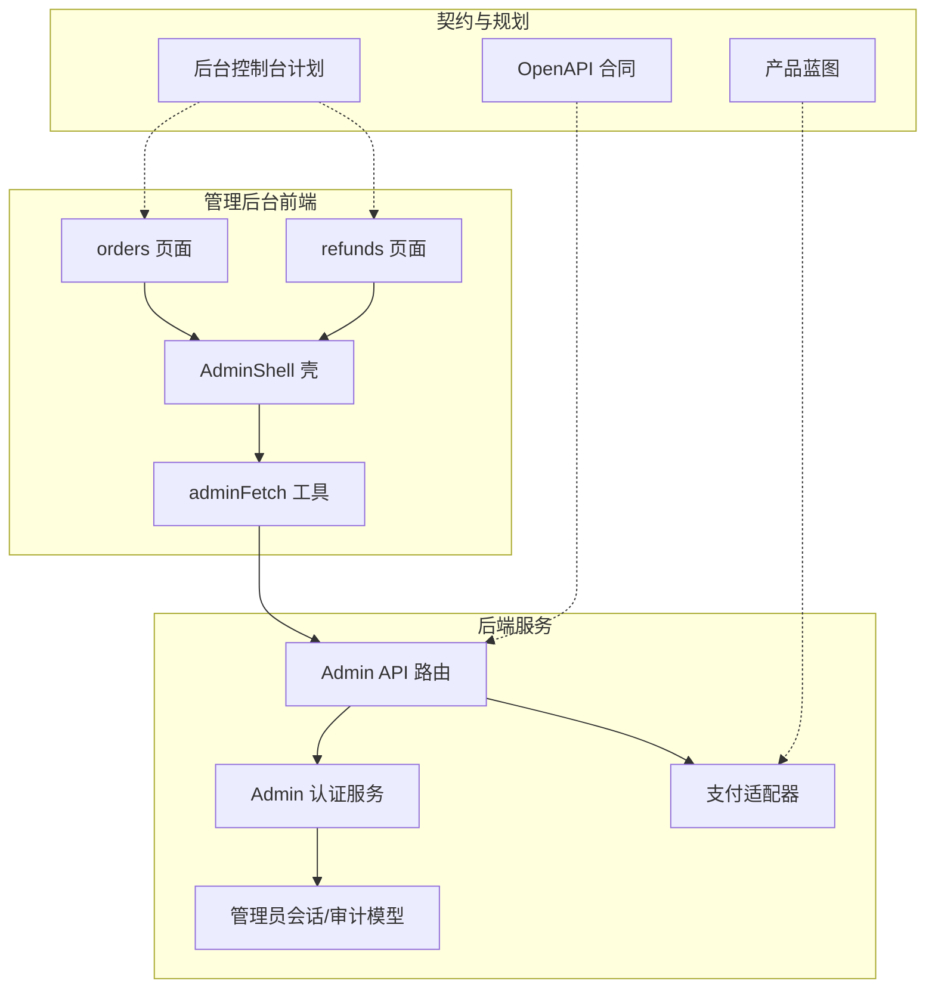
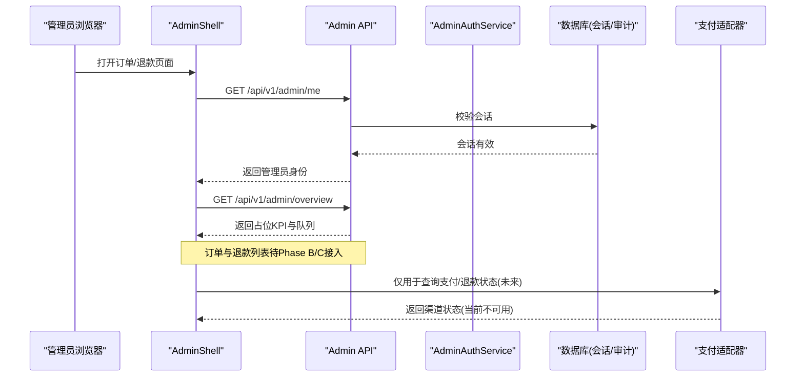
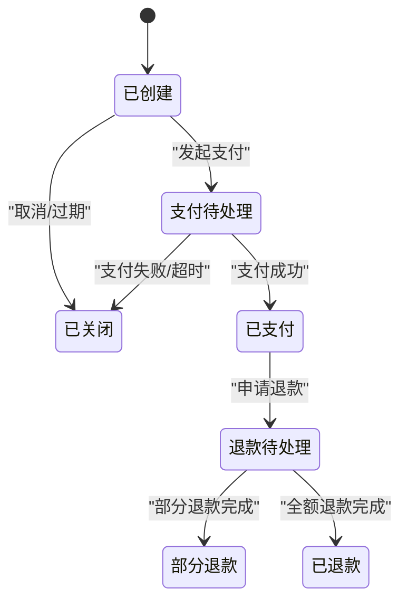
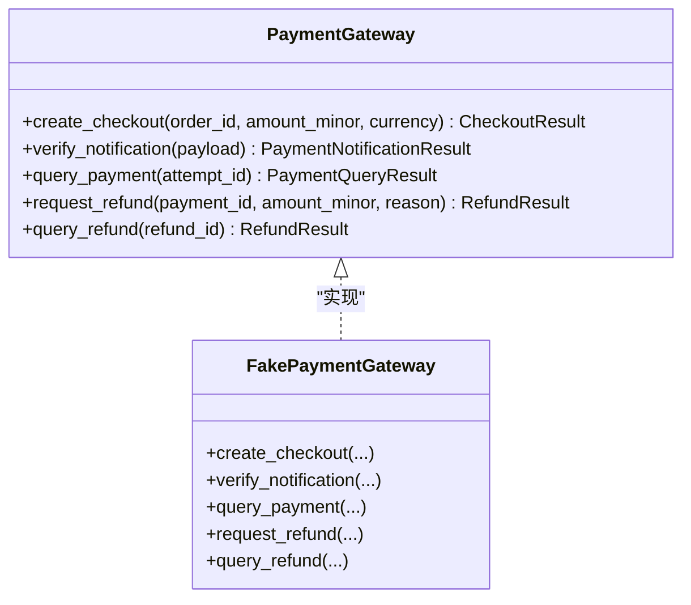
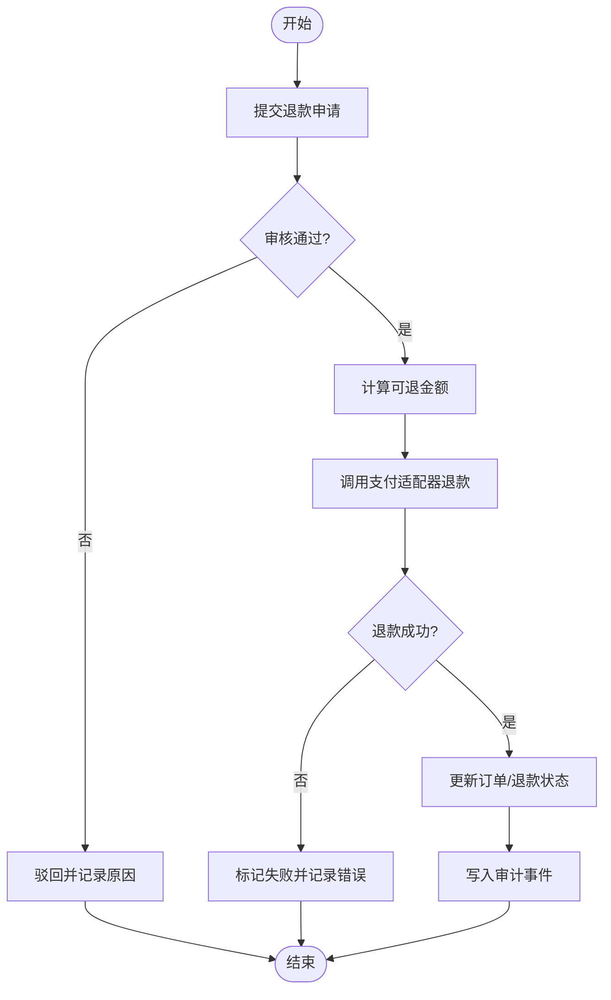
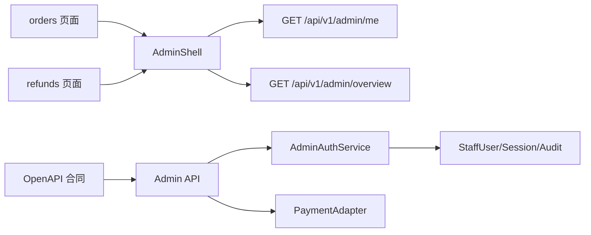

# 订单管理系统

<cite>
**本文引用的文件**
- [admin/src/app/orders/page.tsx](file://admin/src/app/orders/page.tsx)
- [admin/src/app/refunds/page.tsx](file://admin/src/app/refunds/page.tsx)
- [admin/src/components/admin-shell.tsx](file://admin/src/components/admin-shell.tsx)
- [admin/src/lib/api.ts](file://admin/src/lib/api.ts)
- [backend/app/api/admin.py](file://backend/app/api/admin.py)
- [backend/app/admin/service.py](file://backend/app/admin/service.py)
- [backend/app/admin/models.py](file://backend/app/admin/models.py)
- [backend/app/adapters/payment.py](file://backend/app/adapters/payment.py)
- [contracts/openapi/admin-v1.yaml](file://contracts/openapi/admin-v1.yaml)
- [docs/plans/2026-08-11-admin-console-plan.md](file://docs/plans/2026-08-11-admin-console-plan.md)
- [design-system/mingli-web/pages/admin.md](file://design-system/mingli-web/pages/admin.md)
- [docs/PRODUCT_BLUEPRINT_WEB_IOS_V2.md](file://docs/PRODUCT_BLUEPRINT_WEB_IOS_V2.md)
</cite>

## 目录
1. [简介](#简介)
2. [项目结构](#项目结构)
3. [核心组件](#核心组件)
4. [架构总览](#架构总览)
5. [详细组件分析](#详细组件分析)
6. [依赖关系分析](#依赖关系分析)
7. [性能考虑](#性能考虑)
8. [故障排查指南](#故障排查指南)
9. [结论](#结论)
10. [附录](#附录)

## 简介
本文件为订单管理系统的综合技术文档，聚焦订单数据模型、状态机、支付与退款记录、查询能力、状态跟踪、退款处理流程、统计分析以及后台管理界面。当前仓库处于“后台控制台 Phase A/B/C”的演进阶段：管理员认证与会话已实现，概览页提供占位 KPI；订单列表与退款审批页面已预留入口，但尚未接入后端领域 API。

## 项目结构
- 前端（Next.js）
  - 管理后台应用位于 admin/，包含登录、总览、订单、退款、解读任务、用户档案、审计日志等页面骨架与导航壳。
  - 订单与退款页面目前显示占位信息，等待后续阶段接入 Admin API。
- 后端（FastAPI）
  - 管理员认证与会话、CSRF、速率限制、概览接口已实现；订单、退款、对账等读写接口在计划中。
  - 支付网关通过适配器抽象，当前使用不可用占位实现，确保不会将不受信任输入转化为真实支付事实。
- 契约与规范
  - OpenAPI 合同定义了管理员接口的路径、请求/响应结构与错误模型。
  - 产品蓝图定义了订单、支付尝试、支付事件、退款、权益等数据表及约束。

图表来源
- [admin/src/app/orders/page.tsx:1-13](file://admin/src/app/orders/page.tsx#L1-L13)
- [admin/src/app/refunds/page.tsx:1-13](file://admin/src/app/refunds/page.tsx#L1-L13)
- [admin/src/components/admin-shell.tsx:1-59](file://admin/src/components/admin-shell.tsx#L1-L59)
- [admin/src/lib/api.ts:1-80](file://admin/src/lib/api.ts#L1-L80)
- [backend/app/api/admin.py:1-200](file://backend/app/api/admin.py#L1-L200)
- [backend/app/admin/service.py:1-148](file://backend/app/admin/service.py#L1-L148)
- [backend/app/admin/models.py:1-81](file://backend/app/admin/models.py#L1-L81)
- [backend/app/adapters/payment.py:1-92](file://backend/app/adapters/payment.py#L1-L92)
- [contracts/openapi/admin-v1.yaml:1-231](file://contracts/openapi/admin-v1.yaml#L1-L231)
- [docs/plans/2026-08-11-admin-console-plan.md:120-171](file://docs/plans/2026-08-11-admin-console-plan.md#L120-L171)
- [docs/PRODUCT_BLUEPRINT_WEB_IOS_V2.md:524-595](file://docs/PRODUCT_BLUEPRINT_WEB_IOS_V2.md#L524-L595)

章节来源
- [admin/src/app/orders/page.tsx:1-13](file://admin/src/app/orders/page.tsx#L1-L13)
- [admin/src/app/refunds/page.tsx:1-13](file://admin/src/app/refunds/page.tsx#L1-L13)
- [admin/src/components/admin-shell.tsx:1-59](file://admin/src/components/admin-shell.tsx#L1-L59)
- [admin/src/lib/api.ts:1-80](file://admin/src/lib/api.ts#L1-L80)
- [backend/app/api/admin.py:1-200](file://backend/app/api/admin.py#L1-L200)
- [backend/app/admin/service.py:1-148](file://backend/app/admin/service.py#L1-L148)
- [backend/app/admin/models.py:1-81](file://backend/app/admin/models.py#L1-L81)
- [backend/app/adapters/payment.py:1-92](file://backend/app/adapters/payment.py#L1-L92)
- [contracts/openapi/admin-v1.yaml:1-231](file://contracts/openapi/admin-v1.yaml#L1-L231)
- [docs/plans/2026-08-11-admin-console-plan.md:120-171](file://docs/plans/2026-08-11-admin-console-plan.md#L120-L171)
- [design-system/mingli-web/pages/admin.md:105-152](file://design-system/mingli-web/pages/admin.md#L105-L152)
- [docs/PRODUCT_BLUEPRINT_WEB_IOS_V2.md:524-595](file://docs/PRODUCT_BLUEPRINT_WEB_IOS_V2.md#L524-L595)

## 核心组件
- 管理员认证与会话
  - 提供登录、登出、当前会话身份读取、概览接口。
  - 会话基于 Cookie，支持 CSRF 校验与登录速率限制。
- 订单与支付
  - 订单、支付尝试、支付事件、退款在数据模型层面有明确定义；支付网关通过适配器隔离，当前为不可用占位。
- 退款审批
  - 后台计划包含退款队列、审批写路径；当前页面为占位，待接入。
- 后台界面
  - 订单与退款页面已预留，展示职责说明与占位文案；导航壳负责认证检查与跳转。

章节来源
- [backend/app/api/admin.py:103-200](file://backend/app/api/admin.py#L103-L200)
- [backend/app/admin/service.py:33-148](file://backend/app/admin/service.py#L33-L148)
- [backend/app/adapters/payment.py:1-92](file://backend/app/adapters/payment.py#L1-L92)
- [admin/src/app/orders/page.tsx:1-13](file://admin/src/app/orders/page.tsx#L1-L13)
- [admin/src/app/refunds/page.tsx:1-13](file://admin/src/app/refunds/page.tsx#L1-L13)
- [admin/src/components/admin-shell.tsx:1-59](file://admin/src/components/admin-shell.tsx#L1-L59)

## 架构总览
系统采用前后端分离的管理控制台架构：
- 前端 Next.js 提供管理后台页面与交互，调用后端 /api/v1/admin/* 接口。
- 后端 FastAPI 暴露管理员认证与会话、概览接口；未来扩展订单、支付、退款、对账等读写接口。
- 支付网关通过适配器抽象，便于替换或模拟。
- 所有写操作进入审计事件表，保证可追溯性。

图表来源
- [admin/src/components/admin-shell.tsx:36-59](file://admin/src/components/admin-shell.tsx#L36-L59)
- [backend/app/api/admin.py:166-200](file://backend/app/api/admin.py#L166-L200)
- [backend/app/admin/service.py:132-148](file://backend/app/admin/service.py#L132-L148)
- [backend/app/adapters/payment.py:34-92](file://backend/app/adapters/payment.py#L34-L92)

## 详细组件分析

### 订单数据模型与状态机
- 数据模型
  - 订单、支付尝试、支付事件、退款、订阅合约、订阅周期、权益事件、权益投影等已在产品蓝图中定义。
  - 金额以最小币种整数保存，并保留货币字段。
- 状态机
  - 订单状态流转：创建 → 支付待处理 → 已支付；或创建后直接关闭；已支付后可进入退款待处理，最终部分退款或全额退款。
- 关键约束
  - 支付事件按渠道与渠道交易号唯一；订单的产品版本与目标摘要不可变；权益事件只追加不更新。

图表来源
- [docs/PRODUCT_BLUEPRINT_WEB_IOS_V2.md:524-595](file://docs/PRODUCT_BLUEPRINT_WEB_IOS_V2.md#L524-L595)

章节来源
- [docs/PRODUCT_BLUEPRINT_WEB_IOS_V2.md:524-595](file://docs/PRODUCT_BLUEPRINT_WEB_IOS_V2.md#L524-L595)

### 支付信息与退款记录
- 支付信息
  - 支付适配器定义结账结果、通知验证结果、支付查询结果、退款结果等数据结构。
  - 当前使用假网关，所有状态为不可用，避免将不受信任输入转化为真实支付事实。
- 退款记录
  - 退款结果包含渠道退款ID与成功标志；退款查询返回渠道退款状态。
- 安全原则
  - 外部通知需验签并保存原始摘要、验签结果与处理结果；敏感内容不在普通日志打印。

图表来源
- [backend/app/adapters/payment.py:34-92](file://backend/app/adapters/payment.py#L34-L92)

章节来源
- [backend/app/adapters/payment.py:1-92](file://backend/app/adapters/payment.py#L1-L92)
- [docs/PRODUCT_BLUEPRINT_WEB_IOS_V2.md:524-595](file://docs/PRODUCT_BLUEPRINT_WEB_IOS_V2.md#L524-L595)

### 订单查询功能
- 当前状态
  - 订单列表页面存在，但显示“尚未接入”，等待 Phase B 接入 Admin orders API。
- 设计目标（来自设计规范）
  - 筛选：订单ID、用户ID、状态、日期范围。
  - 列：订单、商品、金额、支付状态、创建时间、操作。
- 建议实现
  - 前端 FilterBar 组合查询参数，调用 GET /api/v1/admin/orders。
  - 后端分页、索引优化、脱敏输出。

章节来源
- [admin/src/app/orders/page.tsx:1-13](file://admin/src/app/orders/page.tsx#L1-L13)
- [design-system/mingli-web/pages/admin.md:135-141](file://design-system/mingli-web/pages/admin.md#L135-L141)
- [docs/plans/2026-08-11-admin-console-plan.md:131-153](file://docs/plans/2026-08-11-admin-console-plan.md#L131-L153)

### 订单状态跟踪
- 变更历史
  - 通过支付事件、退款事件与审计事件追踪状态变化。
- 当前状态含义
  - 已创建：订单已生成但未支付。
  - 支付待处理：支付流程进行中。
  - 已支付：支付成功，权益生效。
  - 已关闭：订单取消或过期。
  - 退款待处理：退款申请已提交。
  - 部分退款/已退款：退款完成。
- 流转规则
  - 遵循产品蓝图中的状态机；支付事件唯一性约束保障一致性。

章节来源
- [docs/PRODUCT_BLUEPRINT_WEB_IOS_V2.md:524-595](file://docs/PRODUCT_BLUEPRINT_WEB_IOS_V2.md#L524-L595)

### 退款处理流程
- 申请审核
  - 后台计划包含退款队列与审批写路径；当前页面为占位。
- 金额计算
  - 根据订单金额、已退金额、手续费策略计算可退金额；以最小币种整数保存。
- 状态更新
  - 审批通过后调用支付适配器发起退款，更新退款状态与权益投影。
- 安全与审计
  - 所有写操作进入审计事件表；敏感信息脱敏。

图表来源
- [backend/app/adapters/payment.py:47-92](file://backend/app/adapters/payment.py#L47-L92)
- [backend/app/admin/models.py:59-81](file://backend/app/admin/models.py#L59-L81)
- [docs/plans/2026-08-11-admin-console-plan.md:131-153](file://docs/plans/2026-08-11-admin-console-plan.md#L131-L153)

章节来源
- [admin/src/app/refunds/page.tsx:1-13](file://admin/src/app/refunds/page.tsx#L1-L13)
- [backend/app/adapters/payment.py:47-92](file://backend/app/adapters/payment.py#L47-L92)
- [backend/app/admin/models.py:59-81](file://backend/app/admin/models.py#L59-L81)
- [docs/plans/2026-08-11-admin-console-plan.md:131-153](file://docs/plans/2026-08-11-admin-console-plan.md#L131-L153)

### 订单统计分析
- 销售报表
  - 通过订单、支付事件、退款事件聚合销售额、退款额、净收入。
- 收入统计
  - 按日/周/月维度汇总，区分渠道与商品类别。
- 用户行为分析
  - 结合用户档案与订单关联，分析购买频次、复购率、流失率。
- 当前实现
  - 概览接口返回占位 KPI 与队列；实际计数尚未接入领域模块。

章节来源
- [backend/app/admin/service.py:132-148](file://backend/app/admin/service.py#L132-L148)
- [contracts/openapi/admin-v1.yaml:147-193](file://contracts/openapi/admin-v1.yaml#L147-L193)
- [docs/plans/2026-08-11-admin-console-plan.md:78-88](file://docs/plans/2026-08-11-admin-console-plan.md#L78-L88)

### 订单管理界面
- 订单支付页面
  - 标题与职责说明清晰；当前显示占位文案，等待接入。
- 退款审批页面
  - 强调审批前查看权益影响；通过/驳回需记录原因。
- 导航壳
  - 统一认证检查、环境标识、退出登录。

章节来源
- [admin/src/app/orders/page.tsx:1-13](file://admin/src/app/orders/page.tsx#L1-L13)
- [admin/src/app/refunds/page.tsx:1-13](file://admin/src/app/refunds/page.tsx#L1-L13)
- [admin/src/components/admin-shell.tsx:1-59](file://admin/src/components/admin-shell.tsx#L1-L59)

## 依赖关系分析
- 前端依赖
  - 管理后台页面依赖 AdminShell 壳进行认证与导航。
  - 所有请求通过 adminFetch 工具发送，自动携带 CSRF Token。
- 后端依赖
  - Admin API 路由依赖认证服务、会话模型、审计模型。
  - 支付适配器作为外部依赖抽象，便于替换与测试。
- 契约依赖
  - OpenAPI 合同约束接口路径、请求/响应结构与错误模型。

图表来源
- [admin/src/app/orders/page.tsx:1-13](file://admin/src/app/orders/page.tsx#L1-L13)
- [admin/src/app/refunds/page.tsx:1-13](file://admin/src/app/refunds/page.tsx#L1-L13)
- [admin/src/components/admin-shell.tsx:36-59](file://admin/src/components/admin-shell.tsx#L36-L59)
- [backend/app/api/admin.py:166-200](file://backend/app/api/admin.py#L166-L200)
- [backend/app/admin/service.py:33-148](file://backend/app/admin/service.py#L33-L148)
- [backend/app/admin/models.py:17-81](file://backend/app/admin/models.py#L17-L81)
- [backend/app/adapters/payment.py:34-92](file://backend/app/adapters/payment.py#L34-L92)
- [contracts/openapi/admin-v1.yaml:14-83](file://contracts/openapi/admin-v1.yaml#L14-L83)

章节来源
- [admin/src/lib/api.ts:28-80](file://admin/src/lib/api.ts#L28-L80)
- [backend/app/api/admin.py:68-100](file://backend/app/api/admin.py#L68-L100)
- [backend/app/admin/models.py:17-81](file://backend/app/admin/models.py#L17-L81)
- [contracts/openapi/admin-v1.yaml:84-231](file://contracts/openapi/admin-v1.yaml#L84-L231)

## 性能考虑
- 登录速率限制
  - 使用窗口限流器保护登录接口，防止暴力破解。
- 会话维护
  - 每次访问刷新 last_seen_at，及时清理过期会话。
- 审计事件
  - 审计事件追加写入，避免锁竞争；建议按时间分区与索引优化。
- 支付适配器
  - 外部调用应设置超时与重试策略；失败时快速失败，避免阻塞主流程。

章节来源
- [backend/app/api/admin.py:56-65](file://backend/app/api/admin.py#L56-L65)
- [backend/app/api/admin.py:68-84](file://backend/app/api/admin.py#L68-L84)
- [backend/app/admin/service.py:59-83](file://backend/app/admin/service.py#L59-L83)
- [backend/app/adapters/payment.py:34-92](file://backend/app/adapters/payment.py#L34-L92)

## 故障排查指南
- 无法登录
  - 检查邮箱与密码是否正确；确认账户状态为 active；查看是否触发登录速率限制。
- 会话失效
  - 检查 Cookie 是否被浏览器拦截；确认 CSRF Token 是否匹配；查看会话是否过期或被撤销。
- 概览数据为空
  - 当前为占位实现，is_stub 为 true；等待领域计数接入。
- 订单/退款页面空白
  - 当前为占位页面；等待 Phase B/C 接入对应 API。

章节来源
- [backend/app/api/admin.py:103-145](file://backend/app/api/admin.py#L103-L145)
- [backend/app/api/admin.py:148-164](file://backend/app/api/admin.py#L148-L164)
- [backend/app/admin/service.py:132-148](file://backend/app/admin/service.py#L132-L148)
- [admin/src/app/orders/page.tsx:1-13](file://admin/src/app/orders/page.tsx#L1-L13)
- [admin/src/app/refunds/page.tsx:1-13](file://admin/src/app/refunds/page.tsx#L1-L13)

## 结论
当前订单管理系统的后台控制台已完成管理员认证与会话、概览占位与页面骨架；订单与退款功能处于规划与预留阶段。下一步应优先接入订单查询、支付事实与退款审批接口，完善状态跟踪与审计，逐步实现销售报表与收入统计，提升运营效率与数据透明度。

## 附录
- 管理员角色
  - support、finance、ops、superadmin。
- 安全基线
  - 独立 staff 会话、CSRF、短会话与绝对超时、登录速率限制、脱敏 DTO、幂等操作键。
- 非目标
  - 不做复杂 BI 图表墙、不做客服 IM、不做任意 SQL 控制台、不暴露运行时 state_token。

章节来源
- [contracts/openapi/admin-v1.yaml:194-196](file://contracts/openapi/admin-v1.yaml#L194-L196)
- [docs/plans/2026-08-11-admin-console-plan.md:161-169](file://docs/plans/2026-08-11-admin-console-plan.md#L161-L169)
- [docs/plans/2026-08-11-admin-console-plan.md:274-281](file://docs/plans/2026-08-11-admin-console-plan.md#L274-L281)