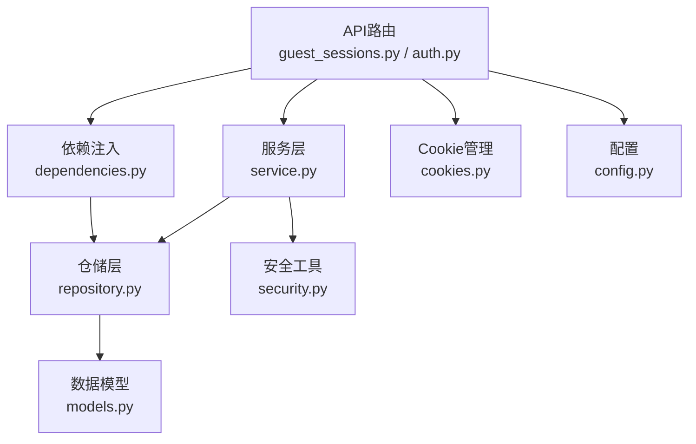
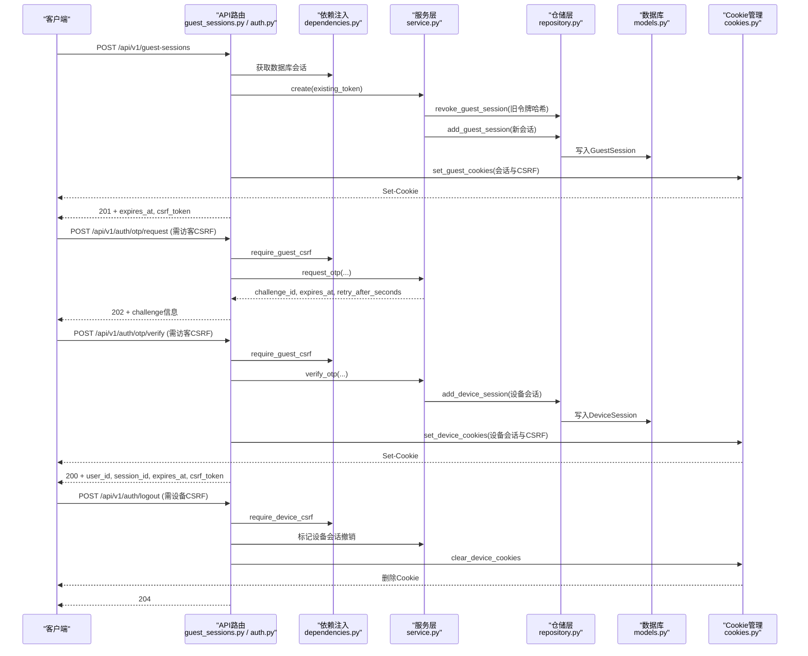
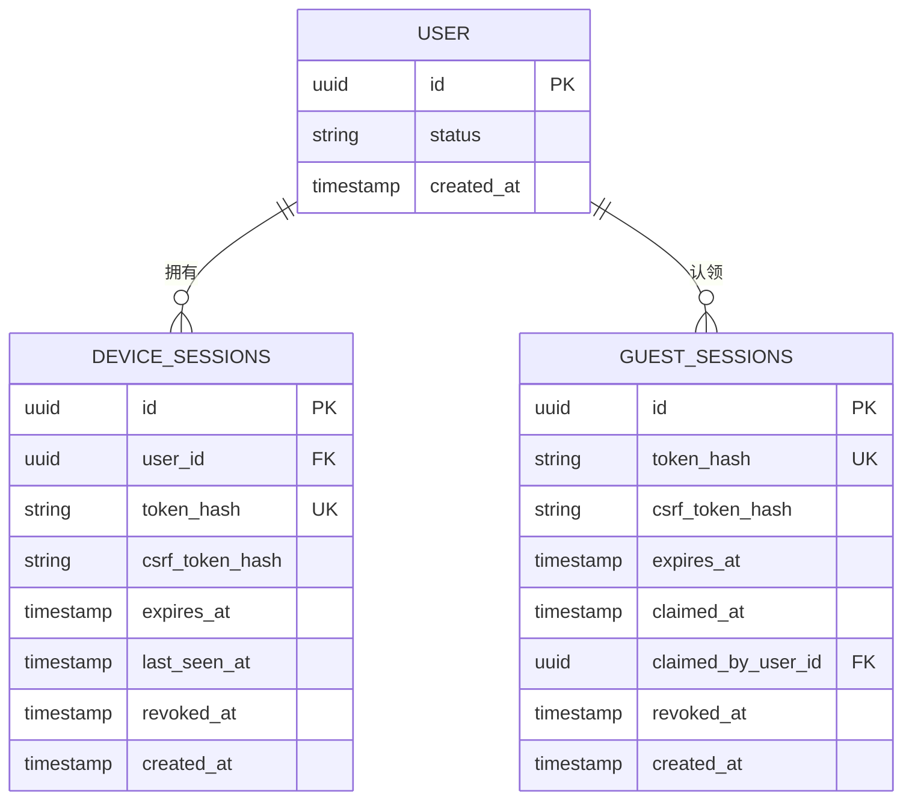
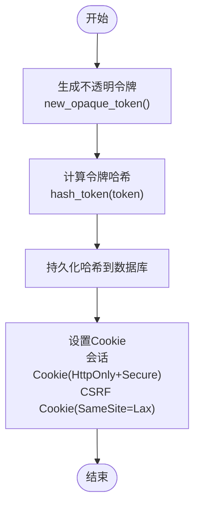
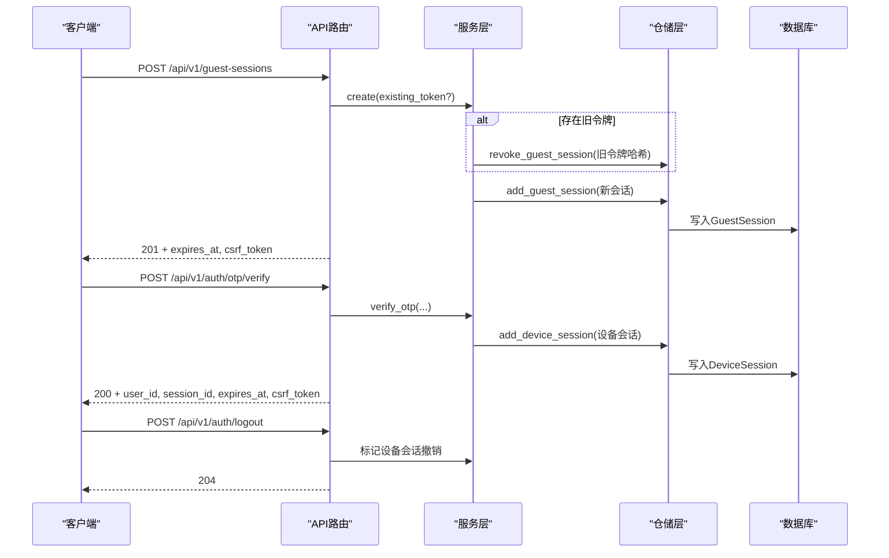
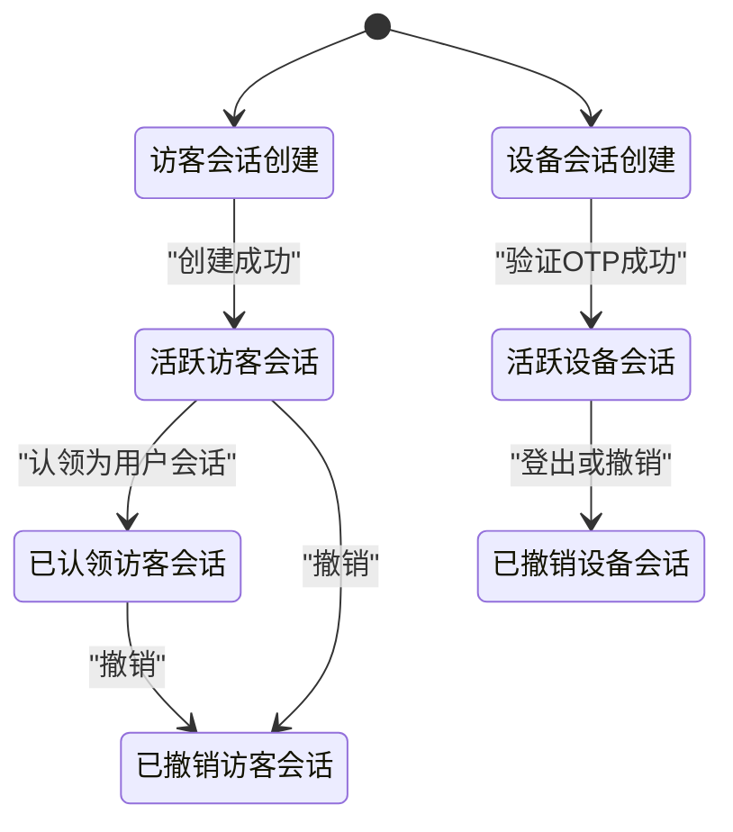
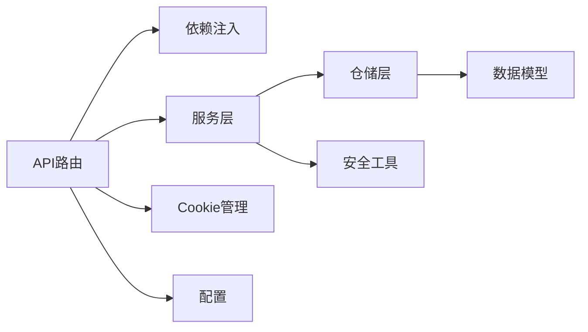
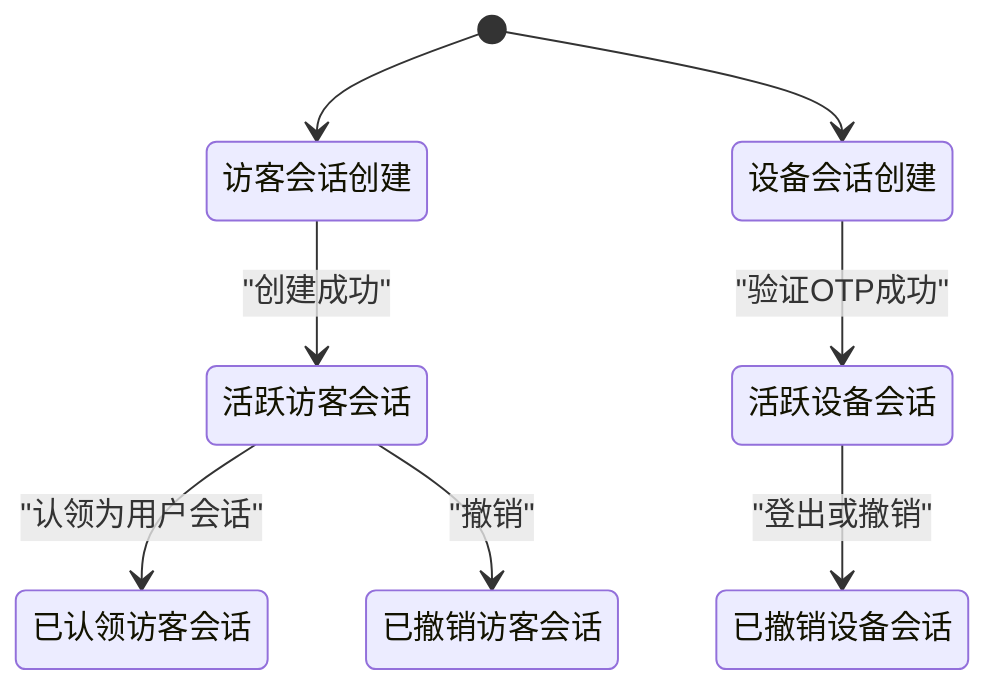

# 会话管理

<cite>
**本文引用的文件**
- [backend/app/identity/models.py](file://backend/app/identity/models.py)
- [backend/app/identity/security.py](file://backend/app/identity/security.py)
- [backend/app/identity/repository.py](file://backend/app/identity/repository.py)
- [backend/app/identity/service.py](file://backend/app/identity/service.py)
- [backend/app/identity/cookies.py](file://backend/app/identity/cookies.py)
- [backend/app/api/guest_sessions.py](file://backend/app/api/guest_sessions.py)
- [backend/app/api/auth.py](file://backend/app/api/auth.py)
- [backend/app/api/dependencies.py](file://backend/app/api/dependencies.py)
- [backend/app/config.py](file://backend/app/config.py)
- [contracts/schemas/auth-session.schema.json](file://contracts/schemas/auth-session.schema.json)
- [web/src/test/api-session.test.ts](file://web/src/test/api-session.test.ts)
</cite>

## 目录
1. [简介](#简介)
2. [项目结构](#项目结构)
3. [核心组件](#核心组件)
4. [架构总览](#架构总览)
5. [详细组件分析](#详细组件分析)
6. [依赖关系分析](#依赖关系分析)
7. [性能考虑](#性能考虑)
8. [故障排查指南](#故障排查指南)
9. [结论](#结论)
10. [附录：API使用示例与状态转换图](#附录api使用示例与状态转换图)

## 简介
本文件面向会话管理系统，围绕设备会话（DeviceSession）与访客会话（GuestSession）的数据模型、令牌安全机制、生命周期管理、存储策略、过期策略、状态转换与安全注意事项进行系统化说明，并提供API使用示例与故障排查建议。系统采用“双提交CSRF”与“仅持久化令牌哈希”的安全设计，结合数据库索引优化查询性能，并通过配置项控制会话时长与Cookie行为。

## 项目结构
与会话相关的后端代码主要分布在以下模块：
- 数据模型与索引：定义设备会话与访客会话的表结构与约束
- 安全工具：生成不透明令牌与计算令牌哈希
- 仓储层：封装会话的创建、查找与撤销等持久化操作
- 服务层：实现会话创建、登录验证、设备会话签发等业务逻辑
- Cookie管理：设置/清除会话与CSRF Cookie
- API路由：暴露创建访客会话、请求/验证OTP、登出等接口
- 配置：控制会话天数、Cookie安全属性、速率限制等

**图表来源**
- [backend/app/api/guest_sessions.py:16-53](file://backend/app/api/guest_sessions.py#L16-L53)
- [backend/app/api/auth.py:44-161](file://backend/app/api/auth.py#L44-L161)
- [backend/app/api/dependencies.py:19-110](file://backend/app/api/dependencies.py#L19-L110)
- [backend/app/identity/repository.py:16-114](file://backend/app/identity/repository.py#L16-L114)
- [backend/app/identity/models.py:68-110](file://backend/app/identity/models.py#L68-L110)
- [backend/app/identity/cookies.py:12-102](file://backend/app/identity/cookies.py#L12-L102)
- [backend/app/identity/security.py:5-11](file://backend/app/identity/security.py#L5-L11)
- [backend/app/config.py:62-141](file://backend/app/config.py#L62-L141)

**章节来源**
- [backend/app/identity/models.py:68-110](file://backend/app/identity/models.py#L68-L110)
- [backend/app/identity/security.py:5-11](file://backend/app/identity/security.py#L5-L11)
- [backend/app/identity/repository.py:16-114](file://backend/app/identity/repository.py#L16-L114)
- [backend/app/identity/service.py:28-192](file://backend/app/identity/service.py#L28-L192)
- [backend/app/identity/cookies.py:12-102](file://backend/app/identity/cookies.py#L12-L102)
- [backend/app/api/guest_sessions.py:16-53](file://backend/app/api/guest_sessions.py#L16-L53)
- [backend/app/api/auth.py:44-161](file://backend/app/api/auth.py#L44-L161)
- [backend/app/api/dependencies.py:19-110](file://backend/app/api/dependencies.py#L19-L110)
- [backend/app/config.py:62-141](file://backend/app/config.py#L62-L141)

## 核心组件
- 数据模型
  - DeviceSession：设备级会话，绑定用户ID，记录token_hash、csrf_token_hash、过期时间、最后访问时间、撤销时间等
  - GuestSession：访客会话，记录token_hash、csrf_token_hash、过期时间、认领时间与认领用户ID、撤销时间等
- 安全工具
  - new_opaque_token：生成不透明令牌
  - hash_token：对令牌进行SHA-256哈希，仅持久化哈希值
- 仓储层
  - 提供创建、查找活跃会话、撤销会话等方法
- 服务层
  - GuestSessionService：创建访客会话，支持续期旧令牌并设置24小时绝对过期
  - AuthService：处理OTP流程，验证后创建设备会话，设置设备会话天数
- Cookie管理
  - set_guest_cookies/set_device_cookies：设置会话与CSRF Cookie，遵循Secure、HttpOnly、SameSite=Lax
  - clear_device_cookies：登出时清理设备会话Cookie
- API路由
  - 创建访客会话、请求OTP、验证OTP、登出等

**章节来源**
- [backend/app/identity/models.py:68-110](file://backend/app/identity/models.py#L68-L110)
- [backend/app/identity/security.py:5-11](file://backend/app/identity/security.py#L5-L11)
- [backend/app/identity/repository.py:20-99](file://backend/app/identity/repository.py#L20-L99)
- [backend/app/identity/service.py:28-192](file://backend/app/identity/service.py#L28-L192)
- [backend/app/identity/cookies.py:12-102](file://backend/app/identity/cookies.py#L12-L102)
- [backend/app/api/guest_sessions.py:16-53](file://backend/app/api/guest_sessions.py#L16-L53)
- [backend/app/api/auth.py:44-161](file://backend/app/api/auth.py#L44-L161)

## 架构总览
会话管理采用分层架构：API路由负责接收请求与返回响应；依赖注入解析数据库会话与CSRF校验；服务层编排业务逻辑；仓储层访问数据库；模型定义数据结构与索引；安全工具保障令牌安全；Cookie管理确保传输安全。

**图表来源**
- [backend/app/api/guest_sessions.py:16-53](file://backend/app/api/guest_sessions.py#L16-L53)
- [backend/app/api/auth.py:44-161](file://backend/app/api/auth.py#L44-L161)
- [backend/app/api/dependencies.py:29-110](file://backend/app/api/dependencies.py#L29-L110)
- [backend/app/identity/service.py:39-192](file://backend/app/identity/service.py#L39-L192)
- [backend/app/identity/repository.py:20-99](file://backend/app/identity/repository.py#L20-L99)
- [backend/app/identity/cookies.py:35-102](file://backend/app/identity/cookies.py#L35-L102)

## 详细组件分析

### 数据模型设计与索引策略
- DeviceSession
  - 字段：id、user_id、token_hash、csrf_token_hash、expires_at、last_seen_at、revoked_at、created_at
  - 关系：user_id外键关联users表
  - 索引：唯一约束uq_device_sessions_token_hash；索引ix_device_sessions_user_id
- GuestSession
  - 字段：id、token_hash、csrf_token_hash、expires_at、claimed_at、claimed_by_user_id、revoked_at、created_at
  - 关系：claimed_by_user_id外键关联users表（可空）
  - 索引：唯一约束uq_guest_sessions_token_hash；索引ix_guest_sessions_expires_at

**图表来源**
- [backend/app/identity/models.py:31-110](file://backend/app/identity/models.py#L31-L110)

**章节来源**
- [backend/app/identity/models.py:68-110](file://backend/app/identity/models.py#L68-L110)

### 令牌安全机制（token_hash与csrf_token_hash）
- 令牌生成
  - 使用new_opaque_token生成不透明令牌（URL安全随机字符串）
- 令牌哈希
  - 使用hash_token对令牌进行SHA-256哈希，仅将哈希值持久化到数据库
- CSRF双提交校验
  - 客户端在Cookie中持有CSRF令牌，同时在请求头携带相同令牌
  - 依赖注入层比较Cookie与Header中的CSRF令牌是否一致，若一致则通过校验并返回cookie_token与其哈希
- 安全要点
  - 会话Cookie设置为HttpOnly与Secure，防止XSS与窃听
  - CSRF Cookie为可读但受SameSite=Lax保护
  - 仅持久化哈希，避免泄露原始令牌

**图表来源**
- [backend/app/identity/security.py:5-11](file://backend/app/identity/security.py#L5-L11)
- [backend/app/identity/cookies.py:12-102](file://backend/app/identity/cookies.py#L12-L102)
- [backend/app/api/dependencies.py:29-36](file://backend/app/api/dependencies.py#L29-L36)

**章节来源**
- [backend/app/identity/security.py:5-11](file://backend/app/identity/security.py#L5-L11)
- [backend/app/api/dependencies.py:29-36](file://backend/app/api/dependencies.py#L29-L36)
- [backend/app/identity/cookies.py:12-102](file://backend/app/identity/cookies.py#L12-L102)

### 会话生命周期管理（创建、更新、续期、销毁）
- 创建访客会话
  - 调用GuestSessionService.create，支持传入existing_token以续期旧会话
  - 生成新的token与csrf_token，设置expires_at为当前时间+24小时
  - 持久化GuestSession，设置Cookie并返回响应
- 创建设备会话
  - 通过AuthService.verify_otp完成OTP验证后，生成设备会话
  - 设置expires_at为当前时间+device_session_days天
  - 持久化DeviceSession，设置设备会话Cookie并返回响应
- 更新与会话续期
  - 访客会话创建时若存在existing_token，先撤销旧会话再创建新会话
  - 设备会话未显式实现滑动续期，可通过重新登录或后续扩展实现
- 销毁会话
  - 登出接口标记设备会话revoked_at并清理Cookie
  - 访客会话可通过撤销方法标记revoked_at

**图表来源**
- [backend/app/api/guest_sessions.py:16-53](file://backend/app/api/guest_sessions.py#L16-L53)
- [backend/app/api/auth.py:91-161](file://backend/app/api/auth.py#L91-L161)
- [backend/app/identity/service.py:39-192](file://backend/app/identity/service.py#L39-L192)
- [backend/app/identity/repository.py:20-99](file://backend/app/identity/repository.py#L20-L99)

**章节来源**
- [backend/app/identity/service.py:39-192](file://backend/app/identity/service.py#L39-L192)
- [backend/app/api/auth.py:91-161](file://backend/app/api/auth.py#L91-L161)
- [backend/app/api/guest_sessions.py:16-53](file://backend/app/api/guest_sessions.py#L16-L53)

### 设备会话与用户会话的区别及适用场景
- 设备会话（DeviceSession）
  - 绑定已认证用户，适合长期访问敏感资源
  - 会话时长由配置device_session_days决定
  - 需要设备级CSRF校验
- 访客会话（GuestSession）
  - 未认证用户临时会话，适合匿名浏览与引导注册
  - 会话时长固定为24小时
  - 支持认领（claim）为已认证用户会话

**章节来源**
- [backend/app/identity/models.py:68-110](file://backend/app/identity/models.py#L68-L110)
- [backend/app/identity/service.py:20-58](file://backend/app/identity/service.py#L20-L58)
- [backend/app/config.py:140-141](file://backend/app/config.py#L140-L141)

### 会话存储策略（内存缓存与持久化存储）
- 持久化存储
  - 所有会话的哈希值与元数据存储在数据库，保证可审计与可恢复
- 内存缓存
  - OTP挑战与请求限流使用内存结构（InMemoryOtpChallengeStore、InMemoryOtpRequestLimiter），适用于测试与本地环境
  - 生产环境建议使用更健壮的分布式存储替代内存实现

**章节来源**
- [backend/app/identity/repository.py:20-99](file://backend/app/identity/repository.py#L20-L99)
- [backend/app/identity/otp.py:64-180](file://backend/app/identity/otp.py#L64-L180)

### 会话过期策略（绝对过期与滑动过期）
- 绝对过期
  - 访客会话：创建时设置expires_at为当前时间+24小时
  - 设备会话：创建时设置expires_at为当前时间+device_session_days天
- 滑动过期
  - 当前实现未显式更新last_seen_at作为滑动续期点
  - 可通过在每次访问时刷新last_seen_at并检查是否超过阈值来实现滑动过期

**章节来源**
- [backend/app/identity/service.py:20-58](file://backend/app/identity/service.py#L20-L58)
- [backend/app/identity/models.py:68-110](file://backend/app/identity/models.py#L68-L110)

### 会话状态转换图

**图表来源**
- [backend/app/identity/service.py:39-192](file://backend/app/identity/service.py#L39-L192)
- [backend/app/api/auth.py:91-161](file://backend/app/api/auth.py#L91-L161)

## 依赖关系分析
- API路由依赖依赖注入层进行CSRF校验与会话解析
- 服务层依赖仓储层进行会话持久化
- 仓储层依赖数据模型进行数据库操作
- Cookie管理依赖配置项设置Cookie属性
- 安全工具被服务层与依赖注入层共同使用

**图表来源**
- [backend/app/api/guest_sessions.py:16-53](file://backend/app/api/guest_sessions.py#L16-L53)
- [backend/app/api/auth.py:44-161](file://backend/app/api/auth.py#L44-L161)
- [backend/app/api/dependencies.py:19-110](file://backend/app/api/dependencies.py#L19-L110)
- [backend/app/identity/service.py:39-192](file://backend/app/identity/service.py#L39-L192)
- [backend/app/identity/repository.py:16-114](file://backend/app/identity/repository.py#L16-L114)
- [backend/app/identity/models.py:68-110](file://backend/app/identity/models.py#L68-L110)
- [backend/app/identity/cookies.py:12-102](file://backend/app/identity/cookies.py#L12-L102)
- [backend/app/config.py:62-141](file://backend/app/config.py#L62-L141)

**章节来源**
- [backend/app/api/guest_sessions.py:16-53](file://backend/app/api/guest_sessions.py#L16-L53)
- [backend/app/api/auth.py:44-161](file://backend/app/api/auth.py#L44-L161)
- [backend/app/api/dependencies.py:19-110](file://backend/app/api/dependencies.py#L19-L110)
- [backend/app/identity/service.py:39-192](file://backend/app/identity/service.py#L39-L192)
- [backend/app/identity/repository.py:16-114](file://backend/app/identity/repository.py#L16-L114)
- [backend/app/identity/models.py:68-110](file://backend/app/identity/models.py#L68-L110)
- [backend/app/identity/cookies.py:12-102](file://backend/app/identity/cookies.py#L12-L102)
- [backend/app/config.py:62-141](file://backend/app/config.py#L62-L141)

## 性能考虑
- 数据库索引
  - 使用唯一约束与索引加速令牌查找与会话过期清理
- 速率限制
  - 访客会话创建与OTP请求均有限速保护，防止滥用
- 内存结构
  - OTP挑战与请求限流使用内存结构，减少外部依赖开销
- Cookie大小
  - 仅传递必要信息，避免过大Cookie影响网络性能

[本节为通用指导，无需特定文件引用]

## 故障排查指南
- CSRF校验失败
  - 检查Cookie与请求头中的CSRF令牌是否一致
  - 确认Cookie的SameSite与Secure设置正确
- 会话无效
  - 检查会话是否已过期或被撤销
  - 确认数据库中存在对应会话且未被标记为撤销
- 速率限制触发
  - 检查请求频率是否超过限制窗口
  - 等待重试间隔后再次尝试

**章节来源**
- [backend/app/api/dependencies.py:29-36](file://backend/app/api/dependencies.py#L29-L36)
- [backend/app/identity/repository.py:20-99](file://backend/app/identity/repository.py#L20-L99)
- [backend/tests/test_guest_sessions.py:146-175](file://backend/tests/test_guest_sessions.py#L146-L175)

## 结论
本会话管理系统通过严格的数据模型设计、安全的令牌机制、清晰的生命周期管理与合理的存储策略，提供了可靠的设备与会话管理能力。结合速率限制与Cookie安全设置，系统在安全性与性能之间取得平衡。未来可扩展滑动过期与多端会话管理等高级特性。

[本节为总结性内容，无需特定文件引用]

## 附录：API使用示例与状态转换图

### API使用示例
- 创建访客会话
  - 请求：POST /api/v1/guest-sessions
  - 响应：201 Created，包含expires_at与csrf_token
  - Cookie：设置mingli_guest与mingli_csrf
- 请求OTP
  - 请求：POST /api/v1/auth/otp/request（需访客CSRF）
  - 响应：202 Accepted，包含challenge_id、expires_at、retry_after_seconds
- 验证OTP
  - 请求：POST /api/v1/auth/otp/verify（需访客CSRF）
  - 响应：200 OK，包含user_id、session_id、expires_at、csrf_token
  - Cookie：设置设备会话Cookie
- 登出
  - 请求：POST /api/v1/auth/logout（需设备CSRF）
  - 响应：204 No Content
  - Cookie：删除设备会话Cookie

**章节来源**
- [backend/app/api/guest_sessions.py:16-53](file://backend/app/api/guest_sessions.py#L16-L53)
- [backend/app/api/auth.py:44-161](file://backend/app/api/auth.py#L44-L161)
- [contracts/schemas/auth-session.schema.json:1-14](file://contracts/schemas/auth-session.schema.json#L1-L14)
- [web/src/test/api-session.test.ts:50-279](file://web/src/test/api-session.test.ts#L50-L279)

### 状态转换图

**图表来源**
- [backend/app/identity/service.py:39-192](file://backend/app/identity/service.py#L39-L192)
- [backend/app/api/auth.py:91-161](file://backend/app/api/auth.py#L91-L161)