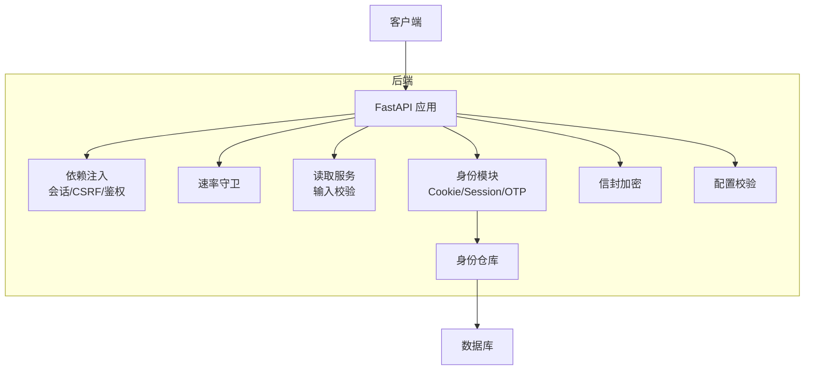
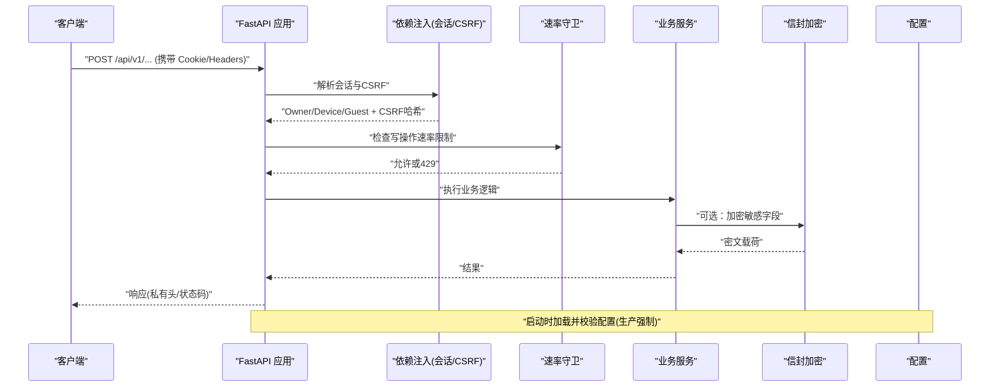
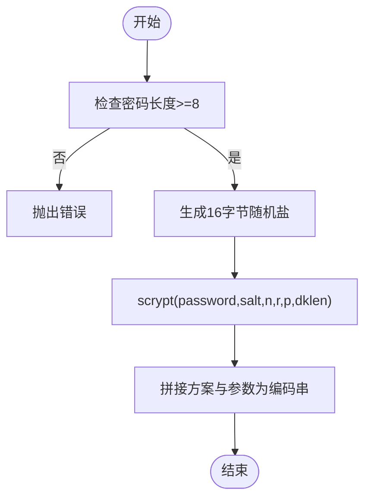
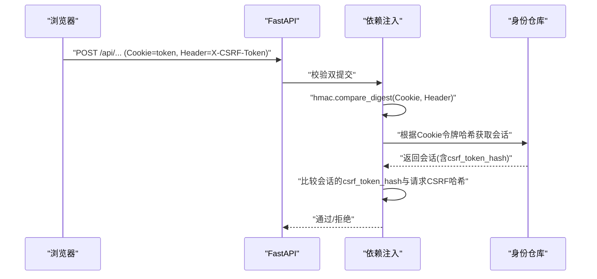
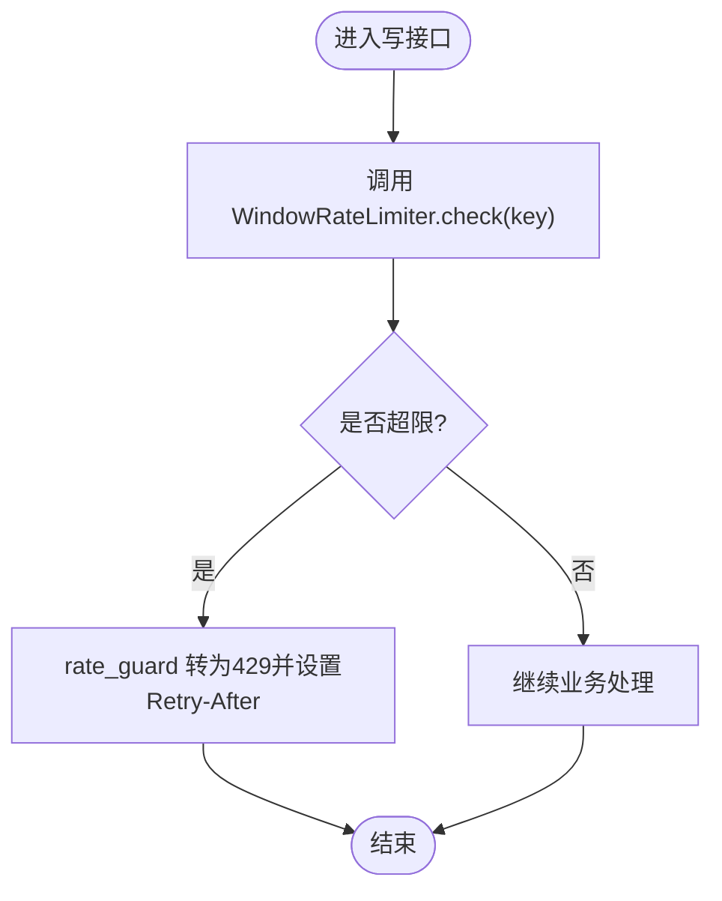
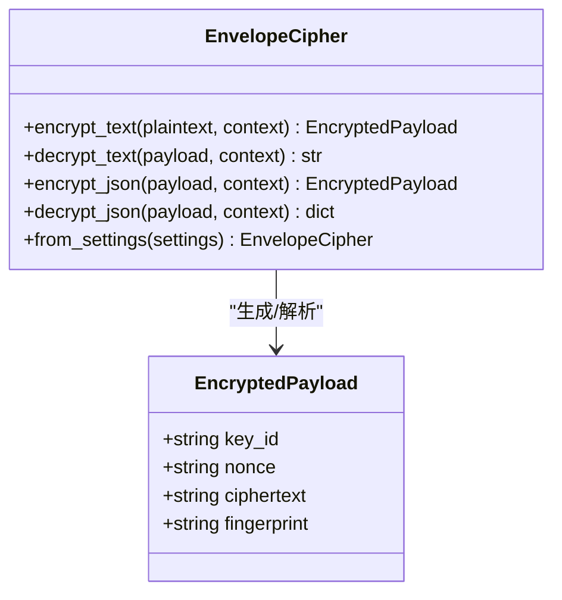
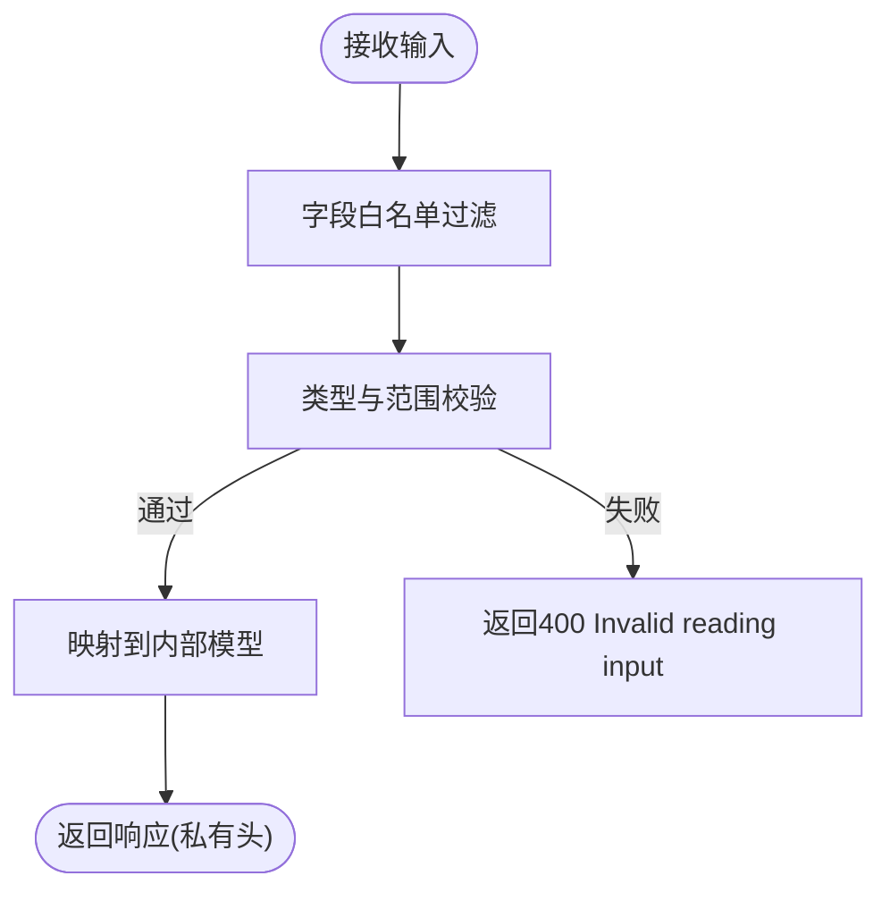
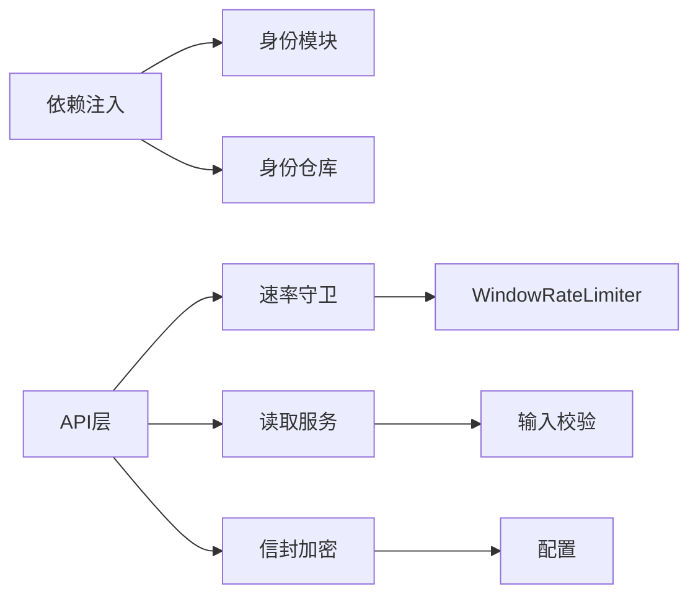
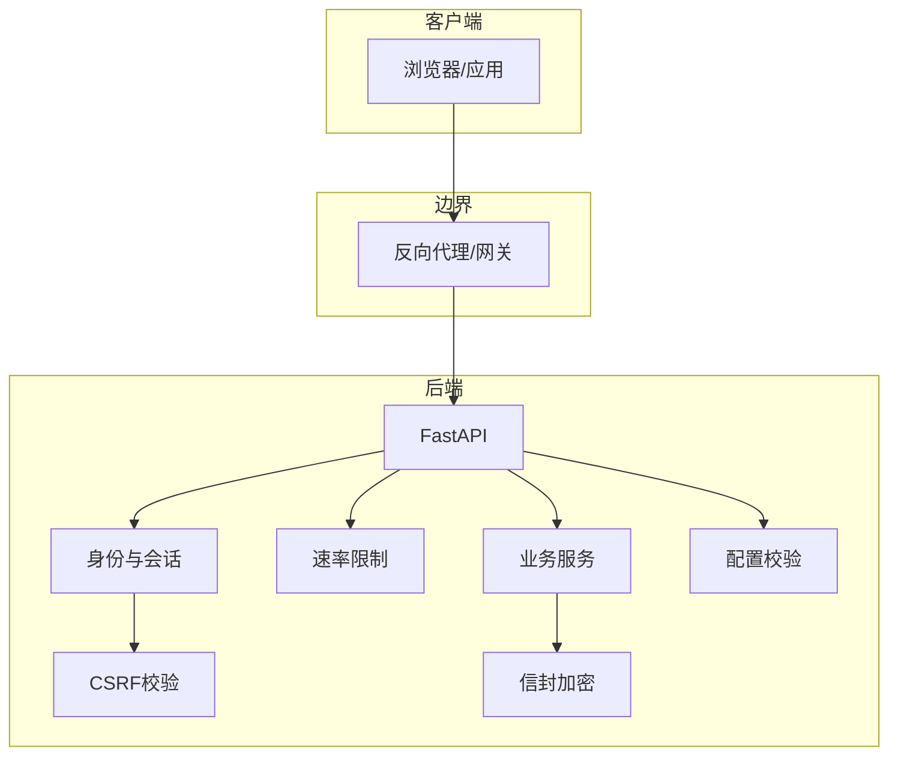

# 安全机制

<cite>
**本文引用的文件**
- [backend/app/admin/passwords.py](file://backend/app/admin/passwords.py)
- [backend/app/identity/security.py](file://backend/app/identity/security.py)
- [backend/app/api/dependencies.py](file://backend/app/api/dependencies.py)
- [backend/app/readings/rate_limit.py](file://backend/app/readings/rate_limit.py)
- [backend/app/api/rate_guard.py](file://backend/app/api/rate_guard.py)
- [backend/app/identity/otp.py](file://backend/app/identity/otp.py)
- [backend/tests/test_guest_sessions.py](file://backend/tests/test_guest_sessions.py)
- [backend/tests/test_auth.py](file://backend/tests/test_auth.py)
- [backend/app/security/envelope.py](file://backend/app/security/envelope.py)
- [backend/app/config.py](file://backend/app/config.py)
- [backend/tests/test_sensitive_payloads.py](file://backend/tests/test_sensitive_payloads.py)
- [backend/app/readings/service.py](file://backend/app/readings/service.py)
- [backend/tests/test_readings_api.py](file://backend/tests/test_readings_api.py)
- [contracts/schemas/auth-session.schema.json](file://contracts/schemas/auth-session.schema.json)
</cite>

## 目录
1. [简介](#简介)
2. [项目结构](#项目结构)
3. [核心组件](#核心组件)
4. [架构总览](#架构总览)
5. [详细组件分析](#详细组件分析)
6. [依赖关系分析](#依赖关系分析)
7. [性能考虑](#性能考虑)
8. [故障排查指南](#故障排查指南)
9. [结论](#结论)
10. [附录](#附录)

## 简介
本文件聚焦后端安全机制，覆盖密码加密、令牌与签名、CSRF防护、速率限制、敏感数据信封加密、输入验证与输出编码等关键主题。文档基于代码库中的实际实现进行说明，并给出架构图、威胁模型与防护措施清单，以及配置与应急建议。

## 项目结构
本项目采用模块化后端（FastAPI）+ 前端（Next.js）的单体架构。与安全相关的核心位于 backend/app 下：
- 身份与会话：cookies、session、CSRF、OTP 限流
- API 层：依赖注入、鉴权中间件、错误处理、速率守卫
- 业务域：读取（readings）写入限流、输入校验
- 安全原语：信封加密、密钥管理
- 配置：生产环境强制策略、密钥注入校验

图表来源
- [backend/app/api/dependencies.py:1-137](file://backend/app/api/dependencies.py#L1-L137)
- [backend/app/readings/rate_limit.py:1-61](file://backend/app/readings/rate_limit.py#L1-L61)
- [backend/app/security/envelope.py:1-121](file://backend/app/security/envelope.py#L1-L121)
- [backend/app/config.py:62-335](file://backend/app/config.py#L62-L335)

章节来源
- [backend/app/api/dependencies.py:1-137](file://backend/app/api/dependencies.py#L1-L137)
- [backend/app/config.py:62-335](file://backend/app/config.py#L62-L335)

## 核心组件
- 密码哈希：管理员账户使用 scrypt，参数固定，随机盐，常量时间比较。
- 令牌与签名：设备会话与访客会话通过 Cookie 传递；CSRF 使用双提交模式（Cookie + Header），服务端对 Cookie 值做哈希后与存储的 CSRF 哈希比对。
- CSRF 防护：统一在依赖中校验，拒绝缺失或不匹配的请求。
- 速率限制：
  - 进程内滑动窗口限流器（按所有者键）。
  - OTP 三重窗口限流（访客、网络 IP、目标地址），支持回滚与受信任代理识别。
- 敏感数据加密：AES-256-GCM 信封加密，带领域上下文 AAD 与指纹校验，密钥由配置注入并在生产环境强制校验。
- 输入验证与输出编码：读取输入字段白名单、类型与范围校验；响应头标记私有内容，禁止缓存与索引。

章节来源
- [backend/app/admin/passwords.py:1-55](file://backend/app/admin/passwords.py#L1-L55)
- [backend/app/identity/security.py:1-11](file://backend/app/identity/security.py#L1-L11)
- [backend/app/api/dependencies.py:1-137](file://backend/app/api/dependencies.py#L1-L137)
- [backend/app/readings/rate_limit.py:1-61](file://backend/app/readings/rate_limit.py#L1-L61)
- [backend/app/identity/otp.py:64-180](file://backend/app/identity/otp.py#L64-L180)
- [backend/app/security/envelope.py:1-121](file://backend/app/security/envelope.py#L1-L121)
- [backend/app/config.py:62-335](file://backend/app/config.py#L62-L335)
- [backend/app/readings/service.py:706-773](file://backend/app/readings/service.py#L706-L773)

## 架构总览
下图展示认证、CSRF、速率限制与敏感数据处理的端到端流程。

图表来源
- [backend/app/api/dependencies.py:1-137](file://backend/app/api/dependencies.py#L1-L137)
- [backend/app/api/rate_guard.py:1-19](file://backend/app/api/rate_guard.py#L1-L19)
- [backend/app/security/envelope.py:1-121](file://backend/app/security/envelope.py#L1-L121)
- [backend/app/config.py:62-335](file://backend/app/config.py#L62-L335)

## 详细组件分析

### 密码加密与盐值策略
- 算法：scrypt，参数 N=2^14、r=8、p=1，DKLEN=64，盐长度16字节。
- 生成：每次哈希使用随机盐，返回包含参数的可解析字符串。
- 验证：解析参数后重新计算摘要，使用常量时间比较防止时序攻击。
- 适用场景：管理员账户密码存储。

图表来源
- [backend/app/admin/passwords.py:16-31](file://backend/app/admin/passwords.py#L16-L31)
- [backend/app/admin/passwords.py:34-54](file://backend/app/admin/passwords.py#L34-L54)

章节来源
- [backend/app/admin/passwords.py:1-55](file://backend/app/admin/passwords.py#L1-L55)

### 令牌与签名机制（会话与CSRF）
- 会话令牌：设备会话与访客会话通过 Cookie 传递，服务端将 Cookie 值哈希后与存储的哈希比对，避免明文泄露风险。
- CSRF 双提交：Cookie 中的令牌与请求头 X-CSRF-Token 必须一致，服务端对 Cookie 令牌哈希后与存储的 CSRF 哈希对比。
- 统一入口：依赖函数提供 require_guest_csrf、require_device_csrf、require_owner_csrf，失败返回 403。

图表来源
- [backend/app/api/dependencies.py:29-54](file://backend/app/api/dependencies.py#L29-L54)
- [backend/app/api/dependencies.py:113-130](file://backend/app/api/dependencies.py#L113-L130)
- [backend/app/identity/security.py:5-10](file://backend/app/identity/security.py#L5-L10)

章节来源
- [backend/app/api/dependencies.py:1-137](file://backend/app/api/dependencies.py#L1-L137)
- [backend/app/identity/security.py:1-11](file://backend/app/identity/security.py#L1-L11)
- [contracts/schemas/auth-session.schema.json:1-14](file://contracts/schemas/auth-session.schema.json#L1-L14)

### CSRF 防护实现
- 生成：会话创建时生成足够长度的 CSRF 令牌（至少32字符），存入响应 schema。
- 验证：所有写操作需携带相同值的 Cookie 与 Header，服务端用常量时间比较。
- 失效处理：客户端在收到 403 时清理旧令牌并重新获取。

章节来源
- [backend/app/api/dependencies.py:29-54](file://backend/app/api/dependencies.py#L29-L54)
- [backend/app/api/dependencies.py:113-130](file://backend/app/api/dependencies.py#L113-L130)
- [contracts/schemas/auth-session.schema.json:1-14](file://contracts/schemas/auth-session.schema.json#L1-L14)

### 速率限制机制
- 进程内写操作限流：WindowRateLimiter 维护每个 key 的时间戳队列，超过 limit 则抛出异常并附带 Retry-After。
- 守卫封装：check_rate_limiter 捕获异常并转换为 429 响应。
- OTP 三重窗口限流：
  - 访客窗口：同一访客会话在窗口内的最大请求数。
  - 网络窗口：同一网络 IP 在窗口内的最大请求数。
  - 目标窗口：同一目标地址（如邮箱/手机）在窗口内的最大请求数。
  - 支持回滚：投递失败时释放访客与目标容量，保留网络窗口计数以防滥用。
  - 可信代理：从 X-Forwarded-For 中按 trusted_proxy_cidrs 识别真实客户端 IP。

图表来源
- [backend/app/readings/rate_limit.py:9-61](file://backend/app/readings/rate_limit.py#L9-L61)
- [backend/app/api/rate_guard.py:5-19](file://backend/app/api/rate_guard.py#L5-L19)

章节来源
- [backend/app/readings/rate_limit.py:1-61](file://backend/app/readings/rate_limit.py#L1-L61)
- [backend/app/api/rate_guard.py:1-19](file://backend/app/api/rate_guard.py#L1-L19)
- [backend/app/identity/otp.py:64-180](file://backend/app/identity/otp.py#L64-L180)
- [backend/tests/test_guest_sessions.py:106-143](file://backend/tests/test_guest_sessions.py#L106-L143)
- [backend/tests/test_auth.py:287-339](file://backend/tests/test_auth.py#L287-L339)

### 敏感数据加密与密钥管理
- 算法：AES-256-GCM，使用随机 nonce 与领域上下文 AAD，确保密文不可重用且绑定上下文。
- 完整性：额外计算 HMAC 指纹并与密文一起存储，解密时校验指纹，防止篡改。
- 密钥管理：
  - 通过配置项注入 256 位密钥（base64 编码）与 key_id。
  - 生产环境强制要求注入真实密钥，禁止本地默认密钥与复用身份哈希密钥。
  - 提供 from_settings 工厂方法从配置构造加解密密钥。

图表来源
- [backend/app/security/envelope.py:24-121](file://backend/app/security/envelope.py#L24-L121)
- [backend/app/config.py:211-236](file://backend/app/config.py#L211-L236)

章节来源
- [backend/app/security/envelope.py:1-121](file://backend/app/security/envelope.py#L1-L121)
- [backend/app/config.py:62-335](file://backend/app/config.py#L62-L335)
- [backend/tests/test_sensitive_payloads.py:1-53](file://backend/tests/test_sensitive_payloads.py#L1-L53)

### 输入验证与输出编码
- 输入验证：
  - 仅允许白名单字段，未知字段直接拒绝。
  - 运行时字段类型严格校验（整数、文本、选择等），数值范围受限。
  - 特定聚合字段（如六爻 cast）要求完整且顺序正确。
- 输出编码：
  - 私有响应头标记 cache-control 与 robots 标签，禁止缓存与索引。
  - 对外 JSON 输出遵循 OpenAPI 契约，减少歧义。

图表来源
- [backend/app/readings/service.py:706-773](file://backend/app/readings/service.py#L706-L773)
- [backend/app/api/dependencies.py:133-136](file://backend/app/api/dependencies.py#L133-L136)

章节来源
- [backend/app/readings/service.py:706-773](file://backend/app/readings/service.py#L706-L773)
- [backend/tests/test_readings_api.py:849-898](file://backend/tests/test_readings_api.py#L849-L898)
- [backend/app/api/dependencies.py:133-136](file://backend/app/api/dependencies.py#L133-L136)

## 依赖关系分析
- 依赖注入层依赖身份模块与仓库，负责会话解析与 CSRF 校验。
- 速率守卫依赖进程内限流器，统一将超限转换为 429。
- 业务服务依赖输入校验策略，保证只有受控字段进入核心逻辑。
- 信封加密依赖配置注入的密钥，生产环境强制校验。

图表来源
- [backend/app/api/dependencies.py:1-137](file://backend/app/api/dependencies.py#L1-L137)
- [backend/app/readings/rate_limit.py:1-61](file://backend/app/readings/rate_limit.py#L1-L61)
- [backend/app/readings/service.py:706-773](file://backend/app/readings/service.py#L706-L773)
- [backend/app/security/envelope.py:1-121](file://backend/app/security/envelope.py#L1-L121)
- [backend/app/config.py:62-335](file://backend/app/config.py#L62-L335)

章节来源
- [backend/app/api/dependencies.py:1-137](file://backend/app/api/dependencies.py#L1-L137)
- [backend/app/readings/rate_limit.py:1-61](file://backend/app/readings/rate_limit.py#L1-L61)
- [backend/app/readings/service.py:706-773](file://backend/app/readings/service.py#L706-L773)
- [backend/app/security/envelope.py:1-121](file://backend/app/security/envelope.py#L1-L121)
- [backend/app/config.py:62-335](file://backend/app/config.py#L62-L335)

## 性能考虑
- 限流器使用 deque 维护时间戳，窗口裁剪 O(k)，整体高效。
- OTP 三重窗口使用内存字典与锁，适合测试与单机部署；生产建议使用持久化存储以支持多实例。
- 信封加密使用 AES-GCM，硬件加速友好；指纹计算开销低。
- 响应私有头避免缓存放大，降低带宽与存储压力。

[本节为通用指导，不直接分析具体文件]

## 故障排查指南
- 403 CSRF 失败：
  - 检查 Cookie 与 X-CSRF-Token 是否一致且未过期。
  - 确认服务端已正确设置并校验 CSRF 哈希。
- 429 速率限制：
  - 查看 Retry-After 头部，调整重试间隔。
  - 检查是否因网络 IP 或目标地址触发 OTP 窗口限制。
- 401 会话缺失：
  - 确认 Cookie 存在且未过期，服务端能解析并匹配哈希。
- 解密失败：
  - 检查 key_id 是否匹配、context 是否正确、密文或指纹是否被篡改。
- 配置错误：
  - 生产环境必须注入真实密钥与路径，禁止使用本地默认值。

章节来源
- [backend/app/api/dependencies.py:29-54](file://backend/app/api/dependencies.py#L29-L54)
- [backend/app/api/rate_guard.py:5-19](file://backend/app/api/rate_guard.py#L5-L19)
- [backend/app/identity/otp.py:124-180](file://backend/app/identity/otp.py#L124-L180)
- [backend/app/security/envelope.py:75-96](file://backend/app/security/envelope.py#L75-L96)
- [backend/app/config.py:188-329](file://backend/app/config.py#L188-L329)

## 结论
该项目的安全机制围绕“最小权限、强校验、可观测”的原则构建：密码使用 scrypt 与随机盐；会话与 CSRF 通过双提交与哈希比对保障；速率限制分层保护资源；敏感数据采用 AES-GCM 信封加密并绑定上下文；输入严格白名单与类型校验；输出标记私有以避免缓存泄漏。生产环境通过配置强制约束，确保密钥与运行路径安全。

[本节为总结性内容，不直接分析具体文件]

## 附录

### 安全架构图

[此图为概念性架构示意，不直接映射具体源码文件]

### 威胁模型分析与防护措施清单
- 威胁：密码破解
  - 措施：scrypt 高成本参数、随机盐、常量时间比较。
- 威胁：CSRF 攻击
  - 措施：双提交模式、Cookie 与 Header 一致性校验、服务端哈希比对。
- 威胁：暴力登录与短信轰炸
  - 措施：OTP 三重窗口限流、网络 IP 识别、失败回滚、可信代理。
- 威胁：越权访问
  - 措施：会话与所有者绑定、CSRF 校验、私有响应头。
- 威胁：敏感数据泄露
  - 措施：AES-GCM 信封加密、领域上下文 AAD、指纹校验、生产密钥强制注入。
- 威胁：注入与畸形输入
  - 措施：字段白名单、类型与范围校验、拒绝未知字段。
- 威胁：缓存与索引泄露
  - 措施：私有响应头禁止缓存与索引。

[本节为通用安全建议，不直接分析具体文件]

### 安全配置指南
- 生产环境必须启用 secure cookies。
- 禁止使用 fake OTP 与 fake Runtime/Model 适配器。
- 必须注入 identity_hash_key 与 content_encryption_key_b64，且不得复用。
- 指定绝对路径的 runtime launcher/python/release/state 根目录。
- 限定模型 provider/profile/id/base_url/endpoint/thinking_mode 为白名单值。
- 限制模型超时、响应大小、温度与输出 token 上限。

章节来源
- [backend/app/config.py:188-329](file://backend/app/config.py#L188-L329)

### 漏洞扫描与应急响应
- 建议工具：
  - 依赖漏洞扫描：pip audit、safety、trivy（容器镜像）、npm audit（前端）。
  - 代码静态分析：mypy、ruff、bandit（Python 安全规则）。
  - 配置审计：CI 中校验 Settings 强制规则，拒绝不安全配置。
- 应急响应流程：
  - 发现异常：监控告警（速率限制、429/403/401 激增）。
  - 隔离影响：临时收紧速率限制、禁用可疑 IP、切换备用通道。
  - 修复与验证：更新配置与补丁，回归测试通过后发布。
  - 复盘与加固：记录根因，补充检测与防护规则。

[本节为通用实践建议，不直接分析具体文件]