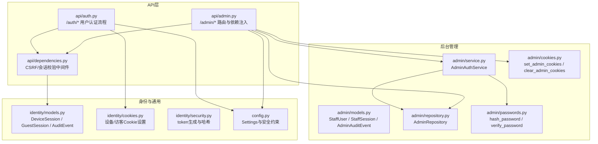
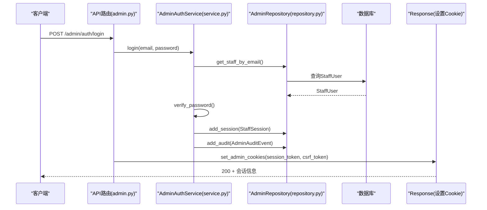
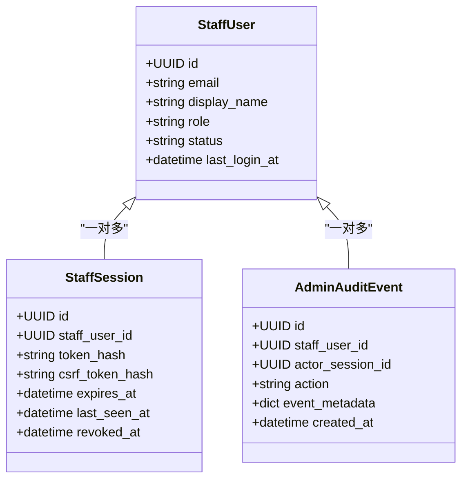
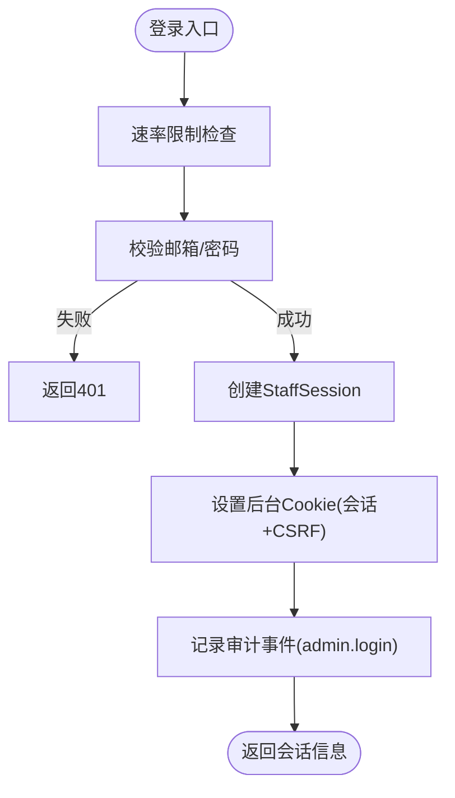
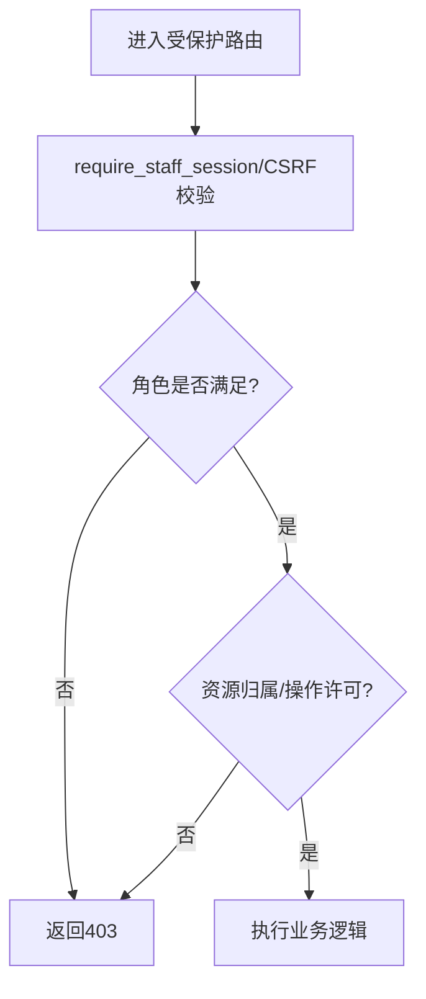
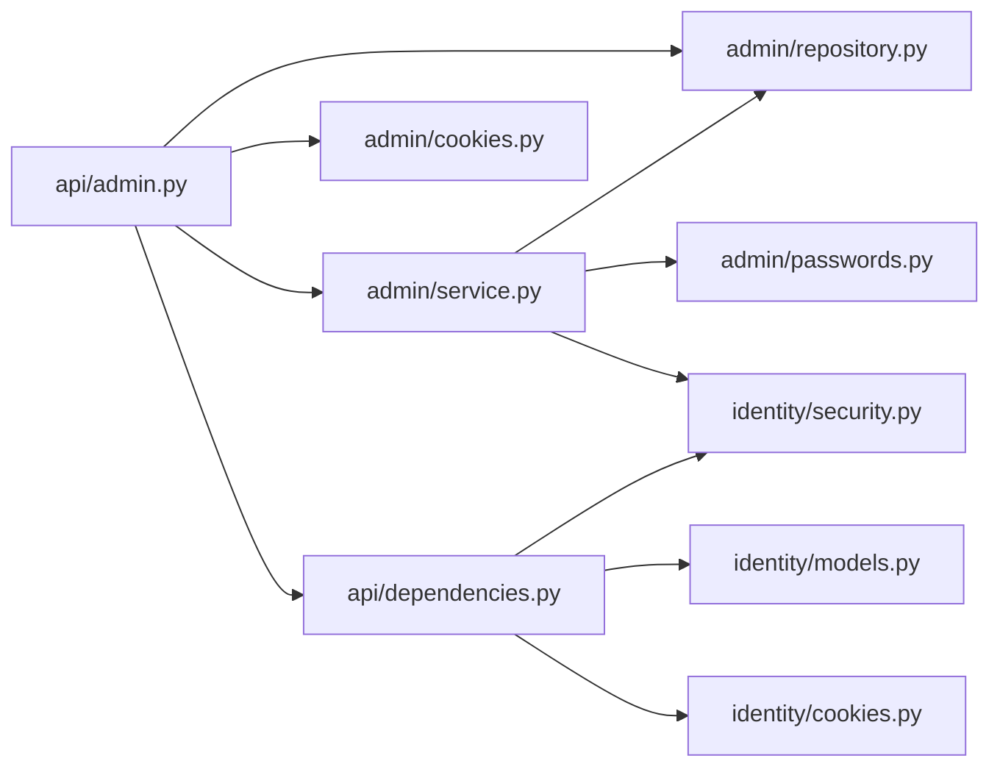
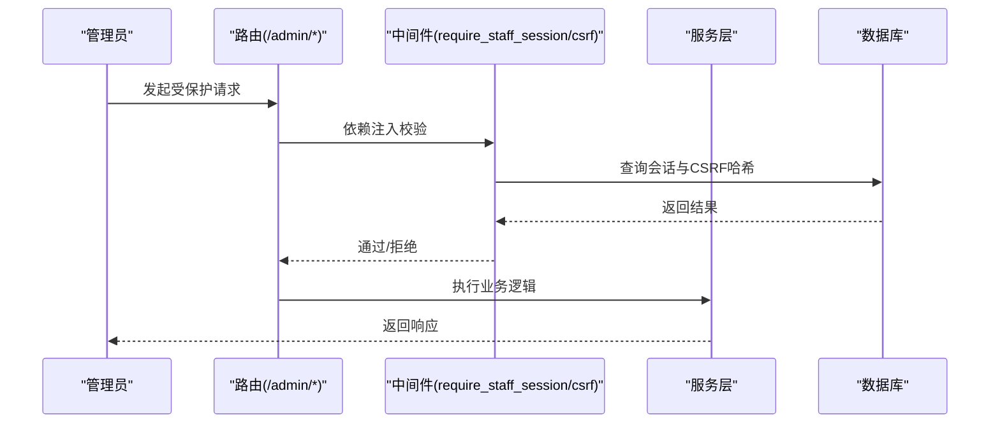

# 权限控制

<cite>
**本文引用的文件**
- [backend/app/admin/models.py](file://backend/app/admin/models.py)
- [backend/app/admin/service.py](file://backend/app/admin/service.py)
- [backend/app/admin/repository.py](file://backend/app/admin/repository.py)
- [backend/app/admin/cookies.py](file://backend/app/admin/cookies.py)
- [backend/app/admin/passwords.py](file://backend/app/admin/passwords.py)
- [backend/app/api/admin.py](file://backend/app/api/admin.py)
- [backend/app/api/auth.py](file://backend/app/api/auth.py)
- [backend/app/api/dependencies.py](file://backend/app/api/dependencies.py)
- [backend/app/identity/models.py](file://backend/app/identity/models.py)
- [backend/app/identity/cookies.py](file://backend/app/identity/cookies.py)
- [backend/app/identity/security.py](file://backend/app/identity/security.py)
- [backend/app/config.py](file://backend/app/config.py)
</cite>

## 目录
1. [简介](#简介)
2. [项目结构](#项目结构)
3. [核心组件](#核心组件)
4. [架构总览](#架构总览)
5. [详细组件分析](#详细组件分析)
6. [依赖关系分析](#依赖关系分析)
7. [性能与安全考量](#性能与安全考量)
8. [故障排查指南](#故障排查指南)
9. [结论](#结论)
10. [附录](#附录)

## 简介
本文件系统性地梳理并说明后台权限控制与访问控制机制，重点覆盖：
- 基于角色的访问控制（RBAC）模型：角色定义、权限分配与扩展点。
- 管理员认证与会话管理：StaffSession 生命周期、CSRF 校验与后台访问控制。
- 细粒度权限验证：资源级与操作级的鉴权思路与实现位置。
- Cookie 安全机制：HttpOnly、Secure、SameSite 配置与生产环境强制策略。
- 权限中间件（FastAPI 依赖注入）：请求拦截、权限验证与响应处理。
- 审计日志记录：关键操作的追踪与合规性要求。
- 权限矩阵表、访问控制流程图与安全配置示例。
- 权限扩展指南与常见问题解决方案。

## 项目结构
后端采用模块化组织，权限相关代码主要分布在 admin、api、identity 三个子模块：
- admin：后台管理员身份与会话、密码、Cookie、服务与仓储。
- api：HTTP 路由、依赖注入（中间件式校验）、错误与速率限制。
- identity：C端用户会话、Cookie、安全工具与通用数据模型。

图表来源
- [backend/app/admin/models.py:17-81](file://backend/app/admin/models.py#L17-L81)
- [backend/app/admin/service.py:33-129](file://backend/app/admin/service.py#L33-L129)
- [backend/app/admin/repository.py:14-57](file://backend/app/admin/repository.py#L14-L57)
- [backend/app/admin/cookies.py:15-81](file://backend/app/admin/cookies.py#L15-L81)
- [backend/app/admin/passwords.py:16-55](file://backend/app/admin/passwords.py#L16-L55)
- [backend/app/api/admin.py:68-100](file://backend/app/api/admin.py#L68-L100)
- [backend/app/api/auth.py:91-161](file://backend/app/api/auth.py#L91-L161)
- [backend/app/api/dependencies.py:29-137](file://backend/app/api/dependencies.py#L29-L137)
- [backend/app/identity/models.py:68-132](file://backend/app/identity/models.py#L68-L132)
- [backend/app/identity/cookies.py:12-102](file://backend/app/identity/cookies.py#L12-L102)
- [backend/app/identity/security.py:5-11](file://backend/app/identity/security.py#L5-L11)
- [backend/app/config.py:62-216](file://backend/app/config.py#L62-L216)

章节来源
- [backend/app/admin/models.py:17-81](file://backend/app/admin/models.py#L17-L81)
- [backend/app/admin/service.py:33-129](file://backend/app/admin/service.py#L33-L129)
- [backend/app/admin/repository.py:14-57](file://backend/app/admin/repository.py#L14-L57)
- [backend/app/admin/cookies.py:15-81](file://backend/app/admin/cookies.py#L15-L81)
- [backend/app/admin/passwords.py:16-55](file://backend/app/admin/passwords.py#L16-L55)
- [backend/app/api/admin.py:68-100](file://backend/app/api/admin.py#L68-L100)
- [backend/app/api/auth.py:91-161](file://backend/app/api/auth.py#L91-L161)
- [backend/app/api/dependencies.py:29-137](file://backend/app/api/dependencies.py#L29-L137)
- [backend/app/identity/models.py:68-132](file://backend/app/identity/models.py#L68-L132)
- [backend/app/identity/cookies.py:12-102](file://backend/app/identity/cookies.py#L12-L102)
- [backend/app/identity/security.py:5-11](file://backend/app/identity/security.py#L5-L11)
- [backend/app/config.py:62-216](file://backend/app/config.py#L62-L216)

## 核心组件
- 管理员身份与会话
  - StaffUser：存储管理员邮箱、显示名、角色、状态等。
  - StaffSession：存储会话令牌哈希、CSRF令牌哈希、过期时间、最后活跃时间、撤销时间。
  - AdminAuditEvent：记录管理员关键操作（登录、登出、引导创建等）。
- 管理员认证服务
  - AdminAuthService：负责登录、登出、引导创建超级管理员、会话创建与审计记录。
- 管理员仓储
  - AdminRepository：提供管理员查询、会话增删改查、审计事件写入。
- Cookie 工具
  - set_admin_cookies/clear_admin_cookies：设置/清理后台会话与CSRF Cookie，统一安全属性。
- 密码工具
  - hash_password/verify_password：使用 scrypt 进行密码哈希与校验。
- API 路由与中间件
  - require_staff_session/require_staff_csrf：后台鉴权与CSRF校验的依赖注入。
  - require_device_session/require_guest_session/require_owner_*：C端鉴权与CSRF校验。
- 身份与会话模型
  - DeviceSession/GuestSession/AuditEvent：用于C端用户会话与审计。
- 安全与配置
  - identity.security：生成不透明令牌与哈希。
  - config.Settings：全局安全策略（如生产环境强制 Secure Cookie、禁止引导凭据等）。

章节来源
- [backend/app/admin/models.py:17-81](file://backend/app/admin/models.py#L17-L81)
- [backend/app/admin/service.py:33-129](file://backend/app/admin/service.py#L33-L129)
- [backend/app/admin/repository.py:14-57](file://backend/app/admin/repository.py#L14-L57)
- [backend/app/admin/cookies.py:15-81](file://backend/app/admin/cookies.py#L15-L81)
- [backend/app/admin/passwords.py:16-55](file://backend/app/admin/passwords.py#L16-L55)
- [backend/app/api/admin.py:68-100](file://backend/app/api/admin.py#L68-L100)
- [backend/app/api/dependencies.py:29-137](file://backend/app/api/dependencies.py#L29-L137)
- [backend/app/identity/models.py:68-132](file://backend/app/identity/models.py#L68-L132)
- [backend/app/identity/security.py:5-11](file://backend/app/identity/security.py#L5-L11)
- [backend/app/config.py:62-216](file://backend/app/config.py#L62-L216)

## 架构总览
后台权限控制通过 FastAPI 的依赖注入实现“中间件式”拦截：
- 登录：POST /admin/auth/login → 校验邮箱/密码 → 创建 StaffSession → 设置后台 Cookie（会话+CSRF）→ 返回会话信息。
- 受保护接口：依赖 require_staff_session 或 require_staff_csrf → 从 Cookie 取令牌 → 校验会话有效性 → 校验CSRF双提交 → 执行业务逻辑。
- 登出：POST /admin/auth/logout → 撤销会话 → 清理 Cookie。

图表来源
- [backend/app/api/admin.py:103-145](file://backend/app/api/admin.py#L103-L145)
- [backend/app/admin/service.py:49-89](file://backend/app/admin/service.py#L49-L89)
- [backend/app/admin/repository.py:22-40](file://backend/app/admin/repository.py#L22-L40)
- [backend/app/admin/cookies.py:38-65](file://backend/app/admin/cookies.py#L38-L65)

## 详细组件分析

### RBAC 模型与角色体系
- 角色定义
  - StaffRole 为受限字面量类型，当前包含 support、finance、ops、superadmin。
  - StaffUser.role 字段持久化角色标识。
- 权限分配
  - 当前实现以角色作为粗粒度入口控制；具体资源/操作级权限可在路由层按角色分支授权。
- 继承关系
  - 代码未显式实现角色继承；可通过业务层在授权时组合角色集合模拟继承。

图表来源
- [backend/app/admin/models.py:17-81](file://backend/app/admin/models.py#L17-L81)

章节来源
- [backend/app/admin/schemas.py:11-41](file://backend/app/admin/schemas.py#L11-L41)
- [backend/app/admin/models.py:17-81](file://backend/app/admin/models.py#L17-L81)

### 管理员认证与会话管理
- 登录流程
  - 校验邮箱格式与密码强度（仓储层仅查询 active 状态）。
  - 支持本地/测试环境的引导创建超级管理员（生产禁用）。
  - 创建 StaffSession，记录 token_hash 与 csrf_token_hash。
  - 设置后台 Cookie：会话 Cookie（HttpOnly=True），CSRF Cookie（HttpOnly=False）。
- 会话校验
  - require_staff_session：从 Cookie 读取会话令牌，查询有效会话，检查状态为 active。
  - require_staff_csrf：双重提交校验（Cookie x-csrf-token 一致），并与服务端 CSRF 哈希比对。
- 登出流程
  - 撤销会话（设置 revoked_at），清理 Cookie。

图表来源
- [backend/app/api/admin.py:103-145](file://backend/app/api/admin.py#L103-L145)
- [backend/app/admin/service.py:49-89](file://backend/app/admin/service.py#L49-L89)
- [backend/app/admin/repository.py:36-40](file://backend/app/admin/repository.py#L36-L40)
- [backend/app/admin/cookies.py:38-65](file://backend/app/admin/cookies.py#L38-L65)

章节来源
- [backend/app/api/admin.py:68-100](file://backend/app/api/admin.py#L68-L100)
- [backend/app/api/admin.py:103-163](file://backend/app/api/admin.py#L103-L163)
- [backend/app/admin/service.py:49-129](file://backend/app/admin/service.py#L49-L129)
- [backend/app/admin/repository.py:42-57](file://backend/app/admin/repository.py#L42-L57)
- [backend/app/admin/cookies.py:38-81](file://backend/app/admin/cookies.py#L38-L81)

### 细粒度权限验证（资源级与操作级）
- 当前实现
  - 路由层通过依赖注入实现“会话存在且有效”的粗粒度授权。
  - 角色字段已随会话返回，可在后续路由中按角色进行资源/操作级判断。
- 建议扩展
  - 在路由层增加基于角色的访问控制装饰器或依赖函数，例如 require_role("finance")。
  - 对资源ID进行归属校验（如仅允许财务查看特定退款单）。
  - 将操作级权限（读/写/审批）抽象为策略对象，结合角色与上下文动态判定。

[此图为概念性流程图，无需源码映射]

### Cookie 安全机制
- 后台 Cookie
  - 会话 Cookie：HttpOnly=True，防止脚本读取。
  - CSRF Cookie：HttpOnly=False，配合 x-csrf-token 头进行双重提交校验。
  - SameSite=lax，减少跨站请求风险。
  - Secure 由 Settings.cookie_secure 控制，生产环境强制启用。
- C端 Cookie
  - 设备会话 Cookie：HttpOnly=True。
  - 访客会话 Cookie：HttpOnly=True。
  - CSRF Cookie：HttpOnly=False。
  - SameSite=lax。
- 生产安全约束
  - 生产环境必须启用 Secure Cookie。
  - 生产环境禁止使用 fake OTP、fake Runtime/Model、引导凭据等不安全配置。

章节来源
- [backend/app/admin/cookies.py:15-81](file://backend/app/admin/cookies.py#L15-L81)
- [backend/app/identity/cookies.py:12-102](file://backend/app/identity/cookies.py#L12-L102)
- [backend/app/config.py:188-216](file://backend/app/config.py#L188-L216)

### 权限中间件（依赖注入）工作原理
- 请求拦截
  - database_session：为每个请求提供异步数据库会话，异常时回滚。
  - require_guest_csrf/require_device_csrf：校验 CSRF 双提交与服务器端哈希一致性。
  - require_staff_session/require_staff_csrf：后台会话与CSRF校验。
- 权限验证
  - 从 Cookie 提取令牌，查询数据库中的有效会话，检查过期与撤销状态。
  - 校验 CSRF：比较请求头与 Cookie 的令牌，再与服务端存储的哈希对比。
- 响应处理
  - mark_private：为敏感响应添加缓存控制与机器人抓取控制头。

章节来源
- [backend/app/api/dependencies.py:19-137](file://backend/app/api/dependencies.py#L19-L137)
- [backend/app/api/admin.py:68-100](file://backend/app/api/admin.py#L68-L100)

### 审计日志记录
- 管理员审计
  - 登录/登出/引导创建均记录 AdminAuditEvent，包含操作人、会话ID、动作与元数据。
- C端审计
  - 用户登出等操作记录 AuditEvent，便于追踪与合规审查。
- 合规要点
  - 审计事件需保留操作人、会话、时间与元数据，便于追溯。
  - 避免在审计中记录敏感明文（如密码、完整令牌）。

章节来源
- [backend/app/admin/models.py:59-81](file://backend/app/admin/models.py#L59-L81)
- [backend/app/admin/service.py:75-101](file://backend/app/admin/service.py#L75-L101)
- [backend/app/identity/models.py:113-132](file://backend/app/identity/models.py#L113-L132)
- [backend/app/api/auth.py:141-161](file://backend/app/api/auth.py#L141-L161)

## 依赖关系分析
- 模块耦合
  - api/admin 依赖 admin/service、admin/repository、admin/cookies、api/dependencies。
  - admin/service 依赖 admin/repository、admin/passwords、identity/security。
  - api/dependencies 依赖 identity/models、identity/cookies、identity/security。
- 外部依赖
  - 数据库（PostgreSQL）：通过 SQLAlchemy 异步会话访问。
  - 配置中心（Settings）：集中管理安全参数与环境约束。

图表来源
- [backend/app/api/admin.py:1-33](file://backend/app/api/admin.py#L1-L33)
- [backend/app/admin/service.py:1-14](file://backend/app/admin/service.py#L1-L14)
- [backend/app/admin/repository.py:1-12](file://backend/app/admin/repository.py#L1-L12)
- [backend/app/admin/cookies.py:1-13](file://backend/app/admin/cookies.py#L1-L13)
- [backend/app/api/dependencies.py:1-17](file://backend/app/api/dependencies.py#L1-L17)
- [backend/app/identity/models.py:1-17](file://backend/app/identity/models.py#L1-L17)
- [backend/app/identity/cookies.py:1-10](file://backend/app/identity/cookies.py#L1-L10)
- [backend/app/identity/security.py:1-11](file://backend/app/identity/security.py#L1-L11)

章节来源
- [backend/app/api/admin.py:1-33](file://backend/app/api/admin.py#L1-L33)
- [backend/app/admin/service.py:1-14](file://backend/app/admin/service.py#L1-L14)
- [backend/app/admin/repository.py:1-12](file://backend/app/admin/repository.py#L1-L12)
- [backend/app/admin/cookies.py:1-13](file://backend/app/admin/cookies.py#L1-L13)
- [backend/app/api/dependencies.py:1-17](file://backend/app/api/dependencies.py#L1-L17)
- [backend/app/identity/models.py:1-17](file://backend/app/identity/models.py#L1-L17)
- [backend/app/identity/cookies.py:1-10](file://backend/app/identity/cookies.py#L1-L10)
- [backend/app/identity/security.py:1-11](file://backend/app/identity/security.py#L1-L11)

## 性能与安全考量
- 性能
  - 会话校验为 O(1) 哈希查找（token_hash 唯一索引）。
  - CSRF 校验使用 hmac.compare_digest 防时序攻击。
  - 登录速率限制降低暴力破解风险。
- 安全
  - 生产环境强制 Secure Cookie、禁用不安全适配器与引导凭据。
  - 密码使用 scrypt 加盐哈希，最小长度限制。
  - 会话令牌与CSRF令牌均以哈希形式存储，避免泄露。
  - 敏感响应标记为 private/no-store，防止缓存泄露。

[本节为通用指导，无需源码映射]

## 故障排查指南
- 401 未认证
  - 检查后台 Cookie 是否存在且未过期。
  - 确认 require_staff_session 能查询到有效会话。
- 403 CSRF 校验失败
  - 确认请求携带 x-csrf-token 头且与 Cookie 一致。
  - 核对服务端存储的 CSRF 哈希是否与请求令牌匹配。
- 401/403 登录失败
  - 检查邮箱与密码是否正确，账户状态是否为 active。
  - 确认速率限制未被触发。
- 生产环境启动失败
  - 检查 Settings 的安全约束（如 Secure Cookie、OTP 适配器、引导凭据等）。

章节来源
- [backend/app/api/admin.py:68-100](file://backend/app/api/admin.py#L68-L100)
- [backend/app/api/dependencies.py:29-137](file://backend/app/api/dependencies.py#L29-L137)
- [backend/app/config.py:188-216](file://backend/app/config.py#L188-L216)

## 结论
本系统通过清晰的 RBAC 角色模型、严格的会话与 CSRF 校验、完善的审计日志与生产安全约束，构建了可靠的后台权限控制基础。未来可在路由层引入更细粒度的资源/操作级授权策略，以满足复杂业务场景下的权限需求。

[本节为总结，无需源码映射]

## 附录

### 权限矩阵表（示例）
- 角色与能力
  - superadmin：所有后台功能。
  - finance：财务相关资源读写与审批。
  - ops：运维相关资源只读与部分操作。
  - support：客服相关资源只读。
- 资源与操作
  - 退款单：finance 可读写与审批；support 只读。
  - 解读队列：ops 可查看与重试；finance 不可见。
  - 用户管理：superadmin 可编辑；其他角色受限。

[此表为概念性内容，无需源码映射]

### 访问控制流程图（后台）

图表来源
- [backend/app/api/admin.py:68-100](file://backend/app/api/admin.py#L68-L100)
- [backend/app/api/dependencies.py:29-137](file://backend/app/api/dependencies.py#L29-L137)

### 安全配置示例（Settings）
- 生产环境
  - cookie_secure=true
  - 禁用 fake OTP/Runtime/Model
  - 禁用 admin_bootstrap_*
  - 注入 identity_hash_key 与 content_encryption_key
- 开发/测试
  - 可启用引导创建超级管理员
  - 可使用 fake OTP 适配器

章节来源
- [backend/app/config.py:188-216](file://backend/app/config.py#L188-L216)

### 权限扩展指南
- 新增角色
  - 在 StaffRole 中添加新字面量值。
  - 在路由层增加 require_role 依赖函数，按角色授权。
- 资源级授权
  - 在路由中根据资源ID与角色进行归属校验。
- 操作级授权
  - 将操作抽象为策略（如 read/write/approve），结合角色与上下文判定。
- 审计增强
  - 在关键操作处追加审计事件，记录操作人与上下文元数据。

[本节为通用指导，无需源码映射]