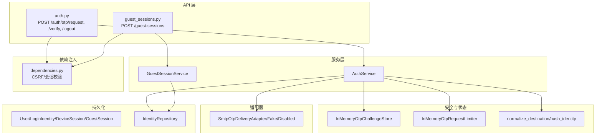
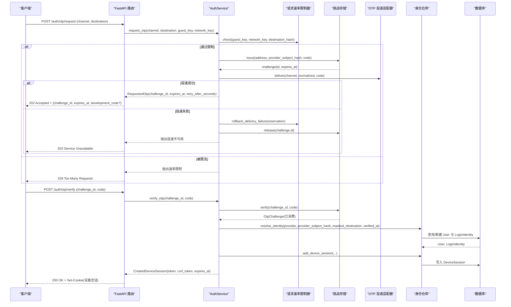
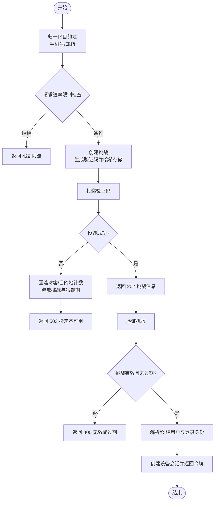
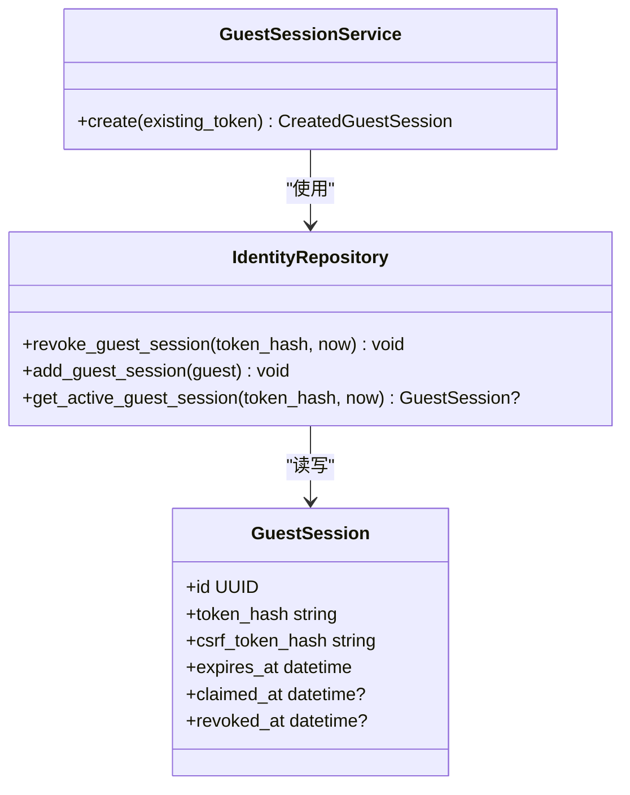
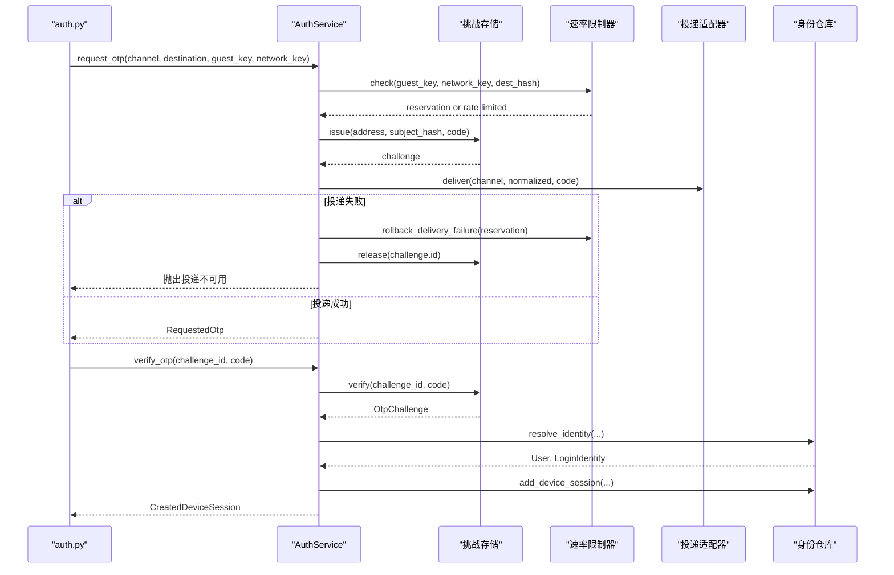
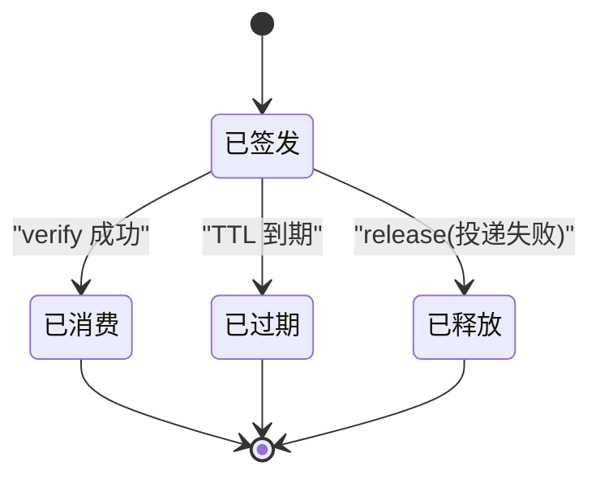
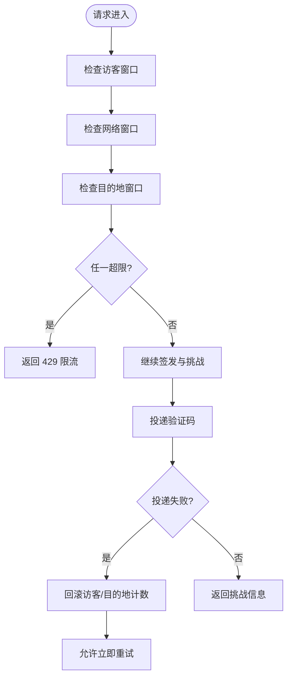
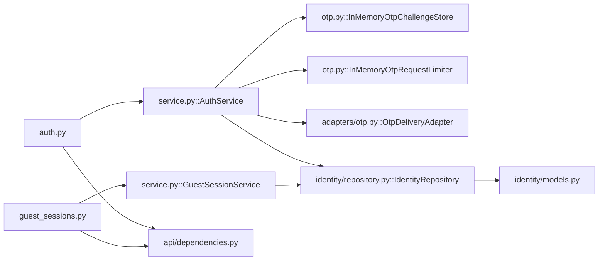

# 用户认证

<cite>
**本文引用的文件**
- [backend/app/api/auth.py](file://backend/app/api/auth.py)
- [backend/app/identity/service.py](file://backend/app/identity/service.py)
- [backend/app/identity/otp.py](file://backend/app/identity/otp.py)
- [backend/app/adapters/otp.py](file://backend/app/adapters/otp.py)
- [backend/app/api/guest_sessions.py](file://backend/app/api/guest_sessions.py)
- [backend/app/identity/models.py](file://backend/app/identity/models.py)
- [backend/app/identity/repository.py](file://backend/app/identity/repository.py)
- [backend/app/api/dependencies.py](file://backend/app/api/dependencies.py)
- [backend/app/config.py](file://backend/app/config.py)
- [backend/tests/test_auth.py](file://backend/tests/test_auth.py)
- [backend/tests/test_guest_sessions.py](file://backend/tests/test_guest_sessions.py)
</cite>

## 目录
1. [简介](#简介)
2. [项目结构](#项目结构)
3. [核心组件](#核心组件)
4. [架构总览](#架构总览)
5. [详细组件分析](#详细组件分析)
6. [依赖关系分析](#依赖关系分析)
7. [性能与扩展性](#性能与扩展性)
8. [故障排查指南](#故障排查指南)
9. [结论](#结论)
10. [附录：API 调用示例与集成要点](#附录api-调用示例与集成要点)

## 简介
本文件面向“明理”后端的用户认证子系统，聚焦以下目标：
- 手机号 OTP 登录与邮箱 OTP 登录的完整流程：验证码生成、发送、校验。
- GuestSessionService 的工作机制：访客会话创建、管理与过期处理。
- AuthService 的核心方法 request_otp 与 verify_otp 的实现逻辑。
- OTP 挑战（challenge）存储机制：生命周期管理、防重放保护。
- 速率限制机制：防止恶意请求与暴力破解。
- 完整的认证流程图、错误处理策略与安全最佳实践。
- API 调用示例与前端集成要点。

## 项目结构
认证相关代码主要位于后端 app 目录中，按职责分层组织：
- API 层：路由定义与请求/响应转换（auth.py、guest_sessions.py）。
- 领域服务层：业务编排（AuthService、GuestSessionService）。
- 安全与状态：OTP 挑战存储、速率限制器、身份归一化与哈希（otp.py）。
- 适配器层：验证码投递（邮件 SMTP、Fake、Disabled）。
- 数据持久化：用户、会话、审计事件等模型与仓库（models.py、repository.py）。
- 依赖注入与鉴权中间件：CSRF、会话校验（dependencies.py）。
- 配置与安全约束（config.py）。

图表来源
- [backend/app/api/auth.py:44-138](file://backend/app/api/auth.py#L44-L138)
- [backend/app/api/guest_sessions.py:16-52](file://backend/app/api/guest_sessions.py#L16-L52)
- [backend/app/identity/service.py:35-191](file://backend/app/identity/service.py#L35-L191)
- [backend/app/identity/otp.py:221-304](file://backend/app/identity/otp.py#L221-L304)
- [backend/app/adapters/otp.py:57-129](file://backend/app/adapters/otp.py#L57-L129)
- [backend/app/identity/models.py:31-132](file://backend/app/identity/models.py#L31-L132)
- [backend/app/identity/repository.py:16-114](file://backend/app/identity/repository.py#L16-L114)
- [backend/app/api/dependencies.py:19-137](file://backend/app/api/dependencies.py#L19-L137)

章节来源
- [backend/app/api/auth.py:44-138](file://backend/app/api/auth.py#L44-L138)
- [backend/app/api/guest_sessions.py:16-52](file://backend/app/api/guest_sessions.py#L16-L52)
- [backend/app/identity/service.py:35-191](file://backend/app/identity/service.py#L35-L191)
- [backend/app/identity/otp.py:221-304](file://backend/app/identity/otp.py#L221-L304)
- [backend/app/adapters/otp.py:57-129](file://backend/app/adapters/otp.py#L57-L129)
- [backend/app/identity/models.py:31-132](file://backend/app/identity/models.py#L31-L132)
- [backend/app/identity/repository.py:16-114](file://backend/app/identity/repository.py#L16-L114)
- [backend/app/api/dependencies.py:19-137](file://backend/app/api/dependencies.py#L19-L137)

## 核心组件
- AuthService：负责 OTP 请求与验证的业务编排，包括地址归一化、挑战创建、速率限制、投递、身份解析与会话创建。
- GuestSessionService：负责访客会话的创建、旧会话撤销、令牌与 CSRF 令牌生成与持久化。
- InMemoryOtpChallengeStore：内存版 OTP 挑战存储，提供挑战的签发、释放、校验，含 TTL、冷却期、最大尝试次数控制。
- InMemoryOtpRequestLimiter：三层速率限制（访客、网络、目的地），支持失败回滚与窗口清理。
- OTP 投递适配器：支持 SMTP 邮件发送、测试用 Fake、生产禁用模式。
- IdentityRepository：用户、登录身份、设备会话、访客会话的数据库访问封装。
- 依赖注入与 CSRF：双重提交 CSRF 校验、访客/设备会话有效性校验。

章节来源
- [backend/app/identity/service.py:35-191](file://backend/app/identity/service.py#L35-L191)
- [backend/app/identity/otp.py:64-181](file://backend/app/identity/otp.py#L64-L181)
- [backend/app/adapters/otp.py:20-129](file://backend/app/adapters/otp.py#L20-L129)
- [backend/app/identity/repository.py:16-114](file://backend/app/identity/repository.py#L16-L114)
- [backend/app/api/dependencies.py:29-137](file://backend/app/api/dependencies.py#L29-L137)

## 架构总览
下图展示了从客户端发起 OTP 请求到完成登录并建立设备会话的整体流程，包含速率限制、挑战存储、投递与身份解析。

图表来源
- [backend/app/api/auth.py:44-138](file://backend/app/api/auth.py#L44-L138)
- [backend/app/identity/service.py:100-191](file://backend/app/identity/service.py#L100-L191)
- [backend/app/identity/otp.py:221-304](file://backend/app/identity/otp.py#L221-L304)
- [backend/app/adapters/otp.py:57-129](file://backend/app/adapters/otp.py#L57-L129)
- [backend/app/identity/repository.py:48-82](file://backend/app/identity/repository.py#L48-L82)

## 详细组件分析

### 手机号与邮箱 OTP 登录流程
- 地址归一化：
  - 手机号：仅保留数字，去除国家码前缀（如 86），校验中国大陆手机号格式，标准化为 +86 形式，并生成掩码用于展示。
  - 邮箱：大小写规范化、去除空白，生成掩码本地部分。
- 挑战创建：
  - 使用 HMAC 对 challenge_id 与 code 进行签名式哈希，避免明文存储验证码。
  - 设置 TTL、冷却期、最大尝试次数。
- 速率限制：
  - 三层限制：访客维度、网络维度（IP）、目的地维度（归一化后的地址哈希）。
  - 失败投递时回滚访客与目的地计数，但保留网络计数，防止利用供应商故障绕过 IP 限速。
- 投递：
  - 邮件通过 SMTP（STARTTLS 或 SSL）发送；测试环境可使用 Fake 记录；生产可禁用。
- 验证：
  - 校验挑战是否有效、未过期、未超过最大尝试次数。
  - 成功后标记挑战已消费，清除该目的地的冷却期记录，防止重放。
  - 解析或创建用户与登录身份，创建设备会话并返回会话令牌与 CSRF 令牌。

图表来源
- [backend/app/identity/otp.py:183-218](file://backend/app/identity/otp.py#L183-L218)
- [backend/app/identity/otp.py:221-304](file://backend/app/identity/otp.py#L221-L304)
- [backend/app/identity/service.py:100-191](file://backend/app/identity/service.py#L100-L191)
- [backend/app/adapters/otp.py:57-129](file://backend/app/adapters/otp.py#L57-L129)

章节来源
- [backend/app/identity/otp.py:183-218](file://backend/app/identity/otp.py#L183-L218)
- [backend/app/identity/otp.py:221-304](file://backend/app/identity/otp.py#L221-L304)
- [backend/app/identity/service.py:100-191](file://backend/app/identity/service.py#L100-L191)
- [backend/app/adapters/otp.py:57-129](file://backend/app/adapters/otp.py#L57-L129)

### GuestSessionService 工作机制
- 创建访客会话：
  - 若存在已有访客令牌，先撤销旧会话（标记 revoked_at）。
  - 生成不透明令牌与 CSRF 令牌，设置过期时间（默认 24 小时）。
  - 将令牌哈希与 CSRF 哈希持久化至数据库。
- 过期与撤销：
  - 通过数据库索引与查询条件确保只使用未过期、未被认领、未被撤销的会话。
- 速率限制：
  - 创建访客会话接口受网络维度速率限制保护，防止批量创建。

图表来源
- [backend/app/identity/service.py:35-58](file://backend/app/identity/service.py#L35-L58)
- [backend/app/identity/repository.py:20-46](file://backend/app/identity/repository.py#L20-L46)
- [backend/app/identity/models.py:91-110](file://backend/app/identity/models.py#L91-L110)

章节来源
- [backend/app/identity/service.py:35-58](file://backend/app/identity/service.py#L35-L58)
- [backend/app/identity/repository.py:20-46](file://backend/app/identity/repository.py#L20-L46)
- [backend/app/identity/models.py:91-110](file://backend/app/identity/models.py#L91-L110)
- [backend/app/api/guest_sessions.py:16-52](file://backend/app/api/guest_sessions.py#L16-L52)

### AuthService 核心方法
- request_otp：
  - 归一化目的地并计算身份哈希。
  - 生成验证码并通过挑战存储签发挑战。
  - 执行三层速率限制检查，必要时回滚。
  - 调用投递适配器发送验证码，失败则释放挑战与冷却期。
- verify_otp：
  - 校验挑战与验证码，成功后标记消费并清除冷却期。
  - 解析或创建用户与登录身份。
  - 创建设备会话，返回会话令牌与 CSRF 令牌。

图表来源
- [backend/app/identity/service.py:100-191](file://backend/app/identity/service.py#L100-L191)
- [backend/app/identity/otp.py:221-304](file://backend/app/identity/otp.py#L221-L304)
- [backend/app/adapters/otp.py:57-129](file://backend/app/adapters/otp.py#L57-L129)
- [backend/app/identity/repository.py:48-82](file://backend/app/identity/repository.py#L48-L82)

章节来源
- [backend/app/identity/service.py:100-191](file://backend/app/identity/service.py#L100-L191)
- [backend/app/identity/otp.py:221-304](file://backend/app/identity/otp.py#L221-L304)
- [backend/app/adapters/otp.py:57-129](file://backend/app/adapters/otp.py#L57-L129)
- [backend/app/identity/repository.py:48-82](file://backend/app/identity/repository.py#L48-L82)

### OTP 挑战存储机制与防重放
- 挑战对象包含：唯一 ID、地址信息、提供者主体哈希、验证码哈希、创建与过期时间、尝试次数、消费时间。
- 签发阶段：
  - 检查同一目的地的冷却期，避免短时间内重复签发。
  - 生成挑战 ID 与验证码哈希，设置 TTL。
- 验证阶段：
  - 检查挑战是否存在、未过期、未消费、未超过最大尝试次数。
  - 使用 HMAC 比较验证码哈希，防止侧信道攻击。
  - 成功后标记消费时间，并清除该目的地的冷却期记录，防止重放。
- 释放阶段：
  - 投递失败时释放挑战与冷却期，保证重试立即可用。

图表来源
- [backend/app/identity/otp.py:221-304](file://backend/app/identity/otp.py#L221-L304)

章节来源
- [backend/app/identity/otp.py:221-304](file://backend/app/identity/otp.py#L221-L304)

### 速率限制机制
- 三层限制：
  - 访客维度：基于访客会话键，防止单访客频繁请求。
  - 网络维度：基于客户端 IP（考虑可信代理），防止同一 IP 滥用。
  - 目的地维度：基于归一化地址哈希，防止针对同一手机号/邮箱的轰炸。
- 失败回滚：
  - 投递失败时回滚访客与目的地计数，但保留网络计数，避免利用供应商故障绕过 IP 限速。
- 窗口清理：
  - 定期清理过期窗口，控制内存占用。

图表来源
- [backend/app/identity/otp.py:64-181](file://backend/app/identity/otp.py#L64-L181)
- [backend/app/identity/service.py:100-151](file://backend/app/identity/service.py#L100-L151)

章节来源
- [backend/app/identity/otp.py:64-181](file://backend/app/identity/otp.py#L64-L181)
- [backend/app/identity/service.py:100-151](file://backend/app/identity/service.py#L100-L151)

### 错误处理策略
- 无效目的地：返回 400，提示输入有效的手机号或邮箱。
- 速率限制：返回 429，附带重试等待时间。
- 投递不可用：返回 503，不消耗访客/目的地配额，允许立即重试。
- 验证码无效或过期：返回 400。
- 访客会话已被认领：返回 409。
- 登出：撤销设备会话，清空 Cookie，记录审计事件。

章节来源
- [backend/app/api/auth.py:69-138](file://backend/app/api/auth.py#L69-L138)
- [backend/tests/test_auth.py:144-197](file://backend/tests/test_auth.py#L144-L197)

## 依赖关系分析
- API 路由依赖服务层与依赖注入模块，实现请求校验与会话管理。
- 服务层依赖挑战存储、速率限制器、投递适配器与身份仓库。
- 身份仓库依赖数据库模型，提供用户、会话、审计事件的 CRUD。
- 配置模块提供安全约束与环境变量加载，确保生产环境安全。

图表来源
- [backend/app/api/auth.py:44-138](file://backend/app/api/auth.py#L44-L138)
- [backend/app/api/guest_sessions.py:16-52](file://backend/app/api/guest_sessions.py#L16-L52)
- [backend/app/identity/service.py:35-191](file://backend/app/identity/service.py#L35-L191)
- [backend/app/identity/otp.py:64-181](file://backend/app/identity/otp.py#L64-L181)
- [backend/app/adapters/otp.py:20-129](file://backend/app/adapters/otp.py#L20-L129)
- [backend/app/identity/repository.py:16-114](file://backend/app/identity/repository.py#L16-L114)
- [backend/app/identity/models.py:31-132](file://backend/app/identity/models.py#L31-L132)
- [backend/app/api/dependencies.py:19-137](file://backend/app/api/dependencies.py#L19-L137)

章节来源
- [backend/app/api/auth.py:44-138](file://backend/app/api/auth.py#L44-L138)
- [backend/app/api/guest_sessions.py:16-52](file://backend/app/api/guest_sessions.py#L16-L52)
- [backend/app/identity/service.py:35-191](file://backend/app/identity/service.py#L35-L191)
- [backend/app/identity/otp.py:64-181](file://backend/app/identity/otp.py#L64-L181)
- [backend/app/adapters/otp.py:20-129](file://backend/app/adapters/otp.py#L20-L129)
- [backend/app/identity/repository.py:16-114](file://backend/app/identity/repository.py#L16-L114)
- [backend/app/identity/models.py:31-132](file://backend/app/identity/models.py#L31-L132)
- [backend/app/api/dependencies.py:19-137](file://backend/app/api/dependencies.py#L19-L137)

## 性能与扩展性
- 挑战存储与速率限制器当前为内存实现，适合单机与测试；生产需替换为 Redis 等分布式存储以支持多实例与高并发。
- 速率限制窗口与上限可通过配置调整，平衡用户体验与安全。
- 投递适配器可插拔，便于接入短信或其他渠道。
- 设备会话与访客会话均使用哈希存储，降低泄露风险；Cookie 设置 HttpOnly、Secure、SameSite 提升安全性。

[本节为通用指导，无需具体文件引用]

## 故障排查指南
- 429 限流：
  - 检查访客、网络、目的地三个维度的限制是否触发。
  - 确认请求频率与窗口配置是否符合预期。
- 503 投递不可用：
  - 检查 SMTP 配置与服务器可达性。
  - 确认生产环境是否启用了禁用模式或未配置持久化挑战存储。
- 400 验证码无效或过期：
  - 检查挑战是否已过期或被消费。
  - 确认验证码是否正确输入。
- 409 访客会话已被认领：
  - 检查是否已在其他会话中认领该访客会话。
- 401 未认证：
  - 检查设备会话 Cookie 是否有效且未过期。
- 403 CSRF 校验失败：
  - 确认请求头携带正确的 CSRF Token，且与 Cookie 中的值一致。

章节来源
- [backend/tests/test_auth.py:161-197](file://backend/tests/test_auth.py#L161-L197)
- [backend/tests/test_guest_sessions.py:78-104](file://backend/tests/test_guest_sessions.py#L78-L104)
- [backend/app/api/dependencies.py:29-137](file://backend/app/api/dependencies.py#L29-L137)

## 结论
该认证系统通过严格的地址归一化、安全的挑战存储、多层速率限制与可插拔投递适配器，实现了手机号与邮箱 OTP 登录的安全与可扩展性。访客会话与设备会话的生命周期管理确保了用户体验与安全性。生产环境需关注持久化挑战存储与 SMTP 配置的可靠性，并遵循安全最佳实践。

[本节为总结，无需具体文件引用]

## 附录：API 调用示例与集成要点
- 创建访客会话：
  - 方法：POST /api/v1/guest-sessions
  - 响应：包含 expires_at 与 csrf_token，同时设置 mingli_guest 与 mingli_csrf Cookie。
- 请求 OTP：
  - 方法：POST /api/v1/auth/otp/request
  - 请求体：{ channel: "phone"|"email", destination: "手机号或邮箱" }
  - 响应：202 Accepted，包含 challenge_id、expires_at、retry_after_seconds，开发环境可能返回 development_code。
  - 注意：需在请求头携带 X-CSRF-Token，值为 Cookie 中的 mingli_csrf。
- 验证 OTP：
  - 方法：POST /api/v1/auth/otp/verify
  - 请求体：{ challenge_id, code }
  - 响应：200 OK，包含 user_id、session_id、expires_at、csrf_token，同时设置设备会话 Cookie。
- 登出：
  - 方法：POST /api/v1/auth/logout
  - 响应：204 No Content，清空设备会话 Cookie。

集成要点：
- 前端需在每次敏感操作时携带 X-CSRF-Token，并与 Cookie 中的值保持一致。
- 在本地或测试环境可使用 Fake 投递适配器，便于调试。
- 生产环境需配置 SMTP 或替换为更可靠的投递通道，并确保挑战存储为持久化实现。
- 合理配置速率限制参数，平衡用户体验与安全。

章节来源
- [backend/tests/test_auth.py:10-50](file://backend/tests/test_auth.py#L10-L50)
- [backend/tests/test_guest_sessions.py:14-38](file://backend/tests/test_guest_sessions.py#L14-L38)
- [backend/app/api/auth.py:44-138](file://backend/app/api/auth.py#L44-L138)
- [backend/app/api/guest_sessions.py:16-52](file://backend/app/api/guest_sessions.py#L16-L52)