# 身份认证与授权

<cite>
**本文引用的文件**
- [backend/app/identity/service.py](file://backend/app/identity/service.py)
- [backend/app/api/auth.py](file://backend/app/api/auth.py)
- [backend/app/api/guest_sessions.py](file://backend/app/api/guest_sessions.py)
- [backend/app/admin/service.py](file://backend/app/admin/service.py)
- [backend/app/api/admin.py](file://backend/app/api/admin.py)
- [backend/app/identity/models.py](file://backend/app/identity/models.py)
- [backend/app/admin/models.py](file://backend/app/admin/models.py)
- [backend/app/identity/cookies.py](file://backend/app/identity/cookies.py)
- [backend/app/api/dependencies.py](file://backend/app/api/dependencies.py)
- [backend/app/adapters/otp.py](file://backend/app/adapters/otp.py)
- [backend/app/identity/otp.py](file://backend/app/identity/otp.py)
- [backend/app/config.py](file://backend/app/config.py)
- [backend/app/admin/passwords.py](file://backend/app/admin/passwords.py)
</cite>

## 目录
1. [简介](#简介)
2. [项目结构](#项目结构)
3. [核心组件](#核心组件)
4. [架构总览](#架构总览)
5. [详细组件分析](#详细组件分析)
6. [依赖关系分析](#依赖关系分析)
7. [性能考量](#性能考量)
8. [故障排查指南](#故障排查指南)
9. [结论](#结论)
10. [附录](#附录)

## 简介
本文件系统性阐述身份认证与授权体系，覆盖用户认证流程（手机号OTP登录、邮箱OTP登录）、访客会话管理、设备会话与会话存储、Cookie与CSRF策略、管理员认证与会话、权限控制思路与安全机制（密码加密、令牌签名、CSRF防护），以及OTP服务集成（短信/邮件发送与验证码校验）。文档同时提供流程图、序列图与类图，帮助读者快速理解端到端的数据流与控制流。

## 项目结构
后端采用模块化分层：API路由层负责HTTP接口与参数校验；服务层封装业务逻辑；仓储层对接数据库；适配器层抽象外部服务（如OTP投递）；配置集中管理安全策略与运行时开关。

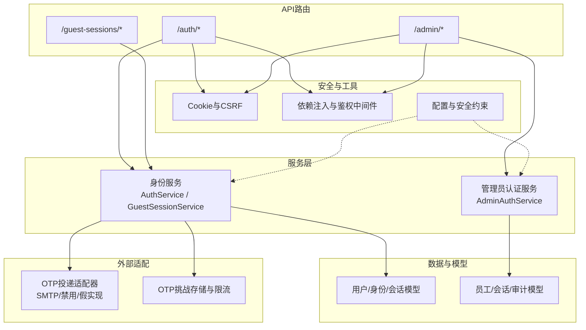

图表来源
- [backend/app/api/auth.py:44-138](file://backend/app/api/auth.py#L44-L138)
- [backend/app/api/guest_sessions.py:16-52](file://backend/app/api/guest_sessions.py#L16-L52)
- [backend/app/api/admin.py:103-145](file://backend/app/api/admin.py#L103-L145)
- [backend/app/identity/service.py:35-191](file://backend/app/identity/service.py#L35-L191)
- [backend/app/admin/service.py:33-101](file://backend/app/admin/service.py#L33-L101)
- [backend/app/identity/cookies.py:12-102](file://backend/app/identity/cookies.py#L12-L102)
- [backend/app/api/dependencies.py:19-137](file://backend/app/api/dependencies.py#L19-L137)
- [backend/app/adapters/otp.py:20-129](file://backend/app/adapters/otp.py#L20-L129)
- [backend/app/identity/otp.py:64-304](file://backend/app/identity/otp.py#L64-L304)
- [backend/app/config.py:62-335](file://backend/app/config.py#L62-L335)

章节来源
- [backend/app/api/auth.py:44-138](file://backend/app/api/auth.py#L44-L138)
- [backend/app/api/guest_sessions.py:16-52](file://backend/app/api/guest_sessions.py#L16-L52)
- [backend/app/api/admin.py:103-145](file://backend/app/api/admin.py#L103-L145)
- [backend/app/identity/service.py:35-191](file://backend/app/identity/service.py#L35-L191)
- [backend/app/admin/service.py:33-101](file://backend/app/admin/service.py#L33-L101)
- [backend/app/identity/cookies.py:12-102](file://backend/app/identity/cookies.py#L12-L102)
- [backend/app/api/dependencies.py:19-137](file://backend/app/api/dependencies.py#L19-L137)
- [backend/app/adapters/otp.py:20-129](file://backend/app/adapters/otp.py#L20-L129)
- [backend/app/identity/otp.py:64-304](file://backend/app/identity/otp.py#L64-L304)
- [backend/app/config.py:62-335](file://backend/app/config.py#L62-L335)

## 核心组件
- 用户认证服务：处理手机号/邮箱OTP请求与验证，创建设备会话并记录审计事件。
- 访客会话服务：为未登录用户创建短期访客会话，支持后续升级为正式账户。
- 管理员认证服务：基于邮箱+密码的后台登录，创建员工会话并审计。
- 安全与鉴权：统一的Cookie设置、CSRF双提交校验、会话有效性检查。
- OTP适配与存储：统一抽象短信/邮件投递，内存挑战存储与多层限流。
- 配置与安全策略：生产环境强制安全Cookie、禁止不安全OTP模式、密钥与路径白名单等。

章节来源
- [backend/app/identity/service.py:35-191](file://backend/app/identity/service.py#L35-L191)
- [backend/app/api/auth.py:44-138](file://backend/app/api/auth.py#L44-L138)
- [backend/app/api/guest_sessions.py:16-52](file://backend/app/api/guest_sessions.py#L16-L52)
- [backend/app/admin/service.py:33-101](file://backend/app/admin/service.py#L33-L101)
- [backend/app/api/dependencies.py:19-137](file://backend/app/api/dependencies.py#L19-L137)
- [backend/app/adapters/otp.py:20-129](file://backend/app/adapters/otp.py#L20-L129)
- [backend/app/identity/otp.py:64-304](file://backend/app/identity/otp.py#L64-L304)
- [backend/app/config.py:62-335](file://backend/app/config.py#L62-L335)

## 架构总览
系统通过API路由接收请求，调用服务层完成认证与会话管理，使用仓储层持久化会话与审计信息，并通过适配器与外部OTP服务交互。所有敏感操作均受CSRF保护，会话令牌以哈希形式存储，Cookie遵循安全策略。

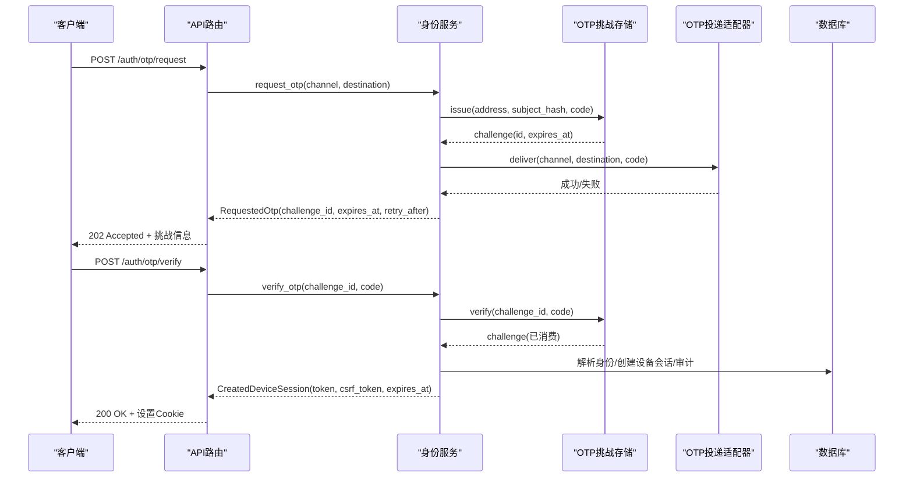

图表来源
- [backend/app/api/auth.py:44-138](file://backend/app/api/auth.py#L44-L138)
- [backend/app/identity/service.py:100-191](file://backend/app/identity/service.py#L100-L191)
- [backend/app/identity/otp.py:221-304](file://backend/app/identity/otp.py#L221-L304)
- [backend/app/adapters/otp.py:57-129](file://backend/app/adapters/otp.py#L57-L129)

## 详细组件分析

### 用户认证流程（手机号/邮箱OTP）
- 请求验证码：校验目的地格式，生成一次性挑战与验证码，进行多层限流（访客、网络、目的地），投递成功后返回挑战ID与过期时间。
- 验证验证码：校验挑战是否有效且未被消耗，解析或创建身份绑定，创建设备会话，写入审计事件，设置设备Cookie。
- 登出：撤销设备会话并清理Cookie。

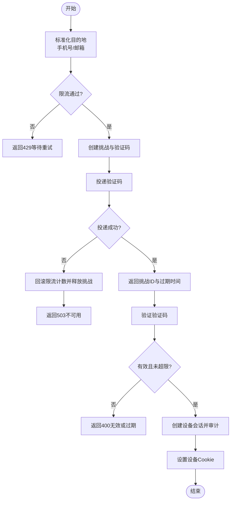

图表来源
- [backend/app/identity/service.py:100-191](file://backend/app/identity/service.py#L100-L191)
- [backend/app/identity/otp.py:64-181](file://backend/app/identity/otp.py#L64-L181)
- [backend/app/adapters/otp.py:57-129](file://backend/app/adapters/otp.py#L57-L129)
- [backend/app/api/auth.py:44-138](file://backend/app/api/auth.py#L44-L138)

章节来源
- [backend/app/identity/service.py:100-191](file://backend/app/identity/service.py#L100-L191)
- [backend/app/api/auth.py:44-138](file://backend/app/api/auth.py#L44-L138)
- [backend/app/identity/otp.py:64-304](file://backend/app/identity/otp.py#L64-L304)
- [backend/app/adapters/otp.py:57-129](file://backend/app/adapters/otp.py#L57-L129)

### 访客会话管理
- 创建访客会话：生成不透明令牌与CSRF令牌，设置短期Cookie，并在数据库中仅保存哈希值。
- 升级归属：在用户完成OTP登录后，将访客会话归属到该用户，避免重复归属冲突。
- 新会话创建会撤销旧会话，确保单点一致性。

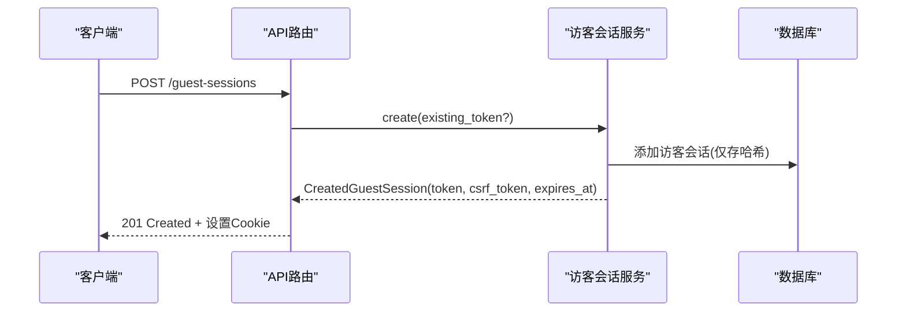

图表来源
- [backend/app/api/guest_sessions.py:16-52](file://backend/app/api/guest_sessions.py#L16-L52)
- [backend/app/identity/service.py:35-58](file://backend/app/identity/service.py#L35-L58)
- [backend/app/identity/models.py:91-111](file://backend/app/identity/models.py#L91-L111)

章节来源
- [backend/app/api/guest_sessions.py:16-52](file://backend/app/api/guest_sessions.py#L16-L52)
- [backend/app/identity/service.py:35-58](file://backend/app/identity/service.py#L35-L58)
- [backend/app/identity/models.py:91-111](file://backend/app/identity/models.py#L91-L111)

### 会话管理机制（存储、Cookie与过期）
- 存储策略：会话令牌与CSRF令牌均以SHA-256哈希形式持久化，避免明文泄露。
- Cookie策略：会话Cookie与访客Cookie设置为HttpOnly、SameSite=Lax，可选Secure；CSRF Cookie可被前端读取用于双提交。
- 过期策略：设备会话按配置天数过期，访客会话固定24小时；登出时立即撤销并清理Cookie。

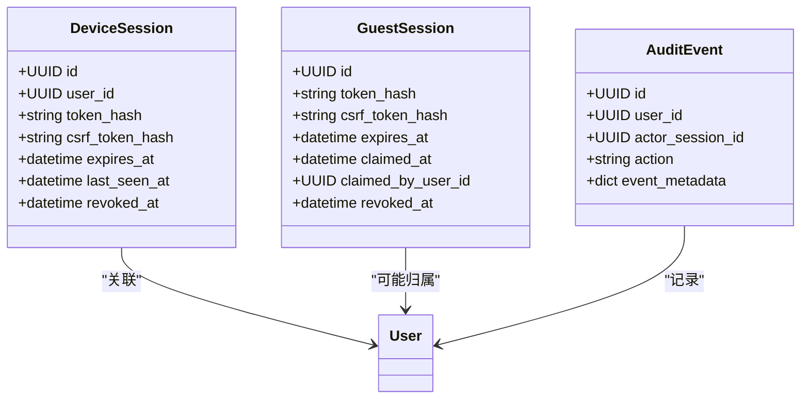

图表来源
- [backend/app/identity/models.py:31-132](file://backend/app/identity/models.py#L31-L132)
- [backend/app/identity/cookies.py:12-102](file://backend/app/identity/cookies.py#L12-L102)
- [backend/app/api/auth.py:141-160](file://backend/app/api/auth.py#L141-L160)

章节来源
- [backend/app/identity/models.py:31-132](file://backend/app/identity/models.py#L31-L132)
- [backend/app/identity/cookies.py:12-102](file://backend/app/identity/cookies.py#L12-L102)
- [backend/app/api/auth.py:141-160](file://backend/app/api/auth.py#L141-L160)

### 权限控制系统（RBAC与细粒度验证）
- 角色基础：管理员员工表包含角色字段，登录成功后返回角色信息，可用于前端展示与初步访问控制。
- 资源级保护：当前API通过会话与CSRF保护关键写操作；细粒度权限（如按资源ID校验所有者）可通过依赖注入的Owner对象扩展。
- 建议实践：在控制器层引入基于角色的策略检查器，结合资源所有权校验实现最小权限原则。

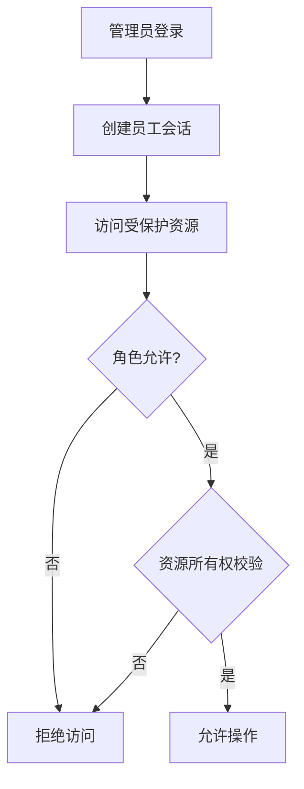

图表来源
- [backend/app/admin/service.py:49-89](file://backend/app/admin/service.py#L49-L89)
- [backend/app/api/admin.py:103-145](file://backend/app/api/admin.py#L103-L145)
- [backend/app/api/dependencies.py:87-130](file://backend/app/api/dependencies.py#L87-L130)

章节来源
- [backend/app/admin/service.py:49-89](file://backend/app/admin/service.py#L49-L89)
- [backend/app/api/admin.py:103-145](file://backend/app/api/admin.py#L103-L145)
- [backend/app/api/dependencies.py:87-130](file://backend/app/api/dependencies.py#L87-L130)

### 管理员认证系统（StaffSession与后台访问控制）
- 登录流程：校验邮箱与密码，支持本地测试环境的引导式超级管理员创建；创建员工会话并审计。
- 访问控制：所有后台接口需携带员工会话Cookie与CSRF头；登出时撤销会话并清理Cookie。
- 速率限制：对登录尝试按邮箱维度限流，防止暴力破解。

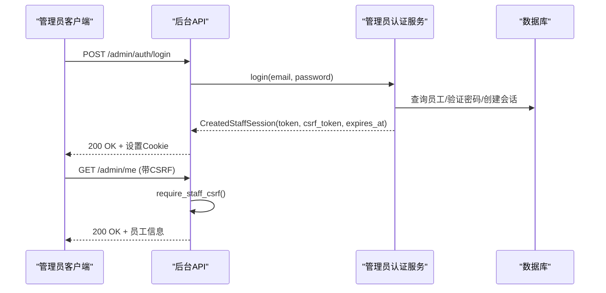

图表来源
- [backend/app/api/admin.py:103-145](file://backend/app/api/admin.py#L103-L145)
- [backend/app/admin/service.py:49-101](file://backend/app/admin/service.py#L49-L101)
- [backend/app/admin/models.py:17-81](file://backend/app/admin/models.py#L17-L81)

章节来源
- [backend/app/api/admin.py:103-145](file://backend/app/api/admin.py#L103-L145)
- [backend/app/admin/service.py:49-101](file://backend/app/admin/service.py#L49-L101)
- [backend/app/admin/models.py:17-81](file://backend/app/admin/models.py#L17-L81)

### 安全机制（密码加密、令牌签名、CSRF防护）
- 密码加密：管理员密码使用scrypt加盐哈希，验证时使用常量时间比较。
- 令牌签名：OTP验证码与挑战ID组合后使用HMAC-SHA256签名，防止篡改。
- CSRF防护：双提交模式（Cookie中的CSRF令牌与请求头x-csrf-token一致），并对会话中的CSRF哈希进行比对。

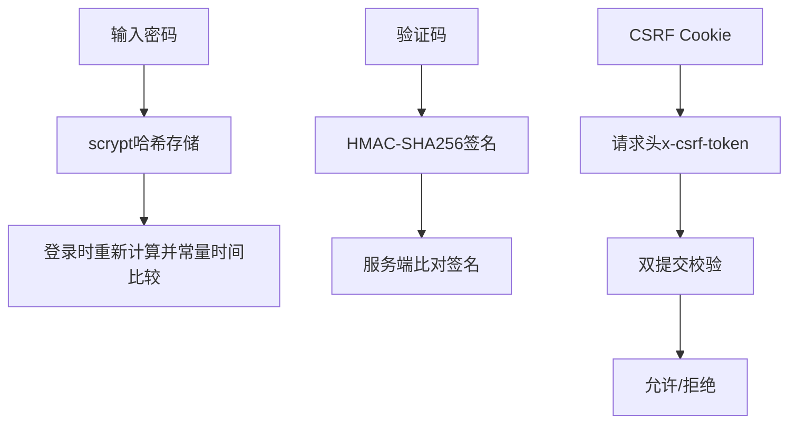

图表来源
- [backend/app/admin/passwords.py:16-55](file://backend/app/admin/passwords.py#L16-L55)
- [backend/app/identity/otp.py:211-218](file://backend/app/identity/otp.py#L211-L218)
- [backend/app/api/dependencies.py:29-54](file://backend/app/api/dependencies.py#L29-L54)
- [backend/app/api/admin.py:87-100](file://backend/app/api/admin.py#L87-L100)

章节来源
- [backend/app/admin/passwords.py:16-55](file://backend/app/admin/passwords.py#L16-L55)
- [backend/app/identity/otp.py:211-218](file://backend/app/identity/otp.py#L211-L218)
- [backend/app/api/dependencies.py:29-54](file://backend/app/api/dependencies.py#L29-L54)
- [backend/app/api/admin.py:87-100](file://backend/app/api/admin.py#L87-L100)

### OTP服务集成（短信、邮件与验证码验证）
- 渠道抽象：统一OtpDeliveryAdapter协议，支持邮件SMTP、禁用模式与假实现。
- 邮件发送：使用标准库smtplib，强制TLS/STARTTLS，凭据保存在SecretStr中，异常统一转换为投递不可用。
- 验证码验证：内存挑战存储支持TTL、冷却期与最大尝试次数，失败时释放挑战并回滚限流计数。

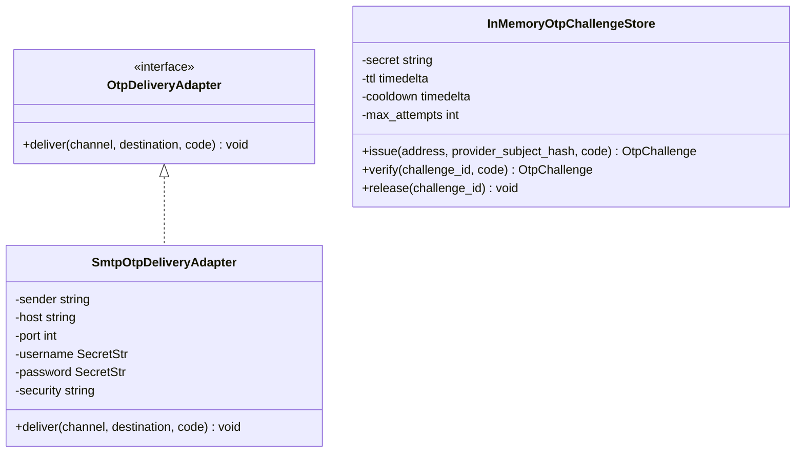

图表来源
- [backend/app/adapters/otp.py:20-129](file://backend/app/adapters/otp.py#L20-L129)
- [backend/app/identity/otp.py:221-304](file://backend/app/identity/otp.py#L221-L304)

章节来源
- [backend/app/adapters/otp.py:20-129](file://backend/app/adapters/otp.py#L20-L129)
- [backend/app/identity/otp.py:221-304](file://backend/app/identity/otp.py#L221-L304)

## 依赖关系分析
- 低耦合设计：API路由仅依赖服务接口；服务依赖仓储与适配器；适配器可替换以实现不同投递策略。
- 安全边界：所有敏感数据（令牌、密码、内容密钥）均通过配置或环境变量注入，生产环境强制安全策略。
- 外部依赖：数据库（PostgreSQL）、SMTP服务器、可选Redis（挑战存储可扩展）。

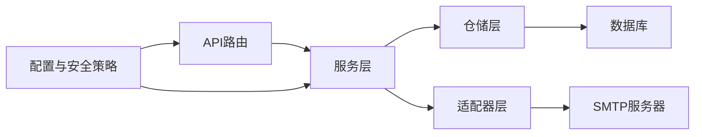

图表来源
- [backend/app/api/auth.py:44-138](file://backend/app/api/auth.py#L44-L138)
- [backend/app/identity/service.py:35-191](file://backend/app/identity/service.py#L35-L191)
- [backend/app/adapters/otp.py:20-129](file://backend/app/adapters/otp.py#L20-L129)
- [backend/app/config.py:62-335](file://backend/app/config.py#L62-L335)

章节来源
- [backend/app/api/auth.py:44-138](file://backend/app/api/auth.py#L44-L138)
- [backend/app/identity/service.py:35-191](file://backend/app/identity/service.py#L35-L191)
- [backend/app/adapters/otp.py:20-129](file://backend/app/adapters/otp.py#L20-L129)
- [backend/app/config.py:62-335](file://backend/app/config.py#L62-L335)

## 性能考量
- 限流与冷却：OTP请求与验证具备多层限流与冷却期，防止滥用与暴力破解。
- 会话刷新：设备会话每次访问更新last_seen_at，便于监控活跃会话。
- 异步I/O：OTP投递与数据库操作采用异步，提升吞吐。
- 建议优化：在生产环境将挑战存储迁移至Redis以提升并发能力；考虑会话清理任务定期回收过期会话。

[本节为通用指导，无需特定文件引用]

## 故障排查指南
- 验证码不可用：检查OTP适配器配置与SMTP连接；确认挑战存储可用；查看投递失败日志。
- CSRF失败：确认前端正确设置x-csrf-token请求头并与Cookie一致；检查会话是否过期或被撤销。
- 登录失败：核对管理员邮箱与密码；检查员工状态是否为active；查看登录限流是否触发。
- 会话失效：检查Cookie是否被浏览器策略拦截；确认设备会话未过期或被手动撤销。

章节来源
- [backend/app/adapters/otp.py:41-55](file://backend/app/adapters/otp.py#L41-L55)
- [backend/app/api/dependencies.py:29-54](file://backend/app/api/dependencies.py#L29-L54)
- [backend/app/api/admin.py:103-145](file://backend/app/api/admin.py#L103-L145)
- [backend/app/api/auth.py:141-160](file://backend/app/api/auth.py#L141-L160)

## 结论
本系统实现了健壮的认证与授权框架：通过OTP无密码登录、访客会话过渡、设备会话管理与严格的CSRF保护，保障用户数据安全；管理员认证采用强密码哈希与会话审计，满足后台管控需求；OTP适配层解耦外部服务，便于扩展与替换。生产环境通过配置强制安全策略，确保系统在真实部署下的安全性与稳定性。

[本节为总结性内容，无需特定文件引用]

## 附录

### 认证流程图（端到端）
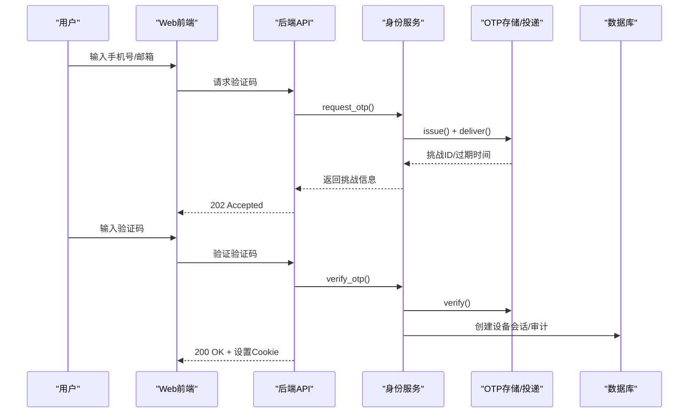

图表来源
- [backend/app/api/auth.py:44-138](file://backend/app/api/auth.py#L44-L138)
- [backend/app/identity/service.py:100-191](file://backend/app/identity/service.py#L100-L191)
- [backend/app/identity/otp.py:221-304](file://backend/app/identity/otp.py#L221-L304)

### 权限矩阵（示例）
- 访客：可创建访客会话、请求验证码、升级归属。
- 已认证用户：可访问个人资源、执行写操作（需CSRF）。
- 管理员：可登录后台、查看概览、执行管理操作（需CSRF与角色校验）。

[本节为概念性说明，无需特定文件引用]

### 安全最佳实践
- 生产环境启用Secure Cookie与强制HTTPS。
- 使用不可预测的标识哈希密钥与内容加密密钥，避免复用。
- 限制OTP投递渠道与频率，防范滥用。
- 对所有写操作实施CSRF双提交校验。
- 定期清理过期会话与审计日志。

[本节为通用指导，无需特定文件引用]