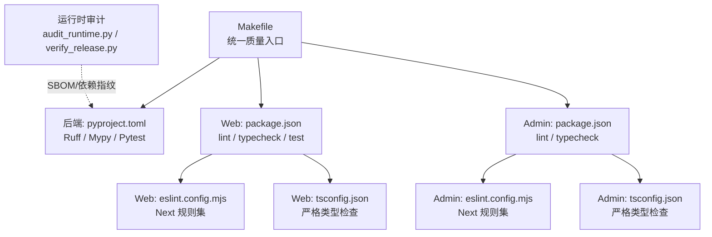
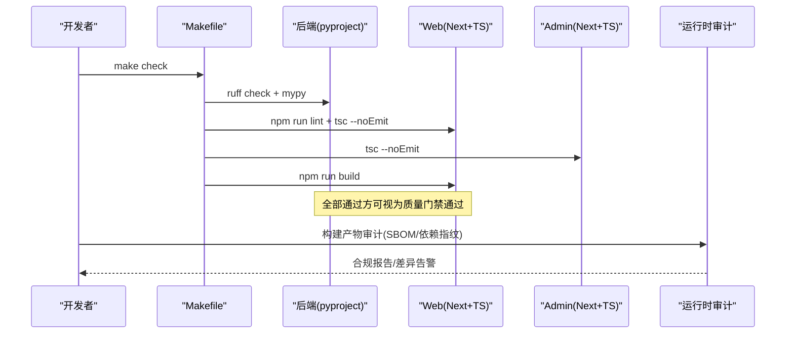
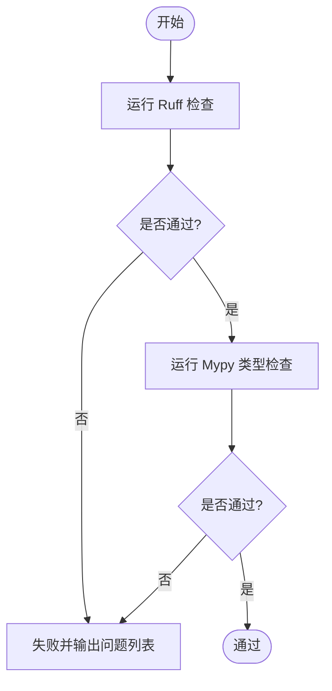
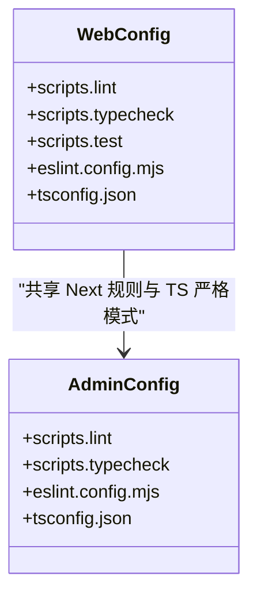
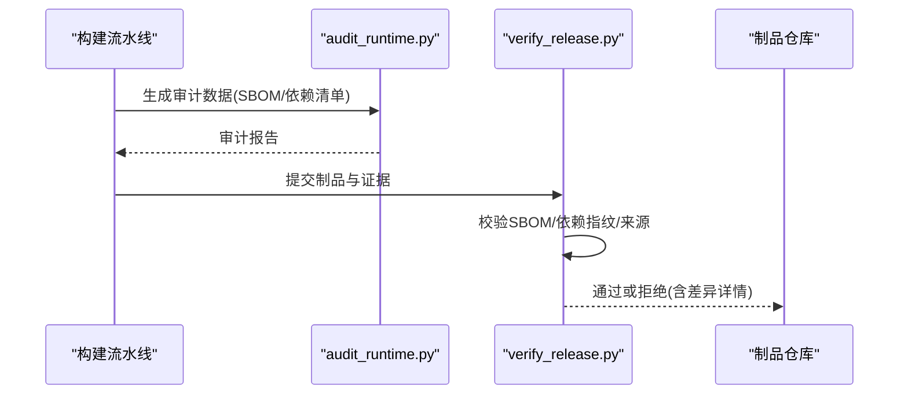
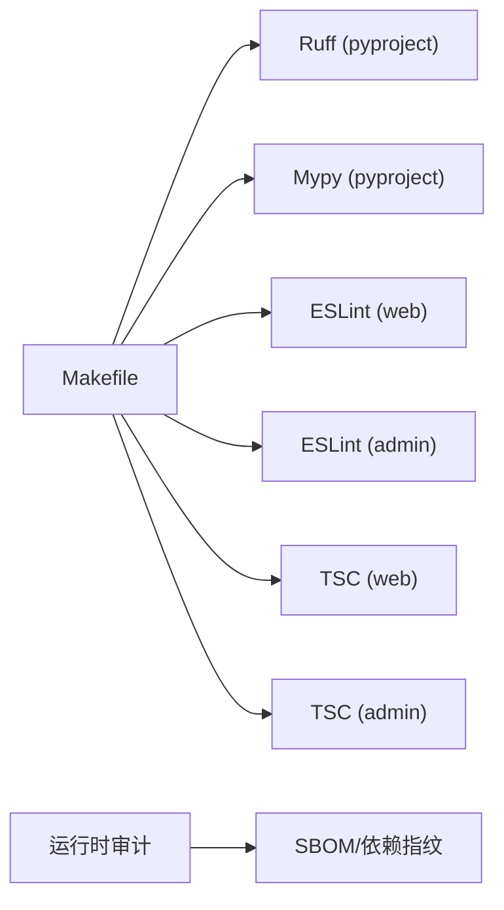

# 代码质量

<cite>
**本文引用的文件**
- [Makefile](file://Makefile)
- [backend/pyproject.toml](file://backend/pyproject.toml)
- [web/package.json](file://web/package.json)
- [admin/package.json](file://admin/package.json)
- [web/eslint.config.mjs](file://web/eslint.config.mjs)
- [admin/eslint.config.mjs](file://admin/eslint.config.mjs)
- [web/tsconfig.json](file://web/tsconfig.json)
- [admin/tsconfig.json](file://admin/tsconfig.json)
- [infra/mingli-runtime/audit_runtime.py](file://infra/mingli-runtime/audit_runtime.py)
- [infra/mingli-runtime/verify_release.py](file://infra/mingli-runtime/verify_release.py)
</cite>

## 目录
1. [简介](#简介)
2. [项目结构](#项目结构)
3. [核心组件](#核心组件)
4. [架构总览](#架构总览)
5. [详细组件分析](#详细组件分析)
6. [依赖关系分析](#依赖关系分析)
7. [性能与内存注意事项](#性能与内存注意事项)
8. [故障排查指南](#故障排查指南)
9. [结论](#结论)
10. [附录](#附录)

## 简介
本文件面向“代码质量”主题，系统化梳理本项目在 Python 与 TypeScript/JavaScript 两端的代码质量工具链、配置与流程。内容覆盖：
- Python：Ruff 风格检查、Mypy 类型检查、安全与漏洞扫描策略（结合发布审计）
- TypeScript/JavaScript：ESLint 规则、TypeScript 类型检查、依赖安全检查
- 代码格式化：Prettier 现状与建议
- 预提交钩子：自动化建议与门禁
- 代码审查流程与标准：Pull Request 检查清单与质量门禁
- 性能分析与内存泄漏检测：方法与工具建议
- 质量报告生成与趋势分析：可落地实践

## 项目结构
本项目采用多包结构：后端使用 Python（FastAPI + SQLAlchemy），前端与管理端使用 Next.js（TypeScript）。质量相关配置集中在以下位置：
- 后端：pyproject.toml（Ruff、Mypy、Pytest）、Makefile（统一入口）
- Web 与管理端：package.json（脚本）、eslint.config.mjs（ESLint 规则）、tsconfig.json（TS 严格模式）
- 发布与运行时审计：infra/mingli-runtime 下的审计与验证脚本，用于供应链安全与产物一致性校验

**图表来源**
- [Makefile:1-47](file://Makefile#L1-L47)
- [backend/pyproject.toml:32-54](file://backend/pyproject.toml#L32-L54)
- [web/package.json:9-15](file://web/package.json#L9-L15)
- [admin/package.json:9-14](file://admin/package.json#L9-L14)
- [web/eslint.config.mjs:1-11](file://web/eslint.config.mjs#L1-L11)
- [admin/eslint.config.mjs:1-11](file://admin/eslint.config.mjs#L1-L11)
- [web/tsconfig.json:1-31](file://web/tsconfig.json#L1-L31)
- [admin/tsconfig.json:1-30](file://admin/tsconfig.json#L1-L30)

**章节来源**
- [Makefile:1-47](file://Makefile#L1-L47)
- [backend/pyproject.toml:32-54](file://backend/pyproject.toml#L32-L54)
- [web/package.json:9-15](file://web/package.json#L9-L15)
- [admin/package.json:9-14](file://admin/package.json#L9-L14)
- [web/eslint.config.mjs:1-11](file://web/eslint.config.mjs#L1-L11)
- [admin/eslint.config.mjs:1-11](file://admin/eslint.config.mjs#L1-L11)
- [web/tsconfig.json:1-31](file://web/tsconfig.json#L1-L31)
- [admin/tsconfig.json:1-30](file://admin/tsconfig.json#L1-L30)

## 核心组件
- 后端质量工具
  - Ruff：代码风格与静态检查（选择规则集、忽略项、目标版本、行宽）
  - Mypy：严格类型检查（启用插件、作用域）
  - Pytest：测试执行（异步模式、路径）
- Web/管理端质量工具
  - ESLint：基于 Next 官方规则集（核心 Web Vitals + TypeScript）
  - TypeScript：严格编译选项（strict、noEmit、isolatedModules 等）
  - 脚本：lint、typecheck、test（Vitest）
- 统一入口
  - Makefile：封装 install、test、check、build、migrate、worker-once 等命令，保证本地与 CI 一致

**章节来源**
- [backend/pyproject.toml:19-54](file://backend/pyproject.toml#L19-L54)
- [web/package.json:9-15](file://web/package.json#L9-L15)
- [admin/package.json:9-14](file://admin/package.json#L9-L14)
- [Makefile:13-47](file://Makefile#L13-L47)

## 架构总览
下图展示了从开发者触发到质量门禁的完整链路：Makefile 作为统一入口，分别驱动后端与前端的 lint/typecheck/test；同时通过运行时审计保障依赖与制品安全。

**图表来源**
- [Makefile:21-40](file://Makefile#L21-L40)
- [backend/pyproject.toml:38-54](file://backend/pyproject.toml#L38-L54)
- [web/package.json:9-15](file://web/package.json#L9-L15)
- [admin/package.json:9-14](file://admin/package.json#L9-L14)
- [infra/mingli-runtime/audit_runtime.py:145-175](file://infra/mingli-runtime/audit_runtime.py#L145-L175)
- [infra/mingli-runtime/verify_release.py:1754-1797](file://infra/mingli-runtime/verify_release.py#L1754-L1797)

## 详细组件分析

### Python 代码质量：Ruff 与 Mypy
- Ruff
  - 目标版本与行宽：锁定 py312，行宽 100
  - 规则集：选择 E/F/I/UP/B/SIM/ASYNC，针对 FastAPI 注入场景忽略特定规则
  - 作用域：app、worker、tests、contract tests
- Mypy
  - 严格模式：开启 strict，启用 pydantic 插件
  - 作用域：app、worker
- 集成方式
  - Makefile 将 ruff check 与 mypy 纳入 backend-check，确保类型与风格双重门禁

**图表来源**
- [backend/pyproject.toml:38-54](file://backend/pyproject.toml#L38-L54)
- [Makefile:21-23](file://Makefile#L21-L23)

**章节来源**
- [backend/pyproject.toml:38-54](file://backend/pyproject.toml#L38-L54)
- [Makefile:21-23](file://Makefile#L21-L23)

### TypeScript/JavaScript 代码质量：ESLint 与 TSC
- ESLint
  - 使用 Next 官方规则集：core-web-vitals + typescript
  - 忽略构建产物与类型声明文件
- TypeScript
  - 严格模式：strict、noEmit、isolatedModules
  - 模块解析：bundler，支持 JSON 模块
  - 路径别名：@/* -> src/*
- 脚本
  - web/admin：lint、typecheck、test（web 还包含 Vitest）

**图表来源**
- [web/package.json:9-15](file://web/package.json#L9-L15)
- [admin/package.json:9-14](file://admin/package.json#L9-L14)
- [web/eslint.config.mjs:1-11](file://web/eslint.config.mjs#L1-L11)
- [admin/eslint.config.mjs:1-11](file://admin/eslint.config.mjs#L1-L11)
- [web/tsconfig.json:1-31](file://web/tsconfig.json#L1-L31)
- [admin/tsconfig.json:1-30](file://admin/tsconfig.json#L1-L30)

**章节来源**
- [web/package.json:9-15](file://web/package.json#L9-L15)
- [admin/package.json:9-14](file://admin/package.json#L9-L14)
- [web/eslint.config.mjs:1-11](file://web/eslint.config.mjs#L1-L11)
- [admin/eslint.config.mjs:1-11](file://admin/eslint.config.mjs#L1-L11)
- [web/tsconfig.json:1-31](file://web/tsconfig.json#L1-L31)
- [admin/tsconfig.json:1-30](file://admin/tsconfig.json#L1-L30)

### 依赖安全与 SBOM 审计
- 运行时审计
  - 生成并校验 SBOM（CycloneDX 1.6），核对关键组件版本与唯一性
  - 校验动态依赖清单、二进制与依赖的 SHA256 指纹
  - 校验 Node/Git/系统库等基础运行时来源与版本
- 发布验证
  - 校验制品完整性、来源一致性、不可变快照
  - 对篡改进行拒绝并给出明确错误信息

**图表来源**
- [infra/mingli-runtime/audit_runtime.py:145-175](file://infra/mingli-runtime/audit_runtime.py#L145-L175)
- [infra/mingli-runtime/verify_release.py:1754-1797](file://infra/mingli-runtime/verify_release.py#L1754-L1797)
- [infra/mingli-runtime/verify_release.py:1128-1145](file://infra/mingli-runtime/verify_release.py#L1128-L1145)
- [infra/mingli-runtime/verify_release.py:1245-1272](file://infra/mingli-runtime/verify_release.py#L1245-L1272)

**章节来源**
- [infra/mingli-runtime/audit_runtime.py:145-175](file://infra/mingli-runtime/audit_runtime.py#L145-L175)
- [infra/mingli-runtime/verify_release.py:1754-1797](file://infra/mingli-runtime/verify_release.py#L1754-L1797)
- [infra/mingli-runtime/verify_release.py:1128-1145](file://infra/mingli-runtime/verify_release.py#L1128-L1145)
- [infra/mingli-runtime/verify_release.py:1245-1272](file://infra/mingli-runtime/verify_release.py#L1245-L1272)

### 代码格式化：Prettier 现状与建议
- 现状
  - 当前仓库未发现 Prettier 配置文件与依赖
  - 前端使用 Next 官方 ESLint 规则集，已具备一定格式约束能力
- 建议
  - 引入 Prettier 并与 ESLint 集成，统一团队风格
  - 在 Makefile 中新增格式化任务，并在 pre-commit 中强制运行
  - 保持与现有行宽、缩进、引号等约定一致

[本节为概念性建议，不直接分析具体文件]

### 预提交钩子与自动化门禁
- 建议的 pre-commit 阶段
  - 自动格式化（若引入 Prettier）
  - 运行 Ruff/Mypy（后端）
  - 运行 ESLint/TSC（Web/Admin）
  - 运行单元测试（pytest/Vitest）
- 与 Makefile 的关系
  - 将 make check 作为 CI 门禁，pre-commit 仅做快速反馈
- 分支保护与 PR 检查
  - 要求所有检查通过后方可合并
  - 禁止跳过检查的合并操作

[本节为流程建议，不直接分析具体文件]

### 代码审查流程与标准
- Pull Request 检查清单
  - 变更范围最小化，单一职责
  - 新增/修改逻辑需补充测试
  - 类型检查与 Lint 必须通过
  - 如涉及依赖升级，需评估安全风险与兼容性
- 质量门禁
  - 以 make check 结果为准
  - 发布前需通过运行时审计与 SBOM 校验

[本节为流程建议，不直接分析具体文件]

## 依赖关系分析
- 后端
  - Ruff 与 Mypy 由 pyproject.toml 定义，Makefile 调用 uv 执行
- 前端/管理端
  - ESLint 与 TypeScript 由 package.json 与对应配置文件管理
- 运行时安全
  - 审计脚本与验证脚本负责 SBOM 与依赖指纹校验

**图表来源**
- [Makefile:21-40](file://Makefile#L21-L40)
- [backend/pyproject.toml:38-54](file://backend/pyproject.toml#L38-L54)
- [web/package.json:9-15](file://web/package.json#L9-L15)
- [admin/package.json:9-14](file://admin/package.json#L9-L14)
- [infra/mingli-runtime/verify_release.py:1754-1797](file://infra/mingli-runtime/verify_release.py#L1754-L1797)

**章节来源**
- [Makefile:21-40](file://Makefile#L21-L40)
- [backend/pyproject.toml:38-54](file://backend/pyproject.toml#L38-L54)
- [web/package.json:9-15](file://web/package.json#L9-L15)
- [admin/package.json:9-14](file://admin/package.json#L9-L14)
- [infra/mingli-runtime/verify_release.py:1754-1797](file://infra/mingli-runtime/verify_release.py#L1754-L1797)

## 性能与内存注意事项
- 前端性能
  - 使用 Next 构建优化（生产构建已在 Makefile 中集成）
  - 关注核心 Web Vitals（ESLint 规则已启用）
- 后端性能
  - 异步数据库访问（asyncpg/SQLAlchemy asyncio）
  - Worker 独立进程，避免阻塞主服务
- 内存泄漏检测
  - 前端：浏览器性能面板、React DevTools Profiler
  - 后端：内存采样（如 tracemalloc）、长时压测观察增长趋势
- 建议
  - 在 CI 中加入性能回归基线对比（构建体积、首屏时间）
  - 对热点路径增加基准测试

[本节提供通用指导，不直接分析具体文件]

## 故障排查指南
- 常见失败点
  - Ruff/Mypy：定位具体文件与行号，按提示修复
  - ESLint/TSC：根据报错逐条处理，必要时临时放宽规则并记录原因
  - 测试失败：优先复现最小用例，补充断言
- 发布审计失败
  - 检查 SBOM 版本与组件清单是否匹配
  - 核对依赖 SHA256 是否与冻结值一致
  - 查看审计日志中的差异字段，定位被替换或新增的依赖

**章节来源**
- [infra/mingli-runtime/audit_runtime.py:145-175](file://infra/mingli-runtime/audit_runtime.py#L145-L175)
- [infra/mingli-runtime/verify_release.py:1754-1797](file://infra/mingli-runtime/verify_release.py#L1754-L1797)

## 结论
本项目已形成较为完善的质量门禁体系：后端通过 Ruff 与 Mypy 保障风格与类型安全，前端与管理端通过 ESLint 与 TypeScript 严格模式控制代码质量，Makefile 提供统一入口，运行时审计保障依赖与制品安全。建议在现有基础上引入 Prettier 统一格式化，并通过 pre-commit 与 CI 强化自动化门禁，持续产出可追溯的质量报告与趋势分析。

## 附录
- 常用命令速查
  - 安装依赖：make install
  - 运行测试：make test
  - 全量检查：make check
  - 迁移：make migrate
  - 单次 Worker：make worker-once

**章节来源**
- [Makefile:13-47](file://Makefile#L13-L47)