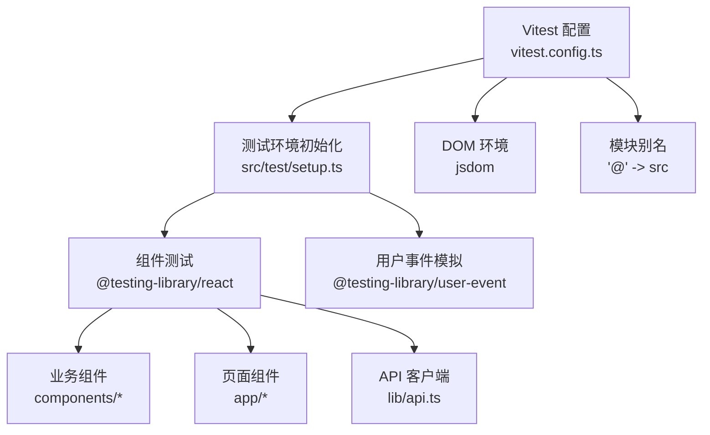
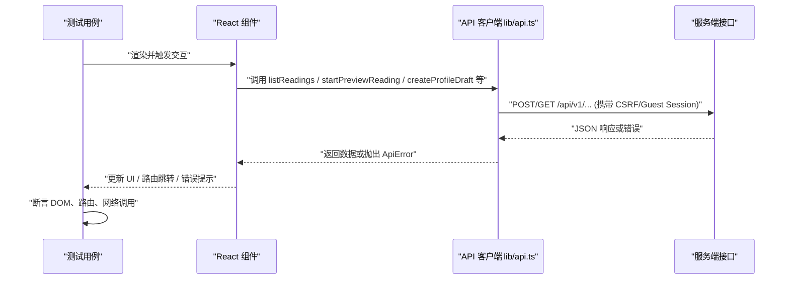
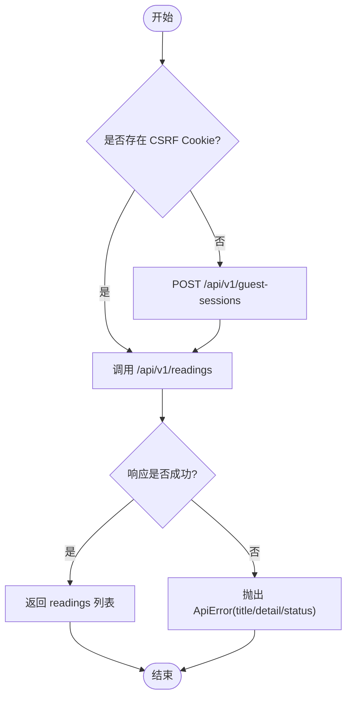
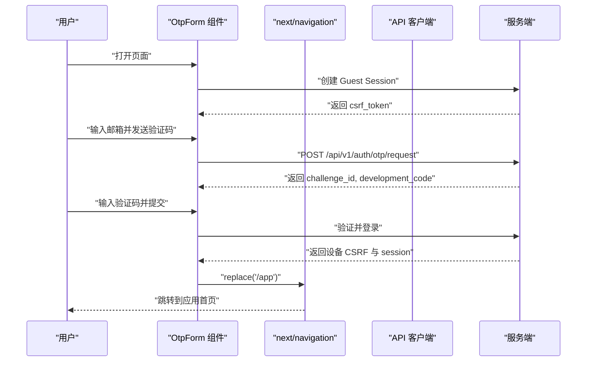
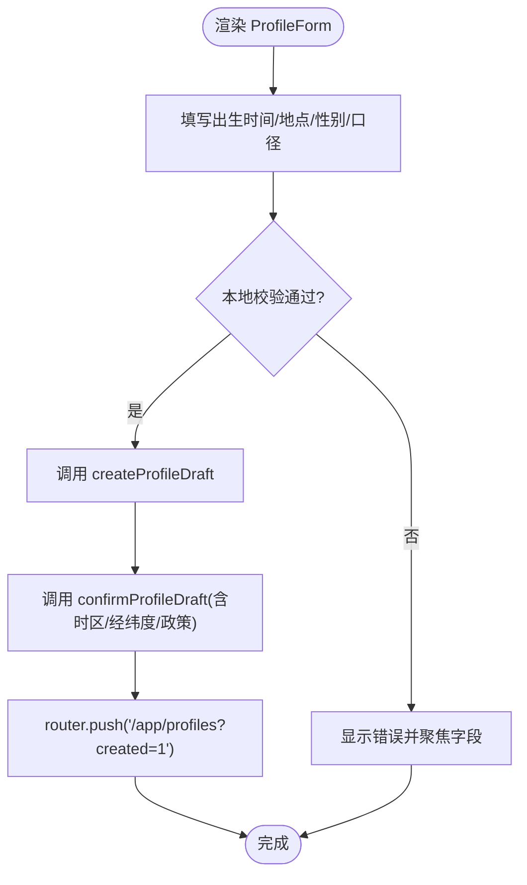
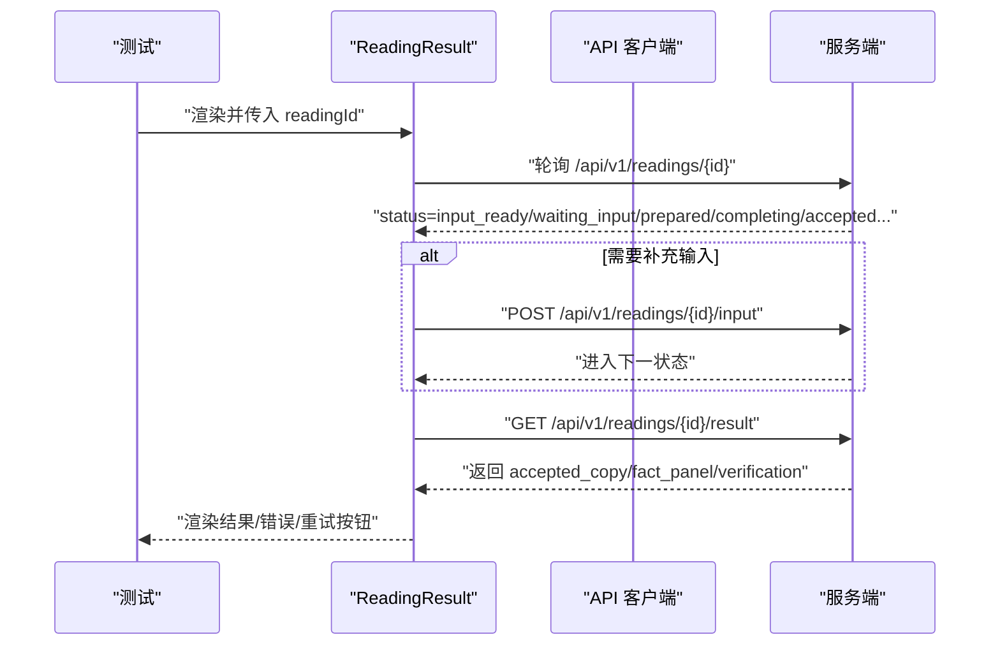
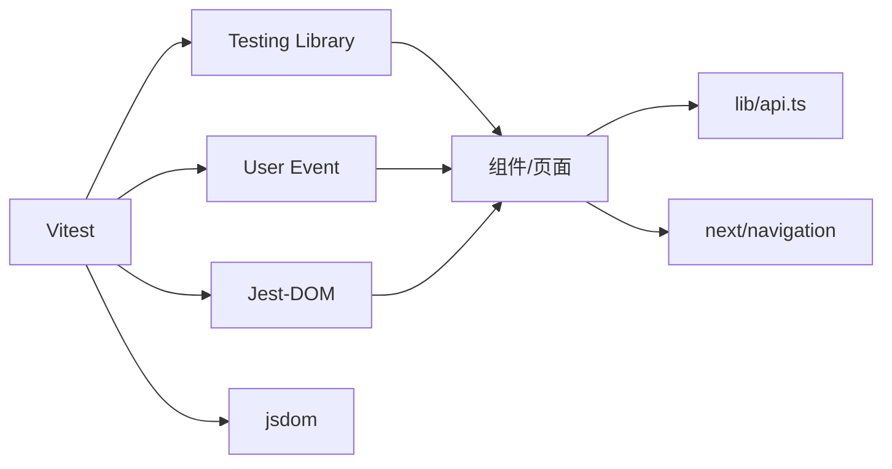

# 前端测试

<cite>
**本文引用的文件**
- [web/package.json](file://web/package.json)
- [web/vitest.config.ts](file://web/vitest.config.ts)
- [web/src/test/setup.ts](file://web/src/test/setup.ts)
- [web/src/lib/api.ts](file://web/src/lib/api.ts)
- [web/src/test/api-readings.test.ts](file://web/src/test/api-readings.test.ts)
- [web/src/test/otp-form.test.tsx](file://web/src/test/otp-form.test.tsx)
- [web/src/test/profile-form.test.tsx](file://web/src/test/profile-form.test.tsx)
- [web/src/test/bazi-flow.test.tsx](file://web/src/test/bazi-flow.test.tsx)
- [web/src/test/home.test.tsx](file://web/src/test/home.test.tsx)
- [web/src/test/reading-result.test.tsx](file://web/src/test/reading-result.test.tsx)
- [web/src/test/form-contract.test.ts](file://web/src/test/form-contract.test.ts)
- [web/src/test/app-boundaries.test.tsx](file://web/src/test/app-boundaries.test.tsx)
- [web/src/test/public-pages.test.tsx](file://web/src/test/public-pages.test.tsx)
</cite>

## 目录
1. [简介](#简介)
2. [项目结构](#项目结构)
3. [核心组件](#核心组件)
4. [架构总览](#架构总览)
5. [详细组件分析](#详细组件分析)
6. [依赖分析](#依赖分析)
7. [性能考虑](#性能考虑)
8. [故障排查指南](#故障排查指南)
9. [结论](#结论)
10. [附录](#附录)

## 简介
本文件面向基于 React Testing Library 的前端测试策略与最佳实践，结合仓库中 web 子项目的实际测试实现，系统说明：
- 组件测试的编写方法：用户交互模拟、状态变化验证、渲染结果断言。
- 异步组件测试：数据加载、错误处理、加载状态与重试流程。
- API 客户端测试：Mock 服务配置、网络请求拦截、CSRF/Guest Session 流程。
- 表单组件测试：输入校验、提交处理、错误反馈与可访问性。
- 页面级测试：路由导航、条件渲染、用户流程。
- 快照与视觉回归：在现有工程中的适配建议与注意事项。
- 覆盖率报告与持续集成：如何接入 Vitest 报告与 CI 流水线。

## 项目结构
web 子项目采用 Next.js + React 19，使用 Vitest 作为测试运行器，配合 @testing-library/react 进行组件与交互测试，jsdom 提供 DOM 环境，@testing-library/user-event 模拟真实用户操作。测试入口与全局配置集中在 vitest.config.ts 与 src/test/setup.ts。

图表来源
- [web/vitest.config.ts:1-21](file://web/vitest.config.ts#L1-L21)
- [web/src/test/setup.ts:1-2](file://web/src/test/setup.ts#L1-L2)

章节来源
- [web/package.json:9-16](file://web/package.json#L9-L16)
- [web/vitest.config.ts:1-21](file://web/vitest.config.ts#L1-L21)
- [web/src/test/setup.ts:1-2](file://web/src/test/setup.ts#L1-L2)

## 核心组件
- 测试运行器与工具链
  - Vitest：统一测试执行、Mock、断言；支持 jsdom 环境与 CSS 解析。
  - React Testing Library：以用户视角查询与断言 DOM。
  - User Event：模拟键盘、鼠标等真实交互。
  - Jest-DOM 扩展：增强 DOM 断言能力（如 toBeInTheDocument）。
- 测试组织方式
  - 按功能域拆分测试文件：表单、流程、页面、API 契约等。
  - 通过 vi.mock 隔离外部依赖（next/navigation、@/lib/api）。
  - 通过 vi.fn + vi.stubGlobal("fetch", ...) 拦截网络请求。

章节来源
- [web/package.json:31-44](file://web/package.json#L31-L44)
- [web/vitest.config.ts:6-19](file://web/vitest.config.ts#L6-L19)
- [web/src/test/setup.ts:1-2](file://web/src/test/setup.ts#L1-L2)

## 架构总览
下图展示“组件 → API 客户端 → 后端”的测试数据流与关键断言点。

图表来源
- [web/src/lib/api.ts:1-200](file://web/src/lib/api.ts#L1-L200)
- [web/src/test/api-readings.test.ts:52-119](file://web/src/test/api-readings.test.ts#L52-L119)
- [web/src/test/otp-form.test.tsx:80-148](file://web/src/test/otp-form.test.tsx#L80-L148)
- [web/src/test/bazi-flow.test.tsx:55-80](file://web/src/test/bazi-flow.test.tsx#L55-L80)
- [web/src/test/profile-form.test.tsx:148-173](file://web/src/test/profile-form.test.tsx#L148-L173)

## 详细组件分析

### API 客户端测试（读取记录列表）
- 目标：验证 CSRF Cookie 读取、Guest Session 建立、错误映射为 ApiError、顺序保持。
- 关键点：
  - 使用 vi.stubGlobal("fetch", ...) 拦截 fetch。
  - beforeEach 清理 CSRF Cookie 与 API 缓存。
  - 断言请求 URL、Headers、Credentials、响应体结构与顺序。

图表来源
- [web/src/test/api-readings.test.ts:52-119](file://web/src/test/api-readings.test.ts#L52-L119)
- [web/src/lib/api.ts:197-200](file://web/src/lib/api.ts#L197-L200)

章节来源
- [web/src/test/api-readings.test.ts:1-144](file://web/src/test/api-readings.test.ts#L1-L144)
- [web/src/lib/api.ts:1-200](file://web/src/lib/api.ts#L1-L200)

### 表单组件测试（OTP 验证码）
- 目标：引导会话建立、邮箱 OTP 发送、重发、切换邮箱、验证登录、错误恢复。
- 关键点：
  - 使用 userEvent.setup() 模拟输入与点击。
  - 通过 vi.mock("next/navigation") 拦截 useRouter.replace/push。
  - 断言焦点移动、Aria 属性、错误文案、无障碍状态区域。
  - 对非 JSON 响应进行容错，并提供“重新连接”路径。

图表来源
- [web/src/test/otp-form.test.tsx:80-148](file://web/src/test/otp-form.test.tsx#L80-L148)
- [web/src/test/otp-form.test.tsx:250-280](file://web/src/test/otp-form.test.tsx#L250-L280)
- [web/src/test/otp-form.test.tsx:282-313](file://web/src/test/otp-form.test.tsx#L282-L313)

章节来源
- [web/src/test/otp-form.test.tsx:1-418](file://web/src/test/otp-form.test.tsx#L1-L418)

### 表单组件测试（个人档案 ProfileForm）
- 目标：默认值不改变算法、时区选择可见性、IANA 时区规范、必填校验、长度限制、提交流程。
- 关键点：
  - 使用 vi.mock("@/lib/api") 注入 createProfileDraft / confirmProfileDraft。
  - 断言路由跳转参数、表单字段值、错误提示与聚焦行为。
  - 确认最终提交载荷包含 timezone、location、gender、time_basis_policy、zi_hour_policy 等。

图表来源
- [web/src/test/profile-form.test.tsx:115-173](file://web/src/test/profile-form.test.tsx#L115-L173)

章节来源
- [web/src/test/profile-form.test.tsx:1-201](file://web/src/test/profile-form.test.tsx#L1-L201)

### 流程组件测试（BaziFlow）
- 目标：白话解读范围声明、选择档案版本后发起预览解读。
- 关键点：
  - 通过 vi.mock("@/lib/api") 注入 listProfiles / startPreviewReading。
  - 断言 UI 文案、发起请求的参数（profile_version_id、dimension_ids、query）。

章节来源
- [web/src/test/bazi-flow.test.tsx:1-82](file://web/src/test/bazi-flow.test.tsx#L1-L82)

### 页面级测试（公共首页与应用首页）
- 目标：产品入口注册表一致性、导航链接正确性、内容区块存在性、无障碍地标。
- 关键点：
  - 断言 PUBLIC_PRIMARY_NAVIGATION、PUBLIC_UTILITY_NAVIGATION、PRODUCT_CAPABILITIES。
  - 检查主导航、辅助导航、核心应用导航的链接与标签。
  - 确保无多余或禁用项出现在页面上。

章节来源
- [web/src/test/home.test.tsx:13-217](file://web/src/test/home.test.tsx#L13-L217)
- [web/src/test/home.test.tsx:220-250](file://web/src/test/home.test.tsx#L220-L250)

### 页面级测试（应用边界与公共契约页）
- 目标：loading/not-found 语义标题、布局不输出隐藏注释、公共契约页信息完整。
- 关键点：
  - 断言 h1 文本、main 地标、contentinfo。
  - 断言定价页价格与次数承诺、隐私页保护数据描述、条款页免责声明。

章节来源
- [web/src/test/app-boundaries.test.tsx:8-36](file://web/src/test/app-boundaries.test.tsx#L8-L36)
- [web/src/test/public-pages.test.tsx:53-114](file://web/src/test/public-pages.test.tsx#L53-L114)

### 复杂逻辑组件测试（阅读结果 ReadingResult）
- 目标：轮询摘要、获取结果、渲染已接纳正文、结构化事实/证据/限制、六爻卦象、周期时间线、等待输入表单、错误重试。
- 关键点：
  - 使用 vi.stubGlobal("fetch", ...) 构造多阶段响应（summary → result）。
  - 断言公开事实、依据、限制、先验答案、服务器时间范围。
  - 断言未知运行时状态、终止状态的重试路径。
  - 断言 waiting_input 动态表单的必填校验、聚焦、提交载荷。

图表来源
- [web/src/test/reading-result.test.tsx:183-329](file://web/src/test/reading-result.test.tsx#L183-L329)
- [web/src/test/reading-result.test.tsx:727-800](file://web/src/test/reading-result.test.tsx#L727-L800)

章节来源
- [web/src/test/reading-result.test.tsx:1-800](file://web/src/test/reading-result.test.tsx#L1-L800)

### 样式与可访问性契约测试（form-contract）
- 目标：统一表单控件原语、禁止胶囊按钮、禁用原因可见、运动动画受限、减少动效支持。
- 关键点：
  - 读取 CSS 文件并正则匹配规则，断言最小高度、颜色变量、圆角、过渡属性。
  - 断言各表单组件均消费 form-controls 提供的 field/input/error/hint/actions。

章节来源
- [web/src/test/form-contract.test.ts:31-192](file://web/src/test/form-contract.test.ts#L31-L192)

## 依赖分析
- 测试框架与库
  - Vitest：测试运行、Mock、断言。
  - @testing-library/react：组件渲染与查询。
  - @testing-library/user-event：用户交互模拟。
  - @testing-library/jest-dom：DOM 断言扩展。
  - jsdom：浏览器 DOM 环境。
- 模块别名
  - 通过 vitest.config.ts 将 "@" 指向 src，便于测试中导入组件与库。
- 外部依赖隔离
  - next/navigation：通过 vi.mock 替换 useRouter/usePathname，避免真实路由副作用。
  - @/lib/api：通过 vi.mock 注入 API 函数，控制网络行为与返回值。

图表来源
- [web/package.json:31-44](file://web/package.json#L31-L44)
- [web/vitest.config.ts:6-19](file://web/vitest.config.ts#L6-L19)

章节来源
- [web/package.json:31-44](file://web/package.json#L31-L44)
- [web/vitest.config.ts:6-19](file://web/vitest.config.ts#L6-L19)

## 性能考虑
- 使用 vi.hoisted 与 vi.fn().mockReset 在 beforeEach 中重置 Mock，避免跨用例污染。
- 仅 Mock 必要的外部依赖（next/navigation、@/lib/api），减少不必要的开销。
- 对长轮询场景（如阅读结果）使用 waitFor 与精确断言，避免过度等待。
- 利用 CSS 契约测试快速发现样式退化，降低视觉回归成本。

[本节为通用指导，无需特定文件引用]

## 故障排查指南
- 常见问题定位
  - 网络请求未发出：检查 vi.stubGlobal("fetch", ...) 是否正确挂载与作用域。
  - 路由跳转未生效：确认 next/navigation 已被 vi.mock 替换，且断言 replace/push 调用。
  - 表单校验失败：检查 aria-invalid、aria-describedby、focus 行为与错误文案。
  - 轮询卡住：确认状态机分支（input_ready/waiting_input/prepared/completing/accepted/delayed/runtime_unknown/terminal_stopped）与重试按钮。
- 调试技巧
  - 打印 fetchMock.mock.calls 查看请求序列与参数。
  - 使用 screen.debug() 或 within(...) 缩小断言范围。
  - 逐步缩小 Mock 响应，定位具体失败阶段。

章节来源
- [web/src/test/api-readings.test.ts:52-119](file://web/src/test/api-readings.test.ts#L52-L119)
- [web/src/test/otp-form.test.tsx:282-313](file://web/src/test/otp-form.test.tsx#L282-L313)
- [web/src/test/reading-result.test.tsx:287-329](file://web/src/test/reading-result.test.tsx#L287-L329)

## 结论
本项目的前端测试体系围绕 Vitest 与 React Testing Library 构建，强调：
- 以用户为中心的交互测试与可访问性断言。
- 通过 Mock 与网络拦截保证 API 客户端行为的稳定性。
- 覆盖表单校验、异步流程、页面导航与样式契约的多层次保障。
建议在后续迭代中继续完善覆盖率报告与视觉回归，以提升交付质量与回归效率。

[本节为总结性内容，无需特定文件引用]

## 附录

### 快照测试与视觉回归测试建议
- 现状：当前测试未直接使用快照或视觉回归工具。
- 建议：
  - 对于稳定 UI 片段（如阅读结果的结构化面板），可使用 @testing-library/react 的容器快照（toMatchSnapshot）辅助检测意外变更。
  - 引入 Playwright 或 Percy 进行端到端视觉回归，结合 Vitest 与 CI 流水线。
  - 注意：快照需定期审阅与维护，避免“快照漂移”。

[本节为概念性建议，无需特定文件引用]

### 测试覆盖率报告生成
- 在 Vitest 中启用覆盖率：
  - 在 vitest.config.ts 中添加 coverage 配置（例如 reporter: ["text", "lcov"]，include 源文件路径）。
  - 运行 npm test -- --coverage 生成覆盖率报告。
- 报告用途：
  - 识别未覆盖的关键分支（如错误处理、轮询重试）。
  - 在 PR 中展示覆盖率变化，推动增量覆盖。

[本节为通用指导，无需特定文件引用]

### 持续集成（CI）配置建议
- 步骤建议：
  - 安装依赖：npm ci。
  - 类型检查：npm run typecheck。
  - 代码风格：npm run lint。
  - 单元测试：npm test（可附加覆盖率收集）。
  - 构建：npm run build（可选，用于捕获构建期问题）。
- 缓存策略：
  - 缓存 node_modules 与 Vitest 缓存目录，加速重复构建。
- 并行执行：
  - 使用 Vitest 的并发能力，缩短测试时长。

[本节为通用指导，无需特定文件引用]