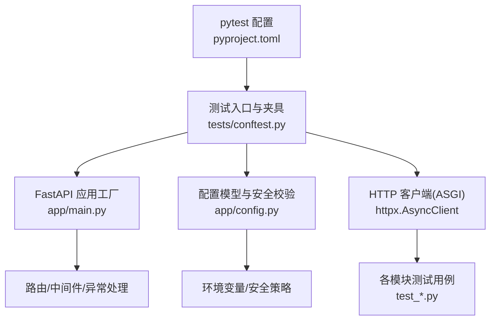
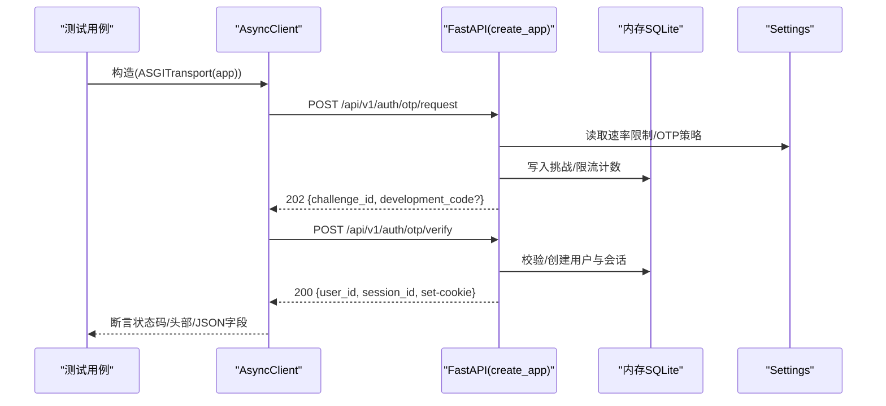
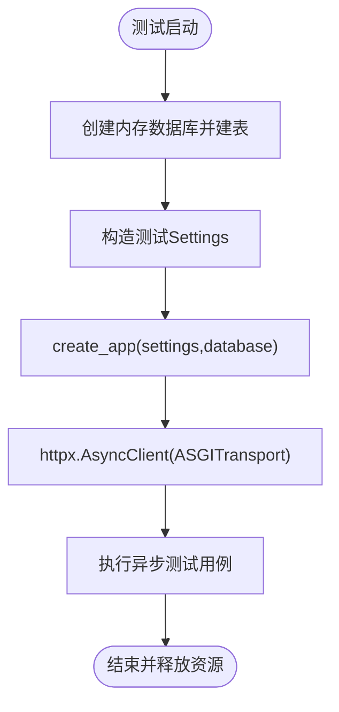
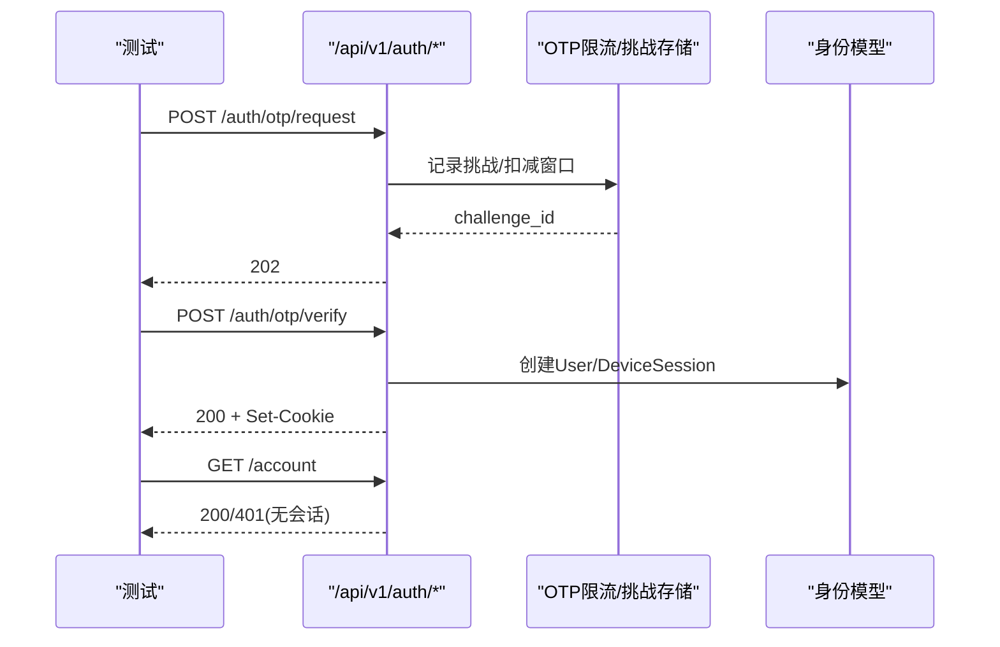
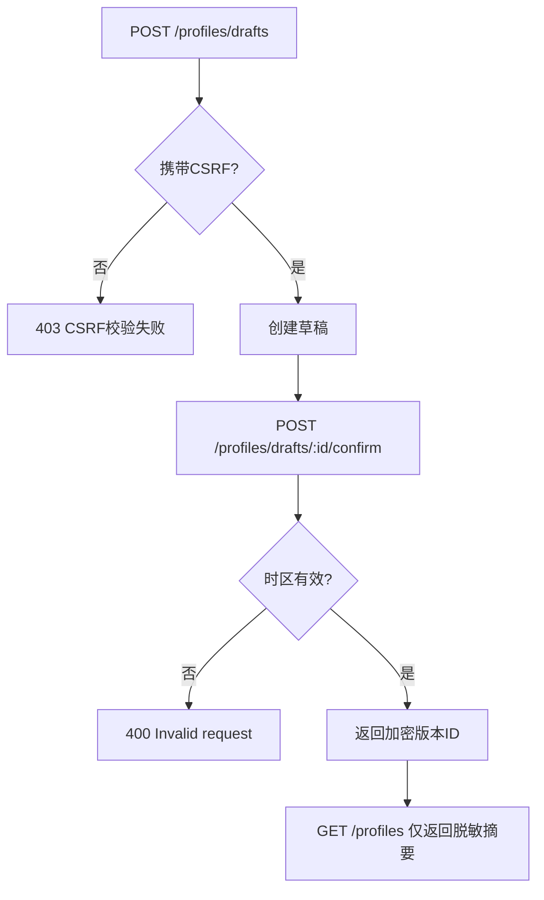
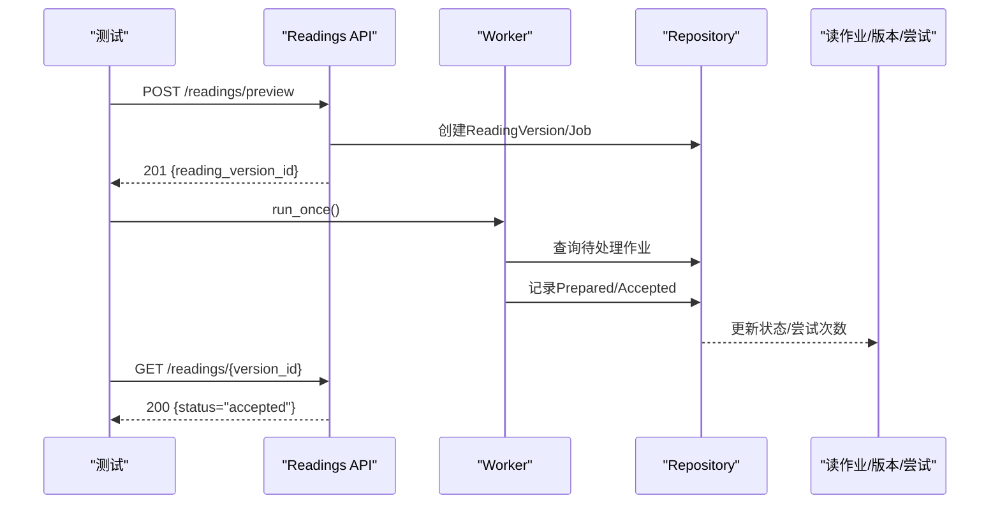
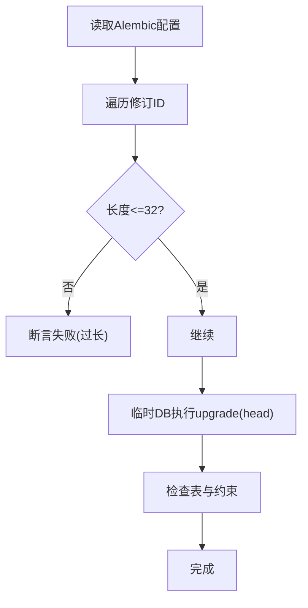
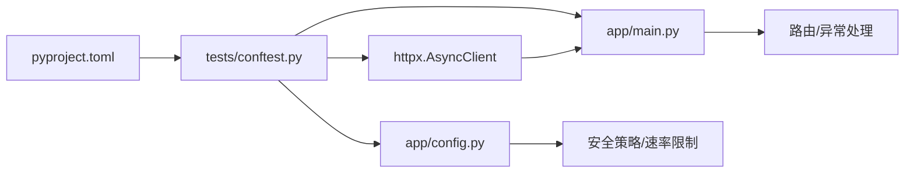

# 后端测试

<cite>
**本文引用的文件**
- [backend/tests/conftest.py](file://backend/tests/conftest.py)
- [backend/pyproject.toml](file://backend/pyproject.toml)
- [backend/app/main.py](file://backend/app/main.py)
- [backend/app/config.py](file://backend/app/config.py)
- [backend/tests/test_auth.py](file://backend/tests/test_auth.py)
- [backend/tests/test_readings_api.py](file://backend/tests/test_readings_api.py)
- [backend/tests/test_profiles_api.py](file://backend/tests/test_profiles_api.py)
- [backend/tests/test_migrations.py](file://backend/tests/test_migrations.py)
</cite>

## 目录
1. [简介](#简介)
2. [项目结构](#项目结构)
3. [核心组件](#核心组件)
4. [架构总览](#架构总览)
5. [详细组件分析](#详细组件分析)
6. [依赖关系分析](#依赖关系分析)
7. [性能考虑](#性能考虑)
8. [故障排查指南](#故障排查指南)
9. [结论](#结论)
10. [附录](#附录)

## 简介
本文件面向后端测试，系统性说明基于 pytest 的测试框架配置与使用方式，覆盖夹具组织、异步测试、模型验证、API 端点测试、集成测试设计模式、并发与性能测试建议，以及覆盖率统计与质量门禁。该项目的后端采用 FastAPI + SQLAlchemy 异步驱动，测试通过 httpx 的 ASGI 传输直接调用应用实例，避免启动真实 HTTP 服务，从而获得更快的端到端行为验证能力。

## 项目结构
后端测试位于 backend/tests 目录，核心配置在 pyproject.toml 中声明 pytest 选项与开发依赖；测试夹具集中在 conftest.py，提供内存数据库、测试设置和异步测试客户端；业务域测试按功能划分（认证、资料、阅读等），迁移测试独立于业务用例。

图表来源
- [backend/pyproject.toml:32-36](file://backend/pyproject.toml#L32-L36)
- [backend/tests/conftest.py:9-49](file://backend/tests/conftest.py#L9-L49)
- [backend/app/main.py:30-152](file://backend/app/main.py#L30-L152)
- [backend/app/config.py:62-149](file://backend/app/config.py#L62-L149)

章节来源
- [backend/pyproject.toml:1-58](file://backend/pyproject.toml#L1-L58)
- [backend/tests/conftest.py:1-50](file://backend/tests/conftest.py#L1-L50)

## 核心组件
- 测试夹具
  - 数据库夹具：创建内存 SQLite 数据库，注册所有领域模型元数据并一次性建表，测试结束后释放连接。
  - 测试设置夹具：构造 Settings，指定环境为 test、内存数据库、Cookie 安全标志、OTP 适配器为 fake、管理员引导账号等。
  - 客户端夹具：以 ASGITransport 将 httpx.AsyncClient 绑定到 create_app 返回的 FastAPI 实例，base_url 固定为 https://testserver。
- 应用工厂
  - create_app 负责装配速率限制器、OTP 存储与限流、日志与可观测性、统一错误处理器、OpenAPI 文档路径等。
- 配置与安全
  - Settings 集中管理运行参数，包含生产环境强制约束（如禁用 fake OTP、要求安全 Cookie、固定运行时路径与哈希等）。

章节来源
- [backend/tests/conftest.py:9-49](file://backend/tests/conftest.py#L9-L49)
- [backend/app/main.py:30-152](file://backend/app/main.py#L30-L152)
- [backend/app/config.py:62-149](file://backend/app/config.py#L62-L149)

## 架构总览
测试通过夹具注入应用实例与数据库会话，以异步方式发起请求并断言响应状态码、JSON 体、安全头与会话 Cookie。认证流程、资料读写、阅读任务编排等关键路径均被端到端覆盖。

图表来源
- [backend/tests/conftest.py:40-49](file://backend/tests/conftest.py#L40-L49)
- [backend/app/main.py:30-152](file://backend/app/main.py#L30-L152)
- [backend/app/config.py:62-149](file://backend/app/config.py#L62-L149)
- [backend/tests/test_auth.py:10-50](file://backend/tests/test_auth.py#L10-L50)

## 详细组件分析

### 测试夹具与异步测试客户端
- 数据库夹具
  - 动态导入 app.database 与多个领域模型模块，确保 Base.metadata 包含全部表定义，再执行 create_all。
  - 使用 aiosqlite 内存库，保证测试隔离与快速清理。
- 测试设置夹具
  - 显式设置 environment=test、database_url=内存库、cookie_secure=True、otp_adapter=fake 等，便于在不同场景下切换。
- 客户端夹具
  - 通过 ASGITransport 直接调用 FastAPI 应用，无需网络栈开销；base_url 固定为 https://testserver，简化相对路径断言。

图表来源
- [backend/tests/conftest.py:9-49](file://backend/tests/conftest.py#L9-L49)

章节来源
- [backend/tests/conftest.py:9-49](file://backend/tests/conftest.py#L9-L49)

### 认证与授权测试
- 访客会话创建、OTP 请求与验证、设备会话 Cookie 安全属性、重复登录合并用户、邮箱归一化与原始目的地不持久化、非法验证码不创建用户、登出撤销当前设备会话、未登录访问账户接口返回 401。
- 速率限制：同一访客跨目标地址的请求限制、跨旋转访客会话的限制、可信代理区分、生产环境失败关闭策略、非 fake 应用生成随机六位验证码。
- 失败重试与冷却：首次投递失败后释放挑战与冷却，允许立即重试；网络层限制保留但客层/目标层窗口回滚。

图表来源
- [backend/tests/test_auth.py:10-50](file://backend/tests/test_auth.py#L10-L50)
- [backend/tests/test_auth.py:53-197](file://backend/tests/test_auth.py#L53-L197)
- [backend/tests/test_auth.py:161-327](file://backend/tests/test_auth.py#L161-L327)
- [backend/tests/test_auth.py:329-540](file://backend/tests/test_auth.py#L329-L540)

章节来源
- [backend/tests/test_auth.py:10-540](file://backend/tests/test_auth.py#L10-L540)

### 资料与隐私测试
- 访客可创建、确认并列出加密资料；列表与数据库存储中不包含明文敏感信息。
- 草稿标签持久化；写操作需要匹配的 CSRF Token；草稿写操作受速率限制；确认时拒绝未知时区；资料 ID 按所有者隔离，跨所有者访问返回 404。

图表来源
- [backend/tests/test_profiles_api.py:9-67](file://backend/tests/test_profiles_api.py#L9-L67)
- [backend/tests/test_profiles_api.py:75-162](file://backend/tests/test_profiles_api.py#L75-L162)
- [backend/tests/test_profiles_api.py:165-200](file://backend/tests/test_profiles_api.py#L165-L200)

章节来源
- [backend/tests/test_profiles_api.py:9-200](file://backend/tests/test_profiles_api.py#L9-L200)

### 阅读编排与幂等性测试
- 预览/今日/周阅读任务启动、轮询队列状态、工作器推进至 accepted；未放行运行时发布时启动失败；相同幂等键返回同一版本；不同负载或动作冲突；幂等检查发生在解密之前；访客登录后认领幂等键归属；资源按所有者隔离。
- 通过 seed_runtime_release 预置运行时发布记录，配合 run_worker_once 驱动真实编排器与假运行时/模型栈。

图表来源
- [backend/tests/test_readings_api.py:38-87](file://backend/tests/test_readings_api.py#L38-L87)
- [backend/tests/test_readings_api.py:158-240](file://backend/tests/test_readings_api.py#L158-L240)
- [backend/tests/test_readings_api.py:289-405](file://backend/tests/test_readings_api.py#L289-L405)
- [backend/tests/test_readings_api.py:408-590](file://backend/tests/test_readings_api.py#L408-L590)
- [backend/tests/test_readings_api.py:593-735](file://backend/tests/test_readings_api.py#L593-L735)

章节来源
- [backend/tests/test_readings_api.py:289-735](file://backend/tests/test_readings_api.py#L289-L735)

### 迁移测试
- 校验 Alembic 修订 ID 长度不超过默认 version_num 列长度。
- 在临时 SQLite 上执行升级，验证身份域相关表与唯一约束存在。

图表来源
- [backend/tests/test_migrations.py:14-66](file://backend/tests/test_migrations.py#L14-L66)

章节来源
- [backend/tests/test_migrations.py:14-66](file://backend/tests/test_migrations.py#L14-L66)

## 依赖关系分析
- 测试对应用的依赖
  - 通过 create_app 注入 Settings 与 Database，解耦外部依赖（如真实数据库、邮件、运行时进程）。
  - 使用 InMemoryOtpChallengeStore 与 InMemoryOtpRequestLimiter 进行内存级限流与状态管理。
- 配置对安全的约束
  - 生产环境强制启用安全 Cookie、禁止 fake OTP/Model/Runtime、固定运行时路径与哈希、严格超时与令牌价格范围等。

图表来源
- [backend/pyproject.toml:32-36](file://backend/pyproject.toml#L32-L36)
- [backend/tests/conftest.py:9-49](file://backend/tests/conftest.py#L9-L49)
- [backend/app/main.py:30-152](file://backend/app/main.py#L30-L152)
- [backend/app/config.py:62-149](file://backend/app/config.py#L62-L149)

章节来源
- [backend/pyproject.toml:1-58](file://backend/pyproject.toml#L1-L58)
- [backend/tests/conftest.py:9-49](file://backend/tests/conftest.py#L9-L49)
- [backend/app/main.py:30-152](file://backend/app/main.py#L30-L152)
- [backend/app/config.py:62-149](file://backend/app/config.py#L62-L149)

## 性能考虑
- 使用内存数据库与 ASGI 直连测试，避免网络与磁盘 IO 开销，提升单测速度。
- 通过速率限制器与窗口策略在测试中验证高并发下的保护机制（如 OTP 请求限制、资料/阅读写操作限流）。
- 工作器迭代上限防止测试挂起，确保幂等与状态机收敛。
- 建议在 CI 中增加并发度与并行测试分组，结合 pytest-xdist 加速回归套件。

[本节为通用指导，不直接分析具体文件]

## 故障排查指南
- 常见错误定位
  - 401 未认证：检查是否缺少会话 Cookie 或已登出导致会话失效。
  - 403 CSRF 失败：写操作需携带正确的 CSRF Token。
  - 400 无效请求：输入校验失败（如未知时区）。
  - 409 幂等冲突：相同幂等键但不同负载或动作。
  - 429 速率限制：触发访客/网络/目标窗口限制。
  - 503 运行时不可用：未放行生产就绪的运行时发布。
- 调试建议
  - 打印响应文本与头部，核对状态码、Set-Cookie 属性与缓存控制头。
  - 通过数据库夹具直接查询模型，验证状态机推进与数据一致性。
  - 针对 OTP 投递失败场景，替换 delivery 实现以模拟不稳定供应商。

章节来源
- [backend/tests/test_auth.py:161-327](file://backend/tests/test_auth.py#L161-L327)
- [backend/tests/test_profiles_api.py:127-192](file://backend/tests/test_profiles_api.py#L127-L192)
- [backend/tests/test_readings_api.py:478-590](file://backend/tests/test_readings_api.py#L478-L590)

## 结论
本项目采用 pytest + httpx ASGI 传输构建高效的后端测试体系，通过夹具统一管理内存数据库、测试配置与应用实例，覆盖认证、资料、阅读编排与迁移等关键路径。配置层的安全约束与速率限制在测试中得到充分验证，确保在生产环境中具备更强的鲁棒性与可观测性。建议持续完善覆盖率阈值与质量门禁，将更多边界与异常场景纳入自动化回归。

[本节为总结性内容，不直接分析具体文件]

## 附录

### 测试覆盖率统计与质量门禁
- 覆盖率
  - 使用 pytest-cov 收集覆盖率，建议在 CI 中输出 HTML 报告与 XML 指标，便于归档与趋势对比。
- 质量门禁
  - 在 CI 中设置最低覆盖率阈值（例如行覆盖率≥80%），低于阈值则失败。
  - 结合 ruff/mypy 进行静态检查，确保代码风格与类型安全。
  - 对迁移脚本与 OpenAPI 契约进行额外校验，防止破坏性变更。

[本节为通用指导，不直接分析具体文件]