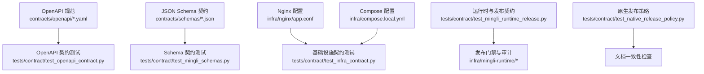
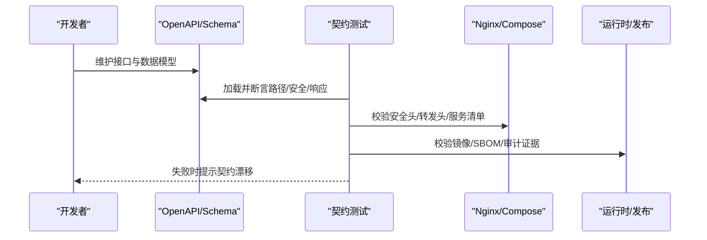
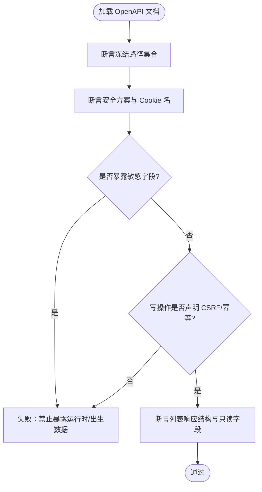
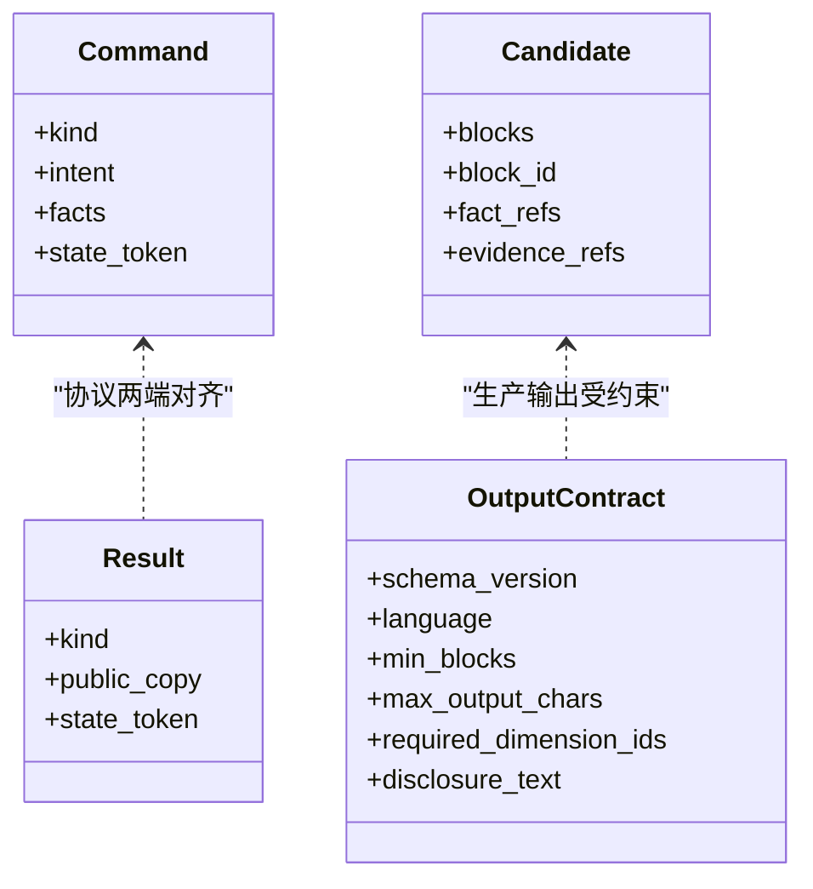
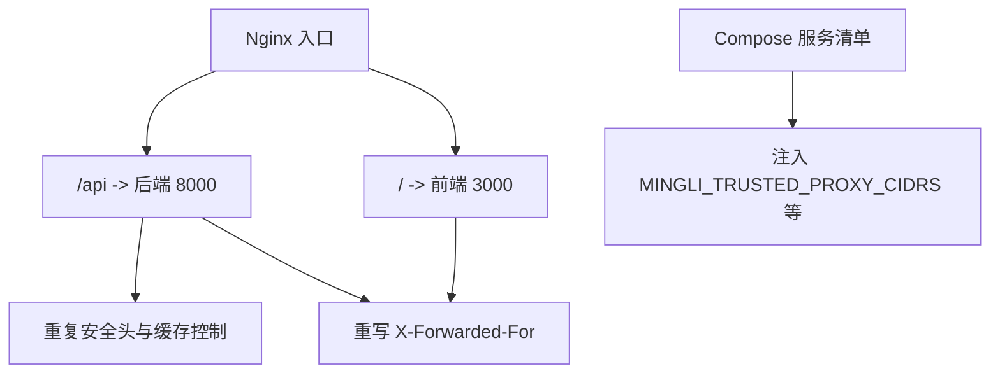
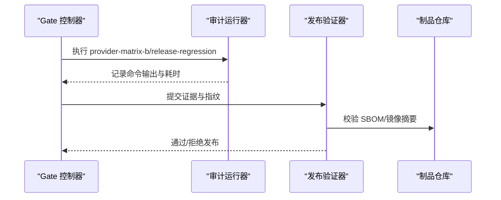
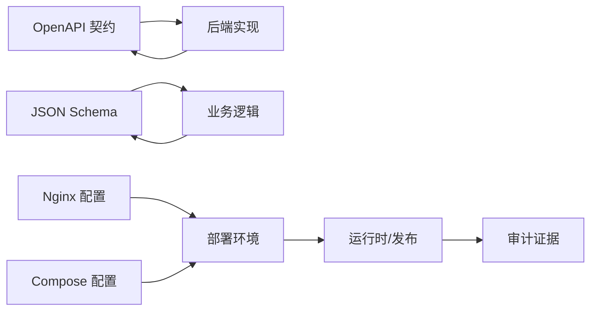

# 契约测试

<cite>
**本文引用的文件**
- [v1.yaml](file://contracts/openapi/v1.yaml)
- [admin-v1.yaml](file://contracts/openapi/admin-v1.yaml)
- [mingli-output-contract-v1.schema.json](file://contracts/schemas/mingli-output-contract-v1.schema.json)
- [auth-session.schema.json](file://contracts/schemas/auth-session.schema.json)
- [health.schema.json](file://contracts/schemas/health.schema.json)
- [test_openapi_contract.py](file://tests/contract/test_openapi_contract.py)
- [test_mingli_schemas.py](file://tests/contract/test_mingli_schemas.py)
- [test_infra_contract.py](file://tests/contract/test_infra_contract.py)
- [test_mingli_runtime_release.py](file://tests/contract/test_mingli_runtime_release.py)
- [test_native_release_policy.py](file://tests/contract/test_native_release_policy.py)
- [app.conf](file://infra/nginx/app.conf)
- [compose.local.yml](file://infra/compose.local.yml)
</cite>

## 目录
1. [简介](#简介)
2. [项目结构](#项目结构)
3. [核心组件](#核心组件)
4. [架构总览](#架构总览)
5. [详细组件分析](#详细组件分析)
6. [依赖关系分析](#依赖关系分析)
7. [性能考虑](#性能考虑)
8. [故障排查指南](#故障排查指南)
9. [结论](#结论)
10. [附录](#附录)

## 简介
本文件系统化阐述前后端接口契约测试的设计与实现，覆盖以下目标：
- OpenAPI 规范验证：接口定义检查、请求响应格式校验、版本兼容性约束。
- JSON Schema 策略：数据模型验证、字段约束检查、业务规则断言。
- 基础设施契约：环境变量、Nginx 配置、Compose 服务边界与依赖。
- CI 集成方式：自动化检测接口变更与契约漂移。
- 冲突检测与修复指导：如何定位并修复不兼容变更。
- 测试用例设计模式与最佳实践：可复用夹具、参数化、拒绝用例等。

## 项目结构
契约相关资产集中在 contracts 目录，契约测试位于 tests/contract；基础设施契约涉及 infra 下的 Nginx 与 Compose 配置。后端还包含运行时产物与发布门禁的契约测试。

**图表来源**
- [v1.yaml:1-1268](file://contracts/openapi/v1.yaml#L1-L1268)
- [admin-v1.yaml:1-231](file://contracts/openapi/admin-v1.yaml#L1-L231)
- [mingli-output-contract-v1.schema.json:1-45](file://contracts/schemas/mingli-output-contract-v1.schema.json#L1-L45)
- [test_openapi_contract.py:1-168](file://tests/contract/test_openapi_contract.py#L1-L168)
- [test_mingli_schemas.py:1-355](file://tests/contract/test_mingli_schemas.py#L1-L355)
- [test_infra_contract.py:1-57](file://tests/contract/test_infra_contract.py#L1-L57)
- [test_mingli_runtime_release.py:1-800](file://tests/contract/test_mingli_runtime_release.py#L1-L800)
- [test_native_release_policy.py:1-95](file://tests/contract/test_native_release_policy.py#L1-L95)
- [app.conf:1-45](file://infra/nginx/app.conf#L1-L45)
- [compose.local.yml:1-93](file://infra/compose.local.yml#L1-L93)

**章节来源**
- [v1.yaml:1-1268](file://contracts/openapi/v1.yaml#L1-L1268)
- [admin-v1.yaml:1-231](file://contracts/openapi/admin-v1.yaml#L1-L231)
- [test_openapi_contract.py:1-168](file://tests/contract/test_openapi_contract.py#L1-L168)
- [test_mingli_schemas.py:1-355](file://tests/contract/test_mingli_schemas.py#L1-L355)
- [test_infra_contract.py:1-57](file://tests/contract/test_infra_contract.py#L1-L57)
- [app.conf:1-45](file://infra/nginx/app.conf#L1-L45)
- [compose.local.yml:1-93](file://infra/compose.local.yml#L1-L93)

## 核心组件
- OpenAPI 契约（用户 API v1）：定义健康检查、身份与会话、资料草稿与确认、阅读任务生命周期等路径与响应模型，并通过 securitySchemes、parameters、schemas 明确安全与数据结构。
- OpenAPI 契约（管理 API v1）：独立于用户 API，限定管理路由命名空间与安全头。
- JSON Schema 契约：对命令、结果、候选片段、输出契约等进行严格的数据模型约束，禁止额外属性，强制必填字段与枚举值。
- 基础设施契约：Nginx 反向代理的安全头、转发头重写、单源入口；Compose 声明的服务边界与环境变量。
- 运行时与发布契约：验证镜像标识、SBOM、提供者矩阵、审计命令、证据完整性与不可篡改。

**章节来源**
- [v1.yaml:1-1268](file://contracts/openapi/v1.yaml#L1-L1268)
- [admin-v1.yaml:1-231](file://contracts/openapi/admin-v1.yaml#L1-L231)
- [mingli-output-contract-v1.schema.json:1-45](file://contracts/schemas/mingli-output-contract-v1.schema.json#L1-L45)
- [auth-session.schema.json:1-15](file://contracts/schemas/auth-session.schema.json#L1-L15)
- [health.schema.json:1-13](file://contracts/schemas/health.schema.json#L1-L13)
- [test_mingli_runtime_release.py:1-800](file://tests/contract/test_mingli_runtime_release.py#L1-L800)

## 架构总览
契约测试贯穿“规范即契约”的全链路：
- 前端/客户端以 OpenAPI 为契约进行调用与类型生成。
- 后端实现需与冻结的 OpenAPI 和 JSON Schema 保持一致。
- 基础设施层通过 Nginx 与 Compose 保障安全头、同源访问与服务边界。
- 发布阶段通过运行时契约确保产物一致性与可追溯性。

[无图表来源，因为该图为概念性流程]

## 详细组件分析

### OpenAPI 契约测试
- 冻结路径集合：Phase One 与 Phase Two 的路径与方法被显式断言，防止新增未评审路由。
- 安全方案：设备会话 cookie 名称与作用域在 securitySchemes 中固定，测试确保不被修改。
- 敏感信息保护：第二阶段响应模型不得暴露运行时令牌或出生隐私字段。
- CSRF 与幂等：所有写操作必须声明 CSRF Token；读后写类接口需声明幂等键。
- 列表响应冻结：读取列表接口返回摘要项，禁止扩展未知字段。

**图表来源**
- [test_openapi_contract.py:16-168](file://tests/contract/test_openapi_contract.py#L16-L168)
- [v1.yaml:15-550](file://contracts/openapi/v1.yaml#L15-L550)

**章节来源**
- [test_openapi_contract.py:16-168](file://tests/contract/test_openapi_contract.py#L16-L168)
- [v1.yaml:15-550](file://contracts/openapi/v1.yaml#L15-L550)

### JSON Schema 契约测试
- 模型验证：使用 Draft 2020-12 校验器加载 schema 并执行 validate/iter_errors。
- 联合类型约束：命令与结果分别限定公开 kind 数量，避免非法状态。
- 事实分组与追踪：prepare 的事实按主体分组；候选块要求完整追踪字段。
- 输出契约版本化：schema_version 固定，语言、区块数、字符上限、限制 ID 集与披露文本受控。
- 运行时字段隔离：state_token 仅存在于运行时协议 schema，不在候选与输出契约中出现。

**图表来源**
- [test_mingli_schemas.py:165-355](file://tests/contract/test_mingli_schemas.py#L165-L355)
- [mingli-output-contract-v1.schema.json:1-45](file://contracts/schemas/mingli-output-contract-v1.schema.json#L1-L45)

**章节来源**
- [test_mingli_schemas.py:165-355](file://tests/contract/test_mingli_schemas.py#L165-L355)
- [mingli-output-contract-v1.schema.json:1-45](file://contracts/schemas/mingli-output-contract-v1.schema.json#L1-L45)

### 基础设施契约测试
- 同源入口：Nginx 将 /api 与 / 统一代理到后端与前端，保证同源。
- 安全头：API 位置块重复基础安全头，避免继承丢失；强制 Cache-Control 私有且缓存禁用。
- 转发头重写：统一设置 X-Forwarded-For 为远端真实地址。
- 服务边界：Compose 声明 postgres、redis、api、worker、web、edge 六个服务，并注入信任代理 CIDR 等环境变量。

**图表来源**
- [app.conf:1-45](file://infra/nginx/app.conf#L1-L45)
- [compose.local.yml:1-93](file://infra/compose.local.yml#L1-L93)
- [test_infra_contract.py:12-57](file://tests/contract/test_infra_contract.py#L12-L57)

**章节来源**
- [test_infra_contract.py:12-57](file://tests/contract/test_infra_contract.py#L12-L57)
- [app.conf:1-45](file://infra/nginx/app.conf#L1-L45)
- [compose.local.yml:1-93](file://infra/compose.local.yml#L1-L93)

### 运行时与发布契约
- 镜像与 SBOM：验证镜像标识种类为 OCI Index，SBOM 存在且可校验。
- 提供者矩阵：Matrix A/B 输出必须满足预期就绪数量与指纹一致性。
- 审计命令：记录每个命令的超时预算与实际耗时，禁止越界。
- 证据防篡改：run-id、image-id、source-commit 等关键指纹漂移将被拒绝。
- 备份恢复：待处理 token 会被脱敏并重放已接受的 prepare 结果。

**图表来源**
- [test_mingli_runtime_release.py:125-575](file://tests/contract/test_mingli_runtime_release.py#L125-L575)

**章节来源**
- [test_mingli_runtime_release.py:125-575](file://tests/contract/test_mingli_runtime_release.py#L125-L575)

### 原生发布策略与文档一致性
- 策略断言：权威文档必须声明 native-full 为唯一强制 Runtime Gate，禁止启动 VZ/Rosetta/QEMU/linux-certify。
- 纯契约测试可离线运行：在不启动 Linux 环境的情况下，仅运行纯契约测试套件，确保回归稳定。
- 槽位语义：slots/max_slots 表示签名 runner 的加权调度额度，非操作系统 PID 上限，需在文档中明确。

**章节来源**
- [test_native_release_policy.py:42-95](file://tests/contract/test_native_release_policy.py#L42-L95)

## 依赖关系分析
- OpenAPI 契约与后端实现：通过运行时 OpenAPI 快照对比与路径/响应断言，确保实现与冻结契约一致。
- JSON Schema 与业务逻辑：命令/结果/候选/输出契约作为跨进程通信边界，任何变更需同步更新 schema 与测试。
- 基础设施与部署：Nginx 与 Compose 配置是运行时契约的一部分，变更会影响安全与可用性。
- 发布管线：运行时审计与验证脚本强绑定产物指纹与证据，防止漂移。

**图表来源**
- [v1.yaml:1-1268](file://contracts/openapi/v1.yaml#L1-L1268)
- [test_mingli_schemas.py:1-355](file://tests/contract/test_mingli_schemas.py#L1-L355)
- [app.conf:1-45](file://infra/nginx/app.conf#L1-L45)
- [compose.local.yml:1-93](file://infra/compose.local.yml#L1-L93)
- [test_mingli_runtime_release.py:1-800](file://tests/contract/test_mingli_runtime_release.py#L1-L800)

**章节来源**
- [v1.yaml:1-1268](file://contracts/openapi/v1.yaml#L1-L1268)
- [test_mingli_schemas.py:1-355](file://tests/contract/test_mingli_schemas.py#L1-L355)
- [app.conf:1-45](file://infra/nginx/app.conf#L1-L45)
- [compose.local.yml:1-93](file://infra/compose.local.yml#L1-L93)
- [test_mingli_runtime_release.py:1-800](file://tests/contract/test_mingli_runtime_release.py#L1-L800)

## 性能考虑
- 契约测试应轻量、快速：优先静态断言（路径、字段、安全头），避免网络 IO。
- 批量校验：使用参数化与夹具减少重复代码，提高覆盖率。
- 跳过重型步骤：如 Linux 执行类测试可通过标记跳过，保持本地与 CI 效率。
- 缓存与并行：合理组织测试模块，利用 pytest-xdist 并行执行。

[本节提供通用建议，无需特定文件引用]

## 故障排查指南
- OpenAPI 路径缺失或方法变更：查看 test_openapi_contract.py 中的冻结路径断言，定位具体路径与方法。
- 响应泄露敏感字段：检查响应 schema 是否包含禁止字段（如 state_token、birth_datetime 等）。
- CSRF/幂等缺失：确认写操作参数引用 CsrfToken 与 IdempotencyKey。
- Nginx 安全头丢失：检查 /api 位置块是否重复基础安全头与 Cache-Control。
- Compose 服务不一致：核对 services 集合与必需环境变量是否存在。
- 发布证据漂移：检查 run-id、image-id、source-commit、matrix 指纹是否匹配。

**章节来源**
- [test_openapi_contract.py:16-168](file://tests/contract/test_openapi_contract.py#L16-L168)
- [test_infra_contract.py:12-57](file://tests/contract/test_infra_contract.py#L12-L57)
- [test_mingli_runtime_release.py:457-575](file://tests/contract/test_mingli_runtime_release.py#L457-L575)

## 结论
本项目通过“冻结契约 + 自动化测试”的方式，将接口、数据模型与基础设施纳入统一的契约治理。OpenAPI 与 JSON Schema 构成前后端与外部系统的强约束；Nginx 与 Compose 保障部署安全与边界；运行时与发布契约确保产物一致性与可追溯性。配合 CI 的自动化断言，可在变更发生时快速发现并阻止不兼容改动，降低协作成本与上线风险。

[本节为总结性内容，无需特定文件引用]

## 附录

### CI 集成建议
- 在 PR 检查中运行 OpenAPI 与 Schema 契约测试，阻断破坏性变更。
- 在合并前运行基础设施契约测试，确保部署配置安全合规。
- 在发布流水线中运行运行时与发布契约测试，验证产物与证据。
- 使用标签或条件跳过重型测试（如 Linux 执行），提升反馈速度。

[本节为通用实践，无需特定文件引用]

### 冲突检测与修复指导
- 冲突类型
  - 路径/方法新增或移除：根据 test_openapi_contract.py 的冻结集合定位并回滚或审批。
  - 响应字段新增/删除：依据 JSON Schema 的 required/enum/const 调整实现或升级 schema。
  - 安全头/转发头变更：修正 app.conf 以符合安全基线。
  - 环境变量缺失：在 compose.local.yml 补充必需变量。
  - 发布证据漂移：重新生成证据或回滚至已知良好版本。
- 修复步骤
  - 定位失败测试与对应契约文件。
  - 评估影响范围（前端、后端、部署、发布）。
  - 更新契约与实现，保持双向对齐。
  - 补充或调整测试用例，覆盖新行为。
  - 在 CI 中验证通过后合并。

**章节来源**
- [test_openapi_contract.py:16-168](file://tests/contract/test_openapi_contract.py#L16-L168)
- [test_mingli_schemas.py:165-355](file://tests/contract/test_mingli_schemas.py#L165-L355)
- [test_infra_contract.py:12-57](file://tests/contract/test_infra_contract.py#L12-L57)
- [test_mingli_runtime_release.py:457-575](file://tests/contract/test_mingli_runtime_release.py#L457-L575)

### 测试用例设计模式与最佳实践
- 夹具复用：封装 schema 加载与校验器创建，减少样板代码。
- 参数化：对多种合法/非法输入进行批量验证。
- 拒绝用例：构造非法 payload 断言被拒绝，增强鲁棒性。
- 最小化依赖：优先静态断言，避免启动外部服务。
- 可观测性：失败消息明确指出违反的契约点，便于快速修复。

**章节来源**
- [test_mingli_schemas.py:25-53](file://tests/contract/test_mingli_schemas.py#L25-L53)
- [test_mingli_schemas.py:165-355](file://tests/contract/test_mingli_schemas.py#L165-L355)