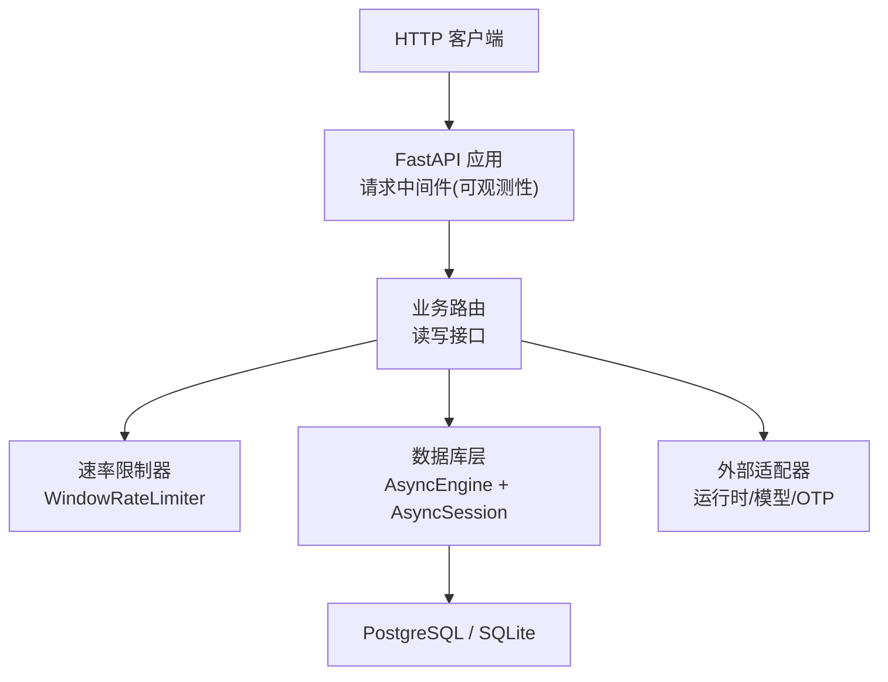
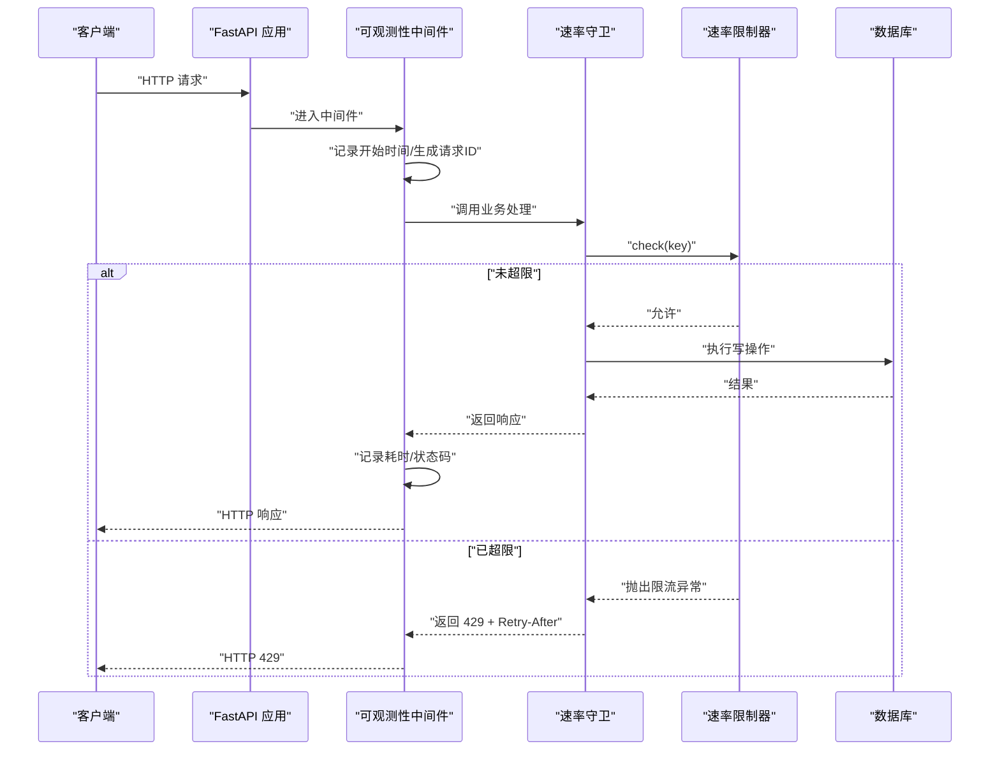
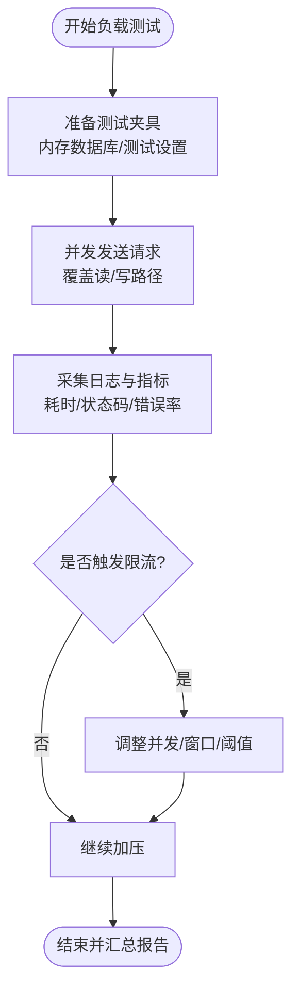
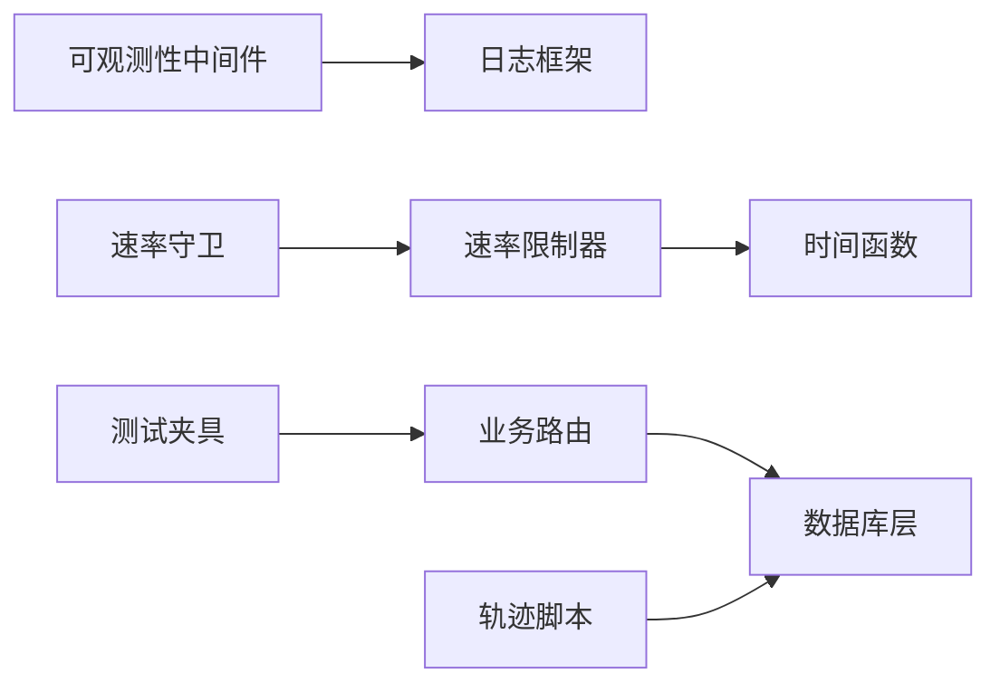

# 性能测试

<cite>
**本文引用的文件**
- [backend/app/observability.py](file://backend/app/observability.py)
- [backend/app/config.py](file://backend/app/config.py)
- [backend/app/database.py](file://backend/app/database.py)
- [backend/app/readings/rate_limit.py](file://backend/app/readings/rate_limit.py)
- [backend/app/api/rate_guard.py](file://backend/app/api/rate_guard.py)
- [backend/tests/conftest.py](file://backend/tests/conftest.py)
- [backend/tests/test_readings_api.py](file://backend/tests/test_readings_api.py)
- [scripts/server_task13_trajectory_payload.py](file://scripts/server_task13_trajectory_payload.py)
- [infra/mingli-runtime/local_gate.py](file://infra/mingli-runtime/local_gate.py)
- [infra/mingli-runtime/verify_local_full.py](file://infra/mingli-runtime/verify_local_full.py)
- [tests/contract/test_mingli_runtime_release.py](file://tests/contract/test_mingli_runtime_release.py)
</cite>

## 目录
1. [简介](#简介)
2. [项目结构](#项目结构)
3. [核心组件](#核心组件)
4. [架构总览](#架构总览)
5. [详细组件分析](#详细组件分析)
6. [依赖关系分析](#依赖关系分析)
7. [性能考量](#性能考量)
8. [故障排查指南](#故障排查指南)
9. [结论](#结论)
10. [附录](#附录)

## 简介
本文件面向“性能测试”目标，系统化说明本仓库在负载测试、基准测试、内存与资源稳定性、数据库性能、API 性能以及回归检测方面的策略与实践。内容基于后端 FastAPI 服务、速率限制、可观测性日志、数据库连接池、以及脚本与合约测试中的性能相关实现进行梳理，并提供可视化流程图与时序图，帮助读者快速定位关键路径、理解监控指标来源并制定优化方案。

## 项目结构
与性能测试直接相关的代码主要分布在以下位置：
- API 可观测性与请求耗时统计：后端中间件记录每次 HTTP 请求的耗时与状态码，便于计算响应时间分布与吞吐。
- 配置项：集中定义各类速率限制窗口、超时、模型调用限制等，是负载与压力测试的参数入口。
- 数据库连接池：异步 SQLAlchemy Engine 与 Session 工厂，提供连接复用与健康探测能力。
- 速率限制器：进程内滑动窗口限流器，用于保护写路径与防止滥用。
- 测试夹具与并发测试：使用内存 SQLite 或真实 PostgreSQL（可选）构建测试环境，支持并发与迁移验证。
- 轨迹与回归脚本：通过脚本对数据库状态计数、运行回归任务、校验报告摘要，支撑端到端性能基线与回归检测。

图表来源
- [backend/app/observability.py:27-51](file://backend/app/observability.py#L27-L51)
- [backend/app/readings/rate_limit.py:9-52](file://backend/app/readings/rate_limit.py#L9-L52)
- [backend/app/database.py:12-32](file://backend/app/database.py#L12-L32)

章节来源
- [backend/app/observability.py:27-51](file://backend/app/observability.py#L27-L51)
- [backend/app/config.py:127-148](file://backend/app/config.py#L127-L148)
- [backend/app/database.py:12-32](file://backend/app/database.py#L12-L32)

## 核心组件
- 请求可观测性中间件：为每个请求生成唯一 ID，记录方法、路径、状态码与耗时（毫秒），输出结构化 JSON 日志，便于聚合分析 P50/P95/P99 响应时间与错误率。
- 配置中心 Settings：集中管理速率限制窗口、模型超时、最大响应体大小、会话与登录限流等参数，作为压测与基准测试的关键输入。
- 数据库连接池：异步引擎启用连接前探测，配合会话工厂减少连接开销；提供健康探针与优雅关闭。
- 速率限制器：基于滑动窗口的进程内限流，支持按 key 控制写入频率，并在超限时返回 Retry-After。
- 速率守卫：将限流异常转换为标准 API 问题（429），统一响应头与错误语义。
- 测试夹具：提供内存数据库、测试设置与 ASGI 客户端，便于快速集成测试与并发场景模拟。
- 轨迹与回归脚本：读取数据库状态计数、执行回归任务、校验报告摘要，形成可重复的性能基线。

章节来源
- [backend/app/observability.py:27-51](file://backend/app/observability.py#L27-L51)
- [backend/app/config.py:127-148](file://backend/app/config.py#L127-L148)
- [backend/app/database.py:12-32](file://backend/app/database.py#L12-L32)
- [backend/app/readings/rate_limit.py:9-52](file://backend/app/readings/rate_limit.py#L9-L52)
- [backend/app/api/rate_guard.py:5-19](file://backend/app/api/rate_guard.py#L5-L19)
- [backend/tests/conftest.py:9-49](file://backend/tests/conftest.py#L9-L49)
- [scripts/server_task13_trajectory_payload.py:570-601](file://scripts/server_task13_trajectory_payload.py#L570-L601)

## 架构总览
下图展示一次 API 请求从进入应用到落库的完整链路，标注了可观测性埋点、限流检查与数据库访问点，便于在压测时定位瓶颈。

图表来源
- [backend/app/observability.py:27-51](file://backend/app/observability.py#L27-L51)
- [backend/app/api/rate_guard.py:5-19](file://backend/app/api/rate_guard.py#L5-L19)
- [backend/app/readings/rate_limit.py:23-49](file://backend/app/readings/rate_limit.py#L23-L49)
- [backend/app/database.py:12-32](file://backend/app/database.py#L12-L32)

## 详细组件分析

### 负载测试设计
- 并发用户模拟
  - 使用 ASGI 客户端与内存数据库快速启动多实例请求，覆盖认证、创建会话、发起读取等关键路径。
  - 通过测试夹具注入测试设置，确保限流与超时参数可控。
- 请求压力测试
  - 针对写路径（如预览/创建读取）施加连续请求，验证速率限制生效与重试行为。
  - 结合数据库状态计数脚本，观察队列积压与状态分布变化。
- 资源消耗监控
  - 利用中间件输出的结构化日志，聚合请求耗时与状态码，计算吞吐与延迟分位。
  - 通过数据库探针与连接池配置，评估连接占用与释放情况。

图表来源
- [backend/tests/conftest.py:9-49](file://backend/tests/conftest.py#L9-L49)
- [backend/tests/test_readings_api.py:1414-1446](file://backend/tests/test_readings_api.py#L1414-L1446)
- [backend/app/observability.py:27-51](file://backend/app/observability.py#L27-L51)
- [scripts/server_task13_trajectory_payload.py:570-601](file://scripts/server_task13_trajectory_payload.py#L570-L601)

章节来源
- [backend/tests/conftest.py:9-49](file://backend/tests/conftest.py#L9-L49)
- [backend/tests/test_readings_api.py:1414-1446](file://backend/tests/test_readings_api.py#L1414-L1446)
- [backend/app/observability.py:27-51](file://backend/app/observability.py#L27-L51)
- [scripts/server_task13_trajectory_payload.py:570-601](file://scripts/server_task13_trajectory_payload.py#L570-L601)

### 基准测试实现
- 关键路径性能测量
  - 通过中间件记录的 duration_ms 字段，统计各接口的 P50/P95/P99 耗时，识别慢路径。
  - 结合速率限制器与守卫，评估在高并发下写路径的稳定性与降级行为。
- 数据库查询优化
  - 使用数据库探针与连接池配置，验证连接复用与空闲回收；在压测中关注连接数峰值与等待时间。
  - 通过脚本读取数据库状态计数，辅助判断批量写入后的堆积情况。
- 缓存效果验证
  - 当前仓库未内置应用级缓存；可在压测中对比开启/关闭外部缓存（如 Redis）时的响应时间与吞吐差异。
  - 若引入缓存，建议以键空间隔离与过期策略为基础，结合中间件指标评估命中率与收益。

章节来源
- [backend/app/observability.py:27-51](file://backend/app/observability.py#L27-L51)
- [backend/app/database.py:12-32](file://backend/app/database.py#L12-L32)
- [scripts/server_task13_trajectory_payload.py:570-601](file://scripts/server_task13_trajectory_payload.py#L570-L601)

### 内存泄漏检测与长时间运行稳定性
- 堆内存分析
  - 建议在压测环境中接入 Python 内存分析工具（如 tracemalloc、memory_profiler），定期采样堆快照，定位持续增长的对象。
  - 结合中间件日志与系统监控（RSS、VMS），关联高耗时请求与内存增长趋势。
- 资源释放验证
  - 使用数据库 dispose 与连接池预检，确保测试结束后释放连接；在生产中关注连接泄漏导致的连接耗尽。
  - 对长生命周期对象（如全局字典、队列）进行边界测试，验证清理逻辑。
- 长时间运行稳定性测试
  - 通过轨迹脚本与本地门控，执行长时间回归任务，校验命令耗时上限与报告完整性。
  - 在稳定期持续采集指标，观察抖动与异常峰值，建立告警阈值。

章节来源
- [backend/app/database.py:23-32](file://backend/app/database.py#L23-L32)
- [infra/mingli-runtime/local_gate.py:417-446](file://infra/mingli-runtime/local_gate.py#L417-L446)
- [infra/mingli-runtime/verify_local_full.py:177-187](file://infra/mingli-runtime/verify_local_full.py#L177-L187)

### 数据库性能测试
- 查询性能分析
  - 通过中间件与数据库探针，收集慢查询与连接等待；结合索引与查询计划优化热点路径。
  - 使用脚本读取 reading_versions 状态计数，评估批量写入后的堆积与收敛速度。
- 索引优化
  - 针对高频过滤条件（如 owner_id、status、时间范围）添加合适索引，避免全表扫描。
  - 在压测前后对比查询耗时与锁竞争情况。
- 连接池配置
  - 根据并发规模调整连接池大小与超时，避免连接不足或过多导致上下文切换开销。
  - 使用 pool_pre_ping 提升连接健康度，减少失败重试成本。

章节来源
- [backend/app/database.py:12-32](file://backend/app/database.py#L12-L32)
- [scripts/server_task13_trajectory_payload.py:570-601](file://scripts/server_task13_trajectory_payload.py#L570-L601)

### API 性能测试
- 响应时间监控
  - 基于中间件输出的 duration_ms，计算各接口延迟分布，设定 SLI/SLO 目标。
- 吞吐量测量
  - 在固定时间内发送不同并发度的请求，统计 QPS 与成功率，绘制吞吐-延迟曲线。
- 错误率分析
  - 关注 4xx/5xx 比例，结合限流返回 429 与重试策略，评估系统弹性与用户体验。
  - 通过速率限制器与守卫，验证在突发流量下的保护机制。

章节来源
- [backend/app/observability.py:27-51](file://backend/app/observability.py#L27-L51)
- [backend/app/readings/rate_limit.py:23-49](file://backend/app/readings/rate_limit.py#L23-L49)
- [backend/app/api/rate_guard.py:5-19](file://backend/app/api/rate_guard.py#L5-L19)
- [backend/tests/test_readings_api.py:1414-1446](file://backend/tests/test_readings_api.py#L1414-L1446)

### 性能回归检测与问题定位
- 回归检测
  - 使用本地门控与验证脚本，执行回归任务并校验报告摘要（测试数量、模块数、目标数），确保基线不退化。
  - 对原生命令与产物进行哈希校验，保证可重复性与一致性。
- 问题定位
  - 当回归失败时，优先检查命令耗时、输出摘要与产物完整性；结合中间件日志定位慢请求与错误路径。
  - 通过数据库状态计数与连接池指标，判断是否存在资源争用或泄漏。

章节来源
- [infra/mingli-runtime/local_gate.py:417-446](file://infra/mingli-runtime/local_gate.py#L417-L446)
- [infra/mingli-runtime/verify_local_full.py:177-187](file://infra/mingli-runtime/verify_local_full.py#L177-L187)
- [tests/contract/test_mingli_runtime_release.py:210-229](file://tests/contract/test_mingli_runtime_release.py#L210-L229)
- [tests/contract/test_mingli_runtime_release.py:696-721](file://tests/contract/test_mingli_runtime_release.py#L696-L721)

## 依赖关系分析
- 中间件依赖配置与日志框架，输出结构化请求日志。
- 速率限制器被速率守卫包装，对外暴露统一错误语义。
- 数据库层提供连接池与探针，供业务层复用。
- 测试夹具依赖配置与数据库，构造 ASGI 客户端进行集成测试。
- 轨迹脚本依赖环境变量与数据库驱动，读取状态计数并辅助回归。

图表来源
- [backend/app/observability.py:27-51](file://backend/app/observability.py#L27-L51)
- [backend/app/api/rate_guard.py:5-19](file://backend/app/api/rate_guard.py#L5-L19)
- [backend/app/readings/rate_limit.py:23-49](file://backend/app/readings/rate_limit.py#L23-L49)
- [backend/app/database.py:12-32](file://backend/app/database.py#L12-L32)
- [backend/tests/conftest.py:9-49](file://backend/tests/conftest.py#L9-L49)
- [scripts/server_task13_trajectory_payload.py:570-601](file://scripts/server_task13_trajectory_payload.py#L570-L601)

章节来源
- [backend/app/observability.py:27-51](file://backend/app/observability.py#L27-L51)
- [backend/app/api/rate_guard.py:5-19](file://backend/app/api/rate_guard.py#L5-L19)
- [backend/app/readings/rate_limit.py:23-49](file://backend/app/readings/rate_limit.py#L23-L49)
- [backend/app/database.py:12-32](file://backend/app/database.py#L12-L32)
- [backend/tests/conftest.py:9-49](file://backend/tests/conftest.py#L9-L49)
- [scripts/server_task13_trajectory_payload.py:570-601](file://scripts/server_task13_trajectory_payload.py#L570-L601)

## 性能考量
- 压测参数调优
  - 通过 Settings 调整速率限制窗口与阈值、模型超时与响应体大小，平衡吞吐与稳定性。
- 连接池与超时
  - 合理设置连接池大小与超时，避免连接耗尽或过长等待；使用探针降低失败重试成本。
- 限流与降级
  - 在高并发场景下，利用滑动窗口限流保护写路径，结合 429 与 Retry-After 引导客户端退避。
- 指标采集与分析
  - 基于中间件日志聚合响应时间分布与错误率，建立 SLO 与告警；对慢路径进行专项优化。
- 回归基线
  - 使用本地门控与验证脚本固化基线，确保版本迭代不引入性能退化。

[本节为通用指导，不直接分析具体文件]

## 故障排查指南
- 响应时间突增
  - 检查中间件日志中的 duration_ms 与状态码，定位慢接口；结合数据库探针与连接池指标排查阻塞。
- 频繁 429 限流
  - 确认速率限制器配置与 key 粒度；必要时调整窗口与阈值，或优化客户端重试策略。
- 数据库连接耗尽
  - 检查连接池大小与超时；确认测试与生产环境的 dispose 与连接释放逻辑。
- 回归失败
  - 查看本地门控与验证脚本的输出摘要，核对测试数量、模块数与目标数；比对产物哈希与命令耗时。

章节来源
- [backend/app/observability.py:27-51](file://backend/app/observability.py#L27-L51)
- [backend/app/readings/rate_limit.py:23-49](file://backend/app/readings/rate_limit.py#L23-L49)
- [backend/app/database.py:23-32](file://backend/app/database.py#L23-L32)
- [infra/mingli-runtime/local_gate.py:417-446](file://infra/mingli-runtime/local_gate.py#L417-L446)
- [infra/mingli-runtime/verify_local_full.py:177-187](file://infra/mingli-runtime/verify_local_full.py#L177-L187)

## 结论
本仓库在性能测试方面具备良好基础：中间件提供细粒度的请求耗时与状态码记录，配置集中管理限流与超时参数，数据库层提供连接池与健康探针，速率限制器保护写路径，测试夹具与轨迹脚本支持快速集成与回归。建议在此基础上完善缓存效果验证、内存泄漏检测与长期稳定性监控，形成闭环的性能保障体系。

[本节为总结，不直接分析具体文件]

## 附录
- 常用指标
  - 响应时间：P50/P95/P99（来自中间件 duration_ms）
  - 吞吐：QPS（单位时间成功请求数）
  - 错误率：4xx/5xx 比例（来自状态码）
  - 限流命中：429 次数与 Retry-After 分布
- 推荐工具
  - 压测：Locust/k6（可对接 ASGI 客户端）
  - 内存分析：tracemalloc/memory_profiler
  - 数据库分析：pg_stat_statements/explain analyze
  - 回归验证：本地门控与验证脚本

[本节为补充信息，不直接分析具体文件]