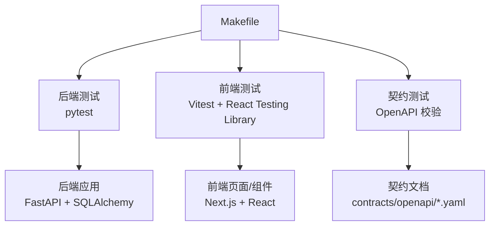
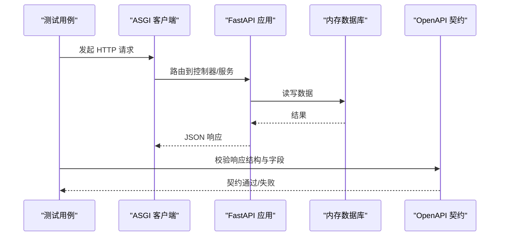
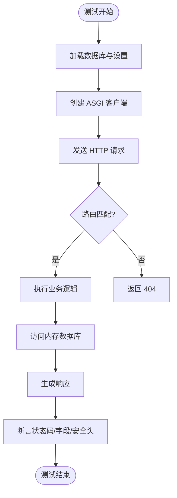
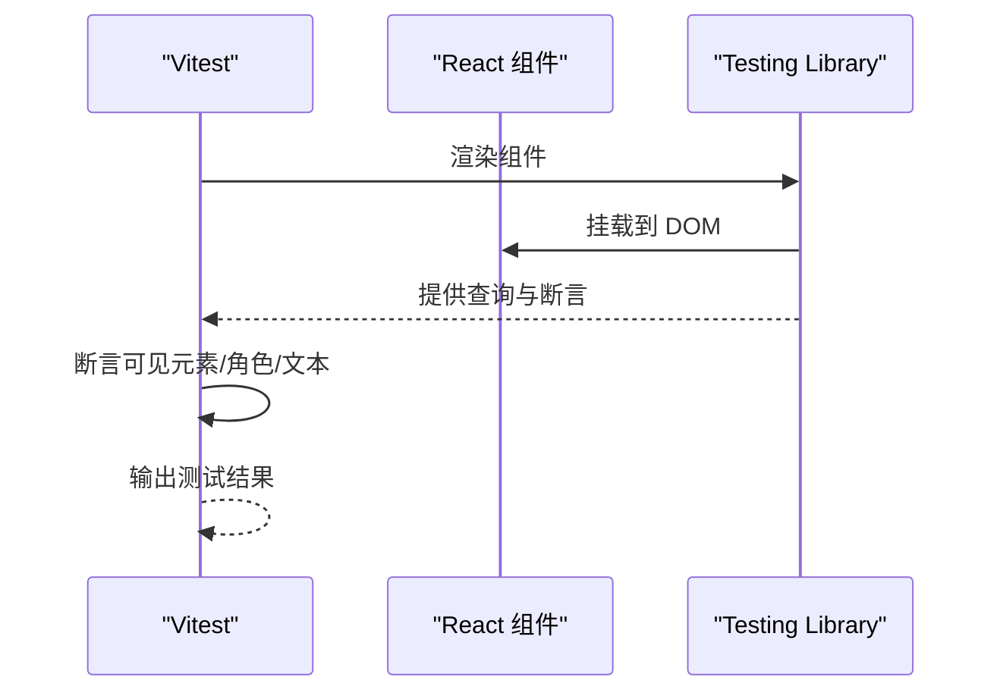
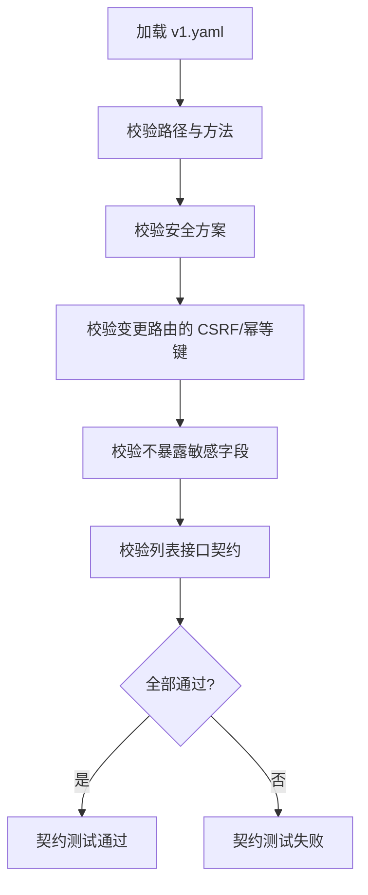
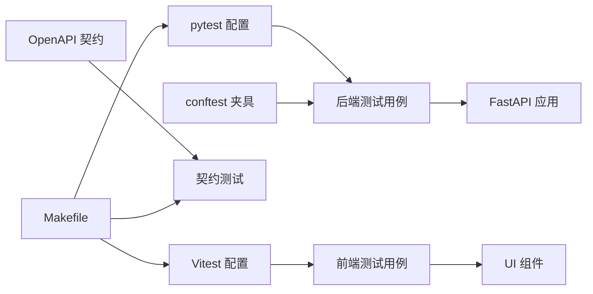

# 测试与质量

<cite>
**本文引用的文件**
- [backend/pyproject.toml](file://backend/pyproject.toml)
- [backend/tests/conftest.py](file://backend/tests/conftest.py)
- [backend/tests/test_auth.py](file://backend/tests/test_auth.py)
- [web/package.json](file://web/package.json)
- [web/vitest.config.ts](file://web/vitest.config.ts)
- [web/src/test/setup.ts](file://web/src/test/setup.ts)
- [web/src/test/home.test.tsx](file://web/src/test/home.test.tsx)
- [Makefile](file://Makefile)
- [tests/contract/test_openapi_contract.py](file://tests/contract/test_openapi_contract.py)
- [contracts/openapi/v1.yaml](file://contracts/openapi/v1.yaml)
- [README.md](file://README.md)
</cite>

## 目录
1. [简介](#简介)
2. [项目结构](#项目结构)
3. [核心组件](#核心组件)
4. [架构总览](#架构总览)
5. [详细组件分析](#详细组件分析)
6. [依赖关系分析](#依赖关系分析)
7. [性能考虑](#性能考虑)
8. [故障排查指南](#故障排查指南)
9. [结论](#结论)
10. [附录](#附录)

## 简介
本文件系统化梳理项目的测试策略与质量保证体系，覆盖后端单元测试、集成测试、端到端契约测试，以及前端组件测试；说明 pytest 配置与使用、React Testing Library 的组件测试策略、跨模块 OpenAPI 契约校验、代码质量工具（Ruff、Mypy、ESLint、TypeScript）和 Makefile 集成的持续集成流程。同时给出性能与负载测试建议、覆盖率报告与质量门禁实践，以及调试技巧与常见问题定位方法。

## 项目结构
仓库采用多包组织：后端 FastAPI 应用与 Worker、前端 Next.js 站点与管理后台、共享契约定义与跨模块合同测试。测试相关的关键位置如下：
- 后端测试：backend/tests 与根级 tests/contract
- 前端测试：web/src/test
- 契约定义：contracts/openapi 与 contracts/schemas
- 统一入口：Makefile 提供 test、check、build 等命令

图表来源
- [Makefile:18-40](file://Makefile#L18-L40)
- [backend/pyproject.toml:32-37](file://backend/pyproject.toml#L32-L37)
- [web/vitest.config.ts:6-19](file://web/vitest.config.ts#L6-L19)
- [tests/contract/test_openapi_contract.py:1-168](file://tests/contract/test_openapi_contract.py#L1-L168)

章节来源
- [Makefile:18-40](file://Makefile#L18-L40)
- [backend/pyproject.toml:32-37](file://backend/pyproject.toml#L32-L37)
- [web/vitest.config.ts:6-19](file://web/vitest.config.ts#L6-L19)
- [tests/contract/test_openapi_contract.py:1-168](file://tests/contract/test_openapi_contract.py#L1-L168)

## 核心组件
- 后端测试框架与配置
  - 使用 pytest 与 pytest-asyncio，自动启用异步模式，严格配置与标记。
  - 通过 conftest 提供内存 SQLite 数据库夹具、测试 Settings 与 ASGI 客户端。
  - 测试路径包含 backend/tests 与 tests/contract，便于在同一个 pytest 会话中运行后端与契约测试。
- 前端测试框架与配置
  - 使用 Vitest 作为测试运行器，jsdom 环境模拟浏览器 DOM。
  - 通过 @testing-library/react 进行组件渲染与交互断言。
  - setup.ts 引入 jest-dom 匹配器以增强断言能力。
- 契约测试
  - 基于 contracts/openapi/v1.yaml 冻结 Phase 1/2 接口集合，校验安全方案、CSRF、幂等键、禁止暴露敏感字段等。
- 代码质量与类型检查
  - Ruff：Python 代码风格与规则检查。
  - Mypy：严格类型检查，启用 Pydantic 插件。
  - ESLint + TypeScript：前端代码规范与类型检查。
- 统一流水线
  - Makefile 聚合后端测试、前端测试、代码检查与构建，形成可复现的质量门禁。

章节来源
- [backend/pyproject.toml:19-54](file://backend/pyproject.toml#L19-L54)
- [backend/tests/conftest.py:9-49](file://backend/tests/conftest.py#L9-L49)
- [web/package.json:9-15](file://web/package.json#L9-L15)
- [web/vitest.config.ts:6-19](file://web/vitest.config.ts#L6-L19)
- [web/src/test/setup.ts:1-2](file://web/src/test/setup.ts#L1-L2)
- [tests/contract/test_openapi_contract.py:16-168](file://tests/contract/test_openapi_contract.py#L16-L168)
- [Makefile:18-40](file://Makefile#L18-L40)

## 架构总览
下图展示测试驱动下的请求处理链路：前端或契约测试通过 HTTP 调用后端 API，后端在内存数据库中执行领域逻辑并返回响应，契约测试确保公开接口与文档一致。

图表来源
- [backend/tests/conftest.py:9-49](file://backend/tests/conftest.py#L9-L49)
- [tests/contract/test_openapi_contract.py:16-168](file://tests/contract/test_openapi_contract.py#L16-L168)
- [contracts/openapi/v1.yaml:1-200](file://contracts/openapi/v1.yaml#L1-L200)

## 详细组件分析

### 后端测试：pytest 配置与夹具
- 配置要点
  - 启用严格配置与标记，自动异步模式，指定测试路径。
  - 目标 Python 版本与 Ruff/Mypy 配置集中管理。
- 夹具设计
  - database：动态导入模型并创建所有表，使用内存 SQLite，测试后释放。
  - test_settings：注入测试环境配置，包括数据库 URL、Cookie 安全、OTP 适配器、管理员引导账号等。
  - client：基于 ASGITransport 构造 AsyncClient，base_url 指向测试服务器。
- 典型用例
  - 认证流程：访客会话、OTP 请求/验证、设备会话 Cookie 属性、账户读取。
  - 限流策略：按访客、网络、目的地等多维窗口限制 OTP 请求。
  - 错误恢复：投递失败时释放挑战与冷却，避免孤儿状态。

图表来源
- [backend/tests/conftest.py:9-49](file://backend/tests/conftest.py#L9-L49)
- [backend/tests/test_auth.py:10-540](file://backend/tests/test_auth.py#L10-L540)

章节来源
- [backend/pyproject.toml:32-54](file://backend/pyproject.toml#L32-L54)
- [backend/tests/conftest.py:9-49](file://backend/tests/conftest.py#L9-L49)
- [backend/tests/test_auth.py:10-540](file://backend/tests/test_auth.py#L10-L540)

### 前端测试：Vitest + React Testing Library
- 配置要点
  - jsdom 环境、全局函数、CSS 支持、Mock 恢复。
  - 别名 @ 指向 src，便于导入组件。
- 组件测试策略
  - 使用 render/screen/within 进行渲染与查询。
  - 断言导航链接、标题、区域可见性、无障碍角色与文案。
  - 覆盖公共首页与私有应用首页的导航与内容一致性。
- 示例场景
  - 首页产品入口与导航项的一致性。
  - 公共信息层级与价格边界展示。
  - 无障碍与语义化标签的正确性。

图表来源
- [web/vitest.config.ts:6-19](file://web/vitest.config.ts#L6-L19)
- [web/src/test/home.test.tsx:1-251](file://web/src/test/home.test.tsx#L1-L251)

章节来源
- [web/vitest.config.ts:6-19](file://web/vitest.config.ts#L6-L19)
- [web/src/test/setup.ts:1-2](file://web/src/test/setup.ts#L1-L2)
- [web/src/test/home.test.tsx:1-251](file://web/src/test/home.test.tsx#L1-L251)

### 契约测试：OpenAPI 一致性保障
- 冻结接口集合
  - Phase 1 健康检查、访客会话、认证、账户等路径必须存在。
  - Phase 2 档案与命理解读相关路径与方法必须声明。
- 安全与合规
  - 明确 Cookie 会话安全方案。
  - 变更路由必须声明 CSRF 与幂等键。
  - 禁止在响应 Schema 中暴露运行时令牌、提示词、密文、出生信息等敏感字段。
- 列表契约
  - 读取列表接口固定 operationId、tags、响应 Schema 引用与字段约束。

图表来源
- [tests/contract/test_openapi_contract.py:16-168](file://tests/contract/test_openapi_contract.py#L16-L168)
- [contracts/openapi/v1.yaml:1-200](file://contracts/openapi/v1.yaml#L1-L200)

章节来源
- [tests/contract/test_openapi_contract.py:16-168](file://tests/contract/test_openapi_contract.py#L16-L168)
- [contracts/openapi/v1.yaml:1-200](file://contracts/openapi/v1.yaml#L1-L200)

### 代码质量检查：Ruff、Mypy、ESLint、TypeScript
- 后端
  - Ruff：选择 E/F/I/UP/B/SIM/ASYNC 规则集，忽略 FastAPI 依赖注入与卷权限相关警告。
  - Mypy：严格模式，启用 pydantic.mypy 插件，限定检查范围。
- 前端
  - ESLint：基于 next-vitals 与 typescript 配置，忽略构建产物与覆盖目录。
  - TypeScript：tsc --noEmit 进行类型检查。
- 统一入口
  - Makefile 将后端检查、前端检查与构建串联为 check 目标。

章节来源
- [backend/pyproject.toml:38-54](file://backend/pyproject.toml#L38-L54)
- [web/eslint.config.mjs:1-11](file://web/eslint.config.mjs#L1-L11)
- [web/package.json:9-15](file://web/package.json#L9-L15)
- [Makefile:21-33](file://Makefile#L21-L33)

### 持续集成与质量门禁
- 本地 CI
  - make test：运行后端与契约测试、前端测试。
  - make check：运行后端检查（ruff/mypy）、前端检查（eslint/typecheck）、构建。
- 推荐扩展
  - 在 GitHub Actions/GitLab CI 中复用上述命令，增加缓存依赖、并行任务、覆盖率上传与制品归档。
  - 将 check 作为合并前门禁，test 作为触发部署的前置步骤。

章节来源
- [Makefile:18-40](file://Makefile#L18-L40)
- [README.md:75-92](file://README.md#L75-L92)

## 依赖关系分析
测试套件之间的耦合与协作：
- 后端测试依赖 conftest 提供的数据库与客户端，测试用例聚焦业务行为与安全边界。
- 契约测试独立于后端实现，仅依赖 OpenAPI 文档，确保前后端接口稳定。
- 前端测试依赖 Vitest 与 React Testing Library，关注 UI 行为与可访问性。
- Makefile 作为统一入口，降低组合成本。

图表来源
- [backend/pyproject.toml:32-37](file://backend/pyproject.toml#L32-L37)
- [backend/tests/conftest.py:9-49](file://backend/tests/conftest.py#L9-L49)
- [web/vitest.config.ts:6-19](file://web/vitest.config.ts#L6-L19)
- [tests/contract/test_openapi_contract.py:16-168](file://tests/contract/test_openapi_contract.py#L16-L168)
- [Makefile:18-40](file://Makefile#L18-L40)

章节来源
- [backend/pyproject.toml:32-37](file://backend/pyproject.toml#L32-L37)
- [backend/tests/conftest.py:9-49](file://backend/tests/conftest.py#L9-L49)
- [web/vitest.config.ts:6-19](file://web/vitest.config.ts#L6-L19)
- [tests/contract/test_openapi_contract.py:16-168](file://tests/contract/test_openapi_contract.py#L16-L168)
- [Makefile:18-40](file://Makefile#L18-L40)

## 性能考虑
- 后端
  - 使用内存 SQLite 提升测试速度，避免真实 I/O 瓶颈。
  - 对 OTP 请求的多维限流进行测试，确保在高并发下仍保持稳定。
- 前端
  - 组件测试聚焦关键用户路径，减少不必要的渲染与等待。
  - 利用 jsdom 与 Testing Library 的高效查询，避免过度断言。
- 建议
  - 引入基准测试（如 pytest-benchmark）评估热点路径。
  - 使用负载工具（如 k6/Locust）对关键 API 进行压测，观察延迟分布与错误率。
  - 在前端加入首屏渲染与交互响应时间的度量。

[本节为通用指导，无需特定文件引用]

## 故障排查指南
- 后端
  - 数据库未初始化：确认 conftest 中的 create_all 是否执行，检查模型导入顺序。
  - 异步问题：确保测试函数为 async，且 pytest 已启用 auto 模式。
  - 限流误报：检查访客/网络/目的地窗口配置，确认 X-Forwarded-For 与可信代理 CIDR。
- 前端
  - 组件无法渲染：检查 vitest 环境是否为 jsdom，setup.ts 是否正确引入 jest-dom。
  - 查询不到元素：确认语义化标签与 role/name 是否与组件一致。
- 契约测试
  - 路径缺失：核对 v1.yaml 与实现路由是否同步更新。
  - 敏感字段泄露：检查响应 Schema，移除不应暴露的字段。
- 常见命令
  - 单独运行后端测试：make backend-test
  - 单独运行前端测试：make web-test
  - 完整检查：make check

章节来源
- [backend/tests/conftest.py:9-49](file://backend/tests/conftest.py#L9-L49)
- [backend/pyproject.toml:32-37](file://backend/pyproject.toml#L32-L37)
- [web/vitest.config.ts:6-19](file://web/vitest.config.ts#L6-L19)
- [tests/contract/test_openapi_contract.py:16-168](file://tests/contract/test_openapi_contract.py#L16-L168)
- [Makefile:18-40](file://Makefile#L18-L40)

## 结论
本项目建立了完善的测试与质量体系：后端以 pytest 为核心，结合内存数据库与 ASGI 客户端实现快速稳定的单元与集成测试；前端以 Vitest 与 React Testing Library 保障组件行为与可访问性；契约测试锁定 OpenAPI 文档，确保前后端接口一致性与安全性；代码质量工具与 Makefile 形成统一的门禁流水线。建议在后续迭代中补充覆盖率上报、基准与负载测试，进一步巩固发布质量。

[本节为总结，无需特定文件引用]

## 附录
- 常用命令速查
  - 安装依赖：make install
  - 运行测试：make test
  - 质量检查：make check
  - 迁移数据库：make migrate
  - 单次 Worker：make worker-once
- 参考文档
  - README 中的本机运行与测试质量门说明

章节来源
- [Makefile:1-47](file://Makefile#L1-L47)
- [README.md:39-92](file://README.md#L39-L92)