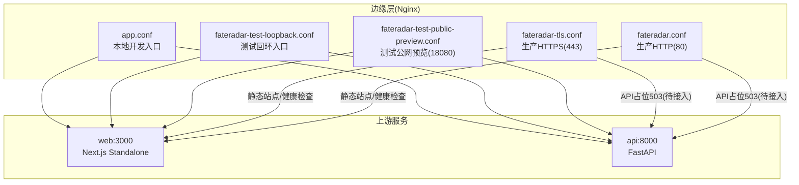
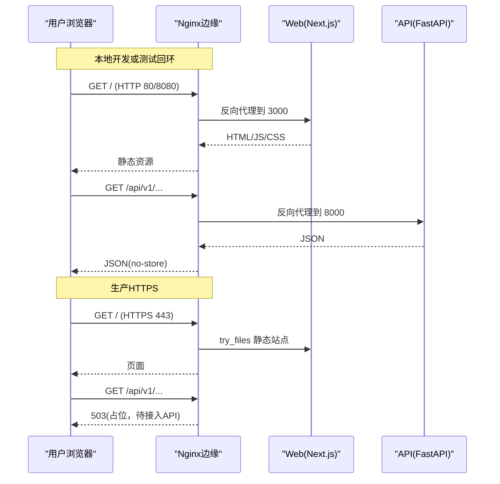
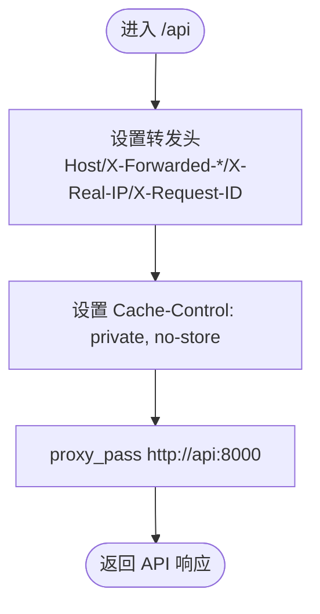
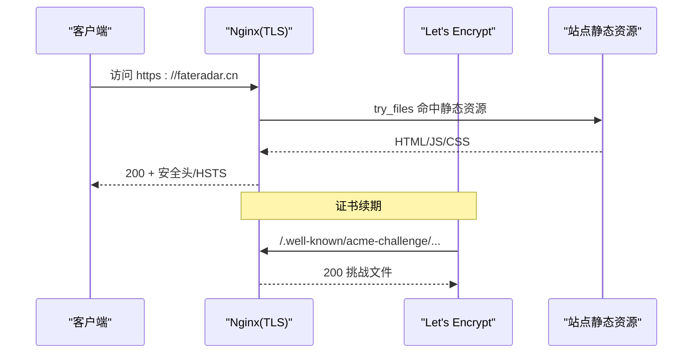
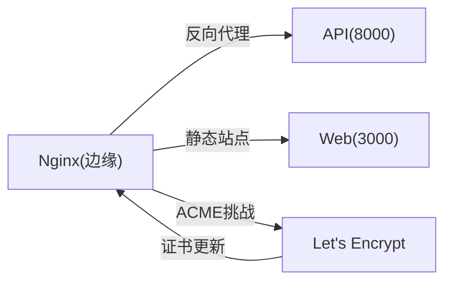

# Nginx 反向代理

<cite>
**本文引用的文件**
- [infra/nginx/app.conf](file://infra/nginx/app.conf)
- [infra/nginx/fateradar-test-loopback.conf](file://infra/nginx/fateradar-test-loopback.conf)
- [infra/nginx/fateradar-test-public-preview.conf](file://infra/nginx/fateradar-test-public-preview.conf)
- [infra/nginx/fateradar-tls.conf](file://infra/nginx/fateradar-tls.conf)
- [infra/nginx/fateradar.conf](file://infra/nginx/fateradar.conf)
- [infra/letsencrypt/reload-nginx.sh](file://infra/letsencrypt/reload-nginx.sh)
- [infra/compose.local.yml](file://infra/compose.local.yml)
- [infra/TEST_SERVER_RUNBOOK.md](file://infra/TEST_SERVER_RUNBOOK.md)
- [infra/PHASE_1_RUNBOOK.md](file://infra/PHASE_1_RUNBOOK.md)
- [tests/contract/test_infra_contract.py](file://tests/contract/test_infra_contract.py)
</cite>

## 目录
1. [简介](#简介)
2. [项目结构](#项目结构)
3. [核心组件](#核心组件)
4. [架构总览](#架构总览)
5. [详细组件分析](#详细组件分析)
6. [依赖关系分析](#依赖关系分析)
7. [性能考虑](#性能考虑)
8. [故障排查指南](#故障排查指南)
9. [结论](#结论)
10. [附录](#附录)

## 简介
本文件围绕仓库中的 Nginx 反向代理配置，系统说明生产与测试环境的差异、域名绑定、SSL/TLS 与 Let’s Encrypt 集成、请求转发规则、静态资源缓存策略、API 转发与健康检查、安全头与访问控制，以及可落地的性能优化建议。文档严格基于仓库内现有配置文件与运行手册进行归纳，避免臆测未实现的能力。

## 项目结构
Nginx 相关配置集中在 infra/nginx 目录下，按环境划分：
- 本地开发（Docker Compose）：app.conf 作为 edge 入口，将 /api 转发到后端容器 api:8000，将 / 转发到前端容器 web:3000。
- 测试服务器回环：fateradar-test-loopback.conf 仅监听 127.0.0.1:8080，不做 TLS，不绑定公网域名。
- 测试服务器临时公网预览：fateradar-test-public-preview.conf 监听 0.0.0.0:18080，纯 HTTP，用于未备案期间的公开验证。
- 生产 HTTPS：fateradar-tls.conf 提供 fateradar.cn、www.fateradar.cn、api.fateradar.cn 的 80→443 重定向与证书路径；当前 API 站点返回占位 503，待 FastAPI 上线后替换为反向代理。
- 生产 HTTP（无 TLS）：fateradar.conf 提供静态站点根目录与 API 占位响应。
- Let’s Encrypt 重载脚本：reload-nginx.sh 在证书变更后校验并重载 Nginx。
- 本地编排：compose.local.yml 通过 edge 服务挂载 app.conf，暴露 127.0.0.1:8080。

图表来源
- [infra/nginx/app.conf:1-45](file://infra/nginx/app.conf#L1-L45)
- [infra/nginx/fateradar-test-loopback.conf:1-58](file://infra/nginx/fateradar-test-loopback.conf#L1-L58)
- [infra/nginx/fateradar-test-public-preview.conf:1-46](file://infra/nginx/fateradar-test-public-preview.conf#L1-L46)
- [infra/nginx/fateradar-tls.conf:1-125](file://infra/nginx/fateradar-tls.conf#L1-L125)
- [infra/nginx/fateradar.conf:1-59](file://infra/nginx/fateradar.conf#L1-L59)
- [infra/compose.local.yml:81-90](file://infra/compose.local.yml#L81-L90)

章节来源
- [infra/nginx/app.conf:1-45](file://infra/nginx/app.conf#L1-L45)
- [infra/nginx/fateradar-test-loopback.conf:1-58](file://infra/nginx/fateradar-test-loopback.conf#L1-L58)
- [infra/nginx/fateradar-test-public-preview.conf:1-46](file://infra/nginx/fateradar-test-public-preview.conf#L1-L46)
- [infra/nginx/fateradar-tls.conf:1-125](file://infra/nginx/fateradar-tls.conf#L1-L125)
- [infra/nginx/fateradar.conf:1-59](file://infra/nginx/fateradar.conf#L1-L59)
- [infra/compose.local.yml:81-90](file://infra/compose.local.yml#L81-L90)

## 核心组件
- 统一安全头：所有 server/location 均设置 X-Content-Type-Options、X-Frame-Options、Referrer-Policy、Permissions-Policy，确保浏览器侧一致的安全基线。
- 健康检查端点：各入口提供 /healthz，便于四层/七层探针探测。
- 请求转发：
  - 本地开发：/api → api:8000，/ → web:3000。
  - 测试回环/公网预览：/api → 127.0.0.1:8000，/ → 127.0.0.1:3000。
  - 生产：当前 API 站点返回 503 占位，待接入 FastAPI 后替换为反向代理。
- 证书与域名：
  - 生产 HTTPS：fateradar.cn、www.fateradar.cn、api.fateradar.cn，使用 Let’s Encrypt 证书路径，并包含 HSTS。
  - 80→443 强制跳转，acme-challenge 放行供自动续期。
- 缓存策略：
  - API 一律 no-store，避免 Cookie/会话被缓存。
  - 静态站点使用 try_files 直接由 Nginx 提供，便于后续结合 CDN/浏览器缓存策略。

章节来源
- [infra/nginx/app.conf:10-32](file://infra/nginx/app.conf#L10-L32)
- [infra/nginx/fateradar-test-loopback.conf:20-44](file://infra/nginx/fateradar-test-loopback.conf#L20-L44)
- [infra/nginx/fateradar-test-public-preview.conf:13-33](file://infra/nginx/fateradar-test-public-preview.conf#L13-L33)
- [infra/nginx/fateradar-tls.conf:56-84](file://infra/nginx/fateradar-tls.conf#L56-L84)
- [infra/nginx/fateradar.conf:21-29](file://infra/nginx/fateradar.conf#L21-L29)

## 架构总览
下图展示从客户端到 Nginx 再到上游服务的典型请求流，覆盖本地开发与生产 HTTPS 两种场景。

图表来源
- [infra/nginx/app.conf:16-43](file://infra/nginx/app.conf#L16-L43)
- [infra/nginx/fateradar-test-loopback.conf:26-56](file://infra/nginx/fateradar-test-loopback.conf#L26-L56)
- [infra/nginx/fateradar-tls.conf:56-84](file://infra/nginx/fateradar-tls.conf#L56-L84)
- [infra/nginx/fateradar-tls.conf:99-124](file://infra/nginx/fateradar-tls.conf#L99-L124)

## 详细组件分析

### 本地开发入口（app.conf）
- 监听 80，server_name 通配，适合 Docker 内部网络。
- /api 反向代理至 http://api:8000，携带 Host/X-Forwarded-* 等头部，并强制 no-store。
- / 反向代理至 http://web:3000，用于 Next.js standalone。
- 统一安全头在 server 层声明，并在 location 中重复以确保不被覆盖。

图表来源
- [infra/nginx/app.conf:16-32](file://infra/nginx/app.conf#L16-L32)

章节来源
- [infra/nginx/app.conf:1-45](file://infra/nginx/app.conf#L1-L45)
- [tests/contract/test_infra_contract.py:19-42](file://tests/contract/test_infra_contract.py#L19-L42)

### 测试服务器回环入口（fateradar-test-loopback.conf）
- 仅监听 127.0.0.1:8080，不绑定域名、不做 TLS，适合 SSH 隧道调试。
- /api 反向代理到 127.0.0.1:8000，强制 no-store。
- / 反向代理到 127.0.0.1:3000。
- 安全头与 /healthz 同本地开发入口。

章节来源
- [infra/nginx/fateradar-test-loopback.conf:1-58](file://infra/nginx/fateradar-test-loopback.conf#L1-L58)
- [infra/TEST_SERVER_RUNBOOK.md:189-202](file://infra/TEST_SERVER_RUNBOOK.md#L189-L202)

### 测试服务器临时公网预览（fateradar-test-public-preview.conf）
- 监听 0.0.0.0:18080，纯 HTTP，用于未备案期间的外部验证。
- 转发规则与回环入口一致，但面向公网 IP。
- 需在防火墙与安全组开放 18080，并在验收完成后关闭。

章节来源
- [infra/nginx/fateradar-test-public-preview.conf:1-46](file://infra/nginx/fateradar-test-public-preview.conf#L1-L46)
- [infra/TEST_SERVER_RUNBOOK.md:203-235](file://infra/TEST_SERVER_RUNBOOK.md#L203-L235)

### 生产 HTTPS（fateradar-tls.conf）
- 域名：fateradar.cn、www.fateradar.cn、api.fateradar.cn。
- 80→443 强制跳转，acme-challenge 放行以支持 Let’s Encrypt 自动续期。
- 证书路径指向 /etc/letsencrypt/live/fateradar.cn/*，启用 HSTS 与基础安全头。
- 网站根目录 /var/www/fateradar/current，使用 try_files 提供 SPA 路由。
- API 站点当前返回 503 占位，注释指明上线后替换为对 127.0.0.1:8000 的反向代理。

图表来源
- [infra/nginx/fateradar-tls.conf:8-22](file://infra/nginx/fateradar-tls.conf#L8-L22)
- [infra/nginx/fateradar-tls.conf:24-38](file://infra/nginx/fateradar-tls.conf#L24-L38)
- [infra/nginx/fateradar-tls.conf:40-54](file://infra/nginx/fateradar-tls.conf#L40-L54)
- [infra/nginx/fateradar-tls.conf:56-84](file://infra/nginx/fateradar-tls.conf#L56-L84)
- [infra/nginx/fateradar-tls.conf:99-124](file://infra/nginx/fateradar-tls.conf#L99-L124)

章节来源
- [infra/nginx/fateradar-tls.conf:1-125](file://infra/nginx/fateradar-tls.conf#L1-L125)
- [infra/letsencrypt/reload-nginx.sh:1-6](file://infra/letsencrypt/reload-nginx.sh#L1-L6)

### 生产 HTTP（fateradar.conf）
- 默认拒绝未知主机（return 444）。
- fateradar.cn 提供静态站点根目录与 SPA 路由。
- www.fateradar.cn 与 api.fateradar.cn 分别做 301 跳转与 API 占位。

章节来源
- [infra/nginx/fateradar.conf:1-59](file://infra/nginx/fateradar.conf#L1-L59)

### 本地编排与进程边界（compose.local.yml）
- edge 服务挂载 app.conf 到容器默认配置位置，映射 127.0.0.1:8080:80。
- api 与 web 分别监听 8000 与 3000，edge 在同一 origin 下聚合，避免跨域问题。

章节来源
- [infra/compose.local.yml:81-90](file://infra/compose.local.yml#L81-L90)
- [infra/PHASE_1_RUNBOOK.md:21-31](file://infra/PHASE_1_RUNBOOK.md#L21-L31)

## 依赖关系分析
- Nginx 与上游：
  - 本地：app.conf 依赖 docker 网络中的 api:8000 与 web:3000。
  - 测试/生产：回环/预览配置依赖本机 127.0.0.1:8000/3000；生产 HTTPS 当前未接入 API，返回占位。
- 证书管理：
  - acme-challenge 路径由 Nginx 提供，证书存放于 /etc/letsencrypt/live/fateradar.cn。
  - 证书变更后通过 reload-nginx.sh 执行 nginx -t 与 systemctl reload nginx。

图表来源
- [infra/nginx/app.conf:16-43](file://infra/nginx/app.conf#L16-L43)
- [infra/nginx/fateradar-tls.conf:13-17](file://infra/nginx/fateradar-tls.conf#L13-L17)
- [infra/nginx/fateradar-tls.conf:56-84](file://infra/nginx/fateradar-tls.conf#L56-L84)
- [infra/letsencrypt/reload-nginx.sh:1-6](file://infra/letsencrypt/reload-nginx.sh#L1-L6)

章节来源
- [infra/nginx/app.conf:16-43](file://infra/nginx/app.conf#L16-L43)
- [infra/nginx/fateradar-tls.conf:13-17](file://infra/nginx/fateradar-tls.conf#L13-L17)
- [infra/letsencrypt/reload-nginx.sh:1-6](file://infra/letsencrypt/reload-nginx.sh#L1-L6)

## 性能考虑
以下建议基于仓库现有配置模式与通用实践，便于在生产落地时逐步增强：
- 静态资源缓存策略
  - 浏览器缓存：可在静态资源 location 增加 expires/Cache-Control 指令，区分 HTML 与 JS/CSS/图片的缓存时长。
  - CDN 集成：将静态资源域名拆分至独立子域名，配合 CDN 缓存与压缩；Nginx 层保留必要的安全头。
  - 缓存失效：采用文件名哈希或版本化 URL，必要时通过 CDN 刷新或 Nginx 重写规则快速失效。
- API 请求转发
  - 负载均衡：当 API 多实例时，可使用 upstream 块与 ip_hash/least_conn 策略；当前单实例可直接 proxy_pass。
  - 健康检查：利用 /healthz 或应用健康接口，结合外部探针或上层负载均衡器进行摘除/恢复。
  - 故障转移：配置 proxy_next_upstream 与超时重试，提升容错能力。
- HTTPS 与连接优化
  - 启用 HTTP/2 与 OCSP Stapling（需证书支持），减少握手开销。
  - 合理设置 keepalive 与 worker_connections，匹配并发模型。
  - 启用 gzip 或 brotli 压缩，针对文本类资源开启压缩。
- 内存与 I/O
  - 调整 sendfile、tcp_nopush、open_file_cache 等参数，降低磁盘 I/O 压力。
  - 限制日志体积与轮转策略，避免磁盘写放大。

[本节为通用指导，不直接分析具体代码文件]

## 故障排查指南
- 健康检查
  - 边缘层：curl 访问 /healthz，确认 Nginx 自身存活。
  - 上游层：通过 /api/v1/health/live 与 /api/v1/health/ready 验证 API 状态。
- 常见错误定位
  - 502/504：检查上游端口是否监听、Nginx 转发地址是否正确、防火墙/安全组是否放行。
  - 证书错误：确认 acme-challenge 可达、证书路径正确、reload 成功。
  - 跨域/同源问题：本地开发通过 edge 保持同源；生产如需跨域，应在 API 层或网关层处理。
- 回滚与重启
  - 切换 current symlink 后重启 systemd 单元与 Nginx。
  - 证书变更后执行 reload-nginx.sh 完成重载。

章节来源
- [infra/TEST_SERVER_RUNBOOK.md:237-265](file://infra/TEST_SERVER_RUNBOOK.md#L237-L265)
- [infra/letsencrypt/reload-nginx.sh:1-6](file://infra/letsencrypt/reload-nginx.sh#L1-L6)

## 结论
本仓库的 Nginx 配置已覆盖本地开发、测试回环、临时公网预览与生产 HTTPS 的基础需求。生产环境当前 API 站点仍为占位，待 FastAPI 上线后替换为反向代理即可形成完整链路。建议在后续迭代中补充静态资源缓存策略、CDN 集成、负载均衡与健康检查，以提升性能与可用性。

[本节为总结性内容，不直接分析具体代码文件]

## 附录
- 关键差异对照
  - 域名绑定：测试回环不绑定域名；生产使用 fateradar.cn、www.fateradar.cn、api.fateradar.cn。
  - SSL 证书：生产使用 Let’s Encrypt 证书路径，并启用 HSTS；测试回环/预览不使用 TLS。
  - 请求转发：本地与测试回环将 /api 与 / 分别转发到 8000/3000；生产 API 暂返回 503。
  - 缓存策略：API 一律 no-store；静态站点由 Nginx 直接提供，便于后续扩展缓存。
- 参考文件
  - 本地编排：[infra/compose.local.yml:81-90](file://infra/compose.local.yml#L81-L90)
  - 测试服务器部署步骤：[infra/TEST_SERVER_RUNBOOK.md:189-235](file://infra/TEST_SERVER_RUNBOOK.md#L189-L235)
  - 本地运行入口说明：[infra/PHASE_1_RUNBOOK.md:13-20](file://infra/PHASE_1_RUNBOOK.md#L13-L20)