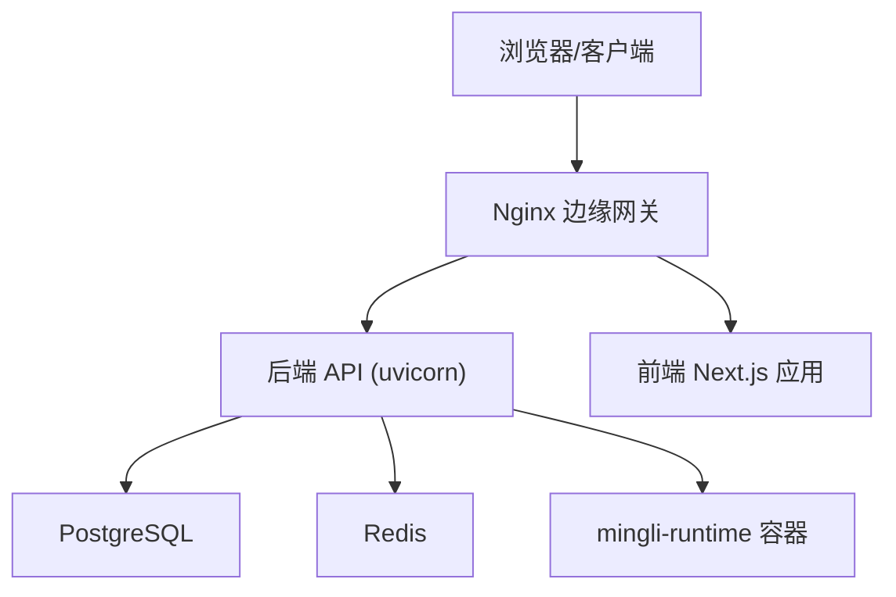
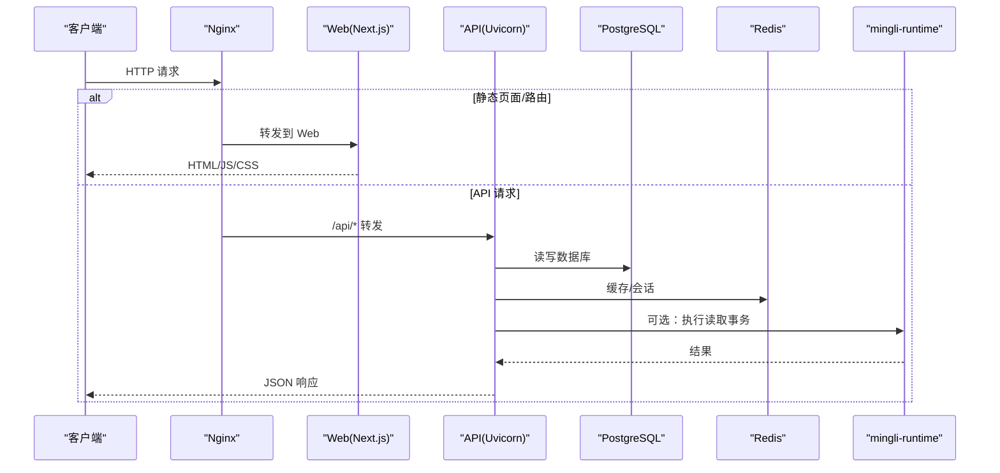
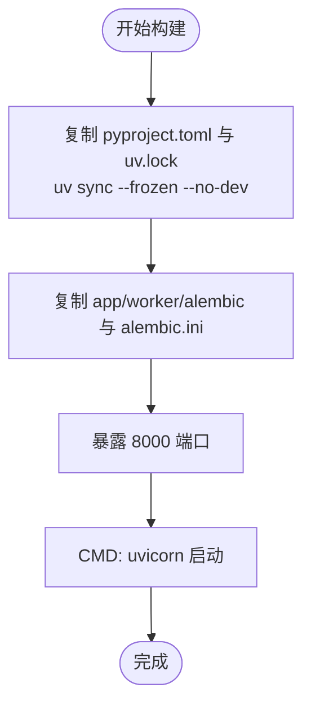
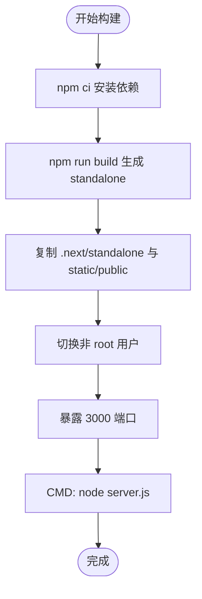
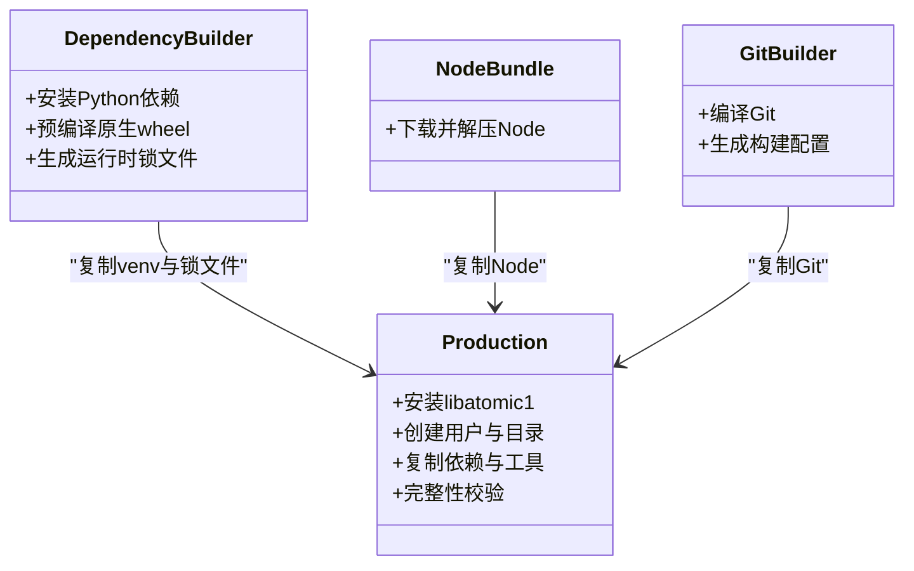
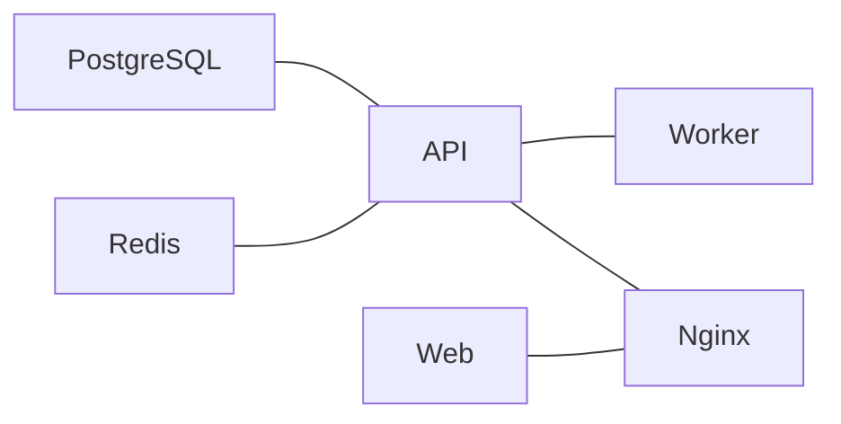
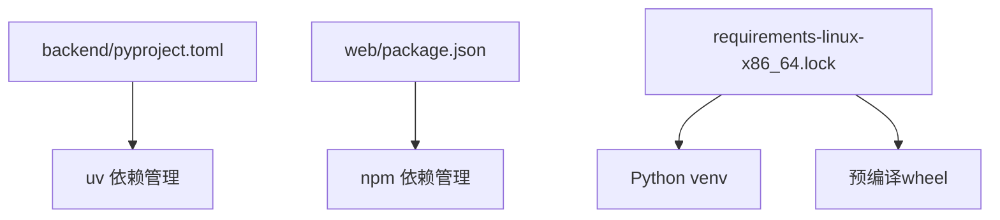

# 容器化部署

<cite>
**本文引用的文件**
- [backend.Dockerfile](file://infra/docker/backend.Dockerfile)
- [web.Dockerfile](file://infra/docker/web.Dockerfile)
- [compose.local.yml](file://infra/compose.local.yml)
- [app.conf](file://infra/nginx/app.conf)
- [pyproject.toml](file://backend/pyproject.toml)
- [package.json（前端）](file://web/package.json)
- [package.json（管理端）](file://admin/package.json)
- [.dockerignore](file://.dockerignore)
- [Dockerfile（mingli-runtime）](file://infra/mingli-runtime/Dockerfile)
- [README.md（mingli-runtime）](file://infra/mingli-runtime/README.md)
- [prepare_linux_inputs.py](file://infra/mingli-runtime/prepare_linux_inputs.py)
- [verify_release.py](file://infra/mingli-runtime/verify_release.py)
- [emit_sbom.py](file://infra/mingli-runtime/emit_sbom.py)
- [linux_identity.py](file://infra/mingli-runtime/linux_identity.py)
- [fateradar-test.env.example](file://infra/fateradar-test.env.example)
</cite>

## 目录
1. [简介](#简介)
2. [项目结构](#项目结构)
3. [核心组件](#核心组件)
4. [架构总览](#架构总览)
5. [详细组件分析](#详细组件分析)
6. [依赖关系分析](#依赖关系分析)
7. [性能与优化](#性能与优化)
8. [故障排查指南](#故障排查指南)
9. [结论](#结论)
10. [附录](#附录)

## 简介
本文件面向容器化部署，系统性说明后端、前端与 mingli-runtime 的镜像构建流程、多阶段构建策略与镜像优化技巧；给出 Docker Compose 编排配置与服务间网络、数据卷管理；解释本地开发环境的容器化启动方式（含持久化与热重载建议）；并总结镜像安全扫描与漏洞修复的最佳实践。

## 项目结构
仓库采用前后端分离与独立运行时隔离的架构：
- 后端服务：FastAPI + Uvicorn，使用 uv 进行依赖管理与安装，通过 Dockerfile 多阶段构建最小运行镜像。
- 前端应用：Next.js 应用，构建为 standalone 产物后以 Node 运行时运行。
- 边缘网关：Nginx 反向代理，统一入口与安全头。
- 运行时：mingli-runtime 提供可审计、可复现的 Linux 执行环境，包含固定版本的 Python、Node、Git 以及原生二进制依赖。

图表来源
- [compose.local.yml:31-79](file://infra/compose.local.yml#L31-L79)
- [app.conf:16-43](file://infra/nginx/app.conf#L16-L43)

章节来源
- [compose.local.yml:1-93](file://infra/compose.local.yml#L1-L93)
- [app.conf:1-45](file://infra/nginx/app.conf#L1-L45)

## 核心组件
- 后端镜像构建：基于 python slim 基础镜像，使用 uv 冻结安装生产依赖，仅拷贝必要代码与迁移脚本，暴露 8000 端口并以 Uvicorn 启动。
- 前端镜像构建：依赖安装阶段与构建阶段分离，构建时注入后端内部地址环境变量，最终产物为 standalone 模式，以非 root 用户运行。
- 运行时镜像：严格锁定基础镜像摘要，分阶段构建 Python 虚拟环境、预编译原生 wheel、打包 Node 与 Git，并在生产阶段校验完整性与版本一致性。
- 编排与网络：Compose 定义 PostgreSQL、Redis、API、Worker、Web、Nginx 服务，设置健康检查、端口映射与数据卷；Nginx 将 /api 转发至 API，其余转发至 Web。

章节来源
- [backend.Dockerfile:1-23](file://infra/docker/backend.Dockerfile#L1-L23)
- [web.Dockerfile:1-27](file://infra/docker/web.Dockerfile#L1-L27)
- [Dockerfile（mingli-runtime）:1-229](file://infra/mingli-runtime/Dockerfile#L1-L229)
- [compose.local.yml:1-93](file://infra/compose.local.yml#L1-L93)
- [app.conf:1-45](file://infra/nginx/app.conf#L1-L45)

## 架构总览
下图展示本地开发环境的服务拓扑与请求路径：客户端经 Nginx 进入，静态资源由 Web 提供，API 调用由后端处理，数据落盘于 PostgreSQL，缓存与任务队列由 Redis 支撑，业务计算可能委托给 mingli-runtime。

图表来源
- [compose.local.yml:31-89](file://infra/compose.local.yml#L31-L89)
- [app.conf:16-43](file://infra/nginx/app.conf#L16-L43)

## 详细组件分析

### 后端镜像构建（backend.Dockerfile）
- 多阶段构建：先利用 uv 镜像完成依赖解析与安装，再在 slim Python 镜像中复制已安装的依赖与源码，避免携带构建工具链。
- 依赖管理：使用 pyproject.toml 与 uv.lock 冻结依赖，安装时启用 frozen 模式确保可重复性。
- 运行配置：设置 Python 环境变量，暴露 8000 端口，以 Uvicorn 启动 FastAPI 应用。
- 体积优化：仅拷贝 app、worker、alembic 与 alembic.ini，排除无关目录；使用 slim 基础镜像减少系统包。

图表来源
- [backend.Dockerfile:1-23](file://infra/docker/backend.Dockerfile#L1-L23)
- [pyproject.toml:1-58](file://backend/pyproject.toml#L1-L58)

章节来源
- [backend.Dockerfile:1-23](file://infra/docker/backend.Dockerfile#L1-L23)
- [pyproject.toml:1-58](file://backend/pyproject.toml#L1-L58)

### 前端镜像构建（web.Dockerfile）
- 多阶段构建：dependencies 阶段安装依赖；build 阶段构建 Next.js standalone 产物；runtime 阶段仅复制构建产物与 public 资源。
- 环境变量：构建时注入 BACKEND_INTERNAL_URL，用于生成对后端的静态引用；运行期设置 NODE_ENV、端口等。
- 安全与体积：以非 root 用户 nextjs 运行；仅包含 .next/standalone 与静态资源，显著减小镜像体积。

图表来源
- [web.Dockerfile:1-27](file://infra/docker/web.Dockerfile#L1-L27)
- [package.json（前端）:1-46](file://web/package.json#L1-L46)

章节来源
- [web.Dockerfile:1-27](file://infra/docker/web.Dockerfile#L1-L27)
- [package.json（前端）:1-46](file://web/package.json#L1-L46)

### 运行时镜像（mingli-runtime）
- 基础镜像锁定：使用带摘要的 python:3.14.6-slim-bookworm，确保可重现构建。
- 依赖构建：创建 venv，按锁文件安装依赖，下载并预编译 sxtwl 等原生扩展，双通道构建并比对产物哈希，保证一致性与可审计性。
- 工具链集成：内嵌 Node 与自编译 Git，固定版本并通过校验。
- 生产阶段：添加 libatomic1 依赖，创建专用用户与目录，复制依赖与环境，执行完整性验证，设置只读权限与不可变工件标记。
- 入口命令：默认执行读取事务脚本，便于统一调度与审计。

图表来源
- [Dockerfile（mingli-runtime）:1-229](file://infra/mingli-runtime/Dockerfile#L1-L229)

章节来源
- [Dockerfile（mingli-runtime）:1-229](file://infra/mingli-runtime/Dockerfile#L1-L229)
- [README.md（mingli-runtime）:1-46](file://infra/mingli-runtime/README.md#L1-L46)

### 编排与网络（compose.local.yml）
- 服务定义：
  - postgres：PostgreSQL 16，健康检查，数据持久化到命名卷。
  - redis：Redis 7，禁用持久化用于本地测试。
  - api：后端服务，连接数据库与缓存，监听 8000。
  - worker：后台任务进程，轮询间隔可调。
  - web：前端服务，构建时注入后端地址，监听 3000。
  - edge：Nginx 反向代理，将 /api 转发到 API，其余转发到 Web。
- 网络与端口：所有服务通过 Compose 内置网络互通；对外仅暴露 5432、6379、8000、3000、8080 到本地回环地址。
- 数据卷：postgres-data 持久化数据库文件。

图表来源
- [compose.local.yml:4-93](file://infra/compose.local.yml#L4-L93)

章节来源
- [compose.local.yml:1-93](file://infra/compose.local.yml#L1-L93)

### 边缘网关（Nginx）
- 安全头：全局设置 X-Content-Type-Options、X-Frame-Options、Referrer-Policy、Permissions-Policy。
- 路由规则：/healthz 返回健康信息；/api/* 反向代理到 API；/ 反向代理到 Web。
- 请求头透传：Host、X-Forwarded-*、X-Real-IP、X-Request-ID。

章节来源
- [app.conf:1-45](file://infra/nginx/app.conf#L1-L45)

### 环境变量与配置
- 后端与 Worker：通过 compose 注入 MINGLI_* 系列环境变量，包括数据库 URL、Cookie 安全标志、OTP 适配器、可信代理网段、身份哈希密钥等。
- 前端：构建时通过 ARG 注入 BACKEND_INTERNAL_URL，运行期设置 NODE_ENV。
- 测试环境示例：参考 fateradar-test.env.example 中的占位值与说明，替换为实际值后再部署。

章节来源
- [compose.local.yml:31-79](file://infra/compose.local.yml#L31-L79)
- [web.Dockerfile:8-12](file://infra/docker/web.Dockerfile#L8-L12)
- [fateradar-test.env.example:1-45](file://infra/fateradar-test.env.example#L1-L45)

## 依赖关系分析
- 后端依赖：FastAPI、SQLAlchemy、asyncpg、Alembic、Uvicorn 等，通过 pyproject.toml 声明，uv.lock 锁定版本。
- 前端依赖：Next.js、React、Radix UI、Zod 等，通过 package.json 声明。
- 运行时依赖：固定版本的 Python、Node、Git 与若干原生库（如 sxtwl、astronomy-engine、cnlunar），通过锁文件与预编译 wheel 保障可重复性。

图表来源
- [pyproject.toml:1-58](file://backend/pyproject.toml#L1-L58)
- [package.json（前端）:1-46](file://web/package.json#L1-L46)
- [Dockerfile（mingli-runtime）:28-82](file://infra/mingli-runtime/Dockerfile#L28-L82)

章节来源
- [pyproject.toml:1-58](file://backend/pyproject.toml#L1-L58)
- [package.json（前端）:1-46](file://web/package.json#L1-L46)
- [Dockerfile（mingli-runtime）:28-82](file://infra/mingli-runtime/Dockerfile#L28-L82)

## 性能与优化
- 多阶段构建：将依赖安装与构建过程与运行镜像分离，显著减小镜像体积并提升拉取速度。
- 依赖冻结：使用 uv.lock、package-lock.json 与 lock 文件确保构建可重复，避免“在我机器上能跑”的问题。
- 最小运行时：后端使用 slim 基础镜像；前端使用 standalone 构建；运行时镜像仅包含必要二进制与库。
- 构建缓存：合理组织 COPY 顺序，优先复制不变文件（如依赖清单）以提升缓存命中率。
- 网络与端口：仅暴露必要端口到本地回环，降低攻击面。
- 健康检查：为关键服务配置健康检查，提高编排稳定性。

[本节为通用指导，不直接分析具体文件]

## 故障排查指南
- 构建失败或依赖冲突：
  - 确认依赖锁文件与基础镜像版本是否匹配；检查 uv sync 与 npm ci 的输出。
  - 对于原生依赖（如 sxtwl），确认预编译 wheel 与目标平台一致。
- 运行时错误：
  - 检查环境变量是否正确注入（数据库 URL、Cookie 安全标志、OTP 适配器等）。
  - 查看 Nginx 日志与上游服务健康状态，确认反向代理配置无误。
- 数据持久化问题：
  - 确认 postgres-data 卷存在且权限正确；必要时清理并重建。
- 安全与合规：
  - 使用 verify_release.py 与 emit_sbom.py 生成 SBOM 并校验组件清单。
  - 使用 linux_identity.py 校验 OCI 索引与签名附注，确保镜像未被篡改。
  - 参考 prepare_linux_inputs.py 的流程，确保构建上下文与输入摘要一致。

章节来源
- [verify_release.py:1754-1795](file://infra/mingli-runtime/verify_release.py#L1754-L1795)
- [emit_sbom.py:349-383](file://infra/mingli-runtime/emit_sbom.py#L349-L383)
- [linux_identity.py:287-319](file://infra/mingli-runtime/linux_identity.py#L287-L319)
- [prepare_linux_inputs.py:229-262](file://infra/mingli-runtime/prepare_linux_inputs.py#L229-L262)
- [prepare_linux_inputs.py:370-464](file://infra/mingli-runtime/prepare_linux_inputs.py#L370-L464)

## 结论
本项目通过多阶段构建、依赖冻结与最小化运行时，实现了高效、可重复、可审计的容器化部署。Compose 编排提供了完整的本地开发环境，Nginx 作为统一入口增强了安全性与可维护性。mingli-runtime 通过严格的版本锁定与完整性校验，确保了计算环境的稳定与可追溯。结合 SBOM 与镜像校验工具，可在发布前发现并修复潜在漏洞，满足生产环境的安全要求。

[本节为总结，不直接分析具体文件]

## 附录

### 本地开发环境容器化启动指南
- 启动服务：
  - 使用 Compose 启动全部服务，等待健康检查通过后访问 http://127.0.0.1:8080。
  - 如需单独调试前端或后端，可直接访问对应端口（3000、8000）。
- 数据持久化：
  - 数据库数据保存在 postgres-data 卷中，重启容器不会丢失。
- 热重载建议：
  - 前端：可使用 Next.js 开发模式配合挂载源码目录实现热重载（需调整 Compose 配置以挂载源码而非构建产物）。
  - 后端：可使用 Uvicorn 的 reload 参数配合源码挂载实现热重载（需调整 Compose 配置以挂载源码目录）。
- 环境变量：
  - 根据 fateradar-test.env.example 准备本地环境变量，替换占位值为实际值。

章节来源
- [compose.local.yml:4-93](file://infra/compose.local.yml#L4-L93)
- [fateradar-test.env.example:1-45](file://infra/fateradar-test.env.example#L1-L45)

### 镜像安全扫描与漏洞修复最佳实践
- 基线选择：
  - 使用官方 slim 或 distroless 基础镜像，减少攻击面。
  - 锁定基础镜像摘要，避免隐式升级。
- 依赖管理：
  - 使用锁文件（uv.lock、package-lock.json、requirements-*-lock）冻结依赖。
  - 仅安装生产依赖，移除构建工具与调试符号。
- 构建安全：
  - 多阶段构建，最小化最终镜像。
  - 非 root 用户运行，限制文件系统写入权限。
- 扫描与修复：
  - 使用镜像扫描工具（如 Trivy、Grype）定期扫描，关注高危漏洞。
  - 及时更新依赖与基础镜像，重新构建并验证。
- 可审计性：
  - 生成 SBOM（CycloneDX），记录组件版本与来源。
  - 使用 verify_release.py 与 linux_identity.py 校验镜像完整性与签名附注。

章节来源
- [emit_sbom.py:349-383](file://infra/mingli-runtime/emit_sbom.py#L349-L383)
- [verify_release.py:1754-1795](file://infra/mingli-runtime/verify_release.py#L1754-L1795)
- [linux_identity.py:287-319](file://infra/mingli-runtime/linux_identity.py#L287-L319)