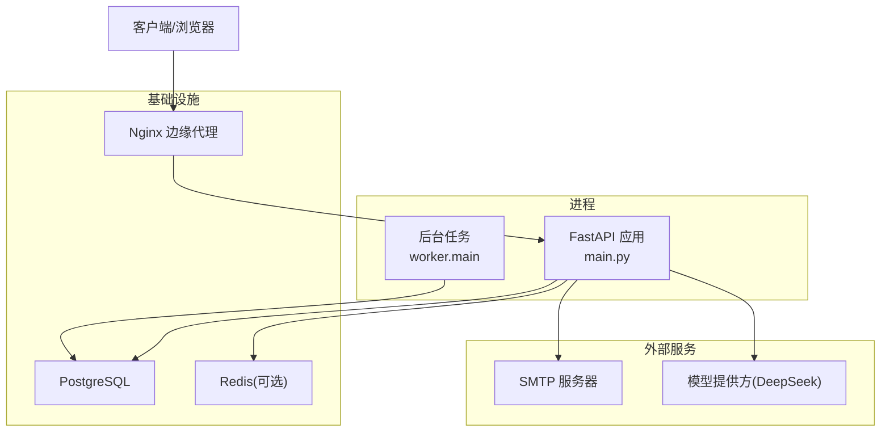
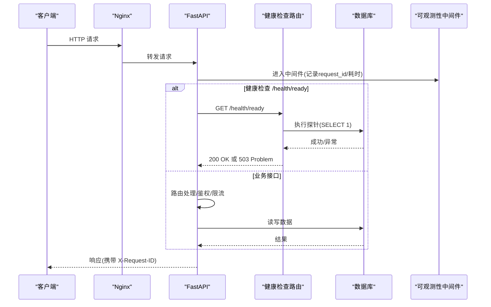
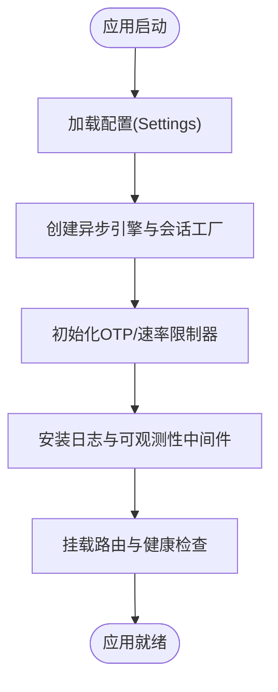
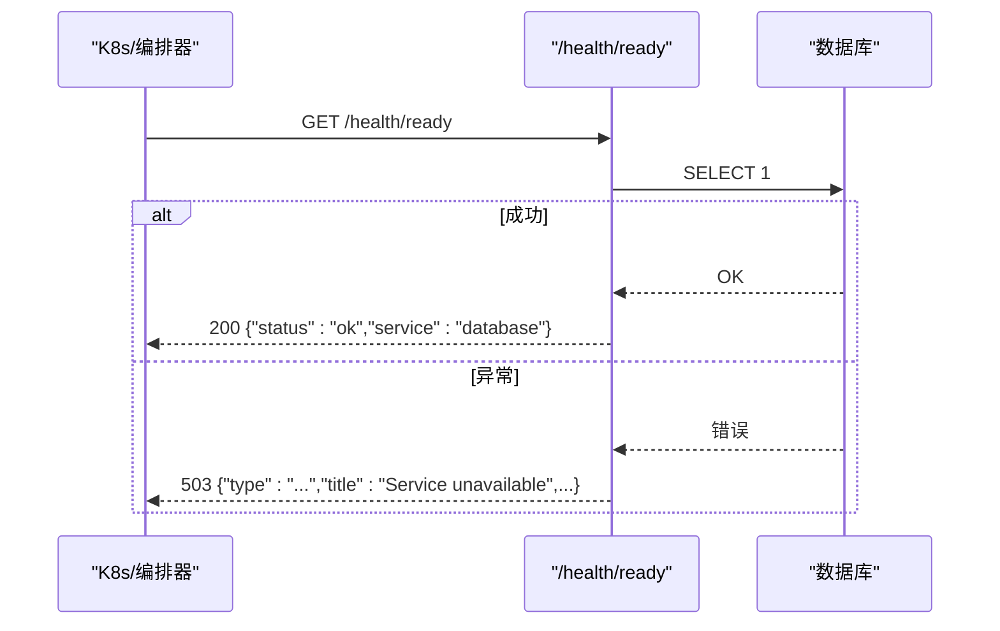
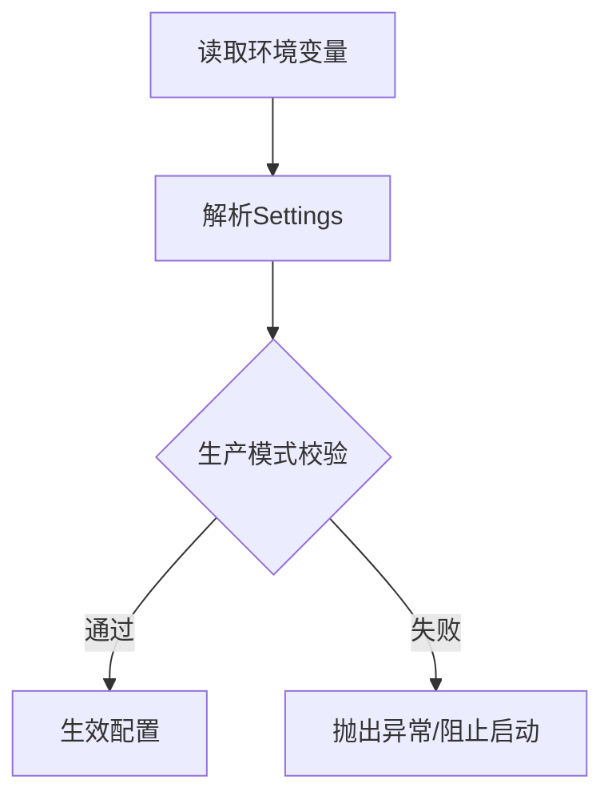
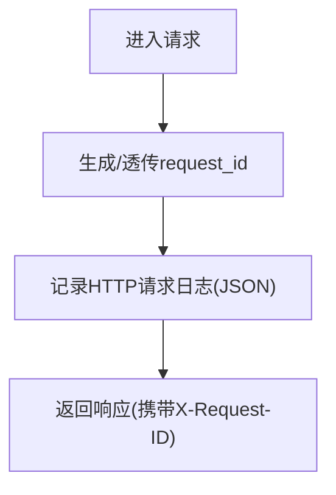
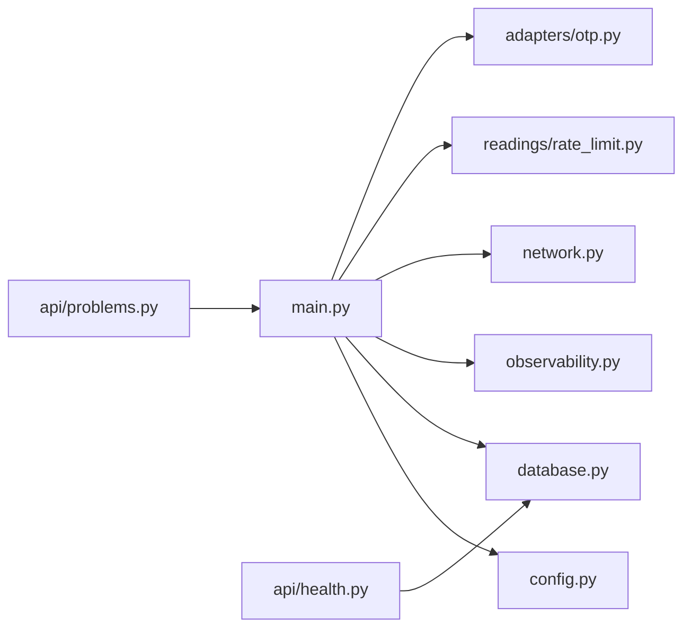

# 故障排查

<cite>
**本文引用的文件**
- [backend/app/main.py](file://backend/app/main.py)
- [backend/app/config.py](file://backend/app/config.py)
- [backend/app/database.py](file://backend/app/database.py)
- [backend/app/observability.py](file://backend/app/observability.py)
- [backend/app/network.py](file://backend/app/network.py)
- [backend/app/api/errors.py](file://backend/app/api/errors.py)
- [backend/app/api/health.py](file://backend/app/api/health.py)
- [backend/app/api/problems.py](file://backend/app/api/problems.py)
- [backend/app/readings/rate_limit.py](file://backend/app/readings/rate_limit.py)
- [backend/app/adapters/otp.py](file://backend/app/adapters/otp.py)
- [backend/app/adapters/payment.py](file://backend/app/adapters/payment.py)
- [infra/compose.local.yml](file://infra/compose.local.yml)
- [infra/fateradar-test.env.example](file://infra/fateradar-test.env.example)
</cite>

## 目录
1. [简介](#简介)
2. [项目结构](#项目结构)
3. [核心组件](#核心组件)
4. [架构总览](#架构总览)
5. [详细组件分析](#详细组件分析)
6. [依赖关系分析](#依赖关系分析)
7. [性能注意事项](#性能注意事项)
8. [故障排查指南](#故障排查指南)
9. [结论](#结论)
10. [附录](#附录)

## 简介
本指南面向运维与研发人员，聚焦于服务启动失败、数据库连接问题、API 超时与性能瓶颈、日志分析方法、网络问题诊断、第三方服务集成（短信/邮件/支付）、数据库故障恢复流程以及完整的故障响应与回滚策略。内容基于后端 FastAPI 应用、健康检查、配置校验、速率限制、可观测性中间件、SMTP 邮件发送、本地编排与测试环境等实现进行系统化梳理。

## 项目结构
后端采用模块化单体架构：FastAPI 应用负责路由、异常处理、可观测性与依赖装配；数据库通过异步 SQLAlchemy 管理；OTP 邮件通过 SMTP 适配器发送；配置集中且带生产安全校验；健康检查提供存活与就绪探针；速率限制保护写路径；本地编排使用 Docker Compose 拉起 Postgres、Redis、API、Worker、Web 与 Nginx 边缘。

图表来源
- [backend/app/main.py:30-155](file://backend/app/main.py#L30-L155)
- [infra/compose.local.yml:31-89](file://infra/compose.local.yml#L31-L89)

章节来源
- [backend/app/main.py:30-155](file://backend/app/main.py#L30-L155)
- [infra/compose.local.yml:31-89](file://infra/compose.local.yml#L31-L89)

## 核心组件
- 应用生命周期与装配：创建 FastAPI 实例、注册异常处理器、安装请求可观测性中间件、挂载路由、注入 OTP 适配器与速率限制器。
- 配置与安全：集中式 Settings，严格的生产模式校验（Cookie Secure、禁用 fake 适配器、固定运行时路径、白名单模型参数、超时上限约束等）。
- 数据库连接：异步引擎与会话工厂，提供探针与清理能力。
- 健康检查：/health/live 与 /health/ready，后者调用数据库探针并返回标准化问题体。
- 可观测性：统一 JSON 日志输出，自动注入 request_id，屏蔽敏感传输层日志。
- 网络与代理：解析可信代理网段，安全提取客户端真实 IP。
- 速率限制：滑动窗口限流，保护写接口。
- 第三方适配：OTP 邮件（SMTP）与支付网关抽象（含 Fake 实现）。

章节来源
- [backend/app/main.py:30-155](file://backend/app/main.py#L30-L155)
- [backend/app/config.py:62-335](file://backend/app/config.py#L62-L335)
- [backend/app/database.py:12-33](file://backend/app/database.py#L12-L33)
- [backend/app/api/health.py:11-36](file://backend/app/api/health.py#L11-L36)
- [backend/app/observability.py:14-52](file://backend/app/observability.py#L14-L52)
- [backend/app/network.py:16-72](file://backend/app/network.py#L16-L72)
- [backend/app/readings/rate_limit.py:9-61](file://backend/app/readings/rate_limit.py#L9-L61)
- [backend/app/adapters/otp.py:16-129](file://backend/app/adapters/otp.py#L16-L129)
- [backend/app/adapters/payment.py:6-92](file://backend/app/adapters/payment.py#L6-L92)

## 架构总览
下图展示一次典型 HTTP 请求从进入应用到返回响应的关键路径，包括健康检查、异常处理、日志记录与依赖探测。

图表来源
- [backend/app/main.py:115-140](file://backend/app/main.py#L115-L140)
- [backend/app/api/health.py:11-36](file://backend/app/api/health.py#L11-L36)
- [backend/app/database.py:23-28](file://backend/app/database.py#L23-L28)
- [backend/app/observability.py:27-52](file://backend/app/observability.py#L27-L52)

## 详细组件分析

### 应用启动与异常处理
- 启动时加载 Settings，构建 Database，注册 OTP 适配器（production/test/local 不同行为），初始化多个 WindowRateLimiter，设置可信代理网段，安装日志与可观测性中间件，挂载路由。
- 自定义异常处理器将 ApiProblem 与 RequestValidationError 统一转换为 application/problem+json 格式，并附带 request_id。

图表来源
- [backend/app/main.py:30-155](file://backend/app/main.py#L30-L155)
- [backend/app/config.py:62-335](file://backend/app/config.py#L62-L335)
- [backend/app/database.py:12-33](file://backend/app/database.py#L12-L33)

章节来源
- [backend/app/main.py:30-155](file://backend/app/main.py#L30-L155)
- [backend/app/api/errors.py:1-17](file://backend/app/api/errors.py#L1-L17)
- [backend/app/api/problems.py:5-28](file://backend/app/api/problems.py#L5-L28)

### 健康检查与就绪探针
- /health/live 快速返回服务存活。
- /health/ready 调用数据库探针，失败时返回 503 与标准化问题体，便于编排系统剔除不健康实例。

图表来源
- [backend/app/api/health.py:11-36](file://backend/app/api/health.py#L11-L36)
- [backend/app/database.py:23-28](file://backend/app/database.py#L23-L28)
- [backend/app/api/problems.py:5-28](file://backend/app/api/problems.py#L5-L28)

章节来源
- [backend/app/api/health.py:11-36](file://backend/app/api/health.py#L11-L36)
- [backend/app/database.py:23-28](file://backend/app/database.py#L23-L28)

### 配置与安全校验
- 所有运行时参数通过环境变量注入，生产环境强制启用安全 Cookie、禁止 fake 适配器、固定运行时路径、白名单模型参数与超时上限、加密密钥长度与来源校验等。
- 若校验失败，应用将无法启动，便于在部署阶段暴露配置错误。

图表来源
- [backend/app/config.py:62-335](file://backend/app/config.py#L62-L335)

章节来源
- [backend/app/config.py:62-335](file://backend/app/config.py#L62-L335)

### 可观测性与日志
- 每个请求生成 request_id（优先使用请求头，否则随机），写入响应头 X-Request-ID。
- 统一 JSON 日志包含事件类型、方法、路径、状态码、耗时毫秒，便于检索与聚合。
- 屏蔽 httpx/httpcore/h2/hpack 的敏感日志。

图表来源
- [backend/app/observability.py:14-52](file://backend/app/observability.py#L14-L52)

章节来源
- [backend/app/observability.py:14-52](file://backend/app/observability.py#L14-L52)

### 网络与代理
- 支持解析可信代理 CIDR，仅信任来自可信网络的 X-Forwarded-For，避免伪造客户端 IP。
- 对 IPv4/IPv6 地址进行规范化，便于审计与限流。

章节来源
- [backend/app/network.py:16-72](file://backend/app/network.py#L16-L72)

### 速率限制
- 基于滑动窗口的内存限流器，保护读/写操作，超限返回重试时间。
- 应用内多个独立限流器分别保护阅读写入、个人资料写入、访客会话创建、管理员登录等。

章节来源
- [backend/app/readings/rate_limit.py:9-61](file://backend/app/readings/rate_limit.py#L9-L61)
- [backend/app/main.py:73-88](file://backend/app/main.py#L73-L88)

### 第三方服务集成
- OTP 邮件：支持 smtp 适配器，强制 TLS（STARTTLS 或 SSL），拒绝明文；生产环境在未实现持久化挑战存储前默认关闭投递。
- 支付网关：定义协议与 Fake 实现，便于隔离外部依赖与测试。

章节来源
- [backend/app/adapters/otp.py:16-129](file://backend/app/adapters/otp.py#L16-L129)
- [backend/app/adapters/payment.py:6-92](file://backend/app/adapters/payment.py#L6-L92)

## 依赖关系分析
- 应用依赖数据库、配置、可观测性、网络工具、速率限制与第三方适配器。
- 健康检查依赖数据库探针。
- 编排依赖 Docker Compose 提供的 Postgres、Redis、API、Worker、Web、Nginx。

图表来源
- [backend/app/main.py:30-155](file://backend/app/main.py#L30-L155)
- [backend/app/api/health.py:11-36](file://backend/app/api/health.py#L11-L36)
- [backend/app/api/problems.py:5-28](file://backend/app/api/problems.py#L5-L28)

章节来源
- [backend/app/main.py:30-155](file://backend/app/main.py#L30-L155)
- [backend/app/api/health.py:11-36](file://backend/app/api/health.py#L11-L36)
- [backend/app/api/problems.py:5-28](file://backend/app/api/problems.py#L5-L28)

## 性能注意事项
- 数据库连接池：使用异步引擎与连接预检查，减少连接失效影响。
- 超时控制：模型调用具备连接、读取与整体超时上限，防止长尾请求拖垮服务。
- 速率限制：对写路径实施滑动窗口限流，降低突发流量冲击。
- 日志开销：统一 JSON 日志便于采集，但需关注吞吐与存储成本。
- 资源隔离：Worker 与 API 分离，避免长任务阻塞请求。

[本节为通用指导，无需特定文件引用]

## 故障排查指南

### 服务启动失败
- 现象：应用无法启动或立即退出。
- 可能原因：
  - 配置校验失败（生产模式要求、fake 适配器禁用、路径/密钥不合法、超时越界等）。
  - 环境变量缺失或格式错误（如数据库 URL、加密密钥 base64 长度不为 32 字节）。
- 定位步骤：
  - 查看应用启动日志中的异常堆栈与提示。
  - 核对 MINGLI_* 环境变量是否符合配置约束。
  - 在本地使用 compose 或最小化 env 文件复现。
- 解决建议：
  - 修正环境变量后重启。
  - 生产环境确保 cookie_secure=true、禁用 fake 适配器、注入正确的 identity_hash_key 与 content_encryption_key_b64。
  - 确认运行时路径与状态根目录符合生产固定值。

章节来源
- [backend/app/config.py:188-329](file://backend/app/config.py#L188-L329)
- [infra/fateradar-test.env.example:13-45](file://infra/fateradar-test.env.example#L13-L45)

### 数据库连接问题
- 现象：/health/ready 返回 503；请求频繁失败；连接池耗尽。
- 可能原因：
  - 数据库不可达或认证失败。
  - 连接池耗尽或连接被防火墙阻断。
  - 网络抖动导致连接失效。
- 定位步骤：
  - 访问 /health/ready 观察是否返回 503。
  - 检查数据库服务状态与端口连通性。
  - 查看日志中是否有连接错误或探针异常。
- 解决建议：
  - 修复数据库凭据与网络策略。
  - 调整连接池大小与超时参数（结合数据库与网络状况）。
  - 在编排层根据 /health/ready 进行健康剔除与滚动重启。

章节来源
- [backend/app/api/health.py:18-36](file://backend/app/api/health.py#L18-L36)
- [backend/app/database.py:23-28](file://backend/app/database.py#L23-L28)
- [infra/compose.local.yml:4-19](file://infra/compose.local.yml#L4-L19)

### API 超时与慢请求
- 现象：请求耗时过长、出现 504/502 或客户端超时。
- 可能原因：
  - 下游模型调用超时未合理配置。
  - 数据库查询慢或锁竞争。
  - 速率限制触发导致重试风暴。
- 定位步骤：
  - 通过 X-Request-ID 追踪请求链路。
  - 查看 JSON 日志中的 duration_ms，识别慢端点。
  - 检查模型超时配置与上游网关超时设置。
- 解决建议：
  - 调整模型 connect/read/overall 超时，确保整体超时覆盖子超时。
  - 优化慢查询与索引，避免长时间事务。
  - 合理设置速率限制窗口与阈值，避免雪崩。

章节来源
- [backend/app/config.py:253-271](file://backend/app/config.py#L253-L271)
- [backend/app/observability.py:27-52](file://backend/app/observability.py#L27-L52)
- [backend/app/readings/rate_limit.py:23-49](file://backend/app/readings/rate_limit.py#L23-L49)

### 日志分析方法
- 关键日志位置：
  - 应用标准输出（JSON 格式），包含 event、request_id、method、path、status、duration_ms。
  - 健康检查与异常响应均携带 request_id。
- 错误模式识别：
  - 503 依赖不可用：通常由数据库探针失败引起。
  - 400 无效请求：请求体验证失败。
  - 速率限制：短时间内大量写请求触发。
- 调试技巧：
  - 使用 X-Request-ID 跨组件追踪。
  - 过滤敏感传输层日志，聚焦业务错误。
  - 结合健康检查与编排告警联动。

章节来源
- [backend/app/observability.py:14-52](file://backend/app/observability.py#L14-L52)
- [backend/app/api/problems.py:5-28](file://backend/app/api/problems.py#L5-L28)
- [backend/app/api/health.py:18-36](file://backend/app/api/health.py#L18-L36)

### 网络问题诊断
- DNS 解析：
  - 检查域名解析是否正常，必要时切换到静态 IP 或配置 hosts。
  - 在容器环境中确认 DNS 服务可达。
- SSL 握手：
  - SMTP 必须使用 STARTTLS 或 SSL，拒绝明文；证书链需完整。
  - 验证端口与防火墙策略允许出站连接。
- 负载均衡：
  - 确认可信代理 CIDR 配置正确，避免误判客户端 IP。
  - 检查反向代理超时与缓冲设置，避免截断大响应。

章节来源
- [backend/app/adapters/otp.py:57-129](file://backend/app/adapters/otp.py#L57-L129)
- [backend/app/network.py:16-72](file://backend/app/network.py#L16-L72)

### 第三方服务集成问题
- 短信/邮件（OTP）：
  - 检查 SMTP 主机、端口、用户名、密码、发件人是否配置齐全。
  - 确认服务器支持 STARTTLS 或 SSL；若不支持则拒绝明文。
  - 生产环境在未实现持久化挑战存储前，默认关闭投递。
- 支付服务：
  - 使用协议抽象与 Fake 实现进行隔离测试。
  - 对外部回调进行签名校验与幂等处理。
- 模型服务（DeepSeek）：
  - 确保 API Key 已注入，模型参数在白名单内。
  - 监控超时与响应大小限制，避免资源耗尽。

章节来源
- [backend/app/adapters/otp.py:57-129](file://backend/app/adapters/otp.py#L57-L129)
- [backend/app/adapters/payment.py:6-92](file://backend/app/adapters/payment.py#L6-L92)
- [backend/app/config.py:272-291](file://backend/app/config.py#L272-L291)

### 数据库故障恢复流程
- 数据备份：
  - 定期导出数据库快照，保留多版本以便回滚。
  - 备份策略应覆盖全量与增量，确保 RPO/RTO 目标。
- 损坏修复：
  - 使用 pg_isready 与 pg_dump 等工具检测与导出可用数据。
  - 在只读副本上执行一致性检查与修复脚本。
- 一致性检查：
  - 运行健康检查与业务校验用例，确保数据完整性。
  - 对比主从复制延迟与一致性指标。

[本节为通用流程指导，无需特定文件引用]

### 完整的故障响应流程与回滚策略
- 发现与分级：
  - 通过健康检查与告警发现异常，按影响面分级。
- 应急处理：
  - 暂停非关键流量，启用降级策略（如关闭 OTP 投递）。
  - 切换只读模式或维护页面，保障核心功能。
- 根因定位：
  - 使用 X-Request-ID 追踪日志，定位慢查询与异常堆栈。
  - 检查配置变更与依赖服务状态。
- 修复与验证：
  - 修复配置或代码，先在测试环境验证。
  - 灰度发布并持续观察健康检查与错误率。
- 回滚策略：
  - 若新版本引发问题，立即回滚到上一稳定版本。
  - 保持数据库迁移兼容，避免破坏性变更。
- 复盘与改进：
  - 记录故障时间线与处置过程，完善预案与自动化脚本。

[本节为通用流程指导，无需特定文件引用]

## 结论
本指南围绕服务启动、数据库、API 超时、日志、网络、第三方集成与数据库恢复等方面提供了系统化的排查方法与最佳实践。借助健康检查、标准化问题体、可观测性中间件与严格的配置校验，可在早期发现并快速定位问题。配合合理的速率限制与超时控制，可有效提升系统稳定性与可恢复性。

[本节为总结性内容，无需特定文件引用]

## 附录
- 本地编排与服务依赖参考：
  - Postgres、Redis、API、Worker、Web、Nginx 的启动顺序与健康检查。
- 环境变量示例：
  - 测试环境的占位符与说明，便于替换为真实值。

章节来源
- [infra/compose.local.yml:31-89](file://infra/compose.local.yml#L31-L89)
- [infra/fateradar-test.env.example:13-45](file://infra/fateradar-test.env.example#L13-L45)