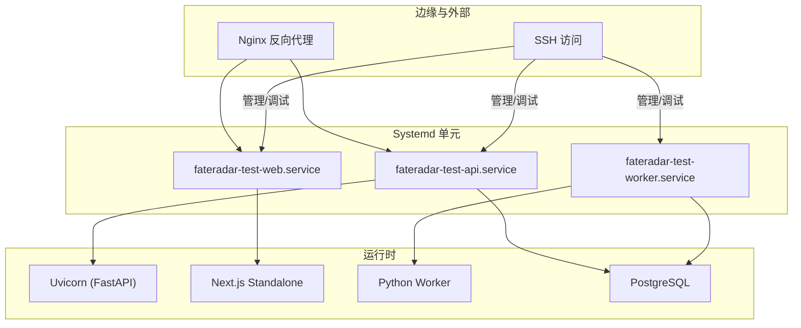
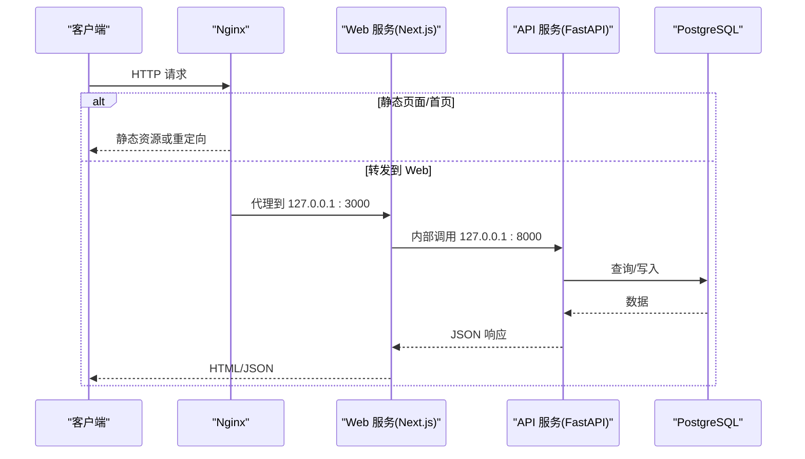
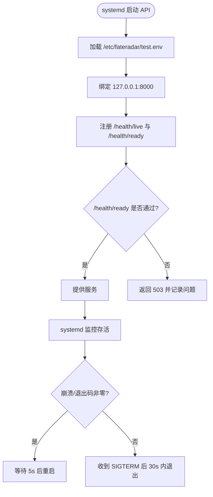
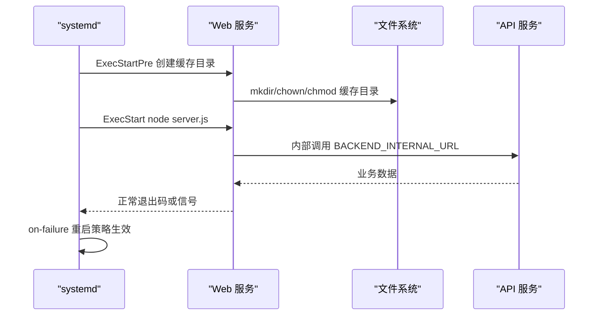
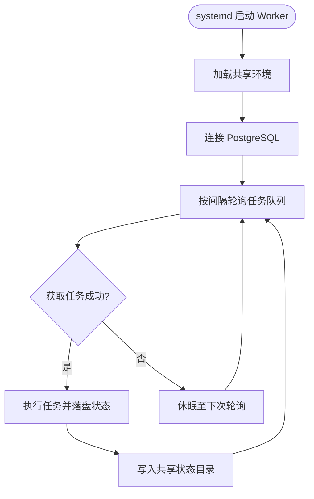
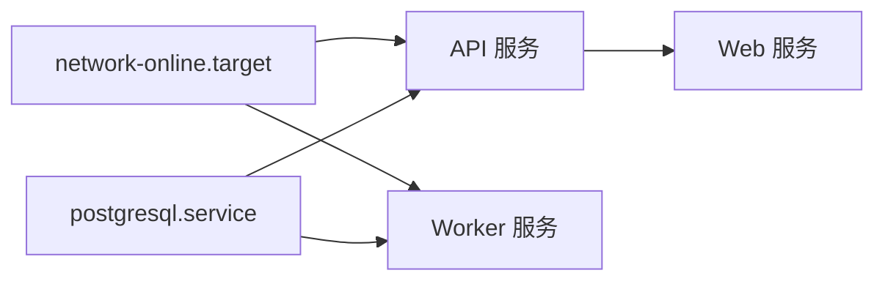
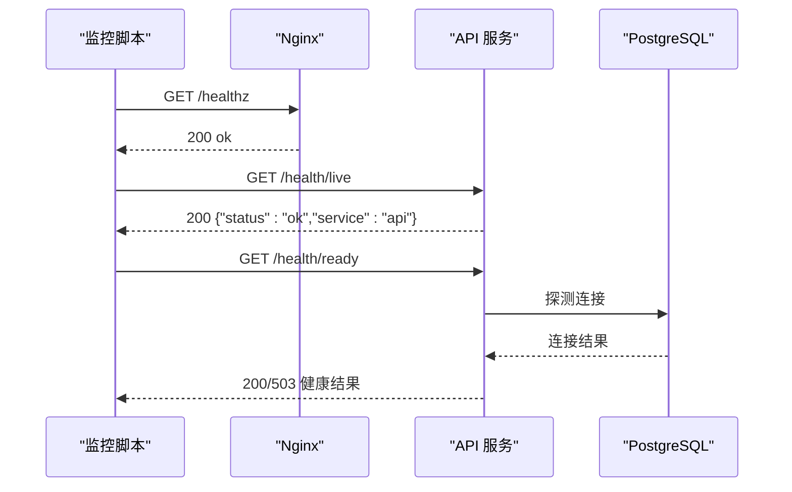
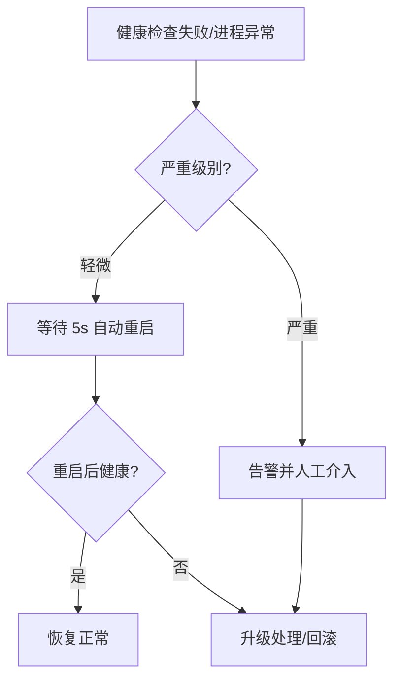

# 服务管理

<cite>
**本文引用的文件**
- [infra/systemd/fateradar-test-api.service](file://infra/systemd/fateradar-test-api.service)
- [infra/systemd/fateradar-test-web.service](file://infra/systemd/fateradar-test-web.service)
- [infra/systemd/fateradar-test-worker.service](file://infra/systemd/fateradar-test-worker.service)
- [infra/ssh/99-fateradar-hardening.conf](file://infra/ssh/99-fateradar-hardening.conf)
- [infra/nginx/fateradar.conf](file://infra/nginx/fateradar.conf)
- [backend/app/api/health.py](file://backend/app/api/health.py)
- [contracts/schemas/health.schema.json](file://contracts/schemas/health.schema.json)
- [infra/letsencrypt/reload-nginx.sh](file://infra/letsencrypt/reload-nginx.sh)
- [infra/fateradar-test.env.example](file://infra/fateradar-test.env.example)
- [infra/TEST_SERVER_RUNBOOK.md](file://infra/TEST_SERVER_RUNBOOK.md)
</cite>

## 目录
1. [简介](#简介)
2. [项目结构](#项目结构)
3. [核心组件](#核心组件)
4. [架构总览](#架构总览)
5. [详细组件分析](#详细组件分析)
6. [依赖与启动顺序](#依赖与启动顺序)
7. [日志轮转与日志管理](#日志轮转与日志管理)
8. [服务监控与健康检查](#服务监控与健康检查)
9. [SSH 安全加固](#ssh-安全加固)
10. [故障恢复与灾难恢复](#故障恢复与灾难恢复)
11. [性能与资源限制建议](#性能与资源限制建议)
12. [排障指南](#排障指南)
13. [结论](#结论)

## 简介
本文件面向运维与平台工程人员，系统化说明基于 Systemd 的服务管理方案。内容覆盖进程守护、自动重启、资源隔离与安全加固；对比 API、Web、Worker 三类服务的配置差异；明确服务启动顺序与依赖关系；给出日志轮转策略建议；提供 systemctl 命令与自定义健康检查脚本的监控方法；并包含 SSH 安全加固、故障恢复与灾难恢复策略。

## 项目结构
与“服务管理”直接相关的目录与文件：
- infra/systemd：三个 Systemd 单元文件（API、Web、Worker）
- infra/nginx：Nginx 反向代理与健康探针入口
- backend/app/api/health.py：应用层健康检查端点
- contracts/schemas/health.schema.json：健康响应契约
- infra/ssh/99-fateradar-hardening.conf：SSH 加固片段
- infra/letsencrypt/reload-nginx.sh：证书重载后 reload Nginx 的脚本
- infra/fateradar-test.env.example：API/Worker 共享的环境变量模板
- infra/TEST_SERVER_RUNBOOK.md：部署验收与 systemctl 使用示例

图表来源
- [infra/systemd/fateradar-test-api.service:12-55](file://infra/systemd/fateradar-test-api.service#L12-L55)
- [infra/systemd/fateradar-test-web.service:15-63](file://infra/systemd/fateradar-test-web.service#L15-L63)
- [infra/systemd/fateradar-test-worker.service:16-59](file://infra/systemd/fateradar-test-worker.service#L16-L59)
- [infra/nginx/fateradar.conf:1-59](file://infra/nginx/fateradar.conf#L1-L59)

章节来源
- [infra/systemd/fateradar-test-api.service:12-55](file://infra/systemd/fateradar-test-api.service#L12-L55)
- [infra/systemd/fateradar-test-web.service:15-63](file://infra/systemd/fateradar-test-web.service#L15-L63)
- [infra/systemd/fateradar-test-worker.service:16-59](file://infra/systemd/fateradar-test-worker.service#L16-L59)
- [infra/nginx/fateradar.conf:1-59](file://infra/nginx/fateradar.conf#L1-L59)

## 核心组件
- API 服务（FastAPI/Uvicorn）
  - 以 simple 类型运行，监听 127.0.0.1:8000
  - 依赖 PostgreSQL，要求网络就绪与数据库可用
  - 启用严格系统调用与内存执行保护（MemoryDenyWriteExecute=true）
  - 通过 EnvironmentFile 加载 /etc/fateradar/test.env
- Web 服务（Next.js Standalone）
  - 以 Node 运行 server.js，监听 127.0.0.1:3000
  - 依赖 API 服务（Wants/After），构建时内联后端地址
  - 仅允许对 .next/cache 写操作，其他路径只读
  - 未启用 MemoryDenyWriteExecute（V8 JIT 需要可写可执行映射）
- Worker 服务（后台任务消费者）
  - 单副本设计，通过 PostgreSQL 行级锁避免重复消费
  - 与 API 共享同一环境文件，读取共享状态目录
  - 启用 MemoryDenyWriteExecute=true，并对运行时状态目录开放写入

章节来源
- [infra/systemd/fateradar-test-api.service:19-52](file://infra/systemd/fateradar-test-api.service#L19-L52)
- [infra/systemd/fateradar-test-web.service:20-60](file://infra/systemd/fateradar-test-web.service#L20-L60)
- [infra/systemd/fateradar-test-worker.service:23-56](file://infra/systemd/fateradar-test-worker.service#L23-L56)
- [infra/fateradar-test.env.example:1-45](file://infra/fateradar-test.env.example#L1-L45)

## 架构总览
下图展示从客户端到各服务的请求路径与依赖关系，以及健康检查入口。

图表来源
- [infra/nginx/fateradar.conf:21-58](file://infra/nginx/fateradar.conf#L21-L58)
- [infra/systemd/fateradar-test-web.service:17-30](file://infra/systemd/fateradar-test-web.service#L17-L30)
- [infra/systemd/fateradar-test-api.service:14-26](file://infra/systemd/fateradar-test-api.service#L14-L26)

## 详细组件分析

### API 服务（FastAPI/Uvicorn）
- 进程模型：Type=simple，由 systemd 直接管理生命周期
- 启动参数：绑定 127.0.0.1:8000，工作目录为后端发布根
- 重启策略：on-failure，失败后等待 5s 重试，优雅停止超时 30s
- 安全加固：无新特权、私有临时目录、严格系统保护、限制地址族、原生系统调用架构、禁止 W^X
- 环境变量：通过 EnvironmentFile 注入，含数据库连接、信任代理、加密密钥等
- 健康检查：暴露 /health/live 与 /health/ready，后者校验数据库可达性

图表来源
- [infra/systemd/fateradar-test-api.service:19-52](file://infra/systemd/fateradar-test-api.service#L19-L52)
- [backend/app/api/health.py:11-36](file://backend/app/api/health.py#L11-L36)

章节来源
- [infra/systemd/fateradar-test-api.service:12-55](file://infra/systemd/fateradar-test-api.service#L12-L55)
- [backend/app/api/health.py:11-36](file://backend/app/api/health.py#L11-L36)
- [infra/fateradar-test.env.example:13-45](file://infra/fateradar-test.env.example#L13-L45)

### Web 服务（Next.js Standalone）
- 进程模型：Type=simple，Node 运行 server.js
- 启动前准备：创建并设置 .next/cache 权限，确保缓存可写
- 启动参数：NODE_ENV=production，HOSTNAME 与 PORT，BACKEND_INTERNAL_URL 指向 API
- 重启策略：on-failure，失败后等待 5s 重试，优雅停止超时 30s
- 安全加固：与 API 类似，但保留 V8 JIT 所需的可写可执行映射（未启用 MemoryDenyWriteExecute）
- 依赖：Wants/After fateradar-test-api.service，确保 API 先于 Web 启动

图表来源
- [infra/systemd/fateradar-test-web.service:20-37](file://infra/systemd/fateradar-test-web.service#L20-L37)
- [infra/systemd/fateradar-test-web.service:41-60](file://infra/systemd/fateradar-test-web.service#L41-L60)

章节来源
- [infra/systemd/fateradar-test-web.service:15-63](file://infra/systemd/fateradar-test-web.service#L15-L63)

### Worker 服务（后台任务消费者）
- 进程模型：Type=simple，Python 模块 worker.main，带 --poll-interval 参数
- 副本数：单副本设计，避免并发竞争；任务领取使用数据库行级锁
- 重启策略：on-failure，失败后等待 5s 重试，优雅停止超时 30s
- 安全加固：与 API 一致，启用 MemoryDenyWriteExecute=true
- 状态目录：ReadWritePaths 开放 mingli-state 与 mingli-runtime 两个共享目录

图表来源
- [infra/systemd/fateradar-test-worker.service:23-34](file://infra/systemd/fateradar-test-worker.service#L23-L34)
- [infra/systemd/fateradar-test-worker.service:36-56](file://infra/systemd/fateradar-test-worker.service#L36-L56)

章节来源
- [infra/systemd/fateradar-test-worker.service:16-59](file://infra/systemd/fateradar-test-worker.service#L16-L59)

## 依赖与启动顺序
- 网络与数据库
  - API 与 Worker 均声明 Wants/After network-online.target，并要求 Requires postgresql.service
  - 这保证网络就绪且数据库服务存在后再启动应用
- Web 对 API 的依赖
  - Web 声明 Wants/After fateradar-test-api.service，确保 API 先于 Web 启动
- 安装目标
  - 三者均 WantedBy multi-user.target，开机自启

图表来源
- [infra/systemd/fateradar-test-api.service:12-17](file://infra/systemd/fateradar-test-api.service#L12-L17)
- [infra/systemd/fateradar-test-web.service:15-18](file://infra/systemd/fateradar-test-web.service#L15-L18)
- [infra/systemd/fateradar-test-worker.service:16-21](file://infra/systemd/fateradar-test-worker.service#L16-L21)

章节来源
- [infra/systemd/fateradar-test-api.service:12-17](file://infra/systemd/fateradar-test-api.service#L12-L17)
- [infra/systemd/fateradar-test-web.service:15-18](file://infra/systemd/fateradar-test-web.service#L15-L18)
- [infra/systemd/fateradar-test-worker.service:16-21](file://infra/systemd/fateradar-test-worker.service#L16-L21)

## 日志轮转与日志管理
- 当前仓库未包含 logrotate 配置或 journald 过滤规则
- 建议实践
  - 将应用输出到标准输出/错误，交由 journald 统一收集
  - 使用 journalctl 进行滚动与查询，结合 --since/--until 筛选时间范围
  - 如需磁盘空间控制，可在 journald 中配置 MaxSize/MaxRetentionTime 等参数
  - 若需按应用分片，可通过 systemd 的 StandardOutput/StandardError 配合 JournalStream 实现
- 注意
  - 当前单元未显式配置日志输出目标，默认走 journald
  - 生产环境建议结合集中式日志系统与告警规则

[本节为通用指导，不直接分析具体文件]

## 服务监控与健康检查
- 系统层监控
  - 使用 systemctl is-active/status 查看单元状态
  - 使用 journalctl -u <unit> 查看实时日志
- 应用层健康检查
  - API 提供 /health/live 与 /health/ready，后者用于探测数据库可用性
  - 健康响应遵循 contracts/schemas/health.schema.json 的结构约束
- Nginx 健康探针
  - /healthz 返回 200 ok，便于边缘层快速判断服务可达
- 推荐脚本思路
  - 周期性 curl 调用 /health/live 与 /health/ready，记录响应时间与状态码
  - 当连续失败超过阈值时触发告警或自动重启
  - 结合 systemctl restart 进行自愈

图表来源
- [infra/nginx/fateradar.conf:21-25](file://infra/nginx/fateradar.conf#L21-L25)
- [backend/app/api/health.py:11-36](file://backend/app/api/health.py#L11-L36)
- [contracts/schemas/health.schema.json:1-12](file://contracts/schemas/health.schema.json#L1-L12)

章节来源
- [infra/TEST_SERVER_RUNBOOK.md:244-265](file://infra/TEST_SERVER_RUNBOOK.md#L244-L265)
- [infra/nginx/fateradar.conf:21-25](file://infra/nginx/fateradar.conf#L21-L25)
- [backend/app/api/health.py:11-36](file://backend/app/api/health.py#L11-L36)
- [contracts/schemas/health.schema.json:1-12](file://contracts/schemas/health.schema.json#L1-L12)

## SSH 安全加固
- 启用公钥认证，禁用密码与键盘交互认证
- 禁止 root 密码登录，仅允许密钥方式
- 建议补充
  - 限制允许登录的用户组
  - 指定允许的公钥来源或 IP 白名单
  - 使用强加密算法与协议版本
  - 结合防火墙限制 SSH 端口访问来源

章节来源
- [infra/ssh/99-fateradar-hardening.conf:1-5](file://infra/ssh/99-fateradar-hardening.conf#L1-L5)

## 故障恢复与灾难恢复
- 自动恢复
  - 三个服务均配置 Restart=on-failure 与 RestartSec=5s，崩溃后自动重启
  - 优雅停止 TimeoutStopSec=30s，确保资源释放
- 健康驱动恢复
  - 当 /health/ready 持续失败，外部监控系统可触发 systemctl restart 或更高级的自愈流程
- 回滚与重建
  - 通过替换 /opt/fateradar/current 软链或目录完成回滚
  - 重新加载 systemd 并重启相关服务
- 证书与 Nginx
  - 证书更新后通过 reload-nginx.sh 执行 nginx -t && systemctl reload nginx，保证平滑重载

图表来源
- [infra/systemd/fateradar-test-api.service:27-29](file://infra/systemd/fateradar-test-api.service#L27-L29)
- [infra/systemd/fateradar-test-web.service:34-36](file://infra/systemd/fateradar-test-web.service#L34-L36)
- [infra/systemd/fateradar-test-worker.service:31-33](file://infra/systemd/fateradar-test-worker.service#L31-L33)
- [infra/letsencrypt/reload-nginx.sh:1-5](file://infra/letsencrypt/reload-nginx.sh#L1-L5)

章节来源
- [infra/systemd/fateradar-test-api.service:27-29](file://infra/systemd/fateradar-test-api.service#L27-L29)
- [infra/systemd/fateradar-test-web.service:34-36](file://infra/systemd/fateradar-test-web.service#L34-L36)
- [infra/systemd/fateradar-test-worker.service:31-33](file://infra/systemd/fateradar-test-worker.service#L31-L33)
- [infra/letsencrypt/reload-nginx.sh:1-5](file://infra/letsencrypt/reload-nginx.sh#L1-L5)

## 性能与资源限制建议
- 当前单元未显式设置 CPU/Memory 配额，建议在生产环境按需添加
  - LimitCPU、LimitNOFILE、LimitMEMLOCK 等
  - MemoryMax、TasksMax 等
- I/O 与网络
  - 合理设置 KeepAlive、连接池与超时参数
  - 针对高并发场景评估 Worker 并发度与数据库连接上限
- 缓存与磁盘
  - Web 的 .next/cache 已单独授权读写，避免全量目录写放大
  - 关注磁盘空间与日志大小，结合 journald 或日志系统做容量规划

[本节为通用指导，不直接分析具体文件]

## 排障指南
- 常用命令
  - 查看状态：systemctl status fateradar-test-api fateradar-test-web fateradar-test-worker
  - 查看日志：journalctl -u fateradar-test-api -f
  - 重启服务：systemctl restart fateradar-test-api
  - 验证健康：curl -fsS http://127.0.0.1:8080/api/v1/health/live 与 /health/ready
- 常见问题定位
  - 数据库不可用：检查 postgresql.service 状态与 MINGLI_DATABASE_URL
  - Web 无法访问：确认 fateradar-test-api.service 已启动且端口未被占用
  - 权限问题：检查 /opt/fateradar/current 与共享状态目录的属主与权限
  - 证书重载：使用 reload-nginx.sh 执行测试与重载
- 参考验收步骤
  - 见 TEST_SERVER_RUNBOOK.md 中的四层验收清单与 systemctl 使用示例

章节来源
- [infra/TEST_SERVER_RUNBOOK.md:244-265](file://infra/TEST_SERVER_RUNBOOK.md#L244-L265)
- [infra/letsencrypt/reload-nginx.sh:1-5](file://infra/letsencrypt/reload-nginx.sh#L1-L5)

## 结论
本方案通过 Systemd 统一管理 API、Web、Worker 三类服务，利用严格的进程隔离与安全加固提升稳定性与安全性；通过分层健康检查与自动化重启实现高可用；借助 Nginx 作为边缘入口提供统一的对外接口与探针。建议在后续生产环境中完善资源限制、日志轮转与集中化监控告警，进一步提升系统的可观测性与可维护性。